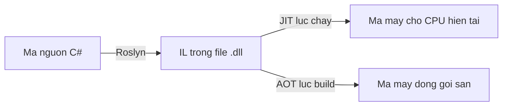

# 2.10 — 8. .NET Runtime và Ecosystem

> Nguồn: https://tiennhm.io.vn/en/docs/dotnet-backend-zero-to-senior/stage-01-foundation/module-02-computer-science-basics/2.10-dotnet-runtime-and-ecosystem
> Từ mã C# tới mã máy: IL, JIT, AOT. Cách GC hoạt động và vì sao nó ngốn 96% RAM container dù app đang rảnh. Kèm lịch phát hành LTS và cách chọn thư viện NuGet.

> Code C# của bạn không chạy trực tiếp. Nó được biên dịch thành **IL** — một ngôn ngữ trung gian — rồi tới lúc chạy mới được **JIT** dịch tiếp thành mã máy của đúng CPU đang chạy. Hai hệ quả đáng nhớ: lần gọi đầu tiên của một phương thức luôn chậm hơn các lần sau, và cùng một file `.dll` chạy được trên mọi nền tảng. Phần thứ hai của bài là **bộ thu gom rác**, nơi có một hành vi khiến rất nhiều người hoảng: .NET ở chế độ Server GC **cố tình giữ lại bộ nhớ đã cấp phát**, nên biểu đồ RAM của container leo tới 96% rồi đứng yên — trong khi ứng dụng hoàn toàn khoẻ mạnh.

## Mục tiêu bài học

Sau bài này bạn có thể:

- Mô tả đường đi từ mã C# tới mã máy, và vị trí của IL, JIT, AOT.
- Giải thích thế hệ của GC và vì sao đối tượng sống ngắn lại rẻ.
- Nêu khác biệt giữa Workstation GC và Server GC, và khi nào đổi.
- Chọn phiên bản .NET theo lịch LTS thay vì theo số mới nhất.
- Đánh giá một gói NuGet trước khi đưa vào dự án.

## Nội dung bài học

### 2.10.1 — Từ C# tới mã máy



**Bước 1 — biên dịch.** `dotnet build` dùng Roslyn dịch C# thành **IL (Intermediate Language)**, đóng vào file `.dll`. IL không phụ thuộc CPU hay hệ điều hành.

**Bước 2 — JIT.** Lúc chạy, mỗi phương thức được dịch sang mã máy **ngay trước lần gọi đầu tiên**, rồi kết quả được giữ lại cho các lần sau.

Hai điều suy ra từ đây:

- **Lần gọi đầu luôn chậm hơn.** Đây là một phần của hiện tượng "khởi động nguội", và là lý do endpoint đầu tiên sau khi deploy hay có độ trễ cao bất thường.
- **JIT biết CPU thật.** Nó có thể dùng tập lệnh mà máy đang chạy hỗ trợ — điều mà biên dịch sẵn từ trước không làm được.

**Native AOT** là hướng ngược lại: dịch thẳng sang mã máy lúc build. Đổi lấy khởi động gần như tức thì và bộ nhớ thấp, nhưng mất khả năng dùng reflection tự do và phải cố định nền tảng đích. Hợp với công cụ dòng lệnh và serverless; xem [Native AOT deployment](https://learn.microsoft.com/en-us/dotnet/core/deploying/native-aot/).

### 2.10.2 — Bộ thu gom rác

Bạn không gọi `free()` trong C#. GC tự tìm những đối tượng không còn ai tham chiếu tới và thu hồi.

Nó chia bộ nhớ thành **ba thế hệ**, dựa trên một quan sát: **phần lớn đối tượng chết rất trẻ**.

| Thế hệ | Chứa gì | Dọn thường xuyên | Chi phí |
|---|---|---|---|
| Gen 0 | Đối tượng mới sinh | Rất thường xuyên | Rất rẻ |
| Gen 1 | Sống sót qua một lần dọn Gen 0 | Thỉnh thoảng | Trung bình |
| Gen 2 | Sống lâu | Hiếm | **Đắt** |

Đối tượng lớn hơn 85.000 byte đi thẳng vào **Large Object Heap**, vốn được dọn cùng Gen 2 và không được nén mặc định.

Hệ quả thực tế: **đối tượng sống ngắn gần như miễn phí**. Tạo nhiều object nhỏ trong một request rồi vứt đi là chuyện bình thường. Thứ gây đau là đối tượng sống lâu vô ý — một cache tĩnh phình mãi, một sự kiện quên gỡ đăng ký — vì chúng leo lên Gen 2 và làm mỗi lần dọn Gen 2 nặng thêm.

Chi tiết: [Fundamentals of garbage collection](https://learn.microsoft.com/en-us/dotnet/standard/garbage-collection/fundamentals).

### 2.10.3 — Workstation GC và Server GC

Đây là chỗ sinh ra một trong những báo động giả phổ biến nhất khi chạy .NET trong container.

| | Workstation GC | Server GC |
|---|---|---|
| Số heap | 1 | Một heap cho mỗi CPU |
| Mục tiêu | Độ trễ thấp | Thông lượng cao |
| Bộ nhớ dùng | Ít | **Nhiều, và giữ lại** |
| Mặc định cho | Ứng dụng desktop | **ASP.NET Core** |

Server GC cố tình **không trả bộ nhớ lại cho hệ điều hành ngay**, vì trả rồi xin lại rất tốn. Kết quả: biểu đồ RAM của container leo lên sát giới hạn rồi nằm yên, kể cả khi ứng dụng đang rảnh.

Nhìn vào dashboard thì trông như rò rỉ bộ nhớ. Nó **không phải** rò rỉ. Nhưng nó vẫn có thể giết container, vì orchestrator nhìn con số đó và ra tay.

Bài [Vì sao .NET ngốn 96% RAM container dù app đang rảnh?](https://tiennhm.io.vn/blog/dotnet-workstation-gc-giam-ram-container) đi vào chi tiết và đo tác động của việc chuyển sang Workstation GC:

```xml
<PropertyGroup>
  <ServerGarbageCollection>false</ServerGarbageCollection>
  <ConcurrentGarbageCollection>true</ConcurrentGarbageCollection>
</PropertyGroup>
```

Đây là đánh đổi có thật — bớt bộ nhớ, giảm thông lượng — nên hãy đo trước khi đổi. Nhưng với container bị giới hạn RAM chặt, nó thường là lựa chọn đúng.

### 2.10.4 — SDK, Runtime, và cách đóng gói

```
SDK     = công cụ build + runtime.  Cần trên máy lập trình viên và máy CI.
Runtime = chỉ đủ để chạy.           Cần trên máy chủ production.
```

Hai cách đóng gói khi publish:

| | Framework-dependent | Self-contained |
|---|---|---|
| Kích thước | Nhỏ (vài MB) | Lớn (60 MB trở lên) |
| Yêu cầu máy đích | Phải cài .NET runtime | Không cần gì |
| Vá lỗi bảo mật | Cập nhật runtime là xong | **Phải build lại và deploy lại** |

Dòng cuối là điều người ta hay quên. Self-contained tiện khi triển khai, nhưng mỗi lỗ hổng trong runtime đều bắt bạn phát hành lại ứng dụng.

Xem [.NET application deployment](https://learn.microsoft.com/en-us/dotnet/core/deploying/).

### 2.10.5 — Chọn phiên bản: LTS hay mới nhất

.NET phát hành **mỗi tháng 11**, xen kẽ hai loại:

- **LTS** (số chẵn: 8, 10...) — hỗ trợ **3 năm**.
- **STS** (số lẻ: 9, 11...) — hỗ trợ **18 tháng**.

Với hệ thống nghiệp vụ chạy nhiều năm, chọn **LTS**. Với dự án cần tính năng mới nhất và sẵn sàng nâng cấp mỗi năm, STS cũng được — miễn là đội biết rằng hạn hỗ trợ đến rất nhanh.

Lịch chính thức: [.NET support policy](https://dotnet.microsoft.com/en-us/platform/support/policy/dotnet-core). Chạy phiên bản đã hết hỗ trợ nghĩa là không còn nhận bản vá bảo mật — đó là rủi ro, không phải sự bất tiện.

### 2.10.6 — Hệ sinh thái

| Tầng | Thành phần |
|---|---|
| Runtime | CLR, GC, JIT |
| Thư viện cơ sở | `System.*`, LINQ, `System.Text.Json` |
| Web | ASP.NET Core, SignalR, Minimal API |
| Dữ liệu | Entity Framework Core, Dapper |
| Framework ứng dụng | ABP Framework, Orchard Core |
| Kiểm thử | xUnit, NUnit, Moq, Testcontainers |
| Đóng gói | NuGet |

**Đánh giá một gói NuGet trước khi thêm vào:** mỗi gói là một phụ thuộc bạn phải bảo trì lâu dài.

- Lần phát hành gần nhất cách đây bao lâu? Hai năm không cập nhật là dấu hiệu xấu.
- Có hỗ trợ phiên bản .NET bạn đang dùng không?
- Giấy phép có dùng được trong bối cảnh thương mại không?
- Nó kéo theo bao nhiêu phụ thuộc gián tiếp?
- Việc này có thể viết bằng thư viện chuẩn trong 50 dòng không?

Câu cuối đáng hỏi nhất. Một phụ thuộc là một thứ có thể hỏng, có thể có lỗ hổng, và có thể bị bỏ rơi.

### 2.10.7 — Rà lại dự án của bạn

**Danh sách rà soát runtime và hệ sinh thái**

- [ ] Phiên bản .NET đang dùng vẫn còn trong thời hạn hỗ trợ.
- [ ] Dự án chạy trong container đã cân nhắc Workstation GC so với Server GC, có đo trước khi chọn.
- [ ] Không có cache tĩnh nào phình vô hạn, và mọi đăng ký sự kiện đều được gỡ.
- [ ] Máy chủ production chỉ cài runtime, không cài SDK.
- [ ] Nếu dùng self-contained, có quy trình build lại khi runtime có bản vá bảo mật.
- [ ] Mọi gói NuGet trong dự án đều còn được bảo trì và tương thích phiên bản đang dùng.
- [ ] Đã đo thời gian khởi động nguội, và cân nhắc AOT nếu nó là vấn đề.

## Bài tập áp dụng

1. **Nhìn thấy IL.** Build một ứng dụng console nhỏ, mở file `.dll` bằng ILSpy hoặc `ildasm`. Tìm phương thức `Main` và đọc IL của nó. Đối chiếu từng dòng với mã C# gốc.

2. **Đo khởi động nguội.** Gọi cùng một endpoint 10 lần liên tiếp ngay sau khi khởi động ứng dụng, ghi thời gian từng lần. Vẽ biểu đồ và chỉ ra ảnh hưởng của JIT ở vài lần đầu.

3. **So sánh hai chế độ GC.** Chạy cùng một ứng dụng với `ServerGarbageCollection` bật và tắt, trong một container giới hạn 512 MB. So sánh mức RAM khi nhàn rỗi và thông lượng khi tải cao.

## Tự kiểm tra

### Mã C# đi qua những bước nào trước khi thành mã máy?

Roslyn biên dịch C# thành IL và đóng vào file .dll; IL không phụ thuộc CPU hay hệ điều hành. Lúc chạy, JIT dịch từng phương thức sang mã máy ngay trước lần gọi đầu tiên rồi giữ lại kết quả. Vì vậy lần gọi đầu luôn chậm hơn, và cùng một .dll chạy được trên nhiều nền tảng.

### Vì sao đối tượng sống ngắn lại rẻ?

Vì GC chia bộ nhớ thành ba thế hệ dựa trên quan sát rằng phần lớn đối tượng chết rất trẻ. Gen 0 được dọn rất thường xuyên và rất rẻ. Thứ đắt là Gen 2, nơi chứa đối tượng sống lâu. Nên tạo nhiều object nhỏ trong một request rồi vứt đi là bình thường; thứ gây đau là cache tĩnh phình mãi hoặc sự kiện quên gỡ đăng ký.

### Vì sao container .NET hay hiển thị mức RAM rất cao?

Vì ASP.NET Core mặc định dùng Server GC, chế độ này tạo một heap cho mỗi CPU và cố tình không trả bộ nhớ lại cho hệ điều hành ngay, do trả rồi xin lại rất tốn. Biểu đồ RAM vì thế leo sát giới hạn rồi nằm yên. Đó không phải rò rỉ, nhưng vẫn có thể khiến orchestrator giết container.

### Khi nào nên chuyển sang Workstation GC?

Khi chạy trong container bị giới hạn RAM chặt và mức bộ nhớ đang là vấn đề thật. Đây là đánh đổi có thật: bớt bộ nhớ nhưng giảm thông lượng, vì chỉ còn một heap thay vì một heap cho mỗi CPU. Nên đo cả hai chỉ số trước khi quyết định.

### Framework-dependent và self-contained khác nhau thế nào?

Framework-dependent cho gói nhỏ vài MB nhưng máy đích phải cài sẵn .NET runtime. Self-contained đóng gói cả runtime nên chạy ở đâu cũng được, đổi lại nặng hơn 60 MB và quan trọng hơn: mỗi lỗ hổng bảo mật trong runtime đều bắt bạn build lại và deploy lại ứng dụng.

### Nên chọn phiên bản .NET nào?

Với hệ thống nghiệp vụ chạy nhiều năm thì chọn bản LTS, tức các số chẵn, được hỗ trợ 3 năm. Bản STS số lẻ chỉ được hỗ trợ 18 tháng. Chạy phiên bản đã hết hỗ trợ nghĩa là không còn nhận bản vá bảo mật, nên đó là rủi ro chứ không chỉ là bất tiện.

## Kết luận

Ba điều đáng nhớ nhất:

1. **JIT giải thích vì sao lần gọi đầu luôn chậm.** Biết điều này thì không còn hoảng khi thấy request đầu tiên sau deploy có độ trễ cao.
2. **RAM cao trong container .NET thường không phải rò rỉ.** Đó là Server GC đang giữ bộ nhớ đúng như thiết kế.
3. **Mỗi gói NuGet là một cam kết bảo trì.** Câu hỏi đáng giá nhất trước khi thêm: thư viện chuẩn làm được việc này không?

## Tham khảo

- [Introduction to .NET](https://learn.microsoft.com/en-us/dotnet/core/introduction) — tổng quan nền tảng
- [Fundamentals of garbage collection](https://learn.microsoft.com/en-us/dotnet/standard/garbage-collection/fundamentals) — thế hệ và LOH
- [.NET application deployment](https://learn.microsoft.com/en-us/dotnet/core/deploying/) — framework-dependent và self-contained
- [Native AOT deployment](https://learn.microsoft.com/en-us/dotnet/core/deploying/native-aot/)
- [.NET support policy](https://dotnet.microsoft.com/en-us/platform/support/policy/dotnet-core) — lịch LTS và STS
- [.NET CLI](https://learn.microsoft.com/en-us/dotnet/core/tools/) — `dotnet build`, `publish`, `add package`

## Điều hướng

- **Bài trước:** [2.9 — 7. Hosting và Cloud cơ bản](2.9-hosting-and-cloud-co-ban.mdx)
- **Bài tiếp theo:** [2.11 — Mở rộng và đào sâu](2.11-advanced-notes.mdx)
- **Về module:** [Trang mục lục](./)

## Bài liên quan

- [Vì sao .NET ngốn 96% RAM container dù app đang rảnh? Server GC và cách giảm 65% bộ nhớ](https://tiennhm.io.vn/blog/dotnet-workstation-gc-giam-ram-container) — Một container .NET 9 chiếm 987 MiB trên trần 1 GiB dù suốt 2 giờ không có request nào.
