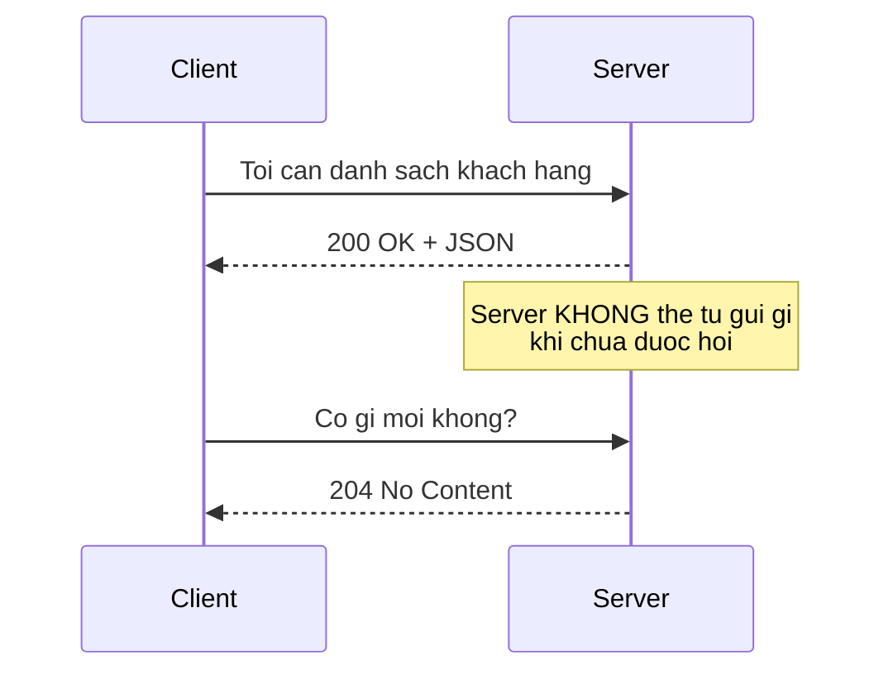
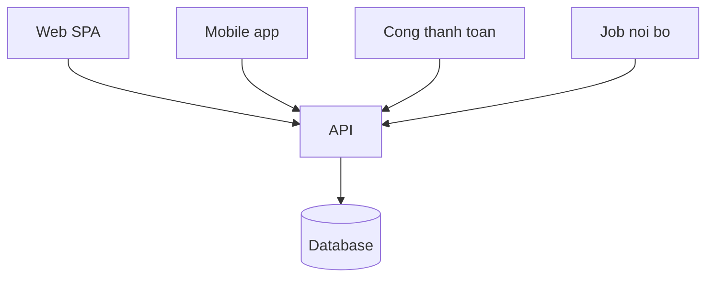

# 2.4 — 2. Client - Server Model

> Nguồn: https://tiennhm.io.vn/en/docs/dotnet-backend-zero-to-senior/stage-01-foundation/module-02-computer-science-basics/2.4-client
> Ai gọi, ai trả lời, và vì sao HTTP không nhớ gì giữa hai request. Kèm nguyên tắc quan trọng nhất của backend: mọi thứ đến từ client đều là dữ liệu do người lạ gửi.

> Mô hình client–server có hai luật chi phối gần như mọi quyết định thiết kế backend. Thứ nhất: **client luôn là bên bắt chuyện** — máy chủ không tự gọi tới trình duyệt được, và đó là lý do tồn tại của polling, WebSocket và SignalR. Thứ hai, và quan trọng hơn: **HTTP không nhớ gì giữa hai request**, nên máy chủ không mặc nhiên biết request này đến từ ai — đó là lý do sinh ra cookie, session và JWT. Cộng thêm một nguyên tắc an toàn không có ngoại lệ: mọi byte đến từ client đều là **dữ liệu do người lạ gửi**, kể cả khi chính bạn viết ra cái client đó.

## Mục tiêu bài học

Sau bài này bạn có thể:

- Giải thích vì sao máy chủ không chủ động gửi dữ liệu tới client được, và ba cách vượt qua giới hạn đó.
- Nêu ý nghĩa của "HTTP là stateless" và hệ quả của nó lên thiết kế đăng nhập.
- Chỉ ra vì sao kiểm tra ở phía client không bao giờ là bảo mật.
- Thiết kế API phục vụ nhiều loại client mà không phá vỡ client cũ.

## Nội dung bài học

### 2.4.1 — Ai bắt chuyện trước



Trong HTTP thuần, **máy chủ không bao giờ nói trước**. Nó chỉ trả lời. Muốn đẩy dữ liệu xuống client theo thời gian thực thì phải dùng một trong ba cách:

| Cách | Nguyên lý | Dùng khi |
|---|---|---|
| **Polling** | Client hỏi lại theo chu kỳ | Đơn giản, dữ liệu đổi chậm |
| **Server-Sent Events** | Một kết nối mở, server đẩy một chiều | Thông báo, luồng sự kiện |
| **WebSocket** | Kết nối hai chiều, giữ mở | Chat, cộng tác thời gian thực |

Trong .NET, cả ba đều gói lại trong SignalR, và nó tự chọn cách tốt nhất mà môi trường cho phép — chủ đề của Module 11.

### 2.4.2 — HTTP không nhớ gì

Đây là đặc tính bị bỏ qua nhiều nhất, và nó giải thích rất nhiều thứ.

> Mỗi request HTTP là một tờ giấy trắng. Máy chủ không biết request này đến từ ai, trừ khi chính request đó mang theo bằng chứng.

Vì thế mới có:

```http
# Request 1 — đăng nhập
POST /api/auth/login
{ "email": "a@company.com", "password": "..." }

→ 200 OK
  { "token": "eyJhbGciOi..." }

# Request 2 — hoàn toàn độc lập với request 1
GET /api/customers
Authorization: Bearer eyJhbGciOi...
   ↑ phải tự mang theo bằng chứng, server không tự nhớ
```

Không có dòng `Authorization` đó, máy chủ coi bạn là người lạ — kể cả khi bạn vừa đăng nhập một giây trước.

Đánh đổi của tính stateless: máy chủ không cần nhớ gì, nên **đặt bao nhiêu máy chủ cũng được** và request đi vào máy nào cũng xử lý được như nhau. Đó là nền tảng của việc mở rộng ngang. Cái giá là mỗi request nặng hơn vì phải mang theo thông tin xác thực.

### 2.4.3 — Client không đáng tin. Không có ngoại lệ.

Đây là điều quan trọng nhất trong cả bài.

```javascript
// Phía client — JavaScript trong trình duyệt
if (user.role === 'admin') {
    showDeleteButton();       // chỉ là TRẢI NGHIỆM NGƯỜI DÙNG
}
```

Đoạn trên **không phải bảo mật**. Nó chỉ là ẩn một cái nút. Người dùng có thể mở DevTools, sửa biến, hoặc bỏ qua giao diện hoàn toàn:

```bash
curl -X DELETE https://api.company.com/customers/42 \
     -H "Authorization: Bearer <token của tài khoản thường>"
```

Nếu máy chủ không tự kiểm tra quyền, bản ghi đó bị xoá.

Danh sách những thứ **không bao giờ** được tin, dù client là do chính bạn viết:

- Giá tiền gửi lên từ giỏ hàng — luôn tính lại từ database.
- `userId` trong body request — luôn lấy từ token đã xác thực.
- Kết quả kiểm tra form phía client — luôn kiểm tra lại ở máy chủ.
- Việc một nút bị ẩn — luôn kiểm tra quyền ở endpoint.

Lỗ hổng sinh ra từ việc tin `id` mà client gửi lên có tên riêng: **IDOR**. Bài [Đổi id trên URL ra dữ liệu người khác](https://tiennhm.io.vn/blog/idor-broken-access-control-aspnet-core) mổ xẻ nó và chỉ cách chặn ở một tầng duy nhất. Đây cũng là hạng mục đứng đầu [OWASP Top 10](https://owasp.org/Top10/).

### 2.4.4 — Một máy chủ, nhiều loại client



Hệ quả thiết kế: **không được đổi API theo kiểu phá vỡ tương thích**, vì bạn không ép được người dùng cập nhật ứng dụng di động ngay hôm nay.

Đổi an toàn và đổi phá vỡ:

| An toàn | Phá vỡ |
|---|---|
| Thêm trường mới vào response | Xoá hoặc đổi tên trường đang có |
| Thêm endpoint mới | Đổi kiểu dữ liệu của trường |
| Thêm tham số **tuỳ chọn** | Thêm tham số **bắt buộc** |
| Nới lỏng kiểm tra đầu vào | Siết chặt kiểm tra đầu vào |

Khi buộc phải phá vỡ, cách làm là đánh phiên bản (`/api/v2/customers`) và giữ bản cũ sống tới khi không còn ai dùng.

### 2.4.5 — Client dày hay client mỏng

| | Client mỏng (SSR) | Client dày (SPA) |
|---|---|---|
| Nơi render | Máy chủ | Trình duyệt |
| Lần tải đầu | Nhanh | Chậm hơn (phải tải bundle JS) |
| Thao tác sau đó | Mỗi lần tải lại trang | Nhanh, chỉ gọi API |
| SEO | Sẵn sàng | Cần xử lý thêm |
| Tải trên máy chủ | Cao hơn | Thấp hơn |

Không có phương án đúng tuyệt đối. Nhưng chú ý dòng SEO: nội dung chỉ render ở client thì crawler phải chạy JavaScript mới thấy — cùng cơ chế khiến sơ đồ Mermaid trong chính trang tài liệu này không xuất hiện trong HTML tĩnh.

### 2.4.6 — Rà lại hệ thống của bạn

**Danh sách rà soát client - server**

- [ ] Mọi endpoint đều tự kiểm tra quyền, không dựa vào việc giao diện đã ẩn nút.
- [ ] userId lấy từ token đã xác thực, không lấy từ body hay query string.
- [ ] Giá tiền và số tiền luôn tính lại ở máy chủ, không nhận từ client.
- [ ] Mọi kiểm tra ở form phía client đều có bản kiểm tra tương ứng ở máy chủ.
- [ ] API chưa từng xoá hay đổi tên trường mà không đánh phiên bản mới.
- [ ] Tính năng thời gian thực dùng SignalR hoặc SSE thay vì polling dày đặc.

## Bài tập áp dụng

1. **Bỏ qua giao diện.** Lấy một chức năng trong dự án chỉ dành cho admin. Đăng nhập bằng tài khoản thường, lấy token, rồi gọi thẳng endpoint đó bằng `curl`. Nếu nó chạy, bạn vừa tìm ra một lỗ hổng thật.

2. **Chứng minh tính stateless.** Gọi một API cần đăng nhập hai lần: một lần có header `Authorization`, một lần không. Quan sát mã trạng thái. Giải thích vì sao máy chủ không "nhớ" bạn giữa hai lần gọi.

3. **Phân loại thay đổi API.** Lấy năm thay đổi gần nhất trong API của bạn và xếp vào bảng ở mục 2.4.4. Với những thay đổi phá vỡ tương thích, trả lời: ứng dụng di động phiên bản cũ có còn chạy được không?

## Tự kiểm tra

### Vì sao máy chủ không tự gửi dữ liệu xuống client được?

Vì trong HTTP, client luôn là bên mở kết nối và đặt câu hỏi; máy chủ chỉ trả lời. Muốn đẩy dữ liệu theo thời gian thực thì phải dùng polling, Server-Sent Events hoặc WebSocket. Trong .NET, SignalR gói cả ba lại và tự chọn cách tốt nhất mà môi trường cho phép.

### HTTP là stateless nghĩa là gì?

Nghĩa là mỗi request độc lập hoàn toàn với request trước, máy chủ không tự nhớ bạn là ai. Vì thế request nào cần xác thực đều phải tự mang theo bằng chứng, thường là cookie hoặc JWT trong header Authorization. Đổi lại, máy chủ không giữ trạng thái nên thêm bao nhiêu máy chủ cũng được — đó là nền tảng của mở rộng ngang.

### Kiểm tra ở phía client có phải là bảo mật không?

Không. Nó chỉ là trải nghiệm người dùng. Người dùng có thể mở DevTools sửa biến, hoặc bỏ qua giao diện hoàn toàn và gọi thẳng API bằng curl. Mọi kiểm tra quyền và kiểm tra dữ liệu phải được làm lại ở máy chủ, kể cả khi client là do chính bạn viết.

### Những dữ liệu nào từ client không bao giờ được tin?

Giá tiền gửi lên từ giỏ hàng, userId trong body request, kết quả kiểm tra form phía client, và việc một nút đã bị ẩn trên giao diện. Giá phải tính lại từ database, userId phải lấy từ token đã xác thực, kiểm tra phải làm lại ở máy chủ, và mọi endpoint phải tự kiểm tra quyền.

### Thay đổi API nào là phá vỡ tương thích?

Xoá hoặc đổi tên trường đang có, đổi kiểu dữ liệu của trường, thêm tham số bắt buộc, và siết chặt kiểm tra đầu vào. Ngược lại, thêm trường mới vào response, thêm endpoint mới, thêm tham số tuỳ chọn và nới lỏng kiểm tra đều an toàn. Khi buộc phải phá vỡ thì đánh phiên bản mới và giữ bản cũ sống tới khi không còn ai dùng.

### IDOR là gì?

Là lỗ hổng xảy ra khi máy chủ nhận một id từ request rồi đọc hoặc sửa bản ghi đó mà không kiểm tra người gọi có quyền với bản ghi hay không. Đổi số trên URL là xem được dữ liệu người khác. Nó thuộc nhóm Broken Access Control, hạng mục đứng đầu OWASP Top 10.

## Kết luận

Ba điều đáng nhớ nhất:

1. **Client luôn hỏi trước.** Mọi tính năng thời gian thực đều là cách đi vòng quanh giới hạn này.
2. **HTTP không nhớ gì, và đó là tính năng.** Nhờ vậy mới mở rộng ngang được; cái giá là mỗi request phải tự mang theo danh tính.
3. **Kiểm tra ở client là giao diện, kiểm tra ở server mới là bảo mật.** Cái nút bị ẩn không chặn được `curl`.

## Tham khảo

- [HTTP — MDN](https://developer.mozilla.org/en-US/docs/Web/HTTP) — mô hình request/response
- [OWASP Top 10](https://owasp.org/Top10/) — Broken Access Control đứng đầu danh sách
- [Authorization in ASP.NET Core](https://learn.microsoft.com/en-us/aspnet/core/security/authorization/introduction) — kiểm tra quyền ở đúng chỗ
- [ASP.NET Core Web API](https://learn.microsoft.com/en-us/aspnet/core/web-api/) — thiết kế API cho nhiều loại client

## Điều hướng

- **Bài trước:** [2.3 — 1. Internet hoạt động như thế nào](2.3-how-the-internet-works.mdx)
- **Bài tiếp theo:** [2.5 — 3. HTTP/HTTPS](2.5-http-https.mdx)
- **Về module:** [Trang mục lục](./)

## Bài liên quan

- [Đổi id trên URL ra dữ liệu người khác? Chặn IDOR ở một tầng duy nhất](https://tiennhm.io.vn/blog/idor-broken-access-control-aspnet-core) — IDOR xảy ra khi API nhận id từ request rồi đọc thẳng bản ghi mà không hỏi xem người gọi có sở hữu bản ghi đó không.
