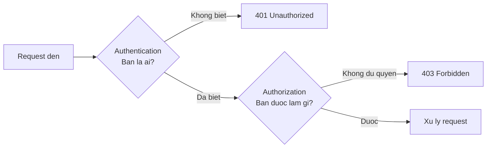

# 2.8 — 6. Authentication và Authorization

> Nguồn: https://tiennhm.io.vn/en/docs/dotnet-backend-zero-to-senior/stage-01-foundation/module-02-computer-science-basics/2.8-authentication-and-authorization
> Xác thực trả lời bạn là ai, phân quyền trả lời bạn được làm gì. Kèm cách JWT thực sự hoạt động, vì sao không thể thu hồi nó, và lỗ hổng phân quyền phổ biến nhất trong thực tế.

> Hai từ hay bị gộp làm một, nhưng chúng trả lời hai câu hỏi khác nhau: **xác thực** (authentication) hỏi *bạn là ai*, **phân quyền** (authorization) hỏi *bạn được làm gì*. Nhầm lẫn giữa chúng sinh ra hai lỗi cụ thể: trả `401` cho người đã đăng nhập, và — nghiêm trọng hơn nhiều — viết xong phần đăng nhập rồi **quên hẳn phần kiểm tra quyền trên từng bản ghi**. Lỗ hổng đó có tên là IDOR và nó đứng đầu OWASP Top 10. Bài này cũng làm rõ một tính chất của JWT mà nhiều người chỉ phát hiện khi cần dùng tới: **token đã phát ra thì không thu hồi được**.

## Mục tiêu bài học

Sau bài này bạn có thể:

- Phân biệt xác thực với phân quyền, và chọn đúng giữa `401` và `403`.
- Giải thích ba phần của JWT và phần nào được ký, phần nào chỉ mã hoá Base64.
- Nêu vì sao JWT không thu hồi được và ba cách xử lý.
- Chỉ ra vì sao kiểm tra vai trò thôi là chưa đủ.
- Lưu mật khẩu đúng cách và nói được vì sao SHA-256 là sai.

## Nội dung bài học

### 2.8.1 — Hai câu hỏi khác nhau



| | Authentication | Authorization |
|---|---|---|
| Câu hỏi | Bạn là ai? | Bạn được làm gì? |
| Xảy ra khi | Đăng nhập | Mỗi lần truy cập tài nguyên |
| Thất bại trả | `401` | `403` |
| Sai thì hậu quả | Người lạ vào được | Người trong nhà xem được thứ không phải của mình |

Dòng cuối đáng chú ý: lỗi phân quyền thường **khó phát hiện hơn** lỗi xác thực, vì hệ thống vẫn chạy đúng với mọi người dùng trung thực.

### 2.8.2 — Mật khẩu: băm, không mã hoá

```
Mã hoá (encryption)  → giải ngược lại được. SAI cho mật khẩu.
Băm (hashing)        → một chiều, không giải ngược. ĐÚNG.
```

Nhưng không phải hàm băm nào cũng dùng được:

```csharp
// SAI — SHA-256 quá nhanh
var hash = SHA256.HashData(Encoding.UTF8.GetBytes(password));
```

Vấn đề nằm ở chính ưu điểm của SHA-256: nó **rất nhanh**. Một GPU hiện đại thử được hàng tỉ tổ hợp mỗi giây, nên toàn bộ mật khẩu phổ biến bị dò ra trong vài phút.

Hàm băm cho mật khẩu được thiết kế để **cố tình chậm** và tốn bộ nhớ: `bcrypt`, `scrypt`, `Argon2`, `PBKDF2`. Chúng cũng tự sinh **salt** — một chuỗi ngẫu nhiên riêng cho từng người — nên hai người cùng mật khẩu vẫn có hai chuỗi băm khác nhau, và bảng tra sẵn trở nên vô dụng.

ASP.NET Core Identity đã dùng PBKDF2 với salt theo mặc định. Đừng tự viết lại phần này.

### 2.8.3 — JWT: ba phần, và chỉ một phần được bảo vệ

```
eyJhbGciOiJIUzI1NiJ9 . eyJzdWIiOiI0MiIsInJvbGUiOiJ1c2VyIn0 . dBjftJeZ4CVP...
└──── header ────┘   └──────── payload ────────┘   └─ chữ ký ─┘
```

Điểm quan trọng nhất, và hay bị hiểu sai nhất:

> **Header và payload chỉ được mã hoá Base64, không phải mã hoá bảo mật.** Ai cầm token cũng giải ra đọc được.

```bash
echo 'eyJzdWIiOiI0MiIsInJvbGUiOiJ1c2VyIn0' | base64 -d
# {"sub":"42","role":"user"}
```

Chữ ký chỉ bảo đảm **không ai sửa được** nội dung, chứ không giấu nội dung. Hệ quả trực tiếp: **không bao giờ đặt dữ liệu nhạy cảm vào payload** — không số căn cước, không thông tin lương, không khoá nội bộ.

### 2.8.4 — JWT không thu hồi được

Đây là đánh đổi cốt lõi của JWT và nó quyết định thiết kế đăng xuất của bạn.

Máy chủ xác minh token bằng cách kiểm tra chữ ký — **không cần tra database**. Đó chính là ưu điểm: mở rộng ngang thoải mái, mọi máy chủ đều xác minh được mà không cần trạng thái chung.

Nhưng cũng vì không tra database, máy chủ **không có cách nào biết** token này đã bị thu hồi. Người dùng bấm "Đăng xuất", token vẫn hợp lệ tới lúc hết hạn. Sa thải một nhân viên, token của họ vẫn dùng được.

Ba cách xử lý, theo thứ tự phổ biến:

1. **Token sống ngắn + refresh token.** Access token 5–15 phút, refresh token sống lâu và **có lưu trong database**. Thu hồi refresh token thì tối đa 15 phút sau là người dùng mất quyền.
2. **Danh sách đen.** Lưu các token đã thu hồi vào Redis tới khi chúng hết hạn. Mỗi request phải tra Redis — đánh mất một phần ưu điểm không trạng thái.
3. **Đổi khoá ký.** Thu hồi tất cả cùng lúc. Dùng cho tình huống khẩn cấp.

Cách 1 là mặc định hợp lý cho hầu hết hệ thống.

### 2.8.5 — Kiểm tra vai trò là chưa đủ

Đây là phần quan trọng nhất của bài.

```csharp
// CHƯA ĐỦ — chỉ kiểm tra "bạn là nhân viên sales"
[Authorize(Roles = "Sales")]
[HttpGet("customers/{id}")]
public async Task<IActionResult> Get(int id)
{
    var customer = await _db.Customers.FindAsync(id);
    return Ok(customer);      // BẤT KỲ sales nào cũng xem được MỌI khách hàng
}
```

Hàm trên kiểm tra đúng *vai trò*, nhưng không kiểm tra **quan hệ giữa người gọi và bản ghi**. Một nhân viên sales đổi số trên URL là xem được danh sách khách của đồng nghiệp — hoặc của chi nhánh khác.

```csharp
// ĐỦ — kiểm tra cả quyền sở hữu
[Authorize(Roles = "Sales")]
[HttpGet("customers/{id}")]
public async Task<IActionResult> Get(int id)
{
    var userId = User.GetUserId();          // từ token, KHÔNG từ request
    var customer = await _db.Customers
        .Where(c => c.Id == id && c.AssignedToUserId == userId)
        .FirstOrDefaultAsync();

    return customer is null ? NotFound() : Ok(customer);
}
```

Hai chi tiết đáng chú ý:

- `userId` **lấy từ token đã xác thực**, không lấy từ tham số. Nhận `userId` từ client là tự mở cửa.
- Trả `404` thay vì `403` khi không có quyền. Trả `403` là vô tình xác nhận "bản ghi này có tồn tại", giúp kẻ tấn công dò ra id hợp lệ.

Lỗ hổng này có tên: **IDOR (Insecure Direct Object Reference)**, thuộc nhóm Broken Access Control — hạng mục **đứng đầu** [OWASP Top 10](https://owasp.org/Top10/). Bài [Đổi id trên URL ra dữ liệu người khác](https://tiennhm.io.vn/blog/idor-broken-access-control-aspnet-core) chỉ cách chặn ở một tầng duy nhất thay vì rải `if` khắp nơi.

Trong ASP.NET Core, cách làm đúng quy mô là [resource-based authorization](https://learn.microsoft.com/en-us/aspnet/core/security/authorization/introduction) với policy, thay vì kiểm tra thủ công ở từng action.

### 2.8.6 — Lưu token ở đâu trong trình duyệt

| Nơi lưu | Chống XSS | Chống CSRF | Ghi chú |
|---|---|---|---|
| `localStorage` | ❌ JS đọc được | ✅ | Một lỗ hổng XSS là mất token |
| Cookie thường | ❌ | ❌ | Tệ nhất |
| Cookie `HttpOnly` + `Secure` + `SameSite` | ✅ JS không đọc được | ✅ với `SameSite=Lax` | **Nên dùng** |

Lựa chọn mặc định tốt: cookie `HttpOnly; Secure; SameSite=Lax`. JavaScript không chạm được vào token, nên một lỗ hổng XSS không lấy được phiên đăng nhập.

### 2.8.7 — Rà lại hệ thống của bạn

**Danh sách rà soát xác thực và phân quyền**

- [ ] Mật khẩu băm bằng bcrypt, Argon2 hoặc PBKDF2 — không phải SHA-256 hay MD5.
- [ ] Payload của JWT không chứa dữ liệu nhạy cảm nào.
- [ ] Access token sống ngắn, và có cơ chế refresh token thu hồi được.
- [ ] Mọi endpoint truy cập theo id đều kiểm tra quyền sở hữu, không chỉ kiểm tra vai trò.
- [ ] userId lấy từ claim trong token, không lấy từ tham số request.
- [ ] Trả 404 thay vì 403 khi người dùng không có quyền với một bản ghi cụ thể.
- [ ] Token lưu trong cookie HttpOnly + Secure + SameSite, không nằm ở localStorage.
- [ ] Phân biệt đúng 401 (chưa xác thực) và 403 (không đủ quyền).

## Bài tập áp dụng

#### Bài 1 — Giải mã token của chính bạn

Lấy một JWT từ ứng dụng của bạn, tách ba phần, giải Base64 phần payload. Liệt kê mọi thông tin đọc được. Có cái nào bạn không muốn người khác thấy không?

**Tiêu chí hoàn thành:** bạn giải mã được **không cần khoá bí mật**, và hiểu vì sao điều đó không phải lỗ hổng.

Gợi ý và lời giải — Bài 1

**Gợi ý.** JWT có ba phần ngăn bởi dấu chấm. Hai phần đầu chỉ là JSON được mã hoá Base64URL — **không mã hoá**, chỉ đổi cách biểu diễn. Ai cũng giải được, không cần khoá.

**Lời giải.**

```bash
TOKEN="eyJhbGciOiJIUzI1NiIs...."

# Phần 2 là payload; thêm dấu = cho đủ bội số 4 rồi giải Base64URL
echo "$TOKEN" | cut -d. -f2 | tr '_-' '/+' | base64 -d 2>/dev/null | jq
```

Kết quả điển hình:

```json
{
  "sub": "42",
  "email": "nhanvien@company.com",
  "role": ["Sales", "Manager"],
  "branch_id": "HN-01",
  "salary_band": "B3",
  "exp": 1758700800,
  "iss": "https://crm.company.com",
  "aud": "crm-api"
}
```

**Vì sao đọc được mà vẫn an toàn.** JWT bảo đảm **tính toàn vẹn**, không bảo đảm **tính bí mật**. Phần thứ ba là chữ ký: nó chứng minh nội dung chưa bị sửa kể từ khi máy chủ phát hành. Sửa một ký tự trong payload là chữ ký không còn khớp và máy chủ từ chối token.

Nói cách khác: ai cũng **đọc** được, nhưng không ai **sửa** được nếu không có khoá.

**Điều cần rà lại — cái gì không nên nằm trong payload:**

| Không nên đặt | Vì sao |
|---|---|
| Mật khẩu hoặc mã băm mật khẩu | Ai chặn được token là đọc được |
| Số căn cước, số thẻ ngân hàng | Dữ liệu cá nhân nhạy cảm, lộ qua log và bộ đệm |
| Mức lương, đánh giá nội bộ | Ví dụ `salary_band` ở trên — người dùng tự đọc được token của mình |
| Khoá API của dịch vụ khác | Lộ ngay cho client |
| Danh sách quyền quá dài | Token phình to, mà mọi request đều mang theo |

**Trường hợp `salary_band` ở ví dụ trên là lỗi thật.** Nhân viên mở DevTools là biết ngạch lương của mình được hệ thống phân loại thế nào — thông tin lẽ ra chỉ bộ phận nhân sự thấy.

**Nguyên tắc.** Payload chỉ nên chứa thứ đủ để **nhận dạng** và **phân quyền**: mã người dùng, vai trò, thời điểm hết hạn, bên phát hành, bên nhận. Mọi thông tin khác thì tra từ database khi cần.

**Ba trường bắt buộc kiểm tra ở phía máy chủ**, và đây là chỗ hay bị bỏ sót: `exp` để từ chối token hết hạn, `iss` để chắc token do đúng hệ thống của bạn phát hành, và `aud` để token cấp cho dịch vụ này không dùng được ở dịch vụ khác. Thư viện xác thực của ASP.NET Core kiểm tra cả ba khi bạn cấu hình `TokenValidationParameters` đầy đủ — [bài 10.3](../../stage-03-aspnet-core-backend/module-10-authentication-authorization/10.3-jwt-authentication.mdx) trình bày chi tiết.

#### Bài 2 — Tự tìm lỗ hổng IDOR

Đăng nhập bằng tài khoản A, gọi `GET /api/<tài nguyên>/{id}` với một `id` thuộc về tài khoản B. Nếu trả về dữ liệu, bạn vừa tìm ra một lỗ hổng thật.

**Tiêu chí hoàn thành:** bạn kiểm tra ít nhất ba loại tài nguyên khác nhau, và nêu được vì sao `[Authorize]` một mình không chặn được lỗi này.

> **Warning: Chỉ làm trên hệ thống bạn có quyền**
>
> Đây là kiểm thử bảo mật trên chính dự án của bạn hoặc môi trường thử nghiệm.

Gợi ý và lời giải — Bài 2

**Gợi ý.** IDOR là viết tắt của *Insecure Direct Object Reference*. Ý tưởng rất đơn giản: endpoint kiểm tra bạn **đã đăng nhập chưa**, nhưng quên kiểm tra bạn **có quyền trên đúng bản ghi này không**.

Cách thử nhanh nhất là đổi một chữ số trong URL.

**Lời giải.**

```bash
# Đăng nhập bằng tài khoản A (id = 42)
TOKEN_A=$(curl -s -X POST .../auth/login -d '{"email":"a@x.com",...}' | jq -r .accessToken)

# Đơn hàng 999 thuộc về tài khoản B
curl -s -o /dev/null -w "%{http_code}\n" .../api/v1/orders/999 -H "Authorization: Bearer $TOKEN_A"
```

`200` nghĩa là có lỗ hổng. Mong đợi là `404` — chứ **không phải** `403`.

**Vì sao nên trả `404` chứ không `403`.** Trả `403` là xác nhận rằng bản ghi đó **có tồn tại**, chỉ là bạn không được xem. Kẻ tấn công quét một dải `id` sẽ dựng được bản đồ dữ liệu của bạn: `404` là không có, `403` là có. Trả `404` cho cả hai trường hợp thì không rò rỉ gì.

**Vì sao `[Authorize]` không đủ.**

```csharp
// SAI — chỉ kiểm tra đã đăng nhập
[Authorize]
[HttpGet("{id}")]
public async Task<IActionResult> Get(int id)
    => Ok(await _db.Orders.FindAsync(id));   // bất kỳ ai cũng lấy được mọi đơn
```

`[Authorize]` trả lời câu hỏi *"bạn là ai"*. Nó **không** trả lời *"bạn có quyền trên bản ghi này không"* — đó là câu hỏi phụ thuộc vào dữ liệu, nên không thể trả lời bằng một thuộc tính đặt trên phương thức.

```csharp
// ĐÚNG — lọc theo chủ sở hữu ngay trong truy vấn
[Authorize]
[HttpGet("{id}")]
public async Task<IActionResult> Get(int id, CancellationToken ct)
{
    var userId = int.Parse(User.FindFirstValue(ClaimTypes.NameIdentifier)!);
    var order = await _db.Orders
        .FirstOrDefaultAsync(o => o.Id == id && o.CustomerId == userId, ct);
    return order is null ? NotFound() : Ok(order);
}
```

Điểm mấu chốt: điều kiện quyền nằm **trong mệnh đề `WHERE`**, không nằm trong một câu `if` sau khi đã lấy dữ liệu. Như vậy không có đường nào đọc nhầm.

**Ba nơi cần kiểm tra ngoài endpoint `GET` theo id:**

1. **Endpoint danh sách** — `GET /api/v1/orders` có lọc theo người dùng hiện tại không, hay trả về tất cả?
2. **Endpoint sửa và xoá** — `PATCH` và `DELETE` thường bị quên vì người ta chỉ rà `GET`.
3. **Endpoint lồng nhau** — `GET /api/v1/customers/{customerId}/orders` phải kiểm tra quyền trên `customerId`, không chỉ trên đơn hàng.

**Cách phòng có hệ thống.** Với dữ liệu phân tách theo người dùng hoặc theo tổ chức, dùng bộ lọc truy vấn toàn cục của EF Core để **mọi** truy vấn tự động kèm điều kiện, thay vì trông chờ mỗi lập trình viên nhớ viết. [Bài 13.11](../../stage-04-database-production/module-13-entity-framework-core/13.11-global-query-filters.mdx) trình bày cách làm, và [bài 10.7](../../stage-03-aspnet-core-backend/module-10-authentication-authorization/10.7-resource-based-authorization.mdx) trình bày phân quyền theo tài nguyên cho các trường hợp phức tạp hơn.

Broken Access Control đứng **đầu bảng** [OWASP Top 10](https://owasp.org/Top10/) năm 2021, và IDOR là dạng phổ biến nhất của nó.

#### Bài 3 — Đo cái giá của hàm băm mật khẩu

Đo thời gian băm một mật khẩu bằng SHA-256 và bằng PBKDF2 với tham số mặc định của ASP.NET Core Identity. Từ tỉ lệ đó, ước lượng thời gian dò toàn bộ mật khẩu 8 ký tự.

**Tiêu chí hoàn thành:** bạn nêu được vì sao hàm băm **chậm** lại là hàm băm **đúng** cho mật khẩu.

Gợi ý và lời giải — Bài 3

**Gợi ý.** SHA-256 được thiết kế để **nhanh** — đó là mục tiêu của nó, vì nó dùng để kiểm tra tính toàn vẹn của file hàng gigabyte. Hãy hỏi: với mật khẩu, nhanh là lợi thế của ai?

**Lời giải.**

```csharp
var pwd = "MatKhau@123";
var salt = RandomNumberGenerator.GetBytes(16);

var sw = Stopwatch.StartNew();
for (int i = 0; i < 200; i++) SHA256.HashData(Encoding.UTF8.GetBytes(pwd));
sw.Stop();
var tSha = sw.Elapsed.TotalMilliseconds / 200;

sw.Restart();
for (int i = 0; i < 10; i++)
    Rfc2898DeriveBytes.Pbkdf2(pwd, salt, 100_000, HashAlgorithmName.SHA512, 32);
sw.Stop();
var tPbkdf2 = sw.Elapsed.TotalMilliseconds / 10;
```

**Kết quả đo thật trên .NET 9:**

```text
SHA-256           : 0.019563 ms / lần
PBKDF2 100k vòng  : 117.03   ms / lần
chậm gấp          : 5982     lần
```

**Ước lượng thời gian dò.** Mật khẩu 8 ký tự lấy từ 94 ký tự in được cho `94⁸ ≈ 6,1 × 10¹⁵` tổ hợp.

| Cách băm | Một luồng CPU | GPU chuyên dụng (~10¹⁰ băm/giây) |
|---|---|---|
| SHA-256 | ~3.780 năm | **~7 ngày** |
| PBKDF2 100k vòng | ~22.600.000 năm | ~115 năm |

Cột bên phải mới là cột đáng quan tâm. Kẻ tấn công không dùng một luồng CPU; họ dùng dàn GPU. Với SHA-256, toàn bộ không gian mật khẩu 8 ký tự bị quét hết **trong một tuần** — và với mật khẩu thật, vốn không ngẫu nhiên đều mà tuân theo thói quen con người, thời gian thực tế còn ngắn hơn nhiều.

**Vì sao chậm lại là đúng.** Hàm băm mật khẩu cố ý tốn kém để việc thử hàng tỉ lần trở nên không khả thi về kinh tế. Người dùng hợp lệ chịu thêm 117 mili-giây mỗi lần đăng nhập — không ai nhận ra. Kẻ tấn công phải nhân 117 mili-giây với hàng triệu tỉ lần thử.

**Ba tính chất mà một hàm băm mật khẩu phải có:**

1. **Chậm và điều chỉnh được** — tăng số vòng khi phần cứng mạnh lên, không phải đổi thuật toán.
2. **Có muối riêng cho từng mật khẩu** — hai người dùng cùng mật khẩu cho hai giá trị băm khác nhau, nên bảng tra sẵn vô dụng.
3. **Khó tăng tốc bằng phần cứng chuyên dụng** — đây là điểm PBKDF2 yếu, vì nó chỉ tốn CPU chứ không tốn bộ nhớ, nên GPU chạy song song rất hiệu quả.

**Vì sao nên cân nhắc Argon2 hoặc bcrypt.** Cả hai được thiết kế **tốn bộ nhớ**, khiến việc chạy song song trên GPU đắt hơn nhiều vì mỗi luồng cần vùng nhớ riêng. Argon2id là khuyến nghị hiện tại của [OWASP Password Storage Cheat Sheet](https://cheatsheetseries.owasp.org/cheatsheets/Password_Storage_Cheat_Sheet.html).

**Trong thực tế.** Đừng tự cài đặt. Dùng `PasswordHasher` của ASP.NET Core Identity — nó đã có muối, đã đủ số vòng, và quan trọng hơn là **tự nâng cấp**: khi bạn tăng tham số, mật khẩu cũ vẫn kiểm tra được và được băm lại theo tham số mới ở lần đăng nhập kế tiếp.

**Điều tuyệt đối không làm.** Không **mã hoá** mật khẩu — mã hoá là hai chiều, nghĩa là tồn tại một khoá giải mã được toàn bộ. Mật khẩu phải được **băm** một chiều, để ngay cả bạn cũng không đọc lại được.

## Tự kiểm tra

### Authentication và authorization khác nhau thế nào?

Authentication trả lời bạn là ai, xảy ra lúc đăng nhập, thất bại thì trả 401. Authorization trả lời bạn được làm gì, phải kiểm tra ở mỗi lần truy cập tài nguyên, thất bại thì trả 403. Lỗi phân quyền nguy hiểm hơn vì hệ thống vẫn chạy đúng với mọi người dùng trung thực, nên rất lâu mới bị phát hiện.

### Vì sao không được băm mật khẩu bằng SHA-256?

Vì SHA-256 được thiết kế để chạy rất nhanh, mà nhanh chính là điều tệ nhất cho mật khẩu. Một GPU hiện đại thử hàng tỉ tổ hợp mỗi giây nên dò ra mật khẩu phổ biến trong vài phút. Phải dùng hàm băm cố tình chậm và tốn bộ nhớ như bcrypt, scrypt, Argon2 hoặc PBKDF2, và chúng tự sinh salt riêng cho từng người.

### Nội dung trong JWT có được giấu kín không?

Không. Header và payload chỉ được mã hoá Base64, ai cầm token cũng giải ra đọc được bằng một lệnh. Chữ ký chỉ bảo đảm không ai sửa được nội dung chứ không giấu nội dung. Vì vậy tuyệt đối không đặt dữ liệu nhạy cảm vào payload.

### Vì sao JWT không thu hồi được, và xử lý thế nào?

Vì máy chủ xác minh token bằng chữ ký mà không tra database, nên không có chỗ nào để đánh dấu token đã bị thu hồi. Ba cách xử lý: dùng access token sống ngắn kèm refresh token lưu trong database; giữ danh sách đen trong Redis; hoặc đổi khoá ký để thu hồi tất cả. Cách đầu là mặc định hợp lý cho hầu hết hệ thống.

### Vì sao kiểm tra vai trò thôi là chưa đủ?

Vì vai trò chỉ nói người này thuộc nhóm nào, không nói họ có quyền với bản ghi cụ thể này hay không. Một nhân viên sales có vai trò hợp lệ vẫn có thể đổi id trên URL để xem khách hàng của đồng nghiệp. Phải kiểm tra thêm quan hệ giữa người gọi và bản ghi, với userId lấy từ token chứ không từ request.

### Vì sao nên trả 404 thay vì 403 khi không có quyền với một bản ghi?

Vì 403 vô tình xác nhận rằng bản ghi đó có tồn tại, giúp kẻ tấn công dò ra các id hợp lệ trong hệ thống. Trả 404 không tiết lộ gì thêm. Lưu ý đây là trường hợp quyền trên từng bản ghi; còn khi thiếu quyền ở mức chức năng thì 403 vẫn đúng.

## Kết luận

Ba điều đáng nhớ nhất:

1. **Xác thực xong không có nghĩa là phân quyền xong.** Phần lớn lỗ hổng thật nằm ở chỗ thứ hai.
2. **JWT đọc được, chỉ không sửa được.** Payload không phải chỗ giấu bí mật.
3. **`userId` phải đến từ token.** Nhận nó từ request là tự mở cửa cho IDOR.

## Tham khảo

- [OWASP Top 10](https://owasp.org/Top10/) — Broken Access Control đứng đầu
- [Authentication in ASP.NET Core](https://learn.microsoft.com/en-us/aspnet/core/security/authentication/)
- [Authorization in ASP.NET Core](https://learn.microsoft.com/en-us/aspnet/core/security/authorization/introduction) — policy và resource-based
- [Đổi id trên URL ra dữ liệu người khác](https://tiennhm.io.vn/blog/idor-broken-access-control-aspnet-core) — chặn IDOR ở một tầng duy nhất

## Điều hướng

- **Bài trước:** [2.7 — 5. Cơ sở dữ liệu là gì](2.7-what-is-a-database.mdx)
- **Bài tiếp theo:** [2.9 — 7. Hosting và Cloud cơ bản](2.9-hosting-and-cloud-co-ban.mdx)
- **Về module:** [Trang mục lục](./)

## Bài liên quan

- [Đổi id trên URL ra dữ liệu người khác? Chặn IDOR ở một tầng duy nhất](https://tiennhm.io.vn/blog/idor-broken-access-control-aspnet-core) — IDOR xảy ra khi API nhận id từ request rồi đọc thẳng bản ghi mà không hỏi xem người gọi có sở hữu bản ghi đó không.
