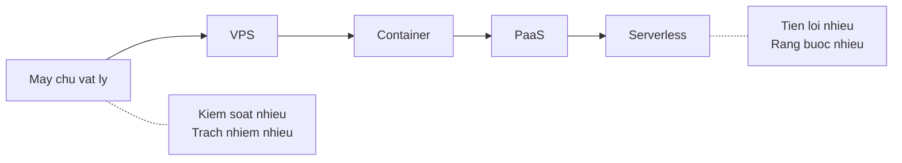
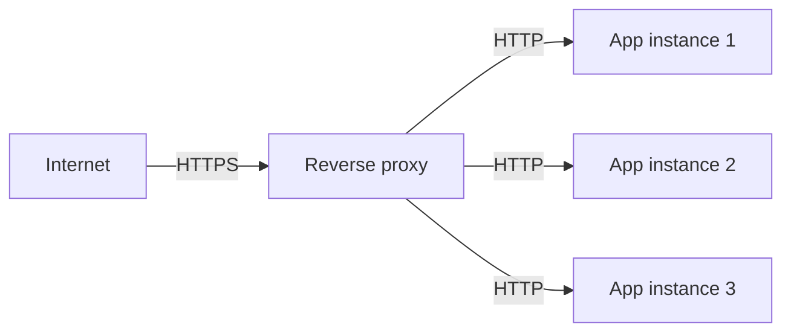

# 2.9 — 7. Hosting và Cloud cơ bản

> Nguồn: https://tiennhm.io.vn/en/docs/dotnet-backend-zero-to-senior/stage-01-foundation/module-02-computer-science-basics/2.9-hosting-and-cloud-co-ban
> Từ máy chủ vật lý tới serverless: bạn đang đổi quyền kiểm soát lấy sự tiện lợi. Kèm vai trò của reverse proxy, vì sao chọn base image sai làm chết ứng dụng, và điều kiện để mở rộng ngang.

> Mọi lựa chọn hosting đều nằm trên **một trục duy nhất: đổi quyền kiểm soát lấy sự tiện lợi**. Máy chủ vật lý cho bạn toàn quyền và toàn bộ trách nhiệm; serverless lo hộ gần hết nhưng bắt bạn viết theo cách của nó. Bài này đi qua năm nấc trên trục đó, vai trò của **reverse proxy** (kết thúc TLS, định tuyến, cân bằng tải — thứ mà gần như mọi hệ thống production đều có), và hai bài học rút từ sự cố thật: **chọn base image sai làm ứng dụng chết lúc chạy chứ không phải lúc build**, và **gia hạn chứng chỉ tự động hỏng theo cách rất khó nhận ra**.

## Mục tiêu bài học

Sau bài này bạn có thể:

- Xếp năm mô hình hosting theo trục kiểm soát và tiện lợi, và chọn theo hoàn cảnh.
- Nêu ba việc một reverse proxy làm và vì sao không nên để ứng dụng tự làm.
- Giải thích image khác container ở đâu, và vì sao base image quyết định ứng dụng có chạy được không.
- Nêu điều kiện để mở rộng ngang, và vì sao lưu file lên đĩa cục bộ phá vỡ điều kiện đó.
- Cấu hình ứng dụng qua biến môi trường thay vì nhúng cứng.

## Nội dung bài học

### 2.9.1 — Năm nấc trên một trục



| Mô hình | Bạn lo | Nhà cung cấp lo | Hợp khi |
|---|---|---|---|
| Máy chủ vật lý | Tất cả | Điện, mạng | Yêu cầu đặc thù, dữ liệu nhạy cảm |
| VPS | Hệ điều hành trở lên | Phần cứng, ảo hoá | Chi phí thấp, cần toàn quyền |
| Container | Ứng dụng và image | Máy chủ chạy container | Chuẩn hoá môi trường, CI/CD |
| PaaS | Chỉ mã nguồn | Mọi thứ khác | Đội nhỏ, muốn đi nhanh |
| Serverless | Từng hàm | Mọi thứ, kể cả co giãn | Tải rời rạc, xử lý theo sự kiện |

Không có nấc nào "đúng" hơn nấc nào. Serverless rẻ khi tải rời rạc và đắt khi tải đều; VPS rẻ nhưng bạn phải tự vá lỗi bảo mật hệ điều hành lúc nửa đêm.

### 2.9.2 — Reverse proxy: thứ đứng trước ứng dụng

Gần như mọi hệ thống production đều có một lớp đứng giữa Internet và ứng dụng: Nginx, Traefik, Caddy, hoặc một load balancer của nhà cung cấp cloud.



Ba việc nó làm:

1. **Kết thúc TLS.** Chứng chỉ nằm ở proxy; ứng dụng chỉ nói HTTP trong mạng nội bộ. Nhờ vậy gia hạn chứng chỉ chỉ làm ở một chỗ.
2. **Định tuyến.** `api.company.com` đi tới dịch vụ này, `admin.company.com` đi tới dịch vụ kia — trên cùng một địa chỉ IP.
3. **Cân bằng tải.** Chia request cho nhiều instance, và ngừng gửi tới instance đã chết.

Hệ quả cần nhớ: vì proxy đứng giữa, **ứng dụng không còn thấy IP thật của người dùng**. Nó thấy IP của proxy. Thông tin gốc nằm trong các header `X-Forwarded-For`, `X-Forwarded-Proto`. Cấu hình `ForwardedHeaders` cho đúng là việc bắt buộc — và làm sai thì thành lỗ hổng, vì header có thể bị giả mạo. Bài [Forward header trong ASP.NET Core](https://tiennhm.io.vn/blog/forward-http-header-an-toan-aspnet-core) phân tích vì sao "forward hết" là một lỗi kiến trúc.

Chứng chỉ tự động cũng là chỗ dễ hỏng âm thầm: bài [Traefik + Cloudflare: vì sao cert hết hạn đồng loạt sau 60 ngày](https://tiennhm.io.vn/blog/traefik-cloudflare-https-tu-dong-vps) là một sự cố thật, nơi mọi thứ trông vẫn bình thường cho tới lúc không còn bình thường nữa.

### 2.9.3 — Container: image và container khác nhau

```
Image     = bản đóng gói bất biến (lớp hệ điều hành + runtime + ứng dụng)
Container = một tiến trình đang chạy từ image đó
```

Quan hệ giống như class và instance: một image sinh ra bao nhiêu container cũng được.

```dockerfile
FROM mcr.microsoft.com/dotnet/aspnet:9.0      # ← dòng quan trọng nhất
WORKDIR /app
COPY --from=build /app/publish .
ENTRYPOINT ["dotnet", "MyApp.dll"]
```

Dòng `FROM` quyết định nhiều hơn vẻ ngoài của nó. Nó chọn **thư viện C chuẩn** mà mọi thư viện native bên dưới sẽ liên kết tới:

- `mcr.microsoft.com/dotnet/aspnet:9.0` — nền Debian, dùng **glibc**
- `...:9.0-alpine` — nền Alpine, dùng **musl**

Rất nhiều thư viện native chỉ phát hành bản dựng sẵn cho glibc. Chọn Alpine vì nó nhẹ, rồi ứng dụng **build thành công**, container **khởi động thành công**, và chỉ chết đúng lúc nạp thư viện đó. Bài [ONNX Runtime chết trên Alpine](https://tiennhm.io.vn/blog/onnx-runtime-alpine-ld-linux-x86-64-so-2) là một ca như vậy, kèm lý do `libc6-compat` không cứu được.

Bài học chung: **image nhỏ không phải mục tiêu**. Image chạy được mới là mục tiêu.

### 2.9.4 — Cấu hình: biến môi trường, không nhúng cứng

```csharp
// SAI — chuỗi kết nối nằm trong mã nguồn, đi thẳng lên git
var connectionString = "Server=prod-db;Password=P@ssw0rd";

// ĐÚNG — đọc từ cấu hình, giá trị đến từ môi trường
var connectionString = builder.Configuration.GetConnectionString("Default");
```

ASP.NET Core đọc cấu hình theo thứ tự ưu tiên tăng dần: `appsettings.json` → `appsettings.{Environment}.json` → biến môi trường → tham số dòng lệnh. Nhờ vậy cùng một image chạy được ở mọi môi trường, chỉ khác biến truyền vào.

Ba quy tắc:

- **Bí mật không bao giờ nằm trong git.** Dùng user-secrets khi phát triển, và một kho bí mật khi chạy thật.
- **Một image, nhiều môi trường.** Nếu phải build lại image để deploy lên production thì bạn đang thử nghiệm một thứ và chạy một thứ khác.
- **Đổi cấu hình không cần build lại.**

### 2.9.5 — Mở rộng: dọc và ngang

| | Mở rộng dọc | Mở rộng ngang |
|---|---|---|
| Cách làm | Máy mạnh hơn | Nhiều máy hơn |
| Giới hạn | Trần phần cứng | Gần như không |
| Chi phí | Tăng phi tuyến | Tăng tuyến tính |
| Điều kiện | Không có | **Ứng dụng phải stateless** |

Dòng cuối là điều kiện then chốt. "Stateless" nghĩa là request đi vào **instance nào cũng xử lý được như nhau**. Ba thứ phá vỡ nó:

1. **Lưu file lên đĩa cục bộ.** Người dùng tải ảnh lên instance 1, lần sau request vào instance 2 và ảnh không có ở đó. Dùng object storage.
2. **Session trong bộ nhớ.** Đăng nhập ở instance 1, request sau vào instance 2 thành người lạ. Dùng Redis hoặc token.
3. **Cache trong bộ nhớ tiến trình.** Mỗi instance một bản, và chúng lệch nhau. Dùng cache phân tán.

Đây cũng chính là lý do tính stateless của HTTP ở [bài 2.4](2.4-client.mdx) lại quan trọng đến thế.

### 2.9.6 — Health check: để hệ thống tự biết mình hỏng

```csharp
builder.Services.AddHealthChecks()
    .AddNpgSql(connectionString)
    .AddRedis(redisConnection);

app.MapHealthChecks("/health/live");    // tiến trình còn sống không?
app.MapHealthChecks("/health/ready");   // đã sẵn sàng nhận request chưa?
```

Phân biệt hai loại là quan trọng:

- **Liveness** — tiến trình còn sống không? Hỏng thì khởi động lại.
- **Readiness** — đã kết nối được database, đã nạp xong cache chưa? Chưa sẵn sàng thì **tạm ngừng gửi request tới**, nhưng đừng khởi động lại.

Nhầm hai cái này gây ra vòng lặp khởi động lại liên tục: database chậm một chút, liveness fail, container bị giết, khởi động lại, lại chậm.

### 2.9.7 — Rà lại hệ thống của bạn

**Danh sách rà soát hosting**

- [ ] Không có bí mật nào nằm trong mã nguồn hay trong file đã commit.
- [ ] Cùng một image chạy được ở mọi môi trường, chỉ khác biến truyền vào.
- [ ] Ứng dụng không ghi file lên đĩa cục bộ để dùng lại về sau.
- [ ] Session và cache nằm ở nơi dùng chung, không nằm trong bộ nhớ tiến trình.
- [ ] Đã cấu hình ForwardedHeaders và giới hạn proxy tin cậy.
- [ ] Có endpoint health check tách riêng liveness và readiness.
- [ ] Base image đã được xác nhận chạy được với mọi thư viện native mà dự án dùng.
- [ ] Chứng chỉ TLS gia hạn tự động, và có cảnh báo khi sắp hết hạn.

## Bài tập áp dụng

1. **Phá vỡ tính stateless.** Chạy hai instance ứng dụng sau một reverse proxy. Thêm một endpoint ghi file vào `/tmp` và một endpoint đọc lại. Gọi luân phiên vài lần và quan sát lỗi. Sau đó chuyển sang lưu vào một nơi dùng chung.

2. **So sánh base image.** Build cùng một ứng dụng với `aspnet:9.0` và `aspnet:9.0-alpine`. So sánh kích thước image, thời gian khởi động, và xác nhận mọi thư viện native vẫn chạy trên cả hai.

3. **Tách liveness và readiness.** Cài health check cho database. Tắt database đi và quan sát: endpoint nào chuyển sang unhealthy, và orchestrator phản ứng ra sao với mỗi loại.

## Tự kiểm tra

### Reverse proxy làm những việc gì?

Ba việc chính: kết thúc TLS để chứng chỉ chỉ nằm ở một chỗ và ứng dụng chỉ nói HTTP nội bộ; định tuyến nhiều tên miền về nhiều dịch vụ trên cùng một IP; và cân bằng tải giữa các instance, đồng thời ngừng gửi request tới instance đã chết.

### Vì sao ứng dụng phía sau proxy không thấy IP thật của người dùng?

Vì kết nối tới ứng dụng là do proxy mở, nên ứng dụng thấy IP của proxy. IP gốc nằm trong header X-Forwarded-For. Phải cấu hình ForwardedHeaders để ASP.NET Core đọc header đó, nhưng chỉ tin những proxy đã khai báo — vì header này có thể bị giả mạo nếu tin tất cả.

### Image và container khác nhau thế nào?

Image là bản đóng gói bất biến gồm lớp hệ điều hành, runtime và ứng dụng. Container là một tiến trình đang chạy từ image đó. Quan hệ giống class và instance: một image sinh ra bao nhiêu container cũng được.

### Vì sao chọn base image lại quan trọng đến thế?

Vì nó quyết định thư viện C chuẩn mà mọi thư viện native sẽ liên kết tới. Bản Debian dùng glibc, bản Alpine dùng musl. Rất nhiều thư viện native chỉ phát hành bản dựng sẵn cho glibc, nên chọn Alpine thì build vẫn thành công, container vẫn khởi động, và chỉ chết đúng lúc nạp thư viện đó lúc chạy.

### Điều kiện để mở rộng ngang là gì?

Ứng dụng phải stateless, nghĩa là request đi vào instance nào cũng xử lý được như nhau. Ba thứ phá vỡ điều đó: ghi file lên đĩa cục bộ, giữ session trong bộ nhớ, và cache trong bộ nhớ tiến trình. Cách xử lý lần lượt là object storage, Redis hoặc token, và cache phân tán.

### Liveness và readiness khác nhau ra sao?

Liveness hỏi tiến trình còn sống không; hỏng thì khởi động lại. Readiness hỏi đã sẵn sàng nhận request chưa, ví dụ đã kết nối được database; chưa sẵn sàng thì tạm ngừng gửi request tới nhưng không khởi động lại. Nhầm hai cái này gây vòng lặp khởi động lại liên tục khi database chỉ chậm một chút.

## Kết luận

Ba điều đáng nhớ nhất:

1. **Mọi lựa chọn hosting là một cuộc đổi chác.** Không có nấc nào đúng tuyệt đối, chỉ có nấc phù hợp với đội và tải của bạn.
2. **Image nhỏ không phải mục tiêu.** Base image sai thì build thành công rồi chết lúc chạy.
3. **Stateless là điều kiện, không phải lời khuyên.** Ghi một file lên đĩa cục bộ là đủ để chặn việc mở rộng ngang.

## Tham khảo

- [Host and deploy ASP.NET Core](https://learn.microsoft.com/en-us/aspnet/core/host-and-deploy/)
- [Web servers trong ASP.NET Core](https://learn.microsoft.com/en-us/aspnet/core/fundamentals/servers/) — Kestrel và reverse proxy
- [Configuration trong ASP.NET Core](https://learn.microsoft.com/en-us/aspnet/core/fundamentals/configuration/) — thứ tự ưu tiên
- [Health checks](https://learn.microsoft.com/en-us/aspnet/core/host-and-deploy/health-checks) — liveness và readiness
- [Docker get started](https://docs.docker.com/get-started/)

## Điều hướng

- **Bài trước:** [2.8 — 6. Authentication và Authorization](2.8-authentication-and-authorization.mdx)
- **Bài tiếp theo:** [2.10 — 8. .NET Runtime và Ecosystem](2.10-dotnet-runtime-and-ecosystem.mdx)
- **Về module:** [Trang mục lục](./)

## Bài liên quan

- [ONNX Runtime chết trên Alpine: lỗi ld-linux-x86-64.so.2 và vì sao libc6-compat không cứu được](https://tiennhm.io.vn/blog/onnx-runtime-alpine-ld-linux-x86-64-so-2) — Container Node.js build xong, chạy lên, rồi chết ngay khi nạp model: Error loading shared library ld-linux-x86-64.so.2.
- [Traefik + Cloudflare: vì sao cert hết hạn đồng loạt sau 60 ngày?](https://tiennhm.io.vn/blog/traefik-cloudflare-https-tu-dong-vps) — Một VPS, 14 container, 13 hostname, tất cả nằm sau Cloudflare và đều cần HTTPS tự động.
- [Forward header trong ASP.NET Core: vì sao 'forward hết' là một lỗi kiến trúc](https://tiennhm.io.vn/blog/forward-http-header-an-toan-aspnet-core) — Vòng lặp copy mọi header từ request đi vào sang lời gọi HttpClient đi ra là đoạn code trông vô hại nhất mà tôi từng thấy gây sự cố production.
