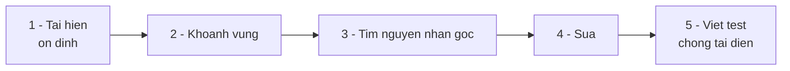

# 3.10 — 8. Debugging Workflow

> Nguồn: https://tiennhm.io.vn/en/docs/dotnet-backend-zero-to-senior/stage-01-foundation/module-03-git-developer-workflow/3.10-debugging-workflow
> git bisect tìm commit gây lỗi trong 10.000 commit bằng 14 lần thử. Kèm breakpoint có điều kiện, correlation id để lần theo một request qua nhiều dịch vụ, và bộ công cụ chẩn đoán .NET.

> Sửa lỗi có một thứ tự đúng, và bước đầu tiên không phải là mở debugger — mà là **tái hiện lỗi một cách ổn định**. Không tái hiện được thì không biết mình đã sửa hay chỉ vô tình che đi. Khi đã tái hiện được, công cụ mạnh nhất trong Git là **`git bisect`**: nó chia đôi lịch sử để tìm commit gây lỗi, nên **10.000 commit chỉ cần khoảng 14 lần thử**. Bài này cũng nói về hai thứ chỉ dùng được trên production: **correlation id** để lần theo một request qua nhiều dịch vụ, và bộ `dotnet-counters`, `dotnet-dump`, `dotnet-trace` để khám một tiến trình đang chạy mà không dừng nó.

## Mục tiêu bài học

Sau bài này bạn có thể:

- Đi theo năm bước sửa lỗi có thứ tự, thay vì đọc mò.
- Dùng `git bisect` để khoanh vùng commit gây lỗi, kể cả tự động.
- Đặt breakpoint có điều kiện thay vì bấm Continue hàng trăm lần.
- Gắn correlation id và lần theo một request qua nhiều dịch vụ.
- Chọn đúng công cụ chẩn đoán .NET cho từng loại triệu chứng.

## Nội dung bài học

### 3.10.1 — Năm bước, đúng thứ tự



Bước 1 quan trọng nhất và hay bị bỏ qua nhất. **Không tái hiện được thì không xác nhận được là đã sửa.** Bạn sẽ đổi một thứ, thấy lỗi biến mất, và không bao giờ biết đó là do bản sửa hay do may mắn.

Tái hiện ổn định nghĩa là trả lời được: dữ liệu đầu vào nào, trạng thái nào, thứ tự thao tác nào thì **lần nào cũng** ra lỗi.

Bước 5 cũng hay bị bỏ. Một test tái hiện đúng lỗi vừa sửa là thứ duy nhất bảo đảm nó không quay lại sau sáu tháng.

### 3.10.2 — `git bisect`: chia đôi lịch sử

Tình huống: tính năng chạy tốt ở bản phát hành tháng trước, giờ hỏng. Giữa hai mốc có 800 commit.

```bash
git bisect start
git bisect bad                    # commit hiện tại: có lỗi
git bisect good v1.4.0            # bản này: không lỗi

# Git tự checkout commit ở giữa. Bạn kiểm tra rồi trả lời:
git bisect good                   # commit này ổn
# hoặc
git bisect bad                    # commit này đã có lỗi

# Lặp lại. Sau khoảng 10 lần, Git chỉ đúng commit gây lỗi.
git bisect reset                  # quay về trạng thái ban đầu
```

Mỗi câu trả lời loại bỏ **một nửa** số commit còn lại. Quan hệ giữa số commit và số lần thử:

| Số commit | Số lần thử |
|---|---|
| 100 | 7 |
| 1.000 | 10 |
| 10.000 | **14** |
| 1.000.000 | 20 |

Đây chính là `O(log n)` từ [bài 1.8](https://tiennhm.io.vn/docs/dotnet-backend-zero-to-senior/stage-01-foundation/module-01-programming-logic/1.8-data-structures-and-big-o), áp dụng vào lịch sử commit.

**Tự động hoá** khi bạn có một lệnh phân biệt được tốt/xấu:

```bash
git bisect start HEAD v1.4.0
git bisect run dotnet test --filter FullyQualifiedName~OrderTotalTests
# Git tự chạy, tự trả lời, tự tìm ra commit. Đi pha cà phê.
```

Quy ước: script trả `0` là tốt, khác `0` là xấu, `125` là "bỏ qua commit này".

Đây là lý do **mỗi commit phải build được** như [bài 3.5](3.5-workflow-co-ban.mdx) đã nói. Một commit hỏng build nằm giữa dải tìm kiếm làm hỏng cả quy trình.

### 3.10.3 — Debugger: dùng cho đúng

```csharp
// Breakpoint có ĐIỀU KIỆN — dừng đúng lúc cần
// Điều kiện: order.Id == 4729
foreach (var order in orders)       // 10.000 đơn
{
    Process(order);                 // chỉ dừng ở đơn 4729
}
```

Bốn tính năng đáng dùng hơn là bấm Continue liên tục:

| Tính năng | Dùng khi |
|---|---|
| **Conditional breakpoint** | Chỉ muốn dừng khi một điều kiện đúng |
| **Hit count** | Dừng ở lần lặp thứ n |
| **Tracepoint / Logpoint** | Muốn in giá trị mà **không dừng** chương trình |
| **Exception settings** | Dừng ngay khi ngoại lệ được ném, trước khi bị `catch` nuốt |

Cái cuối cùng cứu rất nhiều thời gian: khi một ngoại lệ bị một khối `catch` ở tầng trên nuốt mất, bật "break when thrown" cho bạn thấy nó ở đúng nơi phát sinh, kèm đầy đủ trạng thái cục bộ.

### 3.10.4 — Khi không gắn debugger được: log có cấu trúc

Trên production bạn không dừng tiến trình được. Log là thứ thay thế — nhưng chỉ khi nó có cấu trúc.

```csharp
// Không truy vấn được — chuỗi phẳng
_logger.LogInformation($"Xu ly don {order.Id} cho khach {customerId}");

// Truy vấn được — tham số có tên
_logger.LogInformation("Xu ly don {OrderId} cho khach {CustomerId}",
    order.Id, customerId);
```

Cách thứ hai cho phép truy vấn `OrderId = 4729` trong công cụ tập trung log, thay vì tìm chuỗi bằng regex.

Ba mức log dùng cho đúng:

- `Debug` — chi tiết chỉ bật khi đang điều tra
- `Information` — mốc nghiệp vụ: đơn được tạo, thanh toán thành công
- `Warning` — bất thường nhưng xử lý được: thử lại lần 2, cache miss cao
- `Error` — thất bại cần người xem

Tránh `Information` cho mọi thứ. Log quá nhiều cũng mù như log quá ít, chỉ tốn tiền hơn.

### 3.10.5 — Correlation id: lần theo một request

Một request đi qua API gateway, dịch vụ đơn hàng, dịch vụ thanh toán, rồi một job nền. Khi có lỗi, bạn cần ghép các mảnh log lại.

```csharp
// Middleware gắn id cho mọi request
app.Use(async (context, next) =>
{
    var correlationId = context.Request.Headers["X-Correlation-Id"].FirstOrDefault()
                        ?? Guid.NewGuid().ToString();

    using (_logger.BeginScope(new Dictionary<string, object>
           { ["CorrelationId"] = correlationId }))
    {
        context.Response.Headers["X-Correlation-Id"] = correlationId;
        await next();
    }
});
```

Hai điều quan trọng:

1. **Nhận id từ header nếu có**, chỉ sinh mới khi không có. Nhờ vậy id đi xuyên qua các dịch vụ.
2. **Trả id về trong response.** Người dùng báo lỗi kèm id đó, và bạn tìm ra toàn bộ chuỗi log trong vài giây.

Khi hệ thống lớn hơn, đây chính là nền của distributed tracing — .NET có sẵn qua `System.Diagnostics.Activity` và [OpenTelemetry](https://opentelemetry.io/docs/languages/net/).

### 3.10.6 — Bộ công cụ chẩn đoán .NET

Ba công cụ khám một tiến trình **đang chạy**, không phải dừng nó:

```bash
dotnet tool install -g dotnet-counters
dotnet tool install -g dotnet-dump
dotnet tool install -g dotnet-trace

# Theo dõi thời gian thực: CPU, bộ nhớ, số request, số exception
dotnet-counters monitor -p <pid>

# Chụp ảnh bộ nhớ khi nghi rò rỉ
dotnet-dump collect -p <pid>
dotnet-dump analyze core_dump
> dumpheap -stat              # object nào chiếm nhiều bộ nhớ nhất

# Ghi lại hoạt động để phân tích CPU
dotnet-trace collect -p <pid>
```

Chọn theo triệu chứng:

| Triệu chứng | Công cụ |
|---|---|
| Không biết đang xảy ra gì | `dotnet-counters monitor` |
| Bộ nhớ tăng dần | `dotnet-dump` + `dumpheap -stat` |
| CPU cao | `dotnet-trace` |
| Ứng dụng treo | `dotnet-dump` + `clrstack` mọi thread |
| Request chậm nhưng CPU thấp | Xem chỗ chờ I/O, kiểm tra connection pool |

Dòng cuối là trường hợp hay gặp nhất trong backend, và nó thường dẫn về một trong hai bài: [deadlock do gọi `.Result`](https://tiennhm.io.vn/blog/deadlock-result-wait-csharp) hoặc [N+1 query](https://tiennhm.io.vn/blog/ef-core-n-plus-1-query).

Lưu ý về `dotnet-counters`: nếu thấy bộ nhớ cao mà GC không giảm, đọc lại [bài 2.10](https://tiennhm.io.vn/docs/dotnet-backend-zero-to-senior/stage-01-foundation/module-02-computer-science-basics/2.10-dotnet-runtime-and-ecosystem) — Server GC giữ bộ nhớ là hành vi cố ý, không phải rò rỉ.

### 3.10.7 — Rà lại quy trình sửa lỗi

**Danh sách rà soát debugging**

- [ ] Luôn tái hiện lỗi ổn định trước khi sửa bất cứ thứ gì.
- [ ] Mọi lỗi đã sửa đều có một test tái hiện đúng tình huống đó.
- [ ] Biết dùng git bisect, kể cả chế độ tự động với git bisect run.
- [ ] Mọi commit trong lịch sử đều build được, để bisect dùng được.
- [ ] Log dùng tham số có tên, không nội suy chuỗi.
- [ ] Mọi request có correlation id, và id đó được trả về trong response.
- [ ] Đã cài dotnet-counters, dotnet-dump, dotnet-trace trên môi trường chạy thật.
- [ ] Dùng conditional breakpoint thay vì bấm Continue nhiều lần.

## Bài tập áp dụng

#### Bài 1 — Bisect tự động

Trên một kho có lịch sử dài, cố ý làm hỏng một test ở một commit giữa chừng. Dùng `git bisect run` tìm lại nó. Ghi số lần Git phải thử và so với `log₂(số commit)`.

**Tiêu chí hoàn thành:** số lần thử khớp xấp xỉ với công thức logarit.

Gợi ý và lời giải — Bài 1

**Gợi ý.** `git bisect run <lệnh>` tự động hoá toàn bộ: Git checkout một commit, chạy lệnh của bạn, và đọc **mã thoát** — `0` nghĩa là tốt, khác `0` nghĩa là hỏng. Bạn không phải bấm gì cả.

**Lời giải — thủ công trước để hiểu cơ chế:**

```bash
git bisect start
git bisect bad                    # HEAD đang hỏng
git bisect good v1.2.0            # phiên bản này chắc chắn tốt

# Git checkout commit ở giữa và báo:
# Bisecting: 63 revisions left to test after this (roughly 6 steps)

dotnet test                       # tự chạy và tự đánh giá
git bisect good                   # hoặc: git bisect bad
# ... lặp lại ...

# Cuối cùng:
# a3f2b1c9 is the first bad commit

git bisect reset                  # quay về trạng thái ban đầu
```

**Tự động hoá — đây mới là cách nên dùng:**

```bash
git bisect start HEAD v1.2.0
git bisect run dotnet test --filter "FullyQualifiedName~TinhDoanhThu"
```

Git tự chạy hết và in ra commit đầu tiên gây lỗi.

**Đối chiếu với lý thuyết:**

| Số commit trong khoảng | `log₂(n)` | Số lần Git thử |
|---|---|---|
| 64 | 6 | 6 |
| 128 | 7 | 7 |
| 1.000 | ~10 | 10 |
| 10.000 | ~13 | 13–14 |

Mười nghìn commit chỉ cần **13 lần** kiểm tra. Đây chính là O(log n) mà [bài 1.8](../module-01-programming-logic/1.8-data-structures-and-big-o.mdx) mô tả, và cũng là kỹ thuật chia đôi ở [bài 1.7](../module-01-programming-logic/1.7-problem-solving-mindset.mdx) — chỉ khác là áp dụng lên lịch sử Git thay vì lên một hàm.

**Ba điều kiện để `bisect` hoạt động:**

1. **Lỗi phải tất định.** Lỗi chỉ xuất hiện ngẫu nhiên do đồng thời hoặc do thời điểm sẽ khiến Git nhận kết quả mâu thuẫn và kết luận sai.
2. **Mỗi commit phải build được.** Commit hỏng build làm gián đoạn chuỗi. Xử lý bằng mã thoát `125` nghĩa là "bỏ qua commit này":

   ```bash
   git bisect run bash -c 'dotnet build -v q || exit 125; dotnet test'
   ```

3. **Phải biết một commit chắc chắn tốt.** Thường là thẻ phiên bản của lần phát hành gần nhất còn chạy đúng.

**Vì sao commit nhỏ làm `bisect` có giá trị gấp bội.** `bisect` chỉ ra **commit** gây lỗi. Commit làm một việc và sửa 20 dòng thì bạn có ngay câu trả lời. Commit gộp sáu việc và sửa 800 dòng thì bạn mới chỉ thu hẹp được phạm vi, và vẫn phải tự đi tìm bên trong. Đây là lợi ích cụ thể của tiêu chí chia commit ở [bài 3.5](3.5-workflow-co-ban.mdx).

**Một mẹo ít người dùng.** `git bisect` không chỉ tìm lỗi. Dùng nó để tìm commit làm **chậm** một thao tác:

```bash
git bisect run bash -c '[ $(./do-thoi-gian.sh) -lt 500 ]'
```

Bất cứ thứ gì bạn viết được thành một phép kiểm tra trả về đúng hoặc sai đều dùng `bisect` được.

#### Bài 2 — Gắn correlation id

Thêm middleware gắn mã tương quan vào một dự án. Gọi một endpoint, lấy mã từ header phản hồi, rồi tìm toàn bộ log của request đó bằng mã ấy.

**Tiêu chí hoàn thành:** từ một mã, bạn lấy ra được **đúng và đủ** các dòng log của request đó, kể cả log từ các tầng sâu bên trong.

Gợi ý và lời giải — Bài 2

**Gợi ý.** Điểm mấu chốt không phải sinh ra mã, mà làm cho mã đó **tự động xuất hiện** trong mọi dòng log mà không phải truyền tay qua từng hàm. Serilog gọi cơ chế này là `LogContext`.

**Lời giải — middleware:**

```csharp
public class CorrelationIdMiddleware
{
    private const string Header = "X-Correlation-Id";
    private readonly RequestDelegate _next;

    public CorrelationIdMiddleware(RequestDelegate next) => _next = next;

    public async Task InvokeAsync(HttpContext context)
    {
        var id = context.Request.Headers[Header].FirstOrDefault()
                 ?? Guid.NewGuid().ToString("N");

        context.Response.Headers[Header] = id;

        using (Serilog.Context.LogContext.PushProperty("CorrelationId", id))
        {
            await _next(context);
        }
    }
}
```

Đăng ký **sớm** trong đường ống, ngay sau xử lý ngoại lệ:

```csharp
app.UseMiddleware<CorrelationIdMiddleware>();
```

**Thử:**

```bash
curl -i localhost:5000/api/v1/customers/42 | grep -i x-correlation-id
# X-Correlation-Id: 7f3a9c2b8e144d6f9a0b1c2d3e4f5a6b
```

Tìm log:

```bash
grep '7f3a9c2b8e14' logs/app-*.json | jq -r '.["@t"] + "  " + .["@m"]'
```

```text
2026-09-24T09:12:03.121Z  Bắt đầu GET /api/v1/customers/42
2026-09-24T09:12:03.145Z  Truy vấn khách hàng 42
2026-09-24T09:12:03.210Z  Không tìm thấy khách hàng 42
2026-09-24T09:12:03.212Z  Kết thúc 404 sau 91ms
```

**Vì sao `LogContext` là phần quan trọng.** Nếu không có nó, bạn phải truyền mã qua **mọi** chữ ký hàm từ controller xuống repository — bất khả thi trên dự án thật. `LogContext` gắn thuộc tính vào ngữ cảnh của luồng thực thi hiện tại, nên mọi dòng log phát sinh bên trong khối `using` đều tự động mang theo mã, kể cả từ thư viện bên thứ ba dùng chung `ILogger`.

**Ba điều nâng cấp đáng làm:**

1. **Nhận mã từ client nếu có.** Đoạn code trên đã làm: nếu client gửi `X-Correlation-Id`, dùng lại nó. Nhờ vậy một thao tác đi qua nhiều dịch vụ vẫn dùng chung một mã.
2. **Trả mã trong phản hồi lỗi.** Đặt vào trường `traceId` của `ProblemDetails` như [bài 8.9](../../stage-03-aspnet-core-backend/module-08-aspnet-core-fundamentals/8.9-global-exception-handling.mdx) mô tả. Người dùng báo lỗi kèm mã, bạn tra ra ngay.
3. **Dùng chuẩn W3C Trace Context.** ASP.NET Core đã hỗ trợ sẵn qua `Activity.Current?.Id`, theo định dạng `00---01`. Dùng chuẩn này thì mã tương quan tương thích với các hệ thống truy vết phân tán như OpenTelemetry và Jaeger, chủ đề của [Module 17](../../stage-05-senior-engineering/module-17-distributed-systems/).

**Vì sao đây là thứ rẻ nhất mà có giá trị nhất khi vận hành.** Không có mã tương quan, điều tra một lỗi nghĩa là lọc log theo khoảng thời gian rồi đoán dòng nào thuộc về request nào — bất khả thi khi có hàng trăm request mỗi giây. Có mã, cùng việc đó là một câu lệnh lọc. Chi phí cài đặt là khoảng hai mươi dòng code, một lần.

#### Bài 3 — Khám một tiến trình đang chạy

Chạy ứng dụng, dùng `dotnet-counters monitor` quan sát khi đang có tải. Tạo tải bằng vòng lặp `curl`, ghi lại chỉ số nào phản ứng trước tiên.

**Tiêu chí hoàn thành:** bạn nêu được thứ tự phản ứng của các chỉ số, và cái nào là **triệu chứng** còn cái nào là **nguyên nhân**.

Gợi ý và lời giải — Bài 3

**Gợi ý.** Cài công cụ trước:

```bash
dotnet tool install --global dotnet-counters
dotnet-counters ps                    # tìm mã tiến trình
```

**Lời giải.**

```bash
dotnet-counters monitor --process-id <pid> \
  --counters System.Runtime,Microsoft.AspNetCore.Hosting
```

Tạo tải:

```bash
for i in $(seq 1 500); do curl -s -o /dev/null localhost:5000/api/v1/customers & done; wait
```

**Các chỉ số đáng nhìn và ý nghĩa:**

| Chỉ số | Nói lên điều gì |
|---|---|
| `requests-per-second` | Thông lượng thực tế |
| `current-requests` | Số request đang xử lý dở — **tăng vọt là dấu hiệu tắc nghẽn** |
| `threadpool-thread-count` | Số luồng; tăng chậm và đều là dấu hiệu chặn luồng |
| `threadpool-queue-length` | Việc xếp hàng chờ luồng — **chỉ số quan trọng nhất** |
| `gc-heap-size` | Bộ nhớ đang dùng |
| `gen-0-gc-count` | Tần suất thu gom thế hệ 0; cao nghĩa là cấp phát nhiều |
| `time-in-gc` | Phần trăm thời gian dừng để thu gom |

**Thứ tự phản ứng điển hình khi ứng dụng có `.Result` chặn luồng:**

```text
1. threadpool-queue-length tăng vọt        <- NGUYÊN NHÂN lộ ra ở đây
2. current-requests tăng theo              <- triệu chứng
3. requests-per-second chững lại rồi giảm  <- triệu chứng
4. threadpool-thread-count nhích lên chậm  <- thread pool đang nở, 1-2 luồng/giây
5. Độ trễ người dùng thấy tăng             <- triệu chứng cuối cùng
```

**Điểm quan trọng nhất của bài.** Người dùng báo cáo **triệu chứng số 5**. Biểu đồ CPU thì **gần như bằng không**, vì các luồng đang chờ chứ không tính toán. Nhìn vào CPU rồi kết luận "hệ thống vẫn khoẻ, chắc do mạng" là chẩn đoán sai rất phổ biến.

`threadpool-queue-length` là chỉ số chỉ thẳng vào nguyên nhân: có việc đang xếp hàng vì không còn luồng rảnh. Kết hợp với CPU thấp, kết luận gần như chắc chắn là **thread pool starvation** do chặn luồng — đúng vấn đề mà [Module 6](../../stage-02-csharp-professional/module-06-async-programming/) dạy cách tránh.

**Bộ công cụ chẩn đoán .NET, và dùng cái nào khi:**

| Công cụ | Dùng khi |
|---|---|
| `dotnet-counters` | Quan sát liên tục, chi phí gần như bằng không — **luôn bắt đầu từ đây** |
| `dotnet-trace` | Cần biết thời gian đi đâu; thu thập rồi phân tích bằng PerfView hoặc Visual Studio |
| `dotnet-dump` | Tiến trình treo hoặc rò rỉ bộ nhớ; chụp ảnh bộ nhớ để mổ xẻ |
| `dotnet-gcdump` | Riêng cho rò rỉ bộ nhớ, nhẹ hơn `dump` nhiều |
| `dotnet-stack` | Xem ngay các luồng đang kẹt ở đâu |

**Thứ tự đúng khi chẩn đoán.** Bắt đầu bằng `dotnet-counters` để biết **nhóm** vấn đề — CPU, bộ nhớ, luồng, hay chờ I/O. Chỉ sau khi khoanh vùng mới dùng công cụ nặng hơn. Chạy `dotnet-trace` ngay từ đầu là thu thập hàng trăm megabyte dữ liệu mà không biết mình đang tìm gì. [Module 19](../../stage-05-senior-engineering/module-19-performance-engineering/) trình bày quy trình đầy đủ.

## Tự kiểm tra

### Vì sao bước đầu tiên khi sửa lỗi là tái hiện chứ không phải đọc code?

Vì không tái hiện được thì không xác nhận được là đã sửa. Bạn đổi một thứ, thấy lỗi biến mất, và không bao giờ biết đó là nhờ bản sửa hay chỉ do may mắn. Tái hiện ổn định nghĩa là trả lời được dữ liệu nào, trạng thái nào, thứ tự thao tác nào thì lần nào cũng ra lỗi.

### git bisect hoạt động ra sao và mạnh cỡ nào?

Bạn đánh dấu một commit tốt và một commit xấu, Git checkout commit ở giữa và hỏi bạn kiểm tra. Mỗi câu trả lời loại bỏ một nửa số commit còn lại. Nhờ đó 10.000 commit chỉ cần khoảng 14 lần thử. Với git bisect run, bạn đưa cho nó một lệnh test và nó tự chạy tới khi tìm ra.

### Vì sao mỗi commit phải build được mới dùng bisect hiệu quả?

Vì bisect sẽ checkout những commit bất kỳ trong dải tìm kiếm để kiểm tra. Một commit hỏng build nằm giữa dải làm bạn không phân biệt được tốt hay xấu, phải dùng git bisect skip, và nếu có nhiều commit như vậy thì cả quy trình mất tác dụng.

### Log có cấu trúc khác log chuỗi phẳng thế nào?

Log có cấu trúc dùng tham số có tên trong template thay vì nội suy chuỗi. Nhờ đó công cụ tập trung log lưu từng tham số thành một trường riêng và bạn truy vấn được theo OrderId bằng 4729, thay vì phải tìm chuỗi bằng regex. Đây là khác biệt giữa log tra được và log chỉ để đọc.

### Correlation id giải quyết vấn đề gì?

Nó cho phép ghép các mảnh log của cùng một request rải trên nhiều dịch vụ. Middleware nhận id từ header nếu có và chỉ sinh mới khi không có, nhờ vậy id đi xuyên suốt chuỗi gọi. Trả id về trong response còn giúp người dùng báo lỗi kèm id, và bạn tìm ra toàn bộ chuỗi log trong vài giây.

### Chọn công cụ chẩn đoán .NET theo triệu chứng nào?

Không biết đang xảy ra gì thì dùng dotnet-counters monitor. Bộ nhớ tăng dần thì dotnet-dump rồi dumpheap -stat. CPU cao thì dotnet-trace. Ứng dụng treo thì dotnet-dump rồi xem clrstack của mọi thread. Request chậm mà CPU thấp thì vấn đề nằm ở chỗ chờ I/O, thường là connection pool hoặc deadlock.

## Kết luận

Ba điều đáng nhớ nhất:

1. **Tái hiện trước, sửa sau.** Không có bước một thì không có cách nào biết bước bốn đã thành công.
2. **`git bisect run` là công cụ bị dùng ít nhất so với sức mạnh của nó.** 10.000 commit, 14 lần thử, và bạn không phải ngồi canh.
3. **Correlation id là thứ rẻ nhất bạn thêm được vào hệ thống.** Vài dòng middleware, đổi lại khả năng lần theo một request qua toàn bộ hệ thống.

## Tham khảo

- [git-bisect](https://git-scm.com/docs/git-bisect) — kèm chế độ `run`
- [.NET diagnostic tools](https://learn.microsoft.com/en-us/dotnet/core/diagnostics/) — tổng quan bộ công cụ
- [dotnet-counters](https://learn.microsoft.com/en-us/dotnet/core/diagnostics/dotnet-counters) · [dotnet-dump](https://learn.microsoft.com/en-us/dotnet/core/diagnostics/dotnet-dump)
- [Logging trong ASP.NET Core](https://learn.microsoft.com/en-us/aspnet/core/fundamentals/logging/) — log có cấu trúc và scope
- [Distributed tracing trong .NET](https://learn.microsoft.com/en-us/dotnet/core/diagnostics/distributed-tracing)

## Điều hướng

- **Bài trước:** [3.9 — 7. Developer Workflow thực tế](3.9-real-world-developer-workflow.mdx)
- **Bài tiếp theo:** [3.11 — 9. Conventional Commits](3.11-conventional-commits.mdx)
- **Về module:** [Trang mục lục](./)

## Bài liên quan

- [Gọi .Result khi nào thì deadlock, khi nào thì không?](https://tiennhm.io.vn/blog/deadlock-result-wait-csharp) — Gọi .Result hay .Wait() trên một Task treo cứng ứng dụng WPF và ASP.NET Framework, nhưng chạy bình thường trong console và ASP.NET Core.
- [Vì sao EF Core bắn 201 query cho 1 màn hình danh sách? Cách sửa N+1](https://tiennhm.io.vn/blog/ef-core-n-plus-1-query) — Một màn hình 200 dòng mà log SQL ghi 201 câu lệnh là dấu hiệu của N+1 query.
