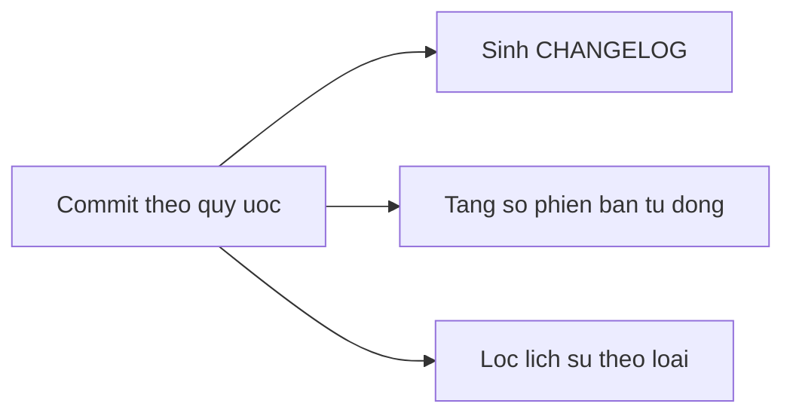

# 3.11 — 9. Conventional Commits

> Nguồn: https://tiennhm.io.vn/en/docs/dotnet-backend-zero-to-senior/stage-01-foundation/module-03-git-developer-workflow/3.11-conventional-commits
> Một quy ước đặt tên commit mở khoá ba thứ tự động: changelog, tăng số phiên bản theo SemVer, và lịch sử tra cứu được. Kèm cách ép quy ước bằng commitlint và cách dùng với squash merge.

> Conventional Commits là một quy ước rất nhỏ — thêm một tiền tố kiểu `feat:` hay `fix:` vào dòng đầu commit message. Giá trị nằm ở chỗ nó biến lịch sử Git từ **văn bản cho người đọc** thành **dữ liệu máy đọc được**, và từ đó ba thứ tự động hoá được: sinh changelog, tăng số phiên bản theo SemVer, và lọc lịch sử theo loại thay đổi. Phần đáng chú ý nhất là quy tắc **breaking change**: một dấu `!` hoặc một footer `BREAKING CHANGE:` là tín hiệu để công cụ tăng số major — tức là quy ước này gắn trực tiếp vào hợp đồng bạn cam kết với người dùng API.

## Mục tiêu bài học

Sau bài này bạn có thể:

- Viết commit message theo đúng cấu trúc Conventional Commits.
- Chọn đúng loại trong `feat`, `fix`, `refactor`, `chore`, `docs`, `test`, `perf`.
- Đánh dấu breaking change và biết nó ảnh hưởng gì tới số phiên bản.
- Cấu hình commitlint để quy ước được ép tự động.
- Dùng quy ước này cùng squash merge trên GitHub.

## Nội dung bài học

### 3.11.1 — Cấu trúc

```
<loại>[phạm vi tuỳ chọn]: <mô tả>

[thân tuỳ chọn]

[footer tuỳ chọn]
```

```
feat(orders): them bao cao doanh thu theo chi nhanh

Bao cao cu chi gop toan cong ty, khong tach duoc theo chi nhanh nen
khong dung de danh gia hieu qua tung noi. Truy van gom theo branch_id
va dung index da co tren (branch_id, created_at).

Closes #142
```

Bốn quy tắc cho dòng đầu:

1. **Thể mệnh lệnh** — `them`, không phải `da them`.
2. **Dưới 72 ký tự.**
3. **Không viết hoa** chữ đầu mô tả, **không chấm** cuối câu.
4. **Phạm vi** trong ngoặc là tuỳ chọn, nên là tên module hoặc vùng chức năng.

### 3.11.2 — Các loại và ảnh hưởng lên phiên bản

| Loại | Nghĩa | Ảnh hưởng SemVer |
|---|---|---|
| `feat` | Tính năng mới | **MINOR** (1.2.0 → 1.3.0) |
| `fix` | Sửa lỗi | **PATCH** (1.2.3 → 1.2.4) |
| `perf` | Cải thiện hiệu năng | PATCH |
| `refactor` | Đổi cấu trúc, **không đổi hành vi** | Không |
| `docs` | Chỉ sửa tài liệu | Không |
| `test` | Thêm hoặc sửa test | Không |
| `build` | Hệ thống build, phụ thuộc | Không |
| `ci` | Cấu hình CI | Không |
| `chore` | Việc vặt khác | Không |
| `style` | Format, dấu cách — **không đổi logic** | Không |

Ranh giới hay gây tranh cãi nhất là `refactor` và `fix`. Tiêu chí dứt khoát: **hành vi quan sát được từ bên ngoài có đổi không?** Đổi thì là `fix` hoặc `feat`; không đổi thì là `refactor`.

### 3.11.3 — Breaking change

Hai cách đánh dấu, cả hai đều làm công cụ tăng số **MAJOR**:

```
feat(api)!: doi dinh dang tra ve cua endpoint /orders

Truong `total` doi tu number sang string de tranh mat chinh xac voi
so nguyen lon trong JavaScript.
```

```
feat(api): doi dinh dang tra ve cua endpoint /orders

BREAKING CHANGE: truong `total` doi tu number sang string.
Client doc truong nay phai parse lai.
```

Dấu `!` gọn hơn; footer `BREAKING CHANGE:` cho phép mô tả dài và hướng dẫn di trú. Với thay đổi lớn, dùng footer.

Lưu ý: `fix!` cũng là breaking change. Sửa một lỗi theo cách làm đổi hợp đồng API vẫn buộc tăng major — [SemVer](https://semver.org/) tính theo **tương thích**, không tính theo ý định.

### 3.11.4 — Ba thứ được mở khoá



**1. Changelog tự động.** Công cụ đọc lịch sử và nhóm theo loại:

```markdown
## 1.3.0 (2026-09-24)

### Features
* **orders:** them bao cao doanh thu theo chi nhanh (a1b2c3d)

### Bug Fixes
* **orders:** chan don hang co tong tien am (e4f5g6h)
```

**2. Tăng phiên bản tự động.** Có `feat` từ lần phát hành trước → tăng minor. Chỉ có `fix` → tăng patch. Có breaking change → tăng major. Không ai phải quyết định thủ công, và không ai quên.

**3. Lịch sử tra cứu được:**

```bash
git log --oneline --grep="^feat"           # mọi tính năng mới
git log --oneline --grep="^fix(orders)"    # mọi bản sửa trong module orders
git log --oneline --grep="BREAKING"        # mọi thay đổi phá vỡ tương thích
```

Câu cuối rất có giá khi ai đó hỏi "vì sao client cũ hỏng sau lần nâng cấp tháng trước".

### 3.11.5 — Ép quy ước bằng commitlint

Quy ước không được ép thì sau ba tuần sẽ có người viết `update code`.

```bash
npm install --save-dev @commitlint/cli @commitlint/config-conventional husky
npx husky init
echo 'npx --no -- commitlint --edit $1' > .husky/commit-msg
```

```javascript
// commitlint.config.js
module.exports = {
  extends: ['@commitlint/config-conventional'],
  rules: {
    'header-max-length': [2, 'always', 72],
  },
};
```

Từ đó, một commit sai quy ước bị **từ chối ngay tại máy**, trước khi lên kho:

```
✖   subject may not be empty [subject-empty]
✖   type may not be empty [type-empty]
```

Với dự án .NET thuần không muốn thêm Node, có thể kiểm ở CI bằng một bước chạy commitlint trên các commit của PR, hoặc đơn giản là kiểm tra **tiêu đề PR** — cách này hợp với mục tiếp theo.

### 3.11.6 — Dùng với squash merge

Đây là chi tiết thực tế quan trọng mà tài liệu gốc không nói.

Khi GitHub **squash merge**, message của commit cuối cùng trên `main` được lấy từ **tiêu đề pull request**, không phải từ các commit trong nhánh. Nghĩa là:

> Trong đội dùng squash merge, thứ cần theo Conventional Commits là **tiêu đề PR**.

Điều này thực ra dễ chịu hơn: các commit trong nhánh cứ thoải mái `wip`, `fix lại`, `sửa theo review`. Chỉ tiêu đề PR là thứ đi vào lịch sử vĩnh viễn.

Cách ép: bật kiểm tra tiêu đề PR trong CI.

```yaml
# .github/workflows/pr-title.yml
name: Kiểm tra tiêu đề PR
on:
  pull_request:
    types: [opened, edited, synchronize]
jobs:
  lint:
    runs-on: ubuntu-latest
    steps:
      - uses: amannn/action-semantic-pull-request@v5
        env:
          GITHUB_TOKEN: ${{ secrets.GITHUB_TOKEN }}
```

### 3.11.7 — Rà lại quy ước của đội

**Danh sách rà soát Conventional Commits**

- [ ] Mọi commit message bắt đầu bằng một loại hợp lệ.
- [ ] Dòng đầu ở thể mệnh lệnh, dưới 72 ký tự, không chấm cuối câu.
- [ ] Phân biệt đúng refactor với fix theo tiêu chí hành vi bên ngoài có đổi không.
- [ ] Breaking change được đánh dấu bằng ! hoặc footer BREAKING CHANGE.
- [ ] Có commitlint chạy ở hook commit-msg, hoặc kiểm tra tiêu đề PR ở CI.
- [ ] Nếu đội dùng squash merge, quy ước áp lên tiêu đề PR.
- [ ] Thân commit message giải thích vì sao, không kể lại diff.
- [ ] CHANGELOG được sinh tự động, không viết tay.

## Bài tập áp dụng

#### Bài 1 — Phân loại lịch sử cũ

Lấy 30 commit gần nhất của dự án. Gán cho mỗi cái một loại Conventional Commits. Đếm bao nhiêu cái bạn **không phân loại nổi** vì message quá mơ hồ.

**Tiêu chí hoàn thành:** bạn có tỉ lệ cụ thể, và nhận ra rằng con số đó chính là phần lịch sử đã mất giá trị.

Gợi ý và lời giải — Bài 1

**Gợi ý.** Lấy danh sách rồi phân loại:

```bash
git log --oneline -30 --no-merges
```

Quy tắc: chỉ được đọc **message**, không được mở diff. Vì đó chính là tình huống của người tra lịch sử sáu tháng sau.

**Lời giải — bảng phân loại mẫu:**

| Message | Loại | Phân loại được? |
|---|---|---|
| `Thêm endpoint xuất báo cáo Excel` | `feat` | Có |
| `Sửa lỗi tính sai doanh thu khi có đơn huỷ` | `fix` | Có |
| `update` | ? | **Không** |
| `fix bug` | `fix` | Một nửa — biết là sửa lỗi, không biết lỗi gì |
| `Cập nhật theo yêu cầu anh Nam` | ? | **Không** |
| `final` | ? | **Không** |
| `Tối ưu truy vấn danh sách khách hàng` | `perf` | Có |
| `Nâng EF Core lên 9.0.1` | `chore` hoặc `build` | Có |
| `abc` | ? | **Không** |

Tỉ lệ thường gặp trên dự án chưa có quy ước: **30–50% không phân loại nổi**.

**Ý nghĩa của con số đó.** Nó không phải điểm số về sự cẩn thận. Nó là **phần lịch sử đã mất giá trị**: với những commit ấy, `git log` không giúp gì cả, và bạn buộc phải mở diff ra đọc từng cái để hiểu điều gì đã xảy ra.

Hệ quả cụ thể ở ba tình huống:

1. **Khi cần biết phiên bản này có gì mới.** Phải đọc 200 diff thay vì đọc 200 dòng message.
2. **Khi `git bisect` chỉ ra một commit.** Message `update` không cho biết commit đó **định** làm gì, nên bạn không biết bản sửa của mình có phá hỏng ý định ban đầu không.
3. **Khi có người mới vào dự án.** Lịch sử lẽ ra là tài liệu tốt nhất về việc *vì sao code thành ra như hiện nay*. Với message mơ hồ, nó là con số không.

**Bảy loại chuẩn:**

| Loại | Dùng khi | Ảnh hưởng phiên bản |
|---|---|---|
| `feat` | Thêm tính năng | MINOR |
| `fix` | Sửa lỗi | PATCH |
| `docs` | Chỉ sửa tài liệu | Không |
| `refactor` | Đổi code, không đổi hành vi | Không |
| `perf` | Cải thiện hiệu năng | PATCH |
| `test` | Thêm hoặc sửa test | Không |
| `chore` | Công việc phụ trợ, nâng gói | Không |

**Không cần sửa lịch sử cũ.** Viết lại message cũ nghĩa là đổi mã băm của toàn bộ lịch sử — cái giá quá lớn so với lợi ích. Bắt đầu áp dụng từ commit tiếp theo là đủ; sau vài tháng phần lịch sử dùng được sẽ chiếm đa số.

#### Bài 2 — Dựng commitlint

Cài commitlint vào một kho thử. Thử commit với message `update code` và ghi lại thông báo từ chối.

**Tiêu chí hoàn thành:** commit bị chặn **trước khi** được tạo, và bạn giải thích được vì sao chặn lúc commit tốt hơn chặn lúc review.

Gợi ý và lời giải — Bài 2

**Gợi ý.** commitlint chạy như một Git hook — một script Git tự gọi ở những thời điểm nhất định. Hook cần dùng ở đây là `commit-msg`, chạy sau khi bạn viết message nhưng trước khi commit được tạo.

**Lời giải — cài đặt:**

```bash
npm init -y
npm install --save-dev @commitlint/cli @commitlint/config-conventional husky

echo "export default { extends: ['@commitlint/config-conventional'] };" > commitlint.config.js

npx husky init
echo 'npx --no -- commitlint --edit "$1"' > .husky/commit-msg
```

**Thử với message sai:**

```bash
git commit -m "update code"
```

```text
⧗   input: update code
✖   subject may not be empty [subject-empty]
✖   type may not be empty [type-empty]

✖   found 2 problems, 0 warnings

husky - commit-msg script failed (code 1)
```

Commit **không được tạo**. Kiểm chứng bằng `git log` — không có gì mới.

**Với message đúng:**

```bash
git commit -m "fix: bo qua don da huy khi tinh doanh thu"
# thành công
```

**Vì sao chặn lúc commit tốt hơn chặn lúc review:**

| Chặn ở đâu | Chi phí sửa |
|---|---|
| Lúc commit | Gõ lại message, 10 giây |
| Lúc CI | Chờ CI xong, sửa, force push, chờ lại — 15 phút |
| Lúc review | Người khác mất công nhắc, bạn phải rebase — nửa giờ và một lần phiền người khác |
| Không bao giờ | Lịch sử hỏng vĩnh viễn |

Nguyên tắc chung: **phản hồi càng sớm càng rẻ**, và chênh lệch không tuyến tính mà theo cấp số.

**Một cái bẫy của hook phía client.** `.husky/` nằm trong kho nên được chia sẻ, nhưng hook chỉ hoạt động sau khi người dùng chạy `npm install`. Người chưa chạy thì hook không tồn tại. Vì vậy hook là **lớp tiện lợi**, không phải lớp bảo đảm.

**Lớp bảo đảm nằm ở CI:**

```yaml
- name: Kiểm tra commit message
  run: npx commitlint --from ${{ github.event.pull_request.base.sha }} --to HEAD
```

Hai lớp bổ sung cho nhau: hook bắt lỗi sớm và rẻ cho người có cài; CI bảo đảm không có gì lọt qua.

**Với đội dùng squash merge.** Message của các commit bên trong nhánh không quan trọng lắm, vì chúng bị gộp lại. Thứ đi vào `main` là **tiêu đề của pull request**. Lúc đó nên kiểm tra tiêu đề PR thay vì từng commit:

```yaml
- uses: amannn/action-semantic-pull-request@v5
```

Chọn đúng chỗ để kiểm tra quan trọng hơn việc kiểm tra nhiều chỗ.

#### Bài 3 — Sinh changelog tự động

Với một kho đã dùng Conventional Commits, chạy công cụ sinh changelog. Đối chiếu kết quả với lịch sử và chỉ ra commit nào bị bỏ sót vì sai quy ước.

**Tiêu chí hoàn thành:** bạn xác định được **vì sao** một commit không xuất hiện trong changelog.

Gợi ý và lời giải — Bài 3

**Gợi ý.** Công cụ sinh changelog chỉ đọc những commit có **tiền tố hợp lệ**. Commit không đúng quy ước bị bỏ qua hoàn toàn — không cảnh báo, không báo lỗi, chỉ đơn giản là biến mất.

**Lời giải.**

```bash
npx conventional-changelog-cli -p angular -i CHANGELOG.md -s -r 0
```

**Kết quả:**

```markdown
# 1.3.0 (2026-09-24)

### Features

* thêm endpoint xuất báo cáo Excel ([a3f2b1c](...))
* hỗ trợ lọc khách hàng theo nhiều chi nhánh ([b4c3d2e](...))

### Bug Fixes

* bỏ qua đơn đã huỷ khi tính doanh thu ([c5d4e3f](...))
* sửa lỗi phân trang khi trang cuối rỗng ([d6e5f4a](...))

### Performance Improvements

* thêm index cho truy vấn danh sách lead ([e7f6a5b](...))
```

**Đối chiếu để tìm commit bị bỏ sót:**

```bash
# Tổng số commit trong khoảng
git log v1.2.0..HEAD --oneline --no-merges | wc -l
# 47

# Số commit có tiền tố hợp lệ
git log v1.2.0..HEAD --oneline --no-merges \
  | grep -cE '(feat|fix|docs|style|refactor|perf|test|build|ci|chore)(\(.+\))?!?:'
# 39

# -> 8 commit bị bỏ sót
```

Liệt kê chúng:

```bash
git log v1.2.0..HEAD --oneline --no-merges \
  | grep -vE '(feat|fix|docs|style|refactor|perf|test|build|ci|chore)(\(.+\))?!?:'
```

**Ba nguyên nhân bị bỏ sót, theo tần suất:**

| Nguyên nhân | Ví dụ | Cách tránh |
|---|---|---|
| Thiếu tiền tố | `sửa lỗi tính tiền` | commitlint |
| Sai chính tả tiền tố | `feature:` thay vì `feat:` | commitlint |
| Thiếu dấu hai chấm | `fix sửa lỗi` | commitlint |

Cả ba đều được commitlint ở bài 2 chặn — đó chính là lý do bài 2 phải làm trước bài này.

**Ba thứ Conventional Commits mở khoá, và đây là lý do thật để dùng nó:**

1. **Changelog tự động.** Không ai phải ngồi viết tay, nên nó luôn đầy đủ và luôn cập nhật.
2. **Tự quyết số phiên bản theo chuẩn SemVer.** `fix` tăng số cuối, `feat` tăng số giữa, thay đổi phá vỡ tăng số đầu:

   ```text
   fix:                 1.2.3 -> 1.2.4
   feat:                1.2.3 -> 1.3.0
   feat!: hoặc BREAKING CHANGE trong phần thân
                        1.2.3 -> 2.0.0
   ```

3. **Lọc lịch sử theo loại.** `git log --grep="^feat"` cho biết mọi tính năng đã thêm; `--grep="^perf"` cho biết mọi lần tối ưu.

**Đánh dấu thay đổi phá vỡ — hai cách:**

```text
feat!: đổi định dạng phản hồi của /api/v1/customers

# hoặc, rõ ràng hơn và nên dùng:
feat: đổi định dạng phản hồi của /api/v1/customers

BREAKING CHANGE: trường `name` đổi thành `fullName`. Client cũ sẽ nhận
null. Xem hướng dẫn chuyển đổi ở docs/migration-v2.md
```

Cách thứ hai tốt hơn vì phần `BREAKING CHANGE` được đưa nguyên văn vào changelog, nên người đọc biết **phải làm gì**, không chỉ biết là có thay đổi.

**Tự động hoá toàn bộ.** `semantic-release` gộp cả ba việc: đọc commit, tính số phiên bản, sinh changelog, tạo thẻ Git và phát hành — chạy trong CI sau mỗi lần merge vào `main`. Lúc đó quy ước commit message không còn là thủ tục nữa mà trở thành **đầu vào của quy trình phát hành**.

## Tự kiểm tra

### Conventional Commits mang lại lợi ích gì cụ thể?

Nó biến lịch sử Git từ văn bản cho người đọc thành dữ liệu máy đọc được, từ đó tự động hoá ba thứ: sinh changelog nhóm theo loại thay đổi, tăng số phiên bản theo SemVer mà không ai phải quyết định thủ công, và lọc lịch sử theo loại bằng git log --grep.

### Phân biệt refactor với fix thế nào?

Theo một tiêu chí duy nhất: hành vi quan sát được từ bên ngoài có thay đổi không. Nếu người dùng hoặc client API nhận kết quả khác đi thì đó là fix hoặc feat. Nếu chỉ cấu trúc code bên trong thay đổi còn đầu vào đầu ra giữ nguyên thì đó là refactor.

### Đánh dấu breaking change bằng cách nào?

Hai cách: thêm dấu chấm than sau loại, ví dụ feat(api)!, hoặc thêm footer BREAKING CHANGE với mô tả. Dấu chấm than gọn hơn; footer cho phép viết dài và kèm hướng dẫn di trú nên hợp với thay đổi lớn. Cả hai đều khiến công cụ tăng số major.

### Một commit fix có thể là breaking change không?

Có. Sửa lỗi theo cách làm thay đổi hợp đồng API vẫn buộc tăng số major, vì SemVer tính theo tính tương thích chứ không tính theo ý định. Trong trường hợp đó viết fix với dấu chấm than, hoặc thêm footer BREAKING CHANGE.

### Khi đội dùng squash merge thì áp quy ước ở đâu?

Ở tiêu đề pull request, vì GitHub lấy tiêu đề PR làm message cho commit squash cuối cùng trên main. Các commit bên trong nhánh cứ thoải mái wip hay fix lại, vì chúng không đi vào lịch sử vĩnh viễn. Cách ép là thêm một bước CI kiểm tra tiêu đề PR.

### Vì sao cần commitlint thay vì chỉ thống nhất miệng?

Vì quy ước không được ép thì sau vài tuần sẽ có người viết update code, và chỉ cần vài commit sai là công cụ sinh changelog bỏ sót thay đổi, còn việc tăng số phiên bản tự động cho ra kết quả sai. Commitlint chạy ở hook commit-msg từ chối ngay tại máy, trước khi commit lên kho.

## Kết luận

Ba điều đáng nhớ nhất:

1. **Quy ước nhỏ, lợi ích tự động.** Một tiền tố đổi lấy changelog, số phiên bản và khả năng tra cứu.
2. **Breaking change gắn với hợp đồng, không gắn với ý định.** `fix` vẫn có thể phá vỡ tương thích.
3. **Dùng squash merge thì quy ước thuộc về tiêu đề PR.** Đây là chi tiết hay bị bỏ sót nhất khi áp dụng.

## Tham khảo

- [Conventional Commits 1.0.0](https://www.conventionalcommits.org/en/v1.0.0/) — đặc tả gốc
- [Semantic Versioning](https://semver.org/) — quy tắc MAJOR.MINOR.PATCH
- [GitHub Pull requests](https://docs.github.com/en/pull-requests) — tuỳ chọn squash merge
- [GitHub Actions](https://docs.github.com/en/actions) — nơi đặt kiểm tra tiêu đề PR

## Điều hướng

- **Bài trước:** [3.10 — 8. Debugging Workflow](3.10-debugging-workflow.mdx)
- **Bài tiếp theo:** [3.12 — Mở rộng và đào sâu](3.12-advanced-notes.mdx)
- **Về module:** [Trang mục lục](./)
