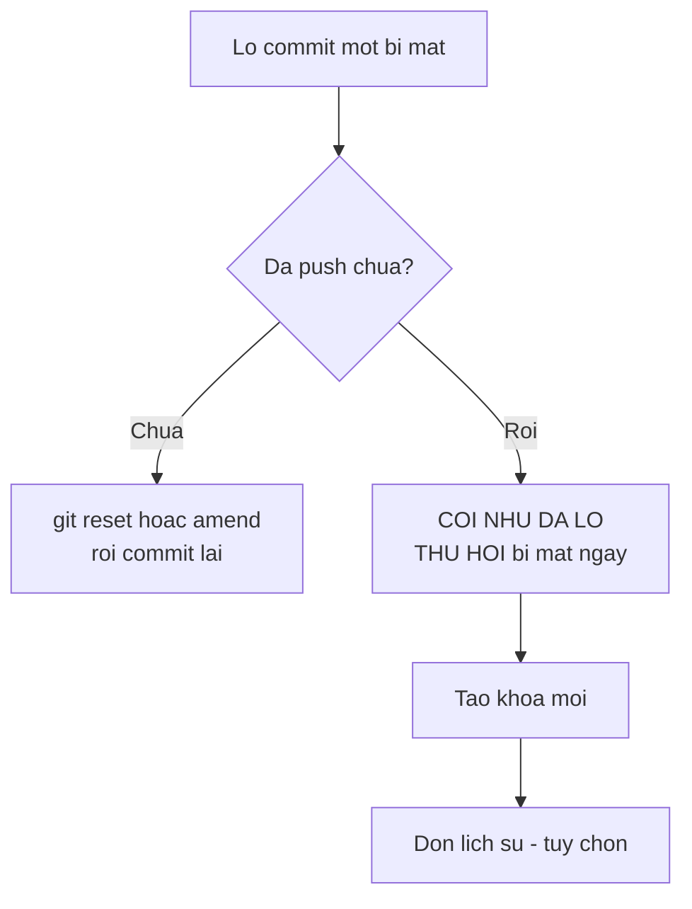

# 3.2 — 2. Cài đặt và cấu hình Git

> Nguồn: https://tiennhm.io.vn/en/docs/dotnet-backend-zero-to-senior/stage-01-foundation/module-03-git-developer-workflow/3.2-git-install-config
> Cấu hình một lần dùng cả đời: danh tính, xử lý ký tự xuống dòng giữa Windows và Linux, SSH key, .gitignore cho .NET, và vì sao đừng commit file .env.

> Có bốn thứ cấu hình một lần rồi dùng mãi, và ba trong số đó gây đau nếu bỏ qua. **Danh tính** quyết định tên hiện trong lịch sử — đặt sai thì mọi commit từ giờ tới lúc phát hiện đều mang tên sai. **`core.autocrlf`** quyết định cách xử lý ký tự xuống dòng; cấu hình sai giữa Windows và Linux khiến một `git diff` hiện ra "toàn bộ file đã thay đổi" trong khi không ai sửa gì. **`.gitignore`** chặn `bin/`, `obj/` và — quan trọng hơn nhiều — chặn file bí mật. Và một sự thật cần nhớ: **đã commit bí mật lên rồi thì xoá đi cũng vẫn còn trong lịch sử**, nên việc duy nhất phải làm là thu hồi nó.

## Mục tiêu bài học

Sau bài này bạn có thể:

- Cấu hình danh tính ở mức toàn cục và ghi đè theo từng kho.
- Chọn đúng `core.autocrlf` cho hệ điều hành của bạn và giải thích vì sao.
- Tạo và đăng ký SSH key thay cho mật khẩu.
- Viết `.gitignore` đúng cho dự án .NET.
- Xử lý đúng khi lỡ commit một bí mật.

## Nội dung bài học

### 3.3.1 — Danh tính: làm ngay sau khi cài

```bash
git config --global user.name  "Nguyen Van A"
git config --global user.email "a@company.com"
```

Hai giá trị này được ghi **vào từng commit**, vĩnh viễn. Đặt sai thì lịch sử ghi sai, và sửa lại đòi viết lại lịch sử — việc rất phiền khi đã đẩy lên chung.

Nếu bạn dùng chung một máy cho công việc và dự án cá nhân, ghi đè theo từng kho:

```bash
cd ~/projects/du-an-ca-nhan
git config user.email "toi@gmail.com"     # không có --global
```

Kiểm tra giá trị đang có hiệu lực và nó đến từ file nào:

```bash
git config --list --show-origin | grep user
```

### 3.3.2 — Ký tự xuống dòng: cái bẫy đa nền tảng

Windows kết thúc dòng bằng `CRLF` (`\r\n`), còn Linux và macOS dùng `LF` (`\n`). Không xử lý thì một người trên Windows mở file do người Linux tạo, lưu lại, và Git báo **toàn bộ file đã thay đổi** — dù không ai sửa một ký tự nào.

```bash
# Trên Windows
git config --global core.autocrlf true     # đổi sang LF khi commit, CRLF khi checkout

# Trên Linux / macOS
git config --global core.autocrlf input    # đổi sang LF khi commit, giữ nguyên khi checkout
```

Nhưng cách bền vững hơn là để **kho tự quy định**, không phụ thuộc cấu hình từng máy. Tạo file `.gitattributes` ở gốc kho:

```gitattributes
* text=auto
*.sh  text eol=lf
*.cs  text diff=csharp
*.png binary
```

File này đi theo kho, nên mọi người trong đội hành xử giống nhau dù cấu hình cá nhân ra sao. Với dự án có cả Windows lẫn Linux — mà backend .NET chạy container thì luôn như vậy — đây gần như là bắt buộc.

### 3.3.3 — SSH key: thay cho mật khẩu

```bash
ssh-keygen -t ed25519 -C "a@company.com"
# Enter để dùng đường dẫn mặc định
# Đặt passphrase — đây là lớp bảo vệ nếu máy bị mất

cat ~/.ssh/id_ed25519.pub     # khoá CÔNG KHAI, dán lên GitHub
```

Hai điều cần phân biệt rõ:

- `id_ed25519.pub` — khoá **công khai**, dán lên GitHub, không sao cả.
- `id_ed25519` — khoá **riêng tư**, không bao giờ rời khỏi máy bạn. Không commit, không gửi qua chat, không chép lên máy chủ.

Kiểm tra kết nối:

```bash
ssh -T git@github.com
# Hi username! You've successfully authenticated...
```

Chọn `ed25519` thay vì `rsa`: khoá ngắn hơn, nhanh hơn, và an toàn tương đương hoặc hơn.

### 3.3.4 — `.gitignore` cho .NET

```gitignore
# Kết quả build
bin/
obj/
[Dd]ebug/
[Rr]elease/

# IDE
.vs/
.idea/
*.user
*.suo

# Bí mật — QUAN TRỌNG NHẤT
appsettings.Development.json
appsettings.*.Local.json
.env
*.pfx
secrets.json

# Khác
*.log
node_modules/
```

Ba nguyên tắc:

1. **Không commit thứ build ra được.** `bin/` và `obj/` tái tạo được từ mã nguồn, và chúng gây xung đột liên tục.
2. **Không commit cấu hình riêng của máy.** `.vs/`, `*.user` là thiết lập cá nhân.
3. **Không commit bí mật.** Chuỗi kết nối, khoá API, chứng chỉ.

Mẹo: `dotnet new gitignore` sinh sẵn một file đầy đủ cho .NET.

Và một điểm hay bị vấp: **`.gitignore` chỉ có tác dụng với file chưa được theo dõi**. File đã commit rồi thì thêm vào `.gitignore` cũng vô ích:

```bash
# Gỡ khỏi theo dõi nhưng giữ lại trên đĩa
git rm --cached appsettings.Development.json
git commit -m "chore: ngung theo doi cau hinh cuc bo"
```

### 3.3.5 — Lỡ commit bí mật thì làm gì

Đây là phần quan trọng nhất của bài, và câu trả lời thường khiến người ta khó chịu.



> Bí mật đã được đẩy lên thì **coi như đã lộ**. Việc đầu tiên và bắt buộc là **thu hồi nó**, không phải xoá commit.

Lý do: giữa lúc push và lúc bạn phát hiện, bí mật đó đã có thể được clone về máy khác, được CI đọc, được lập chỉ mục bởi công cụ quét, hoặc nằm trong cache của nhà cung cấp Git. Xoá commit không lấy lại được những bản sao đó.

Thứ tự việc phải làm:

1. **Thu hồi và tạo khoá mới** — đổi mật khẩu database, huỷ token API. Làm ngay.
2. Dọn lịch sử bằng `git filter-repo` hoặc BFG — **tuỳ chọn**, và chỉ để tránh lộ thêm.
3. Thêm vào `.gitignore` để không tái diễn.
4. Cân nhắc bật quét bí mật tự động trong CI.

Nếu **chưa push**, mọi thứ đơn giản hơn nhiều:

```bash
git reset --soft HEAD~1     # bỏ commit, giữ nguyên thay đổi trong staging
# xoá bí mật khỏi file, thêm vào .gitignore
git commit -m "feat: them cau hinh"
```

### 3.3.6 — Vài cấu hình đáng bật

```bash
# Nhánh mặc định tên main thay vì master
git config --global init.defaultBranch main

# Tô màu output
git config --global color.ui auto

# Khi pull, rebase thay vì tạo merge commit rác
git config --global pull.rebase true

# Tự dọn nhánh theo dõi đã bị xoá trên remote
git config --global fetch.prune true

# Trình soạn thảo cho commit message
git config --global core.editor "code --wait"
```

`pull.rebase true` đáng chú ý nhất: không có nó, mỗi lần `git pull` khi nhánh đã phân kỳ sẽ đẻ ra một merge commit vô nghĩa kiểu "Merge branch 'main' of github.com...". Lịch sử của nhiều dự án đầy những commit như vậy.

### 3.3.7 — Rà lại cấu hình của bạn

**Danh sách rà soát cấu hình Git**

- [ ] user.name và user.email đã đặt đúng, và đúng cho từng loại dự án.
- [ ] Kho có file .gitattributes quy định ký tự xuống dòng cho cả đội.
- [ ] Dùng SSH key ed25519 có passphrase, không dùng mật khẩu.
- [ ] .gitignore đã chặn bin/, obj/, và mọi file cấu hình có bí mật.
- [ ] Không có file bí mật nào đang được Git theo dõi (kiểm tra bằng git ls-files).
- [ ] Đã bật pull.rebase và fetch.prune.
- [ ] Biết quy trình phải làm khi lỡ đẩy một bí mật lên.

## Bài tập áp dụng

#### Bài 1 — Tìm bí mật đang bị theo dõi

Chạy lệnh quét dưới đây trong **mọi** kho bạn có. Với mỗi kết quả, trả lời: file này có chứa giá trị thật không?

**Tiêu chí hoàn thành:** bạn có danh sách file cần xử lý, và biết thứ tự đúng để xử lý chúng.

Gợi ý và lời giải — Bài 1

**Gợi ý.** `git ls-files` liệt kê file **đang được theo dõi**, khác hẳn `ls`. Một file nằm trong `.gitignore` nhưng đã lỡ commit từ trước thì vẫn tiếp tục được theo dõi — `.gitignore` chỉ có tác dụng với file **chưa** được theo dõi bao giờ.

**Lời giải — quét:**

```bash
git ls-files | grep -iE "\.env|secret|appsettings\..*\.json|\.pfx|\.pem|\.key|credentials"
```

Quét cả **lịch sử**, vì file đã xoá vẫn còn trong các commit cũ:

```bash
git log --all --name-only --format="%H" | sort -u | grep -iE "\.env|secret|\.pfx"
```

**Bảng phân loại kết quả:**

| File | Thường có giá trị thật? | Xử lý |
|---|---|---|
| `appsettings.json` | Không — chỉ nên có giá trị mặc định | Giữ, nhưng rà lại chuỗi kết nối |
| `appsettings.Development.json` | **Thường có** | Bỏ theo dõi, thay bằng user secrets |
| `appsettings.Production.json` | **Gần như chắc chắn có** | Bỏ theo dõi ngay, thu hồi mọi bí mật |
| `.env` | **Có** | Bỏ theo dõi, thêm vào `.gitignore` |
| `*.pfx`, `*.pem`, `*.key` | **Có** — là khoá riêng | Thu hồi chứng chỉ, phát hành lại |

**Bỏ theo dõi mà vẫn giữ file trên máy:**

```bash
git rm --cached appsettings.Development.json
echo "appsettings.Development.json" >> .gitignore
git commit -m "chore: bo theo doi file cau hinh co bi mat"
```

**Điều quan trọng nhất, và hay bị làm sai thứ tự.** Lệnh trên **không** xoá bí mật khỏi lịch sử — nó vẫn nằm trong mọi commit cũ, và ai clone kho cũng đọc được. Thứ tự đúng là:

```text
1. THU HỒI bí mật ngay — đổi mật khẩu, xoá token, phát hành lại chứng chỉ
2. Bỏ theo dõi file và thêm vào .gitignore
3. Dọn lịch sử nếu cần (git filter-repo hoặc BFG)
4. Thông báo cho mọi người clone lại kho
```

**Bước 1 trước tiên, không có ngoại lệ.** Dọn lịch sử mất hàng giờ và có thể không triệt để — kho đã được fork, đã có bản sao trên máy người khác, đã bị dịch vụ quét lưu lại. Trong khi đó, thu hồi một token mất **ba mươi giây** và làm cho mọi bản sao trở thành vô dụng. Người ta hay làm ngược lại vì dọn lịch sử có cảm giác "xử lý tận gốc", còn thu hồi thì phiền.

**Thay thế cho file cấu hình khi phát triển:**

```bash
dotnet user-secrets init
dotnet user-secrets set "ConnectionStrings:Crm" "Server=localhost;..."
```

User secrets lưu ngoài thư mục dự án nên không có đường nào lọt vào Git. [Bài 8.7](../../stage-03-aspnet-core-backend/module-08-aspnet-core-fundamentals/8.6-configuration-system.mdx) trình bày thứ tự ưu tiên giữa các nguồn cấu hình.

#### Bài 2 — Tự tạo lỗi ký tự xuống dòng

Trên một kho thử, đặt `core.autocrlf false`, tạo file có `CRLF`, commit. Đổi sang `input` rồi chạy `git diff`. Sau đó thêm `.gitattributes` và làm lại.

**Tiêu chí hoàn thành:** bạn giải thích được vì sao `.gitattributes` đáng tin hơn `core.autocrlf`.

Gợi ý và lời giải — Bài 2

**Gợi ý.** `core.autocrlf` là cấu hình **của từng máy**. `.gitattributes` là file **nằm trong kho**. Hãy nghĩ xem điều gì xảy ra khi một đội có người dùng Windows, người dùng macOS, người dùng Linux.

**Lời giải — tái hiện.**

```bash
mkdir thu-eol && cd thu-eol && git init -q
git config core.autocrlf false

printf 'dong 1\r\ndong 2\r\n' > win.txt      # CRLF
git add . && git commit -q -m "them file CRLF"

git config core.autocrlf input               # đổi cấu hình
git add --renormalize .
git diff --cached --stat
# win.txt | 4 ++--    <- toàn bộ file bị coi là đã thay đổi
```

Không có ký tự nào trong nội dung thật sự đổi, nhưng Git báo **mọi dòng** đều thay đổi, vì `\r\n` đã thành `\n`.

**Vì sao điều này gây hại trong đội.** Một người dùng Windows với `autocrlf=true`, một người dùng macOS với `autocrlf=input`. Mỗi lần người này sửa một dòng rồi commit, Git ghi nhận **cả file** thay đổi. Hệ quả:

- `git diff` trong pull request hiện hàng trăm dòng trong khi thật ra chỉ đổi một dòng — không ai review được.
- `git blame` trỏ mọi dòng về commit chuẩn hoá cuối cùng, nên mất hoàn toàn khả năng truy nguồn.
- Xung đột phát sinh liên tục ở những chỗ không ai đụng vào.

**Cách sửa — `.gitattributes` đặt trong kho:**

```text
# Chuẩn hoá mọi file văn bản về LF trong kho
* text=auto

# File bắt buộc phải là CRLF trên đĩa
*.bat  text eol=crlf
*.cmd  text eol=crlf
*.ps1  text eol=crlf

# File bắt buộc phải là LF
*.sh   text eol=lf

# File nhị phân — không đụng vào
*.png  binary
*.pfx  binary
*.dll  binary
```

Áp dụng cho toàn bộ kho sau khi thêm file:

```bash
git add --renormalize .
git commit -m "chore: chuan hoa ky tu xuong dong bang .gitattributes"
```

**Vì sao `.gitattributes` đáng tin hơn:**

| | `core.autocrlf` | `.gitattributes` |
|---|---|---|
| Phạm vi | Một máy | Toàn kho, mọi người |
| Nằm trong Git | Không | **Có** — được commit và chia sẻ |
| Người mới vào đội | Phải tự cấu hình đúng | Tự động áp dụng |
| Phân biệt theo loại file | Không | **Có** — `.sh` và `.bat` khác nhau |

Điểm thứ hai là quyết định. Cấu hình nào phụ thuộc vào việc **mỗi người nhớ đặt đúng** thì sớm muộn cũng có người quên.

**Với dự án .NET**, hai loại file đáng chú ý: tập lệnh `.sh` phải là LF nếu không sẽ lỗi khi chạy trong container Linux, và `.bat` phải là CRLF nếu không Windows có thể diễn giải sai. Dòng `* text=auto` một mình không xử lý được hai trường hợp này, nên phải khai báo riêng.

#### Bài 3 — Diễn tập thu hồi bí mật

Tạo một token thử trên một dịch vụ bất kỳ, commit nó vào kho **riêng**, push. Sau đó thực hiện đủ quy trình: thu hồi trước, dọn lịch sử sau. Tính thời gian từ lúc phát hiện tới lúc token bị vô hiệu.

**Tiêu chí hoàn thành:** thời gian tới bước thu hồi dưới **5 phút**. Nếu lâu hơn, quy trình của bạn đang sai thứ tự.

> **Warning: Dùng token thử, kho riêng**
>
> Tạo token với quyền thấp nhất và trên kho riêng tư của bạn. Đừng dùng token thật đang phục vụ hệ thống.

Gợi ý và lời giải — Bài 3

**Gợi ý.** Bấm giờ từ lúc bạn "phát hiện" tới lúc token thật sự không dùng được nữa. Đừng tính thời gian dọn lịch sử vào con số đó — đó là bước sau, và nó không làm token an toàn hơn.

**Lời giải — quy trình bốn bước, theo đúng thứ tự.**

**Bước 1 — Thu hồi. Làm ngay, trước mọi thứ khác.**

```text
GitHub  : Settings > Developer settings > Personal access tokens > Delete
Azure   : Portal > Key vault hoặc App registration > xoá và tạo lại secret
AWS     : IAM > Access keys > Deactivate rồi Delete
Database: ALTER USER ... WITH PASSWORD '...'
```

Bấm giờ dừng ở đây. Từ giây phút này, giá trị nằm trong Git trở thành vô hại.

**Bước 2 — Ngăn tái diễn.**

```bash
git rm --cached appsettings.Production.json
echo "appsettings.Production.json" >> .gitignore
git commit -m "chore: bo theo doi file cau hinh"
git push
```

**Bước 3 — Dọn lịch sử, nếu kho sẽ còn được chia sẻ.**

```bash
pip install git-filter-repo
git filter-repo --path appsettings.Production.json --invert-paths
git push --force --all
git push --force --tags
```

**Bước 4 — Thông báo.** Mọi người phải **clone lại**, không phải `git pull`. Lịch sử đã viết lại nên bản sao cũ của họ mâu thuẫn với kho.

**Vì sao thứ tự này là bắt buộc.** Từ lúc bạn `git push` một bí mật lên kho công khai, đồng hồ bắt đầu chạy cho **mọi người khác**:

- Các bot quét kho công khai tìm thấy token mới trong khoảng **vài giây tới vài phút**.
- Kho đã được fork thì bản fork **giữ nguyên lịch sử cũ**, và bạn không xoá được nó.
- GitHub lưu đệm nội dung commit; một commit "đã xoá" vẫn truy cập được qua mã băm trong một khoảng thời gian.
- Ai đã clone trước đó thì có bản sao đầy đủ trên máy họ, vĩnh viễn.

Dọn lịch sử **không** giải quyết được bất kỳ điểm nào ở trên. Chỉ có thu hồi mới giải quyết được tất cả cùng lúc.

**Phòng ngừa — tốt hơn nhiều so với xử lý.**

```bash
# 1. Bật quét bí mật (GitHub bật sẵn cho kho công khai)
# 2. Cài git-secrets hoặc gitleaks làm hook trước khi commit
brew install gitleaks     # hoặc tải bản nhị phân
gitleaks protect --staged

# 3. Dùng user secrets khi phát triển, biến môi trường khi triển khai
dotnet user-secrets set "ApiKey" "gia-tri-that"
```

**Con số đáng nhớ.** Mục tiêu là thu hồi trong dưới 5 phút. Đội nào đặt mục tiêu "dọn sạch lịch sử" thay vì "vô hiệu hoá bí mật" thường mất nhiều giờ, và trong suốt khoảng thời gian đó bí mật vẫn còn hiệu lực.

## Tự kiểm tra

### Vì sao phải đặt user.name và user.email trước khi commit?

Vì hai giá trị này được ghi vĩnh viễn vào từng commit. Đặt sai thì toàn bộ lịch sử từ đó tới lúc phát hiện đều mang tên sai, và sửa lại đòi viết lại lịch sử — việc rất phiền khi đã đẩy lên kho chung.

### core.autocrlf giải quyết vấn đề gì?

Windows kết thúc dòng bằng CRLF còn Linux và macOS dùng LF. Không xử lý thì mở một file do hệ điều hành khác tạo rồi lưu lại sẽ khiến Git báo toàn bộ file đã thay đổi dù không ai sửa gì. Trên Windows đặt true, trên Linux và macOS đặt input.

### Vì sao nên dùng .gitattributes thay vì chỉ đặt core.autocrlf?

Vì core.autocrlf là cấu hình của từng máy, nên mỗi người trong đội có thể đặt khác nhau. File .gitattributes nằm trong kho và đi theo kho, nên mọi người hành xử giống nhau bất kể cấu hình cá nhân. Với dự án có cả Windows lẫn Linux thì gần như bắt buộc.

### Thêm file vào .gitignore sau khi đã commit thì có tác dụng không?

Không. .gitignore chỉ có tác dụng với file chưa được Git theo dõi. File đã commit vẫn tiếp tục được theo dõi. Phải gỡ bằng git rm --cached để ngừng theo dõi mà vẫn giữ file trên đĩa, rồi commit thay đổi đó.

### Lỡ đẩy một bí mật lên thì việc đầu tiên phải làm là gì?

Thu hồi bí mật đó và tạo cái mới — đổi mật khẩu database, huỷ token API. Không phải xoá commit. Lý do là giữa lúc push và lúc phát hiện, bí mật đã có thể được clone về máy khác, bị CI đọc, hoặc bị công cụ quét lập chỉ mục. Dọn lịch sử là việc làm sau và chỉ để tránh lộ thêm.

### pull.rebase true có lợi gì?

Không có nó, mỗi lần git pull khi nhánh đã phân kỳ sẽ tạo một merge commit vô nghĩa kiểu Merge branch main of github.com. Bật rebase thì các commit của bạn được đặt lại lên trên phần mới lấy về, lịch sử thành một đường thẳng và dễ đọc hơn nhiều.

## Kết luận

Ba điều đáng nhớ nhất:

1. **`.gitattributes` mạnh hơn cấu hình cá nhân.** Nó bắt cả đội hành xử giống nhau.
2. **`.gitignore` không hồi tố.** File đã theo dõi thì phải `git rm --cached`.
3. **Bí mật đã push là bí mật đã lộ.** Thu hồi trước, dọn lịch sử sau.

## Tham khảo

- [git-config](https://git-scm.com/docs/git-config) — danh sách đầy đủ các tuỳ chọn
- [gitignore](https://git-scm.com/docs/gitignore) — cú pháp và thứ tự ưu tiên
- [Pro Git — Getting Started](https://git-scm.com/book/en/v2) — chương 1
- [GitHub Actions](https://docs.github.com/en/actions) — nơi đặt quét bí mật tự động

## Điều hướng

- **Bài trước:** [3.1 — 1. Git là gì và tại sao cần](3.1-git-intro-and-motivation.mdx)
- **Bài tiếp theo:** [3.3 — Checklist an toàn khi làm Git](3.3-git-safety-checklist.mdx)
- **Về module:** [Trang mục lục](./)
