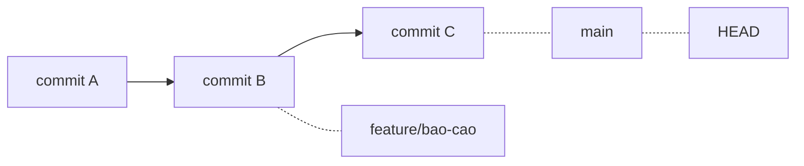

# 3.6 — 4. Branching và Merging

> Nguồn: https://tiennhm.io.vn/en/docs/dotnet-backend-zero-to-senior/stage-01-foundation/module-03-git-developer-workflow/3.6-branching-and-merging
> Nhánh trong Git chỉ là một con trỏ 41 byte. Hiểu điều đó là hiểu vì sao tạo nhánh gần như miễn phí, merge khác rebase ở đâu, và vì sao đừng bao giờ rebase nhánh chung.

> Một nhánh trong Git là **một file văn bản chứa đúng một mã commit** — khoảng 41 byte. Không phải bản sao thư mục, không phải thư mục riêng. Biết điều này là hiểu ngay vì sao tạo nhánh **tức thì và gần như miễn phí**, và vì sao Git khuyến khích tạo nhánh cho mọi việc. Phần còn lại của bài là hai cách hợp nhánh: **merge** giữ nguyên lịch sử thật và tạo một commit hợp nhất, **rebase** viết lại các commit của bạn lên trên nhánh đích cho lịch sử thẳng. Cả hai đều đúng, nhưng có một luật không được phá: **đừng rebase nhánh mà người khác đang dùng**.

## Mục tiêu bài học

Sau bài này bạn có thể:

- Giải thích một nhánh là gì về mặt dữ liệu, và vì sao tạo nhánh rẻ.
- Phân biệt fast-forward merge với merge có commit hợp nhất.
- Chọn giữa merge và rebase theo hoàn cảnh, và nêu luật vàng của rebase.
- Đọc `git log --graph` để hiểu hình dạng lịch sử.
- Dọn nhánh đã merge mà không xoá nhầm nhánh còn việc.

## Nội dung bài học

### 3.6.1 — Nhánh chỉ là một con trỏ

```bash
cat .git/refs/heads/main
# a1b2c3d4e5f6...    ← đúng một dòng, một mã commit
```

Đó là toàn bộ một nhánh. Tạo nhánh mới nghĩa là ghi thêm một file như vậy:

```bash
git branch feature/bao-cao      # tạo con trỏ mới tại commit hiện tại
```

Không có gì được sao chép. Đây là khác biệt lớn so với SVN, nơi tạo nhánh là chép cả cây thư mục — và cũng là lý do trong SVN người ta ngại tạo nhánh, còn trong Git thì tạo thoải mái.

`HEAD` là con trỏ chỉ vào nhánh bạn đang đứng:



Khi bạn commit, Git tạo commit mới rồi **dịch con trỏ nhánh** sang đó. Chuyển nhánh là dịch `HEAD` và cập nhật thư mục làm việc cho khớp.

### 3.6.2 — Đặt tên nhánh

```
feature/bao-cao-doanh-thu      # tính năng mới
fix/don-hang-tong-tien-am      # sửa lỗi
hotfix/loi-thanh-toan          # sửa khẩn cấp trên production
refactor/tach-order-service    # tái cấu trúc
chore/nang-cap-efcore-9        # việc vặt, phụ thuộc
```

Quy ước: `<loại>/<mô-tả-ngắn-bằng-gạch-nối>`. Không dấu, không khoảng trắng.

Nếu đội dùng công cụ quản lý việc, gắn thêm mã issue: `feature/CRM-142-bao-cao-doanh-thu`. Nhờ đó nhìn tên nhánh là biết nó thuộc yêu cầu nào.

### 3.6.3 — Merge: hai hình dạng

**Fast-forward** — khi nhánh đích **không có commit mới** nào kể từ lúc bạn tách ra:

```
Trước:  A --- B --- C (main)
                     \
                      D --- E (feature)

Sau:    A --- B --- C --- D --- E (main, feature)
```

Git chỉ việc **dịch con trỏ `main` lên phía trước**. Không có commit hợp nhất nào được tạo.

**Merge commit** — khi cả hai nhánh đều có commit mới:

```
Trước:  A --- B --- C --- F (main)
                     \
                      D --- E (feature)

Sau:    A --- B --- C --- F --- M (main)
                     \         /
                      D --- E
```

`M` là **merge commit**: commit duy nhất có **hai cha**. Nó ghi lại sự thật rằng hai dòng công việc đã gặp nhau.

```bash
git checkout main
git merge feature/bao-cao              # tự chọn kiểu phù hợp
git merge --no-ff feature/bao-cao      # luôn tạo merge commit, kể cả khi ff được
```

`--no-ff` đáng dùng khi bạn muốn lịch sử **giữ lại dấu vết của từng tính năng** — nhìn đồ thị là thấy rõ nhánh nào gom vào lúc nào. Nhiều đội đặt nó làm mặc định cho nhánh tính năng.

### 3.6.4 — Rebase: viết lại để lịch sử thẳng

```
Trước:  A --- B --- C --- F (main)
                     \
                      D --- E (feature)

Sau:    A --- B --- C --- F (main)
                           \
                            D' --- E' (feature)
```

Chú ý `D'` và `E'` có dấu phẩy: chúng là **commit mới**, mã băm khác, dù nội dung thay đổi giống hệt. Đúng như [bài 3.2](3.2-git-intro-and-motivation.mdx) đã nói — commit không sửa được, chỉ tạo mới.

```bash
git checkout feature/bao-cao
git rebase main
```

| | Merge | Rebase |
|---|---|---|
| Lịch sử | Giữ nguyên sự thật, có nhánh | Thẳng, dễ đọc |
| Mã commit | Không đổi | **Đổi hết** |
| An toàn trên nhánh chung | Có | **Không** |
| Xung đột | Giải một lần | Có thể phải giải ở **từng commit** |

### 3.6.5 — Luật vàng của rebase

> **Đừng rebase commit mà người khác đã có.**

Lý do đã nằm sẵn trong mô hình dữ liệu: rebase tạo commit **mới** với mã băm mới. Đồng nghiệp đang giữ commit cũ. Khi họ `pull`, Git thấy hai dãy commit khác nhau cùng nội dung và không có cách nào biết chúng là một — nên họ rơi vào tình trạng phân kỳ, và nếu merge thì mọi thay đổi xuất hiện hai lần.

Quy tắc dùng được ngay:

- **Nhánh riêng của bạn, chưa ai pull** → rebase thoải mái, cho lịch sử sạch.
- **Nhánh chung (`main`, `develop`)** → chỉ merge.
- **Nhánh của bạn nhưng đã push và có người xem** → hỏi trước, hoặc merge.

Một cách dùng rebase rất có ích: dọn nhánh riêng **trước khi** mở pull request.

```bash
git rebase -i main      # interactive: gộp, sửa message, bỏ commit rác
```

`rebase -i` cho phép `squash` năm commit kiểu "fix", "fix lại", "fix nữa" thành một commit sạch trước khi trình cho người khác đọc.

### 3.6.6 — Dọn nhánh

```bash
# Xem nhánh nào ĐÃ merge vào nhánh hiện tại
git branch --merged

# Xoá nhánh đã merge (an toàn: Git từ chối nếu chưa merge)
git branch -d feature/bao-cao

# Xoá cưỡng bức, kể cả chưa merge — CẨN THẬN
git branch -D feature/bao-cao

# Xoá nhánh trên remote
git push origin --delete feature/bao-cao

# Dọn các nhánh theo dõi đã bị xoá trên remote
git fetch --prune
```

Khác biệt giữa `-d` và `-D` là một lưới an toàn thật sự: `-d` **từ chối** xoá nhánh chưa merge. Chỉ dùng `-D` khi bạn cố ý vứt bỏ công việc trên nhánh đó — và kể cả lúc ấy, [`reflog`](3.4-git-safety-checklist.mdx) vẫn cứu được trong 90 ngày.

### 3.6.7 — Rà lại cách bạn dùng nhánh

**Danh sách rà soát nhánh**

- [ ] Mỗi tính năng và mỗi lần sửa lỗi đều có nhánh riêng, không commit thẳng vào main.
- [ ] Tên nhánh theo quy ước loại/mô-tả, không dấu, không khoảng trắng.
- [ ] Chưa bao giờ rebase một nhánh mà người khác đã pull.
- [ ] Dọn nhánh riêng bằng rebase -i trước khi mở pull request.
- [ ] Dùng git branch -d chứ không phải -D, trừ khi cố ý vứt bỏ.
- [ ] Đã bật fetch.prune để nhánh theo dõi cục bộ không tồn đọng.
- [ ] Nhánh tính năng sống ngắn — gộp trong vài ngày, không vài tuần.

## Bài tập áp dụng

1. **Nhìn thấy con trỏ.** Tạo một nhánh mới, rồi `cat .git/refs/heads/<tên>`. Commit một lần rồi xem lại file đó. Giải thích thứ vừa thay đổi.

2. **So sánh hai hình dạng.** Tạo hai nhánh cùng tách từ `main`, mỗi nhánh một commit. Merge nhánh thứ nhất (fast-forward), rồi merge nhánh thứ hai (tạo merge commit). Xem `git log --oneline --graph --all` và mô tả khác biệt.

3. **Dọn trước khi trình.** Tạo một nhánh với năm commit lộn xộn kiểu "wip", "fix", "fix nữa". Dùng `git rebase -i main` gộp thành hai commit có message tử tế. So sánh `git log` trước và sau.

## Tự kiểm tra

### Một nhánh trong Git là gì về mặt dữ liệu?

Là một file văn bản chứa đúng một mã commit, khoảng 41 byte, nằm trong .git/refs/heads. Không có gì được sao chép khi tạo nhánh. Đó là lý do tạo nhánh trong Git tức thì và gần như miễn phí, khác hẳn SVN nơi tạo nhánh là chép cả cây thư mục.

### Fast-forward merge khác merge commit ở đâu?

Fast-forward xảy ra khi nhánh đích không có commit mới nào kể từ lúc tách ra; Git chỉ dịch con trỏ lên phía trước và không tạo commit nào. Merge commit xảy ra khi cả hai nhánh đều có commit mới; Git tạo một commit có hai cha để ghi lại việc hai dòng công việc gặp nhau.

### Vì sao không được rebase nhánh chung?

Vì rebase tạo ra các commit mới với mã băm mới, trong khi đồng nghiệp đang giữ commit cũ. Khi họ pull, Git thấy hai dãy commit khác nhau dù nội dung giống hệt và không biết chúng là một, nên họ rơi vào trạng thái phân kỳ. Nếu merge tiếp thì mọi thay đổi xuất hiện hai lần.

### Khi nào nên dùng rebase?

Trên nhánh riêng của bạn mà chưa ai pull, đặc biệt là để dọn dẹp trước khi mở pull request. git rebase -i cho phép gộp những commit kiểu wip và fix thành một commit sạch, và đặt lại các commit của bạn lên trên phần mới nhất của nhánh đích để lịch sử thẳng.

### git branch -d và -D khác nhau thế nào?

Chữ d thường từ chối xoá nếu nhánh chưa được merge, nên nó là một lưới an toàn. Chữ D hoa xoá cưỡng bức bất kể đã merge hay chưa. Chỉ dùng D khi cố ý vứt bỏ công việc trên nhánh đó — và kể cả khi đó, reflog vẫn cứu lại được trong 90 ngày.

### --no-ff có lợi gì?

Nó buộc Git tạo merge commit ngay cả khi fast-forward được. Nhờ đó lịch sử giữ lại dấu vết của từng nhánh tính năng: nhìn đồ thị là thấy rõ nhánh nào được gom vào lúc nào, và revert cả tính năng chỉ cần revert đúng merge commit đó.

## Kết luận

Ba điều đáng nhớ nhất:

1. **Nhánh là con trỏ 41 byte.** Tạo nhánh gần như miễn phí, nên hãy tạo cho mọi việc.
2. **Rebase tạo commit mới, không sửa commit cũ.** Đó là toàn bộ lý do không được rebase nhánh chung.
3. **`rebase -i` trước khi mở PR.** Người review đọc lịch sử của bạn — hãy cho họ một câu chuyện mạch lạc.

## Tham khảo

- [git-merge](https://git-scm.com/docs/git-merge) — các chiến lược hợp nhánh
- [git-rebase](https://git-scm.com/docs/git-rebase) — kèm chế độ interactive
- [Pro Git — Git Branching](https://git-scm.com/book/en/v2) — chương 3, có hình minh hoạ đầy đủ
- [GitHub Pull requests](https://docs.github.com/en/pull-requests)

## Điều hướng

- **Bài trước:** [3.5 — 3. Workflow cơ bản](3.5-workflow-co-ban.mdx)
- **Bài tiếp theo:** [3.7 — 5. GitHub và Pull Request](3.7-github-and-pull-request.mdx)
- **Về module:** [Trang mục lục](./)
