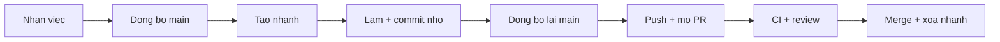
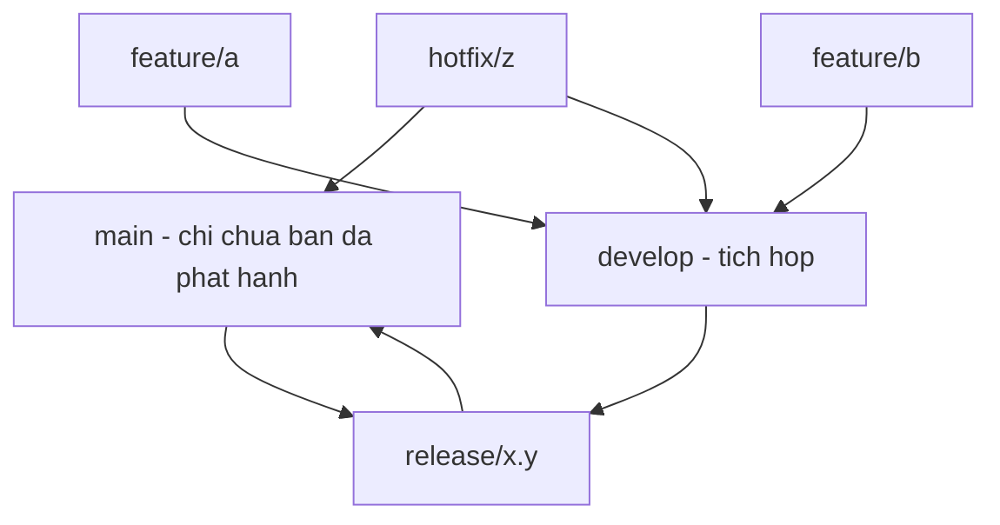
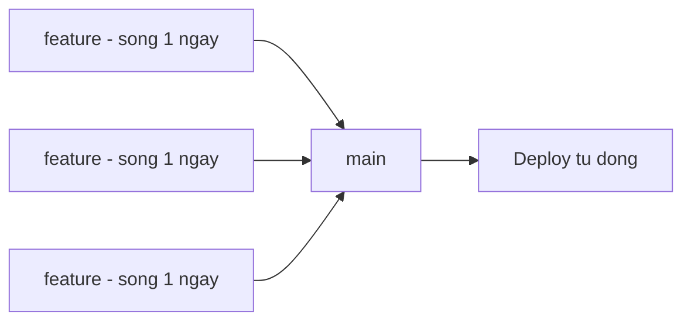

# 3.8 — 7. Developer Workflow thực tế

> Nguồn: https://tiennhm.io.vn/en/docs/dotnet-backend-zero-to-senior/stage-01-foundation/module-03-git-developer-workflow/3.8-real-world-developer-workflow
> Một ngày làm việc thật từ nhận việc tới deploy: chọn mô hình nhánh, quy trình hotfix khi production đang hỏng, và vì sao trunk-based hợp với đội nhỏ hơn Git Flow.

> Biết lệnh Git chưa đủ; cái quyết định là **quy ước của đội**. Bài này so sánh hai mô hình phổ biến và đưa ra khuyến nghị rõ ràng: **Git Flow** với năm loại nhánh sinh ra cho thời kỳ phần mềm phát hành theo phiên bản đóng gói, nên với đội nhỏ deploy vài lần một tuần nó chỉ tạo thêm nghi lễ; **trunk-based** với nhánh sống dưới một ngày hợp hơn nhiều. Phần thứ hai là **quy trình hotfix** — thứ bạn chỉ cần tới lúc production đang hỏng và không còn đầu óc để nghĩ ra, nên phải viết sẵn từ trước.

## Mục tiêu bài học

Sau bài này bạn có thể:

- Đi hết một chu trình từ nhận việc tới merge mà không bỏ bước nào.
- So sánh Git Flow với trunk-based và chọn theo quy mô đội.
- Thực hiện một hotfix đúng thứ tự khi production đang hỏng.
- Giải thích vì sao feature flag thay thế được nhánh sống lâu.
- Nhận ra dấu hiệu quy trình của đội đang quá nặng.

## Nội dung bài học

### 3.9.1 — Một ngày làm việc



```bash
# 1. Đồng bộ trước khi bắt đầu
git checkout main && git pull

# 2. Nhánh cho đúng một việc
git checkout -b feature/CRM-142-bao-cao-doanh-thu

# 3. Làm việc, commit nhỏ và thường xuyên
git add -p && git commit -m "feat: them truy van doanh thu theo chi nhanh"

# 4. Trước khi mở PR, đồng bộ lại
git fetch origin && git rebase origin/main

# 5. Đẩy lên và mở PR
git push -u origin feature/CRM-142-bao-cao-doanh-thu

# 6. Sau khi merge, dọn
git checkout main && git pull
git branch -d feature/CRM-142-bao-cao-doanh-thu
git fetch --prune
```

Bước 4 là bước hay bị bỏ nhất, và là bước tiết kiệm nhiều thời gian nhất. Đồng bộ **trước khi** mở PR nghĩa là bạn giải xung đột trên máy mình, lúc rảnh rang — thay vì giải nó trong giao diện web khi người review đang chờ.

### 3.9.2 — Git Flow



Năm loại nhánh: `main`, `develop`, `feature/*`, `release/*`, `hotfix/*`.

**Hợp khi:** phần mềm phát hành theo phiên bản đóng gói, phải hỗ trợ nhiều phiên bản cùng lúc, có giai đoạn QA tách biệt, hoặc khách hàng tự quyết khi nào nâng cấp.

**Không hợp khi:** đội nhỏ, deploy liên tục, chỉ có một phiên bản đang chạy — tức là phần lớn ứng dụng web nội bộ và SaaS.

Git Flow ra đời năm 2010, cho bối cảnh phát hành theo bản. Chính tác giả của nó sau này đã ghi chú rằng nó **không phù hợp** với các đội làm sản phẩm web deploy liên tục. Dùng nó cho một API nội bộ deploy ba lần một tuần là mang bộ máy của một nhà xuất bản phần mềm vào một đội năm người.

### 3.9.3 — Trunk-based



Một nhánh chính. Nhánh tính năng **sống dưới một ngày**. Merge vào `main` liên tục. `main` luôn ở trạng thái deploy được.

Điều kiện để chạy được:

- **Bộ test đủ tin cậy**, vì không có giai đoạn QA riêng để bắt lỗi.
- **CI nhanh**, dưới 10 phút, nếu không người ta sẽ ngại merge.
- **Feature flag** cho tính năng chưa hoàn thiện.

Điểm thứ ba là chìa khoá. Nó giải quyết mâu thuẫn "tính năng chưa xong thì merge kiểu gì":

```csharp
if (_features.IsEnabled("new-revenue-report"))
{
    return await _newReportService.GenerateAsync(ct);
}
return await _legacyReportService.GenerateAsync(ct);
```

Code chưa hoàn thiện vẫn **vào `main` mỗi ngày**, chỉ là chưa bật cho người dùng. Đổi lại bạn không bao giờ có nhánh sống ba tuần — thứ gây ra phần lớn xung đột nặng.

Cái giá: phải dọn flag sau khi tính năng ổn định. Flag bỏ quên tích tụ thành một dạng nợ kỹ thuật riêng.

### 3.9.4 — Hotfix: viết sẵn trước khi cần

Production đang hỏng. Đây là lúc **không nên** nghĩ ra quy trình.

```bash
# 1. Tách từ TRẠNG THÁI ĐANG CHẠY, không phải từ develop
git checkout main && git pull
git checkout -b hotfix/don-hang-tong-tien-am

# 2. Sửa NHỎ NHẤT CÓ THỂ — chỉ chặn máu, không tái cấu trúc
git commit -am "fix: chan don hang co tong tien am"

# 3. Vẫn mở PR, vẫn để CI chạy
git push -u origin hotfix/don-hang-tong-tien-am

# 4. Merge và deploy

# 5. Gộp ngược về nhánh phát triển nếu mô hình có nhánh đó
git checkout develop && git merge hotfix/don-hang-tong-tien-am
```

Bốn nguyên tắc, và mỗi cái đều từng bị vi phạm với hậu quả thật:

1. **Tách từ nhánh đang chạy trên production.** Tách từ `develop` là kéo theo mọi thứ chưa được kiểm thử.
2. **Sửa nhỏ nhất có thể.** Hotfix không phải lúc dọn dẹp. Ghi lại việc dọn vào một issue riêng.
3. **Vẫn chạy CI.** Cám dỗ bỏ qua khi đang gấp là lớn nhất, và đó cũng là lúc một lỗi thứ hai gây thiệt hại nhất.
4. **Đừng quên bước 5.** Quên gộp ngược về nhánh phát triển thì lần phát hành sau sẽ **xoá mất bản vá**, và lỗi quay lại.

Bước 5 là lỗi kinh điển của các đội dùng Git Flow, và là một điểm cộng nữa cho trunk-based — nơi chỉ có một nhánh nên không có gì để quên.

### 3.9.5 — Chọn mô hình nào

| | Git Flow | Trunk-based |
|---|---|---|
| Quy mô đội | Vừa và lớn | Mọi quy mô, tốt nhất với nhỏ |
| Nhịp phát hành | Theo bản, có lịch | Liên tục |
| Tuổi nhánh | Nhiều tuần | **Dưới một ngày** |
| Cần feature flag | Không | **Có** |
| Cần bộ test mạnh | Vừa | **Rất cần** |
| Độ phức tạp quy trình | Cao | Thấp |

Khuyến nghị thực dụng: **bắt đầu bằng trunk-based**. Chỉ thêm nhánh và quy trình khi có một vấn đề cụ thể đòi hỏi. Quy trình nặng rất dễ thêm vào và rất khó bỏ đi.

### 3.9.6 — Dấu hiệu quy trình đang quá nặng

- Mỗi thay đổi nhỏ mất hơn một ngày để tới production.
- Có nhánh sống hơn hai tuần.
- Người ta thường xuyên phải giải cùng một xung đột nhiều lần.
- Có bước trong quy trình mà không ai giải thích được vì sao tồn tại.
- Hotfix phải đi vòng qua ba nhánh trước khi tới được production.

Mỗi dấu hiệu trên là một chi phí trả hằng ngày. Quy trình tồn tại để giảm rủi ro — khi nó không còn giảm rủi ro nào cụ thể, nó chỉ còn là chi phí.

### 3.9.7 — Rà lại quy trình của đội

**Danh sách rà soát workflow của đội**

- [ ] Nhánh tính năng sống dưới một tuần, lý tưởng là dưới một ngày.
- [ ] Đồng bộ với main trước khi mở PR, không phải sau.
- [ ] main luôn ở trạng thái deploy được.
- [ ] Có quy trình hotfix viết sẵn, và mọi người biết nó ở đâu.
- [ ] Hotfix tách từ nhánh đang chạy trên production.
- [ ] Có cơ chế feature flag cho tính năng chưa hoàn thiện.
- [ ] Có lịch dọn các feature flag đã hết vai trò.
- [ ] Mỗi bước trong quy trình đều giải thích được nó giảm rủi ro gì.

## Bài tập áp dụng

#### Bài 1 — Đo tuổi nhánh của đội

Chạy lệnh dưới đây trên kho của đội. Đếm số nhánh sống quá hai tuần.

```bash
git for-each-ref --sort=committerdate \
  --format='%(refname:short)  %(committerdate:relative)  %(authorname)' \
  refs/remotes/origin
```

**Tiêu chí hoàn thành:** bạn có con số cụ thể, và với mỗi nhánh già bạn biết nó đang chờ gì.

Gợi ý và lời giải — Bài 1

**Gợi ý.** Con số thô chưa đủ. Phân loại từng nhánh già theo **lý do** nó còn sống thì mới ra được hành động.

**Lời giải — output điển hình:**

```text
origin/fix/hotfix-tong-tien       2 days ago     An
origin/feat/bao-cao-doanh-thu     9 days ago     Bình
origin/feat/tich-hop-thanh-toan   5 weeks ago    Cường
origin/refactor/tach-service      3 months ago   Dũng
origin/feat/dashboard-v2          7 months ago   (đã nghỉ việc)
```

**Phân loại và hành động:**

| Lý do nhánh còn sống | Hành động |
|---|---|
| Đang làm dở, sẽ xong tuần này | Không sao |
| Chờ review đã lâu | Vấn đề **quy trình**, không phải kỹ thuật — nhắc hoặc đổi người review |
| Chờ một phụ thuộc bên ngoài | Tách phần độc lập ra merge trước, phần còn lại để sau feature flag |
| Đã bị bỏ | **Xoá** — commit vẫn còn trong reflog nếu cần |
| Người viết đã rời dự án | Xem còn giá trị không; có thì cử người tiếp quản, không thì xoá |

**Vì sao nhánh già là vấn đề, cụ thể:**

1. **Xung đột tăng theo bình phương thời gian.** Nhánh sống một ngày lệch với `main` vài commit; nhánh ba tháng lệch hàng trăm commit, và mỗi commit đó là một cơ hội xung đột.
2. **Xung đột ngữ nghĩa tích tụ.** Loại xung đột mà Git không thấy ([bài 3.8](3.7-git-conflicts.mdx)) sinh ra càng nhiều khi khoảng cách càng lớn, và chúng chỉ lộ ra lúc build hoặc lúc chạy.
3. **Công sức đã bỏ ra có nguy cơ mất trắng.** Một nhánh ba tháng không merge được nữa thường bị bỏ hẳn, kéo theo toàn bộ công việc trong đó.
4. **Người viết quên mất ngữ cảnh.** Sau vài tuần, chính tác giả cũng không nhớ vì sao đã làm như vậy, nên việc giải xung đột trở nên rủi ro.

**Xoá nhánh đã merge, hàng loạt:**

```bash
# Xem trước những nhánh đã merge vào main
git branch -r --merged origin/main | grep -v 'main\|HEAD'

# Xoá trên máy các nhánh đã merge
git branch --merged main | grep -v '^\*\|main' | xargs -r git branch -d

# Dọn các nhánh theo dõi trỏ tới nhánh đã bị xoá trên máy chủ
git fetch --prune
```

**Cách phòng tốt hơn cách dọn.** Bật *Automatically delete head branches* trong cài đặt kho trên GitHub — nhánh tự biến mất ngay sau khi PR được merge, nên danh sách nhánh luôn chỉ chứa việc đang làm dở.

**Chỉ số đáng theo dõi.** Tuổi trung vị của nhánh đang mở. Dưới 3 ngày là lành mạnh; trên 2 tuần là dấu hiệu quy trình đang có chỗ tắc, và chỗ tắc thường là **review** chứ không phải lập trình.

#### Bài 2 — Viết quy trình hotfix cho đội

Soạn một tài liệu **một trang** cho đội bạn theo năm bước ở mục 3.9.4, có tên người chịu trách nhiệm ở từng bước. Đặt nó ở nơi tìm được trong 30 giây.

**Tiêu chí hoàn thành:** một người chưa từng làm hotfix đọc xong là thực hiện được, không cần hỏi ai.

Gợi ý và lời giải — Bài 2

**Gợi ý.** Viết cho **người đang hoảng lúc 2 giờ sáng**. Nghĩa là: câu ngắn, lệnh sao chép dán được, không có chữ "tuỳ tình huống", và ghi rõ ai quyết định cái gì.

**Lời giải — mẫu dùng được ngay:**

```markdown
# Quy trình hotfix — CRM Backend

> Vị trí: README của kho, mục "Vận hành". Cũng ghim ở kênh #crm-oncall.

## Bước 0 — Trước khi sửa code (2 phút)

- [ ] Báo vào kênh #crm-oncall: triệu chứng, thời điểm bắt đầu, phạm vi ảnh hưởng
- [ ] Quyết định: **quay lui** hay **vá tới**?
      -> Nếu lỗi đến từ lần triển khai gần nhất: QUAY LUI trước, điều tra sau
      -> Người quyết định: trưởng nhóm, hoặc người trực nếu ngoài giờ

## Bước 1 — Tách nhánh từ trạng thái ĐANG CHẠY

    git checkout main && git pull
    git checkout -b hotfix/<mo-ta-ngan>

KHÔNG tách từ develop hay từ nhánh tính năng.

## Bước 2 — Sửa nhỏ nhất có thể

Chỉ chặn máu. Không tái cấu trúc, không dọn dẹp, không đổi tên.
Việc dọn dẹp -> tạo issue riêng, làm sau.

## Bước 3 — Vẫn mở PR, vẫn để CI chạy

    git push -u origin hotfix/<mo-ta-ngan>

- Người review: bất kỳ ai đang online. Không chờ đúng người.
- CI hỏng -> KHÔNG bỏ qua. Đây là lúc lỗi thứ hai gây thiệt hại nhất.

## Bước 4 — Merge và triển khai

- Người bấm merge: người review
- Người theo dõi triển khai: người viết bản vá
- [ ] Xác nhận lỗi đã hết trên production (nêu rõ cách kiểm tra)

## Bước 5 — Sau khi xong (trong 24 giờ)

- [ ] Gộp ngược về nhánh phát triển, nếu mô hình có nhánh đó
- [ ] Viết báo cáo sự cố: nguyên nhân gốc, dòng thời gian, cách phòng
- [ ] Tạo issue cho phần dọn dẹp đã bỏ qua ở bước 2

## Liên hệ

| Vai trò | Người | Kênh |
|---|---|---|
| Trực chính | (tên) | (điện thoại) |
| Quản trị database | (tên) | (điện thoại) |
| Quyết định thông báo khách hàng | (tên) | (điện thoại) |
```

**Bốn điều làm nên một quy trình hotfix dùng được:**

1. **Bước 0 tồn tại.** Câu hỏi "quay lui hay vá tới" phải được hỏi **trước** khi ai đó bắt đầu gõ code. Quay lui thường nhanh hơn và an toàn hơn, nhưng người ta hay bỏ qua nó vì bản năng là muốn sửa.
2. **Có tên người, không chỉ có vai trò.** "Trưởng nhóm quyết định" là vô dụng lúc 2 giờ sáng nếu không ai biết số điện thoại.
3. **Lệnh sao chép dán được.** Không viết "tách nhánh từ main" mà viết đúng dòng lệnh.
4. **Bước 5 có thời hạn.** Không có thời hạn thì nó không bao giờ được làm, và bước gộp ngược bị quên chính là nguyên nhân lỗi quay trở lại ở lần phát hành sau.

**Kiểm tra tài liệu có dùng được không.** Đưa cho một người chưa từng làm hotfix và hỏi: *"đọc xong bạn có biết việc đầu tiên phải làm là gì không?"* Nếu họ ngập ngừng, tài liệu chưa đạt.

#### Bài 3 — Diễn tập hotfix có tính giờ

Cố ý triển khai một lỗi lên môi trường thử nghiệm. Chạy đủ quy trình hotfix, tính giờ từ lúc phát hiện tới lúc bản vá lên staging. Ghi lại bước nào chậm nhất.

**Tiêu chí hoàn thành:** bạn có con số tổng và thời gian của từng bước, đủ để chỉ ra chỗ tắc.

Gợi ý và lời giải — Bài 3

**Gợi ý.** Bấm giờ từng bước riêng, không chỉ tổng. Chỗ tắc thường **không** nằm ở bước viết code, và điều đó chỉ lộ ra khi bạn đo tách bạch.

**Lời giải — bảng ghi mẫu:**

| Bước | Thời gian | Nhận xét |
|---|---|---|
| Phát hiện → báo vào kênh chung | 4 phút | Cảnh báo tự động hoạt động tốt |
| Quyết định quay lui hay vá tới | 11 phút | **Chậm** — không rõ ai được quyết |
| Tách nhánh và viết bản vá | 6 phút | Lỗi đơn giản |
| Chờ CI | **14 phút** | **Chậm nhất** |
| Chờ review | 8 phút | May mắn có người online |
| Merge và triển khai | 5 phút | Tự động |
| **Tổng** | **48 phút** | |

**Ba chỗ tắc thường gặp nhất, và cách xử lý:**

**1. CI quá chậm.** Đây gần như luôn là bước dài nhất. 14 phút chờ trong lúc production đang hỏng là rất lâu. Cách rút ngắn:

```yaml
# Workflow riêng cho nhánh hotfix, chỉ chạy phần thiết yếu
on:
  pull_request:
    branches: [main]
jobs:
  fast-check:
    if: startsWith(github.head_ref, 'hotfix/')
    steps:
      - run: dotnet test --filter "Category=Critical"
```

Bộ test đầy đủ vẫn chạy, nhưng chạy **sau** khi merge thay vì chặn trước.

**2. Không rõ ai được quyết.** 11 phút ở bước quyết định là thời gian thuần tuý để đi tìm người. Sửa bằng cách ghi thẳng tên và số điện thoại vào tài liệu như bài 2, và quy định rõ: ngoài giờ làm việc thì người trực có toàn quyền quyết định.

**3. Chờ review.** Với hotfix, quy tắc "phải đúng người sở hữu module review" là một chỗ tắc nguy hiểm. Quy tắc thay thế: **bất kỳ ai đang online**, và người sở hữu module sẽ xem lại sau.

**Hai chỉ số đáng theo dõi lâu dài:**

| Chỉ số | Nghĩa | Mục tiêu tốt |
|---|---|---|
| Thời gian tới lúc khắc phục | Từ phát hiện tới lúc hết lỗi | Dưới 1 giờ |
| Thời gian triển khai một dòng | Từ commit tới production, lúc bình thường | Dưới 30 phút |

Chỉ số thứ hai quan trọng hơn vẻ ngoài của nó: nó đặt **giới hạn dưới** cho chỉ số thứ nhất. Nếu bình thường mất 2 giờ để đưa một dòng code lên production, thì lúc khẩn cấp bạn không thể nhanh hơn 2 giờ — trừ khi bỏ qua các bước an toàn, và đó chính là lúc sự cố thứ hai xảy ra.

**Vì sao phải diễn tập thật.** Quy trình chưa bao giờ chạy thử là quy trình chưa biết có chạy được không. Diễn tập trên staging cho bạn phát hiện những thứ không ai lường trước: thiếu quyền triển khai, biến môi trường sai, cảnh báo không gửi tới đúng người. Phát hiện những thứ đó lúc diễn tập rẻ hơn nhiều so với lúc production đang hỏng.

## Tự kiểm tra

### Vì sao nên đồng bộ với main trước khi mở PR?

Vì bạn giải xung đột trên máy mình lúc rảnh rang, với đầy đủ công cụ và có thể chạy test ngay. Nếu để sau, bạn phải giải xung đột trong giao diện web khi người review đang chờ, và CI có thể chạy trên một kết quả merge khác với thứ bạn đã kiểm tra.

### Khi nào Git Flow phù hợp?

Khi phần mềm phát hành theo phiên bản đóng gói, phải hỗ trợ nhiều phiên bản cùng lúc, có giai đoạn QA tách biệt, hoặc khách hàng tự quyết khi nào nâng cấp. Nó ra đời năm 2010 cho bối cảnh đó. Với đội nhỏ deploy liên tục và chỉ có một phiên bản đang chạy thì nó chỉ tạo thêm nghi lễ.

### Trunk-based cần điều kiện gì?

Ba điều kiện: bộ test đủ tin cậy vì không có giai đoạn QA riêng, CI nhanh dưới mười phút nếu không người ta sẽ ngại merge, và feature flag cho tính năng chưa hoàn thiện. Điều kiện thứ ba là chìa khoá vì nó cho phép merge code chưa xong vào main mỗi ngày mà chưa bật cho người dùng.

### Vì sao hotfix phải tách từ nhánh đang chạy trên production?

Vì tách từ nhánh phát triển sẽ kéo theo mọi thay đổi chưa được kiểm thử vào bản vá khẩn cấp. Khi production đang hỏng, bạn muốn đưa lên đúng một thay đổi nhỏ nhất có thể, không kèm theo hai chục thứ khác.

### Bước nào trong quy trình hotfix hay bị quên nhất?

Bước gộp ngược bản vá về nhánh phát triển. Quên bước này thì lần phát hành sau sẽ xoá mất bản vá và lỗi quay trở lại. Đây là lỗi kinh điển của các đội dùng Git Flow, và cũng là một điểm cộng cho trunk-based, nơi chỉ có một nhánh nên không có gì để quên.

### Feature flag có cái giá gì?

Phải dọn sau khi tính năng đã ổn định. Flag bỏ quên tích tụ thành một dạng nợ kỹ thuật riêng: code có hai nhánh chạy song song, không ai nhớ nhánh nào còn dùng, và việc kiểm thử nhân đôi số tổ hợp. Nên đặt lịch rà soát và xoá flag hết vai trò.

## Kết luận

Ba điều đáng nhớ nhất:

1. **Nhánh sống lâu là nguồn gốc của phần lớn đau khổ.** Mọi khuyến nghị khác đều xoay quanh việc rút ngắn tuổi nhánh.
2. **Quy trình hotfix phải viết trước khi cần.** Lúc production hỏng không phải lúc thiết kế quy trình.
3. **Mỗi bước trong quy trình phải trả lời được nó giảm rủi ro gì.** Không trả lời được thì đó là chi phí thuần.

## Tham khảo

- [Pro Git — Distributed Workflows](https://git-scm.com/book/en/v2) — các mô hình cộng tác
- [GitHub Pull requests](https://docs.github.com/en/pull-requests)
- [GitHub Actions](https://docs.github.com/en/actions) — tự động hoá kiểm thử và deploy
- [Conventional Commits](https://www.conventionalcommits.org/en/v1.0.0/) — nền cho phát hành tự động

## Điều hướng

- **Bài trước:** [3.7 — 6. Git Conflicts](3.7-git-conflicts.mdx)
- **Bài tiếp theo:** [3.9 — 8. Debugging Workflow](3.9-debugging-workflow.mdx)
- **Về module:** [Trang mục lục](./)
