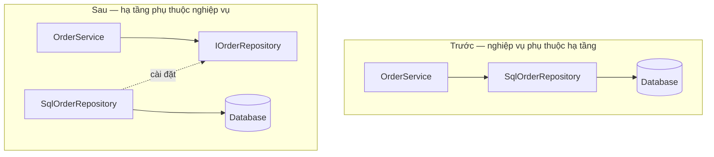
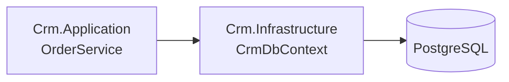
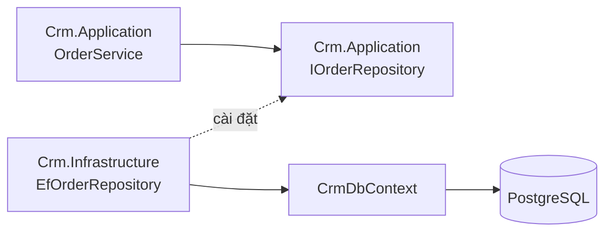
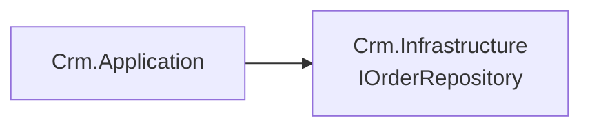

# 4.4 — 4. Interface

> Nguồn: https://tiennhm.io.vn/en/docs/dotnet-backend-zero-to-senior/stage-02-csharp-professional/module-04-csharp-core/4.4-interface
> Interface là hợp đồng, và giá trị của nó nằm ở chỗ đảo ngược hướng phụ thuộc. Kèm tiêu chí chia nhỏ interface, khi nào KHÔNG cần interface, và cài đặt tường minh dùng làm gì.

> Interface là **hợp đồng**: nó nói *làm được gì* mà không nói *làm bằng cách nào*. Nhưng giá trị thật không nằm ở việc "có thể có nhiều cài đặt" — phần lớn interface trong dự án thật chỉ có đúng một cài đặt. Giá trị nằm ở chỗ nó **đảo ngược hướng phụ thuộc**: tầng nghiệp vụ định nghĩa thứ nó cần, tầng hạ tầng đi theo, và nhờ vậy nghiệp vụ không còn phụ thuộc vào database hay nhà cung cấp email. Bài này cũng nói thẳng về mặt kia: **không phải class nào cũng cần interface**, và một `IFooService` chỉ để bọc `FooService` là nghi lễ chứ không phải thiết kế.

## Mục tiêu bài học

Sau bài này bạn có thể:

- Viết interface mô tả **năng lực** thay vì mô tả class hiện có.
- Giải thích đảo ngược phụ thuộc và vẽ được hướng mũi tên trước/sau.
- Áp dụng tiêu chí chia nhỏ interface thay vì gom thành một khối lớn.
- Quyết định khi nào **không** cần interface.
- Dùng cài đặt tường minh và default interface method cho đúng chỗ.

## Nội dung bài học

### 4.5.1 — Hợp đồng, không phải cài đặt

```csharp
public interface IPaymentGateway
{
    Task<PaymentResult> ChargeAsync(decimal amount, string token, CancellationToken ct);
    Task RefundAsync(string transactionId, CancellationToken ct);
}

public class StripeGateway  : IPaymentGateway { /* gọi Stripe */ }
public class VnPayGateway   : IPaymentGateway { /* gọi VNPay */ }
public class FakeGateway    : IPaymentGateway { /* dùng trong test */ }
```

Code nghiệp vụ chỉ biết `IPaymentGateway`. Đổi nhà cung cấp là đổi một dòng đăng ký, không đụng tới logic đặt hàng.

Một class cài đặt được **nhiều** interface — đây là chỗ C# cho phép "đa kế thừa" mà không gặp vấn đề của đa kế thừa cài đặt:

```csharp
public class OrderRepository : IOrderReader, IOrderWriter, IDisposable { }
```

### 4.5.2 — Giá trị thật: đảo ngược hướng phụ thuộc

Đây là phần quan trọng nhất, và nó không phải chuyện "có nhiều cài đặt".



Ở sơ đồ dưới, mũi tên từ `SqlOrderRepository` **đi ngược lên** phía interface. Interface thuộc về tầng nghiệp vụ, và tầng hạ tầng phải đi theo nó.

Ba thứ có được từ việc đảo hướng này:

1. **Nghiệp vụ kiểm thử được mà không cần database.** Đây là lợi ích cụ thể nhất và cảm nhận được ngay.
2. **Nghiệp vụ không biết gì về EF Core, Dapper hay SQL.** Đổi ORM không làm sập tầng nghiệp vụ.
3. **Thứ tự viết code đổi chiều.** Bạn viết logic nghiệp vụ trước, khai báo thứ nó cần, rồi mới cài đặt — thay vì để cấu trúc bảng quyết định hình dạng nghiệp vụ.

Điểm 3 là điểm hay bị bỏ qua nhưng ảnh hưởng nhiều nhất tới kiến trúc.

### 4.5.3 — Interface nhỏ, đúng vai

```csharp
// QUÁ LỚN — người chỉ cần đọc vẫn phải cài đặt cả phần ghi
public interface IOrderService
{
    Task<Order> GetByIdAsync(int id);
    Task<List<Order>> SearchAsync(OrderFilter f);
    Task CreateAsync(Order o);
    Task UpdateAsync(Order o);
    Task DeleteAsync(int id);
    Task<byte[]> ExportToExcelAsync(OrderFilter f);
    Task SendConfirmationEmailAsync(int id);
}
```

Hai vấn đề cụ thể:

- Một bản giả trong test phải cài đặt cả bảy phương thức, kể cả khi bài test chỉ dùng một.
- `ExportToExcelAsync` và `SendConfirmationEmailAsync` **không cùng lý do thay đổi** với phần truy cập dữ liệu. Ghép chung nghĩa là đổi định dạng Excel cũng đụng vào interface của repository.

```csharp
// Chia theo VAI TRÒ của người dùng interface
public interface IOrderReader
{
    Task<Order?> GetByIdAsync(int id, CancellationToken ct);
    Task<IReadOnlyList<Order>> SearchAsync(OrderFilter f, CancellationToken ct);
}

public interface IOrderWriter
{
    Task CreateAsync(Order o, CancellationToken ct);
    Task UpdateAsync(Order o, CancellationToken ct);
}

public interface IOrderExporter
{
    Task<byte[]> ExportToExcelAsync(OrderFilter f, CancellationToken ct);
}
```

Một class vẫn cài đặt cả ba nếu muốn. Nhưng **người gọi chỉ khai báo phụ thuộc vào phần mình dùng** — và nhìn vào constructor của một service là biết ngay nó đọc hay ghi.

Tiêu chí chia: **nhóm theo vai trò của người dùng, không nhóm theo class cài đặt.**

### 4.5.4 — Khi nào **không** cần interface

Phần này ít tài liệu nói, nhưng quan trọng không kém.

```csharp
// Nghi lễ — interface chỉ để bọc đúng một class, không đảo phụ thuộc gì
public interface IOrderCalculator
{
    decimal CalculateTotal(Order o);
}
public class OrderCalculator : IOrderCalculator
{
    public decimal CalculateTotal(Order o) => o.Lines.Sum(l => l.Amount);
}
```

Interface trên không mang lại gì: chỉ có một cài đặt, không có ranh giới hạ tầng nào được vượt qua, và hàm thì thuần tuý nên test thẳng cũng được.

Ba câu hỏi để quyết định:

1. Nó có **vượt qua ranh giới hạ tầng** không? (database, HTTP, file, đồng hồ, hàng đợi) → **cần**.
2. Có **nhiều cài đặt thật** không? → **cần**.
3. Có cần **thay bằng bản giả** để test thứ khác không? → **cần**.

Cả ba đều "không" → viết class thẳng. Thêm interface sau cũng chỉ là một thao tác refactor nhỏ.

Đáng chú ý: một trong những chỗ **cần** interface mà người ta hay quên là **đồng hồ**. `DateTimeOffset.UtcNow` là một phụ thuộc hạ tầng trá hình, và nó làm code không test được cho các mốc thời gian cụ thể. .NET 8 đã đưa vào `TimeProvider` cho đúng việc này.

### 4.5.5 — Cài đặt tường minh

```csharp
public class Repository : IReadable, IWritable
{
    // Cài đặt ngầm — gọi được qua chính class
    public void Read() { }

    // Cài đặt TƯỜNG MINH — chỉ gọi được qua interface
    void IWritable.Write() { }
}

var repo = new Repository();
repo.Read();                        // OK
// repo.Write();                    // Lỗi biên dịch
((IWritable)repo).Write();          // OK
```

Hai chỗ dùng thật:

1. **Hai interface có phương thức trùng tên** nhưng nghĩa khác nhau.
2. **Muốn giấu bớt** phương thức khỏi API công khai của class — ví dụ `IDisposable.Dispose()` cài tường minh để người dùng phải dùng `using` thay vì gọi tay.

Dùng vừa phải. Cài đặt tường minh làm code khó đọc hơn nếu không có lý do rõ ràng.

### 4.5.6 — Default interface method (C# 8+)

```csharp
public interface ILogger
{
    void Log(LogLevel level, string message);

    // Cài đặt mặc định — lớp cài đặt không bắt buộc viết lại
    void LogError(string message) => Log(LogLevel.Error, message);
}
```

Mục đích ban đầu: **thêm phương thức vào interface đã phát hành mà không phá vỡ mọi cài đặt hiện có**. Đây là bài toán thật của tác giả thư viện.

Nhưng đừng dùng nó như cách chia sẻ code thông thường. Phương thức mặc định không truy cập được state, không override tự nhiên như class, và làm mờ ranh giới giữa hợp đồng và cài đặt. Trong code ứng dụng, một abstract class hoặc một extension method thường là lựa chọn rõ ràng hơn.

### 4.5.7 — Rà lại code của bạn

**Danh sách rà soát interface**

- [ ] Mọi phụ thuộc vượt ranh giới hạ tầng đều đi qua interface.
- [ ] Không có interface nào chỉ bọc một class mà không vượt ranh giới nào.
- [ ] Interface nhóm theo vai trò người dùng, không nhóm theo class cài đặt.
- [ ] Không có interface nào buộc bản giả trong test phải cài đặt phương thức không dùng.
- [ ] Thời gian hiện tại đi qua TimeProvider hoặc một abstraction, không gọi UtcNow trực tiếp trong logic.
- [ ] Interface đặt ở tầng nghiệp vụ, không đặt cùng chỗ với cài đặt hạ tầng.
- [ ] Không dùng default interface method như cách chia sẻ code thông thường.

## Bài tập áp dụng

#### Bài 1 — Vẽ lại hướng mũi tên phụ thuộc

Chọn một service trong dự án gọi thẳng `DbContext`. Vẽ sơ đồ phụ thuộc hiện tại. Thêm interface ở tầng nghiệp vụ và vẽ lại. Chỉ ra mũi tên nào đã đổi chiều.

**Tiêu chí hoàn thành:** bạn chỉ đúng mũi tên đã đảo, và nêu được ai **sở hữu** interface trong thiết kế mới.

Gợi ý và lời giải — Bài 1

**Gợi ý.** Câu hỏi quyết định không phải "có interface hay không" mà là **interface được khai báo ở dự án nào**. Đặt sai chỗ thì mũi tên không đổi chiều, và toàn bộ lợi ích biến mất.

**Lời giải — trước:**



```csharp
// Crm.Application/OrderService.cs
public class OrderService
{
    private readonly CrmDbContext _db;        // phụ thuộc thẳng vào hạ tầng
    public OrderService(CrmDbContext db) => _db = db;
}
```

Tầng nghiệp vụ phụ thuộc vào tầng hạ tầng. Hệ quả: đổi từ EF Core sang Dapper là phải sửa tầng nghiệp vụ, và kiểm thử tầng nghiệp vụ cần một database.

**Sau:**



```csharp
// Crm.Application/IOrderRepository.cs  <- interface SỞ HỮU BỞI TẦNG NGHIỆP VỤ
public interface IOrderRepository
{
    Task<Order?> GetByIdAsync(int id, CancellationToken ct);
    Task AddAsync(Order order, CancellationToken ct);
}

// Crm.Infrastructure/EfOrderRepository.cs  <- cài đặt ở tầng hạ tầng
public class EfOrderRepository : IOrderRepository
{
    private readonly CrmDbContext _db;
    public EfOrderRepository(CrmDbContext db) => _db = db;
    // ...
}
```

**Mũi tên đã đổi chiều là mũi tên giữa `Crm.Application` và `Crm.Infrastructure`.** Trước: Application → Infrastructure. Sau: Infrastructure → Application (vì hạ tầng phải tham chiếu tới tầng nghiệp vụ để cài đặt interface của nó).

**Ai sở hữu interface — đây là toàn bộ điểm mấu chốt.** Interface nằm ở `Crm.Application`, cùng chỗ với người **dùng** nó, không phải cùng chỗ với người **cài đặt** nó. Nếu bạn đặt `IOrderRepository` vào `Crm.Infrastructure` thì:



Mũi tên **vẫn** chỉ từ Application sang Infrastructure. Bạn đã thêm một interface mà không đảo được gì — chỉ thêm một file phải mở khi đọc code. Đây là sai lầm phổ biến nhất khi áp dụng nguyên tắc này.

**Kiểm chứng bằng file dự án.** Mở `Crm.Application.csproj` và xác nhận nó **không** tham chiếu tới `Crm.Infrastructure`:

```xml
<!-- Crm.Infrastructure.csproj -->
<ItemGroup>
  <ProjectReference Include="..\Crm.Application\Crm.Application.csproj" />
</ItemGroup>

<!-- Crm.Application.csproj — KHÔNG có tham chiếu ngược lại -->
```

Trình biên dịch sẽ ép buộc điều này: tham chiếu vòng giữa hai dự án là lỗi biên dịch. Đó là cách biến một nguyên tắc kiến trúc thành thứ **không thể vi phạm** thay vì thứ phải nhớ.

**Ba lợi ích cụ thể sau khi đảo:**

1. **Kiểm thử tầng nghiệp vụ không cần database.** Truyền một bản cài đặt trong bộ nhớ hoặc một bản giả.
2. **Đổi công nghệ lưu trữ không đụng tầng nghiệp vụ.** Viết `DapperOrderRepository` và đổi một dòng đăng ký.
3. **Tầng nghiệp vụ diễn đạt theo ngôn ngữ nghiệp vụ.** `IOrderRepository` nói về `Order`, không nói về `DbSet` hay `SaveChanges`.

Đây là nguyên tắc Dependency Inversion trong SOLID, và là xương sống của [Module 16 — Clean Architecture](../../stage-05-senior-engineering/module-16-clean-architecture/).

#### Bài 2 — Đếm phương thức thừa trong bản giả

Tìm một interface lớn và một bài kiểm thử dùng nó. Đếm số phương thức bản giả phải cài đặt so với số phương thức bài kiểm thử thật sự gọi.

**Tiêu chí hoàn thành:** bạn có tỉ lệ cụ thể, và tách được interface lớn thành các interface nhỏ theo **vai** sử dụng.

Gợi ý và lời giải — Bài 2

**Gợi ý.** Tỉ lệ này là thước đo trực tiếp cho nguyên tắc phân tách interface: nếu người dùng chỉ cần 2 trong 15 phương thức, interface đang buộc họ phụ thuộc vào 13 thứ không liên quan.

**Lời giải — trước:**

```csharp
public interface IRepository
{
    Task<Customer?> GetCustomerAsync(int id, CancellationToken ct);
    Task<List<Customer>> GetAllCustomersAsync(CancellationToken ct);
    Task AddCustomerAsync(Customer c, CancellationToken ct);
    Task DeleteCustomerAsync(int id, CancellationToken ct);
    Task<Order?> GetOrderAsync(int id, CancellationToken ct);
    Task<List<Order>> GetOrdersByCustomerAsync(int customerId, CancellationToken ct);
    Task AddOrderAsync(Order o, CancellationToken ct);
    Task<List<Product>> GetProductsAsync(CancellationToken ct);
    Task UpdateStockAsync(int productId, int quantity, CancellationToken ct);
    Task<Report> GenerateReportAsync(DateTime from, DateTime to, CancellationToken ct);
    // ... còn 5 phương thức nữa
}
```

Bài kiểm thử cho `EmailService`, vốn chỉ cần lấy một khách hàng:

```csharp
var fakeRepo = new FakeRepository();   // phải cài đặt cả 15 phương thức
// -> 14 phương thức chỉ có dòng: throw new NotImplementedException();
```

**Tỉ lệ: dùng 1, cài đặt 15.**

Với thư viện tạo bản giả thì đỡ hơn, nhưng vấn đề gốc vẫn còn:

```csharp
var fakeRepo = Substitute.For<IRepository>();
fakeRepo.GetCustomerAsync(42, Arg.Any<CancellationToken>()).Returns(customer);
```

Đọc dòng này, người ta không biết `EmailService` **thật sự** phụ thuộc vào cái gì — nhìn constructor chỉ thấy `IRepository`, một cái tên không nói lên điều gì.

**Sau — tách theo vai:**

```csharp
// Crm.Application/Abstractions/
public interface ICustomerReader
{
    Task<Customer?> GetByIdAsync(int id, CancellationToken ct);
}

public interface ICustomerWriter
{
    Task AddAsync(Customer c, CancellationToken ct);
    Task DeleteAsync(int id, CancellationToken ct);
}

public interface IOrderReader { /* ... */ }
public interface IInventoryWriter { /* ... */ }
```

Một lớp hạ tầng vẫn cài đặt nhiều interface cùng lúc, không cần chia nhỏ lớp:

```csharp
public class EfCustomerRepository : ICustomerReader, ICustomerWriter
{
    // một lớp, nhiều vai
}
```

Bài kiểm thử giờ rất rõ:

```csharp
var fakeReader = Substitute.For<ICustomerReader>();   // cài đặt 1, dùng 1
fakeReader.GetByIdAsync(42, Arg.Any<CancellationToken>()).Returns(customer);
var service = new EmailService(fakeReader);
```

**Ba lợi ích, xếp theo giá trị:**

1. **Constructor trở thành tài liệu.** `EmailService(ICustomerReader)` nói rõ: service này **chỉ đọc** khách hàng, không ghi gì. Người đọc biết ngay phạm vi ảnh hưởng của nó.
2. **Giảm lý do phải sửa.** Thêm phương thức vào `IOrderReader` không ảnh hưởng tới các lớp chỉ dùng `ICustomerReader`.
3. **Bản giả ngắn và đúng trọng tâm.** Bài kiểm thử không còn nhiễu bởi những phương thức không liên quan.

**Đừng tách quá tay.** Một interface một phương thức cho **mọi** thao tác sẽ tạo ra hàng chục file và làm code khó theo dõi. Tiêu chí tách đúng là **theo vai sử dụng**, không phải theo từng phương thức: nếu ba phương thức luôn được dùng cùng nhau bởi cùng một loại người dùng, chúng thuộc về một interface.

Phép thử: *có người dùng nào chỉ cần một phần của interface này không?* Có thì tách; không thì để nguyên.

#### Bài 3 — Tách đồng hồ ra khỏi logic

Tìm một hàm gọi `DateTimeOffset.UtcNow` bên trong. Đưa `TimeProvider` vào, rồi viết một bài kiểm thử cho hành vi vào đúng 23:59:59 ngày 31/12.

**Tiêu chí hoàn thành:** bài kiểm thử chạy được vào bất kỳ ngày nào và luôn cho cùng kết quả.

Gợi ý và lời giải — Bài 3

**Gợi ý.** `TimeProvider` là lớp trừu tượng có sẵn từ .NET 8, sinh ra đúng cho việc này. Bản dùng khi chạy thật là `TimeProvider.System`; bản dùng khi kiểm thử là `FakeTimeProvider` trong gói `Microsoft.Extensions.TimeProvider.Testing`.

**Lời giải — trước:**

```csharp
public class CommissionService
{
    public decimal CalculateQuarterlyCommission(Customer c)
    {
        var now = DateTimeOffset.UtcNow;                 // đầu vào ẩn
        var quarter = (now.Month - 1) / 3 + 1;
        var quarterStart = new DateTimeOffset(now.Year, (quarter - 1) * 3 + 1, 1, 0, 0, 0, TimeSpan.Zero);
        return c.Orders.Where(o => o.CreatedAt >= quarterStart).Sum(o => o.Total) * 0.05m;
    }
}
```

**Sau:**

```csharp
public class CommissionService
{
    private readonly TimeProvider _time;

    public CommissionService(TimeProvider time) => _time = time;

    public decimal CalculateQuarterlyCommission(Customer c)
    {
        var now = _time.GetUtcNow();                     // đầu vào tường minh
        var quarter = (now.Month - 1) / 3 + 1;
        var quarterStart = new DateTimeOffset(now.Year, (quarter - 1) * 3 + 1, 1, 0, 0, 0, TimeSpan.Zero);
        return c.Orders.Where(o => o.CreatedAt >= quarterStart).Sum(o => o.Total) * 0.05m;
    }
}
```

Đăng ký:

```csharp
builder.Services.AddSingleton(TimeProvider.System);
```

**Bài kiểm thử cho thời khắc giao thừa:**

```csharp
[Fact]
public void Quarter4Commission_IsCorrect_OnLastSecondOfYear()
{
    var time = new FakeTimeProvider(
        new DateTimeOffset(2026, 12, 31, 23, 59, 59, TimeSpan.Zero));

    var customer = new Customer("An");
    customer.AddOrder(new Order(new DateTime(2026, 9, 30), 10_000_000m));   // quý 3 — không tính
    customer.AddOrder(new Order(new DateTime(2026, 10, 1), 20_000_000m));   // quý 4 — tính
    customer.AddOrder(new Order(new DateTime(2026, 12, 31), 5_000_000m));   // quý 4 — tính

    var service = new CommissionService(time);

    Assert.Equal(1_250_000m, service.CalculateQuarterlyCommission(customer));   // (20tr + 5tr) * 5%
}
```

**Kiểm tra ranh giới — phần đáng giá nhất của `FakeTimeProvider`:**

```csharp
[Fact]
public void CrossingNewYear_ResetsTheQuarter()
{
    var time = new FakeTimeProvider(
        new DateTimeOffset(2026, 12, 31, 23, 59, 59, TimeSpan.Zero));
    var service = new CommissionService(time);
    var before = service.CalculateQuarterlyCommission(customer);

    time.Advance(TimeSpan.FromSeconds(2));    // bước qua năm mới

    var after = service.CalculateQuarterlyCommission(customer);
    Assert.Equal(0m, after);                    // quý 1 năm 2027, chưa có đơn nào
}
```

Không có `TimeProvider`, bài kiểm thử này **không thể tồn tại**: bạn phải đợi tới đúng thời khắc giao thừa, hoặc đổi đồng hồ hệ thống của máy chạy CI.

**Ba thứ `TimeProvider` cung cấp, không chỉ thời gian hiện tại:**

| Thành viên | Dùng cho |
|---|---|
| `GetUtcNow()` | Thời điểm hiện tại |
| `GetTimestamp()` và `GetElapsedTime()` | Đo khoảng thời gian, thay cho `Stopwatch` |
| `CreateTimer()` | Hẹn giờ — kiểm thử được bằng `Advance()` |
| `LocalTimeZone` | Múi giờ, cũng giả lập được |

Dòng thứ ba đặc biệt giá trị: nó cho phép kiểm thử một tác vụ nền chạy mỗi 5 phút mà **không phải chờ 5 phút** — chỉ cần gọi `Advance(TimeSpan.FromMinutes(5))`. [Module 14](../../stage-04-database-production/module-14-caching-background-jobs/) dùng lại mẫu này cho các tác vụ định kỳ.

**Cùng nguyên tắc, áp dụng cho ba nguồn bất định khác.** Thời gian chỉ là một trong bốn thứ phá vỡ tính tất định của hàm: thời gian, số ngẫu nhiên, truy cập bên ngoài, và biến tĩnh dùng chung. Cách xử lý giống hệt nhau — biến đầu vào ẩn thành đầu vào tường minh, rồi tiêm nó vào.

## Tự kiểm tra

### Giá trị thật của interface là gì?

Không phải chuyện có thể có nhiều cài đặt, vì phần lớn interface trong dự án thật chỉ có một. Giá trị nằm ở chỗ nó đảo ngược hướng phụ thuộc: tầng nghiệp vụ định nghĩa thứ nó cần, tầng hạ tầng đi theo. Nhờ đó nghiệp vụ kiểm thử được mà không cần database, và đổi ORM không làm sập tầng nghiệp vụ.

### Nên chia interface theo tiêu chí nào?

Theo vai trò của người dùng interface, không theo class cài đặt. Một interface bảy phương thức buộc mọi bản giả trong test phải cài đặt cả bảy dù chỉ dùng một, và ghép những thứ không cùng lý do thay đổi vào một chỗ. Chia thành IOrderReader, IOrderWriter, IOrderExporter thì người gọi chỉ khai báo phần mình dùng.

### Khi nào KHÔNG cần interface?

Khi cả ba câu hỏi đều trả lời không: nó không vượt ranh giới hạ tầng nào, không có nhiều cài đặt thật, và không cần thay bằng bản giả để test thứ khác. Một IFooService chỉ bọc FooService là nghi lễ chứ không phải thiết kế. Thêm interface sau cũng chỉ là một thao tác refactor nhỏ.

### Vì sao thời gian hiện tại nên đi qua abstraction?

Vì DateTimeOffset.UtcNow là một phụ thuộc hạ tầng trá hình: nó làm hàm không test được cho các mốc thời gian cụ thể, ví dụ hành vi vào đúng cuối năm hay ngày 29 tháng 2. .NET 8 đã đưa vào TimeProvider đúng cho việc này.

### Cài đặt tường minh dùng khi nào?

Hai trường hợp: khi hai interface có phương thức trùng tên nhưng nghĩa khác nhau, và khi muốn giấu bớt một phương thức khỏi API công khai của class — ví dụ cài tường minh IDisposable.Dispose để buộc người dùng dùng using. Ngoài hai trường hợp đó thì nó chỉ làm code khó đọc hơn.

### Default interface method sinh ra để làm gì?

Để tác giả thư viện thêm được phương thức vào interface đã phát hành mà không phá vỡ mọi cài đặt hiện có. Nó không phải cách chia sẻ code thông thường: phương thức mặc định không truy cập được state, không override tự nhiên như class, và làm mờ ranh giới giữa hợp đồng với cài đặt.

## Kết luận

Ba điều đáng nhớ nhất:

1. **Interface để đảo hướng phụ thuộc**, không phải để đếm số cài đặt.
2. **Chia theo vai trò người dùng.** Interface bảy phương thức là bảy lý do để thay đổi gộp vào một chỗ.
3. **Không phải class nào cũng cần interface.** Ba câu hỏi ở mục 4.5.4 trả lời được điều đó trong 10 giây.

## Tham khảo

- [Interfaces — C#](https://learn.microsoft.com/en-us/dotnet/csharp/fundamentals/types/interfaces)
- [Object-oriented programming in C#](https://learn.microsoft.com/en-us/dotnet/csharp/fundamentals/object-oriented/)
- [Framework design guidelines](https://learn.microsoft.com/en-us/dotnet/standard/design-guidelines/) — chọn giữa interface và abstract class
- [Singleton, Scoped hay Transient?](https://tiennhm.io.vn/blog/singleton-scoped-transient-captive-dependency) — đăng ký cài đặt cho interface

## Điều hướng

- **Bài trước:** [4.3 — 3. Inheritance và Polymorphism](4.3-inheritance-and-polymorphism.mdx)
- **Bài tiếp theo:** [4.5 — 5. Abstraction](4.5-abstraction.mdx)
- **Về module:** [Trang mục lục](./)

## Bài liên quan

- [Singleton, Scoped hay Transient? Chọn sai là DbContext sống mãi](https://tiennhm.io.vn/blog/singleton-scoped-transient-captive-dependency) — Ba lifetime trong DI container của ASP.NET Core khác nhau ở thời điểm tạo và thời điểm dispose instance.
