# 6.5 — 4. Task Parallel Library

> Nguồn: https://tiennhm.io.vn/en/docs/dotnet-backend-zero-to-senior/stage-02-csharp-professional/module-06-async-programming/6.5-task-parallel-library
> Task.WhenAll, Task.WhenAny và Parallel.ForEachAsync: chạy song song đúng cách, chặn số lượng đồng thời, và không nuốt mất exception.

> Ba công cụ, ba bài toán khác nhau. **`Task.WhenAll`** cho các việc độc lập cần xong hết — tổng thời gian bằng việc chậm nhất chứ không phải tổng các việc. **`Task.WhenAny`** cho việc nào xong trước thì lấy, nền tảng của timeout. **`Parallel.ForEachAsync`** (.NET 6+) cho danh sách lớn cần chặn số lượng chạy đồng thời. Hai cái bẫy lớn nhất trong bài: `await Task.WhenAll` chỉ **ném lại một exception** dù nhiều task cùng lỗi, và **`DbContext` không thread-safe** nên `WhenAll` trên cùng một `DbContext` sẽ nổ.

## Mục tiêu bài học

Sau bài này bạn có thể:

- Dùng `Task.WhenAll` để biến chuỗi I/O tuần tự thành song song.
- Lấy đúng **tất cả** exception khi nhiều task cùng lỗi.
- Viết timeout bằng `WaitAsync` thay vì `WhenAny` thủ công.
- Chọn giữa `WhenAll`, `SemaphoreSlim` và `Parallel.ForEachAsync`.
- Tránh bẫy `DbContext` không thread-safe.

## Nội dung bài học

### 6.6.1 — `Task.WhenAll`: tổng thời gian là việc chậm nhất

```csharp
// TUAN TU: 200ms + 150ms + 300ms = 650ms
var customer = await _customerService.GetAsync(id, ct);
var orders   = await _orderService.GetByCustomerAsync(id, ct);
var credit   = await _creditService.GetScoreAsync(id, ct);

// SONG SONG: max(200, 150, 300) = 300ms
var customerTask = _customerService.GetAsync(id, ct);
var ordersTask   = _orderService.GetByCustomerAsync(id, ct);
var creditTask   = _creditService.GetScoreAsync(id, ct);

await Task.WhenAll(customerTask, ordersTask, creditTask);

return (await customerTask, await ordersTask, await creditTask);
```



```mermaid
gantt
    title Tuan tu vs song song
    dateFormat X
    axisFormat %L
    section Tuan tu - 650ms
    customer  :0, 200
    orders    :200, 350
    credit    :350, 650
    section Song song - 300ms
    customer  :0, 200
    orders    :0, 150
    credit    :0, 300
```

Điều kiện để làm được: **ba lời gọi phải độc lập**. Nếu `orders` cần `customer.Id` lấy từ bước trước thì không song song được.

Chú ý dòng cuối: dùng `await customerTask` chứ **không** dùng `customerTask.Result`. Ở đây task đã xong nên `.Result` không deadlock, nhưng `.Result` gói exception vào `AggregateException` còn `await` thì ném ra exception gốc — đọc log dễ hơn nhiều.

### 6.6.2 — `WhenAll` chỉ ném lại một exception

Đây là chỗ rất nhiều người mất dữ liệu chẩn đoán:

```csharp
try
{
    await Task.WhenAll(task1, task2, task3);   // cả 3 cùng lỗi
}
catch (Exception ex)
{
    // ex là exception của task ĐẦU TIÊN lỗi. Hai cái kia biến mất.
}
```

Muốn lấy đủ, phải đọc từ chính `Task` mà `WhenAll` trả về:

```csharp
var all = Task.WhenAll(task1, task2, task3);

try
{
    await all;
}
catch
{
    // all.Exception là AggregateException chứa ĐẦY ĐỦ
    foreach (var inner in all.Exception!.InnerExceptions)
        _logger.LogError(inner, "Task thất bại");

    throw;
}
```

Quy tắc: **gán `WhenAll` vào một biến** nếu bạn cần log lỗi. Còn nếu chỉ cần "hỏng là hỏng" thì viết thẳng cũng được.

### 6.6.3 — `DbContext` không thread-safe

Cái bẫy phổ biến nhất khi mới dùng `WhenAll`:

```csharp
// SAI — cùng một DbContext, nó sẽ ném InvalidOperationException
var t1 = _db.Customers.ToListAsync(ct);
var t2 = _db.Orders.ToListAsync(ct);
await Task.WhenAll(t1, t2);
// "A second operation was started on this context instance
//  before a previous operation completed."
```

`DbContext` chỉ cho **một** thao tác tại một thời điểm. Muốn song song thì phải có **mỗi task một context**:

```csharp
// DUNG — moi task mot DbContext tu factory
var t1 = LoadAsync(db => db.Customers.ToListAsync(ct));
var t2 = LoadAsync(db => db.Orders.ToListAsync(ct));
await Task.WhenAll(t1, t2);

async Task<T> LoadAsync<T>(Func<AppDbContext, Task<T>> query)
{
    await using var db = await _factory.CreateDbContextAsync(ct);
    return await query(db);
}
```

`AddDbContextFactory()` trong `Program.cs` là thứ cho bạn `_factory`. Xem thêm ở [Module 13 — Entity Framework Core](../../stage-04-database-production/module-13-entity-framework-core/).

Với hai truy vấn nhỏ thì thường **không đáng**: mỗi context là một connection riêng, và chạy tuần tự trên một connection thường nhanh hơn mở thêm connection.

### 6.6.4 — `Task.WhenAny` và cách viết timeout đúng

Cách cũ, viết thủ công:

```csharp
var fetchTask   = _api.FetchAsync(id, ct);
var timeoutTask = Task.Delay(TimeSpan.FromSeconds(3), ct);

var completed = await Task.WhenAny(fetchTask, timeoutTask);
if (completed == timeoutTask) return null;
return await fetchTask;
```

Cách này có **hai vấn đề**:

1. Nếu `fetchTask` xong trước, `timeoutTask` vẫn treo đó với một timer chạy đủ 3 giây. Trong vòng lặp nóng, đó là rò rỉ timer.
2. `fetchTask` **vẫn chạy tiếp** sau khi bạn trả `null` — kết nối vẫn mở, tài nguyên vẫn tốn.

Từ .NET 6, viết thế này:

```csharp
try
{
    return await _api.FetchAsync(id, ct).WaitAsync(TimeSpan.FromSeconds(3), ct);
}
catch (TimeoutException)
{
    return null;
}
```

Vẫn còn vấn đề 2 — công việc gốc không bị huỷ. Muốn huỷ thật thì phải truyền token có timeout vào tận nơi:

```csharp
using var cts = CancellationTokenSource.CreateLinkedTokenSource(ct);
cts.CancelAfter(TimeSpan.FromSeconds(3));

try { return await _api.FetchAsync(id, cts.Token); }
catch (OperationCanceledException) when (!ct.IsCancellationRequested) { return null; }
```

Đây mới là timeout thật sự — chi tiết về `CancellationToken` ở [bài 6.5](6.4-cancellationtoken.mdx).

`WhenAny` vẫn hữu ích cho bài toán **đua**: gọi ba nhà cung cấp, lấy ai trả lời trước.

### 6.6.5 — Ba cách chạy một danh sách, và khi nào dùng cái nào

```csharp
// 1. TUẦN TỰ — 1000 mục x 100ms = 100 giây. Chậm nhưng an toàn.
foreach (var c in customers)
    await ProcessAsync(c, ct);

// 2. WhenAll KHÔNG GIỚI HẠN — 1000 kết nối cùng lúc. Dễ sập DB.
await Task.WhenAll(customers.Select(c => ProcessAsync(c, ct)));

// 3. Parallel.ForEachAsync (.NET 6+) — tối đa 10 cùng lúc. Dùng nhất.
await Parallel.ForEachAsync(
    customers,
    new ParallelOptions { MaxDegreeOfParallelism = 10, CancellationToken = ct },
    async (c, token) => await ProcessAsync(c, token));
```

Cách 2 là lỗi hay gặp nhất trong code production: nó hoạt động tốt với 20 phần tử trong môi trường dev, rồi làm cạn connection pool (mặc định 100) khi gặp danh sách thật.

Trước .NET 6, cách 3 phải tự làm bằng `SemaphoreSlim`:

```csharp
using var gate = new SemaphoreSlim(10);

var tasks = customers.Select(async c =>
{
    await gate.WaitAsync(ct);
    try { await ProcessAsync(c, ct); }
    finally { gate.Release(); }     // finally là bắt buộc
});

await Task.WhenAll(tasks);
```

Thiếu `finally` là treo vĩnh viễn ngay lần đầu có exception — semaphore không bao giờ được trả lại.

### 6.6.6 — `Parallel.For`/`Parallel.ForEach` là chuyện khác hẳn

```csharp
// SAI — lambda async void, Parallel không chờ gì cả
Parallel.ForEach(customers, async c => await ProcessAsync(c));
```

`Parallel.ForEach` nhận `Action`, nên lambda `async` ở đây trở thành **`async void`** (xem [bài 6.3](6.2-task-and-async-await.mdx)): vòng lặp "xong" ngay lập tức trong khi công việc còn đang chạy, và mọi exception làm sập tiến trình.

Phân vai rõ ràng:

| Công cụ | Dành cho | Cơ chế |
|---|---|---|
| `Parallel.For` / `Parallel.ForEach` | **CPU-bound** | Chia việc cho nhiều thread |
| `Parallel.ForEachAsync` | **I/O-bound** | Chạy async đồng thời, không chiếm thread |
| `Task.WhenAll` | I/O-bound, số lượng nhỏ và biết trước | Không giới hạn |

Trong backend web, **hầu như luôn là cột giữa**. `Parallel.ForEach` chỉ đúng khi bạn thật sự đang tính toán — nén ảnh, xử lý ma trận.

### 6.6.7 — Rà lại code của bạn

**Danh sách rà soát Task Parallel Library**

- [ ] Các lời gọi I/O độc lập trong cùng một request đã được gom vào Task.WhenAll.
- [ ] Không có Task.WhenAll nào trên cùng một DbContext instance.
- [ ] Không có Task.WhenAll không giới hạn trên danh sách có kích thước tuỳ ý.
- [ ] Danh sách lớn dùng Parallel.ForEachAsync với MaxDegreeOfParallelism.
- [ ] Mọi SemaphoreSlim.WaitAsync đều có Release trong khối finally.
- [ ] Không có lambda async nào truyền vào Parallel.ForEach.
- [ ] Timeout dùng WaitAsync hoặc CancelAfter, không dùng WhenAny với Task.Delay.
- [ ] Nơi cần log đủ lỗi đã gán WhenAll vào biến để đọc AggregateException.

## Bài tập áp dụng

#### Bài 1 — Đo mức cải thiện của `Task.WhenAll`

Lấy một endpoint đang gọi ba service tuần tự, ghi lại thời gian, chuyển sang `Task.WhenAll`, đo lại. So sánh với giá trị **lớn nhất** trong ba thời gian riêng lẻ.

**Tiêu chí hoàn thành:** thời gian sau khi song song hoá xấp xỉ bằng lời gọi **chậm nhất**, không phải bằng tổng.

Gợi ý và lời giải — Bài 1

**Gợi ý.** Điểm dễ sai: `Task` bắt đầu chạy **ngay khi phương thức được gọi**, không phải khi bạn `await`. Vì vậy phải gọi cả ba trước rồi mới chờ.

**Lời giải — trước:**

```csharp
var customer = await _crm.GetCustomerAsync(id, ct);      // 120 ms
var orders  = await _order.GetRecentOrdersAsync(id, ct);    // 200 ms
var stats   = await _report.GetStatsAsync(id, ct);     //  80 ms
// tổng: ~400 ms
```

**Sau:**

```csharp
var customerTask = _crm.GetCustomerAsync(id, ct);       // cả ba khởi động ngay
var ordersTask   = _order.GetRecentOrdersAsync(id, ct);
var statsTask    = _report.GetStatsAsync(id, ct);

await Task.WhenAll(customerTask, ordersTask, statsTask);

var customer = customerTask.Result; var orders = ordersTask.Result; var stats = statsTask.Result;
// tổng: ~200 ms — bằng lời gọi chậm nhất
```

Hoặc gọn hơn, dùng cú pháp tuple:

```csharp
var (customer, orders, stats) = await (
    _crm.GetCustomerAsync(id, ct),
    _order.GetRecentOrdersAsync(id, ct),
    _report.GetStatsAsync(id, ct)
).WhenAll();     // cần một extension nhỏ tự viết
```

**Về việc dùng `.Result` sau `WhenAll`.** Ở đây nó **an toàn**, vì `WhenAll` đã bảo đảm mọi task hoàn tất. Đây là ngoại lệ duy nhất cho quy tắc "không bao giờ dùng `.Result`". Dù vậy, cách rõ ràng hơn là `await` lại từng task — chúng đã xong nên không tốn gì:

```csharp
var kh = await tKh; var don = await tDon; var tk = await tTk;
```

**Ba điều kiện để song song hoá đúng:**

1. **Các lời gọi phải độc lập.** Nếu lời gọi thứ hai cần kết quả của lời gọi thứ nhất thì không song song được — và cố ép sẽ tạo bug.
2. **Không dùng chung `DbContext`.** Đây là lỗi nghiêm trọng nhất, xem bài 2.
3. **Dịch vụ đích phải chịu được tải song song.** Gọi 50 lời gọi song song vào một API có giới hạn tần suất sẽ nhận `429`.

**Khi nào *không* nên song song hoá.** Với ba lời gọi mỗi cái 5 ms, tiết kiệm được 10 ms — không đáng so với việc code khó đọc hơn và khó gỡ lỗi hơn. Song song hoá đáng làm khi mỗi lời gọi tốn từ vài chục mili-giây trở lên.

**Một chi tiết về đo đạc.** Thời gian sau khi song song hoá thường **lớn hơn một chút** so với lời gọi chậm nhất, vì có chi phí điều phối và vì ba lời gọi cùng cạnh tranh băng thông mạng. Chênh lệch 5–10% là bình thường; chênh lệch lớn hơn nhiều nghĩa là có nút thắt chung mà bạn chưa nhận ra.

#### Bài 2 — Làm cạn nhóm kết nối bằng `WhenAll` không giới hạn

Viết một tác vụ dùng `Task.WhenAll` không giới hạn trên 500 bản ghi đi vào database. Ghi lại ngoại lệ. Sau đó sửa bằng `Parallel.ForEachAsync` với giới hạn song song và so sánh tổng thời gian.

**Tiêu chí hoàn thành:** bạn nêu được **hai** loại ngoại lệ có thể gặp, và vì sao bản có giới hạn đôi khi **nhanh hơn** bản không giới hạn.

Gợi ý và lời giải — Bài 2

**Gợi ý.** `Task.WhenAll` trên 500 task nghĩa là **500 thao tác cùng chạy một lúc**. Nhóm kết nối database mặc định có bao nhiêu kết nối?

**Lời giải — bản sai:**

```csharp
var tasks = items.Select(async item =>
{
    using var scope = _scopeFactory.CreateScope();
    var db = scope.ServiceProvider.GetRequiredService<CrmDbContext>();
    await db.Orders.AddAsync(ToEntity(item), ct);
    await db.SaveChangesAsync(ct);
});

await Task.WhenAll(tasks);     // 500 kết nối cùng lúc
```

**Hai loại ngoại lệ có thể gặp:**

```text
1. Npgsql.NpgsqlException: The connection pool has been exhausted,
   either raise MaxPoolSize (currently 100) or Timeout (currently 15 seconds)

2. Npgsql.PostgresException: 53300: sorry, too many clients already
```

Loại thứ nhất đến từ **phía ứng dụng** — nhóm kết nối đầy. Loại thứ hai đến từ **phía database** — máy chủ đã chạm giới hạn kết nối tối đa. Loại thứ hai nghiêm trọng hơn nhiều, vì nó ảnh hưởng tới **mọi** ứng dụng dùng chung database đó, không chỉ ứng dụng của bạn.

**Bản đúng:**

```csharp
await Parallel.ForEachAsync(
    items,
    new ParallelOptions { MaxDegreeOfParallelism = 10, CancellationToken = ct },
    async (item, token) =>
    {
        using var scope = _scopeFactory.CreateScope();
        var db = scope.ServiceProvider.GetRequiredService<CrmDbContext>();
        await db.Orders.AddAsync(ToEntity(item), token);
        await db.SaveChangesAsync(token);
    });
```

**Vì sao bản có giới hạn đôi khi nhanh hơn — đây là phần phản trực giác.** Nghe thì 500 song song phải nhanh hơn 10 song song. Thực tế thường ngược lại, vì ba lý do:

1. **Chờ kết nối.** Với nhóm 100 kết nối, 400 task còn lại chỉ ngồi chờ — không làm gì cả, nhưng vẫn tốn bộ nhớ và chi phí điều phối.
2. **Database bị quá tải.** Quá nhiều kết nối đồng thời làm tăng tranh chấp khoá, tăng chuyển ngữ cảnh ở phía máy chủ database, và làm **mỗi** truy vấn chậm đi.
3. **Timeout gây làm lại.** Khi một số task hết giờ chờ kết nối, bạn phải chạy lại — và chạy lại từ đầu thường tốn hơn nhiều so với việc đi chậm mà chắc.

**Chọn `MaxDegreeOfParallelism` bao nhiêu.** Không có con số đúng cho mọi trường hợp; hãy **đo**. Điểm khởi đầu hợp lý:

| Loại công việc | Gợi ý |
|---|---|
| Ghi database | 4–10 |
| Đọc database | 10–20 |
| Gọi API bên ngoài | Theo giới hạn tần suất của họ |
| Tính toán CPU | Số nhân CPU |

**Một lựa chọn thường tốt hơn cho ghi hàng loạt.** Thay vì song song hoá 500 lần ghi riêng lẻ, hãy gộp chúng:

```csharp
using var scope = _scopeFactory.CreateScope();
var db = scope.ServiceProvider.GetRequiredService<CrmDbContext>();

await db.Orders.AddRangeAsync(items.Select(ToEntity), ct);
await db.SaveChangesAsync(ct);     // MỘT giao dịch, một kết nối
```

Cách này thường nhanh hơn hẳn mọi phương án song song, vì nó tránh được toàn bộ chi phí kết nối và chỉ có một giao dịch. [Bài 13.8](../../stage-04-database-production/module-13-entity-framework-core/13.7-performance.mdx) trình bày các kỹ thuật ghi hàng loạt đầy đủ hơn.

**Quy tắc.** Trước khi song song hoá, hãy hỏi: *có cách nào làm việc này bằng một thao tác thay vì nhiều thao tác không?* Gộp gần như luôn thắng song song hoá.

#### Bài 3 — Mất ngoại lệ với `Task.WhenAll`

Tạo ba task cùng ném ngoại lệ khác nhau, `await Task.WhenAll` trong `try/catch`, xác nhận chỉ bắt được một. Sửa lại để ghi log đủ ba.

**Tiêu chí hoàn thành:** bạn lấy ra được cả ba ngoại lệ và nêu được vì sao `await` chỉ ném một.

Gợi ý và lời giải — Bài 3

**Gợi ý.** `Task.WhenAll` trả về một `Task` duy nhất. Khi nhiều task con thất bại, ngoại lệ của chúng được gom vào thuộc tính `Exception` của task tổng hợp. Nhưng `await` thì làm gì với chúng?

**Lời giải.**

```csharp
static async Task Nem(string m)
{
    await Task.Delay(10);
    throw new InvalidOperationException(m);
}

var ts = new[] { Nem("lỗi A"), Nem("lỗi B"), Nem("lỗi C") };
var all = Task.WhenAll(ts);

try { await all; }
catch (Exception ex) { Console.WriteLine($"catch bắt được: {ex.GetType().Name}: {ex.Message}"); }

Console.WriteLine($"thực tế có {all.Exception?.InnerExceptions.Count} ngoại lệ:");
foreach (var e in all.Exception!.InnerExceptions)
    Console.WriteLine($"   - {e.Message}");
```

**Kết quả đo thật trên .NET 9:**

```text
catch bắt được: InvalidOperationException: lỗi C
thực tế có 3 ngoại lệ:
   - lỗi C
   - lỗi B
   - lỗi A
```

**Vì sao `await` chỉ ném một.** Task tổng hợp mang một `AggregateException` chứa cả ba. Nhưng `await` được thiết kế để **mở gói** `AggregateException` và ném lại **ngoại lệ đầu tiên** — nhằm giữ cho code async đọc giống code đồng bộ, nơi một khối `try` chỉ bắt một ngoại lệ.

Đánh đổi là hai ngoại lệ kia **biến mất khỏi khối `catch`**. Chúng vẫn nằm trong task, nhưng nếu bạn không đi lấy thì không ai biết tới.

**Cách lấy đủ — hai lựa chọn:**

```csharp
// Cách 1 — giữ biến task rồi đọc Exception
var all = Task.WhenAll(ts);
try { await all; }
catch
{
    foreach (var e in all.Exception!.InnerExceptions)
        _logger.LogError(e, "Một tác vụ thất bại");
    throw;
}

// Cách 2 — bắt AggregateException từ chính task
try { await all; }
catch (Exception) when (all.Exception is { } agg)
{
    foreach (var e in agg.Flatten().InnerExceptions)
        _logger.LogError(e, "Một tác vụ thất bại");
    throw;
}
```

`Flatten()` ở cách 2 xử lý trường hợp `AggregateException` lồng nhau — xảy ra khi có `WhenAll` bên trong `WhenAll`.

**Vì sao điều này quan trọng trong thực tế.** Tình huống điển hình: một tác vụ nền đồng bộ dữ liệu cho 50 chi nhánh bằng `Task.WhenAll`. Ba chi nhánh thất bại vì ba lý do khác nhau — một lỗi mạng, một lỗi dữ liệu, một lỗi quyền. Log chỉ hiện **một** trong ba. Bạn sửa lỗi đó, chạy lại, và phát hiện lỗi thứ hai. Sửa tiếp, chạy lại, lỗi thứ ba. Ba vòng gỡ lỗi cho một lần chạy.

**Một mẫu tốt hơn cho xử lý hàng loạt.** Thay vì để ngoại lệ thoát ra, hãy thu thập kết quả của từng phần:

```csharp
var results = await Task.WhenAll(items.Select(async item =>
{
    try
    {
        await ProcessAsync(item, ct);
        return (item, Succeeded: true, Error: (Exception?)null);
    }
    catch (Exception ex)
    {
        return (item, Succeeded: false, Error: ex);
    }
}));

var failures = results.Where(r => !r.Succeeded).ToList();
if (failures.Count > 0)
{
    _logger.LogWarning("{Số} trong {Tổng} mục thất bại", failures.Count, results.Length);
    foreach (var r in failures) _logger.LogError(r.Error, "Mục {Item} thất bại", r.item);
}
```

Cách này cho bạn **bức tranh đầy đủ trong một lần chạy**: cái nào xong, cái nào hỏng, hỏng vì sao. Đây là mẫu nên dùng cho mọi tác vụ xử lý theo lô.

## Tự kiểm tra

### Task.WhenAll giúp tiết kiệm bao nhiêu thời gian?

Tổng thời gian giảm từ tổng các việc xuống còn việc chậm nhất. Ba lời gọi 200ms, 150ms và 300ms chạy tuần tự mất 650ms nhưng chạy song song chỉ mất 300ms. Điều kiện là ba lời gọi phải độc lập, không cái nào cần kết quả của cái trước.

### Vì sao await Task.WhenAll làm mất exception?

Vì await chỉ ném lại exception của task đầu tiên bị lỗi, dù nhiều task cùng lỗi. Muốn lấy đủ thì phải gán WhenAll vào một biến rồi đọc thuộc tính Exception của nó, đó là một AggregateException chứa đầy đủ InnerExceptions.

### Vì sao không được Task.WhenAll trên cùng một DbContext?

Vì DbContext không thread-safe và chỉ cho phép một thao tác tại một thời điểm. Chạy song song sẽ nhận InvalidOperationException báo rằng một thao tác thứ hai bắt đầu trước khi thao tác trước hoàn thành. Muốn song song thì mỗi task phải có một DbContext riêng lấy từ IDbContextFactory.

### Viết timeout bằng WhenAny với Task.Delay có vấn đề gì?

Hai vấn đề. Nếu việc chính xong trước thì timer của Task.Delay vẫn chạy đủ thời gian, gây rò rỉ trong vòng lặp nóng. Và việc chính vẫn tiếp tục chạy sau khi bạn đã bỏ qua nó, nên tài nguyên vẫn bị chiếm. Cách đúng là dùng WaitAsync từ .NET 6, hoặc tốt hơn là CancellationTokenSource với CancelAfter để huỷ thật sự.

### Khi nào dùng Parallel.ForEachAsync thay cho Task.WhenAll?

Khi danh sách có kích thước tuỳ ý hoặc lớn. Task.WhenAll không giới hạn số lượng chạy đồng thời nên với 1000 phần tử nó mở 1000 kết nối cùng lúc và làm cạn connection pool. Parallel.ForEachAsync cho phép đặt MaxDegreeOfParallelism để chặn con số đó.

### Vì sao không truyền lambda async vào Parallel.ForEach?

Vì Parallel.ForEach nhận Action nên lambda async trở thành async void. Vòng lặp kết thúc ngay lập tức trong khi công việc còn đang chạy, và mọi exception bên trong làm sập tiến trình. Parallel.ForEach dành cho CPU-bound; cho I/O thì dùng Parallel.ForEachAsync.

## Kết luận

Ba điều đáng nhớ nhất:

1. **`WhenAll` biến tổng thành max** — nhưng chỉ khi các việc thật sự độc lập, và không bao giờ trên cùng một `DbContext`.
2. **Song song không giới hạn là bug đang chờ dữ liệu thật.** Dùng `Parallel.ForEachAsync` với `MaxDegreeOfParallelism`.
3. **`Parallel.ForEach` là CPU-bound.** Đưa lambda async vào đó là tạo `async void`.

## Tham khảo

- [Task Parallel Library (TPL)](https://learn.microsoft.com/en-us/dotnet/standard/parallel-programming/task-parallel-library-tpl)
- [Parallel.ForEachAsync method](https://learn.microsoft.com/en-us/dotnet/api/system.threading.tasks.parallel.foreachasync)
- [SemaphoreSlim class](https://learn.microsoft.com/en-us/dotnet/api/system.threading.semaphoreslim)
- [ASP.NET Core best practices](https://learn.microsoft.com/en-us/aspnet/core/fundamentals/best-practices)

## Điều hướng

- **Bài trước:** [6.4 — 3. CancellationToken](6.4-cancellationtoken.mdx)
- **Bài tiếp theo:** [6.6 — 5. Async Patterns](6.6-async-patterns.mdx)
- **Về module:** [Trang mục lục](./)

## Bài liên quan

- [Gọi .Result khi nào thì deadlock, khi nào thì không?](https://tiennhm.io.vn/blog/deadlock-result-wait-csharp) — Gọi .Result hay .Wait() trên một Task treo cứng ứng dụng WPF và ASP.NET Framework, nhưng chạy bình thường trong console và ASP.NET Core.
