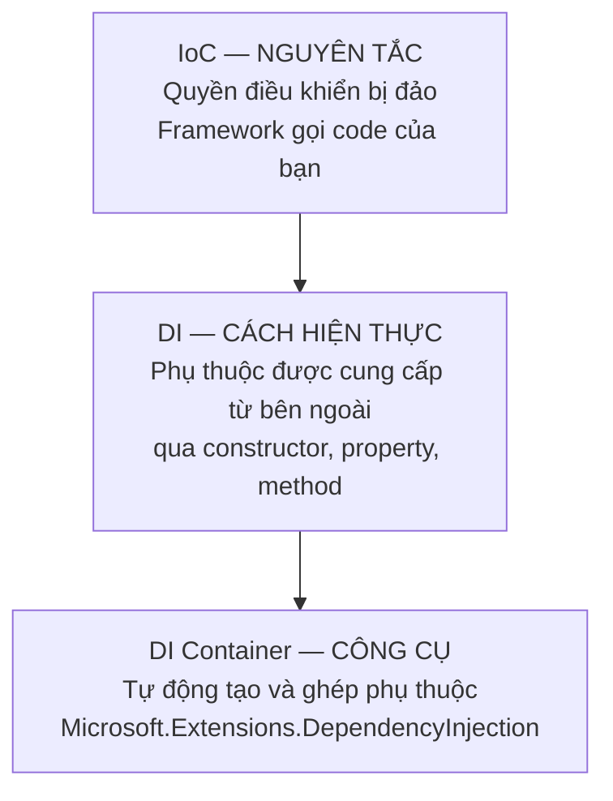

# 7.2 — 1. IoC Container và DI Container

> Nguồn: https://tiennhm.io.vn/en/docs/dotnet-backend-zero-to-senior/stage-02-csharp-professional/module-07-dependency-injection/7.2-ioc-container-and-di-container
> IoC là nguyên tắc, DI là cách hiện thực, container là công cụ. Phân biệt ba khái niệm hay bị dùng lẫn lộn, cùng ServiceCollection và ServiceProvider.

> Ba từ hay bị dùng thay cho nhau nhưng nằm ở ba tầng khác nhau. **IoC** là **nguyên tắc**: quyền quyết định bị đảo từ code của bạn sang framework. **DI** là **một cách hiện thực** IoC, cụ thể cho việc cung cấp phụ thuộc. **Container** là **công cụ** tự động hoá DI — và bạn có thể làm DI hoàn toàn không cần container (gọi là *pure DI*). Về mặt kỹ thuật, `ServiceCollection` là **công thức**, còn `ServiceProvider` là **nhà bếp**: đăng ký chỉ ghi lại cách tạo, chưa tạo gì cả; `BuildServiceProvider()` mới đóng băng danh sách đó lại.

## Mục tiêu bài học

Sau bài này bạn có thể:

- Phân biệt rạch ròi IoC, DI và DI container.
- Giải thích `ServiceDescriptor`, `ServiceCollection` và `ServiceProvider` khác nhau thế nào.
- Mô tả đúng những gì xảy ra khi container resolve một service.
- Biết khi nào container .NET là đủ và khi nào cần Autofac.

## Nội dung bài học

### 7.3.1 — Ba tầng khái niệm



**IoC** rộng hơn DI rất nhiều. Mỗi lần bạn viết một event handler, một middleware, hay override một phương thức của lớp cha, bạn đang dùng IoC: **framework gọi bạn**, chứ không phải bạn gọi framework. Đây là "nguyên tắc Hollywood" — *đừng gọi cho chúng tôi, chúng tôi sẽ gọi bạn*.

**DI** là IoC áp cho một thứ cụ thể: **việc lấy phụ thuộc**. Thay vì lớp tự đi tìm, phụ thuộc được đưa tới.

**Container** chỉ là tiện ích. DI không cần container:

```csharp
// Pure DI — hoàn toàn không container
var repository = new SqlCustomerRepository(connectionString);
var email      = new SmtpEmailService(smtpHost, smtpPort);
var service    = new CustomerService(repository, email, logger);
```

Đoạn trên là DI đầy đủ, đúng nghĩa. Với 10 lớp thì nó còn dễ đọc hơn container. Với 300 lớp và bốn mức lồng nhau thì nó thành một hàm dài 500 dòng — đó chính là lúc container có giá trị.

> **Tip: Nhớ đơn giản**
>
> IoC là **tại sao**. DI là **cái gì**. Container là **bằng gì**.
### 7.3.2 — `ServiceCollection`: công thức, chưa phải món ăn

```csharp
var services = new ServiceCollection();

services.AddScoped<ICustomerRepository, SqlCustomerRepository>();
services.AddScoped<IEmailService, SmtpEmailService>();
services.AddScoped<CustomerService>();
```

Sau ba dòng này, **chưa có đối tượng nào được tạo**. `ServiceCollection` chỉ là `IList`, và mỗi `ServiceDescriptor` ghi ba thông tin:

| Thành phần | Ví dụ | Nghĩa |
|---|---|---|
| `ServiceType` | `ICustomerRepository` | Khi ai đó xin **kiểu này** |
| `ImplementationType` | `SqlCustomerRepository` | thì đưa **kiểu này** |
| `Lifetime` | `Scoped` | và dùng lại theo **quy tắc này** |

Vì nó là một `IList`, thứ tự có ý nghĩa: **đăng ký sau ghi đè đăng ký trước** khi resolve một instance. Điều này giải thích một hành vi hay gây bối rối — đăng ký `IEmailService` hai lần rồi `GetRequiredService()` sẽ trả về cái **cuối cùng**. Nhưng `GetServices()` thì trả về **cả hai**, theo đúng thứ tự đăng ký.

Muốn "chỉ đăng ký nếu chưa có ai đăng ký" thì dùng `TryAdd`:

```csharp
services.TryAddScoped<IEmailService, SmtpEmailService>();
```

Đây là thứ mọi thư viện nên dùng, để không đè lên lựa chọn của ứng dụng.

### 7.3.3 — `ServiceProvider`: nơi mọi thứ thật sự xảy ra

```csharp
ServiceProvider provider = services.BuildServiceProvider();

var customerService = provider.GetRequiredService<CustomerService>();
```

`BuildServiceProvider()` **đóng băng** danh sách đăng ký. Thêm đăng ký sau thời điểm này không có tác dụng — một lỗi âm thầm rất hay gặp khi người ta gọi `BuildServiceProvider()` giữa chừng trong `Program.cs`.

Khi bạn xin `CustomerService`, container làm theo thứ tự:

1. Tìm `ServiceDescriptor` khớp với `CustomerService`.
2. Đọc constructor, thấy nó cần `ICustomerRepository`, `IEmailService`, `ILogger`.
3. **Đệ quy** resolve từng cái trong số đó.
4. Gọi constructor với các đối tượng vừa dựng.
5. Ghi lại đối tượng vào scope hiện tại nếu lifetime yêu cầu, và ghi vào danh sách cần `Dispose` nếu nó là `IDisposable`.

Điểm 5 là thứ bạn nhận được miễn phí và dễ quên: **container gọi `Dispose` giúp bạn** cho mọi đối tượng nó tạo ra. Nhưng chỉ cho những đối tượng **nó tạo** — nếu bạn tự `new` rồi đăng ký instance đó, việc dọn dẹp là của bạn.

Bước 2 có một quy tắc quan trọng: nếu lớp có **nhiều constructor**, container chọn cái mà nó **giải được nhiều tham số nhất**. Nó không chọn cái dài nhất, và nếu có hai constructor cùng "giải được" mà không cái nào bao trùm cái kia, bạn nhận exception. Cách an toàn nhất là **chỉ có một constructor công khai**.

`GetService()` trả `null` khi không tìm thấy; `GetRequiredService()` ném exception với thông báo rõ ràng. **Luôn dùng bản `Required`** — `NullReferenceException` ở đâu đó sâu trong nghiệp vụ tệ hơn nhiều so với một lỗi khởi động nói rõ bạn quên đăng ký gì.

### 7.3.4 — Trong ASP.NET Core bạn không thấy hai bước đó

```csharp
var builder = WebApplication.CreateBuilder(args);

builder.Services.AddScoped<ICustomerRepository, SqlCustomerRepository>();

var app = builder.Build();     // BuildServiceProvider() xay ra o day
```

`builder.Services` **chính là** một `IServiceCollection`, và `builder.Build()` gọi `BuildServiceProvider()` bên trong. Đó là lý do mọi đăng ký phải nằm **trước** `builder.Build()`. Chi tiết ở [bài 7.7](7.6-program-cs-and-webapplicationbuilder.mdx).

Ba service có sẵn không cần đăng ký: `ILogger`, `IConfiguration`, `IServiceProvider`.

### 7.3.5 — Container .NET đủ chưa?

`Microsoft.Extensions.DependencyInjection` cố ý **tối giản**. Nó không có:

- **Property injection** — chỉ hỗ trợ constructor.
- **Assembly scanning** — không tự quét và đăng ký hàng loạt.
- **Decorator** — không bọc service này bằng service khác một cách tự nhiên.
- **Conditional registration** phức tạp — mặc dù .NET 8 đã có keyed services ([bài 7.9](7.8-keyed-services.mdx)).

Đó là lựa chọn thiết kế: nhanh, ít phép màu, ai đọc `Program.cs` cũng hiểu.

| Dùng container .NET | Cân nhắc Autofac / Scrutor |
|---|---|
| Ứng dụng web thông thường | Cần decorator (caching, logging bọc quanh repository) |
| Số lượng đăng ký vừa phải | Cần quét assembly đăng ký hàng trăm handler |
| Muốn `Program.cs` đọc là hiểu | Cần property injection cho legacy code |

Thực tế: **Scrutor** là lựa chọn nhẹ nhất, vì nó thêm assembly scanning và decorator **lên trên** container .NET chứ không thay thế nó.

### 7.3.6 — Rà lại code của bạn

**Danh sách rà soát container**

- [ ] Mọi đăng ký đều nằm trước builder.Build().
- [ ] Không gọi BuildServiceProvider() thủ công giữa chừng trong Program.cs.
- [ ] Dùng GetRequiredService thay vì GetService ở mọi nơi.
- [ ] Mỗi lớp được tiêm chỉ có một constructor công khai.
- [ ] Thư viện dùng TryAdd để không đè lên đăng ký của ứng dụng.
- [ ] Hiểu rằng đăng ký sau thắng đăng ký trước khi resolve một instance.
- [ ] Không tự new rồi đăng ký instance nếu nó cần được Dispose.

## Bài tập áp dụng

#### Bài 1 — Đăng ký trùng: cái nào thắng

Đăng ký `IEmailService` hai lần với hai cài đặt khác nhau. Gọi `GetRequiredService` và `GetServices`, ghi lại kết quả của cả hai.

**Tiêu chí hoàn thành:** bạn nêu đúng quy tắc và một tình huống thực tế mà quy tắc đó **có ích**.

Gợi ý và lời giải — Bài 1

**Gợi ý.** Container giữ các đăng ký trong một **danh sách theo thứ tự**. Hai phương thức lấy ra đọc danh sách đó theo hai cách khác nhau.

**Lời giải.**

```csharp
var s = new ServiceCollection();
s.AddSingleton<IEmail, SmtpEmail>();
s.AddSingleton<IEmail, SendGridEmail>();
var p = s.BuildServiceProvider();

Console.WriteLine(p.GetRequiredService<IEmail>().Ten);
Console.WriteLine(string.Join(", ", p.GetServices<IEmail>().Select(x => x.Ten)));
```

**Kết quả đo thật trên .NET 9:**

```text
GetRequiredService -> SendGrid
GetServices        -> Smtp, SendGrid
```

**Quy tắc: đăng ký cuối cùng thắng.** `GetRequiredService` trả về cái **được đăng ký sau cùng**. `GetServices` trả về **tất cả**, theo đúng thứ tự đăng ký.

**Tình huống thực tế mà quy tắc này có ích — ghi đè mặc định:**

```csharp
builder.Services.AddCrmInfrastructure(builder.Configuration);   // đăng ký SmtpEmailSender

if (builder.Environment.IsDevelopment())
    builder.Services.AddSingleton<IEmailSender, FileEmailSender>();   // ghi ra file thay vì gửi thật
```

Ở môi trường phát triển, `FileEmailSender` được đăng ký sau nên nó thắng — mà không phải sửa gì trong `AddCrmInfrastructure`. Đây là cách phổ biến để thay thế hạ tầng thật bằng bản giả trong lúc phát triển và khi chạy kiểm thử tích hợp.

Cùng cơ chế được `WebApplicationFactory` dùng để thay service trong kiểm thử:

```csharp
builder.ConfigureServices(services =>
{
    services.AddSingleton<IEmailSender, FakeEmailSender>();   // ghi đè bản thật
});
```

**Cái bẫy của quy tắc này.** Nó cũng có nghĩa là đăng ký trùng do **vô ý** sẽ im lặng thay đổi hành vi. Đăng ký thừa vẫn nằm trong container, vẫn được tạo ra nếu ai đó gọi `GetServices`, và vẫn tốn bộ nhớ. Đây chính là vấn đề mà [bài 7.6](7.5-registering-services.mdx) xử lý bằng `TryAdd`.

**Ba cách lấy nhiều cài đặt cùng lúc:**

```csharp
// 1. GetServices — lấy tất cả
var tatCa = sp.GetServices<IEmailSender>();

// 2. Tiêm IEnumerable<T> vào constructor — cách thường dùng nhất
public class NotificationHub(IEnumerable<INotificationSender> senders) { }

// 3. Keyed services (.NET 8) — chọn theo khoá
builder.Services.AddKeyedScoped<INotificationSender, EmailSender>("email");
builder.Services.AddKeyedScoped<INotificationSender, SmsSender>("sms");

public class Svc([FromKeyedServices("email")] INotificationSender sender) { }
```

Cách 2 là mẫu chuẩn khi bạn muốn **chạy tất cả** — ví dụ chạy mọi validator, gửi qua mọi kênh. Cách 3 dành cho khi bạn muốn **chọn một**, và [bài 7.9](7.8-keyed-services.mdx) trình bày chi tiết.

**Một chi tiết về thứ tự.** `GetServices` giữ nguyên thứ tự đăng ký, và điều đó **có ý nghĩa** với những thứ chạy tuần tự như bộ lọc hay đường ống xử lý. Nếu thứ tự quan trọng, hãy để nó rõ ràng trong code đăng ký thay vì trông chờ vào may mắn.

#### Bài 2 — Container tự dọn dẹp tới đâu

Tạo một service cài `IDisposable` ghi log trong `Dispose`. Đăng ký `Scoped`, tạo một phạm vi rồi huỷ. Xác nhận log xuất hiện. Sau đó thử với `AddSingleton(new MyService())` và so sánh.

**Tiêu chí hoàn thành:** bạn nêu đúng quy tắc — container chỉ giải phóng thứ **chính nó tạo ra**.

Gợi ý và lời giải — Bài 2

**Gợi ý.** Có hai cách đăng ký một `Singleton`: đưa **kiểu** cho container tự tạo, hoặc đưa **một thể hiện đã có sẵn**. Ai là người "sở hữu" đối tượng trong mỗi trường hợp?

**Lời giải.**

```csharp
public class Svc : IDisposable
{
    public string Ten;
    public Svc(string ten) => Ten = ten;
    public void Dispose() => Console.WriteLine($"Dispose {Ten}");
}

var s = new ServiceCollection();
s.AddScoped(_ => new Svc("scoped"));
s.AddSingleton(new Svc("thể hiện có sẵn"));      // container KHÔNG tạo cái này
var p = s.BuildServiceProvider();

using (var scope = p.CreateScope())
{
    scope.ServiceProvider.GetRequiredService<Svc>();
}
Console.WriteLine("-- đã huỷ phạm vi --");

(p as IDisposable)?.Dispose();
Console.WriteLine("-- đã huỷ provider --");
```

**Kết quả:**

```text
Dispose scoped
-- đã huỷ phạm vi --
-- đã huỷ provider --
```

Thể hiện đăng ký bằng `AddSingleton(new Svc(...))` **không bao giờ được `Dispose`**.

**Quy tắc: container chỉ giải phóng thứ chính nó tạo ra.** Khi bạn đưa vào một thể hiện đã dựng sẵn, container coi đó là đối tượng của bạn và không đụng tới vòng đời của nó — vì nó không biết bạn có còn dùng nó ở nơi khác hay không.

**Bảng đầy đủ:**

| Cách đăng ký | Ai tạo | Container `Dispose`? |
|---|---|---|
| `AddScoped<IFoo, Foo>()` | Container | **Có**, khi phạm vi kết thúc |
| `AddScoped(sp => new Foo())` | Container (qua factory) | **Có** |
| `AddSingleton<IFoo, Foo>()` | Container | **Có**, khi ứng dụng tắt |
| `AddSingleton(new Foo())` | **Bạn** | **Không** |
| `AddSingleton(sp => new Foo())` | Container | **Có** |

Lưu ý dòng thứ tư khác hẳn dòng thứ năm, dù trông rất giống nhau: một bên truyền **đối tượng**, một bên truyền **hàm tạo đối tượng**.

**Hệ quả thực tế.** Với đối tượng nắm tài nguyên hệ thống — kết nối, file, socket — việc quên giải phóng gây rò rỉ thật:

```csharp
// RÒ RỈ — kết nối không bao giờ được đóng khi ứng dụng tắt
builder.Services.AddSingleton(new NpgsqlDataSource(cs));

// ĐÚNG — container quản lý vòng đời
builder.Services.AddSingleton(sp => NpgsqlDataSource.Create(cs));
```

Với ứng dụng web chạy liên tục thì hậu quả nhẹ, vì tiến trình tắt là hệ điều hành thu hồi hết. Nhưng với ứng dụng chạy rồi thoát — công cụ dòng lệnh, tác vụ theo lịch — hoặc khi kiểm thử tạo và huỷ container nhiều lần, rò rỉ này tích tụ thật.

**Còn `IAsyncDisposable`?** Container hỗ trợ cả hai. Nhưng nếu bạn huỷ provider **đồng bộ** trong khi service cài `IAsyncDisposable`, bạn nhận ngoại lệ:

```text
InvalidOperationException: '...' type only implements IAsyncDisposable.
Use DisposeAsync to dispose the container.
```

Trong ASP.NET Core, host tự gọi `DisposeAsync` nên không sao. Khi tự tạo provider, hãy dùng `await using`:

```csharp
await using var p = s.BuildServiceProvider();
```

**Quy tắc thực dụng.** Ưu tiên `AddSingleton<TService, TImpl>()` hoặc factory, tránh `AddSingleton(instance)`. Chỉ dùng cách truyền thể hiện cho những đối tượng **không nắm tài nguyên** — cấu hình đã đọc xong, bảng tra hằng số, đối tượng bất biến.

#### Bài 3 — Container chọn constructor nào

Viết một lớp có hai constructor, một nhận `IEmail` và một nhận `IEmail` cùng `IScopedBar`, trong đó **chỉ đăng ký** `IEmail`. Đoán xem container chọn cái nào, rồi kiểm chứng.

**Tiêu chí hoàn thành:** bạn nêu đúng quy tắc chọn và một trường hợp mà quy tắc đó gây bất ngờ.

Gợi ý và lời giải — Bài 3

**Gợi ý.** Container muốn dùng constructor **nhiều tham số nhất**, nhưng nó chỉ dùng được những constructor mà nó **thoả mãn được toàn bộ** tham số.

**Lời giải.**

```csharp
public class HaiCtor
{
    public string Dung = "";
    public HaiCtor(IEmail e)                 => Dung = "1 tham số";
    public HaiCtor(IEmail e, IScopedBar b)   => Dung = "2 tham số";
}

var s = new ServiceCollection();
s.AddSingleton<IEmail, SmtpEmail>();     // chỉ đăng ký IEmail
s.AddTransient<HaiCtor>();
var p = s.BuildServiceProvider();

Console.WriteLine(p.GetRequiredService<HaiCtor>().Dung);
```

**Kết quả đo thật trên .NET 9:**

```text
2 constructor, chỉ đăng ký IEmail -> chọn: 1 tham số
```

**Quy tắc.** Container chọn constructor **nhiều tham số nhất mà nó thoả mãn được toàn bộ**. Ở đây nó không có `IScopedBar`, nên nó lùi về constructor một tham số.

**Trường hợp gây bất ngờ — và đây là phần đáng giá của bài.** Giả sử bạn thêm một tính năng mới và đăng ký `IScopedBar`:

```csharp
s.AddScoped<IScopedBar, ScopedBar>();     // thêm cho một tính năng khác
```

Giờ container **âm thầm chuyển sang constructor hai tham số**. Hành vi của `HaiCtor` thay đổi hoàn toàn, mà:

- Không một dòng nào trong `HaiCtor` bị sửa.
- Không một cảnh báo nào.
- Người thêm dòng `AddScoped` không hề biết mình vừa đổi hành vi của một lớp khác.

Đây là một dạng phụ thuộc ẩn giữa hai phần tưởng như không liên quan.

**Khi nào container ném lỗi:**

```csharp
public class Nhap
{
    public Nhap(IEmail e, IScopedBar b) { }
    public Nhap(IEmail e, IOther o) { }
}
```

Nếu container thoả mãn được **cả hai** và chúng cùng số tham số, nó không biết chọn cái nào:

```text
InvalidOperationException: Unable to activate type 'Nhap'.
The following constructors are ambiguous.
```

**Khuyến nghị: mỗi lớp chỉ nên có MỘT constructor công khai.** Ba lý do:

1. **Không có gì để container đoán.** Hành vi tất định, không phụ thuộc vào đăng ký ở nơi khác.
2. **Chữ ký là tài liệu chính xác.** Đọc constructor là biết đúng lớp này cần gì, không phải "có thể cần gì tuỳ tình huống".
3. **Kiểm thử rõ ràng.** Không phải tự hỏi bài kiểm thử đang dùng constructor nào.

Với C# 12, primary constructor làm điều này thành mặc định tự nhiên:

```csharp
public class OrderService(
    IOrderRepository repo,
    IEmailSender mail,
    ILogger<OrderService> log)
{
    // chỉ có một constructor, không có gì để đoán
}
```

**Khi thật sự cần nhiều cách khởi tạo,** đừng dùng nhiều constructor công khai. Dùng phương thức nhà máy tĩnh với tên mô tả rõ:

```csharp
public static OrderService ForTesting(IOrderRepository repo)
    => new(repo, new NullEmailSender(), NullLogger<OrderService>.Instance);
```

Cách này vừa rõ ý định vừa không đưa sự mơ hồ vào container.

## Tự kiểm tra

### IoC, DI và DI container khác nhau thế nào?

IoC là nguyên tắc: quyền điều khiển bị đảo, framework gọi code của bạn thay vì ngược lại. DI là một cách hiện thực IoC, áp riêng cho việc cung cấp phụ thuộc từ bên ngoài. Container là công cụ tự động hoá DI. Bạn hoàn toàn có thể làm DI mà không cần container, gọi là pure DI, và với dự án nhỏ thì nó còn dễ đọc hơn.

### ServiceCollection và ServiceProvider khác nhau ra sao?

ServiceCollection chỉ là một danh sách ServiceDescriptor ghi lại cách tạo service, chưa tạo đối tượng nào. ServiceProvider là container thật, được tạo bằng BuildServiceProvider và nó đóng băng danh sách đăng ký lại. Thêm đăng ký sau thời điểm đó sẽ không có tác dụng.

### Đăng ký cùng một interface hai lần thì sao?

GetRequiredService trả về đăng ký cuối cùng, vì đăng ký sau ghi đè đăng ký trước. Nhưng GetServices trả về cả hai theo đúng thứ tự đăng ký. Thư viện nên dùng TryAdd để không đè lên lựa chọn của ứng dụng.

### Container chọn constructor nào khi lớp có nhiều constructor?

Nó chọn constructor mà nó giải được nhiều tham số nhất, không phải cái dài nhất. Nếu có hai constructor cùng giải được mà không cái nào bao trùm cái kia thì bạn nhận exception. Cách an toàn nhất là mỗi lớp chỉ có một constructor công khai.

### Nên dùng GetService hay GetRequiredService?

Luôn dùng GetRequiredService. GetService trả null khi không tìm thấy, dẫn tới NullReferenceException ở đâu đó sâu trong nghiệp vụ. GetRequiredService ném exception ngay với thông báo rõ ràng về kiểu bị thiếu.

### Container .NET thiếu gì so với Autofac?

Nó không có property injection, không có assembly scanning, không hỗ trợ decorator, và conditional registration hạn chế dù .NET 8 đã thêm keyed services. Đó là lựa chọn thiết kế có chủ ý để nhanh và ít phép màu. Nếu cần thêm thì Scrutor là lựa chọn nhẹ nhất vì nó bổ sung lên trên container .NET chứ không thay thế.

## Kết luận

Ba điều đáng nhớ nhất:

1. **IoC là nguyên tắc, DI là cách làm, container là công cụ** — và DI không bắt buộc phải có container.
2. **Đăng ký không tạo gì cả.** `ServiceCollection` là danh sách công thức; `BuildServiceProvider()` mới đóng băng nó lại.
3. **Container tự gọi `Dispose`** cho mọi đối tượng nó tạo — nhưng chỉ cho những đối tượng nó tạo.

## Tham khảo

- [Dependency injection in .NET](https://learn.microsoft.com/en-us/dotnet/core/extensions/dependency-injection)
- [Use dependency injection in .NET](https://learn.microsoft.com/en-us/dotnet/core/extensions/dependency-injection-usage)
- [ServiceDescriptor class](https://learn.microsoft.com/en-us/dotnet/api/microsoft.extensions.dependencyinjection.servicedescriptor)
- [Dependency injection guidelines](https://learn.microsoft.com/en-us/dotnet/core/extensions/dependency-injection-guidelines)

## Điều hướng

- **Bài trước:** [7.1 — Vấn đề DI giải quyết](7.1-di-problem-scope.mdx)
- **Bài tiếp theo:** [7.3 — 2. Ba cách tiêm dependency](7.3-three-ways-register-services.mdx)
- **Về module:** [Trang mục lục](./)
