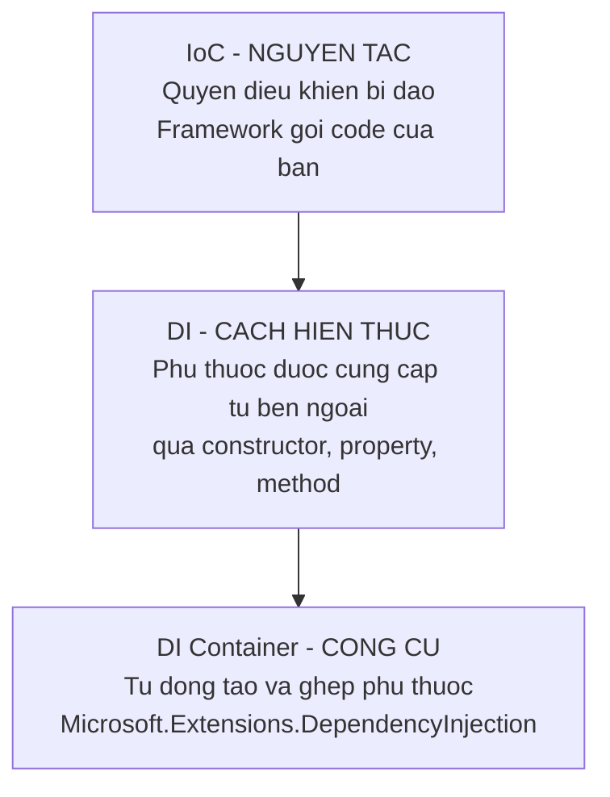

# 7.3 — 1. IoC Container và DI Container

> Nguồn: https://tiennhm.io.vn/en/docs/dotnet-backend-zero-to-senior/stage-02-csharp-professional/module-07-dependency-injection/7.3-ioc-container-and-di-container
> IoC là nguyên tắc, DI là cách hiện thực, container là công cụ. Phân biệt ba khái niệm hay bị dùng lẫn lộn, cùng ServiceCollection và ServiceProvider.

> Ba từ hay bị dùng thay cho nhau nhưng nằm ở ba tầng khác nhau. **IoC** là **nguyên tắc**: quyền quyết định bị đảo từ code của bạn sang framework. **DI** là **một cách hiện thực** IoC, cụ thể cho việc cung cấp phụ thuộc. **Container** là **công cụ** tự động hoá DI — và bạn có thể làm DI hoàn toàn không cần container (gọi là *pure DI*). Về mặt kỹ thuật, `ServiceCollection` là **công thức**, còn `ServiceProvider` là **nhà bếp**: đăng ký chỉ ghi lại cách tạo, chưa tạo gì cả; `BuildServiceProvider()` mới đóng băng danh sách đó lại.

## Mục tiêu bài học

Sau bài này bạn có thể:

- Phân biệt rạch ròi IoC, DI và DI container.
- Giải thích `ServiceDescriptor`, `ServiceCollection` và `ServiceProvider` khác nhau thế nào.
- Mô tả đúng những gì xảy ra khi container resolve một service.
- Biết khi nào container .NET là đủ và khi nào cần Autofac.

## Nội dung bài học

### 7.3.1 — Ba tầng khái niệm



**IoC** rộng hơn DI rất nhiều. Mỗi lần bạn viết một event handler, một middleware, hay override một phương thức của lớp cha, bạn đang dùng IoC: **framework gọi bạn**, chứ không phải bạn gọi framework. Đây là "nguyên tắc Hollywood" — *đừng gọi cho chúng tôi, chúng tôi sẽ gọi bạn*.

**DI** là IoC áp cho một thứ cụ thể: **việc lấy phụ thuộc**. Thay vì lớp tự đi tìm, phụ thuộc được đưa tới.

**Container** chỉ là tiện ích. DI không cần container:

```csharp
// Pure DI — hoan toan khong container
var repository = new SqlCustomerRepository(connectionString);
var email      = new SmtpEmailService(smtpHost, smtpPort);
var service    = new CustomerService(repository, email, logger);
```

Đoạn trên là DI đầy đủ, đúng nghĩa. Với 10 lớp thì nó còn dễ đọc hơn container. Với 300 lớp và bốn mức lồng nhau thì nó thành một hàm dài 500 dòng — đó chính là lúc container có giá trị.

> **Tip: Nhớ đơn giản**
>
> IoC là **tại sao**. DI là **cái gì**. Container là **bằng gì**.
### 7.3.2 — `ServiceCollection`: công thức, chưa phải món ăn

```csharp
var services = new ServiceCollection();

services.AddScoped<ICustomerRepository, SqlCustomerRepository>();
services.AddScoped<IEmailService, SmtpEmailService>();
services.AddScoped<CustomerService>();
```

Sau ba dòng này, **chưa có đối tượng nào được tạo**. `ServiceCollection` chỉ là `IList`, và mỗi `ServiceDescriptor` ghi ba thông tin:

| Thành phần | Ví dụ | Nghĩa |
|---|---|---|
| `ServiceType` | `ICustomerRepository` | Khi ai đó xin **kiểu này** |
| `ImplementationType` | `SqlCustomerRepository` | thì đưa **kiểu này** |
| `Lifetime` | `Scoped` | và dùng lại theo **quy tắc này** |

Vì nó là một `IList`, thứ tự có ý nghĩa: **đăng ký sau ghi đè đăng ký trước** khi resolve một instance. Điều này giải thích một hành vi hay gây bối rối — đăng ký `IEmailService` hai lần rồi `GetRequiredService()` sẽ trả về cái **cuối cùng**. Nhưng `GetServices()` thì trả về **cả hai**, theo đúng thứ tự đăng ký.

Muốn "chỉ đăng ký nếu chưa có ai đăng ký" thì dùng `TryAdd`:

```csharp
services.TryAddScoped<IEmailService, SmtpEmailService>();
```

Đây là thứ mọi thư viện nên dùng, để không đè lên lựa chọn của ứng dụng.

### 7.3.3 — `ServiceProvider`: nơi mọi thứ thật sự xảy ra

```csharp
ServiceProvider provider = services.BuildServiceProvider();

var customerService = provider.GetRequiredService<CustomerService>();
```

`BuildServiceProvider()` **đóng băng** danh sách đăng ký. Thêm đăng ký sau thời điểm này không có tác dụng — một lỗi âm thầm rất hay gặp khi người ta gọi `BuildServiceProvider()` giữa chừng trong `Program.cs`.

Khi bạn xin `CustomerService`, container làm theo thứ tự:

1. Tìm `ServiceDescriptor` khớp với `CustomerService`.
2. Đọc constructor, thấy nó cần `ICustomerRepository`, `IEmailService`, `ILogger`.
3. **Đệ quy** resolve từng cái trong số đó.
4. Gọi constructor với các đối tượng vừa dựng.
5. Ghi lại đối tượng vào scope hiện tại nếu lifetime yêu cầu, và ghi vào danh sách cần `Dispose` nếu nó là `IDisposable`.

Điểm 5 là thứ bạn nhận được miễn phí và dễ quên: **container gọi `Dispose` giúp bạn** cho mọi đối tượng nó tạo ra. Nhưng chỉ cho những đối tượng **nó tạo** — nếu bạn tự `new` rồi đăng ký instance đó, việc dọn dẹp là của bạn.

Bước 2 có một quy tắc quan trọng: nếu lớp có **nhiều constructor**, container chọn cái mà nó **giải được nhiều tham số nhất**. Nó không chọn cái dài nhất, và nếu có hai constructor cùng "giải được" mà không cái nào bao trùm cái kia, bạn nhận exception. Cách an toàn nhất là **chỉ có một constructor công khai**.

`GetService()` trả `null` khi không tìm thấy; `GetRequiredService()` ném exception với thông báo rõ ràng. **Luôn dùng bản `Required`** — `NullReferenceException` ở đâu đó sâu trong nghiệp vụ tệ hơn nhiều so với một lỗi khởi động nói rõ bạn quên đăng ký gì.

### 7.3.4 — Trong ASP.NET Core bạn không thấy hai bước đó

```csharp
var builder = WebApplication.CreateBuilder(args);

builder.Services.AddScoped<ICustomerRepository, SqlCustomerRepository>();

var app = builder.Build();     // BuildServiceProvider() xay ra o day
```

`builder.Services` **chính là** một `IServiceCollection`, và `builder.Build()` gọi `BuildServiceProvider()` bên trong. Đó là lý do mọi đăng ký phải nằm **trước** `builder.Build()`. Chi tiết ở [bài 7.7](7.7-program-cs-and-webapplicationbuilder.mdx).

Ba service có sẵn không cần đăng ký: `ILogger`, `IConfiguration`, `IServiceProvider`.

### 7.3.5 — Container .NET đủ chưa?

`Microsoft.Extensions.DependencyInjection` cố ý **tối giản**. Nó không có:

- **Property injection** — chỉ hỗ trợ constructor.
- **Assembly scanning** — không tự quét và đăng ký hàng loạt.
- **Decorator** — không bọc service này bằng service khác một cách tự nhiên.
- **Conditional registration** phức tạp — mặc dù .NET 8 đã có keyed services ([bài 7.9](7.9-keyed-services.mdx)).

Đó là lựa chọn thiết kế: nhanh, ít phép màu, ai đọc `Program.cs` cũng hiểu.

| Dùng container .NET | Cân nhắc Autofac / Scrutor |
|---|---|
| Ứng dụng web thông thường | Cần decorator (caching, logging bọc quanh repository) |
| Số lượng đăng ký vừa phải | Cần quét assembly đăng ký hàng trăm handler |
| Muốn `Program.cs` đọc là hiểu | Cần property injection cho legacy code |

Thực tế: **Scrutor** là lựa chọn nhẹ nhất, vì nó thêm assembly scanning và decorator **lên trên** container .NET chứ không thay thế nó.

### 7.3.6 — Rà lại code của bạn

**Danh sách rà soát container**

- [ ] Mọi đăng ký đều nằm trước builder.Build().
- [ ] Không gọi BuildServiceProvider() thủ công giữa chừng trong Program.cs.
- [ ] Dùng GetRequiredService thay vì GetService ở mọi nơi.
- [ ] Mỗi lớp được tiêm chỉ có một constructor công khai.
- [ ] Thư viện dùng TryAdd để không đè lên đăng ký của ứng dụng.
- [ ] Hiểu rằng đăng ký sau thắng đăng ký trước khi resolve một instance.
- [ ] Không tự new rồi đăng ký instance nếu nó cần được Dispose.

## Bài tập áp dụng

1. **Đăng ký trùng.** Đăng ký `IEmailService` hai lần với hai implementation khác nhau. Gọi `GetRequiredService()` và `GetServices()`, ghi lại kết quả của cả hai.

2. **Container tự dọn dẹp.** Tạo một service cài `IDisposable` ghi log trong `Dispose`. Đăng ký nó là scoped, tạo một scope rồi huỷ scope. Xác nhận log xuất hiện. Sau đó thử với `AddSingleton(new MyService())` và so sánh.

3. **Nhiều constructor.** Viết một lớp có hai constructor, một nhận `ILogger` và một nhận `ILogger` cùng `IEmailService`, trong đó chỉ đăng ký `ILogger`. Đoán xem container chọn cái nào, rồi kiểm chứng.

## Tự kiểm tra

### IoC, DI và DI container khác nhau thế nào?

IoC là nguyên tắc: quyền điều khiển bị đảo, framework gọi code của bạn thay vì ngược lại. DI là một cách hiện thực IoC, áp riêng cho việc cung cấp phụ thuộc từ bên ngoài. Container là công cụ tự động hoá DI. Bạn hoàn toàn có thể làm DI mà không cần container, gọi là pure DI, và với dự án nhỏ thì nó còn dễ đọc hơn.

### ServiceCollection và ServiceProvider khác nhau ra sao?

ServiceCollection chỉ là một danh sách ServiceDescriptor ghi lại cách tạo service, chưa tạo đối tượng nào. ServiceProvider là container thật, được tạo bằng BuildServiceProvider và nó đóng băng danh sách đăng ký lại. Thêm đăng ký sau thời điểm đó sẽ không có tác dụng.

### Đăng ký cùng một interface hai lần thì sao?

GetRequiredService trả về đăng ký cuối cùng, vì đăng ký sau ghi đè đăng ký trước. Nhưng GetServices trả về cả hai theo đúng thứ tự đăng ký. Thư viện nên dùng TryAdd để không đè lên lựa chọn của ứng dụng.

### Container chọn constructor nào khi lớp có nhiều constructor?

Nó chọn constructor mà nó giải được nhiều tham số nhất, không phải cái dài nhất. Nếu có hai constructor cùng giải được mà không cái nào bao trùm cái kia thì bạn nhận exception. Cách an toàn nhất là mỗi lớp chỉ có một constructor công khai.

### Nên dùng GetService hay GetRequiredService?

Luôn dùng GetRequiredService. GetService trả null khi không tìm thấy, dẫn tới NullReferenceException ở đâu đó sâu trong nghiệp vụ. GetRequiredService ném exception ngay với thông báo rõ ràng về kiểu bị thiếu.

### Container .NET thiếu gì so với Autofac?

Nó không có property injection, không có assembly scanning, không hỗ trợ decorator, và conditional registration hạn chế dù .NET 8 đã thêm keyed services. Đó là lựa chọn thiết kế có chủ ý để nhanh và ít phép màu. Nếu cần thêm thì Scrutor là lựa chọn nhẹ nhất vì nó bổ sung lên trên container .NET chứ không thay thế.

## Kết luận

Ba điều đáng nhớ nhất:

1. **IoC là nguyên tắc, DI là cách làm, container là công cụ** — và DI không bắt buộc phải có container.
2. **Đăng ký không tạo gì cả.** `ServiceCollection` là danh sách công thức; `BuildServiceProvider()` mới đóng băng nó lại.
3. **Container tự gọi `Dispose`** cho mọi đối tượng nó tạo — nhưng chỉ cho những đối tượng nó tạo.

## Tham khảo

- [Dependency injection in .NET](https://learn.microsoft.com/en-us/dotnet/core/extensions/dependency-injection)
- [Use dependency injection in .NET](https://learn.microsoft.com/en-us/dotnet/core/extensions/dependency-injection-usage)
- [ServiceDescriptor class](https://learn.microsoft.com/en-us/dotnet/api/microsoft.extensions.dependencyinjection.servicedescriptor)
- [Dependency injection guidelines](https://learn.microsoft.com/en-us/dotnet/core/extensions/dependency-injection-guidelines)

## Điều hướng

- **Bài trước:** [7.2 — Vấn đề DI giải quyết](7.2-di-problem-scope.mdx)
- **Bài tiếp theo:** [7.4 — 2. Ba cách tiêm dependency](7.4-three-ways-register-services.mdx)
- **Về module:** [Trang mục lục](./)
