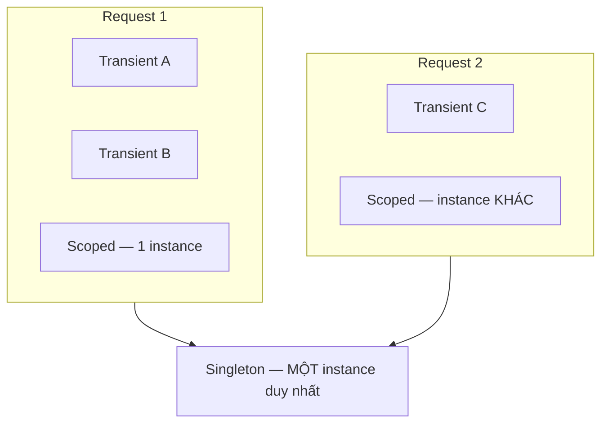

# 7.4 — 3. Service Lifetimes

> Nguồn: https://tiennhm.io.vn/en/docs/dotnet-backend-zero-to-senior/stage-02-csharp-professional/module-07-dependency-injection/7.4-service-lifetimes
> Transient, Scoped, Singleton: khi nào tạo mới, khi nào Dispose, và vì sao captive dependency khiến DbContext sống mãi tới lúc ứng dụng tắt.

> Lifetime trả lời hai câu hỏi: **khi nào tạo instance mới** và **khi nào `Dispose` nó**. Ba lựa chọn: `Transient` (mỗi lần xin là một cái mới), `Scoped` (một cái cho mỗi HTTP request), `Singleton` (một cái cho cả ứng dụng). Sai lầm nguy hiểm nhất trong toàn module là **captive dependency**: một `Singleton` nhận vào một `Scoped`, khiến `Scoped` đó **sống mãi tới khi ứng dụng tắt** — `DbContext` không bao giờ được giải phóng, change tracker phình mãi, và dữ liệu cũ được trả về hàng tháng trời. Từ .NET 6, `ValidateScopes` bật sẵn ở Development nên lỗi này nổ ngay lúc khởi động; ở Production thì **không**.

## Mục tiêu bài học

Sau bài này bạn có thể:

- Chọn đúng lifetime cho một service dựa trên trạng thái nó giữ.
- Giải thích chính xác điều gì xảy ra với captive dependency.
- Dùng `IServiceScopeFactory` đúng chỗ.
- Bật kiểm tra scope cho môi trường Production.
- Biết vì sao `Transient` cài `IDisposable` là một dạng rò rỉ bộ nhớ.

## Nội dung bài học

### 7.5.1 — Ba lifetime

| Lifetime | Tạo mới khi | `Dispose` khi | Điển hình |
|---|---|---|---|
| `Transient` | **Mỗi lần** resolve | Scope chứa nó kết thúc | Service không trạng thái, nhẹ |
| `Scoped` | **Mỗi** HTTP request | Request kết thúc | `DbContext`, repository, Unit of Work |
| `Singleton` | Lần resolve **đầu tiên** | Ứng dụng tắt | Cache, cấu hình, `HttpClientFactory` |



Điểm quan trọng nhất trong bảng là **cột `Dispose`**, không phải cột tạo mới.

### 7.5.2 — Chọn lifetime theo trạng thái

Quy tắc quyết định chỉ có một câu hỏi: **service này giữ trạng thái gì?**

- **Không giữ gì** (chỉ nhận vào, tính, trả ra) → `Transient` hoặc `Singleton`. Nếu nó cũng không có phụ thuộc scoped, chọn `Singleton` để khỏi cấp phát liên tục.
- **Giữ trạng thái theo request** (change tracker, thông tin người dùng hiện tại, transaction) → `Scoped`.
- **Giữ trạng thái chung cho cả ứng dụng** (cache, kết nối dùng chung) → `Singleton`, và **phải thread-safe**.

```csharp
services.AddScoped<CrmDbContext>();                          // giu change tracker
services.AddScoped<ICustomerRepository, EfCustomerRepository>();
services.AddScoped<IUnitOfWork, UnitOfWork>();

services.AddSingleton<ICustomerCache, InMemoryCustomerCache>();  // dùng chung
services.AddTransient<ILeadScorer, RuleBasedLeadScorer>();       // không trạng thái
```

`Scoped` cho `DbContext` và repository không phải quy ước cho đẹp: nó đảm bảo `CustomerRepository` và `LeadRepository` trong **cùng một request** dùng **chung một `DbContext`**, nên `SaveChangesAsync()` ghi cả hai thay đổi trong **một transaction**.

`Singleton` phải thread-safe vì nhiều request chạm vào nó cùng lúc: `ConcurrentDictionary` thay vì `Dictionary`, và không có field nào bị ghi mà không đồng bộ hoá.

### 7.5.3 — Captive dependency

Quy tắc: **một service chỉ được phụ thuộc vào service có lifetime dài bằng hoặc dài hơn nó.**

| Service | Được phụ thuộc vào |
|---|---|
| `Singleton` | Chỉ `Singleton` |
| `Scoped` | `Scoped`, `Singleton` |
| `Transient` | Tất cả |

Vi phạm phổ biến nhất là Singleton nhận Scoped:

```csharp
// BUG
public class CacheRefresher(ICustomerRepository repo)   // repo la Scoped
{
    public Task RefreshAsync() => repo.RefreshCacheAsync();
}
services.AddSingleton<CacheRefresher>();
```

Điều thật sự xảy ra: container dựng `CacheRefresher` **một lần**, và để dựng nó phải dựng một `ICustomerRepository`. Instance đó — cùng với `DbContext` bên trong — bị **giam** trong Singleton và sống tới khi ứng dụng tắt.

Hậu quả, theo thứ tự xuất hiện:

1. **Dữ liệu cũ.** `DbContext` trả về entity từ change tracker chứ không đi xuống database. Bản ghi bạn vừa sửa vẫn hiện giá trị cũ.
2. **Bộ nhớ phình dần.** Change tracker giữ mọi entity đã nạp, không bao giờ dọn. Biểu đồ memory đi lên đều suốt nhiều ngày.
3. **Lỗi đồng thời.** `DbContext` không thread-safe ([bài 6.6](../module-06-async-programming/6.5-task-parallel-library.mdx)), nên hai request đồng thời cho `InvalidOperationException`.
4. **Rò rỉ dữ liệu giữa tenant.** Nếu repository nhớ tenant hiện tại, tenant đầu tiên khởi động ứng dụng sẽ quyết định dữ liệu của tất cả.

Cách chữa là **tạo scope khi cần dùng**:

```csharp
public class CacheRefresher(IServiceScopeFactory scopeFactory)
{
    public async Task RefreshAsync()
    {
        await using var scope = scopeFactory.CreateAsyncScope();
        var repo = scope.ServiceProvider.GetRequiredService<ICustomerRepository>();

        await repo.RefreshCacheAsync();
        // scope dispose -> DbContext được giải phóng đúng cách
    }
}
```

Đây là mẫu bắt buộc trong `BackgroundService`, vì `BackgroundService` **luôn là Singleton** — xem [bài 6.9](../module-06-async-programming/6.8-channels-and-producer-consumer.mdx).

> **Tip: Đọc thêm**
>
> Bài [Singleton, Scoped hay Transient? Chọn sai là `DbContext` sống mãi](https://tiennhm.io.vn/blog/singleton-scoped-transient-captive-dependency) đi vào chi tiết từng hậu quả cùng cách phát hiện trong log.
### 7.5.4 — `ValidateScopes` và vì sao nó không cứu bạn ở Production

.NET tự phát hiện captive dependency, nhưng **chỉ khi được bật**:

```csharp
// Mặc định của CreateBuilder:
// ValidateScopes  = true  chỉ khi Environment là Development
// ValidateOnBuild = true  chỉ khi Environment là Development
```

Nghĩa là code sai vẫn chạy bình thường ở Development nếu ai đó đặt `ASPNETCORE_ENVIRONMENT=Production` trên máy mình, và **luôn** chạy im lặng trên Production.

Bật cho mọi môi trường:

```csharp
builder.Host.UseDefaultServiceProvider(options =>
{
    options.ValidateScopes  = true;   // bat captive dependency
    options.ValidateOnBuild = true;   // bat thieu dang ky ngay luc khoi dong
});
```

`ValidateOnBuild` đặc biệt đáng giá: nó thử dựng **mọi** service đã đăng ký ngay khi khởi động. Thiếu một đăng ký thì ứng dụng **không lên**, thay vì trả 500 vào 3 giờ sáng khi có người gọi đúng endpoint đó.

Chi phí là vài trăm mili giây lúc khởi động. Đáng.

### 7.5.5 — `Transient` cài `IDisposable` là một dạng rò rỉ

```csharp
services.AddTransient<IFileProcessor, FileProcessor>();   // FileProcessor : IDisposable
```

Container **theo dõi** mọi `IDisposable` nó tạo ra để gọi `Dispose` sau. Với `Transient`, đối tượng được ghi vào danh sách của **scope đang chứa nó** — và nếu đó là scope gốc (resolve từ Singleton hoặc từ `app.Services`), danh sách đó chỉ được dọn khi ứng dụng tắt.

Nghĩa là: mỗi lần resolve là một đối tượng nữa nằm lại trong danh sách, **vĩnh viễn**. Trông y hệt một rò rỉ bộ nhớ, và rất khó lần ra vì đối tượng "đã dùng xong" rồi.

Ba cách xử lý:

1. Làm cho nó **không cần `IDisposable`** — thường là dấu hiệu nó đang giữ tài nguyên mà nó không nên giữ.
2. Đổi sang `Scoped` nếu tài nguyên gắn với request.
3. Không đăng ký vào container, **tự `new` trong `using`** nếu nó thật sự là tài nguyên ngắn hạn.

### 7.5.6 — Hai trường hợp đặc biệt

**`DbContext`**: `AddDbContext()` đăng ký `Scoped` sẵn. Đừng đổi lifetime. Cần dùng ngoài request thì dùng `AddDbContextFactory` ([bài 6.6](../module-06-async-programming/6.5-task-parallel-library.mdx)).

**`HttpClient`**: đừng `new HttpClient()` và cũng đừng đăng ký nó `Singleton` trực tiếp. `AddHttpClient()` quản lý pool `HttpMessageHandler` cho bạn — `HttpClient` được tiêm là `Transient` nhưng handler bên dưới thì dùng chung và xoay vòng. Tự `new` sẽ cạn socket; `Singleton` thủ công thì không nhận được thay đổi DNS.

### 7.5.7 — Rà lại code của bạn

**Danh sách rà soát lifetime**

- [ ] Không có Singleton nào nhận Scoped hoặc Transient qua constructor.
- [ ] Mọi BackgroundService dùng IServiceScopeFactory để lấy service scoped.
- [ ] ValidateScopes và ValidateOnBuild được bật cho mọi môi trường.
- [ ] Mọi Singleton đều thread-safe: ConcurrentDictionary, không field bị ghi tự do.
- [ ] Không có Transient nào cài IDisposable.
- [ ] DbContext giữ nguyên lifetime Scoped của AddDbContext.
- [ ] HttpClient lấy qua AddHttpClient, không tự new và không đăng ký Singleton.
- [ ] Mỗi service đã trả lời được câu hỏi: nó giữ trạng thái gì?

## Bài tập áp dụng

#### Bài 1 — Tái hiện captive dependency

Đăng ký một `Singleton` nhận `DbContext` qua constructor. Chạy ở Development và ghi lại ngoại lệ. Sau đó đặt môi trường là Production, chạy lại và xác nhận nó **không** báo gì.

**Tiêu chí hoàn thành:** bạn nêu được vì sao việc "chạy được ở Production" lại là điều **tệ hơn** so với việc báo lỗi.

Gợi ý và lời giải — Bài 1

**Gợi ý.** ASP.NET Core bật `ValidateScopes` và `ValidateOnBuild` **tự động ở môi trường Development**, và **tắt** chúng ở các môi trường khác vì lý do hiệu năng khởi động.

**Lời giải.**

```csharp
builder.Services.AddDbContext<CrmDbContext>(o => o.UseNpgsql(cs));   // mặc định Scoped
builder.Services.AddSingleton<ReportService>();                       // nhận CrmDbContext
```

**Ở Development:**

```text
System.AggregateException: Some services are not able to be constructed
 ---> InvalidOperationException: Cannot consume scoped service 'CrmDbContext'
      from singleton 'ReportService'.
```

Ứng dụng **không khởi động được**. Đây là kết quả tốt nhất có thể.

**Ở Production** (`ASPNETCORE_ENVIRONMENT=Production`): ứng dụng khởi động bình thường, không một cảnh báo nào.

**Vì sao "chạy được" lại tệ hơn.** Vì lỗi không biến mất — nó chỉ chuyển từ dạng **hỏng ngay và rõ ràng** sang dạng **hỏng dần và khó hiểu**:

| Triệu chứng ở Production | Xuất hiện sau |
|---|---|
| Bộ nhớ tăng đều, không bao giờ giảm | Vài giờ tới vài ngày |
| API trả dữ liệu cũ, không khớp database | Ngay, nhưng khó nhận ra |
| `InvalidOperationException: A second operation was started on this context` | Khi có hai request đồng thời |
| Ngoại lệ ngẫu nhiên không tái hiện được | Không đoán trước được |

Không triệu chứng nào trong bảng trên chỉ thẳng về nguyên nhân. Một lỗi biên dịch chỉ mất mười giây để sửa; cùng lỗi đó phát hiện qua bốn triệu chứng rời rạc trên production tốn nhiều ngày.

**Vì sao `DbContext` đặc biệt nguy hiểm khi bị giam:**

1. **Bộ theo dõi thay đổi tích luỹ vĩnh viễn.** Mọi thực thể từng đọc đều bị giữ lại. Sau một triệu truy vấn, đó là một triệu đối tượng không thể thu gom.
2. **Dữ liệu cũ.** Bộ theo dõi trả về **thực thể đã cache** thay vì đọc lại từ database. Bài 2 sẽ chứng minh điều này.
3. **Không an toàn khi dùng đồng thời.** `DbContext` được thiết kế cho một luồng tại một thời điểm. Nhiều request cùng chạm vào nó gây ngoại lệ ngẫu nhiên.

**Cách bật kiểm tra ở mọi môi trường** — và nên bật:

```csharp
builder.Host.UseDefaultServiceProvider((ctx, o) =>
{
    o.ValidateScopes = true;
    o.ValidateOnBuild = true;
});
```

Chi phí là vài trăm mili-giây khi khởi động. Đổi lại, cấu hình sai bị chặn **trước khi** ứng dụng nhận request đầu tiên — thà không khởi động được còn hơn chạy sai.

**Cách sửa đúng khi Singleton thật sự cần dữ liệu:**

```csharp
public class ReportService(IServiceScopeFactory scopeFactory)
{
    public async Task<List<Branch>> GetBranchesAsync(CancellationToken ct)
    {
        using var scope = scopeFactory.CreateScope();
        var db = scope.ServiceProvider.GetRequiredService<CrmDbContext>();
        return await db.Branches.ToListAsync(ct);
    }
}
```

`IServiceScopeFactory` **là** `Singleton`, nên tiêm nó vào `Singleton` hoàn toàn hợp lệ. Mỗi lần dùng tạo một phạm vi mới và giải phóng ngay.

#### Bài 2 — Thấy dữ liệu cũ do `DbContext` bị giam

Với cấu hình sai ở bài 1 chạy ở Production, đọc một bản ghi, sửa nó **trực tiếp trong database**, rồi đọc lại qua API. Ghi lại giá trị nhận được.

**Tiêu chí hoàn thành:** bạn giải thích được vì sao API trả giá trị cũ dù truy vấn **có** chạy xuống database.

Gợi ý và lời giải — Bài 2

**Gợi ý.** Bật log SQL và quan sát: truy vấn **có** được gửi xuống database. Vậy vì sao kết quả trả về vẫn cũ?

**Lời giải.**

```bash
# 1. Đọc qua API
curl localhost:5000/api/v1/branches/1
# {"id":1,"name":"Chi nhánh Hà Nội"}

# 2. Sửa thẳng trong database
psql -c "UPDATE \"Branches\" SET \"Name\" = 'Chi nhánh HN mới' WHERE \"Id\" = 1;"

# 3. Đọc lại qua API
curl localhost:5000/api/v1/branches/1
# {"id":1,"name":"Chi nhánh Hà Nội"}     <- VẪN GIÁ TRỊ CŨ
```

Log SQL cho thấy truy vấn **đã chạy** và trả về `Chi nhánh HN mới`. Nhưng API vẫn trả giá trị cũ.

**Vì sao — cơ chế định danh của bộ theo dõi thay đổi.** EF Core giữ một bản đồ từ khoá chính tới thực thể đã nạp. Khi một truy vấn trả về một dòng có khoá chính đã nằm trong bản đồ, EF Core **giữ nguyên thực thể cũ** và bỏ qua dữ liệu mới:

```text
1. Lần đọc đầu: nạp Branch(1) vào bộ theo dõi với Name = "Chi nhánh Hà Nội"
2. Database đổi thành "Chi nhánh HN mới"
3. Lần đọc sau: SQL chạy, trả về dòng mới
4. EF Core thấy khoá 1 ĐÃ có trong bộ theo dõi
5. -> trả về thực thể CŨ, bỏ qua dữ liệu vừa đọc
```

Đây là hành vi **có chủ ý và đúng** trong phạm vi một request: nó bảo đảm mọi phần của cùng một thao tác nhìn thấy cùng một trạng thái, và cho phép EF Core theo dõi thay đổi để lưu sau.

Nó chỉ trở thành lỗi khi `DbContext` sống **quá lâu** — đúng tình huống captive dependency đang gây ra.

**Ba cách khắc phục, tuỳ nguyên nhân:**

```csharp
// 1. Sửa gốc: DbContext đúng vòng đời Scoped
//    -> mỗi request một context mới, không có dữ liệu cũ

// 2. Với truy vấn chỉ đọc: tắt theo dõi
var ds = await db.Branches.AsNoTracking().ToListAsync(ct);

// 3. Ép nạp lại một thực thể cụ thể
await db.Entry(branch).ReloadAsync(ct);
```

**Cách 2 đáng thành thói quen.** Mọi truy vấn chỉ để hiển thị nên có `AsNoTracking()`. Ngoài việc tránh dữ liệu cũ, nó còn:

- Nhanh hơn, vì không phải tạo bản chụp để so sánh thay đổi.
- Tốn ít bộ nhớ hơn, vì không giữ thực thể trong bộ theo dõi.
- Bắt buộc với `IAsyncEnumerable`, như [bài 6.7](../module-06-async-programming/6.6-async-patterns.mdx) đã nêu.

Có thể đặt làm mặc định cho toàn bộ context và chỉ bật theo dõi khi thật sự cần ghi:

```csharp
optionsBuilder.UseQueryTrackingBehavior(QueryTrackingBehavior.NoTracking);
```

**Vì sao lỗi này khó chẩn đoán.** Người điều tra nhìn log SQL, thấy truy vấn chạy đúng và trả dữ liệu đúng, rồi kết luận "database ổn, chắc do cache ở tầng nào đó". Họ đi tìm Redis, tìm CDN, tìm cache của trình duyệt — trong khi cache thật nằm ngay trong tiến trình, ở một chỗ không ai gọi là cache. [Bài 13.6](../../stage-04-database-production/module-13-entity-framework-core/13.5-query-patterns.mdx) trình bày đầy đủ về bộ theo dõi thay đổi.

#### Bài 3 — Rò rỉ do `Transient` cài `IDisposable`

Đăng ký một `Transient` cài `IDisposable` ghi log trong `Dispose`. Resolve nó 1000 lần từ `app.Services`. Đếm số lần `Dispose` được gọi và đo bộ nhớ.

**Tiêu chí hoàn thành:** bạn nêu đúng **thời điểm** `Dispose` được gọi, và vì sao đó là một dạng rò rỉ.

Gợi ý và lời giải — Bài 3

**Gợi ý.** Container **chịu trách nhiệm giải phóng** mọi đối tượng nó tạo ra có cài `IDisposable`. Câu hỏi là: nó giữ chúng ở đâu cho tới lúc giải phóng?

**Lời giải.**

```csharp
public class Disp : IDisposable
{
    public static int Count;
    public void Dispose() => Count++;
}

var s = new ServiceCollection();
s.AddTransient<Disp>();
var p = s.BuildServiceProvider();

for (int i = 0; i < 1000; i++) p.GetRequiredService<Disp>();
Console.WriteLine($"sau 1000 resolve: Dispose gọi {Disp.Count} lần");

(p as IDisposable)?.Dispose();
Console.WriteLine($"sau khi dispose provider: Dispose gọi {Disp.Count} lần");
```

**Kết quả đo thật trên .NET 9:**

```text
sau 1000 resolve từ root       : Dispose gọi 0 lần
sau khi dispose root provider  : Dispose gọi 1000 lần
```

**Thời điểm `Dispose` được gọi: khi phạm vi chứa chúng bị huỷ.** Với `app.Services` — tức phạm vi gốc — điều đó nghĩa là **khi ứng dụng tắt**.

**Vì sao đây là rò rỉ.** Container giữ tham chiếu tới **mọi** thể hiện `Transient` có cài `IDisposable` mà nó tạo ra, để còn giải phóng chúng sau. Với phạm vi gốc, danh sách đó chỉ có tăng, không bao giờ giảm:

```text
Request 1  -> tạo 1 Disp -> vào danh sách của phạm vi gốc
Request 2  -> tạo 1 Disp -> vào danh sách
...
Request 1.000.000 -> danh sách có một triệu đối tượng
```

Bộ thu gom rác **không thể** dọn chúng, vì container vẫn đang giữ tham chiếu. Triệu chứng: bộ nhớ tăng tuyến tính theo số request và không bao giờ giảm.

**Vì sao trong ASP.NET Core thường không sao.** Mỗi request có phạm vi riêng, và phạm vi đó bị huỷ khi request kết thúc — nên `Transient` được giải phóng đúng lúc. Vấn đề chỉ xuất hiện khi bạn resolve từ **phạm vi gốc**:

```csharp
// NGUY HIỂM — resolve từ phạm vi gốc
var svc = app.Services.GetRequiredService<MyDisposableService>();

// AN TOÀN — resolve từ phạm vi của request
app.MapGet("/x", (MyDisposableService svc) => ...);

// AN TOÀN — tự tạo phạm vi và huỷ nó
using var scope = app.Services.CreateScope();
var svc = scope.ServiceProvider.GetRequiredService<MyDisposableService>();
```

**Ba chỗ hay resolve nhầm từ phạm vi gốc:**

| Chỗ | Vì sao nguy hiểm |
|---|---|
| `BackgroundService` | Nó là `Singleton`, nên `IServiceProvider` tiêm vào nó là phạm vi gốc |
| Code khởi động trong `Program.cs` | `app.Services` chính là phạm vi gốc |
| Bất kỳ đâu dùng Service Locator | Thường không rõ đang ở phạm vi nào |

**Quy tắc.** Nếu một kiểu cài `IDisposable`, hãy cân nhắc rất kỹ trước khi đăng ký nó là `Transient`. Ba lựa chọn thay thế:

1. **`Scoped`** — được giải phóng khi request kết thúc, đây là mặc định hợp lý.
2. **`Singleton`** — nếu nó không giữ trạng thái riêng của người dùng và việc dùng lại là an toàn.
3. **Tự quản lý bằng factory** — trả về một factory và để người gọi bọc trong `using`.

**Một lưu ý về `HttpClient`.** Đây chính là lý do `IHttpClientFactory` tồn tại: `HttpClient` cài `IDisposable`, và cả hai cách dùng ngây thơ — tạo mới mỗi lần, hoặc đăng ký `Transient` — đều gây vấn đề, như [bài 2.3](../../stage-01-foundation/module-02-computer-science-basics/2.2-how-the-internet-works.mdx) đã đo.

## Tự kiểm tra

### Ba lifetime khác nhau thế nào?

Transient tạo instance mới mỗi lần resolve. Scoped tạo một instance cho mỗi HTTP request và dispose khi request kết thúc. Singleton tạo một instance duy nhất ở lần resolve đầu tiên và sống tới khi ứng dụng tắt. Điểm quan trọng nhất không phải khi nào tạo mà là khi nào dispose.

### Chọn lifetime dựa vào tiêu chí nào?

Dựa vào trạng thái service giữ. Không giữ gì thì Transient hoặc Singleton. Giữ trạng thái theo request như change tracker, người dùng hiện tại hay transaction thì Scoped. Giữ trạng thái chung cho cả ứng dụng như cache thì Singleton, và khi đó bắt buộc phải thread-safe.

### Captive dependency gây hậu quả gì?

Bốn hậu quả theo thứ tự xuất hiện. Dữ liệu cũ vì DbContext trả entity từ change tracker thay vì đi xuống database. Bộ nhớ phình dần vì change tracker không bao giờ được dọn. Lỗi đồng thời vì DbContext không thread-safe. Và rò rỉ dữ liệu giữa các tenant nếu repository nhớ tenant hiện tại.

### Vì sao ValidateScopes không cứu được ở Production?

Vì mặc định nó chỉ bật khi môi trường là Development. Code sai sẽ chạy im lặng trên Production. Nên bật thủ công qua UseDefaultServiceProvider cho mọi môi trường, cùng với ValidateOnBuild để ứng dụng không khởi động được khi thiếu đăng ký, thay vì trả lỗi 500 vào lúc nửa đêm.

### Vì sao Transient cài IDisposable là rò rỉ?

Vì container theo dõi mọi IDisposable nó tạo để dispose sau, và với Transient thì đối tượng được ghi vào danh sách của scope đang chứa nó. Nếu đó là scope gốc thì danh sách chỉ được dọn khi ứng dụng tắt, nên mỗi lần resolve là một đối tượng nằm lại vĩnh viễn. Cách chữa là bỏ IDisposable, đổi sang Scoped, hoặc tự new trong using.

### HttpClient nên đăng ký lifetime nào?

Không đăng ký thủ công mà dùng AddHttpClient. Tự new HttpClient sẽ cạn socket, còn đăng ký Singleton thủ công thì không nhận được thay đổi DNS. AddHttpClient quản lý pool HttpMessageHandler và xoay vòng chúng, còn HttpClient được tiêm là Transient.

## Kết luận

Ba điều đáng nhớ nhất:

1. **Lifetime là về `Dispose`, không chỉ về tạo mới.**
2. **Singleton chỉ được phụ thuộc vào Singleton.** Cần Scoped thì tạo scope bằng `IServiceScopeFactory`.
3. **Bật `ValidateScopes` và `ValidateOnBuild` cho mọi môi trường** — vài trăm mili giây đổi lấy việc lỗi nổ lúc khởi động thay vì lúc 3 giờ sáng.

## Tham khảo

- [Dependency injection service lifetimes](https://learn.microsoft.com/en-us/dotnet/core/extensions/dependency-injection#service-lifetimes)
- [Dependency injection guidelines](https://learn.microsoft.com/en-us/dotnet/core/extensions/dependency-injection-guidelines)
- [IHttpClientFactory with .NET](https://learn.microsoft.com/en-us/dotnet/core/extensions/httpclient-factory)
- [DbContext lifetime, configuration, and initialization](https://learn.microsoft.com/en-us/ef/core/dbcontext-configuration/)

## Điều hướng

- **Bài trước:** [7.3 — 2. Ba cách tiêm dependency](7.3-three-ways-register-services.mdx)
- **Bài tiếp theo:** [7.5 — 4. Registering Services](7.5-registering-services.mdx)
- **Về module:** [Trang mục lục](./)

## Bài liên quan

- [Singleton, Scoped hay Transient? Chọn sai là DbContext sống mãi](https://tiennhm.io.vn/blog/singleton-scoped-transient-captive-dependency) — Ba lifetime trong DI container của ASP.NET Core khác nhau ở thời điểm tạo và thời điểm dispose instance.
