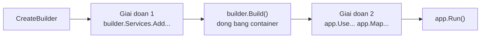

# 7.7 — 5. Program.cs và WebApplicationBuilder

> Nguồn: https://tiennhm.io.vn/en/docs/dotnet-backend-zero-to-senior/stage-02-csharp-professional/module-07-dependency-injection/7.7-program-cs-and-webapplicationbuilder
> Cấu trúc Program.cs theo layer, hai giai đoạn của WebApplicationBuilder, thứ tự middleware, và vì sao không được gọi BuildServiceProvider() giữa chừng.

> `Program.cs` có **hai giai đoạn tách bạch** mà `builder.Build()` là ranh giới: trước nó bạn **đăng ký**, sau nó bạn **cấu hình pipeline**. Hiểu ranh giới này giải thích hầu hết lỗi khởi động: đăng ký sau `Build()` không có tác dụng, và gọi `BuildServiceProvider()` giữa chừng tạo ra một container **thứ hai** với bộ singleton riêng — một nguồn bug mà bạn sẽ mất nhiều giờ để tìm ra. Trong giai đoạn hai, **thứ tự middleware là ngữ nghĩa**: đặt `UseAuthorization` trước `UseAuthentication` khiến mọi request đều vô danh, và không có lỗi nào được báo.

## Mục tiêu bài học

Sau bài này bạn có thể:

- Mô tả hai giai đoạn của `Program.cs` và những gì hợp lệ ở mỗi giai đoạn.
- Tổ chức đăng ký theo layer bằng extension method.
- Sắp đúng thứ tự middleware và giải thích hậu quả khi sai.
- Chạy migration hoặc seed lúc khởi động một cách đúng đắn.
- Biết vì sao `BuildServiceProvider()` thủ công là lỗi.

## Nội dung bài học

### 7.7.1 — Hai giai đoạn

```csharp
var builder = WebApplication.CreateBuilder(args);

// ===== GIAI DOAN 1: DANG KY =====
builder.Services.AddControllers();
builder.Services.AddInfrastructure(builder.Configuration);
builder.Services.AddApplication();

var app = builder.Build();      // <-- RANH GIOI. Container duoc dong bang.

// ===== GIAI DOAN 2: PIPELINE =====
if (app.Environment.IsDevelopment())
    app.UseSwagger().UseSwaggerUI();

app.UseHttpsRedirection();
app.UseAuthentication();
app.UseAuthorization();
app.MapControllers();

app.Run();
```



Sau `Build()`, `builder.Services` vẫn gọi được nhưng **không còn tác dụng gì** — không exception, không cảnh báo, chỉ là service đó không bao giờ tồn tại. Đây là một trong những lỗi khó tìm nhất với người mới.

`WebApplication.CreateBuilder(args)` đã làm sẵn khá nhiều: nạp `appsettings.json`, `appsettings.{Environment}.json`, biến môi trường, tham số dòng lệnh; cấu hình logging; đăng ký `IConfiguration`, `IWebHostEnvironment`, `ILogger`.

### 7.7.2 — Đừng gọi `BuildServiceProvider()` thủ công

```csharp
// SAI — tao mot container THU HAI
builder.Services.AddSingleton<ICache, MemoryCache>();

var sp = builder.Services.BuildServiceProvider();   // container #2
var cache = sp.GetRequiredService<ICache>();        // singleton cua container #2

builder.Services.AddSingleton(cache);
```

Bạn vừa tạo hai container, mỗi cái có bộ `Singleton` riêng. Về sau, một phần ứng dụng dùng instance của container #1, phần khác dùng instance của container #2 — cùng một kiểu `Singleton` nhưng **hai đối tượng khác nhau**. Cache ghi ở một nơi, đọc ở nơi khác thì rỗng.

Tệ hơn: container #2 không bao giờ được `Dispose`, nên mọi `IDisposable` trong đó rò rỉ.

Analyzer `ASP0000` cảnh báo chuyện này. Cần cấu hình phụ thuộc vào một service khác thì dùng options pattern với `IConfigureOptions` ([bài 7.8](7.8-options-pattern.mdx)) — nó được resolve **sau** khi container dựng xong.

### 7.7.3 — Tách đăng ký theo layer

Khi `Program.cs` vượt 100 dòng đăng ký, nó trở thành nơi không ai muốn đụng vào. Tách bằng extension method, **mỗi layer một file, nằm trong chính project của layer đó**:

```csharp
// Infrastructure/DependencyInjection.cs
public static class InfrastructureServiceCollectionExtensions
{
    public static IServiceCollection AddInfrastructure(
        this IServiceCollection services, IConfiguration configuration)
    {
        services.AddDbContext<CrmDbContext>(options =>
            options.UseSqlServer(configuration.GetConnectionString("CrmDb")));

        services.AddScoped<ICustomerRepository, EfCustomerRepository>();
        services.AddScoped<IUnitOfWork, EfUnitOfWork>();

        services.AddOptions<EmailSettings>()
            .Bind(configuration.GetSection(EmailSettings.SectionName))
            .ValidateDataAnnotations()
            .ValidateOnStart();

        services.AddSingleton<IEmailService, SmtpEmailService>();

        return services;      // tra ve de noi chuoi
    }
}
```

```csharp
// Application/DependencyInjection.cs
public static class ApplicationServiceCollectionExtensions
{
    public static IServiceCollection AddApplication(this IServiceCollection services)
    {
        services.AddScoped<ICustomerService, CustomerService>();
        services.AddTransient<ILeadScorer, RuleBasedLeadScorer>();

        services.AddMediatR(cfg => cfg.RegisterServicesFromAssembly(
            typeof(ApplicationServiceCollectionExtensions).Assembly));

        return services;
    }
}
```

Ba lợi ích thật:

1. **Ranh giới layer hiện ra.** `AddApplication()` không nhận `IConfiguration` — nếu một ngày nó cần, đó là tín hiệu layer application đang biết về hạ tầng.
2. **`Program.cs` đọc được trong 30 giây.**
3. **Integration test dùng lại được**: gọi đúng các extension đó rồi `Replace` vài thứ.

Chỗ này thường bị làm quá tay thành `AddCustomerModule()`, `AddLeadModule()`, `AddOrderModule()`… Khi số extension method vượt số layer, bạn chỉ đang di chuyển sự lộn xộn.

### 7.7.4 — Thứ tự middleware là ngữ nghĩa

Giai đoạn 2 **không phải** danh sách bật/tắt — nó là thứ tự thực thi. Mỗi `app.UseXxx()` thêm một lớp vào pipeline, và request đi qua **theo đúng thứ tự bạn viết**.

```csharp
app.UseExceptionHandler("/error");   // ngoai cung — bat loi cua MOI lop ben trong
app.UseHttpsRedirection();
app.UseStaticFiles();
app.UseRouting();
app.UseCors();
app.UseAuthentication();             // BAT BUOC truoc Authorization
app.UseAuthorization();
app.MapControllers();
```

Ba hậu quả cụ thể khi sai thứ tự:

| Sai | Hậu quả |
|---|---|
| `UseAuthorization` trước `UseAuthentication` | `User` luôn vô danh, mọi `[Authorize]` từ chối — không có lỗi nào được báo |
| `UseExceptionHandler` đặt sau | Exception ở middleware phía trên nó không được bắt, client nhận trang lỗi mặc định |
| `UseCors` sau `UseAuthorization` | Preflight request bị chặn trước khi tới CORS, trình duyệt báo lỗi CORS khó hiểu |
| `UseStaticFiles` sau `UseAuthentication` | File tĩnh đi qua toàn bộ tầng xác thực, chậm không cần thiết |

Quy tắc dễ nhớ: **ngoài vào trong** — xử lý lỗi, bảo mật truyền tải, định tuyến, xác thực, phân quyền, rồi mới tới endpoint.

### 7.7.5 — Migration và seed lúc khởi động

```csharp
var app = builder.Build();

using (var scope = app.Services.CreateScope())
{
    var db = scope.ServiceProvider.GetRequiredService<CrmDbContext>();
    await db.Database.MigrateAsync();
}

app.Run();
```

`CreateScope()` là bắt buộc: `app.Services` là **root provider**, và lấy thẳng một service `Scoped` từ đó sẽ ném exception khi `ValidateScopes` bật — hoặc tệ hơn, giam nó nếu không bật ([bài 7.5](7.5-service-lifetimes.mdx)).

Với production nhiều instance, cách này có vấn đề: khi bạn scale lên 3 pod, cả ba cùng chạy migration một lúc. EF Core có khoá nên thường ổn, nhưng cách an toàn là tách migration thành **bước riêng trong pipeline triển khai**.

### 7.7.6 — Rà lại code của bạn

**Danh sách rà soát Program.cs**

- [ ] Mọi đăng ký nằm trước builder.Build().
- [ ] Không có lời gọi BuildServiceProvider() thủ công nào (cảnh báo ASP0000).
- [ ] Đăng ký được tách theo layer, mỗi extension method nằm trong project của layer đó.
- [ ] AddApplication() không nhận IConfiguration.
- [ ] UseAuthentication đứng trước UseAuthorization.
- [ ] UseExceptionHandler là middleware đầu tiên.
- [ ] UseCors đứng trước UseAuthorization.
- [ ] Migration lúc khởi động chạy trong một scope tạo bằng CreateScope().
- [ ] ValidateOnBuild và ValidateScopes được bật cho mọi môi trường.

## Bài tập áp dụng

1. **Đăng ký sau `Build()`.** Thêm một `builder.Services.AddScoped<IFoo, Foo>()` **sau** `builder.Build()`, rồi tiêm `IFoo` vào một controller. Ghi lại thông báo lỗi nhận được và thời điểm nó xuất hiện.

2. **Hai container.** Gọi `BuildServiceProvider()` giữa chừng, lấy ra một `Singleton` giữ một bộ đếm, rồi so sánh giá trị bộ đếm đó với giá trị lấy từ một controller. Ghi lại hai con số khác nhau.

3. **Đảo thứ tự middleware.** Đổi chỗ `UseAuthentication` và `UseAuthorization`, gọi một endpoint có `[Authorize]` với token hợp lệ. Ghi lại status code và xác nhận log **không** có lỗi nào.

## Tự kiểm tra

### Program.cs có hai giai đoạn nào?

Giai đoạn đăng ký service trước builder.Build, và giai đoạn cấu hình pipeline sau đó. builder.Build là ranh giới, nó đóng băng container lại. Đăng ký sau thời điểm này vẫn biên dịch được và không có cảnh báo nào, nhưng service đó sẽ không bao giờ tồn tại.

### Vì sao không được gọi BuildServiceProvider() thủ công?

Vì nó tạo ra một container thứ hai với bộ Singleton riêng, nên cùng một kiểu Singleton sẽ có hai đối tượng khác nhau ở hai phần của ứng dụng. Container thứ hai cũng không bao giờ được Dispose nên mọi IDisposable trong đó rò rỉ. Analyzer ASP0000 cảnh báo chuyện này.

### Tách đăng ký theo layer được lợi gì?

Ranh giới layer hiện ra, ví dụ AddApplication không nhận IConfiguration nên nếu một ngày nó cần thì đó là tín hiệu layer application đang biết về hạ tầng. Program.cs đọc được trong 30 giây. Và integration test dùng lại được các extension đó rồi Replace vài thứ.

### Đặt UseAuthorization trước UseAuthentication thì sao?

User luôn vô danh nên mọi endpoint có Authorize đều từ chối, kể cả với token hợp lệ. Nguy hiểm ở chỗ không có lỗi nào được báo, chỉ là 401 hoặc 403 không giải thích được. Thứ tự middleware là ngữ nghĩa chứ không phải danh sách bật tắt.

### Thứ tự middleware nên nhớ thế nào?

Ngoài vào trong: xử lý lỗi trước tiên để bắt được mọi lớp bên trong, rồi bảo mật truyền tải, file tĩnh, định tuyến, CORS, xác thực, phân quyền, cuối cùng mới tới endpoint.

### Chạy migration lúc khởi động thế nào cho đúng?

Phải tạo scope bằng app.Services.CreateScope rồi lấy DbContext từ scope đó, vì app.Services là root provider và lấy thẳng service Scoped từ đó sẽ ném exception hoặc giam nó. Với production nhiều instance thì an toàn hơn là tách migration thành bước riêng trong pipeline triển khai.

## Kết luận

Ba điều đáng nhớ nhất:

1. **`builder.Build()` là ranh giới.** Trước nó đăng ký, sau nó cấu hình pipeline.
2. **`BuildServiceProvider()` thủ công tạo container thứ hai** — nguồn bug im lặng và rò rỉ.
3. **Thứ tự middleware là ngữ nghĩa**, và sai thứ tự thường không báo lỗi gì cả.

## Tham khảo

- [ASP.NET Core Middleware](https://learn.microsoft.com/en-us/aspnet/core/fundamentals/middleware/)
- [App startup in ASP.NET Core](https://learn.microsoft.com/en-us/aspnet/core/fundamentals/startup)
- [ASP0000: Do not call BuildServiceProvider](https://learn.microsoft.com/en-us/aspnet/core/diagnostics/asp0000)
- [Dependency injection in ASP.NET Core](https://learn.microsoft.com/en-us/aspnet/core/fundamentals/dependency-injection)

## Điều hướng

- **Bài trước:** [7.6 — 4. Registering Services](7.6-registering-services.mdx)
- **Bài tiếp theo:** [7.8 — 6. Options Pattern](7.8-options-pattern.mdx)
- **Về module:** [Trang mục lục](./)

## Bài liên quan

- [Singleton, Scoped hay Transient? Chọn sai là DbContext sống mãi](https://tiennhm.io.vn/blog/singleton-scoped-transient-captive-dependency) — Ba lifetime trong DI container của ASP.NET Core khác nhau ở thời điểm tạo và thời điểm dispose instance.
