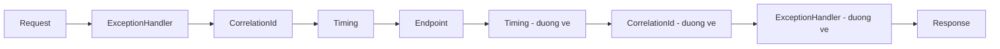

# 8.3 — 2. Request Pipeline và Middleware

> Nguồn: https://tiennhm.io.vn/en/docs/dotnet-backend-zero-to-senior/stage-03-aspnet-core-backend/module-08-aspnet-core-fundamentals/8.3-request-pipeline-and-middleware
> Pipeline là các lớp bọc nhau chứ không phải hàng đợi: Use/Run/Map, short-circuit, vì sao không ghi được header sau khi response đã bắt đầu, và middleware là singleton.

> Pipeline **không phải một hàng đợi** mà là các lớp **bọc nhau**, giống búp bê Nga: mỗi middleware gọi `next()` rồi **code sau `next()` chạy trên đường về**. Hiểu đúng mô hình này giải thích ba thứ hay gây bối rối. Một: middleware đăng ký sớm thấy request **sớm nhất** nhưng thấy response **muộn nhất**. Hai: sau khi `next()` chạy xong, response có thể **đã gửi đi rồi**, nên mọi thay đổi header ở đó bị bỏ qua — im lặng hoặc kèm exception. Ba: middleware được dựng **một lần** cho cả vòng đời ứng dụng, nên nó là **singleton**, và tiêm service scoped vào constructor của nó là captive dependency.

## Mục tiêu bài học

Sau bài này bạn có thể:

- Vẽ đúng đường đi của một request qua pipeline, cả chiều đi lẫn chiều về.
- Phân biệt `Use`, `Run`, `Map`, `MapWhen`, `UseWhen`.
- Viết middleware đúng cách với service scoped.
- Giải thích `HasStarted` và vì sao nó chặn việc ghi header.
- Chọn đúng vị trí cho từng middleware.

## Nội dung bài học

### 8.3.1 — Pipeline là các lớp bọc nhau



```csharp
app.Use(async (context, next) =>
{
    // (1) CHIEU DI — truoc khi cac middleware sau chay
    await next(context);
    // (2) CHIEU VE — sau khi TAT CA middleware sau va endpoint da chay xong
});
```

Hai hệ quả trực tiếp:

- Middleware đăng ký **sớm** thấy request **đầu tiên** và thấy response **cuối cùng**. Vì vậy `UseExceptionHandler` phải đứng đầu: nó cần bọc ngoài mọi thứ để bắt được exception từ mọi lớp bên trong.
- `try/finally` quanh `next()` cho bạn một chỗ chắc chắn chạy dù bên trong có ném hay không — đó là cách đo thời gian request.

### 8.3.2 — `Use`, `Run`, `Map`

```csharp
// Use — xu ly roi chuyen tiep
app.Use(async (context, next) => { ...; await next(context); ...; });

// Run — terminal, KHONG goi next. Moi thu sau no khong bao gio chay.
app.Run(async context => await context.Response.WriteAsync("Hello"));

// Map — re nhanh theo duong dan, nhanh co pipeline rieng
app.Map("/admin", admin =>
{
    admin.UseMiddleware<AdminAuditMiddleware>();
    admin.Run(async ctx => await ctx.Response.WriteAsync("Admin"));
});

// MapWhen — re nhanh theo dieu kien tuy y
app.MapWhen(ctx => ctx.Request.Query.ContainsKey("debug"), branch => { ... });

// UseWhen — chay them middleware roi QUAY LAI pipeline chinh
app.UseWhen(ctx => ctx.Request.Path.StartsWithSegments("/api"),
    api => api.UseMiddleware<ApiKeyMiddleware>());
```

Khác biệt quan trọng nhất là giữa `MapWhen` và `UseWhen`:

| | Sau nhánh |
|---|---|
| `Map` / `MapWhen` | **Không quay lại** pipeline chính |
| `UseWhen` | **Quay lại** pipeline chính |

Chọn nhầm `MapWhen` khi bạn chỉ muốn thêm một bước kiểm tra sẽ khiến `MapControllers()` không bao giờ chạy cho nhánh đó — và bạn nhận 404 trên mọi endpoint khớp điều kiện.

**Short-circuit** là việc không gọi `next()`:

```csharp
app.Use(async (context, next) =>
{
    if (!context.Request.Headers.ContainsKey("X-Api-Key"))
    {
        context.Response.StatusCode = 401;
        await context.Response.WriteAsync("Thieu API key");
        return;                                   // khong goi next -> dung o day
    }
    await next(context);
});
```

### 8.3.3 — Middleware là singleton

```csharp
// SAI — ICustomerRepository la Scoped
public class AuditMiddleware(RequestDelegate next, ICustomerRepository repo)
{
    public async Task InvokeAsync(HttpContext context) { ... }
}
```

Middleware được dựng **một lần** lúc khởi động và dùng lại cho mọi request — tức nó là **singleton**. Tiêm service scoped vào constructor là captive dependency ([bài 7.5](../../stage-02-csharp-professional/module-07-dependency-injection/7.5-service-lifetimes.mdx)), và nó sẽ nổ ngay lúc khởi động khi `ValidateScopes` bật.

```csharp
// DUNG — tiem qua tham so cua InvokeAsync, moi request mot instance
public class AuditMiddleware(RequestDelegate next, ILogger<AuditMiddleware> logger)
{
    public async Task InvokeAsync(HttpContext context, ICustomerRepository repo)
    {
        ...
        await next(context);
    }
}
```

`ILogger` là singleton nên để ở constructor vẫn đúng. Chỉ service **scoped** mới phải xuống `InvokeAsync`.

Có một lựa chọn khác: cài `IMiddleware` và đăng ký nó `Scoped` — khi đó cả middleware được tạo mới mỗi request. Nó rõ ràng hơn nhưng tốn hơn, và phải nhớ đăng ký vào DI, nếu không bạn nhận lỗi lúc chạy.

### 8.3.4 — Hai middleware thật sự hữu ích

```csharp
// Do thoi gian — try/finally de luon chay du co exception
public class RequestTimingMiddleware(RequestDelegate next, ILogger<RequestTimingMiddleware> logger)
{
    public async Task InvokeAsync(HttpContext context)
    {
        var start = Stopwatch.GetTimestamp();
        try
        {
            await next(context);
        }
        finally
        {
            logger.LogInformation("HTTP {Method} {Path} -> {StatusCode} trong {Elapsed}ms",
                context.Request.Method, context.Request.Path, context.Response.StatusCode,
                Stopwatch.GetElapsedTime(start).TotalMilliseconds);
        }
    }
}
```

`Stopwatch.GetTimestamp()` cộng `GetElapsedTime()` (.NET 7+) không cấp phát gì, khác với `Stopwatch.StartNew()` tạo một object mỗi request.

```csharp
// Correlation ID — noi log cua nhieu he thong lai voi nhau
public class CorrelationIdMiddleware(RequestDelegate next)
{
    private const string Header = "X-Correlation-ID";

    public async Task InvokeAsync(HttpContext context)
    {
        var correlationId = context.Request.Headers[Header].FirstOrDefault()
                            ?? Guid.NewGuid().ToString();

        context.TraceIdentifier = correlationId;

        // PHAI dat header TRUOC khi response bat dau
        context.Response.OnStarting(() =>
        {
            context.Response.Headers[Header] = correlationId;
            return Task.CompletedTask;
        });

        using (LogContext.PushProperty("CorrelationId", correlationId))
        {
            await next(context);
        }
    }
}
```

Chú ý `OnStarting`. Viết thẳng `context.Response.Headers[Header] = ...` **sau** `await next(context)` là lỗi ở mục tiếp theo.

### 8.3.5 — `HasStarted`: vì sao không ghi được header nữa

Response được gửi đi **theo luồng**. Ngay khi byte đầu tiên rời server, header đã đi trước nó — và không có cách nào lấy lại.

```csharp
await next(context);

context.Response.Headers["X-Foo"] = "bar";     // bi bo qua, hoac nem exception
```

```csharp
if (!context.Response.HasStarted)
    context.Response.Headers["X-Foo"] = "bar";
```

Đây là nguyên nhân thật sự của lỗi kinh điển `System.InvalidOperationException: StatusCode cannot be set because the response has already started`. Nó hay xuất hiện ở middleware xử lý lỗi cố đổi status code sau khi endpoint đã ghi một phần response.

Cách đúng là `Response.OnStarting(...)` — callback chạy **ngay trước** khi header được gửi, tức thời điểm cuối cùng còn sửa được.

### 8.3.6 — Thứ tự

```csharp
app.UseForwardedHeaders();                       // truoc moi thu doc IP/scheme
app.UseExceptionHandler("/error");               // bao ngoai tat ca
app.UseMiddleware<CorrelationIdMiddleware>();    // som, de moi log deu co
app.UseRequestTiming();
app.UseHttpsRedirection();
app.UseStaticFiles();                            // truoc auth: file tinh khong can xac thuc
app.UseRouting();
app.UseRateLimiter();
app.UseCors();                                   // truoc Authorization
app.UseAuthentication();                         // truoc Authorization
app.UseAuthorization();
app.MapControllers();
```

Bốn hệ quả cụ thể khi sai, đã liệt kê ở [bài 7.7](../../stage-02-csharp-professional/module-07-dependency-injection/7.7-program-cs-and-webapplicationbuilder.mdx). Thêm một điểm riêng cho middleware của bạn: **đặt trước `UseRouting()` thì chưa biết endpoint nào sẽ xử lý**. Cần thông tin đó (ví dụ để đọc attribute trên action) thì phải đặt **giữa** `UseRouting()` và `UseEndpoints`/`MapControllers()`:

```csharp
app.UseRouting();
app.Use(async (ctx, next) =>
{
    var endpoint = ctx.GetEndpoint();            // null neu dat truoc UseRouting
    var attr = endpoint?.Metadata.GetMetadata<AuditAttribute>();
    ...
    await next(ctx);
});
app.UseAuthorization();
```

### 8.3.7 — Sai lầm hay gặp

- **Quên `await next(context)`** — request rơi vào im lặng, client chờ tới timeout, không có lỗi nào trong log.
- **Đọc body request mà không bật buffering** — body là stream đọc một lần; middleware đọc xong thì model binding nhận stream rỗng. Cần `context.Request.EnableBuffering()` rồi `Position = 0` sau khi đọc.
- **Middleware có trạng thái** — nó là singleton, nên field instance bị chia sẻ giữa mọi request đồng thời. Trạng thái theo request thuộc về `HttpContext.Items`.
- **Việc nặng, đồng bộ trong middleware** — nó chạy cho **mọi** request, kể cả file tĩnh và health check.

### 8.3.8 — Rà lại code của bạn

**Danh sách rà soát middleware**

- [ ] Mọi nhánh trong middleware đều gọi next hoặc cố ý short-circuit có ghi response.
- [ ] Không tiêm service scoped vào constructor của middleware.
- [ ] Middleware không có field instance nào giữ trạng thái theo request.
- [ ] Việc ghi header sau next được bọc bằng HasStarted hoặc chuyển sang OnStarting.
- [ ] Đo thời gian dùng try/finally để luôn ghi log kể cả khi có exception.
- [ ] Middleware cần biết endpoint được đặt sau UseRouting().
- [ ] Middleware đọc body request có gọi EnableBuffering và reset Position.
- [ ] Dùng UseWhen chứ không phải MapWhen khi cần quay lại pipeline chính.

## Bài tập áp dụng

1. **Thấy hai chiều.** Viết ba middleware, mỗi cái log một dòng trước `next()` và một dòng sau. Gọi một endpoint và ghi lại thứ tự 6 dòng log.

2. **Tái hiện `HasStarted`.** Viết middleware ghi một header **sau** `await next(context)` với một endpoint có trả body. Ghi lại chuyện gì xảy ra, rồi sửa bằng `OnStarting` và xác nhận header xuất hiện.

3. **`MapWhen` và `UseWhen`.** Dùng `MapWhen` để thêm một bước kiểm tra API key cho `/api`, xác nhận mọi endpoint `/api` trả 404. Đổi sang `UseWhen` và xác nhận chúng hoạt động.

## Tự kiểm tra

### Pipeline hoạt động theo mô hình nào?

Các lớp bọc nhau chứ không phải hàng đợi. Mỗi middleware gọi next rồi code sau next chạy trên đường về. Vì vậy middleware đăng ký sớm thấy request đầu tiên nhưng thấy response cuối cùng, và đó là lý do UseExceptionHandler phải đứng đầu để bọc ngoài mọi thứ.

### MapWhen và UseWhen khác nhau thế nào?

MapWhen rẽ nhánh và không quay lại pipeline chính, còn UseWhen chạy thêm middleware rồi quay lại. Dùng nhầm MapWhen khi chỉ muốn thêm một bước kiểm tra sẽ khiến MapControllers không bao giờ chạy cho nhánh đó, và bạn nhận 404 trên mọi endpoint khớp điều kiện.

### Vì sao không tiêm service scoped vào constructor của middleware?

Vì middleware được dựng một lần lúc khởi động và dùng lại cho mọi request, tức nó là singleton. Tiêm service scoped vào constructor là captive dependency và sẽ nổ lúc khởi động khi ValidateScopes bật. Cách đúng là tiêm qua tham số của InvokeAsync, khi đó mỗi request nhận một instance.

### Vì sao không ghi được header sau khi gọi next?

Vì response được gửi theo luồng, và ngay khi byte đầu tiên rời server thì header đã đi trước nó. Đó là nguyên nhân của lỗi StatusCode cannot be set because the response has already started. Cách đúng là kiểm tra HasStarted, hoặc dùng Response.OnStarting để callback chạy ngay trước lúc header được gửi.

### Middleware cần biết endpoint thì đặt ở đâu?

Giữa UseRouting và MapControllers. Đặt trước UseRouting thì GetEndpoint trả về null vì framework chưa quyết định endpoint nào sẽ xử lý request.

### Đọc body request trong middleware cần lưu ý gì?

Body là stream đọc một lần, nên middleware đọc xong thì model binding nhận stream rỗng. Phải gọi EnableBuffering trước khi đọc và đặt lại Position về 0 sau khi đọc.

## Kết luận

Ba điều đáng nhớ nhất:

1. **Pipeline là các lớp bọc nhau** — code sau `next()` chạy trên đường về, và thứ tự đăng ký quyết định cả hai chiều.
2. **Middleware là singleton.** Service scoped đi qua tham số của `InvokeAsync`, không qua constructor.
3. **Sau khi response bắt đầu thì header đã đi rồi.** Dùng `OnStarting`.

## Tham khảo

- [ASP.NET Core Middleware](https://learn.microsoft.com/en-us/aspnet/core/fundamentals/middleware/)
- [Write custom ASP.NET Core middleware](https://learn.microsoft.com/en-us/aspnet/core/fundamentals/middleware/write)
- [Factory-based middleware activation](https://learn.microsoft.com/en-us/aspnet/core/fundamentals/middleware/extensibility)
- [Routing in ASP.NET Core](https://learn.microsoft.com/en-us/aspnet/core/fundamentals/routing)

## Điều hướng

- **Bài trước:** [8.2 — 1. Kiến trúc ASP.NET Core](8.2-aspnet-core-architecture.mdx)
- **Bài tiếp theo:** [8.4 — 3. Routing](8.4-routing.mdx)
- **Về module:** [Trang mục lục](./)

## Bài liên quan

- [Forward header trong ASP.NET Core: vì sao 'forward hết' là một lỗi kiến trúc](https://tiennhm.io.vn/blog/forward-http-header-an-toan-aspnet-core) — Vòng lặp copy mọi header từ request đi vào sang lời gọi HttpClient đi ra là đoạn code trông vô hại nhất mà tôi từng thấy gây sự cố production.
- [Singleton, Scoped hay Transient? Chọn sai là DbContext sống mãi](https://tiennhm.io.vn/blog/singleton-scoped-transient-captive-dependency) — Ba lifetime trong DI container của ASP.NET Core khác nhau ở thời điểm tạo và thời điểm dispose instance.
- [HTTP header có chứa được tiếng Việt không? ASCII, obs-text và chỗ .NET vạch ranh giới](https://tiennhm.io.vn/blog/http-header-unicode-ascii-dotnet) — Câu trả lời ngắn là không, và lý do thú vị hơn vẻ ngoài của nó.
