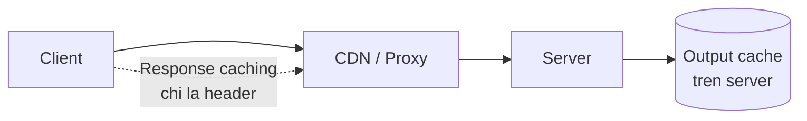

# 9.7 — 7. Response Caching và Output Caching

> Nguồn: https://tiennhm.io.vn/en/docs/dotnet-backend-zero-to-senior/stage-03-aspnet-core-backend/module-09-web-api-professional/9.7-response-caching-and-output-caching
> Response caching dựa vào client tuân thủ header, output caching giữ bản sao trên server. Vary, invalidation bằng tag, ETag và rủi ro cache dữ liệu riêng tư.

> Hai cơ chế tên gần giống nhau nhưng hoạt động ở hai nơi khác nhau. **Response caching** chỉ **gửi header** `Cache-Control` và hy vọng trình duyệt hoặc CDN tuân thủ — server không giữ gì cả, và nó **tự tắt** khi request có `Authorization`. **Output caching** (.NET 7+) giữ bản sao **trên server**, nên nó hoạt động cả với request đã xác thực và quan trọng hơn: nó **xoá được theo tag**. Đó là khác biệt quyết định — với response caching, dữ liệu cũ sống tới hết TTL và bạn không làm gì được. Rủi ro lớn nhất của cả hai vẫn là một: **cache nhầm dữ liệu riêng tư** và trả dữ liệu của người này cho người khác.

## Mục tiêu bài học

Sau bài này bạn có thể:

- Phân biệt response caching và output caching, và chọn đúng.
- Cấu hình `VaryBy` để không trộn lẫn dữ liệu giữa người dùng.
- Xoá cache theo tag khi dữ liệu thay đổi.
- Dùng ETag để tiết kiệm băng thông.
- Nhận ra khi nào **không** nên cache.

## Nội dung bài học

### 9.8.1 — Hai cơ chế, hai nơi



| | Response caching | Output caching |
|---|---|---|
| Bản sao nằm ở | Trình duyệt, CDN, proxy | **Server** |
| Có chạy khi có `Authorization` | **Không** | Có |
| Xoá chủ động được | **Không** | **Có, theo tag** |
| Giảm tải cho server | Có (nếu client tuân thủ) | Có (chắc chắn) |
| Giảm băng thông | **Có** | Không |
| Có từ | Lâu | .NET 7 |

Điểm mấu chốt: **response caching không cache gì cả**. Nó chỉ đặt header:

```http
Cache-Control: public, max-age=60
```

Rồi hy vọng ai đó ở giữa tôn trọng nó. Và nó **tự vô hiệu** khi request có header `Authorization` — vì cache dùng chung một response của người đã đăng nhập là lỗ hổng bảo mật. Đây là lý do nhiều người thấy `[ResponseCache]` "không hoạt động": API của họ có xác thực.

### 9.8.2 — Response caching

```csharp
builder.Services.AddResponseCaching();
app.UseResponseCaching();     // đặt TRƯỚC UseOutputCache nếu dùng cả hai
```

```csharp
// Dữ liệu công khai, ít thay đổi
[HttpGet("countries")]
[ResponseCache(Duration = 3600, Location = ResponseCacheLocation.Any)]
public ActionResult<IEnumerable<CountryDto>> GetCountries();

// Dữ liệu riêng tư — KHÔNG cache ở đâu cả
[HttpGet("me")]
[ResponseCache(NoStore = true, Location = ResponseCacheLocation.None)]
public ActionResult<ProfileDto> GetProfile();
```

`Location` quyết định ai được giữ bản sao:

| `Location` | Header sinh ra | Ai cache |
|---|---|---|
| `Any` | `public` | Trình duyệt **và** CDN/proxy |
| `Client` | `private` | **Chỉ** trình duyệt của người dùng đó |
| `None` | `no-cache, no-store` | Không ai |

**Quy tắc sống còn:** dữ liệu gắn với người dùng thì `Location = Client`, không bao giờ `Any`. Một CDN cache response `public` chứa thông tin cá nhân sẽ **trả nó cho người tiếp theo** hỏi cùng URL.

```csharp
// SAI — CDN sẽ phục vụ dữ liệu của người này cho người khác
[ResponseCache(Duration = 60, Location = ResponseCacheLocation.Any)]
[Authorize]
public ActionResult<CustomerDto> GetMyCustomer();
```

`[ResponseCache]` vẫn hữu ích ngay cả khi bạn không bật middleware: nó gửi header cho trình duyệt và CDN. Middleware chỉ thêm một tầng cache **trong tiến trình** cho request không xác thực.

### 9.8.3 — Output caching

```csharp
builder.Services.AddOutputCache(options =>
{
    options.AddBasePolicy(b => b.Expire(TimeSpan.FromSeconds(10)));

    options.AddPolicy("customers-list", b => b
        .Expire(TimeSpan.FromMinutes(2))
        .SetVaryByQuery("page", "pageSize", "search", "status")
        .Tag("customers"));

    options.AddPolicy("per-user", b => b
        .Expire(TimeSpan.FromMinutes(5))
        .SetVaryByHeader("Authorization")     // mỗi token một bản sao
        .Tag("customers"));
});

app.UseOutputCache();     // sau UseRouting, trước MapControllers
```

```csharp
[HttpGet]
[OutputCache(PolicyName = "customers-list")]
public Task<ActionResult<PagedResponse<CustomerDto>>> GetAll(
    [FromQuery] CustomerFilterRequest request, CancellationToken ct);
```

**`SetVaryByQuery` là bắt buộc và hay bị quên.** Không có nó, `?page=1` và `?page=2` dùng **chung một bản cache** — trang 2 trả về nội dung trang 1. Đây là loại bug đọc code không thấy, chỉ thấy khi dùng thật.

Và phải liệt kê **đủ** tham số. Thiếu `status` nghĩa là bộ lọc "active" và "inactive" dùng chung cache.

### 9.8.4 — Xoá cache theo tag

Đây là lý do chính để chọn output caching:

```csharp
[HttpPost]
public async Task<ActionResult<CustomerDto>> Create(
    CreateCustomerRequest request,
    [FromServices] IOutputCacheStore cache,
    CancellationToken ct)
{
    var customer = await _service.CreateAsync(request, ct);

    await cache.EvictByTagAsync("customers", ct);    // moi cache danh sach het han

    return CreatedAtRoute("GetCustomer", new { id = customer.Id }, customer);
}
```

Không có cơ chế này, bạn phải chọn giữa "TTL ngắn, cache gần như vô dụng" và "TTL dài, người dùng thấy dữ liệu cũ". Với tag, bạn đặt TTL **dài** và xoá **chính xác** khi có thay đổi.

Nhớ xoá trong **mọi** đường ghi: `Create`, `Update`, `Delete`, import hàng loạt, và cả background job sửa dữ liệu. Sót một chỗ là sinh ra bug "thỉnh thoảng dữ liệu không cập nhật".

Một hạn chế quan trọng: kho output cache mặc định **nằm trong bộ nhớ một tiến trình**. Với nhiều instance, `EvictByTagAsync` chỉ xoá cache của **pod đang xử lý request đó** — các pod khác vẫn trả dữ liệu cũ. Đây là cùng một hạn chế với rate limiter ở [bài 9.7](9.6-rate-limiting.mdx). Giải pháp là cài `IOutputCacheStore` dùng Redis.

### 9.8.5 — ETag: tiết kiệm băng thông

Cache trả lời "có cần chạy lại không". ETag trả lời "có cần **gửi lại** không":

```csharp
[HttpGet("{id:guid}")]
public async Task<IActionResult> GetById(Guid id, CancellationToken ct)
{
    var customer = await _service.GetByIdAsync(id, ct);
    if (customer is null) return NotFound();

    var etag = $"\"{customer.RowVersion}\"";

    if (Request.Headers.IfNoneMatch == etag)
        return StatusCode(StatusCodes.Status304NotModified);

    Response.Headers.ETag = etag;
    return Ok(customer);
}
```

Lần sau client gửi `If-None-Match: "..."`, và nếu dữ liệu chưa đổi bạn trả **304 không kèm body**. Với response 200KB trên mạng di động, đó là khác biệt lớn.

Lưu ý: bạn vẫn phải **truy vấn database** để biết dữ liệu có đổi không — ETag tiết kiệm băng thông, không tiết kiệm tải database. Muốn tiết kiệm cả hai thì kết hợp với output caching.

`RowVersion` của EF Core là nguồn ETag lý tưởng vì nó đổi mỗi lần bản ghi được cập nhật. Cùng giá trị đó còn dùng cho optimistic concurrency — xem [Module 13](../../stage-04-database-production/module-13-entity-framework-core/).

### 9.8.6 — Khi nào không cache

| Tình huống | Vì sao |
|---|---|
| Dữ liệu cá nhân mà không `VaryBy` đúng | Rò rỉ giữa người dùng |
| Endpoint ghi (`POST`, `PUT`, `DELETE`) | Không có ý nghĩa; output caching chỉ áp cho `GET` và `HEAD` |
| Dữ liệu phải đúng tuyệt đối | Số dư tài khoản, tồn kho lúc đặt hàng |
| Dữ liệu đổi nhanh hơn TTL | Cache chỉ tốn bộ nhớ mà tỷ lệ trúng gần 0 |
| Tham số gần như không lặp lại | Mỗi request một khoá cache mới |

Trường hợp cuối là cái bẫy tinh vi: cache một endpoint tìm kiếm với từ khoá tự do. Hầu như mọi từ khoá đều khác nhau, nên tỷ lệ trúng rất thấp, còn bộ nhớ thì phình lên. Đo tỷ lệ trúng trước khi giữ lại một cache.

Và luôn đặt giới hạn kích thước:

```csharp
builder.Services.AddOutputCache(options =>
{
    options.MaximumBodySize = 64 * 1024;          // bỏ qua response lớn hơn
    options.SizeLimit = 100 * 1024 * 1024;        // trần cho toàn bộ cache
});
```

Không có `SizeLimit`, một endpoint có nhiều biến thể sẽ ăn hết bộ nhớ tiến trình.

### 9.8.7 — Rà lại code của bạn

**Danh sách rà soát caching**

- [ ] Không có endpoint dữ liệu cá nhân nào dùng ResponseCacheLocation.Any.
- [ ] Mọi output cache policy đều khai đủ SetVaryByQuery cho tham số ảnh hưởng kết quả.
- [ ] Dữ liệu theo người dùng có VaryByHeader Authorization hoặc VaryByValue.
- [ ] Cache được xoá theo tag trong MỌI đường ghi, kể cả background job.
- [ ] Biết rằng EvictByTag chỉ xoá trên pod hiện tại nếu dùng kho in-memory.
- [ ] Endpoint dữ liệu lớn có ETag để tiết kiệm băng thông.
- [ ] MaximumBodySize và SizeLimit được đặt.
- [ ] Đã đo tỷ lệ trúng cache trước khi giữ lại một policy.
- [ ] Dữ liệu phải đúng tuyệt đối không được cache.

## Bài tập áp dụng

#### Bài 1 — Trang 2 trả về nội dung trang 1

Bật output cache cho endpoint danh sách **không** có `SetVaryByQuery`, gọi `?page=1` rồi `?page=2` và xác nhận cả hai trả cùng nội dung.

**Tiêu chí hoàn thành:** bạn nói được **khoá cache gồm những gì** khi thiếu `SetVaryByQuery`.

Gợi ý và lời giải — Bài 1

**Gợi ý.** Câu trả lời cho tiêu chí: khoá mặc định gồm **method + host + đường dẫn**, và **không** gồm chuỗi truy vấn. Mọi giá trị `?page=` khác nhau đều rơi vào cùng một ô.

**Lời giải — chính sách thiếu sót:**

```csharp
options.AddPolicy("customers-list", b => b
    .Expire(TimeSpan.FromMinutes(2)));
    // THIẾU: .SetVaryByQuery("page", "pageSize", "search", "status")
```

**Kiểm chứng:**

```bash
curl -s 'https://localhost:5001/api/v1/customers?page=1&pageSize=2' | jq '.items[].name'
curl -s 'https://localhost:5001/api/v1/customers?page=2&pageSize=2' | jq '.items[].name'
```

```text
"Công ty Minh Phát"
"Startup GreenTech"

"Công ty Minh Phát"      <- trang 2 trả về Y HỆT trang 1
"Startup GreenTech"
```

**Vì sao lỗi này sống sót qua review.** Đọc code không thấy gì sai: chính sách có `Expire`, action có `[OutputCache]`, tham số `page` được gắn vào model đầy đủ. Lỗi nằm ở **thứ không được viết ra**. Và nó chỉ xuất hiện từ request thứ hai trở đi trong cửa sổ 2 phút, nên thử tay một lần thì hoàn toàn không thấy.

**Sau khi thêm đủ tham số:**

```csharp
options.AddPolicy("customers-list", b => b
    .Expire(TimeSpan.FromMinutes(2))
    .SetVaryByQuery("page", "pageSize", "search", "status")
    .Tag("customers"));
```

```text
"Công ty Minh Phát"
"Startup GreenTech"

"Hộ kinh doanh Lan"      <- đúng
"Tập đoàn Bắc Nam"
```

**Thiếu một tham số cũng đủ hỏng.** Bỏ `status` ra khỏi danh sách thì `?status=active` và `?status=inactive` dùng chung cache — người dùng lọc "ngừng hoạt động" lại thấy danh sách "đang hoạt động".

**Một bài kiểm thử chặn được cả lớp lỗi này:**

```csharp
[Fact]
public async Task DanhSach_MoiTrang_TraVeDuLieuKhacNhau()
{
    var client = _factory.CreateClient();

    var p1 = await client.GetFromJsonAsync<PagedResponse<CustomerDto>>(
        "/api/v1/customers?page=1&pageSize=2");
    var p2 = await client.GetFromJsonAsync<PagedResponse<CustomerDto>>(
        "/api/v1/customers?page=2&pageSize=2");

    Assert.NotEqual(p1!.Items[0].Id, p2!.Items[0].Id);
}
```

Chạy nó **với output cache đang bật** — nếu bộ test tắt cache thì nó không bắt được gì.

**Cách phòng tốt hơn danh sách tham số viết tay.** Danh sách sẽ lạc hậu ngay khi ai đó thêm bộ lọc mới mà quên cập nhật chính sách. Dùng `VaryByQuery` cho **toàn bộ** chuỗi truy vấn:

```csharp
options.AddPolicy("customers-list", b => b
    .Expire(TimeSpan.FromMinutes(2))
    .VaryByQuery()          // mọi tham số đều vào khoá
    .Tag("customers"));
```

Đổi lại, tham số rác (`?utm_source=...`) cũng tạo bản cache riêng và làm loãng tỷ lệ trúng. Với API nội bộ thì đây là đánh đổi đáng giá; với endpoint nhận lưu lượng từ quảng cáo thì nên liệt kê tường minh.

---

#### Bài 2 — Rò rỉ dữ liệu giữa hai người dùng

Đặt `[ResponseCache(Location = ResponseCacheLocation.Any)]` trên endpoint trả dữ liệu cá nhân, đặt một proxy cache ở giữa, và xác nhận người dùng thứ hai nhận dữ liệu của người thứ nhất.

**Tiêu chí hoàn thành:** bạn chỉ ra được **header nào** khiến proxy tin rằng nó được phép chia sẻ phản hồi đó.

Gợi ý và lời giải — Bài 2

**Gợi ý.** `Location = Any` dịch thành `Cache-Control: public`. Từ `public` có nghĩa rất cụ thể trong HTTP: *bất kỳ cache chung nào cũng được lưu và phục vụ lại cho người khác*.

**Lời giải — endpoint sai:**

```csharp
[HttpGet("me/profile")]
[Authorize]
[ResponseCache(Duration = 60, Location = ResponseCacheLocation.Any)]
public async Task<ActionResult<ProfileDto>> GetMyProfile(CancellationToken ct)
    => Ok(await _service.GetProfileAsync(User.GetUserId(), ct));
```

Header trả về:

```http
HTTP/1.1 200 OK
Cache-Control: public,max-age=60
```

**Dòng đó chính là câu trả lời cho tiêu chí.** Không có `Vary`, không có `private` — proxy hiểu là "ai hỏi cũng đưa bản này".

**Dựng proxy để kiểm chứng:**

```nginx
proxy_cache_path /tmp/cache keys_zone=demo:10m;

server {
    location /api/ {
        proxy_cache demo;
        proxy_pass http://localhost:5000;
        add_header X-Cache-Status $upstream_cache_status;
    }
}
```

```bash
curl -s -H "Authorization: Bearer $TOKEN_AN"   http://localhost:8080/api/v1/me/profile -D- | head -3
curl -s -H "Authorization: Bearer $TOKEN_BINH" http://localhost:8080/api/v1/me/profile -D- | head -3
```

```text
X-Cache-Status: MISS
{"name":"Nguyễn Văn An","email":"an@company.com","salary":25000000}

X-Cache-Status: HIT
{"name":"Nguyễn Văn An","email":"an@company.com","salary":25000000}
```

Bình gửi token của Bình và nhận **hồ sơ của An**, kèm cả lương. Ứng dụng không hề nhận request thứ hai — Nginx trả lời thay.

**Vì sao đây là lỗi dễ mắc.** `ResponseCacheLocation` có ba giá trị và tên của chúng không gợi ý gì về rủi ro:

| Giá trị | Header sinh ra | Ai lưu được |
|---|---|---|
| `Any` | `public` | **Mọi proxy, CDN, trình duyệt** |
| `Client` | `private` | Chỉ trình duyệt của người đó |
| `None` | `no-store` | Không ai |

Người viết code thường đọc `Any` là "cho phép cache ở bất cứ tầng nào cho tiện", chứ không đọc là "cho phép người lạ đọc dữ liệu này".

**Ba cách sửa, theo thứ tự an toàn:**

```csharp
// 1. AN TOÀN NHẤT — dữ liệu cá nhân thì đừng cache chung
[ResponseCache(NoStore = true, Location = ResponseCacheLocation.None)]

// 2. Cache ở trình duyệt của chính người đó
[ResponseCache(Duration = 60, Location = ResponseCacheLocation.Client)]

// 3. Cần cache phía server thì dùng output cache có khoá theo người dùng
options.AddPolicy("per-user", b => b
    .Expire(TimeSpan.FromMinutes(5))
    .SetVaryByHeader("Authorization"));
```

**Cách 3 vẫn còn một cạm bẫy.** `VaryByHeader("Authorization")` tạo **một bản cache cho mỗi token**. Token đổi sau mỗi lần refresh, nên với refresh 15 phút một lần, mỗi người dùng sinh ra 96 bản cache mỗi ngày — cache phình lên mà tỷ lệ trúng rất thấp. Khoá theo **user id** lấy từ claim sẽ ổn định hơn nhiều:

```csharp
options.AddPolicy("per-user", b => b
    .Expire(TimeSpan.FromMinutes(5))
    .SetVaryByValue((ctx, _) =>
        ValueTask.FromResult(new KeyValuePair<string, string>(
            "uid", ctx.User.FindFirstValue(ClaimTypes.NameIdentifier) ?? "anon"))));
```

**Quy tắc một câu:** `public` chỉ dành cho phản hồi mà bạn sẵn lòng dán lên trang chủ.

---

#### Bài 3 — Đo ETag tiết kiệm được gì, và không tiết kiệm được gì

Cài ETag cho một endpoint trả 200KB JSON, gọi hai lần và so sánh tổng số byte truyền đi. Đo cả thời gian truy vấn database ở lần thứ hai.

**Tiêu chí hoàn thành:** bạn nêu được **một** thứ ETag tiết kiệm và **một** thứ nó không tiết kiệm.

Gợi ý và lời giải — Bài 3

**Gợi ý.** Để tính được ETag, server phải biết dữ liệu hiện tại là gì. Hãy nghĩ xem điều đó bắt buộc nó phải làm gì trước.

**Lời giải — cài đặt:**

```csharp
[HttpGet("{id:guid}")]
public async Task<IActionResult> GetById(Guid id, CancellationToken ct)
{
    var customer = await _service.GetByIdAsync(id, ct);      // LUÔN chạy
    if (customer is null) return NotFound();

    var etag = $"\"{Convert.ToBase64String(customer.RowVersion)}\"";

    if (Request.Headers.IfNoneMatch == etag)
        return StatusCode(StatusCodes.Status304NotModified);

    Response.Headers.ETag = etag;
    return Ok(customer);
}
```

**Đo hai lần gọi:**

```bash
curl -s -o /dev/null -D h1.txt -w 'lan 1: %{size_download} byte, %{time_total}s\n' \
  https://localhost:5001/api/v1/customers/42

ETAG=$(grep -i '^etag:' h1.txt | cut -d' ' -f2 | tr -d '\r')

curl -s -o /dev/null -w 'lan 2: %{size_download} byte, %{time_total}s\n' \
  -H "If-None-Match: $ETAG" https://localhost:5001/api/v1/customers/42
```

```text
lan 1: 204800 byte, 0.062s
lan 2:      0 byte, 0.017s
```

**Thứ ETag tiết kiệm: băng thông.** 204.800 byte xuống 0. Trên mạng di động 3G, đó là khoảng 1,5 giây so với gần như tức thì.

**Thứ ETag không tiết kiệm: tải database.** Bật log EF Core và đếm:

```text
[lần 1] Executed DbCommand (4ms) SELECT TOP(1) ... FROM [Customers] WHERE [Id] = @__id_0
[lần 2] Executed DbCommand (4ms) SELECT TOP(1) ... FROM [Customers] WHERE [Id] = @__id_0
```

**Hai truy vấn.** Lần thứ hai vẫn chạy đủ: nhận request, xác thực token, truy vấn database, tính ETag — rồi mới phát hiện không đổi và trả 304 rỗng. Toàn bộ chi phí phía server giữ nguyên; chỉ phần truyền dữ liệu biến mất.

**Bảng phân vai:**

| | Tải database | Byte truyền | Độ mới của dữ liệu |
|---|---|---|---|
| ETag | Không giảm | **Giảm về 0** | Luôn đúng |
| Output cache | **Giảm về 0** trong TTL | Không giảm | Cũ tối đa bằng TTL |
| Cả hai | **Giảm** | **Giảm** | Cũ tối đa bằng TTL |

**Kết hợp cả hai:**

```csharp
[HttpGet("{id:guid}")]
[OutputCache(PolicyName = "customer-detail")]
public async Task<IActionResult> GetById(Guid id, CancellationToken ct)
```

Giờ trong cửa sổ TTL, lần gọi thứ hai không chạm database **và** không truyền body.

**Hai chi tiết làm hỏng ETag trong thực tế:**

1. **Sinh ETag bằng cách băm JSON đã tuần tự hoá** thì vẫn phải truy vấn **và** phải tuần tự hoá — tốn hơn cả việc trả thẳng. Dùng `RowVersion` của EF Core, vì nó đổi mỗi lần bản ghi được ghi và lấy ra không tốn gì thêm ([Module 13](../../stage-04-database-production/module-13-entity-framework-core/)).
2. **`If-None-Match` có thể chứa nhiều giá trị** (`"a", "b"`) và ký tự `W/` cho weak ETag. So sánh bằng `==` với một chuỗi duy nhất sẽ trượt trong những trường hợp đó, và bạn lặng lẽ mất hết lợi ích mà không ai biết. Tách chuỗi rồi so từng phần tử, hoặc dùng một thư viện ETag thay vì tự viết.

## Tự kiểm tra

### Response caching và output caching khác nhau thế nào?

Response caching chỉ gửi header Cache-Control và hy vọng trình duyệt hoặc CDN tuân thủ, server không giữ gì cả, và nó tự vô hiệu khi request có Authorization. Output caching giữ bản sao trên server nên hoạt động cả với request đã xác thực, và quan trọng hơn là xoá được theo tag.

### Vì sao [ResponseCache] thường trông như không hoạt động?

Vì nó tự vô hiệu khi request có header Authorization, và phần lớn API có xác thực. Đó là hành vi cố ý, vì cache dùng chung một response của người đã đăng nhập là lỗ hổng bảo mật.

### ResponseCacheLocation.Any nguy hiểm khi nào?

Khi dùng cho dữ liệu gắn với người dùng. Nó sinh header public nên CDN hoặc proxy sẽ giữ bản sao và trả nó cho người tiếp theo hỏi cùng URL. Dữ liệu cá nhân phải dùng Location.Client, hoặc None nếu nhạy cảm.

### Vì sao SetVaryByQuery là bắt buộc?

Không có nó thì mọi query string dùng chung một bản cache, nên trang 2 sẽ trả nội dung trang 1. Và phải liệt kê đủ tham số ảnh hưởng tới kết quả; thiếu một tham số lọc nghĩa là hai bộ lọc khác nhau dùng chung cache.

### Xoá cache theo tag giải quyết vấn đề gì?

Không có nó, bạn phải chọn giữa TTL ngắn khiến cache gần như vô dụng và TTL dài khiến người dùng thấy dữ liệu cũ. Với tag thì đặt TTL dài và xoá chính xác khi có thay đổi. Phải nhớ xoá trong mọi đường ghi kể cả import hàng loạt và background job.

### ETag khác caching ở điểm nào?

Cache trả lời có cần chạy lại không, còn ETag trả lời có cần gửi lại không. Client gửi If-None-Match và nếu dữ liệu chưa đổi thì server trả 304 không kèm body. Nó tiết kiệm băng thông nhưng vẫn phải truy vấn database để biết dữ liệu có đổi hay không.

## Kết luận

Ba điều đáng nhớ nhất:

1. **Response caching chỉ là header** và tự tắt khi có `Authorization`. Output caching mới giữ bản sao.
2. **`SetVaryByQuery` thiếu tham số là bug trả sai dữ liệu**, không phải chỉ là kém hiệu quả.
3. **Xoá theo tag trong mọi đường ghi** — và nhớ nó chỉ xoá trên một pod nếu kho là in-memory.

## Tham khảo

- [Output caching middleware in ASP.NET Core](https://learn.microsoft.com/en-us/aspnet/core/performance/caching/output)
- [Response caching in ASP.NET Core](https://learn.microsoft.com/en-us/aspnet/core/performance/caching/response)
- [Overview of caching in ASP.NET Core](https://learn.microsoft.com/en-us/aspnet/core/performance/caching/overview)
- [RFC 9111 — HTTP Caching](https://www.rfc-editor.org/rfc/rfc9111.html)

## Điều hướng

- **Bài trước:** [9.6 — 6. Rate Limiting (.NET 7+)](9.6-rate-limiting.mdx)
- **Bài tiếp theo:** [9.8 — 8. API Testing](9.8-api-testing.mdx)
- **Về module:** [Trang mục lục](./)
