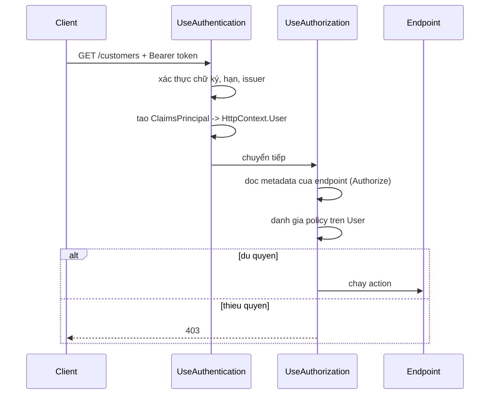

# 10.1 — 1. Authentication so với Authorization

> Nguồn: https://tiennhm.io.vn/en/docs/dotnet-backend-zero-to-senior/stage-03-aspnet-core-backend/module-10-authentication-authorization/10.1-authentication-vs-authorization
> Claim, ClaimsIdentity và ClaimsPrincipal: mô hình danh tính của ASP.NET Core, 401 khác 403 thế nào, và vì sao claim không phải nơi chứa dữ liệu.

> Hai từ hay bị dùng lẫn nhưng trả lời hai câu hỏi khác hẳn: **authentication** hỏi *"bạn là ai"*, **authorization** hỏi *"bạn được làm gì"*. Chúng ánh xạ sang hai mã HTTP khác nhau mà rất nhiều API dùng sai: **401** là "tôi không biết bạn là ai", **403** là "tôi biết bạn là ai và bạn không được phép". Mô hình danh tính trong .NET có ba tầng — **`Claim`** (một mẩu thông tin), **`ClaimsIdentity`** (một tập claim từ một nguồn), **`ClaimsPrincipal`** (một người, có thể có nhiều identity). Và điều hay bị quên nhất: claim nằm trong token, nên **mọi claim bạn thêm vào đều làm mỗi request nặng thêm** và **không cập nhật được cho tới khi token hết hạn**.

## Mục tiêu bài học

Sau bài này bạn có thể:

- Phân biệt authentication và authorization, và trả đúng 401 hay 403.
- Giải thích ba tầng `Claim`, `ClaimsIdentity`, `ClaimsPrincipal`.
- Đọc claim trong controller một cách an toàn.
- Quyết định claim nào nên nằm trong token và claim nào không.
- Hiểu thứ tự `UseAuthentication` và `UseAuthorization` trong pipeline.

## Nội dung bài học

### 10.2.1 — Hai câu hỏi, hai mã trạng thái

| | Authentication | Authorization |
|---|---|---|
| Câu hỏi | "Bạn là ai?" | "Bạn được làm gì?" |
| Chạy khi nào | Mỗi request có token | Sau authentication |
| Kết quả | `ClaimsPrincipal` | Cho phép hoặc từ chối |
| Thất bại trả | **401 Unauthorized** | **403 Forbidden** |
| Client nên làm gì | Đăng nhập lại | Liên hệ quản trị viên |

Cột cuối là lý do phân biệt quan trọng. Nhận 401, client biết **đăng nhập lại** hoặc làm mới token. Nhận 403, client biết đăng nhập lại **không giúp gì** — cần người khác cấp quyền.

Trả 401 cho lỗi phân quyền khiến client rơi vào vòng lặp: làm mới token, thử lại, lại 401, làm mới nữa. Đó là một loại bug rất khó chẩn đoán từ phía server vì mọi thứ trong log trông bình thường.

ASP.NET Core tự phân biệt đúng: `Unauthorized()` cho 401, `Forbid()` cho 403. `[Authorize]` cũng tự chọn đúng — không có token thì 401, có token mà thiếu quyền thì 403.

### 10.2.2 — Luồng đầy đủ



Hai middleware và thứ tự **bắt buộc**:

```csharp
app.UseRouting();
app.UseAuthentication();      // dien HttpContext.User
app.UseAuthorization();       // doc HttpContext.User
app.MapControllers();
```

Đặt ngược lại thì `User` chưa được điền khi phân quyền chạy — mọi người đều vô danh, mọi `[Authorize]` đều từ chối, và **không có lỗi nào được ghi**. Đây là một trong những lỗi thứ tự middleware kinh điển ở [bài 8.3](../module-08-aspnet-core-fundamentals/8.2-request-pipeline-and-middleware.mdx).

Cả hai phải nằm **sau** `UseRouting()`, vì `UseAuthorization()` cần biết endpoint nào sắp chạy để đọc `[Authorize]` trên nó.

### 10.2.3 — Ba tầng danh tính

```csharp
// 1. Claim — MỘT mẩu thông tin: kiểu + giá trị
var email     = new Claim(ClaimTypes.Email, "a.nguyen@crm.com");
var role      = new Claim(ClaimTypes.Role, "SalesRep");
var territory = new Claim("territory", "HCM");          // kiểu tự định nghĩa

// 2. ClaimsIdentity — tập claim từ MỘT nguồn xác thực
var identity = new ClaimsIdentity(
    claims: [email, role, territory],
    authenticationType: "Bearer");        // có giá trị -> IsAuthenticated = true

// 3. ClaimsPrincipal — MỘT NGƯỜI, có thể có nhiều identity
var principal = new ClaimsPrincipal(identity);
```

Chi tiết quan trọng ở dòng `authenticationType`: **`ClaimsIdentity` không có `authenticationType` thì `IsAuthenticated` là `false`**, dù nó có đầy claim. Đây là nguyên nhân của lỗi "tôi đã tạo principal rồi mà vẫn bị 401" khi người ta tự dựng identity trong middleware hoặc trong test.

**Vì sao cần nhiều identity?** Vì một người có thể được xác thực bằng nhiều cách cùng lúc — cookie cho trang web, API key cho tích hợp, chứng chỉ client. Mỗi nguồn cho một `ClaimsIdentity`, và `ClaimsPrincipal` gộp chúng lại. `User.FindFirst()` tìm qua **tất cả** identity.

### 10.2.4 — Đọc claim an toàn

```csharp
[HttpGet("me")]
[Authorize]
public ActionResult<ProfileDto> GetMyProfile()
{
    // FindFirstValue trả null nếu không có — KHÔNG ném
    var userId = User.FindFirstValue(ClaimTypes.NameIdentifier);
    if (userId is null) return Unauthorized();

    var email     = User.FindFirstValue(ClaimTypes.Email);
    var territory = User.FindFirstValue("territory");
    var isAdmin   = User.IsInRole("Admin");
    var perms     = User.FindAll("permission").Select(c => c.Value).ToArray();

    return Ok(new ProfileDto(userId, email, territory, isAdmin, perms));
}
```

Ba cái bẫy khi đọc claim:

**1. `ClaimTypes.NameIdentifier` không phải `"sub"`.** Handler JWT của .NET **ánh xạ lại** tên claim theo mặc định: `sub` thành `ClaimTypes.NameIdentifier` (một URI dài của Microsoft), `role` thành `ClaimTypes.Role`. Nếu bạn tìm `"sub"` thì không thấy gì.

Tắt ánh xạ để dùng đúng tên trong token:

```csharp
JwtSecurityTokenHandler.DefaultInboundClaimTypeMap.Clear();
// hoac
options.MapInboundClaims = false;
```

Chọn một cách và **nhất quán** trong toàn dự án. Trộn lẫn là nguồn lỗi "chỗ này đọc được chỗ kia không".

**2. Claim có thể lặp.** `FindFirstValue` lấy cái đầu tiên; với vai trò hay quyền thì phải dùng `FindAll`.

**3. Giá trị claim luôn là `string`.** Số, boolean, ngày đều phải tự ép kiểu — và tự phòng trường hợp giá trị không hợp lệ.

Gói việc đọc claim sau một service để không rải `FindFirstValue` khắp nơi:

```csharp
public interface ICurrentUser
{
    string Id { get; }
    string? Email { get; }
    bool IsInRole(string role);
}

public sealed class CurrentUser(IHttpContextAccessor accessor) : ICurrentUser
{
    private ClaimsPrincipal User => accessor.HttpContext?.User
        ?? throw new InvalidOperationException("Không có HttpContext");

    public string Id => User.FindFirstValue(ClaimTypes.NameIdentifier)
        ?? throw new UnauthorizedAccessException();

    public string? Email => User.FindFirstValue(ClaimTypes.Email);
    public bool IsInRole(string role) => User.IsInRole(role);
}
```

Lợi ích: nghiệp vụ phụ thuộc vào `ICurrentUser` chứ không vào `HttpContext`, nên test được và dùng lại được từ background job — đúng nguyên tắc ở [bài 7.10](../../stage-02-csharp-professional/module-07-dependency-injection/7.9-anti-patterns.mdx).

### 10.2.5 — Claim nào nên nằm trong token

Claim đi kèm **mọi** request, nên mỗi claim thêm vào là chi phí thật:

```
Token 200 byte  x 1.000 request/giay = 200 KB/giay
Token 2 KB      x 1.000 request/giay = 2 MB/giay
```

Header HTTP còn có giới hạn: Kestrel mặc định 32KB cho tổng header, nhiều proxy đặt 8KB. Token quá lớn cho `431 Request Header Fields Too Large` — một lỗi rất khó đoán nguyên nhân.

| Nên trong token | Không nên |
|---|---|
| `sub` — id người dùng | Tên đầy đủ, ảnh đại diện, số điện thoại |
| `email` — để log và hiển thị | Danh sách 200 quyền chi tiết |
| Vài vai trò | Cấu hình người dùng |
| `exp`, `iss`, `aud` | Bất cứ thứ gì thay đổi thường xuyên |

Lý do thứ hai quan trọng hơn kích thước: **claim là ảnh chụp tại thời điểm đăng nhập**. Thu hồi quyền admin của một người lúc 10:00, nhưng token của họ vẫn ghi `role: Admin` cho tới khi hết hạn. Với access token 15 phút thì chấp nhận được; với token 24 giờ thì đó là lỗ hổng.

Đây chính là lý do access token phải có TTL ngắn và phải có refresh token — [bài 10.4](10.3-refresh-token.mdx). Và với hệ thống quyền chi tiết, tra quyền từ database hoặc cache thay vì nhét vào token — [bài 10.8](10.7-permission-system.mdx).

### 10.2.6 — Rà lại code của bạn

**Danh sách rà soát danh tính**

- [ ] Lỗi thiếu quyền trả 403, không phải 401.
- [ ] UseAuthentication đứng trước UseAuthorization, cả hai sau UseRouting.
- [ ] Mọi ClaimsIdentity tự tạo đều có authenticationType.
- [ ] Chính sách ánh xạ tên claim nhất quán trong toàn dự án.
- [ ] Claim có thể lặp được đọc bằng FindAll, không phải FindFirstValue.
- [ ] Việc đọc claim được gói sau một service, không rải khắp controller.
- [ ] Nghiệp vụ phụ thuộc ICurrentUser, không phụ thuộc HttpContext.
- [ ] Token không chứa dữ liệu hiển thị hay danh sách quyền chi tiết.
- [ ] Kích thước token được đo và nằm dưới giới hạn header của proxy.

## Bài tập áp dụng

#### Bài 1 — Ba lời gọi, ba mã trạng thái

Gọi một endpoint có `[Authorize(Roles = "Admin")]` ba lần: không token, token hợp lệ vai trò `User`, token hợp lệ vai trò `Admin`. Ghi lại ba mã trạng thái.

**Tiêu chí hoàn thành:** bạn nói được `401` và `403` khác nhau ở chỗ nào, và vì sao **thêm token** lại đổi mã từ `401` sang `403`.

Gợi ý và lời giải — Bài 1

**Gợi ý.** Hai mã trả lời hai câu hỏi khác nhau, và chúng được hỏi theo thứ tự.

**Lời giải — ba lời gọi:**

```bash
# 1. Không token
curl -s -o /dev/null -w '%{http_code}\n' https://localhost:5001/api/v1/admin/users

# 2. Token hợp lệ, vai trò User
curl -s -o /dev/null -w '%{http_code}\n' -H "Authorization: Bearer $TOKEN_USER" \
  https://localhost:5001/api/v1/admin/users

# 3. Token hợp lệ, vai trò Admin
curl -s -o /dev/null -w '%{http_code}\n' -H "Authorization: Bearer $TOKEN_ADMIN" \
  https://localhost:5001/api/v1/admin/users
```

```text
401
403
200
```

**Câu trả lời cho tiêu chí:**

| Mã | Câu hỏi bị trả lời "không" | Nghĩa với client |
|---|---|---|
| `401 Unauthorized` | *Bạn là ai?* | "Tôi **không biết** bạn — hãy đăng nhập" |
| `403 Forbidden` | *Bạn được làm gì?* | "Tôi **biết** bạn, và bạn không được phép" |

Thêm token làm mã đổi từ `401` sang `403` vì nó trả lời xong câu hỏi thứ nhất. Hệ thống chuyển từ "chưa biết bạn" sang "biết bạn, nhưng không đủ quyền" — hai trạng thái hoàn toàn khác nhau.

**Vì sao phân biệt đúng lại quan trọng với client:**

```ts
if (res.status === 401) {
  await refreshToken();      // làm mới rồi thử lại — có thể cứu được
  return retry();
}
if (res.status === 403) {
  showMessage('Bạn không có quyền thực hiện thao tác này');   // retry vô ích
}
```

Trả nhầm `401` cho trường hợp thiếu quyền sẽ đẩy client vào **vòng lặp làm mới token vô tận**: nó refresh, gọi lại, vẫn `401`, lại refresh. Người dùng thấy màn hình quay mãi, còn log của bạn đầy request refresh mà không hiểu vì sao.

**Tên `401 Unauthorized` là một lỗi lịch sử trong đặc tả HTTP.** Nó thật ra nghĩa là *unauthenticated*. Đặc tả bù lại bằng cách bắt `401` phải kèm header nói cách xác thực:

```http
HTTP/1.1 401 Unauthorized
WWW-Authenticate: Bearer error="invalid_token", error_description="The token expired"
```

ASP.NET Core tự thêm header này. Nó đáng đọc khi gỡ rối — trường `error_description` nói rõ token hết hạn, sai chữ ký hay sai issuer.

**Một biến thể cố ý trả sai, và khi nào nó hợp lý.** Có hệ thống trả `404` thay cho `403` để không tiết lộ rằng tài nguyên đó tồn tại — đánh đổi giữa bảo mật và khả năng gỡ rối, bàn kỹ ở [bài 10.14](10.13-quick-real-world-example.mdx).

---

#### Bài 2 — Identity đầy claim nhưng vẫn không được xác thực

Tạo `ClaimsIdentity` **không** có `authenticationType`, gán vào `HttpContext.User`, và xác nhận `[Authorize]` vẫn trả `401` dù claim đầy đủ.

**Tiêu chí hoàn thành:** bạn chỉ ra được **thuộc tính nào** quyết định, và vì sao .NET thiết kế như vậy.

Gợi ý và lời giải — Bài 2

**Gợi ý.** Đọc tài liệu của `ClaimsIdentity.IsAuthenticated`. Nó không đếm claim.

**Lời giải — dựng thử:**

```csharp
app.Use(async (ctx, next) =>
{
    var claims = new[]
    {
        new Claim(ClaimTypes.NameIdentifier, "42"),
        new Claim(ClaimTypes.Name, "An"),
        new Claim(ClaimTypes.Role, "Admin"),
    };

    // KHÔNG truyền authenticationType
    ctx.User = new ClaimsPrincipal(new ClaimsIdentity(claims));

    await next(ctx);
});
```

```bash
curl -s -o /dev/null -w '%{http_code}\n' https://localhost:5001/api/v1/admin/users
# 401
```

**Ba claim đầy đủ, có cả vai trò `Admin`, vẫn `401`.**

**Thuộc tính quyết định là `IsAuthenticated`**, và nó được tính bằng một quy tắc duy nhất:

```csharp
public virtual bool IsAuthenticated => !string.IsNullOrEmpty(_authenticationType);
```

Không có `authenticationType` thì `IsAuthenticated == false`, và `[Authorize]` từ chối ngay trước khi nhìn tới bất kỳ claim nào.

**Thêm một chuỗi bất kỳ là qua:**

```csharp
ctx.User = new ClaimsPrincipal(new ClaimsIdentity(claims, authenticationType: "Test"));
```

```text
200
```

**Vì sao .NET thiết kế như vậy.** `ClaimsIdentity` được dùng cho cả những danh tính **chưa** được xác minh — ví dụ thông tin đọc từ một cookie chưa kiểm chữ ký, hay dữ liệu đang dựng dở trong quá trình đăng nhập. Nếu chỉ cần có claim là được coi là đã xác thực, mọi đoạn code lỡ tay dựng một identity tạm sẽ vô tình cấp quyền. Trường `authenticationType` là lời khẳng định tường minh: *"danh tính này đến từ một cơ chế xác thực đã chạy xong"*.

**Đây cũng là bẫy số một khi viết integration test.** Handler xác thực giả rất hay quên tham số này:

```csharp
public class TestAuthHandler(IOptionsMonitor<AuthenticationSchemeOptions> options,
                             ILoggerFactory logger, UrlEncoder encoder)
    : AuthenticationHandler<AuthenticationSchemeOptions>(options, logger, encoder)
{
    protected override Task<AuthenticateResult> HandleAuthenticateAsync()
    {
        var claims = new[] { new Claim(ClaimTypes.NameIdentifier, "42"),
                             new Claim(ClaimTypes.Role, "Admin") };

        var identity = new ClaimsIdentity(claims, "Test");   // <- BẮT BUỘC
        var ticket = new AuthenticationTicket(
            new ClaimsPrincipal(identity), "Test");

        return Task.FromResult(AuthenticateResult.Success(ticket));
    }
}
```

Thiếu chữ `"Test"` ở dòng đó, **mọi** test có `[Authorize]` đều `401`, và thông báo lỗi không hề nhắc tới `authenticationType`. Người ta thường mất khá lâu để tìm ra, vì nhìn vào code thì claim rõ ràng là đủ.

---

#### Bài 3 — Token phình to vượt giới hạn header của proxy

Thêm 200 claim quyền vào token, đo kích thước header, và gọi qua một Nginx có `large_client_header_buffers` mặc định. Ghi lại mã lỗi nhận được.

**Tiêu chí hoàn thành:** bạn giải thích được vì sao lỗi này **không xuất hiện** trên máy phát triển.

Gợi ý và lời giải — Bài 3

**Gợi ý.** Trên máy phát triển, request đi thẳng từ trình duyệt vào Kestrel. Trên production, nó đi qua thêm ít nhất một thứ nữa.

**Lời giải — phát token phình:**

```csharp
var claims = new List<Claim>
{
    new(JwtRegisteredClaimNames.Sub, userId),
    new(JwtRegisteredClaimNames.Email, email),
};

for (int i = 0; i < 200; i++)
    claims.Add(new Claim("permission", $"module{i / 10}.resource{i % 10}.write"));
```

**Đo kích thước:**

```bash
TOKEN=$(curl -s -X POST .../auth/login -d '...' | jq -r .accessToken)
echo -n "$TOKEN" | wc -c
# 9847
```

Header `Authorization` thành `Bearer ` + 9.847 ký tự ≈ **9,6 KB**.

**Gọi qua Nginx mặc định:**

```bash
curl -s -o /dev/null -w '%{http_code}\n' -H "Authorization: Bearer $TOKEN" \
  http://localhost:8080/api/v1/customers
# 431
```

```text
HTTP/1.1 431 Request Header Fields Too Large
```

**Câu trả lời cho tiêu chí — trên máy phát triển không có proxy.** Trình duyệt gọi thẳng `localhost:5001`, và Kestrel cho phép header tới **32 KB** theo mặc định. Token 9,6 KB lọt thoải mái. Chỉ khi lên môi trường có Nginx (mặc định `large_client_header_buffers 4 8k;` — tối đa 8 KB mỗi header) thì nó mới vỡ.

Và nó vỡ **theo người dùng**: chỉ tài khoản có nhiều quyền mới sinh token lớn. Quản trị viên đăng nhập không vào được trong khi mọi người khác bình thường — một triệu chứng rất khó lần ra nếu không biết trước.

**Ba nơi có giới hạn riêng, và bạn phải biết cả ba:**

| Tầng | Mặc định | Cấu hình |
|---|---|---|
| Kestrel | 32 KB | `MaxRequestHeadersTotalSize` |
| Nginx | 8 KB mỗi header | `large_client_header_buffers` |
| CloudFront / ALB | 8–16 KB | Thường **không** đổi được |

Dòng cuối là lý do chính để không đi theo hướng "nới giới hạn": với CDN hoặc load balancer của nhà cung cấp, bạn thường không có quyền đổi.

**Cách sửa đúng — đừng nhét quyền vào token:**

```csharp
// Token chỉ mang danh tính và vai trò thô
new Claim(JwtRegisteredClaimNames.Sub, userId),
new Claim(ClaimTypes.Role, "Manager"),
new Claim("tenant_id", tenantId),
```

```csharp
// Quyền chi tiết nạp theo request, có cache ngắn
public async Task<IReadOnlySet<string>> GetPermissionsAsync(string userId, CancellationToken ct)
    => await _cache.GetOrCreateAsync($"perm:{userId}",
        async e =>
        {
            e.AbsoluteExpirationRelativeToNow = TimeSpan.FromMinutes(5);
            return await _db.LoadPermissionsAsync(userId, ct);
        }, ct) ?? [];
```

**Cách này còn giải quyết luôn một vấn đề khác.** Quyền nằm trong token thì **không thu hồi được** cho tới khi token hết hạn — thu hồi quyền của ai đó lúc 9 giờ mà token còn hạn tới 9 giờ 15 thì họ vẫn dùng được 15 phút. Nạp theo request với cache 5 phút thì độ trễ tối đa là 5 phút, và bạn xoá cache được ngay khi cần. Chi tiết ở [bài 10.8](10.7-permission-system.mdx).

**Quy tắc thực dụng:** giữ token dưới **2 KB**. Vượt quá là dấu hiệu bạn đang dùng token làm nơi lưu trạng thái thay vì làm chứng minh thư.

## Tự kiểm tra

### 401 và 403 khác nhau thế nào?

401 nghĩa là tôi không biết bạn là ai, tức chưa xác thực hoặc token không hợp lệ, và client nên đăng nhập lại. 403 nghĩa là tôi biết bạn là ai nhưng bạn không được phép, và đăng nhập lại không giúp gì. Trả 401 cho lỗi phân quyền khiến client rơi vào vòng lặp làm mới token.

### Ba tầng Claim, ClaimsIdentity và ClaimsPrincipal là gì?

Claim là một mẩu thông tin gồm kiểu và giá trị. ClaimsIdentity là tập claim từ một nguồn xác thực. ClaimsPrincipal là một người, có thể có nhiều identity vì họ được xác thực bằng nhiều cách cùng lúc, ví dụ cookie cho web và API key cho tích hợp.

### Vì sao ClaimsIdentity cần authenticationType?

Vì không có nó thì IsAuthenticated là false dù identity có đầy claim. Đây là nguyên nhân của lỗi đã tạo principal rồi mà vẫn bị 401 khi người ta tự dựng identity trong middleware hoặc trong test.

### Vì sao tìm claim sub lại không thấy gì?

Vì handler JWT của .NET ánh xạ lại tên claim theo mặc định: sub thành ClaimTypes.NameIdentifier là một URI dài của Microsoft, và role thành ClaimTypes.Role. Có thể tắt bằng MapInboundClaims false hoặc xoá DefaultInboundClaimTypeMap, nhưng phải nhất quán trong toàn dự án.

### Vì sao không nên nhét nhiều claim vào token?

Hai lý do. Token đi kèm mọi request nên nó là chi phí băng thông thật, và token quá lớn vượt giới hạn header của proxy sẽ cho lỗi 431. Quan trọng hơn, claim là ảnh chụp tại thời điểm đăng nhập nên thu hồi quyền không có hiệu lực cho tới khi token hết hạn.

### Vì sao nên gói việc đọc claim sau một service?

Để nghiệp vụ phụ thuộc vào một interface như ICurrentUser chứ không vào HttpContext. Nhờ đó nó test được mà không cần dựng HttpContext, và dùng lại được từ background job nơi không có HttpContext nào.

## Kết luận

Ba điều đáng nhớ nhất:

1. **401 là "bạn là ai", 403 là "bạn được làm gì".** Dùng sai đẩy client vào vòng lặp làm mới token.
2. **`UseAuthentication` trước `UseAuthorization`** — đặt ngược thì mọi người vô danh và không có lỗi nào được ghi.
3. **Claim là ảnh chụp lúc đăng nhập.** Giữ token nhỏ và TTL ngắn.

## Tham khảo

- [Overview of ASP.NET Core authentication](https://learn.microsoft.com/en-us/aspnet/core/security/authentication/)
- [Introduction to authorization in ASP.NET Core](https://learn.microsoft.com/en-us/aspnet/core/security/authorization/introduction)
- [Claims-based authorization in ASP.NET Core](https://learn.microsoft.com/en-us/aspnet/core/security/authorization/claims)
- [ClaimsPrincipal class](https://learn.microsoft.com/en-us/dotnet/api/system.security.claims.claimsprincipal)

## Điều hướng

- **Bài trước:** Không có (bài mở đầu module).
- **Bài tiếp theo:** [10.2 — 2. JWT Authentication](10.2-jwt-authentication.mdx)
- **Về module:** [Trang mục lục](./)

## Bài liên quan

- [Đổi id trên URL ra dữ liệu người khác? Chặn IDOR ở một tầng duy nhất](https://tiennhm.io.vn/blog/idor-broken-access-control-aspnet-core) — IDOR xảy ra khi API nhận id từ request rồi đọc thẳng bản ghi mà không hỏi xem người gọi có sở hữu bản ghi đó không.
