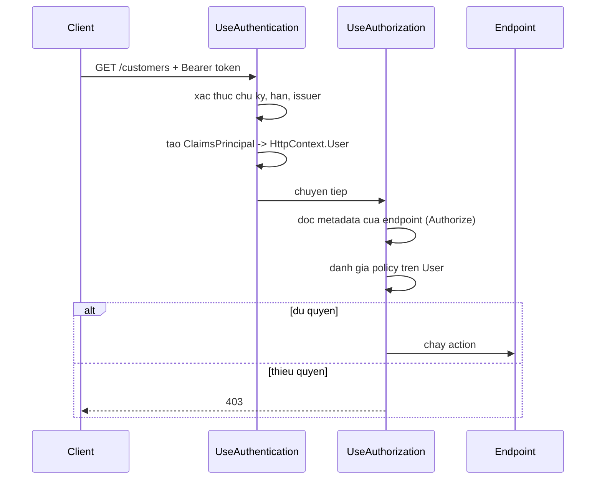

# 10.2 — 1. Authentication so với Authorization

> Nguồn: https://tiennhm.io.vn/en/docs/dotnet-backend-zero-to-senior/stage-03-aspnet-core-backend/module-10-authentication-authorization/10.2-authentication-vs-authorization
> Claim, ClaimsIdentity và ClaimsPrincipal: mô hình danh tính của ASP.NET Core, 401 khác 403 thế nào, và vì sao claim không phải nơi chứa dữ liệu.

> Hai từ hay bị dùng lẫn nhưng trả lời hai câu hỏi khác hẳn: **authentication** hỏi *"bạn là ai"*, **authorization** hỏi *"bạn được làm gì"*. Chúng ánh xạ sang hai mã HTTP khác nhau mà rất nhiều API dùng sai: **401** là "tôi không biết bạn là ai", **403** là "tôi biết bạn là ai và bạn không được phép". Mô hình danh tính trong .NET có ba tầng — **`Claim`** (một mẩu thông tin), **`ClaimsIdentity`** (một tập claim từ một nguồn), **`ClaimsPrincipal`** (một người, có thể có nhiều identity). Và điều hay bị quên nhất: claim nằm trong token, nên **mọi claim bạn thêm vào đều làm mỗi request nặng thêm** và **không cập nhật được cho tới khi token hết hạn**.

## Mục tiêu bài học

Sau bài này bạn có thể:

- Phân biệt authentication và authorization, và trả đúng 401 hay 403.
- Giải thích ba tầng `Claim`, `ClaimsIdentity`, `ClaimsPrincipal`.
- Đọc claim trong controller một cách an toàn.
- Quyết định claim nào nên nằm trong token và claim nào không.
- Hiểu thứ tự `UseAuthentication` và `UseAuthorization` trong pipeline.

## Nội dung bài học

### 10.2.1 — Hai câu hỏi, hai mã trạng thái

| | Authentication | Authorization |
|---|---|---|
| Câu hỏi | "Bạn là ai?" | "Bạn được làm gì?" |
| Chạy khi nào | Mỗi request có token | Sau authentication |
| Kết quả | `ClaimsPrincipal` | Cho phép hoặc từ chối |
| Thất bại trả | **401 Unauthorized** | **403 Forbidden** |
| Client nên làm gì | Đăng nhập lại | Liên hệ quản trị viên |

Cột cuối là lý do phân biệt quan trọng. Nhận 401, client biết **đăng nhập lại** hoặc làm mới token. Nhận 403, client biết đăng nhập lại **không giúp gì** — cần người khác cấp quyền.

Trả 401 cho lỗi phân quyền khiến client rơi vào vòng lặp: làm mới token, thử lại, lại 401, làm mới nữa. Đó là một loại bug rất khó chẩn đoán từ phía server vì mọi thứ trong log trông bình thường.

ASP.NET Core tự phân biệt đúng: `Unauthorized()` cho 401, `Forbid()` cho 403. `[Authorize]` cũng tự chọn đúng — không có token thì 401, có token mà thiếu quyền thì 403.

### 10.2.2 — Luồng đầy đủ



Hai middleware và thứ tự **bắt buộc**:

```csharp
app.UseRouting();
app.UseAuthentication();      // dien HttpContext.User
app.UseAuthorization();       // doc HttpContext.User
app.MapControllers();
```

Đặt ngược lại thì `User` chưa được điền khi phân quyền chạy — mọi người đều vô danh, mọi `[Authorize]` đều từ chối, và **không có lỗi nào được ghi**. Đây là một trong những lỗi thứ tự middleware kinh điển ở [bài 8.3](../module-08-aspnet-core-fundamentals/8.3-request-pipeline-and-middleware.mdx).

Cả hai phải nằm **sau** `UseRouting()`, vì `UseAuthorization()` cần biết endpoint nào sắp chạy để đọc `[Authorize]` trên nó.

### 10.2.3 — Ba tầng danh tính

```csharp
// 1. Claim — MOT mau thong tin: kieu + gia tri
var email     = new Claim(ClaimTypes.Email, "a.nguyen@crm.com");
var role      = new Claim(ClaimTypes.Role, "SalesRep");
var territory = new Claim("territory", "HCM");          // kieu tu dinh nghia

// 2. ClaimsIdentity — tap claim tu MOT nguon xac thuc
var identity = new ClaimsIdentity(
    claims: [email, role, territory],
    authenticationType: "Bearer");        // co gia tri -> IsAuthenticated = true

// 3. ClaimsPrincipal — MOT NGUOI, co the co nhieu identity
var principal = new ClaimsPrincipal(identity);
```

Chi tiết quan trọng ở dòng `authenticationType`: **`ClaimsIdentity` không có `authenticationType` thì `IsAuthenticated` là `false`**, dù nó có đầy claim. Đây là nguyên nhân của lỗi "tôi đã tạo principal rồi mà vẫn bị 401" khi người ta tự dựng identity trong middleware hoặc trong test.

**Vì sao cần nhiều identity?** Vì một người có thể được xác thực bằng nhiều cách cùng lúc — cookie cho trang web, API key cho tích hợp, chứng chỉ client. Mỗi nguồn cho một `ClaimsIdentity`, và `ClaimsPrincipal` gộp chúng lại. `User.FindFirst()` tìm qua **tất cả** identity.

### 10.2.4 — Đọc claim an toàn

```csharp
[HttpGet("me")]
[Authorize]
public ActionResult<ProfileDto> GetMyProfile()
{
    // FindFirstValue tra null neu khong co — KHONG nem
    var userId = User.FindFirstValue(ClaimTypes.NameIdentifier);
    if (userId is null) return Unauthorized();

    var email     = User.FindFirstValue(ClaimTypes.Email);
    var territory = User.FindFirstValue("territory");
    var isAdmin   = User.IsInRole("Admin");
    var perms     = User.FindAll("permission").Select(c => c.Value).ToArray();

    return Ok(new ProfileDto(userId, email, territory, isAdmin, perms));
}
```

Ba cái bẫy khi đọc claim:

**1. `ClaimTypes.NameIdentifier` không phải `"sub"`.** Handler JWT của .NET **ánh xạ lại** tên claim theo mặc định: `sub` thành `ClaimTypes.NameIdentifier` (một URI dài của Microsoft), `role` thành `ClaimTypes.Role`. Nếu bạn tìm `"sub"` thì không thấy gì.

Tắt ánh xạ để dùng đúng tên trong token:

```csharp
JwtSecurityTokenHandler.DefaultInboundClaimTypeMap.Clear();
// hoac
options.MapInboundClaims = false;
```

Chọn một cách và **nhất quán** trong toàn dự án. Trộn lẫn là nguồn lỗi "chỗ này đọc được chỗ kia không".

**2. Claim có thể lặp.** `FindFirstValue` lấy cái đầu tiên; với vai trò hay quyền thì phải dùng `FindAll`.

**3. Giá trị claim luôn là `string`.** Số, boolean, ngày đều phải tự ép kiểu — và tự phòng trường hợp giá trị không hợp lệ.

Gói việc đọc claim sau một service để không rải `FindFirstValue` khắp nơi:

```csharp
public interface ICurrentUser
{
    string Id { get; }
    string? Email { get; }
    bool IsInRole(string role);
}

public sealed class CurrentUser(IHttpContextAccessor accessor) : ICurrentUser
{
    private ClaimsPrincipal User => accessor.HttpContext?.User
        ?? throw new InvalidOperationException("Khong co HttpContext");

    public string Id => User.FindFirstValue(ClaimTypes.NameIdentifier)
        ?? throw new UnauthorizedAccessException();

    public string? Email => User.FindFirstValue(ClaimTypes.Email);
    public bool IsInRole(string role) => User.IsInRole(role);
}
```

Lợi ích: nghiệp vụ phụ thuộc vào `ICurrentUser` chứ không vào `HttpContext`, nên test được và dùng lại được từ background job — đúng nguyên tắc ở [bài 7.10](../../stage-02-csharp-professional/module-07-dependency-injection/7.10-anti-patterns.mdx).

### 10.2.5 — Claim nào nên nằm trong token

Claim đi kèm **mọi** request, nên mỗi claim thêm vào là chi phí thật:

```
Token 200 byte  x 1.000 request/giay = 200 KB/giay
Token 2 KB      x 1.000 request/giay = 2 MB/giay
```

Header HTTP còn có giới hạn: Kestrel mặc định 32KB cho tổng header, nhiều proxy đặt 8KB. Token quá lớn cho `431 Request Header Fields Too Large` — một lỗi rất khó đoán nguyên nhân.

| Nên trong token | Không nên |
|---|---|
| `sub` — id người dùng | Tên đầy đủ, ảnh đại diện, số điện thoại |
| `email` — để log và hiển thị | Danh sách 200 quyền chi tiết |
| Vài vai trò | Cấu hình người dùng |
| `exp`, `iss`, `aud` | Bất cứ thứ gì thay đổi thường xuyên |

Lý do thứ hai quan trọng hơn kích thước: **claim là ảnh chụp tại thời điểm đăng nhập**. Thu hồi quyền admin của một người lúc 10:00, nhưng token của họ vẫn ghi `role: Admin` cho tới khi hết hạn. Với access token 15 phút thì chấp nhận được; với token 24 giờ thì đó là lỗ hổng.

Đây chính là lý do access token phải có TTL ngắn và phải có refresh token — [bài 10.4](10.4-refresh-token.mdx). Và với hệ thống quyền chi tiết, tra quyền từ database hoặc cache thay vì nhét vào token — [bài 10.8](10.8-permission-system.mdx).

### 10.2.6 — Rà lại code của bạn

**Danh sách rà soát danh tính**

- [ ] Lỗi thiếu quyền trả 403, không phải 401.
- [ ] UseAuthentication đứng trước UseAuthorization, cả hai sau UseRouting.
- [ ] Mọi ClaimsIdentity tự tạo đều có authenticationType.
- [ ] Chính sách ánh xạ tên claim nhất quán trong toàn dự án.
- [ ] Claim có thể lặp được đọc bằng FindAll, không phải FindFirstValue.
- [ ] Việc đọc claim được gói sau một service, không rải khắp controller.
- [ ] Nghiệp vụ phụ thuộc ICurrentUser, không phụ thuộc HttpContext.
- [ ] Token không chứa dữ liệu hiển thị hay danh sách quyền chi tiết.
- [ ] Kích thước token được đo và nằm dưới giới hạn header của proxy.

## Bài tập áp dụng

1. **401 và 403.** Gọi một endpoint có `[Authorize(Roles = "Admin")]` ba lần: không token, token hợp lệ vai trò `User`, token hợp lệ vai trò `Admin`. Ghi lại ba mã trạng thái.

2. **Identity không xác thực.** Tạo `ClaimsIdentity` **không** có `authenticationType`, gán vào `HttpContext.User`, và xác nhận `[Authorize]` vẫn trả 401 dù claim đầy đủ.

3. **Token phình to.** Thêm 200 claim quyền vào token, đo kích thước header, và gọi qua một Nginx có `large_client_header_buffers` mặc định. Ghi lại mã lỗi nhận được.

## Tự kiểm tra

### 401 và 403 khác nhau thế nào?

401 nghĩa là tôi không biết bạn là ai, tức chưa xác thực hoặc token không hợp lệ, và client nên đăng nhập lại. 403 nghĩa là tôi biết bạn là ai nhưng bạn không được phép, và đăng nhập lại không giúp gì. Trả 401 cho lỗi phân quyền khiến client rơi vào vòng lặp làm mới token.

### Ba tầng Claim, ClaimsIdentity và ClaimsPrincipal là gì?

Claim là một mẩu thông tin gồm kiểu và giá trị. ClaimsIdentity là tập claim từ một nguồn xác thực. ClaimsPrincipal là một người, có thể có nhiều identity vì họ được xác thực bằng nhiều cách cùng lúc, ví dụ cookie cho web và API key cho tích hợp.

### Vì sao ClaimsIdentity cần authenticationType?

Vì không có nó thì IsAuthenticated là false dù identity có đầy claim. Đây là nguyên nhân của lỗi đã tạo principal rồi mà vẫn bị 401 khi người ta tự dựng identity trong middleware hoặc trong test.

### Vì sao tìm claim sub lại không thấy gì?

Vì handler JWT của .NET ánh xạ lại tên claim theo mặc định: sub thành ClaimTypes.NameIdentifier là một URI dài của Microsoft, và role thành ClaimTypes.Role. Có thể tắt bằng MapInboundClaims false hoặc xoá DefaultInboundClaimTypeMap, nhưng phải nhất quán trong toàn dự án.

### Vì sao không nên nhét nhiều claim vào token?

Hai lý do. Token đi kèm mọi request nên nó là chi phí băng thông thật, và token quá lớn vượt giới hạn header của proxy sẽ cho lỗi 431. Quan trọng hơn, claim là ảnh chụp tại thời điểm đăng nhập nên thu hồi quyền không có hiệu lực cho tới khi token hết hạn.

### Vì sao nên gói việc đọc claim sau một service?

Để nghiệp vụ phụ thuộc vào một interface như ICurrentUser chứ không vào HttpContext. Nhờ đó nó test được mà không cần dựng HttpContext, và dùng lại được từ background job nơi không có HttpContext nào.

## Kết luận

Ba điều đáng nhớ nhất:

1. **401 là "bạn là ai", 403 là "bạn được làm gì".** Dùng sai đẩy client vào vòng lặp làm mới token.
2. **`UseAuthentication` trước `UseAuthorization`** — đặt ngược thì mọi người vô danh và không có lỗi nào được ghi.
3. **Claim là ảnh chụp lúc đăng nhập.** Giữ token nhỏ và TTL ngắn.

## Tham khảo

- [Overview of ASP.NET Core authentication](https://learn.microsoft.com/en-us/aspnet/core/security/authentication/)
- [Introduction to authorization in ASP.NET Core](https://learn.microsoft.com/en-us/aspnet/core/security/authorization/introduction)
- [Claims-based authorization in ASP.NET Core](https://learn.microsoft.com/en-us/aspnet/core/security/authorization/claims)
- [ClaimsPrincipal class](https://learn.microsoft.com/en-us/dotnet/api/system.security.claims.claimsprincipal)

## Điều hướng

- **Bài trước:** Không có (bài mở đầu module).
- **Bài tiếp theo:** [10.3 — 2. JWT Authentication](10.3-jwt-authentication.mdx)
- **Về module:** [Trang mục lục](./)

## Bài liên quan

- [Đổi id trên URL ra dữ liệu người khác? Chặn IDOR ở một tầng duy nhất](https://tiennhm.io.vn/blog/idor-broken-access-control-aspnet-core) — IDOR xảy ra khi API nhận id từ request rồi đọc thẳng bản ghi mà không hỏi xem người gọi có sở hữu bản ghi đó không.
