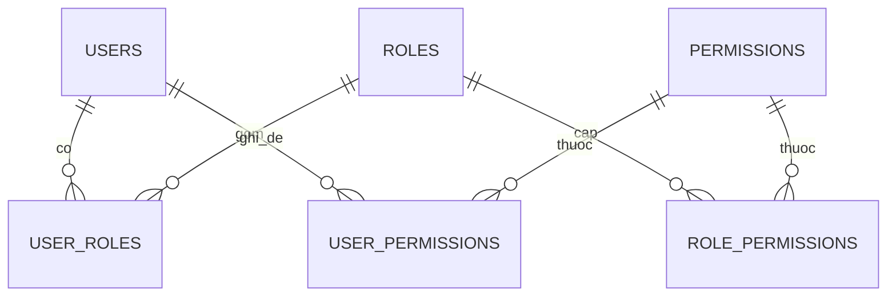

# 10.7 — 7. Permission System

> Nguồn: https://tiennhm.io.vn/en/docs/dotnet-backend-zero-to-senior/stage-03-aspnet-core-backend/module-10-authentication-authorization/10.7-permission-system
> Quyền chi tiết: vì sao bitmask hết chỗ ở quyền thứ 65, mô hình role-permission, cache quyền, và vì sao không nên nhét quyền vào token.

> Vai trò trả lời *"bạn là ai"*; permission trả lời *"bạn được làm gì"* ở mức từng hành động: `customer.delete`, `deal.approve`. Cách cài phổ biến nhất trong các bài hướng dẫn là **bitmask `[Flags] enum`** — gọn và nhanh, nhưng nó **hết chỗ ở quyền thứ 65** (`long` chỉ có 64 bit), **không thêm quyền động được**, và giá trị trong database **vô nghĩa khi đọc**. Với bất kỳ hệ thống nào sẽ lớn lên, hãy dùng **chuỗi có cấu trúc** và bảng quan hệ. Quyết định thiết kế quan trọng thứ hai: **đừng nhét danh sách quyền vào token** — 200 quyền làm token phình lên vài KB và không thu hồi được; hãy tra từ cache.

## Mục tiêu bài học

Sau bài này bạn có thể:

- Đặt tên quyền theo cấu trúc nhất quán.
- Thiết kế mô hình role–permission với ghi đè theo người dùng.
- Chọn đúng giữa quyền trong token và quyền tra từ cache.
- Cache quyền và xoá cache khi có thay đổi.
- Giải thích vì sao bitmask không mở rộng được.

## Nội dung bài học

### 10.8.1 — Vì sao bitmask không đủ

```csharp
[Flags]
public enum Permission : long
{
    CustomerRead   = 1 << 0,
    CustomerCreate = 1 << 1,
    // ...
    Permission64   = 1L << 63,
    // Permission65 = ???        <- HET CHO
}
```

| Vấn đề | Chi tiết |
|---|---|
| **Trần 64 quyền** | `long` có 64 bit. Hệ thống CRM thật dễ vượt |
| **Không thêm động** | Thêm quyền phải sửa code và deploy lại |
| **Khó đọc** | Giá trị `8796093022215` trong database không nói lên gì |
| **Khó truy vấn** | "Ai có quyền `deal.approve`?" cần phép AND bit, không dùng được index |
| **Dễ sai khi đổi thứ tự** | Chèn một giá trị vào giữa là dịch toàn bộ bit phía sau — mọi bản ghi cũ sai |

Dòng cuối là rủi ro thật sự: một lập trình viên chèn `CustomerExport = 1 << 2` vào giữa enum, và **toàn bộ quyền đã lưu trong database** bị hiểu sai.

Bitmask chỉ hợp khi tập quyền **nhỏ, cố định, và không bao giờ đổi thứ tự** — ví dụ cờ nội bộ của một thư viện.

### 10.8.2 — Chuỗi có cấu trúc

```csharp
public static class Permissions
{
    public static class Customers
    {
        public const string View   = "customers.view";
        public const string Create = "customers.create";
        public const string Update = "customers.update";
        public const string Delete = "customers.delete";
        public const string Export = "customers.export";
    }

    public static class Deals
    {
        public const string View    = "deals.view";
        public const string Approve = "deals.approve";
    }

    public static IReadOnlyList<string> All { get; } = typeof(Permissions)
        .GetNestedTypes()
        .SelectMany(t => t.GetFields(BindingFlags.Public | BindingFlags.Static))
        .Select(f => (string)f.GetValue(null)!)
        .ToList();
}
```

Quy ước `{tài nguyên}.{hành động}` giữ mọi thứ nhất quán và cho phép mở rộng: thêm quyền là thêm một hằng số và một dòng trong bảng, không cần deploy lại logic phân quyền.

`All` sinh bằng reflection phục vụ hai việc: seed database và màn hình quản trị phân quyền.

### 10.8.3 — Mô hình dữ liệu



```sql
CREATE TABLE Permissions (
    Name        NVARCHAR(100) PRIMARY KEY,     -- "customers.delete"
    DisplayName NVARCHAR(200) NOT NULL,        -- "Xoá khách hàng"
    Category    NVARCHAR(50)  NOT NULL         -- "Customers"
);

CREATE TABLE RolePermissions (
    RoleId         NVARCHAR(450) NOT NULL,
    PermissionName NVARCHAR(100) NOT NULL,
    PRIMARY KEY (RoleId, PermissionName)
);

CREATE TABLE UserPermissions (
    UserId         NVARCHAR(450) NOT NULL,
    PermissionName NVARCHAR(100) NOT NULL,
    IsGranted      BIT NOT NULL,              -- TRUE = them, FALSE = go bo
    ExpiresAt      DATETIME2 NULL,            -- uy quyen tam thoi
    PRIMARY KEY (UserId, PermissionName)
);
```

`UserPermissions` với cột `IsGranted` cho phép **hai chiều**: cấp thêm quyền ngoài vai trò, hoặc **gỡ bỏ** một quyền mà vai trò có. Đây là nhu cầu thật — "chị An là Manager nhưng không được xoá khách hàng" — và không mô hình hoá được bằng vai trò.

`ExpiresAt` phục vụ uỷ quyền tạm thời khi ai đó nghỉ phép, và tự hết hiệu lực nên không ai quên gỡ.

Thứ tự áp dụng: **quyền từ vai trò**, rồi **cộng** quyền được cấp riêng, rồi **trừ** quyền bị gỡ riêng. Quyền bị gỡ thắng — mặc định an toàn.

### 10.8.4 — Quyền trong token hay tra từ cache

| | Trong token | Tra từ cache |
|---|---|---|
| Tốc độ kiểm tra | Tức thì | Rất nhanh (cache hit) |
| Kích thước token | **Phình theo số quyền** | Không đổi |
| Thu hồi | **Tới khi token hết hạn** | **Ngay lập tức** |
| Phụ thuộc hạ tầng | Không | Redis hoặc bộ nhớ |

Với dưới 10 quyền, đặt vào token là hợp lý. Với hàng chục quyền trở lên thì không:

```
200 quyen x ~20 byte = 4 KB chi rieng phan quyen
+ Base64 => ~5,3 KB
=> Vượt giới hạn header 8 KB của nhiều proxy
=> 431 Request Header Fields Too Large
```

Và vấn đề lớn hơn kích thước: **gỡ quyền không có hiệu lực** cho tới khi token hết hạn ([bài 10.2](10.1-authentication-vs-authorization.mdx)).

```csharp
public sealed class PermissionService(
    AppDbContext db, IMemoryCache cache) : IPermissionService
{
    private static string Key(string userId) => $"perm:{userId}";

    public async Task<IReadOnlySet<string>> GetAsync(string userId, CancellationToken ct)
    {
        if (cache.TryGetValue(Key(userId), out IReadOnlySet<string>? cached))
            return cached!;

        var fromRoles = await db.UserRoles
            .Where(ur => ur.UserId == userId)
            .Join(db.RolePermissions, ur => ur.RoleId, rp => rp.RoleId, (_, rp) => rp.PermissionName)
            .ToListAsync(ct);

        var overrides = await db.UserPermissions
            .Where(up => up.UserId == userId
                      && (up.ExpiresAt == null || up.ExpiresAt > DateTime.UtcNow))
            .ToListAsync(ct);

        var result = fromRoles.ToHashSet();
        foreach (var o in overrides)
        {
            if (o.IsGranted) result.Add(o.PermissionName);
            else             result.Remove(o.PermissionName);     // go bo THANG
        }

        cache.Set(Key(userId), (IReadOnlySet<string>)result, TimeSpan.FromMinutes(5));
        return result;
    }

    public Task InvalidateAsync(string userId)
    {
        cache.Remove(Key(userId));
        return Task.CompletedTask;
    }
}
```

**Xoá cache trong mọi đường thay đổi quyền:** gán/gỡ vai trò, sửa quyền của vai trò (ảnh hưởng **mọi** người dùng vai trò đó), cấp/gỡ quyền riêng, khoá tài khoản. Sót một chỗ là quyền cũ còn hiệu lực tới 5 phút.

Với nhiều instance, `IMemoryCache` chỉ xoá trên **một** pod. Dùng `IDistributedCache` với Redis, hoặc `HybridCache` của .NET 9 — xem [Module 14](../../stage-04-database-production/module-14-caching-background-jobs/).

TTL 5 phút là trần rủi ro: kể cả khi bạn quên xoá cache ở đâu đó, quyền cũ chỉ sống thêm tối đa 5 phút.

### 10.8.5 — Handler và attribute

```csharp
public sealed class PermissionRequirement(string permission) : IAuthorizationRequirement
{
    public string Permission { get; } = permission;
}

public sealed class PermissionHandler(IPermissionService permissions)
    : AuthorizationHandler<PermissionRequirement>
{
    protected override async Task HandleRequirementAsync(
        AuthorizationHandlerContext context, PermissionRequirement requirement)
    {
        var userId = context.User.FindFirstValue(ClaimTypes.NameIdentifier);
        if (userId is null) return;

        var granted = await permissions.GetAsync(userId, CancellationToken.None);

        if (granted.Contains(requirement.Permission))
            context.Succeed(requirement);
    }
}

// Scoped vi no dung IPermissionService co DbContext
builder.Services.AddScoped<IAuthorizationHandler, PermissionHandler>();
```

```csharp
public sealed class RequirePermissionAttribute(string permission)
    : AuthorizeAttribute($"Permission:{permission}");

[RequirePermission(Permissions.Customers.Delete)]
[HttpDelete("{id:guid}")]
public Task<IActionResult> Delete(Guid id, CancellationToken ct);
```

Kết hợp với `PermissionPolicyProvider` ở [bài 10.6](10.5-policy-based-authorization.mdx), bạn có một hệ thống mà **gõ sai tên quyền là lỗi biên dịch**.

### 10.8.6 — Đừng quên phía client

API đã chặn đúng, nhưng giao diện hiển thị nút "Xoá" cho người không có quyền là trải nghiệm tệ — người dùng bấm và nhận lỗi.

```csharp
[HttpGet("me/permissions")]
[Authorize]
public async Task<ActionResult<IEnumerable<string>>> GetMyPermissions(CancellationToken ct)
    => Ok(await _permissions.GetAsync(_currentUser.Id, ct));
```

Client gọi một lần sau đăng nhập và ẩn những gì không được phép.

> **Warning: Ẩn nút không phải bảo mật**
>
> Client ẩn nút chỉ là trải nghiệm. **Server vẫn phải kiểm tra mọi request** — client có thể bị sửa, và API gọi trực tiếp được.
### 10.8.7 — Rà lại code của bạn

**Danh sách rà soát hệ thống quyền**

- [ ] Quyền là chuỗi có cấu trúc, không phải bitmask enum.
- [ ] Tên quyền dùng hằng số, gõ sai là lỗi biên dịch.
- [ ] Mô hình hỗ trợ cả cấp thêm lẫn gỡ bỏ quyền ở mức người dùng.
- [ ] Quyền bị gỡ thắng quyền được cấp từ vai trò.
- [ ] Quyền không nằm trong token nếu số lượng lớn.
- [ ] Quyền được cache với TTL làm trần rủi ro.
- [ ] Cache bị xoá trong MỌI đường thay đổi quyền, kể cả sửa quyền của vai trò.
- [ ] Nhiều instance thì dùng cache phân tán, không phải IMemoryCache.
- [ ] Có endpoint trả quyền của người dùng cho client ẩn nút.
- [ ] Server vẫn kiểm tra quyền cho mọi request, không tin client.

## Bài tập áp dụng

#### Bài 1 — Bitmask hết chỗ, và tệ hơn: chèn vào giữa

Tạo `[Flags] enum` với 64 quyền và thử thêm quyền thứ 65. Sau đó chèn một quyền vào **giữa** enum và quan sát giá trị đã lưu trong database bị hiểu sai thế nào.

**Tiêu chí hoàn thành:** bạn chỉ ra được **hai** vấn đề độc lập, và nói được cái nào nguy hiểm hơn.

Gợi ý và lời giải — Bài 1

**Gợi ý.** Vấn đề thứ nhất làm code **không biên dịch được**. Vấn đề thứ hai thì biên dịch sạch.

**Lời giải — vấn đề 1: hết bit.**

```csharp
[Flags]
public enum Permission : long
{
    None            = 0,
    CustomerView    = 1L << 0,
    CustomerCreate  = 1L << 1,
    // ...
    ReportExport    = 1L << 63,        // bit cuối cùng
    SomethingNew    = 1L << 64,        // ???
}
```

```text
error CS0221: Constant value '0' cannot be converted to a 'long'
```

`1L << 64` tràn về `0`, nên quyền mới **bằng `None`** — và `HasFlag` luôn trả `true` cho nó. Trình biên dịch chặn được ca này, nhưng chỉ vì bạn viết tường minh; nếu tính bằng vòng lặp thì nó lọt.

**64 quyền nghe nhiều, nhưng hết rất nhanh:** 8 thực thể × 5 thao tác (xem, tạo, sửa, xoá, xuất) đã là 40. Thêm module thứ chín là chạm trần.

**Vấn đề 2: chèn vào giữa — và đây mới là cái nguy hiểm.**

```csharp
// Trước
CustomerView    = 1L << 0,
CustomerCreate  = 1L << 1,
CustomerDelete  = 1L << 2,

// Sau — chèn CustomerEdit vào giữa cho "gọn"
CustomerView    = 1L << 0,
CustomerEdit    = 1L << 1,        // <- MỚI
CustomerCreate  = 1L << 2,        // đẩy xuống
CustomerDelete  = 1L << 3,        // đẩy xuống
```

**Biên dịch sạch. Không cảnh báo nào.**

Nhưng database đang lưu **số**, không lưu tên:

```sql
SELECT UserId, Permissions FROM UserPermissions WHERE UserId = '8f3a...';
-- 6
```

| | `6` nghĩa là | |
|---|---|---|
| **Trước** khi chèn | `1L<<1 \| 1L<<2` | CustomerCreate + CustomerDelete |
| **Sau** khi chèn | `1L<<1 \| 1L<<2` | CustomerEdit + **CustomerCreate** |

Người dùng **mất quyền xoá** và **được thêm quyền sửa** — không ai yêu cầu, không ai biết. Với vài nghìn bản ghi quyền, đó là một đợt cấp phát lại quyền im lặng trên toàn hệ thống.

**Câu trả lời cho tiêu chí:** vấn đề 2 nguy hiểm hơn hẳn, vì vấn đề 1 chặn bạn ở lúc biên dịch còn vấn đề 2 thì lặng lẽ **đổi nghĩa dữ liệu đã lưu**. Đây đúng loại "đổi ý nghĩa mà không đổi hình dạng" ở [bài 9.3](../module-09-web-api-professional/9.2-api-versioning.mdx), chỉ khác là xảy ra với database thay vì với API.

**Cách làm đúng — lưu mã chuỗi, không lưu bit:**

```sql
CREATE TABLE Permissions (
    Code        VARCHAR(100) NOT NULL PRIMARY KEY,   -- 'customer.delete'
    DisplayName NVARCHAR(200) NOT NULL
);

CREATE TABLE RolePermissions (
    RoleId         UNIQUEIDENTIFIER NOT NULL,
    PermissionCode VARCHAR(100)     NOT NULL,
    PRIMARY KEY (RoleId, PermissionCode),
    FOREIGN KEY (PermissionCode) REFERENCES Permissions(Code)
);
```

Ba thứ tốt lên cùng lúc: không có trần số lượng, thứ tự khai báo không còn ý nghĩa, và `SELECT` trả về thứ **đọc được**:

```sql
SELECT PermissionCode FROM RolePermissions WHERE RoleId = '...';
-- customer.view
-- customer.create
```

**Khi nào bitmask vẫn hợp lý:** tập quyền **nhỏ, cố định, không bao giờ chèn giữa** — ví dụ cờ đọc/ghi/thực thi trên một tài nguyên. Ngoài ra thì bảng quan hệ luôn là lựa chọn an toàn hơn.

---

#### Bài 2 — Nhét quyền vào token và gặp giới hạn header

Thêm 200 quyền vào JWT, đo kích thước token và header, rồi gọi qua Nginx với cấu hình mặc định. Ghi lại mã lỗi.

**Tiêu chí hoàn thành:** ngoài kích thước, bạn nêu được **vấn đề thứ hai** của việc đặt quyền trong token — vấn đề vẫn còn kể cả khi token nhỏ.

Gợi ý và lời giải — Bài 2

**Gợi ý.** Token đã ký thì không sửa được. Hỏi: gỡ quyền của một người lúc 9 giờ thì họ mất quyền lúc mấy giờ?

**Lời giải — kích thước:**

```csharp
foreach (var code in permissions)              // 200 mã
    claims.Add(new Claim("permission", code));
```

```bash
echo -n "$TOKEN" | wc -c
# 9847
```

Header `Authorization` ≈ **9,6 KB**, vượt mặc định 8 KB của Nginx:

```text
HTTP/1.1 431 Request Header Fields Too Large
```

Và nó vỡ **theo người dùng**: chỉ tài khoản nhiều quyền mới sinh token lớn, nên quản trị viên không đăng nhập được trong khi người khác bình thường.

**Vấn đề thứ hai — quyền trong token không thu hồi được.**

```text
09:00  Gỡ quyền customer.delete của An
09:00  Token của An VẪN chứa claim đó
09:14  An gọi DELETE /customers/42 -> THÀNH CÔNG
09:15  Token hết hạn, refresh, quyền mới có hiệu lực
```

Cửa sổ 15 phút này tồn tại **kể cả khi token chỉ có 3 quyền**. Thu nhỏ token không sửa được nó.

Và nếu endpoint `/refresh` không kiểm tra lại quyền — lỗi ở [bài 10.13](10.12-mini-case-study.mdx) — thì cửa sổ thành **vô hạn**.

**Cách đúng: token mang danh tính, quyền nạp theo request.**

```csharp
// Token — nhỏ và ổn định
new Claim(JwtRegisteredClaimNames.Sub, userId),
new Claim(ClaimTypes.Role, "Manager"),
new Claim("tenant_id", tenantId),
```

```csharp
public sealed class PermissionHandler(IPermissionService permissions)
    : AuthorizationHandler<PermissionRequirement>
{
    protected override async Task HandleRequirementAsync(
        AuthorizationHandlerContext ctx, PermissionRequirement req)
    {
        var userId = ctx.User.FindFirstValue(ClaimTypes.NameIdentifier);
        if (userId is null) return;

        var granted = await permissions.GetForUserAsync(userId);
        if (granted.Contains(req.Permission)) ctx.Succeed(req);
    }
}
```

**Và cache để không chạm database mỗi request:**

```csharp
public Task<IReadOnlySet<string>> GetForUserAsync(string userId) =>
    _cache.GetOrCreateAsync($"perm:user:{userId}", async e =>
    {
        e.AbsoluteExpirationRelativeToNow = TimeSpan.FromMinutes(5);
        return await LoadFromDatabaseAsync(userId);
    })!;
```

**Bảng so sánh:**

| | Quyền trong token | Quyền nạp theo request |
|---|---|---|
| Kích thước header | Tăng theo số quyền | **Cố định** |
| Độ trễ thu hồi | Tới khi token hết hạn | **Tới khi cache hết hạn** |
| Chạm database | 0 | 1 lần mỗi 5 phút mỗi người |
| Thu hồi tức thì | **Không làm được** | Xoá cache là xong |

Chi phí thêm là một lần đọc cache — vài chục micro-giây. Đổi lại là kiểm soát thật sự. Cái bẫy còn lại của cách này nằm ở bài 3.

---

#### Bài 3 — Xoá cache theo người dùng là chưa đủ

Cài cache quyền TTL 5 phút, gỡ một quyền của **vai trò** (không phải của người dùng), và đo bao lâu người dùng mới thật sự mất quyền. Thêm xoá cache theo vai trò và kiểm chứng lại.

**Tiêu chí hoàn thành:** bạn nêu được vì sao xoá cache theo `userId` không giải quyết được trường hợp này, và chọn được cách xử lý phù hợp với quy mô hệ thống mình.

Gợi ý và lời giải — Bài 3

**Gợi ý.** Khoá cache là `perm:user:{userId}`. Khi bạn sửa một **vai trò**, bạn không biết trước những userId nào bị ảnh hưởng.

**Lời giải — đo với cache theo người dùng:**

```sql
DELETE FROM RolePermissions WHERE RoleId = '...' AND PermissionCode = 'customer.delete';
```

```bash
for i in $(seq 1 40); do
  code=$(curl -s -o /dev/null -w '%{http_code}' -X DELETE \
    -H "Authorization: Bearer $TOKEN" .../customers/42)
  echo "$(date +%T) $code"
  sleep 15
done
```

```text
09:00:00 204
09:00:15 204
...
09:04:45 204
09:05:00 403      <- mất quyền sau 5 phút
```

**Đúng bằng TTL.** Việc xoá cache khi "quyền của người dùng thay đổi" không chạy, vì bạn sửa vai trò chứ không sửa người dùng.

**Vì sao khó.** Quan hệ là `vai trò -> nhiều người dùng`, nhưng khoá cache lại theo người dùng. Muốn xoá đúng, bạn phải **duyệt ngược**: tìm mọi người có vai trò đó rồi xoá từng khoá. Với vai trò `Employee` có 5.000 người, đó là 5.000 lệnh `Remove` — và bạn vẫn có thể bỏ sót người vừa được gán vai trò trong lúc đang duyệt.

**Ba cách xử lý, chọn theo quy mô:**

**1. Khoá theo phiên bản vai trò — gọn nhất, không cần duyệt.**

```csharp
var version = await _cache.GetStringAsync($"role-version:{roleId}") ?? "0";
var key = $"perm:user:{userId}:rv{version}";
```

```csharp
// Khi sửa quyền của vai trò — chỉ MỘT lệnh
await _cache.SetStringAsync($"role-version:{roleId}",
    (int.Parse(version) + 1).ToString());
```

Tăng số phiên bản là mọi khoá cũ trở thành mồ côi và hết hạn tự nhiên theo TTL. Không cần tìm ai bị ảnh hưởng.

**2. Xoá theo tag với `HybridCache` (.NET 9).**

```csharp
await _hybridCache.GetOrCreateAsync(
    $"perm:user:{userId}",
    factory,
    tags: [$"role:{roleId}"]);

await _hybridCache.RemoveByTagAsync($"role:{roleId}", ct);
```

Rõ ràng hơn cách 1, nhưng cần `HybridCache` — xem [bài 14.6](../../stage-04-database-production/module-14-caching-background-jobs/14.5-hybridcache-dotnet-9.mdx).

**3. Chấp nhận TTL ngắn.** Hạ TTL xuống 30 giây và không xoá gì cả. Đơn giản nhất, đổi lại là tải database tăng 10 lần. Hợp lý khi hệ thống nhỏ và quyền hiếm khi đổi.

**Một cái bẫy nữa: cache cục bộ trên nhiều pod.**

`IMemoryCache` sống **trong tiến trình**. Xoá cache trên pod A không ảnh hưởng pod B và C:

```text
10:00  Admin gỡ quyền, request rơi vào pod A -> pod A xoá cache
10:01  Người dùng gọi API, request rơi vào pod B -> VẪN CÒN QUYỀN
```

Với nhiều instance, cache quyền phải nằm ở Redis, hoặc bạn phải phát một thông báo để mọi pod cùng xoá — vấn đề và cách giải ở [bài 14.5](../../stage-04-database-production/module-14-caching-background-jobs/14.4-cache-invalidation-strategies.mdx).

**Khuyến nghị theo quy mô:**

| Quy mô | Cách chọn |
|---|---|
| Một instance, ít người dùng | TTL 30 giây, không xoá |
| Nhiều instance | Redis + khoá theo phiên bản vai trò |
| Yêu cầu thu hồi tức thì | Redis + `RemoveByTag`, TTL ngắn làm lưới an toàn |

## Tự kiểm tra

### Vì sao bitmask enum không mở rộng được?

Vì long chỉ có 64 bit nên hết chỗ ở quyền thứ 65, không thêm quyền động được mà phải sửa code và deploy, giá trị trong database không đọc được, và truy vấn ai có quyền này cần phép AND bit nên không dùng được index. Nguy hiểm nhất là chèn một giá trị vào giữa enum sẽ dịch toàn bộ bit phía sau và làm mọi bản ghi cũ bị hiểu sai.

### Nên đặt tên quyền thế nào?

Theo quy ước tài nguyên chấm hành động, ví dụ customers.delete hay deals.approve, và khai bằng hằng số trong các lớp lồng nhau. Nhờ đó gõ sai là lỗi biên dịch, và thêm quyền chỉ cần thêm một hằng số cùng một dòng trong bảng.

### Vì sao cần cột IsGranted ở bảng quyền người dùng?

Để hỗ trợ cả hai chiều: cấp thêm quyền ngoài vai trò và gỡ bỏ một quyền mà vai trò có. Nhu cầu kiểu chị An là Manager nhưng không được xoá khách hàng không mô hình hoá được bằng vai trò. Thứ tự áp dụng là quyền từ vai trò, cộng quyền cấp riêng, rồi trừ quyền bị gỡ; quyền bị gỡ thắng.

### Có nên nhét danh sách quyền vào token không?

Chỉ khi số quyền nhỏ, dưới khoảng 10. Với hàng trăm quyền thì token phình lên vài KB và vượt giới hạn header của nhiều proxy, gây lỗi 431. Quan trọng hơn là gỡ quyền không có hiệu lực cho tới khi token hết hạn.

### Cache quyền cần lưu ý gì?

Phải xoá cache trong mọi đường thay đổi quyền, gồm gán và gỡ vai trò, sửa quyền của vai trò ảnh hưởng mọi người dùng vai trò đó, cấp và gỡ quyền riêng, và khoá tài khoản. TTL ngắn như 5 phút đóng vai trò trần rủi ro khi bạn quên một chỗ. Với nhiều instance thì IMemoryCache chỉ xoá trên một pod nên cần cache phân tán.

### Client ẩn nút theo quyền có phải bảo mật không?

Không, đó chỉ là trải nghiệm người dùng để họ không bấm vào thứ sẽ báo lỗi. Client có thể bị sửa và API gọi trực tiếp được, nên server vẫn phải kiểm tra quyền cho mọi request.

## Kết luận

Ba điều đáng nhớ nhất:

1. **Bitmask hết chỗ ở quyền thứ 65** và chèn giá trị vào giữa làm hỏng dữ liệu cũ.
2. **Quyền chi tiết không thuộc về token.** Tra từ cache để thu hồi có hiệu lực ngay.
3. **Xoá cache trong mọi đường thay đổi quyền** — và TTL ngắn là lưới an toàn khi bạn quên.

## Tham khảo

- [Claims-based authorization in ASP.NET Core](https://learn.microsoft.com/en-us/aspnet/core/security/authorization/claims)
- [Custom authorization policy providers](https://learn.microsoft.com/en-us/aspnet/core/security/authorization/iauthorizationpolicyprovider)
- [Cache in-memory in ASP.NET Core](https://learn.microsoft.com/en-us/aspnet/core/performance/caching/memory)
- [OWASP Top 10 — Broken Access Control](https://owasp.org/Top10/A01_2021-Broken_Access_Control/)

## Điều hướng

- **Bài trước:** [10.6 — 6. Resource-based Authorization](10.6-resource-based-authorization.mdx)
- **Bài tiếp theo:** [10.8 — 8. ASP.NET Core Identity (Overview)](10.8-overview.mdx)
- **Về module:** [Trang mục lục](./)
