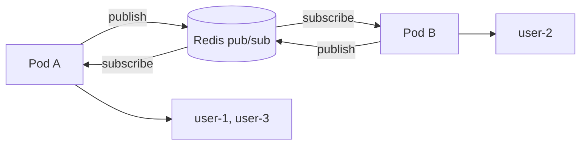

# 11.10 — 10. Scale-out và Production

> Nguồn: https://tiennhm.io.vn/en/docs/dotnet-backend-zero-to-senior/stage-03-aspnet-core-backend/module-11-signalr/11.10-scale-out-and-production
> Vì sao cần backplane, Redis backplane không phải hàng đợi, sticky session, Azure SignalR Service, giám sát và graceful shutdown.

> Thêm instance thứ hai **phá vỡ** SignalR nếu không có backplane: người gửi ở pod A, người nhận ở pod B, và tin nhắn **biến mất không lỗi**. Redis backplane sửa điều đó, nhưng cần hiểu nó **không phải hàng đợi** — nó là **pub/sub**: instance đang tạm thời mất kết nối Redis sẽ **mất luôn** những tin phát trong khoảng đó, không có gửi lại. Và nó **nhân lưu lượng**: mỗi tin gửi tới một nhóm được publish một lần rồi **mọi** instance nhận, kể cả instance không giữ kết nối nào của nhóm đó. Với quy mô lớn, **Azure SignalR Service** đưa toàn bộ kết nối ra ngoài tiến trình — đắt hơn nhưng bỏ được sticky session và bão kết nối lại khi deploy.

## Mục tiêu bài học

Sau bài này bạn có thể:

- Giải thích chính xác điều gì hỏng khi scale ngang không có backplane.
- Cấu hình Redis backplane và biết giới hạn của nó.
- Quyết định có cần sticky session hay không.
- So sánh Redis backplane với Azure SignalR Service.
- Giám sát và shutdown gọn gàng.

## Nội dung bài học

### 11.11.1 — Điều gì hỏng khi không có backplane

```
Pod A giu: user-1, user-3
Pod B giu: user-2

user-1 (trên Pod A) gửi tin cho user-2
=> Pod A tìm trong danh sách kết nối CỦA NÓ, không thấy user-2
=> Không gửi gì cả, KHÔNG có lỗi, KHÔNG có log
```

Đây là loại lỗi tệ nhất: nó **chạy hoàn hảo** trên máy dev một instance, và hỏng ngẫu nhiên trên production tuỳ theo load balancer đưa ai vào pod nào. Với 2 pod, khoảng **50%** tin nhắn biến mất.

Backplane giải quyết bằng cách cho các instance **nói chuyện với nhau**:



Pod A publish lên Redis, **mọi** pod nhận, và pod nào đang giữ người nhận thì gửi đi.

### 11.11.2 — Redis backplane

```bash
dotnet add package Microsoft.AspNetCore.SignalR.StackExchangeRedis
```

```csharp
builder.Services.AddSignalR()
    .AddStackExchangeRedis(
        builder.Configuration.GetConnectionString("Redis")!,
        options =>
        {
            options.Configuration.ChannelPrefix = RedisChannel.Literal("crm");
            options.Configuration.AbortOnConnectFail = false;   // không chết nếu Redis chưa sẵn sàng
            options.Configuration.ConnectRetry = 5;
        });
```

`ChannelPrefix` là **bắt buộc** khi nhiều ứng dụng dùng chung một Redis — không có nó, tin nhắn của ứng dụng này đi sang ứng dụng khác.

`AbortOnConnectFail = false` cho ứng dụng khởi động được khi Redis chưa sẵn sàng (thứ tự khởi động trong Kubernetes) và tự kết nối lại sau.

**Ba giới hạn phải biết:**

**1. Nó là pub/sub, không phải hàng đợi.** Instance mất kết nối Redis trong 5 giây sẽ **mất hoàn toàn** những tin phát trong 5 giây đó. Không có gửi lại, không có xác nhận. Đây là lý do [bài 11.9](11.8-notification-center-pattern.mdx) nhấn mạnh ghi database trước — bản ghi vẫn còn dù tin nhắn mất.

**2. Nó nhân lưu lượng.** Mỗi tin gửi tới một nhóm được publish một lần, rồi **mọi** instance nhận và tự lọc. Với 10 instance, một tin nhắn thành 10 lượt nhận — 9 trong đó là vô ích nếu chỉ một instance giữ người nhận.

```
1.000 tin/giây x 10 instance = 10.000 lượt nhận/giây trên mỗi instance
```

Với lưu lượng cao, Redis thành nút cổ chai. Đó là lúc cần xem lại thiết kế ([bài 11.7](11.6-groups-and-targeting.mdx)): gom tin, gửi tín hiệu thay vì dữ liệu, giới hạn tần suất.

**3. Redis trở thành điểm hỏng đơn.** Redis chết là SignalR ngừng hoạt động **xuyên instance** — trong instance thì vẫn chạy. Dùng Redis Sentinel hoặc Cluster cho production.

### 11.11.3 — Sticky session

Câu hỏi thường gặp: **có cần sticky session không?**

| Transport | Cần sticky |
|---|---|
| WebSocket **có** `negotiate` | **Có** — `negotiate` và kết nối phải cùng instance |
| WebSocket **bỏ** `negotiate` | **Không** |
| SSE, long polling | **Có** — mọi request phải về cùng instance |
| Azure SignalR Service | **Không** |

```nginx
upstream signalr_backend {
    ip_hash;
    server api1:5000;
    server api2:5000;
}

location /hubs/ {
    proxy_pass http://signalr_backend;
    proxy_http_version 1.1;
    proxy_set_header Upgrade $http_upgrade;       # BAT BUOC cho WebSocket
    proxy_set_header Connection "upgrade";
    proxy_set_header Host $host;
    proxy_read_timeout 3600s;                     # không cắt kết nối dài
}
```

Ba dòng cuối hay bị quên và mỗi dòng gây một triệu chứng riêng: thiếu `Upgrade`/`Connection` thì WebSocket **không bao giờ** nâng cấp được và luôn rơi về long polling; `proxy_read_timeout` mặc định 60 giây sẽ **cắt kết nối mỗi phút**.

Cách tránh sticky session hoàn toàn: bỏ `negotiate` và chỉ dùng WebSocket ([bài 11.3](11.2-signalr-architecture.mdx)) — đổi lại mất khả năng dự phòng khi WebSocket bị chặn.

`ip_hash` có nhược điểm: nhiều người sau cùng một NAT đi vào **cùng một instance**, nên tải phân bổ không đều. Cookie-based sticky (`sticky` của Nginx Plus, hoặc `ingress.kubernetes.io/affinity: cookie`) phân bổ tốt hơn.

### 11.11.4 — Azure SignalR Service

```bash
dotnet add package Microsoft.Azure.SignalR
```

```csharp
builder.Services.AddSignalR()
    .AddAzureSignalR(builder.Configuration["Azure:SignalR:ConnectionString"]!);
```

Nó thay đổi **kiến trúc**, không chỉ là backplane: client kết nối tới **dịch vụ**, không tới ứng dụng của bạn. Ứng dụng chỉ giữ vài kết nối tới dịch vụ đó.

| | Redis backplane | Azure SignalR Service |
|---|---|---|
| Kết nối nằm ở | Ứng dụng của bạn | **Dịch vụ** |
| Sticky session | Cần | **Không** |
| Deploy làm đứt kết nối | **Có** | **Không** |
| Giới hạn kết nối | RAM/CPU của bạn | Theo gói |
| Chi phí | Redis | Theo kết nối, đắt hơn |
| Vendor lock-in | Không | **Có** |

Hàng "deploy làm đứt kết nối" là lợi ích bị đánh giá thấp nhất. Với Redis backplane, mỗi lần deploy là **mọi** client mất kết nối và cùng kết nối lại — một đợt tải đột biến ngay lúc instance mới đang khởi động. Với Azure SignalR, client **không hề biết** bạn vừa deploy.

Khi nào đáng: trên 10.000 kết nối đồng thời, hoặc khi bạn không muốn quản lý sticky session và Redis. Dưới mức đó, Redis backplane rẻ hơn nhiều.

Có phương án tương đương ở nhà cung cấp khác, nhưng nếu tự vận hành thì Redis backplane vẫn là lựa chọn mặc định.

### 11.11.5 — Giám sát

```csharp
builder.Services.AddOpenTelemetry()
    .WithMetrics(m => m.AddMeter("Microsoft.AspNetCore.Http.Connections"));
```

Bốn chỉ số quan trọng nhất:

| Chỉ số | Cảnh báo khi |
|---|---|
| Số kết nối đang mở | Tăng đột biến, hoặc giảm đột ngột |
| **Tỷ lệ kết nối lại** | Tăng — dấu hiệu mạng hoặc cấu hình timeout sai |
| **Phân bố transport** | Tỷ lệ long polling tăng — WebSocket đang bị chặn |
| Độ trễ Redis backplane | Tăng — sắp thành nút cổ chai |

Hàng thứ ba đáng chú ý: nếu tỷ lệ long polling đột nhiên tăng, thường là cấu hình proxy vừa đổi và mất header `Upgrade`. Hệ thống **vẫn chạy** — chỉ tốn tài nguyên hơn nhiều — nên không ai phát hiện nếu không giám sát.

Health check cho backplane, đúng phân loại ở [bài 8.10](../module-08-aspnet-core-fundamentals/8.9-health-checks.mdx):

```csharp
builder.Services.AddHealthChecks()
    .AddRedis(redisConnectionString, name: "signalr-backplane",
              failureStatus: HealthStatus.Degraded,     // KHÔNG phải Unhealthy
              tags: ["ready"]);
```

`Degraded` chứ không `Unhealthy`: Redis chết thì real-time hỏng nhưng **API vẫn phục vụ được**. Đặt `Unhealthy` sẽ rút toàn bộ pod khỏi load balancer vì một tính năng phụ.

### 11.11.6 — Shutdown gọn gàng

```csharp
builder.Services.Configure<HostOptions>(o =>
    o.ShutdownTimeout = TimeSpan.FromSeconds(30));
```

Khi nhận SIGTERM, host ngừng nhận kết nối mới và chờ kết nối hiện tại. Mặc định chỉ **5 giây** — quá ngắn để client kịp nhận thông báo và chuyển sang instance khác.

Báo trước cho client là một cải thiện rõ rệt:

```csharp
public sealed class GracefulShutdownService(
    IHostApplicationLifetime lifetime,
    IHubContext<NotificationHub, INotificationClient> hub) : IHostedService
{
    public Task StartAsync(CancellationToken ct)
    {
        lifetime.ApplicationStopping.Register(() =>
        {
            // Báo client chuẩn bị kết nối lại
            hub.Clients.All.ServerShuttingDown().GetAwaiter().GetResult();
            Thread.Sleep(2000);       // chờ client nhận được
        });

        return Task.CompletedTask;
    }

    public Task StopAsync(CancellationToken ct) => Task.CompletedTask;
}
```

Client nhận `ServerShuttingDown` thì chủ động kết nối lại **ngay**, thay vì chờ `ClientTimeoutInterval` (30 giây) phát hiện kết nối chết. Chênh lệch 30 giây đó là khác biệt giữa "ứng dụng có vẻ đơ" và "không ai để ý".

Kết hợp với rolling deployment và `maxUnavailable` nhỏ để không phải toàn bộ client cùng kết nối lại một lúc.

### 11.11.7 — Rà lại code của bạn

**Danh sách rà soát production**

- [ ] Có backplane trước khi chạy quá một instance.
- [ ] ChannelPrefix được đặt nếu nhiều ứng dụng dùng chung Redis.
- [ ] AbortOnConnectFail = false để ứng dụng khởi động được khi Redis chưa sẵn sàng.
- [ ] Redis có Sentinel hoặc Cluster, không phải một node đơn.
- [ ] Hiểu rằng backplane là pub/sub và tin nhắn có thể mất.
- [ ] Thông báo quan trọng được ghi database trước khi push.
- [ ] Sticky session được cấu hình, hoặc đã bỏ negotiate có chủ đích.
- [ ] Nginx có header Upgrade, Connection và proxy_read_timeout đủ dài.
- [ ] Giám sát số kết nối, tỷ lệ kết nối lại và phân bố transport.
- [ ] Health check backplane trả Degraded, không phải Unhealthy.
- [ ] ShutdownTimeout đủ dài và có thông báo trước cho client.
- [ ] Rolling deployment không làm toàn bộ client kết nối lại cùng lúc.

## Bài tập áp dụng

#### Bài 1 — Hai instance không có backplane

Chạy 2 instance sau load balancer **không** có backplane, gửi 100 tin giữa các người dùng và đếm bao nhiêu tới nơi. Thêm Redis backplane và đếm lại.

**Tiêu chí hoàn thành:** bạn dự đoán được tỷ lệ tin tới nơi **trước khi đo**, và giải thích được con số đó.

Gợi ý và lời giải — Bài 1

**Gợi ý.** Tin chỉ tới nơi khi người gửi và người nhận tình cờ nằm trên **cùng một** instance.

**Lời giải — dự đoán trước khi đo.** Với `N` instance và phân phối đều, xác suất hai kết nối bất kỳ rơi vào cùng một instance là `1/N`. Với `N = 2`, dự đoán là **khoảng 50%**.

**Đo thực tế:**

```bash
dotnet run --urls http://localhost:5001 &
dotnet run --urls http://localhost:5002 &
```

```csharp
for (int i = 0; i < 100; i++)
    await hub.SendAsync("SendToUser", recipientId, $"tin {i}");
```

```text
Gửi:     100
Nhận:     48
Tỷ lệ:    48%
```

Khớp với dự đoán.

**Vì sao.** Mỗi instance chỉ biết những kết nối **của chính nó**:

```text
user-1 (trên Pod A) gửi tin cho user-2
=> Pod A tìm trong danh sách kết nối CỦA NÓ, không thấy user-2
=> Không gửi gì cả, KHÔNG có lỗi, KHÔNG có log
```

Đây là phần nguy hiểm nhất: `Clients.User(id).Receive(...)` **thành công** theo nghĩa kỹ thuật. Nó tìm trong danh sách cục bộ, không thấy ai, và kết thúc bình thường. Không exception, không cảnh báo, không dấu vết nào trong log.

**Với 3 instance thì còn tệ hơn:**

| Số instance | Tỷ lệ tin tới nơi |
|---|---|
| 1 | **100%** |
| 2 | ~50% |
| 3 | ~33% |
| 10 | ~10% |

Và đây chính là lý do lỗi này hay xuất hiện đúng lúc hệ thống thành công: chạy một instance thì mọi thứ hoàn hảo, scale lên ba instance để chịu tải thì 2/3 thông báo biến mất.

**Thêm Redis backplane:**

```csharp
builder.Services.AddSignalR()
    .AddStackExchangeRedis(redisConnectionString, options =>
    {
        options.Configuration.ChannelPrefix = RedisChannel.Literal("crm-signalr");
        options.Configuration.AbortOnConnectFail = false;   // không chết nếu Redis chưa sẵn sàng
    });
```

```text
Gửi:     100
Nhận:    100
Tỷ lệ:   100%
```

**Cách backplane hoạt động:**

```text
Instance A gửi thông báo
  -> đẩy lên Redis pub/sub
  -> Instance B và C nhận được
  -> Mỗi instance gửi tới kết nối CỦA MÌNH
  -> 100/100 người nhận được
```

**Một chi phí cần biết.** Mỗi tin giờ được **mọi** instance nhận, kể cả instance không giữ kết nối nào liên quan:

```text
1.000 tin/giây × 10 instance = 10.000 lượt nhận/giây trên mỗi instance
```

Với lưu lượng lớn, đây là lý do nên gửi tín hiệu thay vì gửi dữ liệu đầy đủ, như [bài 11.7](11.6-groups-and-targeting.mdx) đã đo.

**Và đừng chờ tới khi lên production mới phát hiện.** Chạy hai instance trên máy phát triển với một Nginx đơn giản là đủ để lộ mọi lỗi thuộc lớp này — cùng lý do với bài kiểm tra Data Protection ở [bài 10.12](../module-10-authentication-authorization/10.11-advanced-notes.mdx).

---

#### Bài 2 — Thiếu header `Upgrade` và cú lùi im lặng

Bỏ `proxy_set_header Upgrade` trong Nginx, kết nối SignalR, và kiểm tra transport thực tế trong DevTools. Xác nhận nó rơi về long polling **mà không có lỗi nào**.

**Tiêu chí hoàn thành:** bạn nêu được vì sao cú lùi này nguy hiểm hơn một lỗi rõ ràng.

Gợi ý và lời giải — Bài 2

**Gợi ý.** Một lỗi làm bạn sửa ngay. Một thứ vẫn "chạy" thì có thể tồn tại hàng tháng.

**Lời giải — cấu hình thiếu:**

```nginx
location /hubs/ {
    proxy_pass http://crm;
    proxy_http_version 1.1;
    # THIẾU: proxy_set_header Upgrade $http_upgrade;
    # THIẾU: proxy_set_header Connection "upgrade";
}
```

```js
await connection.start();
console.log('đã kết nối');       // vẫn in ra bình thường
```

**Kiểm tra transport thật trong DevTools, tab Network:**

```text
Có backplane đúng:
  negotiate     200
  ?id=...       101 Switching Protocols     <- WebSocket

Thiếu header Upgrade:
  negotiate     200
  ?id=...       200                          <- long polling
  ?id=...       200
  ?id=...       200      (request mới liên tục)
```

**Ứng dụng chạy đúng chức năng.** Thông báo vẫn tới, chỉ là qua một cơ chế khác hẳn.

**Vì sao nguy hiểm hơn một lỗi rõ ràng.** Nếu WebSocket hỏng và SignalR ném exception, bạn sửa trong mười phút. Nhưng SignalR được thiết kế để **tự lùi** về Server-Sent Events rồi Long Polling khi môi trường không cho dùng WebSocket — đó là một tính năng tốt, và ở đây nó che mất một cấu hình sai.

Hệ quả chỉ lộ ra khi có tải:

| | WebSocket | Long Polling |
|---|---|---|
| Kết nối mỗi client | 1, giữ mãi | Request mới **liên tục** |
| Độ trễ | ~1 ms | 100–500 ms |
| Tải server | Thấp | **Cao hơn nhiều** |
| Giới hạn 6 kết nối HTTP/1.1 | Không bị tính | **Bị tính** |

Dòng cuối là thứ gây ra triệu chứng khó hiểu nhất: người dùng mở 6 tab thì tab thứ bảy treo hẳn, kể cả việc tải ảnh và gọi API — đúng cơ chế ở [bài 11.2](11.1-why-real-time-matters.mdx).

**Cấu hình đúng:**

```nginx
location /hubs/ {
    proxy_pass http://crm;
    proxy_http_version 1.1;
    proxy_set_header Upgrade $http_upgrade;
    proxy_set_header Connection "upgrade";
    proxy_set_header Host $host;
    proxy_cache_bypass $http_upgrade;
    proxy_read_timeout 3600s;                     # không cắt kết nối dài
}
```

**Và đừng dựa vào việc nhớ kiểm tra.** Ghi lại transport thực tế ở server rồi dựng một chỉ số:

```csharp
public override Task OnConnectedAsync()
{
    var transport = Context.Features
        .Get<IHttpTransportFeature>()?.TransportType.ToString() ?? "unknown";

    _metrics.Connections.Add(1,
        new KeyValuePair<string, object?>("transport", transport));

    return base.OnConnectedAsync();
}
```

```text
CẢNH BÁO khi: tỷ lệ kết nối không phải WebSocket > 5%
```

Ngưỡng 5% cho phép một số ít client ở mạng doanh nghiệp chặn WebSocket, nhưng bắt ngay được trường hợp cả hệ thống lùi về long polling vì một dòng cấu hình proxy.

**Cách kiểm nhanh bằng dòng lệnh:**

```bash
curl -i -N -H "Connection: Upgrade" -H "Upgrade: websocket" \
     -H "Sec-WebSocket-Version: 13" -H "Sec-WebSocket-Key: dGhlIHNhbXBsZSBub25jZQ==" \
     http://localhost:8080/hubs/notifications | head -1
# HTTP/1.1 101 Switching Protocols        <- đúng
# HTTP/1.1 200 OK                          <- proxy đang nuốt header Upgrade
```

---

#### Bài 3 — Redis chết: suy giảm chứ không sập

Dừng Redis khi đang chạy 2 instance, và xác nhận tin nhắn **trong cùng** instance vẫn hoạt động còn tin nhắn **xuyên** instance thì không. Kiểm tra health check trả `Degraded` và pod **không** bị rút khỏi load balancer.

**Tiêu chí hoàn thành:** bạn giải thích được vì sao backplane hỏng phải cho `Degraded` chứ không phải `Unhealthy`.

Gợi ý và lời giải — Bài 3

**Gợi ý.** Hỏi: nếu mọi pod đều trả `Unhealthy` cùng lúc thì Kubernetes làm gì?

**Lời giải — dừng Redis:**

```bash
docker stop redis
```

```text
Người dùng cùng instance A gửi cho nhau  -> tới nơi bình thường
Người dùng A gửi cho người dùng trên B   -> KHÔNG tới
```

```csharp
builder.Services.AddSignalR()
    .AddStackExchangeRedis(cs, o => o.Configuration.AbortOnConnectFail = false);
```

Nhờ `AbortOnConnectFail = false`, ứng dụng **không sập** khi mất Redis — nó chỉ mất khả năng phát tin xuyên instance, và tự nối lại khi Redis quay về.

**Health check đúng:**

```csharp
builder.Services.AddHealthChecks()
    .AddRedis(redisConnectionString,
              name: "signalr-backplane",
              failureStatus: HealthStatus.Degraded,     // KHÔNG phải Unhealthy
              tags: ["ready"]);
```

```bash
curl -s localhost:8080/health/ready | jq
```

```json
{
  "status": "Degraded",
  "checks": [{ "name": "signalr-backplane", "status": "Degraded" }]
}
```

```bash
kubectl get pods
# NAME              READY   STATUS    RESTARTS
# crm-api-7d4f...   1/1     Running   0          <- vẫn phục vụ
```

**Vì sao phải là `Degraded`.** Nếu đặt `Unhealthy`, chuỗi sự kiện sẽ như sau:

```text
Redis chết
  -> MỌI pod trả Unhealthy cùng lúc
  -> Kubernetes rút TẤT CẢ pod khỏi Service
  -> Không còn pod nào phục vụ
  -> Toàn bộ ứng dụng sập, kể cả những phần không liên quan tới SignalR
```

Một phụ thuộc **không bắt buộc** vừa kéo theo cả hệ thống. Trong khi thực tế, mất backplane chỉ làm suy giảm một tính năng: người dùng vẫn đăng nhập được, vẫn xem và sửa dữ liệu được, chỉ là thông báo real-time không vượt được giữa các pod — và bản thân thông báo đã có đường đồng bộ REST làm dự phòng.

**Quy tắc phân loại phụ thuộc trong health check:**

| Phụ thuộc | Trạng thái khi hỏng | Lý do |
|---|---|---|
| Database chính | `Unhealthy` | Không có nó thì không làm được gì |
| Redis backplane | **`Degraded`** | Mất một tính năng, không mất hệ thống |
| Redis cache | **`Degraded`** | Chậm hơn, vẫn đúng |
| Cổng thanh toán | **`Degraded`** | Chỉ ảnh hưởng luồng thanh toán |
| Dịch vụ gửi email | **`Degraded`** | Có hàng đợi làm đệm |

**Và liveness thì không được kiểm gì bên ngoài:**

```csharp
// Liveness — không chạm gì bên ngoài
app.MapHealthChecks("/health/live", new()
{
    Predicate = _ => false                  // chỉ trả 200 là đủ
});

// Readiness — kiểm phụ thuộc, nhưng Degraded vẫn coi là sẵn sàng
app.MapHealthChecks("/health/ready", new()
{
    Predicate = c => c.Tags.Contains("ready"),
    ResultStatusCodes =
    {
        [HealthStatus.Healthy]   = StatusCodes.Status200OK,
        [HealthStatus.Degraded]  = StatusCodes.Status200OK,     // VẪN phục vụ
        [HealthStatus.Unhealthy] = StatusCodes.Status503ServiceUnavailable
    }
});
```

Liveness chạm database là nguyên nhân của ca restart dây chuyền ở [bài 18.13](../../stage-05-senior-engineering/module-18-microservices/18.12-quick-real-world-example.mdx) — database chậm một nhịp là Kubernetes giết sạch mọi pod.

**Cuối cùng, hãy cho người dùng biết khi đang suy giảm:**

```csharp
// Báo client chuẩn bị kết nối lại
await _hub.Clients.All.BackplaneDegraded();
```

Giao diện hiện một dải nhỏ "Thông báo tức thời tạm gián đoạn, dữ liệu vẫn được cập nhật khi bạn tải lại" — trung thực hơn nhiều so với việc để người dùng tự hỏi vì sao không thấy gì.

## Tự kiểm tra

### Điều gì hỏng khi scale ngang không có backplane?

Người gửi ở một pod và người nhận ở pod khác thì pod gửi không tìm thấy kết nối của người nhận, nên tin nhắn biến mất mà không có lỗi hay log nào. Với 2 pod thì khoảng một nửa tin nhắn mất, và nó chạy hoàn hảo trên máy dev một instance.

### Redis backplane có đảm bảo tin nhắn tới nơi không?

Không. Nó là pub/sub chứ không phải hàng đợi, nên instance mất kết nối Redis trong vài giây sẽ mất hoàn toàn những tin phát trong khoảng đó, không có gửi lại và không có xác nhận. Đó là lý do phải ghi database trước rồi mới push.

### Vì sao backplane nhân lưu lượng?

Mỗi tin gửi tới một nhóm được publish một lần rồi mọi instance đều nhận và tự lọc, kể cả instance không giữ kết nối nào của nhóm đó. Với 10 instance thì một tin thành 10 lượt nhận, 9 trong đó vô ích. Ở lưu lượng cao, Redis thành nút cổ chai.

### Khi nào cần sticky session?

Với SSE và long polling thì luôn cần vì mọi request phải về cùng instance. Với WebSocket thì cần nếu còn bước negotiate, vì negotiate và kết nối phải cùng instance. Bỏ negotiate và chỉ dùng WebSocket thì không cần, đổi lại mất khả năng dự phòng khi WebSocket bị chặn.

### Azure SignalR Service khác Redis backplane thế nào?

Nó thay đổi kiến trúc chứ không chỉ là backplane: client kết nối tới dịch vụ chứ không tới ứng dụng của bạn. Nhờ đó không cần sticky session, và deploy không làm đứt kết nối của client. Đánh đổi là chi phí theo kết nối và vendor lock-in; dưới khoảng 10.000 kết nối thì Redis rẻ hơn nhiều.

### Health check cho backplane nên trả trạng thái gì?

Degraded chứ không phải Unhealthy. Redis chết thì real-time hỏng nhưng API vẫn phục vụ được, nên đặt Unhealthy sẽ rút toàn bộ pod khỏi load balancer vì một tính năng phụ và tự gây downtime.

## Kết luận

Ba điều đáng nhớ nhất:

1. **Không backplane thì instance thứ hai làm mất tin nhắn im lặng.**
2. **Backplane là pub/sub, không phải hàng đợi.** Database vẫn là nguồn sự thật.
3. **Health check backplane trả `Degraded`** — real-time hỏng không có nghĩa là API hỏng.

## Tham khảo

- [SignalR scale-out considerations](https://learn.microsoft.com/en-us/aspnet/core/signalr/scale)
- [Redis backplane for SignalR scale-out](https://learn.microsoft.com/en-us/aspnet/core/signalr/redis-backplane)
- [What is Azure SignalR Service?](https://learn.microsoft.com/en-us/azure/azure-signalr/signalr-overview)
- [Host and deploy ASP.NET Core SignalR](https://learn.microsoft.com/en-us/aspnet/core/signalr/publish-to-azure-web-app)

## Điều hướng

- **Bài trước:** [11.9 — 9. Presence — Online/Offline](11.9-presence-online-offline-status.mdx)
- **Bài tiếp theo:** [11.11 — Mở rộng và đào sâu](11.11-advanced-notes.mdx)
- **Về module:** [Trang mục lục](./)
