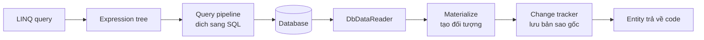

# 13.1 — 1. EF Core Overview

> Nguồn: https://tiennhm.io.vn/en/docs/dotnet-backend-zero-to-senior/stage-04-database-production/module-13-entity-framework-core/13.1-ef-core-overview
> EF Core làm gì bên dưới, chi phí thật của ORM, change tracker, khi nào dùng Dapper, và vì sao LINQ không phải SQL.

> EF Core không chỉ là "dịch LINQ sang SQL". Nó còn giữ một **change tracker** theo dõi mọi entity đã nạp để biết cái nào thay đổi khi bạn gọi `SaveChanges()` — và đó là nơi phần lớn chi phí, cũng như phần lớn bất ngờ về hiệu năng, đến từ. Hai điều cần hiểu sớm. **`IQueryable` là cây biểu thức, không phải dữ liệu**: mọi `Where` chỉ thêm vào cây cho tới khi bạn gọi `ToList` — và một `.ToList()` đặt sai chỗ biến bộ lọc thành lọc trong bộ nhớ sau khi đã kéo cả bảng về. **EF Core không phải lúc nào cũng dịch được**: từ EF Core 3.0, thứ không dịch được sẽ **ném exception lúc chạy** thay vì âm thầm chạy ở client — một thay đổi tốt, nhưng nó biến lỗi biên dịch tiềm năng thành lỗi runtime.

## Mục tiêu bài học

Sau bài này bạn có thể:

- Mô tả những gì EF Core làm giữa LINQ và SQL.
- Giải thích change tracker và chi phí của nó.
- Phân biệt `IQueryable` và `IEnumerable` trong ngữ cảnh EF.
- Chọn giữa EF Core, Dapper và ADO.NET có lý do.
- Bật log SQL để thấy EF Core thật sự sinh ra gì.

## Nội dung bài học

### 13.2.1 — EF Core làm gì



Bốn việc, và việc thứ tư là thứ phân biệt EF Core với một thư viện mapping thuần:

1. **Dịch LINQ sang SQL** qua cây biểu thức.
2. **Vật chất hoá** kết quả thành đối tượng C#.
3. **Theo dõi thay đổi** — giữ một bản sao giá trị gốc của mỗi entity.
4. **Sinh SQL cập nhật** khi `SaveChanges()`, chỉ cho những gì thật sự đổi.

Dapper làm việc 1 và 2. Việc 3 và 4 là lý do EF Core tiện hơn — và cũng là nơi chi phí nằm.

### 13.2.2 — Change tracker

```csharp
var customer = await db.Customers.FindAsync(42);   // EF lưu BẢN SAO giá trị gốc
customer.Name = "Tên mới";                          // ban chi doi doi tuong
await db.SaveChangesAsync();                        // EF SO SÁNH và sinh UPDATE
```

EF Core sinh ra:

```sql
UPDATE Customers SET Name = @p0 WHERE Id = @p1;   -- CHỈ cột Name
```

Để làm được, nó giữ **hai bản** của mỗi entity đã nạp: giá trị hiện tại và giá trị gốc. Với 10 cột, đó là gấp đôi bộ nhớ cho mỗi dòng.

Hệ quả: **nạp 100.000 entity với tracking là chậm và tốn bộ nhớ** — không phải vì truy vấn, mà vì việc dựng và theo dõi 100.000 đối tượng.

```csharp
// Chi doc -> TAT tracking
var customers = await db.Customers.AsNoTracking().ToListAsync(ct);
```

`AsNoTracking()` thường nhanh hơn **20–50%** cho truy vấn đọc nhiều dòng, và tốn ít bộ nhớ hơn đáng kể. Với API chỉ trả dữ liệu ra ngoài, nó gần như luôn đúng.

Bật mặc định cho toàn bộ context:

```csharp
builder.Services.AddDbContext<CrmDbContext>(options =>
    options.UseSqlServer(conn)
           .UseQueryTrackingBehavior(QueryTrackingBehavior.NoTracking));
```

Rồi dùng `.AsTracking()` ở những chỗ thật sự cần sửa. Đây là mặc định an toàn hơn: quên `AsNoTracking` chỉ làm chậm, còn quên `AsTracking` thì `SaveChanges` không làm gì — lỗi rõ ràng và dễ phát hiện.

Change tracker còn giải thích một hành vi hay gây bối rối:

```csharp
var a = await db.Customers.FindAsync(42);
var b = await db.Customers.FindAsync(42);
Console.WriteLine(ReferenceEquals(a, b));    // True — CÙNG một đối tượng
```

Đây là **identity map**: trong một `DbContext`, mỗi khoá chính chỉ có **một** instance. `FindAsync` còn kiểm tra change tracker **trước** khi đi xuống database — nên lần gọi thứ hai không sinh truy vấn nào.

Mặt trái: `DbContext` sống lâu tích luỹ entity và **trả về dữ liệu cũ**. Đó là lý do `DbContext` phải là `Scoped` ([bài 7.5](../../stage-02-csharp-professional/module-07-dependency-injection/7.4-service-lifetimes.mdx)).

### 13.2.3 — `IQueryable` là cây biểu thức

```csharp
// CHUA co truy van nao chay
var query = db.Customers.Where(c => c.Status == CustomerStatus.Active);
query = query.Where(c => c.CreatedAt > cutoff);
query = query.OrderByDescending(c => c.CreatedAt);

// Bây giờ mới chạy — MỘT câu SQL
var result = await query.Take(20).ToListAsync(ct);
```

Mỗi toán tử chỉ **thêm một nút vào cây biểu thức**. Truy vấn chạy khi gặp `ToListAsync`, `FirstOrDefaultAsync`, `CountAsync`, `AnyAsync` hoặc vòng lặp `foreach`.

Đây là điều làm nên sức mạnh — và cũng là cái bẫy lớn nhất:

```csharp
// SAI — .ToList() kéo CẢ BẢNG về rồi mới lọc
var customers = db.Customers.ToList()
    .Where(c => c.Status == CustomerStatus.Active);

// DUNG — loc o database
var customers = await db.Customers
    .Where(c => c.Status == CustomerStatus.Active)
    .ToListAsync(ct);
```

Sau `.ToList()`, kiểu trở thành `IEnumerable` và mọi `Where` sau đó chạy **trong bộ nhớ ứng dụng**. Code biên dịch được, chạy được, và trên máy dev với 100 dòng thì không ai để ý.

Cùng lý do đó, **phương thức trả về kiểu gì cũng quan trọng**:

```csharp
// SAI — cat mat kha nang tiep tuc dung SQL
public IEnumerable<Customer> GetActive() =>
    db.Customers.Where(c => c.Status == CustomerStatus.Active);

// ĐÚNG — người gọi vẫn thêm điều kiện vào SQL được
public IQueryable<Customer> GetActive() =>
    db.Customers.Where(c => c.Status == CustomerStatus.Active);
```

Phiên bản đầu trông vô hại vì `IQueryable` **kế thừa** `IEnumerable`, nên nó biên dịch. Nhưng người gọi thêm `.Where(...).Take(20)` sẽ lọc trong bộ nhớ sau khi đã nạp toàn bộ khách hàng active. Chi tiết ở [Module 5](../../stage-02-csharp-professional/module-05-advanced-csharp/).

### 13.2.4 — Khi EF Core không dịch được

```csharp
// KHÔNG dịch được — EF Core ném exception lúc chạy
var customers = await db.Customers
    .Where(c => MyCustomValidator.IsValid(c.Email))     // hàm C# tuỳ ý
    .ToListAsync(ct);
```

Từ EF Core 3.0, thứ không dịch được sẽ ném `InvalidOperationException` thay vì âm thầm chuyển sang đánh giá ở client. Đây là thay đổi **tốt** — trước đó, một truy vấn như vậy sẽ kéo cả bảng về mà không ai biết — nhưng nó nghĩa là lỗi chỉ xuất hiện **lúc chạy**.

Ba cách xử lý:

```csharp
// 1. Viết lại bằng biểu thức dịch được
.Where(c => c.Email.EndsWith("@company.com"))

// 2. Chuyển sang bộ nhớ MỘT CÁCH CÓ CHỦ ĐÍCH, sau khi đã lọc
var candidates = await db.Customers
    .Where(c => c.Status == CustomerStatus.Active)      // lọc ở SQL trước
    .ToListAsync(ct);
var valid = candidates.Where(c => MyCustomValidator.IsValid(c.Email));

// 3. Dung SQL thuan
var customers = await db.Customers
    .FromSql($"SELECT * FROM Customers WHERE {predicate}")
    .ToListAsync(ct);
```

Cách 2 là đúng khi bộ lọc thật sự cần logic C# — điểm mấu chốt là **lọc ở SQL trước** để tập đưa về bộ nhớ đủ nhỏ.

`FromSql` (EF Core 8+) dùng chuỗi nội suy nhưng **tham số hoá tự động** — an toàn với SQL injection. `FromSqlRaw` thì không; nó chỉ nên dùng với tham số khai rõ.

### 13.2.5 — EF Core, Dapper hay ADO.NET

| | EF Core | Dapper | ADO.NET |
|---|---|---|---|
| Change tracking | **Có** | Không | Không |
| Migration | **Có** | Không | Không |
| Viết SQL | Hiếm khi | **Luôn** | Luôn |
| Tốc độ phát triển | Nhanh nhất | Trung bình | Chậm |
| Hiệu năng đọc thô | Tốt với `AsNoTracking` | **Rất tốt** | Tốt nhất |
| Kiểm soát SQL | Gián tiếp | **Hoàn toàn** | Hoàn toàn |

Khác biệt hiệu năng giữa EF Core `AsNoTracking` và Dapper **nhỏ hơn nhiều người nghĩ** — thường dưới 20% cho truy vấn thông thường. Khoảng cách lớn xuất hiện khi có tracking, hoặc khi EF Core sinh SQL kém cho một truy vấn phức tạp.

**Mẫu thực dụng nhất là dùng cả hai:**

```csharp
// EF Core cho CRUD va domain
var customer = await db.Customers.FindAsync([id], ct);
customer.Status = CustomerStatus.Active;
await db.SaveChangesAsync(ct);

// Dapper cho báo cáo phức tạp
var report = await connection.QueryAsync<RevenueRow>(
    """
    SELECT DATE_TRUNC('month', converted_at) AS Month, SUM(value) AS Revenue
    FROM leads WHERE status = 'Won'
    GROUP BY 1 ORDER BY 1
    """);
```

Chúng dùng chung connection và chung transaction, nên không có rào cản kỹ thuật nào.

**Ba chỗ EF Core không phù hợp:**

1. **Chèn hàng loạt** — 100.000 dòng qua `SaveChanges` là chậm. Dùng `SqlBulkCopy` hoặc `EFCore.BulkExtensions`.
2. **Truy vấn báo cáo phức tạp** — window function, CTE đệ quy, gợi ý truy vấn.
3. **Cập nhật hàng loạt theo điều kiện** — nhưng EF Core 7 đã có `ExecuteUpdateAsync`/`ExecuteDeleteAsync` giải quyết phần lớn.

```csharp
// EF Core 7+: một câu UPDATE, không nạp entity nào
await db.Leads
    .Where(l => l.Status == LeadStatus.New && l.CreatedAt < cutoff)
    .ExecuteUpdateAsync(s => s.SetProperty(l => l.Status, LeadStatus.Lost), ct);
```

### 13.2.6 — Thấy SQL thật

Đây là thói quen quan trọng nhất khi làm việc với EF Core:

```csharp
builder.Services.AddDbContext<CrmDbContext>(options =>
{
    options.UseSqlServer(conn);

    if (builder.Environment.IsDevelopment())
    {
        options.LogTo(Console.WriteLine, LogLevel.Information)
               .EnableSensitiveDataLogging()     // hiện GIÁ TRỊ tham số
               .EnableDetailedErrors();
    }
});
```

`EnableSensitiveDataLogging` hiện giá trị tham số trong log — rất hữu ích khi gỡ lỗi và **tuyệt đối không bật ở production** ([bài 8.8](../../stage-03-aspnet-core-backend/module-08-aspnet-core-fundamentals/8.7-logging-with-serilog.mdx)).

Xem SQL của một truy vấn cụ thể mà không chạy nó:

```csharp
var sql = db.Customers.Where(c => c.Status == CustomerStatus.Active)
                      .ToQueryString();
```

`ToQueryString()` (EF Core 5+) là cách nhanh nhất để trả lời "EF Core thật sự sinh ra gì". Nhiều vấn đề hiệu năng hiện ra ngay khi bạn nhìn thấy câu SQL.

### 13.2.7 — Rà lại code của bạn

**Danh sách rà soát EF Core cơ bản**

- [ ] Truy vấn chỉ đọc dùng AsNoTracking, hoặc context mặc định NoTracking.
- [ ] Không có .ToList() nào đặt trước bộ lọc.
- [ ] Phương thức trả về IQueryable khi người gọi còn cần thêm điều kiện.
- [ ] Không có biểu thức nào không dịch được trong Where đi thẳng xuống SQL.
- [ ] Lọc trong bộ nhớ chỉ xảy ra sau khi đã thu hẹp tập ở SQL.
- [ ] Dùng FromSql thay vì FromSqlRaw khi cần SQL thuần.
- [ ] Cập nhật hàng loạt dùng ExecuteUpdateAsync thay vì nạp rồi sửa.
- [ ] Chèn hàng loạt dùng bulk copy, không dùng SaveChanges.
- [ ] Log SQL được bật ở Development.
- [ ] EnableSensitiveDataLogging không bật ở Production.

## Bài tập áp dụng

1. **Đo tracking.** Nạp 50.000 entity có và không có `AsNoTracking`, đo thời gian và bộ nhớ bằng `dotnet-counters`.

2. **`.ToList()` sai chỗ.** Viết hai phiên bản của cùng một bộ lọc, một lọc ở SQL và một lọc sau `.ToList()`. Bật log SQL và so sánh câu lệnh sinh ra cùng số dòng trả về.

3. **`ToQueryString`.** Lấy một truy vấn phức tạp trong dự án của bạn, in SQL bằng `ToQueryString()`, và chạy nó trong SSMS với execution plan. Ghi lại những gì bạn không ngờ tới.

## Tự kiểm tra

### Change tracker làm gì và tốn kém ở đâu?

Nó giữ bản sao giá trị gốc của mỗi entity đã nạp để biết cái nào thay đổi khi SaveChanges, nhờ đó EF chỉ sinh UPDATE cho cột thật sự đổi. Cái giá là gấp đôi bộ nhớ cho mỗi dòng và chi phí dựng đối tượng, nên nạp hàng chục nghìn entity có tracking là chậm và tốn bộ nhớ.

### Vì sao nên đặt NoTracking làm mặc định?

Vì quên AsNoTracking chỉ làm chậm, còn quên AsTracking thì SaveChanges không làm gì, và đó là lỗi rõ ràng dễ phát hiện. Với API chỉ trả dữ liệu ra ngoài thì NoTracking gần như luôn đúng và nhanh hơn khoảng 20 tới 50 phần trăm.

### IQueryable khác IEnumerable thế nào trong EF Core?

IQueryable là một cây biểu thức chưa chạy, mỗi toán tử chỉ thêm một nút cho tới khi gặp ToList hay tương tự. Sau khi gọi ToList thì kiểu thành IEnumerable và mọi bộ lọc sau đó chạy trong bộ nhớ ứng dụng, tức bạn đã kéo cả bảng về rồi mới lọc.

### Vì sao không nên trả về IEnumerable từ phương thức truy vấn?

Vì IQueryable kế thừa IEnumerable nên code vẫn biên dịch, nhưng người gọi thêm điều kiện sẽ lọc trong bộ nhớ thay vì trong SQL. Trả về IQueryable giữ được khả năng ghép thêm điều kiện vào câu SQL.

### EF Core xử lý biểu thức không dịch được ra sao?

Từ EF Core 3.0, nó ném InvalidOperationException lúc chạy thay vì âm thầm đánh giá ở client. Đây là thay đổi tốt vì trước đó truy vấn như vậy sẽ kéo cả bảng về mà không ai biết, nhưng nó nghĩa là lỗi chỉ xuất hiện lúc chạy chứ không phải lúc biên dịch.

### Khi nào EF Core không phù hợp?

Chèn hàng loạt hàng trăm nghìn dòng qua SaveChanges là chậm, nên dùng bulk copy. Truy vấn báo cáo phức tạp với window function hay CTE đệ quy thì Dapper hoặc SQL thuần tốt hơn. Cập nhật hàng loạt từng là vấn đề nhưng EF Core 7 đã có ExecuteUpdateAsync.

## Kết luận

Ba điều đáng nhớ nhất:

1. **Change tracker là tiện ích chính và chi phí chính.** Tắt nó cho truy vấn đọc.
2. **`.ToList()` sai chỗ biến bộ lọc SQL thành lọc trong bộ nhớ** — và code vẫn chạy.
3. **Luôn nhìn SQL thật.** `ToQueryString()` trả lời phần lớn câu hỏi hiệu năng.

## Tham khảo

- [Entity Framework Core documentation](https://learn.microsoft.com/en-us/ef/core/)
- [Change tracking in EF Core](https://learn.microsoft.com/en-us/ef/core/change-tracking/)
- [Client vs. server evaluation](https://learn.microsoft.com/en-us/ef/core/querying/client-eval)
- [Simple logging — EF Core](https://learn.microsoft.com/en-us/ef/core/logging-events-diagnostics/simple-logging)

## Điều hướng

- **Bài trước:** Không có (bài mở đầu module).
- **Bài tiếp theo:** [13.2 — 2. DbContext và Entity Configuration](13.2-dbcontext-and-entity-configuration.mdx)
- **Về module:** [Trang mục lục](./)
