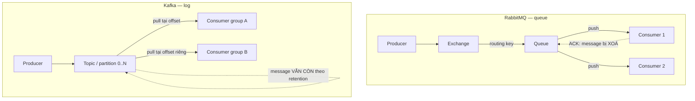

# 17.4 — 4. So sánh Kafka và RabbitMQ (thực dụng)

> Nguồn: https://tiennhm.io.vn/en/docs/dotnet-backend-zero-to-senior/stage-05-senior-engineering/module-17-distributed-systems/17.4-kafka-vs-rabbitmq-pragmatic
> Hai mô hình khác nhau về bản chất: queue xoá sau khi đọc và log giữ lại để replay. Chọn theo yêu cầu replay, ordering và khả năng vận hành của đội.

> Đây không phải hai sản phẩm cùng loại cạnh tranh nhau — chúng là **hai mô hình khác nhau về bản chất**. RabbitMQ là **hàng đợi**: message được **xoá sau khi consumer ACK**, và broker chủ động đẩy tới consumer. Kafka là **log có thứ tự**: message **ở nguyên đó** theo retention dù đã đọc, consumer tự nhớ mình đọc tới đâu (offset), nên **đọc lại được**. Khác biệt đó kéo theo mọi thứ còn lại. Điều cần nhớ khi chọn: **khả năng replay** là lý do kỹ thuật mạnh nhất để chọn Kafka, còn **khả năng vận hành của đội** thường là yếu tố quyết định thật sự. Một Kafka bị vận hành sai — consumer lag không ai theo dõi, partition chọn nhầm key — gây thiệt hại lớn hơn nhiều so với một RabbitMQ chạy đúng.

## Mục tiêu bài học

Sau bài này bạn có thể:

- Giải thích khác biệt bản chất giữa mô hình queue và mô hình log.
- Nói đúng phạm vi đảm bảo thứ tự của mỗi hệ.
- Chọn message key cho Kafka mà không phá song song.
- Cấu hình prefetch và quorum queue cho RabbitMQ.
- Chọn công nghệ theo yêu cầu thật, không theo xu hướng.

## Nội dung bài học

### 17.5.1 — Khác biệt bản chất



Hệ quả trực tiếp của khác biệt này:

| | RabbitMQ | Kafka |
|---|---|---|
| Sau khi đọc | Message bị xoá | Message vẫn còn tới hết retention |
| Đọc lại | Không (trừ khi publish lại) | **Có — đặt lại offset** |
| Thêm consumer mới | Chỉ nhận message từ lúc đó | **Đọc lại toàn bộ lịch sử** |
| Hướng vận chuyển | Broker **đẩy** | Consumer **kéo** |
| Vị trí đọc | Broker giữ | **Consumer group giữ** (offset) |

Hàng thứ ba là lý do mạnh nhất để chọn Kafka. Thêm một service analytics mới và cần dữ liệu **sáu tháng trước**? Với Kafka, chỉ cần đọc từ offset đầu. Với RabbitMQ, dữ liệu đó không còn tồn tại.

### 17.5.2 — Thứ tự

Cả hai đều đảm bảo thứ tự trong **một phạm vi hẹp**, và phạm vi đó nhỏ hơn người ta tưởng.

**RabbitMQ** giữ thứ tự trong một queue với **một** consumer. Ngay khi bạn thêm consumer thứ hai để tăng thông lượng, thứ tự **mất**:

```
Queue: [M1, M2, M3]
Consumer A lay M1 (xu ly 500ms)
Consumer B lay M2 (xu ly  10ms)  <-- M2 xong TRUOC M1
```

**Kafka** giữ thứ tự trong **một partition**. Message cùng key luôn vào cùng partition:

```csharp
// Cung LeadId -> cung partition -> dung thu tu
await producer.ProduceAsync("leads", new Message<string, string>
{
    Key   = lead.Id.ToString(),        // KEY quyet dinh partition
    Value = JsonSerializer.Serialize(evt)
});
```

**Cái bẫy chọn key:** key quyết định cả thứ tự **và** mức độ song song.

| Key | Thứ tự | Song song |
|---|---|---|
| `null` (ngẫu nhiên) | Không có | Tối đa |
| `LeadId` | Đúng cho từng lead | Tốt — nhiều lead khác nhau |
| `TenantId` | Đúng cho từng tenant | **Kém nếu một tenant chiếm phần lớn tải** |
| Hằng số `"all"` | Đúng toàn cục | **Chỉ một partition — mất hết song song** |

Hàng cuối là sai lầm thật hay gặp: muốn thứ tự tuyệt đối nên đặt key cố định, và vô tình biến Kafka thành hàng đợi một luồng.

### 17.5.3 — Vận hành: hai chỉ số phải theo dõi

**Kafka — consumer lag.** Đây là chỉ số quan trọng nhất: khoảng cách giữa offset mới nhất và offset consumer đã đọc.

```bash
kafka-consumer-groups.sh --bootstrap-server localhost:9092 \
  --describe --group billing-service
# TOPIC  PARTITION  CURRENT-OFFSET  LOG-END-OFFSET  LAG
# leads  0          15234           15240           6
```

Lag tăng đều đặn nghĩa là consumer xử lý **chậm hơn** tốc độ sinh message, và khoảng cách đó sẽ không bao giờ tự đóng lại. Phải cảnh báo trên xu hướng, không phải trên giá trị tuyệt đối.

Giới hạn quan trọng: **số consumer hữu ích trong một group không vượt quá số partition**. Có 3 partition mà chạy 10 consumer thì 7 consumer **ngồi không**. Muốn scale thì phải tăng partition — và tăng partition sẽ **đổi cách phân bổ key**, nên cần cân nhắc từ đầu.

**RabbitMQ — prefetch.** Mặc định, RabbitMQ đẩy message cho consumer **không giới hạn**:

```csharp
// SAI: mot consumer cham om het message, consumer khac ngoi khong
// (khong dat prefetch)

// DUNG: moi consumer giu toi da 10 message chua ACK
await channel.BasicQosAsync(prefetchSize: 0, prefetchCount: 10, global: false);
```

Không đặt prefetch là nguyên nhân phổ biến nhất của "thêm consumer mà không nhanh hơn": consumer đầu tiên đã nhận hết message vào bộ đệm cục bộ trước khi consumer thứ hai kịp khởi động.

**Quorum queue.** Với RabbitMQ hiện đại, dùng [quorum queue](https://www.rabbitmq.com/docs/quorum-queues) thay cho classic mirrored queue khi cần độ bền qua nhiều node:

```csharp
await channel.QueueDeclareAsync(
    queue: "leads",
    durable: true,
    exclusive: false,
    autoDelete: false,
    arguments: new Dictionary<string, object?> { ["x-queue-type"] = "quorum" });
```

Quorum queue nhân bản theo thuật toán Raft, an toàn hơn hẳn khi mất node.

### 17.5.4 — Bảng chọn

| Yêu cầu | Chọn |
|---|---|
| Gửi email, tạo PDF, job fan-out | **RabbitMQ** |
| Định tuyến phức tạp theo topic/header | **RabbitMQ** (exchange linh hoạt hơn) |
| Cần replay lịch sử | **Kafka** |
| Nhiều consumer group độc lập đọc cùng dữ liệu | **Kafka** |
| Pipeline analytics, CDC sink | **Kafka** |
| Thông lượng rất cao và ổn định | **Kafka** |
| Đội nhỏ, chưa có kinh nghiệm vận hành | **RabbitMQ** |
| Cần delayed message, priority queue | **RabbitMQ** |

Hai hàng cuối đáng chú ý. Kafka **không có** hàng đợi ưu tiên và không có delayed message gốc — hai thứ RabbitMQ làm dễ dàng. Còn hàng "đội nhỏ" không phải lời khuyên hạ thấp: RabbitMQ có giao diện quản trị dùng được ngay, khái niệm ít hơn, và sai lầm ít tốn kém hơn.

**Lời khuyên thực dụng:** phần lớn hệ thống CRM/ERP nội bộ **không cần Kafka**. Nếu bạn không trả lời được "tôi cần replay để làm gì" bằng một tình huống cụ thể, RabbitMQ (hoặc Azure Service Bus nếu đã ở trên Azure) là lựa chọn rẻ hơn về tổng chi phí.

**Và cả hai đều chưa cần** nếu bạn vẫn đang chạy một service duy nhất ([bài 17.2](17.1-event-driven-architecture-when-to-use.mdx)).

### 17.5.5 — Rà lại code của bạn

**Danh sách rà soát khi chọn và vận hành broker**

- [ ] Đã trả lời được cần replay để làm gì bằng tình huống cụ thể.
- [ ] Nếu dùng Kafka, message key chọn theo aggregate id chứ không phải hằng số.
- [ ] Số partition đủ cho số consumer dự kiến trong một group.
- [ ] Có cảnh báo trên xu hướng consumer lag, không chỉ giá trị tuyệt đối.
- [ ] Nếu dùng RabbitMQ, đã đặt prefetch count thay vì để mặc định.
- [ ] Queue quan trọng dùng quorum queue và durable.
- [ ] Không giả định thứ tự khi có nhiều consumer trên cùng queue.
- [ ] Đội có người hiểu công cụ đủ để xử lý sự cố lúc nửa đêm.

## Bài tập áp dụng

1. **Chứng minh mất thứ tự trên RabbitMQ.** Publish 100 message đánh số, chạy 3 consumer với thời gian xử lý ngẫu nhiên, ghi lại thứ tự hoàn thành.

2. **Thử replay trên Kafka.** Publish 1.000 message, đọc hết bằng một consumer group, rồi đặt lại offset về đầu và đọc lại. Xác nhận nhận đủ 1.000 message.

3. **Đo tác dụng của prefetch.** Chạy 3 consumer RabbitMQ không đặt prefetch và đo phân bố message. Đặt `prefetchCount: 1` và đo lại.

## Tự kiểm tra

### Khác biệt bản chất giữa RabbitMQ và Kafka là gì?

RabbitMQ là hàng đợi, message bị xoá sau khi consumer xác nhận và broker chủ động đẩy tới consumer. Kafka là log có thứ tự, message ở nguyên đó theo retention dù đã đọc, consumer tự kéo và tự nhớ offset, nên đọc lại được.

### Vì sao khả năng replay là lý do mạnh nhất để chọn Kafka?

Vì khi thêm một consumer group mới, nó có thể đọc lại toàn bộ lịch sử từ offset đầu. Với RabbitMQ, message đã tiêu thụ không còn tồn tại nên service mới chỉ nhận được dữ liệu từ lúc nó bắt đầu chạy.

### Kafka đảm bảo thứ tự trong phạm vi nào?

Trong một partition. Message cùng key luôn vào cùng partition nên giữ đúng thứ tự với nhau, còn giữa các partition thì không có đảm bảo nào.

### Cái bẫy khi chọn message key cho Kafka là gì?

Key quyết định cả thứ tự lẫn mức độ song song. Đặt key là hằng số để có thứ tự tuyệt đối sẽ dồn mọi message vào một partition và mất hết song song. Chọn theo aggregate id thường là cân bằng đúng.

### Vì sao không đặt prefetch trên RabbitMQ lại gây tắc nghẽn?

Vì mặc định broker đẩy message không giới hạn, nên consumer đầu tiên nhận hết vào bộ đệm cục bộ trước khi consumer khác kịp khởi động. Kết quả là thêm consumer nhưng hệ thống không nhanh hơn.

### Vì sao số consumer trong một Kafka consumer group không nên vượt số partition?

Vì mỗi partition chỉ được gán cho một consumer trong group, nên consumer thừa sẽ ngồi không. Muốn scale thêm thì phải tăng partition, và việc đó đổi cách phân bổ key nên cần cân nhắc từ đầu.

## Kết luận

Ba điều đáng nhớ nhất:

1. **Queue xoá sau khi đọc, log giữ lại.** Mọi khác biệt còn lại bắt nguồn từ đây.
2. **Thứ tự chỉ tồn tại trong phạm vi hẹp** — một queue một consumer, hoặc một partition.
3. **Khả năng vận hành của đội quan trọng hơn thông số kỹ thuật.**

## Tham khảo

- [Apache Kafka documentation](https://kafka.apache.org/documentation/)
- [RabbitMQ quorum queues](https://www.rabbitmq.com/docs/quorum-queues)
- [RabbitMQ AMQP concepts](https://www.rabbitmq.com/tutorials/amqp-concepts)
- [Competing Consumers pattern](https://learn.microsoft.com/en-us/azure/architecture/patterns/competing-consumers)

## Điều hướng

- **Bài trước:** [17.3 — 3. Outbox pattern (ứng dụng)](17.3-outbox-pattern-applied.mdx)
- **Bài tiếp theo:** [17.5 — 5. CDC (Change Data Capture)](17.5-change-data-capture.mdx)
- **Về module:** [Trang mục lục](./)
