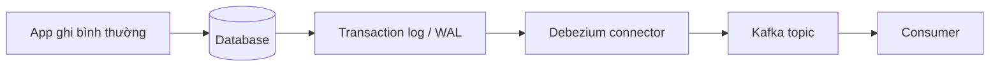
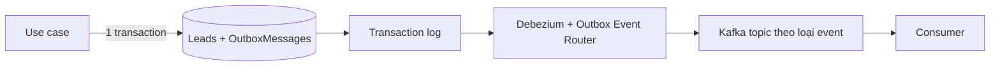

# 17.5 — 5. CDC (Change Data Capture)

> Nguồn: https://tiennhm.io.vn/en/docs/dotnet-backend-zero-to-senior/stage-05-senior-engineering/module-17-distributed-systems/17.5-change-data-capture
> Đọc thay đổi từ transaction log thay vì poll bảng, Debezium và SQL Server CDC, vì sao stream row-diff mất intent, và cách kết hợp CDC với outbox.

> CDC đọc **transaction log** của database — thứ database **vốn đã ghi** để phục hồi — và biến mỗi thay đổi thành một sự kiện. Ưu điểm lớn nhất: **ứng dụng không cần sửa một dòng nào**, nên nó là cách khả thi duy nhất với hệ legacy không ai dám đụng vào. Nhưng có một hạn chế mang tính bản chất, thường chỉ lộ ra sau khi đã triển khai: CDC thấy **hàng đã đổi**, không thấy **vì sao đổi**. `Status` chuyển từ `New` sang `Won` — đó là lead được convert, hay là admin sửa nhầm rồi sửa lại? Consumer buộc phải **đoán intent từ row-diff**, và mọi thay đổi schema của bạn lập tức thành breaking change với họ. Cách kết hợp tốt nhất, được dùng nhiều trên production: đặt CDC lên **bảng outbox** thay vì lên bảng nghiệp vụ — giữ được intent rõ ràng mà không cần worker poll.

## Mục tiêu bài học

Sau bài này bạn có thể:

- Giải thích CDC log-based khác gì cách poll bảng theo timestamp.
- Bật CDC trên SQL Server và hiểu Debezium làm gì.
- Nêu đúng hạn chế về intent và coupling schema.
- Kết hợp CDC với outbox qua outbox event router.
- Chọn giữa CDC và outbox theo bối cảnh hệ thống.

## Nội dung bài học

### 17.6.1 — Log-based khác gì poll

Cách thủ công thường gặp:

```sql
-- Poll theo timestamp — co ba van de nghiem trong
SELECT * FROM Leads WHERE ModifiedUtc > @lastCheck;
```

| Vấn đề | Hậu quả |
|---|---|
| Không thấy `DELETE` | Hàng biến mất mà không sinh sự kiện nào |
| Mất thay đổi trung gian | Một hàng đổi 3 lần giữa hai lần poll chỉ cho 1 sự kiện |
| Tải lên bảng nghiệp vụ | Poll liên tục trên bảng đang phục vụ người dùng |

CDC log-based không có ba vấn đề đó, vì nó đọc **transaction log** — nơi database đã ghi **mọi** thay đổi theo đúng thứ tự, kể cả `DELETE`, kể cả các bước trung gian, và việc đọc log **không đụng vào bảng nghiệp vụ**.



### 17.6.2 — SQL Server CDC

```sql
EXEC sys.sp_cdc_enable_db;

EXEC sys.sp_cdc_enable_table
     @source_schema = N'dbo',
     @source_name   = N'Leads',
     @role_name     = NULL,
     @supports_net_changes = 1;
```

SQL Server tạo bảng `cdc.dbo_Leads_CT` chứa ảnh trước và sau của mỗi thay đổi:

```sql
SELECT __$operation, __$start_lsn, Id, Name, Status
FROM cdc.dbo_Leads_CT
ORDER BY __$start_lsn;
-- __$operation: 1 = delete, 2 = insert, 3 = anh TRUOC update, 4 = anh SAU update
```

Hai điều phải biết khi vận hành:

- **CDC cần SQL Server Agent chạy.** Agent dừng thì capture job dừng, log không được đọc và **transaction log phình to** — đây là nguyên nhân khá phổ biến của sự cố hết ổ đĩa.
- **Có retention mặc định.** Dữ liệu capture bị dọn sau vài ngày; consumer dừng lâu hơn khoảng đó sẽ **mất thay đổi vĩnh viễn**.

### 17.6.3 — Debezium

[Debezium](https://debezium.io/documentation/reference/stable/index.html) là connector đọc log của PostgreSQL, MySQL, SQL Server, MongoDB, Oracle và đẩy vào Kafka. Message nó sinh ra có dạng:

```json
{
  "before": { "id": "...", "status": "New",  "value": 1000 },
  "after":  { "id": "...", "status": "Won",  "value": 1000 },
  "op": "u",
  "ts_ms": 1727155200000,
  "source": { "table": "Leads", "lsn": 234567 }
}
```

Nhìn message này và hỏi: **chuyện gì đã xảy ra về mặt nghiệp vụ?** Bạn biết `status` đổi từ `New` sang `Won`. Bạn **không** biết đó là lead được convert qua use case chính thức, hay là một lần sửa tay để chữa dữ liệu sai, hay là một script migration. Ba việc đó có ý nghĩa nghiệp vụ **hoàn toàn khác nhau** nhưng sinh ra **cùng một** row-diff.

### 17.6.4 — Hai hạn chế cốt lõi

**Mất intent.** Consumer phải suy ra ý nghĩa từ row-diff:

```csharp
// Consumer phai DOAN — va doan sai la chuyen thuong
if (before.Status == "New" && after.Status == "Won")
{
    // Convert that? Sua tay? Rollback mot thao tac nham?
    await _billing.CreateSubscriptionAsync(after.Id);   // co the tao nham
}
```

So với một integration event nói thẳng ý định:

```csharp
public sealed record LeadConvertedIntegrationEvent(
    Guid EventId, Guid LeadId, Guid CustomerId, decimal ContractValue, DateTime OccurredAtUtc);
```

Không phải đoán gì cả.

**Coupling schema.** Message CDC **là** cấu trúc bảng của bạn. Đổi tên cột `Value` thành `ContractValue` — một refactor nội bộ hoàn toàn bình thường — và mọi consumer gãy. Bạn vừa biến schema database thành API công khai, giống hệt sai lầm publish domain event ra broker ([bài 17.2](17.1-event-driven-architecture-when-to-use.mdx)).

### 17.6.5 — Kết hợp CDC với outbox

Đây là cách dùng CDC tốt nhất, và nó lấy được ưu điểm của cả hai: ứng dụng ghi **outbox** (có intent rõ ràng), còn CDC đọc **bảng outbox** thay vì bảng nghiệp vụ — thay thế worker poll.



[Outbox Event Router](https://debezium.io/documentation/reference/stable/transformations/outbox-event-router.html) của Debezium bóc payload từ hàng outbox và định tuyến sang topic tương ứng:

```json
{
  "transforms": "outbox",
  "transforms.outbox.type": "io.debezium.transforms.outbox.EventRouter",
  "transforms.outbox.table.field.event.key": "aggregate_id",
  "transforms.outbox.table.field.event.payload": "payload",
  "transforms.outbox.route.by.field": "aggregate_type"
}
```

Lợi ích cụ thể so với worker poll ([bài 17.4](17.3-outbox-pattern-applied.mdx)):

| | Worker poll | CDC trên outbox |
|---|---|---|
| Độ trễ | Bằng chu kỳ poll (vài giây) | Gần tức thì |
| Tải lên database | Mỗi chu kỳ một truy vấn | Không truy vấn bảng |
| Nhiều instance | Phải tự lo khoá hàng | Connector lo |
| Hạ tầng cần thêm | Không | **Kafka Connect + Debezium** |

Hàng cuối là cái giá: bạn phải vận hành thêm Kafka Connect. Với hệ thống vừa và nhỏ, worker poll đơn giản hơn nhiều và độ trễ vài giây thường không thành vấn đề.

### 17.6.6 — Chọn cái nào

| Bối cảnh | Nên dùng |
|---|---|
| Hệ legacy không sửa được code | **CDC trên bảng nghiệp vụ** |
| Đồng bộ sang data warehouse, search index | **CDC** (row-diff là đúng thứ cần) |
| Hệ mới, cần intent nghiệp vụ rõ ràng | **Outbox** |
| Đã có Kafka Connect, cần độ trễ thấp | **CDC trên bảng outbox** |
| Đội nhỏ, hệ thống vừa phải | **Outbox với worker poll** |

Hàng thứ hai đáng chú ý: khi đích đến là data warehouse hay Elasticsearch, bạn **thật sự muốn** row-diff chứ không phải intent — CDC là lựa chọn đúng chứ không phải lựa chọn đành chấp nhận.

### 17.6.7 — Rà lại code của bạn

**Danh sách rà soát khi dùng CDC**

- [ ] Không poll bảng nghiệp vụ theo cột timestamp để phát hiện thay đổi.
- [ ] Nếu dùng SQL Server CDC, SQL Server Agent được giám sát và có cảnh báo.
- [ ] Biết rõ retention của dữ liệu capture và đã đặt cảnh báo khi consumer tụt lại.
- [ ] Consumer không phải đoán intent từ row-diff cho nghiệp vụ quan trọng.
- [ ] Đã cân nhắc CDC trên bảng outbox thay vì trên bảng nghiệp vụ.
- [ ] Thay đổi schema bảng được coi là breaking change nếu CDC đọc bảng đó.
- [ ] Có giám sát độ trễ của connector, không chỉ trạng thái sống chết.

## Bài tập áp dụng

1. **Bật CDC và quan sát.** Bật CDC trên một bảng SQL Server, chạy một `UPDATE` và một `DELETE`, rồi đọc bảng `cdc.*_CT` và giải thích ý nghĩa từng giá trị `__$operation`.

2. **Chứng minh mất intent.** Với cùng một hàng, thực hiện convert qua use case và sửa tay bằng `UPDATE`. So sánh hai bản ghi CDC sinh ra.

3. **Dựng Debezium với outbox router.** Dùng Docker Compose chạy Postgres, Kafka và Debezium. Ghi một hàng vào bảng outbox và xác nhận message xuất hiện đúng topic.

## Tự kiểm tra

### CDC log-based hơn gì so với poll bảng theo timestamp?

Poll theo timestamp không thấy DELETE, mất các thay đổi trung gian giữa hai lần poll, và tạo tải lên chính bảng đang phục vụ người dùng. CDC đọc transaction log nên thấy mọi thay đổi theo đúng thứ tự và không đụng vào bảng nghiệp vụ.

### Hạn chế bản chất của CDC là gì?

Nó thấy hàng đã đổi nhưng không thấy vì sao đổi. Một thay đổi trạng thái do use case chính thức, do sửa tay chữa dữ liệu, hay do script migration đều sinh ra cùng một row-diff, nên consumer phải đoán intent.

### Vì sao CDC gây coupling schema?

Vì message CDC chính là cấu trúc bảng, nên đổi tên một cột trong lần refactor nội bộ sẽ làm mọi consumer gãy. Schema database vô tình trở thành API công khai.

### Vì sao SQL Server Agent quan trọng khi bật CDC?

Vì capture job chạy trên Agent. Agent dừng thì log không được đọc và transaction log phình to, có thể dẫn tới hết ổ đĩa. Ngoài ra dữ liệu capture có retention, nên consumer dừng lâu hơn khoảng đó sẽ mất thay đổi vĩnh viễn.

### Đặt CDC lên bảng outbox có lợi gì?

Giữ được intent rõ ràng vì ứng dụng chủ động ghi event có ý nghĩa nghiệp vụ, đồng thời bỏ được worker poll nên độ trễ gần như tức thì và không tạo truy vấn lên database. Cái giá là phải vận hành thêm Kafka Connect và Debezium.

### Khi nào CDC là lựa chọn đúng chứ không phải lựa chọn đành chấp nhận?

Khi đích đến là data warehouse hoặc search index. Ở đó bạn thật sự muốn row-diff để đồng bộ dữ liệu chứ không cần intent nghiệp vụ, nên hạn chế của CDC không còn là hạn chế.

## Kết luận

Ba điều đáng nhớ nhất:

1. **CDC không cần sửa ứng dụng** — đó là lý do nó thắng với hệ legacy.
2. **CDC thấy thay đổi, không thấy ý định.** Với nghiệp vụ quan trọng, đó là hạn chế thật.
3. **CDC trên bảng outbox** là cách kết hợp tốt nhất khi bạn đã có Kafka Connect.

## Tham khảo

- [Debezium documentation](https://debezium.io/documentation/reference/stable/index.html)
- [Debezium Outbox Event Router](https://debezium.io/documentation/reference/stable/transformations/outbox-event-router.html)
- [About Change Data Capture (SQL Server)](https://learn.microsoft.com/en-us/sql/relational-databases/track-changes/about-change-data-capture-sql-server)
- [Transactional Outbox pattern](https://microservices.io/patterns/data/transactional-outbox.html)

## Điều hướng

- **Bài trước:** [17.4 — 4. So sánh Kafka và RabbitMQ (thực dụng)](17.4-kafka-vs-rabbitmq-pragmatic.mdx)
- **Bài tiếp theo:** [17.6 — 6. Retry và backoff](17.6-retry-and-backoff.mdx)
- **Về module:** [Trang mục lục](./)
