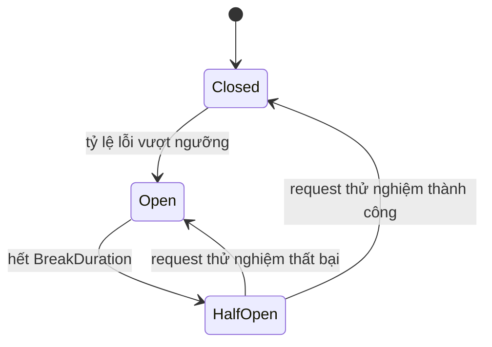

# 17.6 — 6. Retry và backoff

> Nguồn: https://tiennhm.io.vn/en/docs/dotnet-backend-zero-to-senior/stage-05-senior-engineering/module-17-distributed-systems/17.6-retry-and-backoff
> Phân biệt lỗi tạm thời với poison message, vì sao jitter là bắt buộc, retry hai tầng, circuit breaker và DLQ không phải nơi để quên.

> Retry là con dao hai lưỡi rõ rệt nhất trong hệ phân tán: đúng chỗ thì nó biến lỗi mạng thoáng qua thành chuyện không ai biết, sai chỗ thì nó **biến một sự cố nhỏ thành sự cố toàn hệ thống**. Ba điều kiện phải đủ trước khi bật retry. Một, thao tác phải **idempotent** — retry một lệnh trừ tiền không idempotent là trừ tiền hai lần. Hai, phải phân biệt **lỗi tạm thời** (timeout, 503 — retry giúp ích) với **poison message** (sai schema, bug logic — retry vô ích và chỉ làm nghẽn hàng đợi). Ba, **jitter là bắt buộc chứ không phải tối ưu hoá**: nếu 500 consumer cùng gặp lỗi rồi cùng retry sau đúng 2 giây, bạn vừa tạo một đợt tấn công đồng bộ vào chính service đang ốm. Và DLQ chỉ có giá trị nếu **có người theo dõi nó**.

## Mục tiêu bài học

Sau bài này bạn có thể:

- Phân biệt lỗi tạm thời và poison message trong code.
- Cài exponential backoff có jitter và giải thích vì sao cần jitter.
- Thiết kế retry hai tầng: ngay lập tức và có trì hoãn.
- Dùng circuit breaker để không dồn tải lên service đang hỏng.
- Vận hành DLQ như một hàng đợi cần xử lý, không phải thùng rác.

## Nội dung bài học

### 17.7.1 — Điều kiện tiên quyết: idempotency

```csharp
// KHÔNG idempotent — retry = trừ tiền hai lần
public async Task ChargeAsync(Guid orderId, decimal amount, CancellationToken ct)
{
    await _paymentGateway.ChargeAsync(amount, ct);   // timeout -> retry -> tru 2 lan
}
```

Điều nguy hiểm ở đây: **timeout không có nghĩa là thất bại**. Request có thể đã tới nơi và đã được xử lý, chỉ có phản hồi bị mất trên đường về. Retry trong trường hợp đó là trừ tiền lần thứ hai.

```csharp
// Idempotent — gateway nhận diện key và trả về kết quả cũ
public async Task ChargeAsync(Guid orderId, decimal amount, CancellationToken ct)
{
    await _paymentGateway.ChargeAsync(
        amount,
        idempotencyKey: $"order-{orderId}",      // gateway tu chan trung
        ct);
}
```

**Quy tắc:** không bật retry cho thao tác chưa idempotent ([bài 17.3](17.2-messaging-fears-lost-duplicates.mdx)). Làm idempotent trước, retry sau.

### 17.7.2 — Phân loại lỗi

| Loại | Ví dụ | Xử lý |
|---|---|---|
| **Tạm thời** | Timeout, 503, deadlock, mất kết nối | **Retry có backoff** |
| **Poison** | JSON sai, thiếu trường bắt buộc, `NullReferenceException` | **Vào DLQ ngay** |
| **Nghiệp vụ** | Lead không tồn tại, số dư không đủ | **Không retry** — ghi nhận và dừng |

Retry một poison message 5 lần là lãng phí 5 lần, và trong lúc đó nó **chiếm chỗ** của message hợp lệ phía sau.

```csharp
public async Task ConsumeAsync(ConsumeContext<LeadConvertedEvent> context)
{
    try
    {
        await _handler.HandleAsync(context.Message, context.CancellationToken);
    }
    catch (Exception ex) when (IsTransient(ex))
    {
        throw;                                    // de pipeline retry
    }
    catch (Exception ex)
    {
        _logger.LogError(ex, "Poison message {MessageId}", context.MessageId);
        await context.Send(_dlqUri, context.Message);     // vao DLQ ngay
    }
}

private static bool IsTransient(Exception ex) => ex switch
{
    TimeoutException => true,
    HttpRequestException => true,
    SqlException s => s.Number is 1205 or -2 or 49918,   // deadlock, timeout, busy
    _ => false
};
```

Chi tiết dễ bỏ sót: `SqlException 1205` là **deadlock victim** — lỗi này **luôn** đáng retry, và retry gần như luôn thành công vì lần chạy sau thường không trùng thứ tự khoá ([bài 12.7](../../stage-04-database-production/module-12-sql-deep-dive/12.6-transactions-and-locking.mdx)).

### 17.7.3 — Jitter: vì sao bắt buộc

```csharp
// SAI — 500 consumer cùng retry tại chính xác giây thứ 2, 4, 8
var delay = TimeSpan.FromSeconds(Math.Pow(2, attempt));
```

Kịch bản thực tế: database quá tải 1 giây, 500 consumer cùng timeout. Cả 500 cùng chờ 2 giây, rồi **cùng lúc** đánh vào database đang hồi phục. Nó sập lần nữa. Cả 500 cùng chờ 4 giây, rồi lại cùng đánh. Đây là **thundering herd** — retry đang **ngăn** hệ thống hồi phục.

```csharp
// ĐÚNG — full jitter: mỗi consumer chờ một khoảng NGẪU NHIÊN
private static TimeSpan GetDelay(int attempt)
{
    var maxDelay = Math.Min(Math.Pow(2, attempt), 60);      // tran 60 giay
    var jittered = Random.Shared.NextDouble() * maxDelay;   // [0, maxDelay)
    return TimeSpan.FromSeconds(jittered);
}
```

Tải retry giờ **trải đều** thay vì dồn thành các đỉnh nhọn. [AWS phân tích chi tiết](https://aws.amazon.com/builders-library/timeouts-retries-and-backoff-with-jitter/) và kết luận full jitter cho kết quả tốt nhất trong hầu hết trường hợp — đơn giản hơn và hiệu quả hơn các biến thể phức tạp.

Với .NET, `Microsoft.Extensions.Http.Resilience` đã có sẵn:

```csharp
builder.Services.AddHttpClient<BillingClient>()
    .AddStandardResilienceHandler(options =>
    {
        options.Retry.MaxRetryAttempts = 3;
        options.Retry.BackoffType = DelayBackoffType.Exponential;
        options.Retry.UseJitter = true;                 // bat buoc
        options.AttemptTimeout.Timeout = TimeSpan.FromSeconds(10);
    });
```

`AddStandardResilienceHandler` gói sẵn timeout, retry, circuit breaker và rate limiter theo thứ tự đúng.

### 17.7.4 — Retry hai tầng

Một mức retry duy nhất phục vụ hai nhu cầu mâu thuẫn: lỗi mạng chớp nhoáng cần thử **lại ngay**, còn service down cần **chờ lâu**. MassTransit tách làm hai tầng:

```csharp
cfg.ReceiveEndpoint("lead-converted", e =>
{
    // Tầng 1: lỗi chớp nhoáng — thử lại ngay, message GIỮ trong bộ nhớ
    e.UseMessageRetry(r => r.Immediate(3));

    // Tầng 2: lỗi kéo dài — TRẢ message về queue, consumer khác có thể xử lý
    e.UseScheduledRedelivery(r => r.Intervals(
        TimeSpan.FromMinutes(1),
        TimeSpan.FromMinutes(5),
        TimeSpan.FromMinutes(15)));

    e.Consumer<LeadConvertedConsumer>();
});
```

Khác biệt quan trọng giữa hai tầng: **retry ngay** giữ message trong bộ nhớ consumer và **chiếm** một slot xử lý; **redelivery** trả message về broker, giải phóng consumer để xử lý message khác. Nếu chỉ có tầng 1 với khoảng chờ dài, một service down 10 phút sẽ làm toàn bộ consumer của bạn ngồi chờ và hàng đợi dồn ứ.

### 17.7.5 — Circuit breaker

Retry giải quyết lỗi thoáng qua. Khi service phía sau **đang chết hẳn**, retry chỉ làm nó chết lâu hơn.

```csharp
// Chan hoan toan sau khi ty le loi vuot nguong
options.CircuitBreaker.FailureRatio = 0.5;                          // 50% loi
options.CircuitBreaker.MinimumThroughput = 10;                      // toi thieu 10 request
options.CircuitBreaker.SamplingDuration = TimeSpan.FromSeconds(30);
options.CircuitBreaker.BreakDuration = TimeSpan.FromSeconds(15);
```

Ba trạng thái:



Khi mở, lời gọi **thất bại ngay** không cần đi ra mạng. Hai lợi ích: service đang ốm được **giảm tải** để hồi phục, và bên gọi **không bị treo** chờ timeout — tránh cạn thread pool và lan lỗi ngược lên.

`MinimumThroughput` quan trọng: không có nó, 1 lỗi trên 1 request cũng thành "100% lỗi" và mở circuit oan.

### 17.7.6 — DLQ không phải thùng rác

Message vào DLQ nghĩa là **có việc cần người xử lý**. DLQ không ai nhìn là dữ liệu mất một cách im lặng, chỉ chậm hơn.

```csharp
// Cảnh báo khi DLQ có message — ngưỡng là 1, không phải 100
_meter.CreateObservableGauge("dlq_message_count", () => GetDlqDepth());
```

Quy trình tối thiểu cần có:

1. **Cảnh báo** khi DLQ có message — ngưỡng là **1**.
2. **Xem được nội dung** message và lý do thất bại (stack trace, số lần retry).
3. **Replay được** sau khi sửa bug.
4. **Xoá được** message không còn ý nghĩa.

Mỗi message trong DLQ phải kèm ngữ cảnh chẩn đoán:

```csharp
await context.Send(_dlqUri, context.Message, c =>
{
    c.Headers.Set("FailureReason", ex.Message);
    c.Headers.Set("FailedAtUtc", DateTime.UtcNow.ToString("O"));
    c.Headers.Set("RetryCount", context.GetRetryAttempt());
    c.Headers.Set("CorrelationId", context.CorrelationId?.ToString());
});
```

Không có những header này, xử lý DLQ lúc 2 giờ sáng là đoán mò.

### 17.7.7 — Rà lại code của bạn

**Danh sách rà soát retry và backoff**

- [ ] Mọi thao tác có retry đều idempotent.
- [ ] Đã phân biệt lỗi tạm thời, poison message và lỗi nghiệp vụ trong code.
- [ ] Lỗi nghiệp vụ không bị retry.
- [ ] Backoff có jitter, không phải chu kỳ cố định.
- [ ] Có trần cho khoảng chờ để không chờ hàng giờ.
- [ ] Có retry hai tầng: thử lại ngay và trì hoãn trả về queue.
- [ ] Circuit breaker có MinimumThroughput để không mở oan.
- [ ] DLQ có cảnh báo với ngưỡng bằng 1.
- [ ] Message trong DLQ kèm lý do thất bại và correlation id.
- [ ] Có quy trình replay message từ DLQ sau khi sửa bug.

## Bài tập áp dụng

1. **Tái hiện thundering herd.** Chạy 200 task cùng retry với backoff cố định vào một endpoint, vẽ biểu đồ số request theo thời gian. Thêm full jitter và vẽ lại.

2. **Phân loại lỗi.** Viết hàm `IsTransient` cho dự án của bạn, liệt kê đầy đủ mã lỗi SQL đáng retry. Kiểm thử bằng cách ném từng loại exception.

3. **Quan sát circuit breaker.** Cấu hình `AddStandardResilienceHandler`, dựng một endpoint luôn trả 500, và ghi lại thời điểm circuit chuyển trạng thái.

## Tự kiểm tra

### Vì sao idempotency là điều kiện tiên quyết của retry?

Vì timeout không có nghĩa là thất bại. Request có thể đã tới nơi và đã được xử lý, chỉ có phản hồi bị mất trên đường về. Retry một thao tác không idempotent trong trường hợp đó sẽ thực hiện nó lần thứ hai, ví dụ trừ tiền hai lần.

### Ba loại lỗi cần phân biệt là gì?

Lỗi tạm thời như timeout, 503 hay deadlock thì retry có backoff. Poison message như JSON sai hay thiếu trường bắt buộc thì vào DLQ ngay vì retry vô ích và chiếm chỗ của message hợp lệ. Lỗi nghiệp vụ như số dư không đủ thì không retry, chỉ ghi nhận và dừng.

### Vì sao jitter là bắt buộc chứ không phải tối ưu hoá?

Vì không có jitter thì mọi consumer gặp lỗi cùng lúc sẽ cùng retry tại đúng những mốc thời gian giống nhau, tạo ra các đỉnh tải đồng bộ đánh vào service đang hồi phục. Đó là thundering herd, và nó khiến retry ngăn hệ thống hồi phục thay vì giúp.

### Retry ngay và redelivery có trì hoãn khác nhau thế nào?

Retry ngay giữ message trong bộ nhớ consumer và chiếm một slot xử lý, phù hợp với lỗi chớp nhoáng. Redelivery trả message về broker nên giải phóng consumer để xử lý message khác, phù hợp khi service phía sau down lâu.

### Circuit breaker giải quyết vấn đề gì mà retry không giải quyết được?

Khi service phía sau chết hẳn, retry chỉ dồn thêm tải và làm nó chết lâu hơn. Circuit breaker cho lời gọi thất bại ngay không đi ra mạng, vừa giảm tải cho service đang ốm vừa tránh cho bên gọi bị treo chờ timeout và cạn thread pool.

### Vì sao ngưỡng cảnh báo DLQ nên là 1?

Vì mỗi message vào DLQ là một việc cần người xử lý. DLQ không ai theo dõi chính là mất dữ liệu một cách im lặng, chỉ chậm hơn. Message trong DLQ cũng cần kèm lý do thất bại và correlation id để chẩn đoán được.

## Kết luận

Ba điều đáng nhớ nhất:

1. **Idempotent trước, retry sau.** Thứ tự ngược lại gây mất tiền thật.
2. **Jitter là bắt buộc.** Backoff cố định biến retry thành tấn công đồng bộ.
3. **DLQ cần người theo dõi**, nếu không nó chỉ là nơi mất dữ liệu chậm hơn.

## Tham khảo

- [Retry pattern](https://learn.microsoft.com/en-us/azure/architecture/patterns/retry)
- [Transient fault handling](https://learn.microsoft.com/en-us/azure/architecture/best-practices/transient-faults)
- [Timeouts, retries and backoff with jitter (AWS)](https://aws.amazon.com/builders-library/timeouts-retries-and-backoff-with-jitter/)
- [Building resilient apps with .NET](https://learn.microsoft.com/en-us/dotnet/core/resilience/)

## Điều hướng

- **Bài trước:** [17.5 — 5. CDC (Change Data Capture)](17.5-change-data-capture.mdx)
- **Bài tiếp theo:** [17.7 — 7. Demo tinh thần: Outbox + idempotency](17.7-outbox-idempotency-demo.mdx)
- **Về module:** [Trang mục lục](./)
