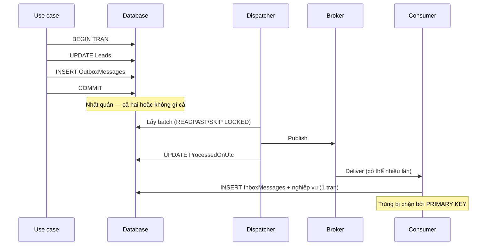

# 17.7 — 7. Demo tinh thần: Outbox + idempotency

> Nguồn: https://tiennhm.io.vn/en/docs/dotnet-backend-zero-to-senior/stage-05-senior-engineering/module-17-distributed-systems/17.7-outbox-idempotency-demo
> Code chạy được đầu-cuối: entity, interceptor, dispatcher an toàn nhiều instance, consumer idempotent, và ba bài test chứng minh nó đúng.

> Bài này ghép mọi thứ từ [17.3](17.2-messaging-fears-lost-duplicates.mdx), [17.4](17.3-outbox-pattern-applied.mdx) và [17.7](17.6-retry-and-backoff.mdx) thành một luồng **chạy được đầu-cuối**: use case ghi outbox trong cùng transaction → dispatcher publish an toàn kể cả khi chạy nhiều instance → consumer idempotent bằng inbox. Phần quan trọng nhất không phải code mà là **ba bài test cuối bài**: chúng chứng minh hệ thống chịu được crash sau commit, chịu được message trùng, và chịu được hai dispatcher chạy song song. Không có ba test đó, bạn chỉ **hy vọng** outbox hoạt động — và giả định đó thường chỉ được kiểm chứng lần đầu tiên vào đúng lúc sự cố xảy ra trên production.

## Mục tiêu bài học

Sau bài này bạn có thể:

- Ghép outbox, dispatcher và inbox thành một luồng hoàn chỉnh.
- Viết dispatcher dùng `READPAST`/`SKIP LOCKED` đúng cách.
- Cài consumer idempotent không có race condition.
- Kiểm thử ba tình huống hỏng quan trọng nhất.
- Giám sát luồng bằng các chỉ số đúng.

## Nội dung bài học

### 17.8.1 — Toàn cảnh



### 17.8.2 — Entity và cấu hình

```csharp
public sealed class OutboxMessage
{
    public Guid Id { get; set; }
    public DateTime OccurredOnUtc { get; set; }
    public string Type { get; set; } = null!;
    public string Payload { get; set; } = null!;
    public DateTime? ProcessedOnUtc { get; set; }
    public string? Error { get; set; }
    public int RetryCount { get; set; }
    public Guid? CorrelationId { get; set; }
}

public sealed class InboxMessage
{
    public Guid MessageId { get; set; }           // PRIMARY KEY — chan trung
    public string Type { get; set; } = null!;
    public DateTime ProcessedOnUtc { get; set; }
}
```

```csharp
public sealed class OutboxMessageConfiguration : IEntityTypeConfiguration<OutboxMessage>
{
    public void Configure(EntityTypeBuilder<OutboxMessage> b)
    {
        b.ToTable("OutboxMessages");
        b.HasKey(m => m.Id);
        b.Property(m => m.Type).HasMaxLength(300).IsRequired();
        b.Property(m => m.Payload).IsRequired();

        // Filtered index: chỉ chứa hàng CHƯA xử lý
        b.HasIndex(m => m.OccurredOnUtc)
         .HasFilter("[ProcessedOnUtc] IS NULL")
         .HasDatabaseName("IX_Outbox_Unprocessed");
    }
}
```

### 17.8.3 — Use case ghi outbox

```csharp
public sealed class ConvertLeadHandler(AppDbContext db) : IRequestHandler<ConvertLeadCommand, Result>
{
    public async Task<Result> Handle(ConvertLeadCommand request, CancellationToken ct)
    {
        var lead = await db.Leads.FirstOrDefaultAsync(l => l.Id == request.LeadId, ct);
        if (lead is null) return Result.NotFound("Lead không tồn tại");

        var customer = lead.Convert(DateTime.UtcNow);     // quy tac nghiep vu trong entity
        db.Customers.Add(customer);

        db.OutboxMessages.Add(new OutboxMessage
        {
            Id = Guid.NewGuid(),
            OccurredOnUtc = DateTime.UtcNow,
            Type = nameof(LeadConvertedIntegrationEvent),
            Payload = JsonSerializer.Serialize(new LeadConvertedIntegrationEvent(
                EventId: Guid.NewGuid(),
                LeadId: lead.Id,
                CustomerId: customer.Id,
                ContractValue: lead.Value.Amount,
                OccurredAtUtc: DateTime.UtcNow))
        });

        await db.SaveChangesAsync(ct);       // MỘT transaction cho cả ba thay đổi
        return Result.Success();
    }
}
```

Một `SaveChangesAsync`, một transaction. Lead đổi trạng thái, customer được tạo, và message nằm trong outbox — **cùng nhau hoặc không gì cả**.

### 17.8.4 — Dispatcher

```csharp
public sealed class OutboxDispatcher(
    IServiceScopeFactory scopeFactory,
    IPublishEndpoint publisher,
    ILogger<OutboxDispatcher> logger) : BackgroundService
{
    private const int BatchSize = 100;

    protected override async Task ExecuteAsync(CancellationToken ct)
    {
        while (!ct.IsCancellationRequested)
        {
            try
            {
                var processed = await DispatchBatchAsync(ct);

                // Còn việc thì làm tiếp ngay, hết việc thì nghỉ
                if (processed == 0)
                    await Task.Delay(TimeSpan.FromSeconds(5), ct);
            }
            catch (OperationCanceledException) when (ct.IsCancellationRequested)
            {
                break;                                   // shutdown binh thuong
            }
            catch (Exception ex)
            {
                logger.LogError(ex, "Outbox dispatcher lỗi, thử lại sau 5 giây");
                await Task.Delay(TimeSpan.FromSeconds(5), ct);
            }
        }
    }

    private async Task<int> DispatchBatchAsync(CancellationToken ct)
    {
        using var scope = scopeFactory.CreateScope();
        var db = scope.ServiceProvider.GetRequiredService<AppDbContext>();

        // READPAST: bỏ qua hàng instance khác đang khoá -> không publish trùng
        var messages = await db.OutboxMessages
            .FromSqlRaw($@"
                SELECT TOP ({BatchSize}) * FROM OutboxMessages WITH (READPAST, UPDLOCK)
                WHERE ProcessedOnUtc IS NULL
                ORDER BY OccurredOnUtc")
            .ToListAsync(ct);

        foreach (var message in messages)
        {
            try
            {
                var type = Type.GetType(message.Type)
                    ?? throw new InvalidOperationException($"Không tìm thấy type {message.Type}");
                var payload = JsonSerializer.Deserialize(message.Payload, type)!;

                await publisher.Publish(payload, type, ct);

                // Danh dau SAU khi publish -> at-least-once, consumer lo phan trung
                message.ProcessedOnUtc = DateTime.UtcNow;
            }
            catch (Exception ex)
            {
                message.RetryCount++;
                message.Error = ex.Message;
                logger.LogError(ex, "Publish thất bại {MessageId}, lần {Retry}",
                    message.Id, message.RetryCount);
            }
        }

        await db.SaveChangesAsync(ct);
        return messages.Count;
    }
}
```

Ba chi tiết dễ bị bỏ qua:

- **`catch (OperationCanceledException)` riêng.** Khi shutdown, `Task.Delay` ném exception này; nếu bị bắt chung vào nhánh log lỗi, mỗi lần dừng container sẽ sinh một dòng log lỗi giả ([bài 15.3](../../stage-04-database-production/module-15-docker-deployment/15.2-dockerfile-for-aspnet-core.mdx)).
- **Không `Delay` khi vừa xử lý xong một batch đầy.** Nếu hàng tồn 10.000 message mà mỗi 5 giây chỉ xử lý 100, bạn không bao giờ đuổi kịp.
- **Một message lỗi không chặn cả batch.** `try/catch` nằm **trong** vòng lặp, không bao ngoài.

### 17.8.5 — Consumer idempotent

```csharp
public sealed class LeadConvertedConsumer(BillingDbContext db, IBillingService billing)
    : IConsumer<LeadConvertedIntegrationEvent>
{
    public async Task Consume(ConsumeContext<LeadConvertedIntegrationEvent> context)
    {
        var evt = context.Message;
        var ct = context.CancellationToken;

        await using var tx = await db.Database.BeginTransactionAsync(ct);

        db.InboxMessages.Add(new InboxMessage
        {
            MessageId = evt.EventId,
            Type = nameof(LeadConvertedIntegrationEvent),
            ProcessedOnUtc = DateTime.UtcNow
        });

        try
        {
            await db.SaveChangesAsync(ct);          // "gianh cho" message nay
        }
        catch (DbUpdateException ex) when (ex.IsUniqueViolation())
        {
            return;                                  // đã xử lý rồi -> bỏ qua, ACK bình thường
        }

        var subscription = Subscription.CreateDraft(evt.CustomerId, evt.ContractValue);
        db.Subscriptions.Add(subscription);
        await db.SaveChangesAsync(ct);

        await tx.CommitAsync(ct);                    // inbox + nghiệp vụ commit CÙNG NHAU
    }
}
```

`tx.CommitAsync` ở cuối là điều kiện cho tính đúng đắn: nếu tạo subscription thất bại, transaction rollback và **hàng inbox cũng biến mất**, nên lần retry sau sẽ xử lý lại bình thường chứ không bị bỏ qua nhầm.

### 17.8.6 — Ba bài test bắt buộc

```csharp
// 1. Crash sau commit -> message KHÔNG mất
[Fact]
public async Task Outbox_ShouldSurvive_CrashAfterCommit()
{
    await _sender.Send(new ConvertLeadCommand(leadId));   // commit xong

    // Giả lập crash: không chạy dispatcher, tạo scope mới hoàn toàn
    await using var freshScope = _factory.Services.CreateAsyncScope();
    var db = freshScope.ServiceProvider.GetRequiredService<AppDbContext>();

    var pending = await db.OutboxMessages.Where(m => m.ProcessedOnUtc == null).ToListAsync();
    Assert.Single(pending);        // message vẫn còn, sẽ được publish khi dispatcher chạy lại
}

// 2. Message trùng -> chỉ xử lý MỘT lần
[Fact]
public async Task Consumer_ShouldBeIdempotent_WhenMessageDeliveredTwice()
{
    var evt = new LeadConvertedIntegrationEvent(Guid.NewGuid(), leadId, customerId, 1000, DateTime.UtcNow);

    await _consumer.Consume(CreateContext(evt));
    await _consumer.Consume(CreateContext(evt));        // CÙNG EventId

    var count = await _billingDb.Subscriptions.CountAsync(s => s.CustomerId == customerId);
    Assert.Equal(1, count);
}

// 3. Hai dispatcher song song -> không publish trùng
[Fact]
public async Task TwoDispatchers_ShouldNotPublish_SameMessageTwice()
{
    await SeedOutboxAsync(count: 200);

    await Task.WhenAll(
        RunDispatcherAsync(instance: 1),
        RunDispatcherAsync(instance: 2));

    Assert.Equal(200, _fakeBus.Published.Count);
    Assert.Equal(200, _fakeBus.Published.Select(m => m.EventId).Distinct().Count());
}
```

Test 3 **phải chạy trên database thật** (Testcontainers) — provider InMemory không có khoá nên `READPAST` không có ý nghĩa gì và test sẽ xanh một cách vô nghĩa ([bài 16.10](../module-16-clean-architecture/16.9-testing-strategy-overview.mdx)).

### 17.8.7 — Giám sát

```csharp
// Chỉ số quan trọng nhất: tuổi của message chưa xử lý CŨ NHẤT
_meter.CreateObservableGauge("outbox_oldest_pending_seconds", () =>
{
    var oldest = db.OutboxMessages
        .Where(m => m.ProcessedOnUtc == null)
        .Min(m => (DateTime?)m.OccurredOnUtc);

    return oldest is null ? 0 : (DateTime.UtcNow - oldest.Value).TotalSeconds;
});
```

Chỉ số này tốt hơn "số message chưa xử lý": 10.000 message vừa tạo trong một giây là bình thường, nhưng **một** message kẹt 10 phút là sự cố. Đếm số lượng không phân biệt được hai tình huống đó; đo tuổi thì có.

Hai chỉ số nên có cùng: `outbox_publish_failures_total` và `inbox_duplicates_total` — cái sau tăng đột biến là dấu hiệu consumer đang ACK thất bại.

### 17.8.8 — Rà lại code của bạn

**Danh sách rà soát luồng outbox đầu-cuối**

- [ ] Use case ghi outbox và thay đổi nghiệp vụ trong cùng một SaveChangesAsync.
- [ ] Dispatcher dùng READPAST hoặc SKIP LOCKED.
- [ ] Dispatcher không nghỉ khi vừa xử lý xong một batch đầy.
- [ ] Một message lỗi không chặn các message còn lại trong batch.
- [ ] OperationCanceledException khi shutdown được xử lý riêng.
- [ ] Consumer ghi inbox và thay đổi nghiệp vụ trong cùng transaction.
- [ ] Chống trùng dựa vào primary key, không dựa vào câu if.
- [ ] Có test cho crash sau commit, message trùng, và hai dispatcher song song.
- [ ] Test chạy trên database thật, không dùng provider InMemory.
- [ ] Giám sát tuổi của message chưa xử lý cũ nhất, không chỉ đếm số lượng.

## Bài tập áp dụng

1. **Dựng luồng đầy đủ.** Cài use case, dispatcher và consumer như trên với RabbitMQ chạy trong Docker. Gửi một lệnh convert và theo dõi message đi qua từng bước.

2. **Viết ba bài test.** Cài cả ba test ở mục 17.8.6 với Testcontainers. Xác nhận test 3 **thất bại** khi bỏ `READPAST`.

3. **Thêm chỉ số.** Cài `outbox_oldest_pending_seconds`, dừng dispatcher 2 phút và quan sát giá trị tăng.

## Tự kiểm tra

### Vì sao use case chỉ nên gọi SaveChangesAsync một lần?

Vì một lần gọi là một transaction, nên thay đổi nghiệp vụ và hàng outbox được commit cùng nhau hoặc không gì cả. Gọi hai lần tạo ra khoảng giữa mà tiến trình có thể chết, và đó chính là dual write problem.

### Vì sao dispatcher không nên nghỉ khi vừa xử lý xong một batch đầy?

Vì batch đầy nghĩa là có thể còn message chờ. Nếu tồn 10.000 message mà mỗi 5 giây chỉ xử lý 100 thì hàng đợi không bao giờ được rút hết. Chỉ nghỉ khi batch trả về rỗng.

### Vì sao try catch phải nằm trong vòng lặp message chứ không bao ngoài?

Để một message lỗi không chặn các message còn lại trong batch. Nếu bao ngoài, một poison message sẽ làm cả batch dừng và lặp lại mãi ở cùng vị trí.

### Vì sao OperationCanceledException cần xử lý riêng?

Vì khi container dừng, Task.Delay ném exception này một cách bình thường. Bắt chung vào nhánh log lỗi sẽ sinh một dòng lỗi giả mỗi lần shutdown, làm nhiễu log và gây báo động sai.

### Vì sao commit transaction ở cuối consumer lại quan trọng?

Vì nếu phần nghiệp vụ thất bại thì transaction rollback và hàng inbox cũng biến mất, nên lần retry sau xử lý lại bình thường. Nếu inbox commit riêng trước, message bị đánh dấu đã xử lý trong khi thực ra chưa, và nó bị bỏ qua vĩnh viễn.

### Vì sao đo tuổi message chưa xử lý tốt hơn đếm số lượng?

Vì mười nghìn message vừa tạo trong một giây là bình thường, còn một message kẹt mười phút là sự cố. Đếm số lượng không phân biệt được hai tình huống đó, đo tuổi thì phân biệt được ngay.

## Kết luận

Ba điều đáng nhớ nhất:

1. **Một `SaveChangesAsync` cho cả nghiệp vụ và outbox** — đó là toàn bộ tính đúng đắn của phía gửi.
2. **Ba bài test là phần quan trọng nhất của bài này**, vì không có chúng bạn chỉ đang hy vọng.
3. **Giám sát tuổi, không giám sát số lượng.**

## Tham khảo

- [Transactional Outbox pattern](https://microservices.io/patterns/data/transactional-outbox.html)
- [MassTransit transactional outbox](https://masstransit.io/documentation/patterns/transactional-outbox)
- [Idempotent consumer](https://learn.microsoft.com/en-us/dotnet/architecture/microservices/multi-container-microservice-net-applications/subscribe-events)
- [Testing in .NET](https://learn.microsoft.com/en-us/dotnet/core/testing/)

## Điều hướng

- **Bài trước:** [17.6 — 6. Retry và backoff](17.6-retry-and-backoff.mdx)
- **Bài tiếp theo:** [17.8 — 8. MassTransit / NServiceBus / EasyNetQ](17.8-masstransit-nservicebus-easynetq.mdx)
- **Về module:** [Trang mục lục](./)
