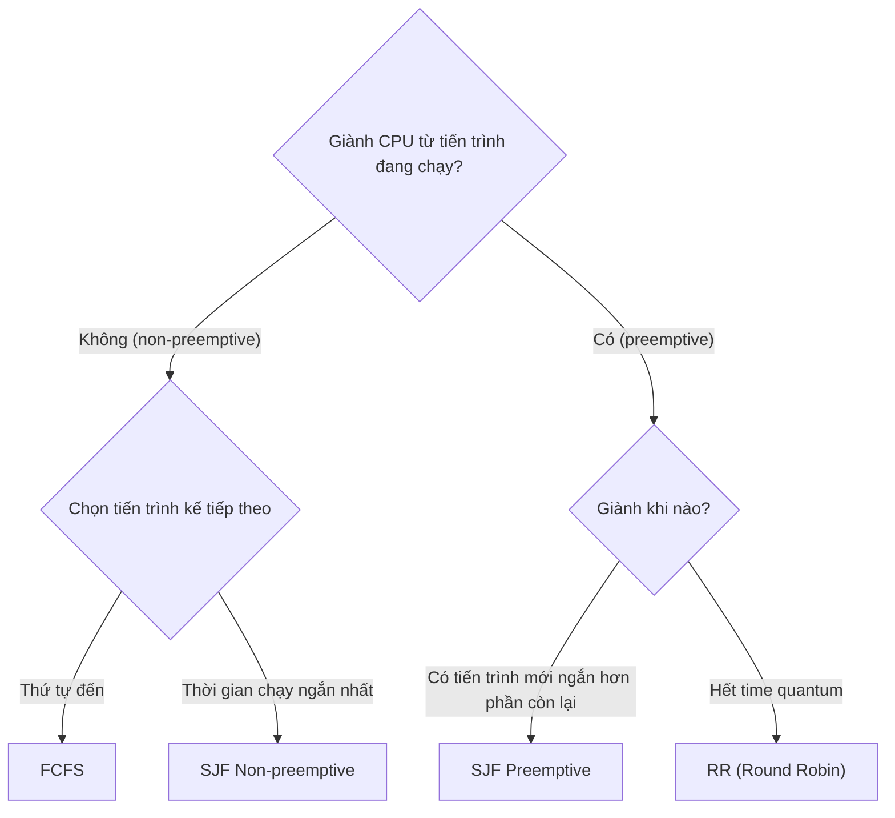

# Các thuật toán lập lịch tiến trình

> Nguồn: https://tiennhm.io.vn/en/docs/operating-system/process-scheduling-algorithms
> Giới thiệu về các thuật toán lập lịch tiến trình (process scheduling algorithms) trong hệ điều hành.

## Giới thiệu

Trong bài viết này, mình sẽ giới thiệu các thuật toán lập lịch tiến trình (process scheduling algorithms) trong hệ điều hành. Các thuật toán này được sử dụng để lập lịch các tiến trình (process) trong hệ điều hành.

## Các thuật toán lập lịch tiến trình

Các thuật toán dưới đây khác nhau ở hai câu hỏi: có giành CPU từ tiến trình đang chạy hay không, và chọn tiến trình nào chạy tiếp.

### FCFS

Thuật toán FCFS (First Come First Served) sẽ lập lịch các tiến trình theo thứ tự đến trước thì được lập lịch trước. Thuật toán này dễ hiểu và dễ cài đặt, nhưng nó không phải là thuật toán tối ưu.

### SJF

Thuật toán SJF (Shortest Job First) sẽ lập lịch các tiến trình theo thứ tự thời gian thực thi ngắn nhất thì được lập lịch trước. Thuật toán này là thuật toán tối ưu nhất, nhưng nó không thể cài đặt được.

#### SJF Non-preemptive

Thuật toán SJF Non-preemptive sẽ lập lịch các tiến trình theo thứ tự thời gian thực thi ngắn nhất thì được lập lịch trước. Thuật toán này là thuật toán tối ưu nhất, nhưng nó không thể cài đặt được.

#### SJF Preemptive

Thuật toán SJF Preemptive sẽ lập lịch các tiến trình theo thứ tự thời gian thực thi ngắn nhất thì được lập lịch trước. Thuật toán này là thuật toán tối ưu nhất, nhưng nó không thể cài đặt được.

### RR

Thuật toán RR (Round Robin) sẽ lập lịch các tiến trình theo thứ tự vòng tròn. Thuật toán này dễ hiểu và dễ cài đặt, nhưng nó không phải là thuật toán tối ưu.

#### Part 1

#### Part 2

## Tổng kết

Trong bài viết này, mình đã giới thiệu các thuật toán lập lịch tiến trình trong hệ điều hành. Hy vọng bài viết này sẽ giúp ích cho các bạn.

> **Info: Bên cạnh các thuật toán trên, còn có các thuật toán khác như: Shortest Remaining Time First, Multilevel Queue, Multilevel Feedback Queue, ... Các bạn có thể tìm hiểu thêm về các thuật toán này.**
>
>
> **Tip: Luyện tập**
>
> Thử sức với [trắc nghiệm tiến trình và lập lịch CPU](./05-quiz/02.process-scheduling.mdx): FCFS, SJF, SRTF, Round Robin và Multilevel Feedback Queue chạy trên **cùng một bộ dữ liệu** để thấy rõ khác biệt, mỗi câu kèm sơ đồ Gantt và cách tính thời gian chờ từng bước.
>
> Hai chủ đề đi liền ngay sau lập lịch: [trắc nghiệm đồng bộ tiến trình](./05-quiz/03.synchronization.mdx) và [trắc nghiệm deadlock](./05-quiz/04.deadlock.mdx).
> **Tip: Để xem thêm các video khác, các bạn có thể truy cập vào [kênh Youtube](https://www.youtube.com/TienNguyen09) của mình.**
>
>
