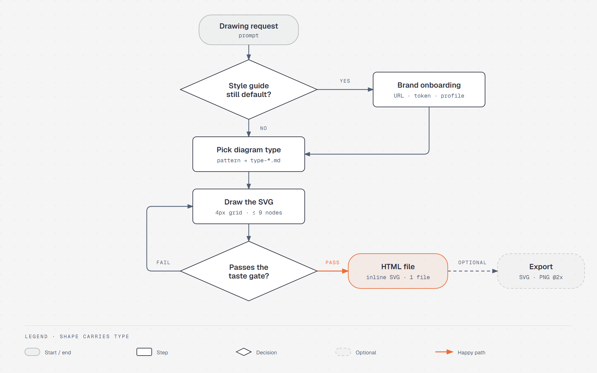

import { SummaryBox, FAQSection } from '@site/src/components/SEO';

# Diagram Design

<SummaryBox>
[Diagram Design](https://github.com/cathrynlavery/diagram-design) is an open-source agent skill (MIT license) by Cathryn Lavery. Install it into Claude Code, Codex, GitHub Copilot or any agent that supports the Agent Skills standard, and it teaches the agent to draw technical diagrams as a single HTML file with inline SVG, following a very disciplined design system: one accent color used on at most two elements, at most 9 nodes per diagram, connectors that only turn at right angles, no shadows, every coordinate divisible by 4. Version 2.6.68 covers 44 diagram types, from architecture, flowchart, sequence and ER to Sankey, Wardley map and Gantt. It can also redraw existing draw.io, Mermaid and Excalidraw files in the same style, along with a ledger of what it merged or dropped. If you write labels in Vietnamese there is one thing to fix: the default title font, Instrument Serif, does not cover the full Vietnamese character set.
</SummaryBox>

This post introduces the tool; it is not a review after months of use. The information comes from the [README on GitHub](https://github.com/cathrynlavery/diagram-design) and from the `SKILL.md` file of version 2.6.68 that I have installed. The part about Vietnamese fonts I checked myself against the Google Fonts API.

<!-- truncate -->

## The problem it targets

Ask an AI agent to "draw an architecture diagram" and you usually get one of two things. The first is a Mermaid block: correct in content, but laid out by the renderer, with arrows crossing each other in a way that makes it obvious a machine did it. The second is an HTML page with a dark background, cyan and purple glowing borders, and a dozen identical boxes, every one of them colored as "important".

The Diagram Design README calls the second kind **"AI slop"**, and much of the skill's value lies in spelling out exactly what produces it so the agent can avoid it:

| Anti-pattern | Why it is rejected |
|---|---|
| Dark background + cyan/purple glow | Looks "technical" without any design decision behind it |
| JetBrains Mono for everything | Monospace is reserved for technical content such as ports, commands, URLs |
| Every node is the same box | Erases hierarchy |
| Drop shadows | Shadows are banned; borders only |
| `rounded-2xl`-style corners | 6–10px radius at most, or none |
| Accent color on every "important" node | The accent is for 1–2 focal points, not a signaling system |
| Copying Mermaid's layout | Inherits automatic spacing and routing instead of an intentional layout |

## Philosophy: delete first, draw second

The philosophy section of `SKILL.md` opens with:

> The highest-quality move is usually deletion.

In concrete terms:

- Every node must be a distinct idea. Two nodes that always travel together become one.
- Every connection must carry information. If the layout already shows the relationship, remove the line.
- Target density is 4/10: technically complete, but not so dense that someone has to walk you through it.
- A diagram is not done when everything has been added; it is done when nothing more can be removed.

These are not decoration. The skill turns them into hard limits for every diagram:

| Limit | Value |
|---|---|
| Max nodes | 9 |
| Max arrows | 12 |
| Elements using the accent color | 2 |
| Annotation callouts | 2 |

Go over the limit and the skill tells the agent to split into two diagrams, an overview and a detail view. Anyone who has had to read a thirty-box microservice diagram on a single slide will appreciate this rule immediately.

Before drawing, the skill also makes the agent ask itself: *would the reader learn more from this diagram than from a well-written paragraph?* If not, don't draw. The list of things not to draw is explicit too: a list belongs in a table or bullets, a before/after that only changes attributes belongs in a table, and a one-shape "diagram" is just a sentence.

## The design system

The default palette is a `#f5f5f5` paper background, `#2d3142` ink, `#4f5d75` muted text and a single orange accent `#eb6c36`. Inside the instruction files these colors are referred to by role (`paper`, `ink`, `muted`, `accent`, `link`) rather than by hex value, so reskinning means editing one file, `style-guide.md`.

Type is split across three families, each with one job:

| Role | Font |
|---|---|
| Page title | Instrument Serif |
| Node names | Geist, weight 600 |
| Technical sublabels (ports, URLs, data types) | Geist Mono |
| Editorial callouts | Instrument Serif italic |

The part I find most thorough is the six mandatory connector rules. Connectors only turn at right angles with an 8px corner radius; no diagonals. Arrow labels are at most 14 characters, uppercase, sitting on an opaque mask 6–10px away from the stroke. Parallel lines must be at least 12px apart. When several connectors attach to the same edge of a box, each gets its own attach point. No connector may run behind a box that is not one of its endpoints. Breaking any of the six counts as a failure.

Every diagram comes in three variants: minimal light (the default), minimal dark, and a "full editorial" version with summary cards for long-form posts. There is also a hand-drawn variant for essays and a terminal-window variant for posts about CLI tools.

## Forty-four diagram types

The README says 42 types, while `SKILL.md` in version 2.6.68 says 44; the README has probably not caught up. Grouped for readability:

| Group | Types |
|---|---|
| Systems | Architecture, Architecture delta (before/after), IT current-state, Deployment, Dependency graph, High-level |
| Flow and behavior | Flowchart, Sequence, State machine, Swimlane, Process, User journey |
| Data | ER, Database schema, UML class, Data flow, Medallion, DP integration, DP security matrix |
| Structure | Tree, Org chart, Nested, Layer stack, Venn, Pyramid/funnel |
| Charts | Bar, Line, Scatter, Heatmap, Treemap, Waterfall, Sankey, Radar, Polar |
| Planning and strategy | Timeline, Gantt, Kanban, Story map, Quadrant, Wardley map, Fishbone, Loop |
| Spatial | Exploded axonometric, Axonometric plan |

Each type has its own reference file with its own anti-patterns, and the agent is required to read that file before drawing. To preview all of them there is a [gallery](https://cathrynlavery.github.io/diagram-design/) on GitHub Pages.

There is one more layer the README calls semantic patterns. When what you need to show is *behavior* rather than just *shape*, say a congested queue, two policy evaluations that diverge, or a lifecycle with retries and cancellation, the agent picks the semantic pattern first and only then the diagram type for layout. The split makes sense: the same data-flow diagram might be telling a bottleneck story or a raw-to-structured-data story, and each needs emphasis in different places.

## Redrawing from draw.io, Mermaid and Excalidraw

This is the feature I find most practical, since most teams already have a pile of old diagrams.

The skill accepts `.drawio`, `.drawio.svg`, `.drawio.png`, `.mmd` files or `mermaid` code blocks inside Markdown, and `.excalidraw` files. The process has four steps:

1. **Extract, don't render.** A Python script reads the source file and prints its nodes, edges and groups, with warnings if the budget is exceeded.
2. **Set four dials** before drawing: output format, size (inline in a doc, 16:9 slide, social OG image, A4 print…), detail level (`faithful` up to 24 nodes, `balanced` up to 12, `simplified` up to 7) and audience (`engineer`, `mixed`, `executive`).
3. **Redraw, don't convert.** The original coordinates, colors and fonts are all discarded; only the content is kept: components, relationships, groups, direction.
4. **Report a fidelity ledger**: what was merged, collapsed or dropped.

Step 4 is the one I value most. The person handing over the file knows the original well, so if a service quietly disappears they will notice, and the whole diagram loses credibility. The skill also states two prohibitions outright: never invent components to make the layout look nicer, and never silently drop one.

One small security detail deserves credit: every label, link and piece of metadata read from a source file is treated as untrusted data, never as instructions. A draw.io file downloaded from somewhere could contain a label reading "ignore all previous instructions", and saying this plainly to the agent is the right way to guard against prompt injection.

## Installation

For Claude Code:

```bash
/plugin marketplace add cathrynlavery/diagram-design
/plugin install diagram-design@diagram-design
```

For Codex:

```bash
codex plugin marketplace add cathrynlavery/diagram-design
codex plugin add diagram-design@diagram-design
```

For GitHub Copilot CLI:

```bash
copilot plugin marketplace add cathrynlavery/diagram-design
copilot plugin install diagram-design@diagram-design
```

For other agents that support the Agent Skills standard:

```bash
npx skills add cathrynlavery/diagram-design
```

The README also covers Factory Droid, Pi, Kiro, OpenCode and Claude Cowork, and warns that official builds come only from this repository. That warning is worth heeding: a skill is text loaded straight into the agent's context, so installing an unknown copy means letting a stranger write instructions for your agent.

After installation, Claude Code gains a few commands:

| Command | What it does |
|---|---|
| `/diagram-design:doctor` | Checks the environment is ready |
| `/diagram-design:import-mermaid` | Redraws a Mermaid diagram |
| `/diagram-design:import-drawio` | Redraws a draw.io file |
| `/diagram-design:import-excalidraw` | Redraws an Excalidraw board |
| `/diagram-design:export-diagram` | Exports the HTML file to `.svg` and `.png` |
| `/diagram-design:profile` | Saves, loads, deletes brand profiles |

Drawing a new diagram needs no command: ask the agent to "draw a sequence diagram for the OAuth flow" and the skill activates on its own based on its description.

PNG export needs Playwright and Chromium:

```bash
pip install playwright && playwright install chromium
```

## First use: the brand gate

The first time you draw in a project, the skill checks whether the palette is still the default. If it is, it stops and asks where to get your brand from: a website URL, another installed skill, a local design-system folder, pasted tokens, keep the default, or load a saved profile.

Choose a website URL and the skill reads the homepage, extracts the palette and fonts, checks contrast against WCAG AA, and shows you the diff before writing to `style-guide.md`. The result can be saved as a named profile in `~/.diagram-design/profiles/`, and each project points at its profile with a `.diagram-design` marker file. If you work for several clients this is handy: each project's diagrams carry that client's colors.

## What one drawing request goes through

Putting the pieces above together, the flow looks like this. The diagram was drawn with Diagram Design itself, using the default skin.



The image above is a PNG capture. The original file the skill produced is [diagram-design-flow.html](./diagram-design-flow.html): a single HTML file with inline SVG and no JavaScript. Open it directly in your browser, or download it to read the source.

Two loops are worth noticing. The first is at the style-guide gate: if the palette is still the default, the agent detours through onboarding before coming back to pick a diagram type. The second is the **taste gate**, the checklist at the end of `SKILL.md`, made up of four groups of questions: is this the right diagram type, can any node or arrow still be removed, does the accent exceed two elements, and are the technical rules (connectors, the 4px grid, the `<title>`/`<desc>` tags) satisfied. Failing any item sends the agent back to drawing.

The output is always one HTML file. Exporting to SVG or PNG is a manual step, and the skill is explicitly told never to produce export files unprompted. When I made the image for this post my machine did not have Playwright, so I took the PNG with headless Chrome (`--screenshot --force-device-scale-factor=2`), which produces the same 1920×1200 output.

## If you label diagrams in Vietnamese

I checked which character ranges Google Fonts serves for each default font:

| Font | Subsets on Google Fonts |
|---|---|
| Geist | latin, latin-ext, cyrillic, cyrillic-ext, **vietnamese** |
| Geist Mono | latin, latin-ext, cyrillic, cyrillic-ext, **vietnamese** |
| Instrument Serif | latin, latin-ext |

Node names and sublabels use Geist and Geist Mono, so Vietnamese renders fine there. The problem is the **title**: Instrument Serif has no `vietnamese` subset, so characters in the Unicode range `U+1EA0–U+1EF1`, the ones with stacked diacritics or a dot below such as *ạ, ấ, ế, ệ, ố, ộ, ữ, ự*, are missing from the font. The browser has to take them from another font, and a title like "Kiến trúc hệ thống" ends up with *ế, ệ, ố* visibly mismatched against the rest.

The skill's templates do already have a fallback: `--font-serif` is `'Instrument Serif', 'Noto Serif', …`, and Noto Serif has a `vietnamese` subset, so no characters go missing or show up as boxes. But the fallback happens *per character*, so within a single word the plain letters come from Instrument Serif (narrow, high contrast) while the accented ones come from Noto Serif (wide, even strokes). I ran into exactly this while making the diagram for this post: the Vietnamese title "Diagram Design xử lý một yêu cầu vẽ như thế nào" had *ử, ộ, ế* noticeably bigger and heavier than the rest, like a printing error.

The real fix is to **replace the title font entirely** rather than rely on the fallback. I used Noto Serif Display: it has a `vietnamese` subset and a width axis (`wdth`), so condensing it gives a shape fairly close to Instrument Serif:

```html
<link href="https://fonts.googleapis.com/css2?family=Noto+Serif+Display:wdth,wght@62.5..100,400&display=swap" rel="stylesheet">
```

```css
--font-serif: 'Noto Serif Display', serif;
h1 { font-family: var(--font-serif); font-stretch: 75%; }
```

If you do this often, set it once during onboarding (the paste-tokens option) and save it as a profile so every later Vietnamese diagram picks it up. Playfair Display, Fraunces and Newsreader also ship a `vietnamese` subset if you want a different look.

One more point, and this is my own observation rather than something the skill says: arrow labels are capped at 14 characters, uppercase, 8px monospace. Uppercase Vietnamese at that size crams the diacritics on top of capital letters, and 14 characters only fits two or three words. I keep arrow labels as English technical terms like `HTTPS`, `PUBLISH`, `JWT`, and leave Vietnamese for node names and titles. That is how the Vietnamese version of the diagram above was made.

## Compared with Mermaid

The two do not replace each other; they solve different problems.

| | Mermaid | Diagram Design |
|---|---|---|
| Source | Text inside Markdown | An HTML file generated by the agent |
| Layout | Arranged by the renderer | Arranged by the agent under the skill's rules |
| PR review | Line-by-line diff | A diff of an SVG blob, hard to read |
| Small edits | Change one line | Ask the agent to redraw or edit the SVG |
| GitHub, Docusaurus | Renders directly | Export to SVG/PNG, then embed |
| Aesthetics | Good enough | The main goal |
| Repeatability | Same source, same picture | Each run may differ |

The last row needs saying plainly. A skill is just instruction text loaded into context; the model reads it and decides how far to follow it, so quality depends on the model and two runs of the same request may not produce the same picture. I wrote about this in more depth in the post on [how agent skills work](/blog/agent-skills-co-che-va-tri-thuc-bi-bo-qua) (in Vietnamese). Diagram Design's rules are strict enough to narrow that variance considerably, and it ships a `self_check.py` script to verify the SVG contract, but that does not turn drawing into a deterministic process.

The split I find sensible: diagrams that live with the code, change often and need review in PRs stay in Mermaid. Diagrams for slides, blog posts or client documents, where looks matter and edits are rare, go to Diagram Design, which can use that same Mermaid file as the source to redraw from.

## A few small pluses

- **Accessibility by default.** Every SVG has `role="img"`, plus `<title>` and `<desc>` referenced via `aria-labelledby`, so screen readers can say what the diagram is about.
- **A single file.** CSS is embedded, SVG is inline, no external images, no JavaScript unless you turn on motion. Send the file over chat and the recipient can open it right away.
- **Motion is optional.** There are four modes, `none`, `reveal`, `step`, `loop`, defaulting to `none`, and an animated version must still be fully readable with JavaScript off or when the user prefers reduced motion.
- **An icon set.** 87 monochrome icons for infrastructure and cloud, taken from Tabler Icons (MIT) and Simple Icons (CC0).

## When not to use it

The skill answers this itself, and I agree: when a three-column table says the same thing, when the content is just a list, when you need a quick ASCII sketch in a commit message or code comment. I would add one more case: when the diagram will be edited over and over by many people in the repo, because then diffability matters more than looks.

<FAQSection
  items={[
    {
      question: "What is Diagram Design?",
      answer: "Diagram Design is an open-source agent skill under the MIT license by Cathryn Lavery, installable into Claude Code, Codex, GitHub Copilot and agents that support the Agent Skills standard. It guides the agent to draw technical diagrams as a single HTML file with inline SVG under a strict design system: one accent color on at most two elements, at most 9 nodes, right-angle connectors, no shadows."
    },
    {
      question: "Which diagram types does Diagram Design support?",
      answer: "Version 2.6.68 lists 44 types, including architecture, flowchart, sequence, state machine, ER, database schema, UML class, swimlane, timeline, Gantt, Sankey, Wardley map, fishbone, kanban, user journey, deployment, dependency graph, and chart types such as bar, line, scatter, heatmap, treemap and waterfall. The GitHub README says 42."
    },
    {
      question: "How do I install Diagram Design in Claude Code?",
      answer: "Run two commands in Claude Code: /plugin marketplace add cathrynlavery/diagram-design, then /plugin install diagram-design@diagram-design. For PNG export, also install Playwright and Chromium with pip install playwright and playwright install chromium."
    },
    {
      question: "Can Diagram Design convert Mermaid or draw.io diagrams?",
      answer: "Yes, but it redraws rather than converts. A script extracts the nodes, edges and groups from the source file, the original coordinates, colors and fonts are discarded, and the agent builds a new layout under the skill's design system. It finishes with a ledger of what was merged, collapsed or dropped. Supported formats are draw.io, Mermaid and Excalidraw."
    },
    {
      question: "Does Diagram Design handle Vietnamese labels correctly?",
      answer: "Node names and sublabels use Geist and Geist Mono, which both have a Vietnamese subset, so they render fine. Titles use Instrument Serif, which has no Vietnamese subset, so characters such as ạ, ế, ệ, ố, ự fall back to another font and look mismatched. The Noto Serif fallback already in the templates only swaps individual characters, so the title still mixes two fonts. The real fix is to replace the title font with a Vietnamese-capable serif, for example Noto Serif Display condensed with font-stretch 75%, and save it as a profile during onboarding."
    },
    {
      question: "Should I use Diagram Design or Mermaid?",
      answer: "It depends on what the diagram is for. Diagrams that live alongside code, change often and need review in pull requests suit Mermaid better, since it diffs line by line and GitHub renders it directly. Diagrams for slides, articles or client documents, where looks matter and edits are rare, suit Diagram Design better, and it can use the same Mermaid file as the source to redraw from."
    },
    {
      question: "Does Diagram Design produce the same diagram on every run?",
      answer: "Not guaranteed. A skill is instruction text that the model reads and follows, so results depend on the model and can differ between runs. Its strict rules on node limits, the 4px grid and connector routing narrow the variance, but they do not make drawing a deterministic process like a renderer."
    }
  ]}
/>

## References

- [cathrynlavery/diagram-design](https://github.com/cathrynlavery/diagram-design): official repository, README and install guide
- [Gallery](https://cathrynlavery.github.io/diagram-design/): preview of every diagram type
- [Google Fonts: Instrument Serif](https://fonts.google.com/specimen/Instrument+Serif) and [Geist](https://fonts.google.com/specimen/Geist): check supported character sets
- [How agent skills work, and the knowledge left behind](/blog/agent-skills-co-che-va-tri-thuc-bi-bo-qua) (in Vietnamese): why skills do not give deterministic results
- [MeiGen: a free image prompt library, and the MCP server few people notice](/blog/meigen-ai-prompt-gallery-mcp) (in Vietnamese): another tool for the image side
