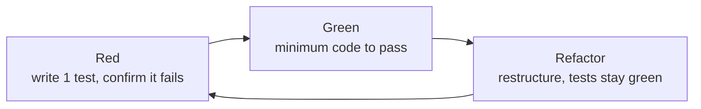

import { SummaryBox, FAQSection, Checklist } from '@site/src/components/SEO';

# Test-Driven Development (TDD) in the AI-Driven Development Life Cycle (AI-DLC)

<SummaryBox>
**Abstract.** Test-Driven Development (TDD) is a technique that repeats three steps: write a failing test (Red), write the minimum code that makes it pass (Green), then restructure the code while keeping all tests passing (Refactor). Empirical studies from before the AI era are mixed: a case study of four industrial teams recorded a 40–90% reduction in defect density at the price of 15–35% more initial development time, while a meta-analysis of 27 studies found only a small quality improvement. In the AI-Driven Development Life Cycle (AI-DLC), where source code is increasingly generated by large language models (LLMs), tests acquire an additional function: they act as executable specifications that clarify intent and verify AI output. Studies of test-driven code generation report substantial accuracy gains, but all use small-scale problems, and the quality of the test suite itself becomes the ceiling on any claim of correctness.
</SummaryBox>

**Keywords:** TDD, AI-DLC, unit testing, large language models, executable specification, refactoring.

<!-- truncate -->

## 1. Problem statement {#problem}

As developers delegate a growing share of code writing to AI assistants (see the [AI-Driven Development series](/blog/phat-trien-phan-mem-ai-driven-development), in Vietnamese), the central question of testing changes. It used to be "is the human-written code correct?" It is now "who is responsible for defining what correct means, when code is generated faster than anyone can read it line by line?"

TDD is a natural candidate for this question because it places the definition of correctness (the test) before the implementation. However, the classic evidence on TDD was collected when humans wrote both tests and code. This article addresses three questions:

1. What does the available empirical evidence say about the effectiveness of TDD?
2. Where can TDD be placed in AI-DLC, and how far do studies of LLM code generation support that placement?
3. What does a workable practice look like, and which risks need to be controlled?

The literature covered consists of publications whose figures were checked against their abstracts at the source; the handling is detailed in Section 7.

## 2. Background {#background}

### 2.1. The TDD loop {#tdd-loop}

Beck (2002), in [*Test-Driven Development: By Example*](https://dl.acm.org/doi/10.5555/579193), describes TDD through two rules: write new code only when an automated test is failing, and eliminate duplication. Together they form a three-phase loop:



| Phase | Activity | Exit condition |
| --- | --- | --- |
| Red | Write **one** test describing the desired behavior | The test runs and fails **for the expected reason** |
| Green | Write the minimum code, hard-coding if necessary | All tests pass |
| Refactor | Improve the structure of code and tests without changing behavior | All tests still pass |

TDD should be distinguished from three neighboring concepts. *Test-first* prescribes only the order of writing tests first; TDD adds disciplined refactoring and a rhythm of small steps. *Unit tests* are the product, whereas TDD is the process that creates them and shapes the design at the same time. *ATDD/BDD* place tests at the level of business behavior, typically forming an outer loop around unit-level TDD.

One condition is easily overlooked: the Red phase must fail for the expected reason. A test that is red because of an exception inside the test code itself proves nothing about the behavior to be built.

### 2.2. AI-DLC {#ai-dlc}

AI-DLC was [proposed by Raja SP (AWS)](https://aws.amazon.com/blogs/devops/ai-driven-development-life-cycle) and published on 31 July 2025. The method holds that AI acts as the primary executor while humans retain decision authority wherever business context and judgment are required, under the principle "AI Powered Execution with Human Oversight". The life cycle has three phases:

- **Inception:** AI turns business intent into requirements, user stories and units of work through *Mob Elaboration*, in which a cross-functional team validates the AI's proposals and questions.
- **Construction:** AI proposes the logical architecture, domain models, code and test suites through *Mob Construction*, with the team clarifying technical decisions in real time.
- **Operations:** AI manages infrastructure as code and deployment, drawing on context accumulated in earlier phases.

In terms of vocabulary, the *Bolt* replaces the sprint (cycles measured in hours or days) and the *Unit of Work* replaces the epic. In this description, tests appear as an artifact continuously generated by AI during Construction, and the introduction mentions AI applying an organization's coding standards, design patterns and security requirements when generating test suites. Attaching TDD to AI-DLC in this article is therefore **the author's proposal**, not something prescribed by the original material.

## 3. Empirical evidence on TDD {#evidence}

The studies below differ in subjects (students or professionals), design (experiment or case study) and measures, so they should be read as complementary slices rather than as a single figure.

| Study | Type | Main result |
| --- | --- | --- |
| [Nagappan, Maximilien, Bhat, Williams (2008)](https://www.microsoft.com/en-us/research/wp-content/uploads/2009/10/Realizing-Quality-Improvement-Through-Test-Driven-Development-Results-and-Experiences-of-Four-Industrial-Teams-nagappan_tdd.pdf) | Case study, 4 teams (3 Microsoft, 1 IBM) | Pre-release defect density down 40–90% versus comparable projects; initial development time up 15–35% |
| [Rafique & Mišić (2013)](https://ieeexplore.ieee.org/document/6197200) | Meta-analysis, 27 studies | Small improvement in external quality, little to no effect on productivity; industrial studies show both a larger quality gain and a larger productivity drop than academic ones |
| [Fucci et al. (2017)](https://arxiv.org/abs/1611.05994) | Experiment, 39 professional developers | Order of writing tests and code had no important influence; quality and productivity were tied to the granularity and uniformity of steps |
| [Causevic, Sundmark, Punnekkat (2011)](https://dl.acm.org/doi/10.1109/ICST.2011.19) | Systematic review | Seven factors limiting adoption, including increased development time, lack of TDD experience, lack of upfront design, domain- and tool-specific issues, and legacy code |

Three observations follow from the table:

1. **Quality benefits come with a cost.** The 40–90% defect reduction cannot be separated from the 15–35% increase in initial time. The net value depends on the cost of defects in the specific environment.
2. **Context amplifies both benefit and cost.** Rafique & Mišić find that industrial studies show both a larger quality improvement and a larger productivity drop than academic ones. The productivity drop is also larger when the TDD group invests significantly more test effort than the control group.
3. **Mechanism matters more than order.** Fucci et al. found no important effect of writing tests before or after code; good results were tied to small, steady steps. The authors suggest the benefit comes from "fine-grained, steady steps that improve focus and flow". This point is especially relevant for Section 4.

[Karac & Turhan (2018)](https://doi.org/10.1109/MS.2018.2801554) also examine how far TDD has met the expectations placed on it, stressing that TDD is more than writing tests first. This article does not cite a quantitative conclusion from that publication.

## 4. TDD in the context of AI-DLC {#tdd-in-ai-dlc}

### 4.1. Tests as executable specifications {#executable-specs}

When code is generated by an LLM, a natural-language requirement typically contains ambiguities that the model will resolve in its own way. A test removes that ambiguity with a statement that can be run. Several recent studies examine this approach:

| Study | Design | Main result |
| --- | --- | --- |
| [Fakhoury et al. (2024)](https://arxiv.org/abs/2404.10100), TiCoder, *IEEE TSE* | Interactive workflow using tests to clarify intent; user study with 15 programmers; 4 LLMs, 2 Python datasets | Average absolute improvement of 45.97% in pass@1 within 5 interactions; significantly lower task-induced cognitive load |
| [Liang et al. (2026)](https://arxiv.org/abs/2602.03557), ClassEval-TDD | Iterative TDD-style framework for class-level generation, 8 LLMs | Correctness up 12–26 percentage points over direct generation; up to 71% fully correct classes |
| [Piya & Sullivan (2023)](https://arxiv.org/abs/2312.04687), LLM4TDD | ChatGPT on LeetCode problems, tests presented incrementally | Examines the effect of test, prompt and problem attributes; no specific figures cited here |

The results point the same way: supplying tests to a model, and letting it iterate on feedback, substantially improves accuracy over generating directly from a description. Three limitations apply. First, the experiments use benchmark problems (single functions or classes) and do not reflect multi-component systems. Second, "accuracy" is measured by the very test suites involved, so it depends on their quality (see 4.2). Third, the TiCoder user sample is small (15 people).

### 4.2. Test quality bounds correctness {#test-quality}

[Liu et al. (2023)](https://arxiv.org/abs/2305.01210), with EvalPlus, expanded the HumanEval test suite 80-fold and re-evaluated 26 LLMs. Pass rates fell by up to 19.3–28.9%, and the ranking among models changed: two open-source models outperformed ChatGPT on the expanded suite but not on the original. The authors conclude that insufficient tests can lead to mis-ranking.

This result does not concern TDD as such, but it has a direct consequence when AI-DLC lets AI generate both code and tests. If a model writes tests based on its own reading of the requirement and then writes code to pass them, "all tests pass" demonstrates only the model's internal consistency, not fitness for the business intent. This is the author's inference; no study that measures this phenomenon directly within AI-DLC was found. Broader risks of delegating code to AI are analyzed in [part 3 of the AI-Driven Development series](/blog/phat-trien-phan-mem-ai-driven-development-phan-3), and ways to feed project knowledge to AI agents are discussed in the [post on agent skills](/blog/agent-skills-co-che-va-tri-thuc-bi-bo-qua) (both in Vietnamese).

### 4.3. Proposed division of roles {#roles}

From these two observations, the article proposes a division of roles mapped onto AI-DLC phases:

| AI-DLC phase | Corresponding TDD activity | Proposed role |
| --- | --- | --- |
| Inception (Mob Elaboration) | Turn acceptance criteria into concrete examples and behavior-level tests | AI drafts, **humans validate**, since this is where business intent is fixed |
| Construction (Mob Construction), Red | Write the unit test describing the next behavior | **Humans write or approve each test** before AI writes code |
| Construction, Green | Minimal implementation to pass the test | **AI performs it**; the result is verified by the tests, not by skimming |
| Construction, Refactor | Restructure while all tests pass | AI proposes, humans review; tests are the safety net |

The rationale for placing authority in the Red phase is that it is where correctness is defined, which matches AI-DLC's principle that decision authority rests with humans. The rationale for assigning Green to AI is that it has the clearest automated feedback, exactly the kind of task that the studies in 4.1 show models handle better when guided by tests.

The rhythm is also compatible. Fucci et al. tie good outcomes to small, steady steps, and AI-DLC uses the Bolt (hours or days) in place of the sprint. Each Red-Green-Refactor cycle can be seen as a finer unit nested within a Bolt.

### 4.4. Research gap {#gap}

Within the scope of the author's search, no study was found that evaluates TDD combined with AI-DLC at industrial project scale. The results in 4.1 come from benchmark problems, and those in Section 3 predate the spread of AI assistants. Combining the two bodies of evidence to conclude anything about the combined process is an inference that requires verification.

## 5. Practical illustration {#illustration}

The assumed problem, small enough to follow: orders of 1,000,000 or more receive a 10% discount; VIP customers receive an additional 5%, stacked; a negative subtotal is invalid input. Following the division of roles in 4.3, the developer writes the tests and an AI assistant proposes the implementation.

### 5.1. Cycle 1: Red, then Green by faking it {#cycle-1}

The first test picks the simplest case:

```csharp
public class OrderPricingTests
{
    [Fact]
    public void Total_UnderThreshold_NoDiscount()
    {
        var pricing = new OrderPricing();

        Assert.Equal(500_000m, pricing.Total(500_000m, isVip: false));
    }
}
```

The class `OrderPricing` does not yet exist, so the code does not compile; this is itself a form of Red. An empty class whose method throws `NotImplementedException` should be created so the test runs and fails for the expected reason, followed by just enough code to pass:

```csharp
public class OrderPricing
{
    public decimal Total(decimal subtotal, bool isVip) => subtotal;
}
```

This is Beck's *Fake It* technique: return exactly the value the test needs, without generalizing yet. With an AI assistant this phase matters even more: the developer should observe the test **actually failing** before asking the AI to write code.

### 5.2. Cycle 2: triangulation {#cycle-2}

Add a test that forces the code to actually compute (*triangulation*):

```csharp
[Fact]
public void Total_AtThreshold_Gets10PercentOff()
{
    var pricing = new OrderPricing();

    Assert.Equal(900_000m, pricing.Total(1_000_000m, isVip: false));
}
```

```csharp
public decimal Total(decimal subtotal, bool isVip)
    => subtotal >= 1_000_000m ? subtotal * 0.90m : subtotal;
```

The boundary value (exactly at the threshold) is where `>` versus `>=` errors tend to appear. An AI assistant may pick the wrong boundary if the requirement is described only in words; a boundary test rules this out.

### 5.3. Cycle 3: VIP, invalid input and refactoring {#cycle-3}

```csharp
[Fact]
public void Total_VipUnderThreshold_Gets5PercentOff()
{
    var pricing = new OrderPricing();

    Assert.Equal(475_000m, pricing.Total(500_000m, isVip: true));
}

[Fact]
public void Total_VipAtThreshold_StacksTo15Percent()
{
    var pricing = new OrderPricing();

    Assert.Equal(850_000m, pricing.Total(1_000_000m, isVip: true));
}

[Fact]
public void Total_NegativeSubtotal_Throws()
{
    var pricing = new OrderPricing();

    Assert.Throws<ArgumentOutOfRangeException>(
        () => pricing.Total(-1m, isVip: false));
}
```

Once all tests pass, the Refactor phase removes the nested conditions and names the business constants:

```csharp
public class OrderPricing
{
    const decimal BulkThreshold = 1_000_000m;
    const decimal BulkRate = 0.10m;
    const decimal VipRate = 0.05m;

    public decimal Total(decimal subtotal, bool isVip)
    {
        if (subtotal < 0)
            throw new ArgumentOutOfRangeException(nameof(subtotal));

        var rate = 0m;
        if (subtotal >= BulkThreshold) rate += BulkRate;
        if (isVip) rate += VipRate;

        return subtotal * (1 - rate);
    }
}
```

The stacking rule now lives in one place. If a model or a human later switches to multiplicative discounts, the `StacksTo15Percent` test fails immediately. This is the "safety net" function of a test suite, and it matters more when code is changed in bulk by AI.

> **Verification note.** The expected values (475,000; 850,000; 900,000) were computed by hand from the rules. The C# code in this article was not compiled or run during writing. Run `dotnet test` before use.

### 5.4. Common deviations {#deviations}

- **Writing many tests at once before asking for code.** The short feedback loop, a factor associated with good results (Fucci et al., 2017), is lost. With AI the risk grows because a model easily produces a large block of code that is hard to review.
- **Skipping Refactor.** Doing only Red-Green yields working but poorly structured code, and the tests gradually become a maintenance burden.
- **Tests tied to implementation rather than observable behavior.** Changing the implementation breaks the tests even though behavior is unchanged.
- **Letting AI write both tests and code without reviewing the tests** (see 4.2).

## 6. Limitations and scope of application {#limitations}

**Schools.** When code has dependencies, TDD splits into two approaches. The Chicago (classicist) school checks resulting *state*, uses real objects or simple fakes, and works from the inside out. The London (mockist) school checks *interactions* between objects using mocks, and works from the outside in ([Fowler, 2007](https://martinfowler.com/articles/mocksArentStubs.html); Freeman & Pryce, 2009). For pure business logic such as the example in Section 5, the classicist approach is usually less coupled to internal structure. Whether a dependency can be swapped for a test double depends on a design following dependency inversion, covered in the [Clean Architecture lesson](/docs/dotnet-backend-zero-to-senior/stage-05-senior-engineering/module-16-clean-architecture/16.3-uncle-bob); for repositories specifically, the [Unit of Work and Repository lesson](/docs/dotnet-backend-zero-to-senior/stage-04-database-production/module-13-entity-framework-core/13.9-unit-of-work-and-repository-pattern) explains why integration tests often remove the need to mock (both in Vietnamese).

**Poorly suited situations.**

- *Exploratory code (spikes).* When it is unclear what to build, writing tests first only fixes an assumption that may be wrong. Explore, extract the insight, discard the code and rewrite it with TDD.
- *UI and visual effects.* Results need to be judged by human eyes; snapshot-style tests give low benefit relative to maintenance cost.
- *Infrastructure integration* (databases, queues, networks). Mocking infrastructure easily creates false comfort; deliberate integration tests are more reliable (see the [API Testing lesson](/docs/dotnet-backend-zero-to-senior/stage-03-aspnet-core-backend/module-09-web-api-professional/9.8-api-testing) on WebApplicationFactory and Testcontainers, in Vietnamese).
- *Legacy code without seams.* Dependencies must be broken first, following Feathers (2004), before TDD can be applied.

**Threats to validity of this review.** The figures in Section 3 largely predate AI assistants; those in 4.1 and 4.2 come from small-scale problems and benchmarks. Section 4.3 is a proposal that has not been empirically validated.

## 7. Handling of sources {#method}

The figures of Nagappan et al., Rafique & Mišić, Fucci et al., Causevic et al., Fakhoury et al., Liang et al. and Liu et al. were checked against the published abstracts at the source (publisher, arXiv). For Piya & Sullivan only the abstract could be checked and it contains no quantitative results; for Karac & Turhan only publication details and topic could be checked. When citing for academic purposes, open the original paper to verify sample size, measures, confidence intervals and experimental conditions. Statements about AI-DLC rest on the method author's own introduction, not on independent evaluation.

## Adoption checklist {#checklist}

<Checklist
  title="Before confirming an AI-assisted TDD process"
  items={[
    { text: "Each new test is run and seen failing for the expected reason before AI writes code" },
    { text: "Humans write or approve every test; tests drafted by AI are reviewed against the requirements" },
    { text: "Each Red-Green-Refactor cycle is small enough to review the AI's output" },
    { text: "The Refactor phase actually happens, not skipped under pressure" },
    { text: "Tests describe observable behavior, not implementation details" },
    { text: "Boundary values (threshold, empty, negative, null) are written as tests early" },
    { text: "Scope is appropriate: pure business logic, not forced onto UI or exploratory code", checked: true }
  ]}
/>

## Frequently asked questions {#faq}

<FAQSection
  title="Frequently asked questions about TDD and AI-DLC"
  items={[
    {
      question: "Does TDD really reduce defects?",
      answer: "There are signs that it does, but the magnitude depends on context. The case study of four industrial teams by Nagappan et al. (2008) recorded a 40–90% drop in defect density versus comparable projects not using TDD. The meta-analysis of 27 studies by Rafique and Mišić (2013) found only a small improvement in external quality, although the improvement in industrial studies was larger than in academic ones."
    },
    {
      question: "How much does TDD slow development down?",
      answer: "Nagappan et al. reported initial development time rising by about 15–35%. This cost is expected to be recovered in bug fixing and maintenance, so it is usually reasonable for long-lived products and less so for short-lived experiments."
    },
    {
      question: "What is AI-DLC, and does it require TDD?",
      answer: "AI-DLC is a software development method proposed by Raja SP (AWS) in 2025, with three phases (Inception, Construction and Operations) in which AI executes while humans retain decision authority. The introduction to the method describes tests as an artifact generated by AI during Construction and does not prescribe TDD. Combining TDD with AI-DLC in this article is the author's proposal."
    },
    {
      question: "Why not let AI write both the tests and the code?",
      answer: "If the same model misreads a requirement, the tests and the code will be wrong consistently and still pass. The EvalPlus study (Liu et al., 2023) shows that an insufficient test suite can inflate pass rates by up to 19.3–28.9% and mis-rank models. Humans therefore need to review the tests, because that is where correctness is defined."
    },
    {
      question: "Is writing tests after the code worse than TDD?",
      answer: "Not necessarily. The experiment by Fucci et al. (2017) with 39 professional developers concluded that the order of writing tests and code had no important influence; quality and productivity were tied to working in small, steady steps. However, tests written afterward tend to mirror the existing code and skip the hard cases."
    }
  ]}
/>

## Conclusion {#conclusion}

TDD is not a universal solution, and the empirical evidence is not strong enough to treat it as a mandatory principle. What the studies support is broader than the "TDD" label: work in small steps, get automated feedback after each step, and refactor regularly.

In the context of AI-DLC, the value of TDD shifts from helping developers write correct code to allowing humans to **define correctness as an executable specification** and delegate the implementation to AI. Three main conclusions:

1. **Costs and benefits are both real.** Fewer defects in exchange for up-front time; weigh them against the product's lifetime.
2. **Small steps have the most supporting evidence.** With AI-generated code, small steps also keep the volume to be reviewed within what humans can control.
3. **Tests are where human authority is retained.** The quality of the test suite caps every claim about the correctness of AI-generated code; the Red phase should therefore be owned by humans.

The next research step is to measure this combined process at industrial project scale, where no direct evidence currently exists.

## References {#references}

- Beck, K. (2002). *Test-Driven Development: By Example*. Addison-Wesley. https://dl.acm.org/doi/10.5555/579193
- Raja SP (2025, 31 July). AI-Driven Development Life Cycle: Reimagining Software Engineering. *AWS DevOps & Developer Productivity Blog*. https://aws.amazon.com/blogs/devops/ai-driven-development-life-cycle
- Nagappan, N., Maximilien, E. M., Bhat, T., Williams, L. (2008). Realizing quality improvement through test driven development: results and experiences of four industrial teams. *Empirical Software Engineering*, 13(3), 289–302. https://www.microsoft.com/en-us/research/wp-content/uploads/2009/10/Realizing-Quality-Improvement-Through-Test-Driven-Development-Results-and-Experiences-of-Four-Industrial-Teams-nagappan_tdd.pdf
- Rafique, Y., Mišić, V. B. (2013). The effects of test-driven development on external quality and productivity: a meta-analysis. *IEEE Transactions on Software Engineering*, 39(6), 835–856. https://ieeexplore.ieee.org/document/6197200
- Fucci, D., Erdogmus, H., Turhan, B., Oivo, M., Juristo, N. (2017). A dissection of the test-driven development process: does it really matter to test-first or to test-last? *IEEE Transactions on Software Engineering*, 43(7), 597–614. https://doi.org/10.1109/TSE.2016.2616877
- Karac, I., Turhan, B. (2018). What do we (really) know about test-driven development? *IEEE Software*, 35(4), 81–85. https://doi.org/10.1109/MS.2018.2801554
- Causevic, A., Sundmark, D., Punnekkat, S. (2011). Factors limiting industrial adoption of test driven development: a systematic review. *ICST 2011*, 337–346. https://doi.org/10.1109/ICST.2011.19
- Fakhoury, S., Naik, A., Sakkas, G., Chakraborty, S., Lahiri, S. K. (2024). LLM-based test-driven interactive code generation: user study and empirical evaluation. *IEEE Transactions on Software Engineering*, 50(9), 2254–2268. https://arxiv.org/abs/2404.10100
- Liang, Y., Ying, R., Ni, S., Cui, Z. (2026). Scaling test-driven code generation from functions to classes: an empirical study. arXiv:2602.03557. https://arxiv.org/abs/2602.03557
- Piya, S., Sullivan, A. (2023). LLM4TDD: best practices for test driven development using large language models. arXiv:2312.04687. https://arxiv.org/abs/2312.04687
- Liu, J., Xia, C. S., Wang, Y., Zhang, L. (2023). Is your code generated by ChatGPT really correct? Rigorous evaluation of large language models for code generation. arXiv:2305.01210. https://arxiv.org/abs/2305.01210
- Fowler, M. (2007). *Mocks Aren't Stubs*. martinfowler.com. https://martinfowler.com/articles/mocksArentStubs.html
- Freeman, S., Pryce, N. (2009). *Growing Object-Oriented Software, Guided by Tests*. Addison-Wesley.
- Feathers, M. (2004). *Working Effectively with Legacy Code*. Prentice Hall.

---

**Last updated**: October 2026

## Related posts

Vietnamese-language pages on this site:

- [AI-DD: AI-Driven software development, a comprehensive series](/blog/phat-trien-phan-mem-ai-driven-development): general context on AI-assisted development.
- [AI-DD - Part 3: Figures, field experience and risks](/blog/phat-trien-phan-mem-ai-driven-development-phan-3): risks of delegating code to AI.
- [Installing skills and coding on: the mechanism and the knowledge left behind](/blog/agent-skills-co-che-va-tri-thuc-bi-bo-qua): feeding project knowledge to AI agents.
- [9.8 - API Testing](/docs/dotnet-backend-zero-to-senior/stage-03-aspnet-core-backend/module-09-web-api-professional/9.8-api-testing): integration testing with WebApplicationFactory and Testcontainers.
- [13.9 - Unit of Work and Repository Pattern](/docs/dotnet-backend-zero-to-senior/stage-04-database-production/module-13-entity-framework-core/13.9-unit-of-work-and-repository-pattern): when to mock a repository and when not to.
- [16.3 - Clean Architecture](/docs/dotnet-backend-zero-to-senior/stage-05-senior-engineering/module-16-clean-architecture/16.3-uncle-bob): dependency inversion and testability.
- [Types of API testing: 9 types, how they differ and when to run them](/blog/api-testing-types): a map of test levels beyond the unit level.
- [All posts on testing](/blog/tags/kiem-thu)
