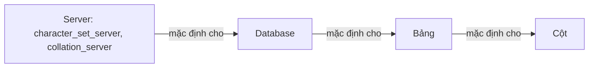

# Collation là gì? Character Sets, Collations và so sánh chuỗi trong MySQL

> Nguồn: https://tiennhm.io.vn/blog/character-sets-and-collations-in-mysql
> Collation quyết định MySQL so sánh và sắp xếp chuỗi thế nào — vì sao WHERE name = 'Alice' lại khớp cả 'alice', hậu tố _ci _cs _bin nghĩa là gì, vì sao utf8 của MySQL không phải UTF-8 thật và không lưu nổi emoji, cách kiểm tra charset đang dùng ở bốn cấp và cách chuyển an toàn sang utf8mb4.

> Bài viết giới thiệu về Character Sets (bảng mã) và Collations (thứ tự ký tự) trong MySQL, giải thích cách MySQL so sánh chuỗi và những vấn đề thường gặp khi làm việc với các bảng mã khác nhau. MySQL hỗ trợ nhiều character sets như utf8, utf8mb4, latin1, và mỗi character set có các collations khác nhau ảnh hưởng đến cách so sánh và sắp xếp chuỗi. Bài viết giúp developers hiểu và tránh các lỗi phổ biến khi làm việc với multilingual data trong MySQL.

Trong thực tế, khi làm việc với cơ sở dữ liệu, bạn thường phải xử lý các chuỗi văn bản, và việc so sánh chuỗi đôi khi gặp phải một số vấn đề. MySQL hỗ trợ nhiều bảng mã (Character Sets) và thứ tự ký tự (Collations) khác nhau, và cách so sánh chuỗi phụ thuộc vào collation của bảng mã.

Bảng mã và collation được gắn ngay từ lúc khai báo cột, nên phần này đi kèm với [cấu trúc bảng và kiểu dữ liệu](https://tiennhm.io.vn/docs/database/learn-sql-in-30-days/02-table-structure-and-data-types) trong series học SQL 30 ngày; còn cách các phép so sánh hành xử thì nằm ở bài [toán tử và biểu thức](https://tiennhm.io.vn/docs/database/learn-sql-in-30-days/05-operators-and-expressions).

Bài viết này giới thiệu về các bảng mã và cách so sánh chuỗi trong MySQL, những vấn đề cần lưu ý khi làm việc với các bảng mã khác nhau.

## 1. Bảng mã (Character Sets) trong MySQL
Bảng mã (Character Sets) trong MySQL là bộ ký tự đại diện cho tập hợp các ký tự với mã hóa duy nhất, xác định những ký tự nào được phép trong một cột kiểu văn bản, bao gồm chữ cái, số, ký hiệu và ký tự đặc biệt.

Bộ ký tự quyết định phạm vi các ký tự có thể lưu trữ trong một cột. MySQL hỗ trợ nhiều bảng mã khác nhau, bao gồm cả một số bộ ký tự Unicode. Để liệt kê tất cả các bộ ký tự trên máy chủ MySQL hiện tại, bạn sử dụng câu lệnh sau:

```sql
SHOW CHARACTER SET;
```

Kết quả trả về sẽ bao gồm tên bảng mã, mô tả và mặc định. Ví dụ:

| Charset | Description | Default collation | Maxlen |
|---------|-------------|-------------------|:------:|
| ascii | US ASCII | ascii_general_ci | 1 |
| big5 | Big5 Traditional Chinese | big5_chinese_ci | 2 |
| binary | Binary pseudo charset | binary | 1 |
| cp1250 | Windows Central European | cp1250_general_ci | 1 |
| cp1251 | Windows Cyrillic | cp1251_general_ci | 1 |
| cp1256 | Windows Arabic | cp1256_general_ci | 1 |
| cp1257 | Windows Baltic | cp1257_general_ci | 1 |
| cp850 | DOS West European | cp850_general_ci | 1 |
| cp852 | DOS Central European | cp852_general_ci | 1 |
| cp866 | DOS Russian | cp866_general_ci | 1 |
| cp932 | SJIS for Windows Japanese | cp932_japanese_ci | 2 |
| dec8 | DEC West European | dec8_swedish_ci | 1 |
| eucjpms | UJIS for Windows Japanese | eucjpms_japanese_ci | 3 |
| euckr | EUC-KR Korean | euckr_korean_ci | 2 |
| gb18030 | China National Standard GB18030 | gb18030_chinese_ci | 4 |
| gb2312 | GB2312 Simplified Chinese | gb2312_chinese_ci | 2 |
| gbk | GBK Simplified Chinese | gbk_chinese_ci | 2 |
| geostd8 | GEOSTD8 Georgian | geostd8_general_ci | 1 |
| greek | ISO 8859-7 Greek | greek_general_ci | 1 |
| hebrew | ISO 8859-8 Hebrew | hebrew_general_ci | 1 |
| hp8 | HP West European | hp8_english_ci | 1 |
| keybcs2 | DOS Kamenicky Czech-Slovak | keybcs2_general_ci | 1 |
| koi8r | KOI8-R Relcom Russian | koi8r_general_ci | 1 |
| koi8u | KOI8-U Ukrainian | koi8u_general_ci | 1 |
| latin1 | cp1252 West European | latin1_swedish_ci | 1 |
| latin2 | ISO 8859-2 Central European | latin2_general_ci | 1 |
| latin5 | ISO 8859-9 Turkish | latin5_turkish_ci | 1 |
| latin7 | ISO 8859-13 Baltic | latin7_general_ci | 1 |
| macce | Mac Central European | macce_general_ci | 1 |
| macroman | Mac West European | macroman_general_ci | 1 |
| sjis | Shift-JIS Japanese | sjis_japanese_ci | 2 |
| swe7 | 7bit Swedish | swe7_swedish_ci | 1 |
| tis620 | TIS620 Thai | tis620_thai_ci | 1 |
| ucs2 | UCS-2 Unicode | ucs2_general_ci | 2 |
| ujis | EUC-JP Japanese | ujis_japanese_ci | 3 |
| utf16 | UTF-16 Unicode | utf16_general_ci | 4 |
| utf16le | UTF-16LE Unicode | utf16le_general_ci | 4 |
| utf32 | UTF-32 Unicode | utf32_general_ci | 4 |
| utf8mb3 | UTF-8 Unicode | utf8mb3_general_ci | 3 |
| utf8mb4 | UTF-8 Unicode | utf8mb4_0900_ai_ci | 4 |

Trong đó:
- `Charset`: tên bảng mã
- `Description`: mô tả
- `Default collation`: bảng mã mặc định
- `Maxlen`: độ dài tối đa của mỗi ký tự trong bảng mã. Một số bảng mã chứa ký tự **đa byte**, nên Maxlen có thể lớn hơn 1.

## 2. Thứ tự ký tự (Collations) trong MySQL
Thứ tự ký tự (Collations) trong MySQL xác định cách so sánh và sắp xếp các ký tự trong một bảng mã. Mỗi bộ ký tự có ít nhất một collation mặc định, và hầu hết các bộ ký tự có nhiều collation.

Để liệt kê tất cả các collation của một bảng mã, bạn sử dụng câu lệnh sau:

```sql
SHOW COLLATION WHERE Charset = 'ascii';
```

Trong đó, `ascii` là tên bảng mã. Kết quả trả về sẽ bao gồm tên collation, mô tả và mặc định. Ví dụ:

| Collation | Charset | Id | Default | Compiled | Sortlen | Pad_attribute |
|-----------|---------|----|:-------:|:--------:|:-------:|---------------|
| ascii_bin | ascii | 65 | | Yes | 1 | PAD SPACE |
| ascii_general_ci | ascii | 11 | Yes | Yes | 1 | PAD SPACE |

Trong đó:
- `Collation`: tên collation
- `Charset`: tên bảng mã
- `Id`: ID của collation
- `Default`: collation mặc định
- `Compiled`: collation đã được biên dịch
- `Sortlen`: độ dài của chuỗi sắp xếp
- `Pad_attribute`: thuộc tính đệm.

Collation xác định cách so sánh chuỗi trong MySQL. Ví dụ, collation `ascii_general_ci` so sánh chuỗi không phân biệt chữ hoa và chữ thường, trong khi collation `ascii_bin` so sánh chính xác từng ký tự (phân biệt chữ hoa và chữ thường).

Collation có một số đặc điểm quan trọng:
- **Case sensitivity**: xác định collation có phân biệt chữ hoa và chữ thường hay không.
    + `ci` (case-insensitive): không phân biệt chữ hoa và chữ thường. Một số collation có `ci` ở cuối tên, ví dụ: `utf8_general_ci` sẽ xem `A` và `a` là giống nhau.
    + `cs` (case-sensitive): phân biệt chữ hoa và chữ thường. Ví dụ: `utf8_bin` sẽ xem `A` và `a` là khác nhau.
- **Accent sensitivity**: xác định collation có phân biệt dấu thanh hay không. Ví dụ: `utf8_general_ci` sẽ xem `á` và `a` là giống nhau, trong khi `utf8_bin` sẽ xem chúng là khác nhau.
- **Kana sensitivity**: xác định collation có phân biệt ký tự Kana (tiếng Nhật) hay không. Ví dụ: `utf8_general_ci` sẽ xem `あ` và `ア` là giống nhau, trong khi `utf8_bin` sẽ xem chúng là khác nhau.

## 3. So sánh chuỗi trong MySQL
Khi so sánh chuỗi trong MySQL, bạn cần lưu ý các collation của bảng mã. MySQL sử dụng collation để xác định cách so sánh chuỗi, và kết quả có thể khác nhau tùy thuộc vào collation.

Ví dụ, giả sử bạn có một bảng `users` với cột `name` có collation `utf8_general_ci`:

```sql
CREATE TABLE users (
    id INT PRIMARY KEY,
    name VARCHAR(255) COLLATE utf8_bin
);
```

Nếu bạn thêm dữ liệu vào bảng `users`:

```sql
INSERT INTO users (id, name) VALUES (1, 'Alice');
INSERT INTO users (id, name) VALUES (2, 'alice');
```

Khi bạn so sánh chuỗi trong MySQL, kết quả sẽ phụ thuộc vào collation của cột. Ví dụ:

```sql
SELECT * FROM users WHERE name = 'Alice';
```

Nếu collation của cột `name` là `utf8_bin`, câu lệnh trên sẽ chỉ trả về dòng có `name` là `Alice`, vì collation `utf8_bin` phân biệt chữ hoa và chữ thường.

Tuy nhiên, nếu collation của cột `name` là `utf8_general_ci`, câu lệnh trên sẽ trả về cả hai dòng, vì collation `utf8_general_ci` không phân biệt chữ hoa và chữ thường.

Từ đó, khi làm việc với chuỗi trong MySQL, bạn cần lưu ý collation của cột để tránh nhầm lẫn trong kết quả truy vấn. Nếu cần, bạn có thể sử dụng hàm `COLLATE` để ghi đè collation mặc định:

```sql
SELECT * FROM users WHERE name COLLATE utf8_bin = 'Alice';
```

Như vậy, bạn đã biết cách so sánh chuỗi trong MySQL và cách xác định collation của cột để tránh nhầm lẫn trong kết quả truy vấn.

## 4. Những vấn đề cần lưu ý
### 4.1. Một số ví dụ sử dụng collation

Giả sử bạn có một bảng `users` với cột `name` có collation `latin1_bin`:

```sql
CREATE TABLE users (
    id INT PRIMARY KEY,
    name VARCHAR(255) COLLATE latin1_bin
);
```

Và bạn thêm dữ liệu vào bảng `users`:

```sql
INSERT INTO users (id, name) VALUES (1, 'Alice');
INSERT INTO users (id, name) VALUES (2, 'alice');
INSERT INTO users (id, name) VALUES (3, 'ALICE');
INSERT INTO users (id, name) VALUES (4, 'Bar');
INSERT INTO users (id, name) VALUES (5, 'Bär');
INSERT INTO users (id, name) VALUES (6, 'Muffler');
INSERT INTO users (id, name) VALUES (7, 'Müller');
INSERT INTO users (id, name) VALUES (8, 'MX Systems');
INSERT INTO users (id, name) VALUES (9, 'MySQL');
```

Với từ khóa `COLLATE`, bạn có thể ghi đè collation mặc định của cột trong truy vấn. Ta có thể sử dụng `COLLATE` trong các trường hợp sau:

#### Dùng với `ORDER BY` để sắp xếp chuỗi theo collation khác nhau
```sql
SELECT *
FROM users
ORDER BY name COLLATE latin1_bin;
```

```sql
SELECT *
FROM users
ORDER BY name COLLATE latin1_general_ci;
```

```sql
SELECT *
FROM users
ORDER BY name COLLATE latin1_general_cs;
```

Nhận xét:
- `latin1_bin`: sắp xếp chính xác từng ký tự, phân biệt chữ hoa và chữ thường.
- `latin1_general_ci`: không phân biệt chữ hoa và chữ thường.
- `latin1_general_cs`: phân biệt chữ hoa và chữ thường. Tuy nhiên, collation này không phân biệt dấu thanh.

#### Dùng với `AS` để đặt tên collation cho cột mới
```sql
SELECT name COLLATE latin1_general_ci AS name_latin1_general_ci
FROM users;
```

#### Dùng với `GROUP BY` để nhóm chuỗi theo collation khác nhau
```sql
SELECT name COLLATE latin1_general_ci, COUNT(1)
FROM users
GROUP BY name COLLATE latin1_general_ci;
```

#### Dùng với các hàm aggregation để tính toán trên chuỗi theo collation khác nhau
```sql
SELECT MIN(name COLLATE latin1_general_ci)
FROM users;
```

#### Dùng với `DISTINCT` để loại bỏ các giá trị trùng lặp theo collation khác nhau
```sql
SELECT DISTINCT name COLLATE latin1_general_ci
FROM users;
```

#### Dùng với `WHERE` để so sánh chuỗi theo collation khác nhau
```sql
SELECT *
FROM users
WHERE name COLLATE latin1_general_ci = 'Alice';
```

Ta thấy, với collation `latin1_general_ci`, `Alice`, `ALICE` và `alice` được xem là giống nhau, nên trả về tất cả các dòng có `name` là `Alice`.

Lưu ý, nếu không chỉ định collation, MySQL sẽ sử dụng collation mặc định của cột (trong trường hợp này là `latin1_bin`). Ví dụ:

```sql
SELECT *
FROM users
WHERE name = 'Alice';
```

Ta thấy, với collation `latin1_bin`, `Alice`, `ALICE` và `alice` được xem là khác nhau, nên chỉ trả về dòng có `name` là `Alice`.

#### Dùng với `HAVING` để lọc kết quả theo collation khác nhau
```sql
SELECT *
FROM users
GROUP BY name COLLATE latin1_general_ci
HAVING COUNT(1) > 1;
```

### 4.2. Mức độ ưu tiên của collation

Mệnh đề `COLLATE` có độ ưu tiên cao (cao hơn `||`). Hai biểu thức sau sẽ tương đương:

```sql
x || y COLLATE z
x || (y COLLATE z)
```

Ví dụ:

```sql
SELECT 'Alice' || 'Alice' COLLATE utf8_general_ci;
```

Tương đương với:

```sql
SELECT 'Alice' || ('Alice' COLLATE utf8_general_ci);
```

### 4.3. Độ tương thích của collation

Nếu hai collation không tương thích, MySQL sẽ báo lỗi. Ví dụ:

```sql
SELECT 'Alice' COLLATE utf8_bin = 'Alice' COLLATE utf8_general_ci;
```

Sẽ báo lỗi:

```
Error Code: 1253. COLLATION 'utf8_bin' is not valid for CHARACTER SET 'utf8mb4'
```

### 4.4. `utf8` của MySQL không phải UTF-8

Đây là cái bẫy tốn nhiều thời gian nhất trong cả bài.

Trong MySQL, `utf8` **không phải** UTF-8 đầy đủ — nó là bí danh của `utf8mb3`, phiên bản chỉ dùng tối đa **3 byte** cho mỗi ký tự. UTF-8 thật cần tới 4 byte, và những ký tự nằm ở vùng 4 byte gồm emoji cùng một phần chữ Hán mở rộng.

Hậu quả rất cụ thể: cột khai báo `utf8` sẽ **không lưu được emoji**.

```sql
CREATE TABLE messages (content VARCHAR(255)) CHARACTER SET utf8;
INSERT INTO messages VALUES ('Xin chào 😀');
```

```
Error 1366: Incorrect string value: '\xF0\x9F\x98\x80' for column 'content'
```

Bảng mã đúng để dùng là **`utf8mb4`**. Từ MySQL 8.0 nó đã là mặc định, với collation mặc định `utf8mb4_0900_ai_ci`. Nhưng những database tạo từ thời MySQL 5.x thì mặc định là `latin1` kèm `latin1_swedish_ci` — di sản này vẫn còn rất nhiều trong hệ thống đang chạy.

Ba collation hay gặp của `utf8mb4`:

| Collation | Đặc điểm |
|---|---|
| `utf8mb4_0900_ai_ci` | Mặc định từ MySQL 8.0, theo chuẩn Unicode 9.0, sắp xếp đúng nhất |
| `utf8mb4_unicode_ci` | Theo Unicode 4.0, chính xác nhưng cũ hơn |
| `utf8mb4_general_ci` | Nhanh hơn chút nhưng sắp xếp sai ở một số ngôn ngữ, chỉ nên dùng khi kế thừa |

### 4.5. Kiểm tra và đổi charset, collation

Charset và collation được quyết định ở bốn cấp, cấp nhỏ hơn ghi đè cấp lớn hơn: **server → database → bảng → cột**.



**Xem server đang dùng gì:**

```sql
SHOW VARIABLES LIKE 'character_set_server';
SHOW VARIABLES LIKE 'collation_server';
```

**Xem của một database:**

```sql
SELECT default_character_set_name, default_collation_name
FROM information_schema.schemata
WHERE schema_name = 'ten_database';
```

**Xem của các bảng trong một database:**

```sql
SELECT table_name, table_collation
FROM information_schema.tables
WHERE table_schema = 'ten_database';
```

**Xem chi tiết tới từng cột** — đây là cấp hay ẩn vấn đề nhất, vì một bảng `utf8mb4` vẫn có thể chứa cột lẻ còn `latin1`:

```sql
SELECT column_name, character_set_name, collation_name
FROM information_schema.columns
WHERE table_schema = 'ten_database' AND table_name = 'ten_bang';
```

**Liệt kê những gì server hỗ trợ:**

```sql
SHOW CHARACTER SET;
SHOW COLLATION WHERE Charset = 'utf8mb4';
```

**Chuyển một bảng sang `utf8mb4`:**

```sql
ALTER TABLE ten_bang
  CONVERT TO CHARACTER SET utf8mb4 COLLATE utf8mb4_0900_ai_ci;
```

Ba điều phải biết trước khi chạy lệnh trên trong môi trường thật:

- **`CONVERT TO` viết lại toàn bộ bảng.** Với bảng lớn nó khoá lâu — hãy làm trong khung giờ bảo trì, hoặc dùng công cụ đổi lược đồ trực tuyến như `pt-online-schema-change`.
- **Dung lượng index tăng.** Mỗi ký tự có thể chiếm 4 byte thay vì 3, nên `VARCHAR(255)` khi đánh index chiếm 1020 byte. Với bảng cũ dùng row format `COMPACT` (giới hạn 767 byte) sẽ gặp lỗi *Specified key was too long*; đổi sang row format `DYNAMIC` là hết.
- **Đổi bảng không đổi database.** Bảng tạo mới sau đó vẫn theo mặc định cũ, nên nhớ `ALTER DATABASE ten_database CHARACTER SET utf8mb4 COLLATE utf8mb4_0900_ai_ci;` nữa.

## 5. Kết luận
Trong bài viết này, chúng ta đã tìm hiểu về các bảng mã và cách so sánh chuỗi trong MySQL, những vấn đề cần lưu ý khi làm việc với các bảng mã khác nhau. Hy vọng bài viết này giúp bạn hiểu rõ hơn về collation và cách so sánh chuỗi trong MySQL.

Nếu bạn có bất kỳ câu hỏi hoặc ý kiến đóng góp nào, hãy để lại bình luận bên dưới. Cảm ơn bạn đã đọc bài viết!

### Character set và collation trong MySQL khác nhau như thế nào?

Character set (bảng mã) là tập hợp các ký tự được phép lưu trong một cột kiểu văn bản cùng cách mã hóa chúng. Collation (thứ tự ký tự) là quy tắc xác định cách so sánh và sắp xếp các ký tự trong bảng mã đó. Mỗi character set có ít nhất một collation mặc định, và hầu hết character set có nhiều collation.

### Hậu tố _ci, _cs và _bin trong tên collation nghĩa là gì?

Hậu tố _ci (case-insensitive) nghĩa là không phân biệt chữ hoa và chữ thường, ví dụ utf8_general_ci xem A và a là giống nhau. Hậu tố _cs (case-sensitive) thì phân biệt chữ hoa và chữ thường. Collation _bin như utf8_bin so sánh chính xác từng ký tự nên phân biệt cả chữ hoa chữ thường lẫn dấu thanh.

### Tại sao truy vấn WHERE name = 'Alice' lại trả về cả alice và ALICE?

Vì cột đang dùng collation không phân biệt chữ hoa chữ thường, ví dụ utf8_general_ci hoặc latin1_general_ci. Nếu cột dùng collation nhị phân như utf8_bin hay latin1_bin thì cùng truy vấn đó chỉ trả về đúng dòng có name là Alice.

### Làm sao ghi đè collation cho một truy vấn cụ thể?

Dùng từ khóa COLLATE ngay trong câu lệnh, ví dụ: SELECT * FROM users WHERE name COLLATE utf8_bin = 'Alice'. COLLATE có thể dùng với WHERE, ORDER BY, GROUP BY, HAVING, DISTINCT, với bí danh AS và cả các hàm aggregation như MIN(). Nếu không chỉ định, MySQL dùng collation mặc định của cột.

### Lỗi Error Code 1253 COLLATION is not valid for CHARACTER SET xảy ra khi nào?

Khi bạn so sánh hai biểu thức có collation không tương thích với nhau, ví dụ SELECT 'Alice' COLLATE utf8_bin = 'Alice' COLLATE utf8_general_ci. Trong trường hợp này MySQL báo lỗi thay vì tự chọn một collation.

### Collation là gì?

Collation là tập quy tắc xác định cách MySQL so sánh và sắp xếp các ký tự trong một bảng mã. Nó quyết định hai chuỗi có được coi là bằng nhau hay không và thứ tự khi ORDER BY, chẳng hạn chữ hoa và chữ thường có được xem là giống nhau không, hay chữ có dấu và không dấu có được xếp cùng nhau không. Mỗi character set có ít nhất một collation.

### utf8 và utf8mb4 trong MySQL khác nhau thế nào?

Trong MySQL, utf8 là bí danh của utf8mb3 và chỉ dùng tối đa 3 byte cho một ký tự, nên không lưu được những ký tự nằm ở vùng 4 byte như emoji và một phần chữ Hán mở rộng. utf8mb4 mới là UTF-8 đầy đủ với tối đa 4 byte. Từ MySQL 8.0, utf8mb4 là mặc định với collation utf8mb4_0900_ai_ci, còn các database tạo từ thời MySQL 5.x thường mặc định latin1 kèm latin1_swedish_ci.

### Làm sao kiểm tra database hoặc bảng đang dùng collation nào?

Với database dùng truy vấn SELECT default_character_set_name, default_collation_name FROM information_schema.schemata WHERE schema_name = tên database. Với các bảng dùng SELECT table_name, table_collation FROM information_schema.tables WHERE table_schema = tên database. Với từng cột thì truy vấn information_schema.columns, đây là cấp hay ẩn vấn đề nhất vì một bảng utf8mb4 vẫn có thể chứa cột lẻ còn latin1.

### Chuyển bảng sang utf8mb4 cần lưu ý gì?

Lệnh ALTER TABLE CONVERT TO CHARACTER SET utf8mb4 viết lại toàn bộ bảng nên khoá lâu với bảng lớn, cần làm trong giờ bảo trì hoặc dùng công cụ đổi lược đồ trực tuyến. Dung lượng index cũng tăng vì mỗi ký tự có thể chiếm 4 byte, nên bảng cũ dùng row format COMPACT có thể báo lỗi Specified key was too long và phải đổi sang DYNAMIC. Ngoài ra đổi bảng không đổi mặc định của database, cần chạy thêm ALTER DATABASE.

## Tham khảo
- [MySQL Character Sets and Collations](https://dev.mysql.com/doc/refman/8.0/en/charset.html)
- [MySQL String Comparison](https://dev.mysql.com/doc/refman/8.0/en/string-comparison-functions.html)

## Bài liên quan

- [05. Toán tử, Biểu thức](https://tiennhm.io.vn/docs/database/learn-sql-in-30-days/05-operators-and-expressions) — Giới thiệu cách sử dụng toán tử và biểu thức trong SQL.
- [02. Cấu trúc bảng và kiểu dữ liệu](https://tiennhm.io.vn/docs/database/learn-sql-in-30-days/02-table-structure-and-data-types) — Giới thiệu cấu trúc bảng và kiểu dữ liệu trong SQL
