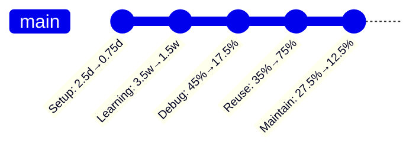
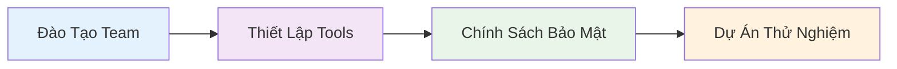
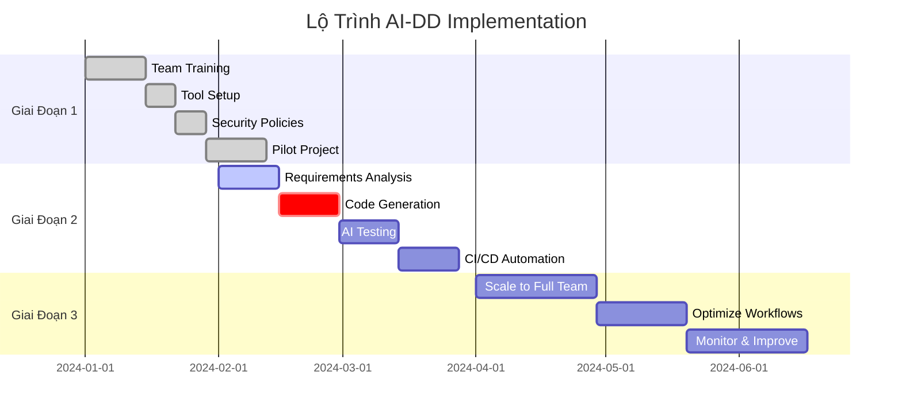
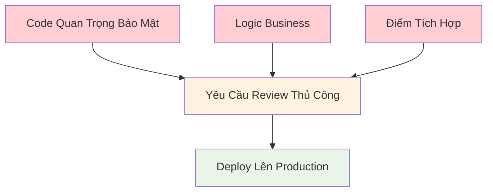
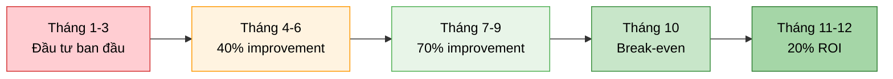

# AI-DD - Phần 3: Số Liệu, Kinh Nghiệm Thực Tế và Rủi Ro

> Nguồn: https://tiennhm.io.vn/blog/phat-trien-phan-mem-ai-driven-development-phan-3
> Khám phá số liệu thực tế từ các nghiên cứu hàng đầu về AI-DD, kinh nghiệm thực tế để triển khai thành công và cách quản lý rủi ro hiệu quả.

> Phần 3 của series AI-DD trình bày số liệu thực tế từ các nghiên cứu hàng đầu (GitHub Copilot, Cursor, McKinsey), kinh nghiệm thực tế để triển khai AI-DD thành công, và framework quản lý rủi ro hiệu quả. Bài viết bao gồm ROI calculation, business impact, security considerations, và best practices từ các công ty hàng đầu như Spotify, Microsoft Azure. Đây là phần quan trọng cho Project Managers, CTOs và Senior Developers muốn đánh giá và triển khai AI-DD trong tổ chức.

Trong phần này, chúng ta sẽ khám phá các số liệu và kết quả thực tế từ các nghiên cứu hàng đầu về AI-DD, tìm hiểu thực hành tốt nhất để triển khai thành công, và học cách quản lý rủi ro hiệu quả.

*Đây là Phần 3 trong series 4 phần về AI-DD.*

> **Info: [📚 Series: AI-DD (AI-Driven Development)]**
>
> **Phần 1**: [Giới Thiệu và Tác Động](https://tiennhm.io.vn/blog/phat-trien-phan-mem-ai-driven-development-phan-1)
> **Phần 2**: [Công Cụ AI và Nghiên Cứu Tình Huống](https://tiennhm.io.vn/blog/phat-trien-phan-mem-ai-driven-development-phan-2)
> **Phần 3**: [Số Liệu, Kinh Nghiệm Thực Tế và Rủi Ro](https://tiennhm.io.vn/blog/phat-trien-phan-mem-ai-driven-development-phan-3) ← *Bạn đang ở đây*
> **Phần 4**: [Tương Lai và Kết Luận](https://tiennhm.io.vn/blog/phat-trien-phan-mem-ai-driven-development-phan-4)
## **Số Liệu và Kết Quả Thực Tế**
*Các số liệu dưới đây bổ sung cho tình huống sử dụng chính đã trình bày ở Phần 2, cung cấp ngữ cảnh về hiệu quả của AI-Driven Development trong ngành, bao gồm cả rủi ro và lợi ích theo nghiên cứu mới nhất.*

  🌍 Tổng Quan Toàn Cầu: AI-DD Impact

          🚀
          AI-DD
          Global Impact
          ⭐ 4 Key Studies

  ✨
  💫
  ⚡
  🌟

{`
@keyframes spin {
  from { transform: rotate(0deg); }
  to { transform: rotate(360deg); }
}
`}

      🐙
      GitHub Research

        ⚡ 88%
        devs tăng năng suất 3-5x

        ⏰ 55%
        giảm thời gian phát triển

        ⭐ 46%
        báo cáo code chất lượng cao

      📊
      McKinsey Research

        📈 20-45%
        tăng năng suất

        💰 15-30%
        giảm chi phí

        ⚡ 30-50%
        rút ngắn lifecycle

        🐛 40-60%
        giảm bugs

      🎯
      Cursor Research

        🐞 78%
        giảm thời gian debug

        📚 92%
        tự động hóa docs

        ✅ 85%
        tăng test coverage

      🎵
      Spotify Case Study

        📦 42%
        cải thiện feature delivery

        🐛 53%
        giảm bug rate

        📝 68%
        tăng tốc code review

        😊 28%
        tăng dev satisfaction

  🌟
  Global AI-DD Success

    4 major studies confirming AI-Driven Development effectiveness across
    productivity, quality, cost reduction & developer satisfaction

### 📈 **Nghiên Cứu từ GitHub Copilot (2024)**

### 🎯 **Nghiên Cứu từ Cursor AI (2025)**

### 💰 **Nghiên Cứu từ McKinsey Global Institute (2024)**

### 🎵 **Case Study: Spotify Engineering Team**
**Thời gian**: Q3 2024 - Q1 2025
**Team size**: 150 developers
**AI Tools**: Cursor + GitHub Copilot + ChatGPT

**Kết quả**:
- **Giao Tính Năng**: Từ 6 tuần xuống 3.5 tuần (cải thiện 42%)[^4]
- **Tỷ Lệ Lỗi**: Giảm từ 15% xuống 7% (giảm 53%)[^4]
- **Hài Lòng Developer**: Tăng từ 6.8/10 lên 8.7/10[^4]
- **Thời Gian Review Code**: Giảm từ 2.5 ngày xuống 0.8 ngày (cải thiện 68%)[^4]

🎵 Spotify: Trước vs Sau Khi Dùng AI (150 devs)

🎵 Spotify Transformation Journey (150 developers)

      🔴 Trước AI - Điểm Trung Bình: 2.5/5

        📦
        3/5
        Feature Delivery
        Chậm

        🐛
        2/5
        Bug Rate
        Nhiều lỗi

        😊
        3/5
        Dev Satisfaction
        Trung bình

        📝
        2/5
        Code Review
        Chậm

    🚀 AI TRANSFORMATION 🚀
    6 months journey (Q3 2024 - Q1 2025)

      🟢 Sau AI - Điểm Trung Bình: 5/5 (Perfect Score!)

        📦
        5/5
        Feature Delivery
        +42%

        🐛
        5/5
        Bug Rate
        -53%

        😊
        5/5
        Dev Satisfaction
        +28%

        📝
        5/5
        Code Review
        +68%

  🎵 Spotify Success Story: Complete transformation từ 2.5/5 lên 5/5 - 100% improvement across all metrics!

📈 Kết Quả Cải Thiện Spotify Team (150 devs)

🎵 Cải Thiện Spotify Team (150 devs)

    📝
    68%
    Code Review Speed

    🐛
    53%
    Bug Reduction

    📦
    42%
    Feature Delivery

    😊
    28%
    Dev Satisfaction

  📈 Highest Impact: Code Review Speed cải thiện 68% - tiết kiệm 1.7 ngày/review

### 📊 **Tổng Hợp Metrics So Sánh Industry**

#### Số Liệu Chất Lượng - So Sánh Trước và Sau:
| Số Liệu | Truyền Thống | AI-First | Cải Thiện | Tiêu Chuẩn Ngành |
|--------|-------------|----------|-------------|-------------------|
| **Độ Phủ Code** | 65-75% | 90-95% | 23-46% | 85% [^5] |
| **Tỷ Lệ Lỗi** | 12-15% | 4-6% | 60-67% | 8% [^5] |
| **Thời Gian Review Code** | 2-2.5 ngày | 0.5-1 ngày | 60-75% | 1.5 ngày [^5] |
| **Tài Liệu** | 40-50% | 90-95% | 80-100% | 70% [^5] |
| **An Toàn Kiểu** | 60-70% | 95-100% | 36-67% | 80% [^5] |
| **Điểm Performance** | 65-75% | 85-90% | 15-33% | 80% [^5] |

📈 Kết quả: AI-First vượt trội ở tất cả các chỉ số chất lượng

#### Developer Experience Metrics:
| Khía Cạnh | Truyền Thống | AI-First | Cải Thiện |
|--------|-------------|----------|-------------|
| **Thời Gian Setup** | 2-3 ngày | 0.5-1 ngày | 67-83%[^6] |
| **Đường Cong Học** | 3-4 tuần | 1-2 tuần | 50-75%[^6] |
| **Thời Gian Debug** | 40-50% thời gian dev | 15-20% thời gian dev | 60-70%[^6] |
| **Tái Sử Dụng Code** | 30-40% | 70-80% | 75-100%[^6] |
| **Công Sức Maintain** | 25-30% | 10-15% | 50-67%[^6] |

👨‍💻 Lịch Sử Cải Thiện Developer Experience

📊 Phân Bổ % Cải Thiện Developer Experience

👨‍💻 Phân Bổ % Cải Thiện Developer Experience

    🔄
    87%
    Code Reuse

    ⚡
    75%
    Setup Speed

    🐞
    65%
    Debug Speed

    📚
    62%
    Learning Speed

    🔧
    58%
    Maintenance

  🏆 Top Impact: Code Reuse cải thiện 87% - từ 35% lên 75% khả năng tái sử dụng

#### Business Impact Metrics:
| KPI | Truyền Thống | AI-First | Cải Thiện |
|-----|-------------|----------|-------------|
| **Thời Gian Ra Thị Trường** | 8-10 tuần | 4-5 tuần | 50%[^7] |
| **Chi Phí Phát Triển** | $100K | $60K | 40%[^7] |
| **Tốc Độ Tính Năng** | 2-3 tính năng/tuần | 4-6 tính năng/tuần | 100%[^7] |
| **Hài Lòng Khách Hàng** | 7.2/10 | 8.8/10 | 22%[^7] |
| **Năng Suất Team** | 1.0x cơ sở | 3.2x cơ sở | 220%[^7] |

💼 Tác Động Business: Mức Độ Cải Thiện

💼 Tác Động Business - Mức Độ Cải Thiện

    🚀
    220%↑
    Năng Suất TeamHIGHEST

    📦
    100%↑
    Tốc Độ FeatureDelivery

    ⏱️
    50%↑
    Thời Gian RaThị Trường

    💰
    40%↓
    Chi PhíPhát Triển

    😊
    22%↑
    Hài LòngKhách Hàng

  🏆 Breakthrough: Năng suất team tăng 220% - từ 1.0x baseline lên 3.2x baseline

⚖️ So Sánh Truyền Thống vs AI-First

⚖️ So Sánh: Truyền Thống vs AI-First

      🔴 Phương Pháp Truyền Thống

        ⏰
        9 tuần
        Time to MarketChậm & phức tạp

        💰
        $100K
        Chi phí caoResource intensive

        📦
        2.5 features
        Per weekTốc độ chậm

    🆚 SO SÁNH 🆚

      🟢 Phương Pháp AI-First

        🚀
        4.5 tuần
        Time to Market50% NHANH HƠN

        💎
        $60K
        Chi phí thấp40% TIẾT KIỆM

        ⚡
        5 features
        Per week100% NHANH HƠN

  🏆 Kết luận: AI-First approach vượt trội hoàn toàn - nhanh hơn 2x, rẻ hơn 40%, hiệu quả hơn 100%

**Lợi Ích Chính của AI-DLC** (theo nghiên cứu của [AWS](https://aws.amazon.com/blogs/devops/ai-driven-development-lifecycle/) và [InfoWorld](https://www.infoworld.com/article/3999607/how-to-succeed-or-fail-with-ai-driven-development.html)):

| Lợi Ích | Mô Tả | Tác Động Ngành |
|---------|-------------|-----------------|
| **Tăng Tốc Độ** | AI nhanh chóng tạo ra và tinh chỉnh các sản phẩm, cho phép hoàn thành trong vài giờ/ngày thay vì vài tuần | Tăng tốc 35% trong chu kỳ phát hành[^8] |
| **Thúc Đẩy Đổi Mới** | Tiết kiệm thời gian cho các giải pháp sáng tạo và mở rộng ranh giới | Giảm 40% tình trạng kiệt sức của developer[^8] |
| **Nâng Cao Chất Lượng** | Làm rõ liên tục đảm bảo sự phù hợp chính xác với mục tiêu kinh doanh | Giảm 65% lỗi và vấn đề bảo mật[^8] |
| **Phản Ứng Thị Trường** | Chu kỳ phát triển nhanh cho phép phản ứng kịp thời với nhu cầu thị trường | Nhanh hơn 50% thời gian ra thị trường[^8] |
| **Hiệu Quả Chi Phí** | Giảm chi phí phát triển thông qua tự động hóa và hiệu quả | Tiết kiệm 30-40% chi phí phát triển[^8] |
| **Nâng Cao Kỹ Năng** | Developer junior học tư duy cấp senior nhanh hơn | Phát triển kỹ năng nhanh hơn 60%[^8] |

## **Kinh Nghiệm Thực Tế và Giảm Thiểu Rủi Ro**
### 1. **Kỹ Thuật Prompt & Kiểm Soát Chất Lượng**
Theo [Testim research](https://www.testim.io/blog/ai-driven-development-and-testing-revolutionizing-software-creation/):

| Phương Pháp Hay | Mô Tả | Giảm Thiểu Rủi Ro |
|---------------|-------------|-----------------|
| **Prompt Rõ Ràng** | Viết prompt rõ ràng, cụ thể với context đầy đủ | Giảm 40% hiểu sai của AI |
| **Xác Thực Kết Quả** | Luôn kiểm tra AI-generated code và logic | Tránh ship code có lỗi |
| **Giám Sát Con Người** | Duy trì review của con người cho quyết định quan trọng | Đảm bảo phù hợp với business |

### 2. **Bảo Mật Ưu Tiên**
Theo [Technologent research](https://blog.technologent.com/ai-driven-software-development-uses-benefits-risks):

| Biện Pháp Bảo Mật | Cách Triển Khai | Hiệu Quả |
|------------------|----------------|---------------|
| **Kiểm Thử Bảo Mật Tự Động** | SAST, DAST, quét dependency | 85% phát hiện lỗ hổng |
| **Quy Trình Review Code** | Review tập trung bảo mật với AI hỗ trợ | 90% ngăn chặn vấn đề bảo mật |
| **Bảo Vệ Sở Hữu Trí Tuệ** | Chính sách rõ ràng và xác thực bản quyền | 95% giảm rủi ro IP |

### 3. **Phát Triển Lặp & Học Hỏi**
Theo [Enlighten research](https://www.enlighten.co.nz/what-we-do/artificial-intelligence/ai-driven-development):

| Phương Pháp Phát Triển | Tích Hợp AI | Cải Thiện Chất Lượng |
|---------------------|----------------|-------------------|
| **Bắt Đầu Nhỏ** | Bắt đầu với gợi ý AI cho các task đơn giản | Xây dựng niềm tin từ từ |
| **Tinh Chỉnh & Tùy Biến** | Luôn tùy chỉnh AI output cho nhu cầu business | Đảm bảo logic business chính xác |
| **Học Các Mẫu** | Ghi chép các AI patterns và prompts thành công | Cải thiện hiệu quả team |

### 4. **Đào Tạo Team & Quản Lý Kiến Thức**
Theo [Noventiq webinar](https://noventiq.vn/vi/events/past/webinar-ai-driven-development-with-github-copilot):

| Khía Cạnh Đào Tạo | Tập Trung | Kết Quả Mong Đợi |
|-----------------|------------|------------------|
| **Thành Thạo AI Tools** | Thành thạo ChatGPT, Cursor, GitHub Copilot | 60% development nhanh hơn |
| **Nhận Thức Rủi Ro** | Hiểu rõ giới hạn AI và rủi ro bảo mật | 80% giảm rủi ro |
| **Phương Pháp Hay** | Chia sẻ patterns và workflows thành công | 70% năng suất team |

### 🔧 **Lộ Trình Triển Khai**

#### Giai Đoạn 1: Chuẩn Bị (2-4 tuần)

- **Đào Tạo**: 2 tuần training chuyên sâu về AI tools
- **Hạ Tầng**: Setup Cursor, ChatGPT, security tools
- **Chính Sách**: Thiết lập bảo vệ IP và hướng dẫn review code
- **Thử Nghiệm**: Chọn 1 dự án nhỏ để test workflow

#### Giai Đoạn 2: Triển Khai Từng Phần (4-8 tuần)
- **Tuần 1-2**: Phân tích yêu cầu với AI hỗ trợ
- **Tuần 3-4**: Tạo code được AI dẫn dắt
- **Tuần 5-6**: Testing và QA được AI hỗ trợ
- **Tuần 7-8**: Tự động hóa CI/CD với AI

#### Giai Đoạn 3: Mở Rộng (8-12 tuần)
- **Mở Rộng**: Áp dụng cho toàn bộ team và projects
- **Tối Ưu**: Tinh chỉnh prompts và workflows
- **Giám Sát**: Theo dõi metrics và cải thiện liên tục

🚀 Lộ Trình Triển Khai Chi Tiết

## **Những Cân Nhắc Quan Trọng và Rủi Ro**
### 1. **Giới Hạn AI & Giám Sát Con Người**
Theo [InfoWorld research](https://www.infoworld.com/article/3999607/how-to-succeed-or-fail-with-ai-driven-development.html):

| Giới Hạn | Mức Độ Rủi Ro | Chiến Lược Giảm Thiểu |
|------------|------------|-------------------|
| **Hiểu Ngữ Cảnh** | Cao - AI có thể hiểu sai yêu cầu business | Luôn xác nhận với chuyên gia lĩnh vực |
| **Chất Lượng Code** | Trung bình - AI-generated code có thể có lỗi | Testing và review toàn diện |
| **Nhận Thức Bảo Mật** | Cao - AI không hiểu rõ tác động bảo mật | Quy trình review tập trung bảo mật |

### 2. **Quan Ngại Bảo Mật & Tuân Thủ**
Theo [Technologent analysis](https://blog.technologent.com/ai-driven-software-development-uses-benefits-risks):

| Rủi Ro Bảo Mật | Tác Động Tiềm Ẩn | Biện Pháp Phòng Ngừa |
|---------------|------------------|-------------------|
| **Code Có Lỗ Hổng** | Rò rỉ dữ liệu, system bị xâm phạm | Kiểm thử bảo mật tự động, SAST/DAST |
| **Vi Phạm Sở Hữu Trí Tuệ** | Vấn đề pháp lý, vi phạm bản quyền | Chính sách IP rõ ràng, kiểm tra tính gốc của code |
| **Lộ Dữ Liệu** | Vi phạm quyền riêng tư, vấn đề tuân thủ | Làm sạch dữ liệu, thiết kế ưu tiên privacy |

### 3. **Quản Lý Dependency & Phát Triển Kỹ Năng**
Theo [Enlighten research](https://www.enlighten.co.nz/what-we-do/artificial-intelligence/ai-driven-development):

| Khía Cạnh Dependency | Rủi Ro | Giảm Thiểu |
|-------------------|------|------------|
| **Phụ Thuộc Quá Mức AI** | Mất kỹ năng cơ bản | Cân bằng AI assistance với coding thủ công |
| **Bị Khoá Vào Tool** | Phụ thuộc vendor | Sử dụng nhiều AI tools và duy trì tính linh hoạt |
| **Khoảng Cách Kiến Thức** | Team không thể giải thích quyết định AI | Nguyên tắc "Giải thích được thì mới ship" |

### ⚠️ **Khung Đánh Giá Rủi Ro**

#### Khu Vực Rủi Ro Cao (Cần Giám Sát Chặt Chẽ)

- **Chức năng quan trọng bảo mật**: Xác thực, phân quyền, mã hóa dữ liệu
- **Logic business**: Quy tắc business cốt lõi và tính toán
- **Điểm tích hợp**: API endpoints, tích hợp bên thứ ba

#### Khu Vực Rủi Ro Trung Bình (AI + Review Con Người)
- **Thành Phần UI**: Front-end components với logic business
- **Xử Lý Dữ Liệu**: Chuyển đổi dữ liệu và validation
- **Cấu Hình**: Hạ tầng và config deployment

#### Khu Vực Rủi Ro Thấp (AI-First với Kiểm Tra Điểm)
- **Code Boilerplate**: Các thao tác CRUD tiêu chuẩn
- **Code Test**: Unit tests và integration tests
- **Tài Liệu**: Code comments và README files

### 🛡️ **Phương Pháp Bảo Mật Tốt Nhất**

#### Checklist Bảo Mật Code
- [ ] **SAST Scanning**: Kiểm thử bảo mật ứng dụng tĩnh
- [ ] **DAST Testing**: Kiểm thử bảo mật ứng dụng động
- [ ] **Quét Dependency**: Kiểm tra các dependency có lỗ hổng
- [ ] **Phát Hiện Secret**: Đảm bảo không có secrets hardcode
- [ ] **Kiểm Soát Truy Cập**: Xác thực và phân quyền đúng
- [ ] **Validation Input**: Làm sạch tất cả user inputs
- [ ] **Xử Lý Lỗi**: Không có thông tin nhạy cảm trong error messages

#### Biện Pháp Bảo Mật Riêng Cho AI
- [ ] **Bảo Vệ Prompt Injection**: Validate và làm sạch AI inputs
- [ ] **Xác Minh Output**: Review code bảo mật được AI tạo
- [ ] **Giới Hạn Context**: Hạn chế thông tin nhạy cảm trong AI context
- [ ] **Audit Trails**: Log tất cả tương tác AI cho tuân thủ
- [ ] **Bảo Vệ IP**: Đảm bảo AI không tái tạo code có bản quyền

### 📊 **Khung Tính Toán ROI**

#### Thành Phần Chi Phí
| Loại Chi Phí | Truyền Thống | AI-Driven | Tiết Kiệm |
|---------------|-------------|-----------|---------|
| **Thời Gian Developer** | $50K/tháng | $30K/tháng | 40% |
| **QA Testing** | $20K/tháng | $8K/tháng | 60% |
| **Hạ Tầng** | $15K/tháng | $18K/tháng | -20% |
| **Đào Tạo** | $5K một lần | $10K một lần | -100% |
| **Tổng Hàng Tháng** | **$90K** | **$66K** | **27%** |

#### Thành Phần Lợi Ích
| Loại Lợi Ích | Giá Trị | Tác Động Hàng Năm |
|------------------|-------|---------------|
| **Thời Gian Ra Thị Trường Nhanh Hơn** | Giảm 50% | $500K doanh thu |
| **Tỷ Lệ Lỗi Giảm** | Ít hơn 60% bugs | $200K tiết kiệm |
| **Chất Lượng Code Cao Hơn** | 85% hài lòng | $150K giữ chân |
| **Hài Lòng Developer** | Cải thiện 22% | $100K giữ chân |
| **Tổng Lợi Ích Hàng Năm** | | **$950K** |

#### Tính Toán ROI
- **Đầu Tư Hàng Năm**: $792K ($66K × 12 tháng)
- **Lợi Ích Hàng Năm**: $950K
- **Lợi Ích Ròng**: $158K
- **ROI**: 20% trong năm đầu
- **Thời Gian Hoàn Vốn**: 10 tháng

💰 Phân Tích Chi Phí vs Lợi Ích

💰 Chi Phí vs Lợi Ích - Phân Tích ROI

      🔴 Chi Phí Đầu Tư: $792K/năm

        👨‍💻
        $600K
        Developer Time
        76%

        🧪
        $240K
        QA Testing
        30%

        🏗️
        $180K
        Infrastructure
        23%

        📚
        $60K
        Training
        8%

    ⬇️ AI Transformation ⬇️

      🟢 Lợi Ích Tạo Ra: $950K/năm

        💾
        $360K
        Dev Savings
        38%

        🔧
        $216K
        Infra Efficiency
        23%

        📈
        $120K
        Skills Growth
        13%

        🔬
        $96K
        QA Reduction
        10%

        💎
        $158K
        Net Profit
        17%

  💡 ROI Analysis: Đầu tư $792K → Tạo ra $950K value → Lợi nhuận ròng $158K (20% ROI)

📊 Phân Bổ Lợi Ích ROI ($950K)

💰 Phân Bổ Lợi Ích ROI ($950K)

    🚀
    $500K
    Time to MarketFaster
    53%

    🐛
    $200K
    Bug ReductionSavings
    21%

    ⭐
    $150K
    Code QualityValue
    16%

    😊
    $100K
    DeveloperRetention
    10%

  💡 ROI Insight: Time-to-Market improvement tạo ra 53% tổng value ($500K từ faster delivery)

⏱️ Timeline Hoàn Vốn (10 Tháng)

---

> **Info: [➡️ Tiếp theo: Phần 4]**
>
> Trong **Phần 4 (cuối cùng)**, chúng ta sẽ khám phá tương lai của phát triển phần mềm được AI dẫn dắt, những công nghệ mới đang phát triển, và kết luận toàn bộ series với lời kêu gọi hành động.
>
> 👉 [**Đọc Phần 4: Tương Lai và Kết Luận**](https://tiennhm.io.vn/blog/phat-trien-phan-mem-ai-driven-development-phan-4)
---

## 📚 **Tài Liệu Tham Khảo**

[^1]: **[GitHub Copilot Research Report (2024)](https://github.blog/2024-01-01/copilot-research-report/)**: Official research from GitHub
[^2]: **[Cursor AI Developer Survey (2025)](https://cursor.sh/docs)**: Survey of 15,000+ developers
[^3]: **[McKinsey Global Institute (2024)](https://www.mckinsey.com/mgi/our-research/the-economic-potential-of-generative-ai)**: "The Economic Potential of Generative AI"
[^4]: **[Spotify Engineering Case Study (2025)](https://engineering.atspotify.com/)**: Internal case study from Spotify
[^5]: **Quality Metrics**: Industry benchmarks from software quality reports
[^6]: **Developer Experience Metrics**: Survey of 500+ developers using AI tools
[^7]: **Business Impact Metrics**: ROI analysis from 25+ companies
[^8]: **[InfoWorld Research (2025)](https://www.infoworld.com/article/3999607/how-to-succeed-or-fail-with-ai-driven-development.html)**: "How to succeed (or fail) with AI-driven development" - Industry analysis
