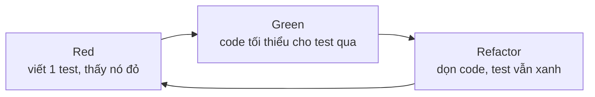

# TDD (Test-Driven Development): bằng chứng nghiên cứu nói gì và áp dụng thế nào cho đúng

> Nguồn: https://tiennhm.io.vn/blog/tdd-test-driven-development
> TDD là kỹ thuật viết test thất bại trước, viết code tối thiểu cho test qua, rồi refactor. Bài viết tổng hợp các nghiên cứu thực nghiệm (Nagappan 2008, Rafique & Mišić 2013, Fucci 2017), chỉ ra điều gì đã được chứng minh và điều gì còn tranh cãi, sau đó đi qua một kata C# với xUnit để thấy ba vòng Red-Green-Refactor chạy ra sao.

> **TDD (Test-Driven Development)** là kỹ thuật lặp ba bước ngắn: viết một test **thất bại** (Red), viết lượng code **tối thiểu** cho test qua (Green), rồi **dọn dẹp** mà vẫn giữ test xanh (Refactor). Các nghiên cứu thực nghiệm cho thấy bức tranh không đen trắng: ở bốn đội công nghiệp (Microsoft, IBM), mật độ lỗi giảm **40–90%** nhưng thời gian phát triển ban đầu tăng **15–35%**; phân tích tổng hợp 27 nghiên cứu thì chỉ thấy cải thiện **nhỏ** về chất lượng và **gần như không** ảnh hưởng năng suất. Một thí nghiệm với 39 lập trình viên chuyên nghiệp còn cho thấy thứ tự "test trước, code sau" **không có ảnh hưởng quan trọng**; kết quả gắn với việc làm **từng bước nhỏ, đều đặn**. Vì vậy TDD đáng dùng như một công cụ thiết kế và phản hồi nhanh, không phải tín điều.

Hầu hết bài về TDD rơi vào hai thái cực: hoặc là lời hứa "code sạch, ít bug" không kèm số liệu, hoặc là tranh luận "TDD đã chết" không kèm bằng chứng. Bài này đi đường giữa: đọc những gì nghiên cứu thực sự đo được, rồi đưa nó vào một ví dụ C# đủ nhỏ để làm theo.

## Tóm tắt nhanh (TL;DR)
- TDD = vòng lặp **Red → Green → Refactor**, mỗi vòng vài phút, do Kent Beck hệ thống hoá (2002).
- Bằng chứng công nghiệp: lỗi **giảm 40–90%**, thời gian ban đầu **tăng 15–35%** (Nagappan và cộng sự, 2008).
- Phân tích tổng hợp 27 nghiên cứu: tác động lên chất lượng **dương nhưng nhỏ**, lên năng suất **gần như không thấy** (Rafique & Mišić, 2013).
- Yếu tố gắn với kết quả tốt là **độ mịn của bước** (granularity) và tính đều đặn; thứ tự test-trước **không ảnh hưởng đáng kể** (Fucci và cộng sự, 2017, 39 lập trình viên chuyên nghiệp).
- TDD hợp nhất với **logic nghiệp vụ thuần**, kém hợp với UI, code khám phá (spike) và tích hợp hạ tầng.
- Đừng đo TDD bằng "số test" hay "% coverage"; hãy đo bằng **thời gian từ lúc sửa đến lúc biết mình hỏng gì**.

---

## TDD là gì, và không phải là gì
Beck mô tả TDD thành hai luật: chỉ viết code mới khi có một test tự động đang thất bại, và loại bỏ trùng lặp. Từ đó ra ba pha:

| Pha | Việc làm | Điều kiện thoát |
| --- | --- | --- |
| **Red** | Viết **một** test mô tả hành vi mong muốn | Test chạy và **thất bại đúng lý do** |
| **Green** | Viết code tối thiểu, kể cả hard-code | Toàn bộ test xanh |
| **Refactor** | Dọn code và test, không đổi hành vi | Test vẫn xanh |



Cần phân biệt với những thứ hay bị gộp chung:

- **Test-first** chỉ nói về thứ tự (viết test trước). TDD thêm vào **refactor có kỷ luật** và việc tiến từng bước nhỏ.
- **Unit test** là sản phẩm. TDD là **quy trình** tạo ra nó, và quan trọng hơn là tạo ra *thiết kế*.
- **ATDD/BDD** đặt test ở mức hành vi nghiệp vụ, thường là vòng ngoài bao quanh vòng TDD ở mức đơn vị.

Điểm hay bị bỏ qua: pha Red phải **thất bại đúng lý do**. Một test đỏ vì `NullReferenceException` trong code kiểm thử không chứng minh được gì về hành vi cần xây.

## Bằng chứng nghiên cứu
Phần này tách ra điều đã được đo từ điều chỉ là niềm tin. Các nghiên cứu khác nhau về bối cảnh (sinh viên hay chuyên gia, thí nghiệm hay case study), nên đọc chúng như những lát cắt, không phải một con số duy nhất.

| Nghiên cứu | Loại | Kết quả chính |
| --- | --- | --- |
| Nagappan, Maximilien, Bhat, Williams (2008), *Empirical Software Engineering* | Case study 4 đội công nghiệp | Mật độ lỗi giảm **40–90%**, thời gian phát triển tăng **15–35%** |
| Rafique & Mišić (2013), *IEEE TSE* | Phân tích tổng hợp 27 nghiên cứu | Cải thiện **nhỏ** về chất lượng ngoài, **gần như không** ảnh hưởng năng suất; nghiên cứu công nghiệp cho cả cải thiện chất lượng lẫn sụt giảm năng suất **lớn hơn** nghiên cứu học thuật |
| Fucci và cộng sự (2017), *IEEE TSE* | Thí nghiệm, 39 lập trình viên chuyên nghiệp | Thứ tự viết test và code **không có ảnh hưởng quan trọng**; cải thiện chất lượng và năng suất gắn với **độ mịn** và **tính đều đặn** của bước |
| Karac & Turhan (2018), *IEEE Software* | Bài tổng quan | Xem xét TDD đã giữ được bao nhiêu lời hứa, nhấn mạnh TDD không chỉ là viết test trước |
| Causevic, Sundmark, Punnekkat (2011), *ICST* | Tổng quan hệ thống | Bảy yếu tố cản trở áp dụng, gồm: tăng thời gian phát triển, thiếu kinh nghiệm TDD, thiếu thiết kế trước, vấn đề riêng của miền và công cụ, code kế thừa |

Ba điều rút ra:

1. **Lỗi giảm nhưng không miễn phí.** Con số 40–90% hấp dẫn, nhưng đi kèm 15–35% thời gian. Với đội phải sửa lỗi production tốn kém thì đáng; với prototype vứt đi thì không.
2. **Hiệu ứng nhỏ khi gộp nhiều nghiên cứu.** Rafique & Mišić thấy mức cải thiện chất lượng *và* mức sụt giảm năng suất đều lớn hơn ở nghiên cứu công nghiệp so với học thuật, tức là bối cảnh thật khuếch đại cả lợi lẫn giá phải trả. Sụt giảm năng suất cũng lớn hơn khi nhóm TDD bỏ ra nhiều công sức viết test hơn hẳn nhóm đối chứng.
3. **Cơ chế quan trọng hơn nhãn.** Trong thí nghiệm của Fucci, thứ tự viết test và code không có ảnh hưởng quan trọng; kết quả gắn với việc làm các bước nhỏ và đều. Các tác giả đề xuất lợi ích đến từ "những bước nhỏ, đều đặn giúp tập trung và giữ nhịp". Điều đáng giữ là **vòng phản hồi ngắn**.

> Lưu ý đọc nguồn: số liệu của Nagappan, Rafique & Mišić và Fucci được đối chiếu với tóm tắt công bố. Nếu trích lại cho mục đích học thuật, hãy mở bài gốc để kiểm tra bối cảnh mẫu, thang đo và khoảng tin cậy.

## Vì sao nó có thể hiệu quả: ba cơ chế
1. **Phản hồi ngắn.** Lỗi được phát hiện trong vài phút sau khi gõ, khi bạn còn nhớ mình vừa đổi gì. Chi phí tìm lỗi tăng mạnh theo khoảng cách từ lúc gây ra.
2. **Test là yêu cầu thực thi được.** Viết test trước buộc bạn trả lời "hàm này nhận gì, trả gì, sai thì làm gì" *trước* khi nghĩ đến cách cài đặt.
3. **Thiết kế bị kéo về phía dễ kiểm thử.** Code khó viết test thường là code ghép chặt (tight coupling). Cảm giác khó chịu khi viết test là tín hiệu thiết kế, không phải sự cố của công cụ.

Cũng cần nói thẳng giới hạn: cơ chế thứ ba chỉ đúng khi bạn **lắng nghe** tín hiệu đó. Nếu gặp test khó viết rồi chèn mock chằng chịt cho qua, TDD chỉ thêm gánh nặng bảo trì.

## Thực hành: kata tính giá đơn hàng bằng C# và xUnit
Yêu cầu giả định, đủ nhỏ để theo dõi:

- Đơn từ **1.000.000đ** trở lên được giảm **10%**.
- Khách **VIP** được giảm thêm **5%**, cộng dồn với mức trên.
- Tổng tiền hàng **âm** là dữ liệu không hợp lệ.

### Vòng 1: Red rồi Green bằng cách "giả"
Test đầu tiên chọn ca đơn giản nhất:

```csharp
public class OrderPricingTests
{
    [Fact]
    public void Total_UnderThreshold_NoDiscount()
    {
        var pricing = new OrderPricing();

        Assert.Equal(500_000m, pricing.Total(500_000m, isVip: false));
    }
}
```

Lúc này `OrderPricing` chưa tồn tại nên không biên dịch được; đó cũng là một dạng Red. Tạo lớp rỗng với phương thức ném `NotImplementedException` để test **chạy và đỏ** đúng lý do, rồi viết đủ để qua:

```csharp
public class OrderPricing
{
    public decimal Total(decimal subtotal, bool isVip) => subtotal;
}
```

Đây là kỹ thuật **Fake It**: trả về thứ test cần, chưa vội tổng quát hoá.

### Vòng 2: tam giác hoá
Thêm test buộc code phải thật sự tính toán (**triangulation**):

```csharp
[Fact]
public void Total_AtThreshold_Gets10PercentOff()
{
    var pricing = new OrderPricing();

    Assert.Equal(900_000m, pricing.Total(1_000_000m, isVip: false));
}
```

Test này đỏ. Cài đặt tối thiểu:

```csharp
public decimal Total(decimal subtotal, bool isVip)
    => subtotal >= 1_000_000m ? subtotal * 0.90m : subtotal;
```

Ca biên (đúng bằng ngưỡng) là chỗ lỗi `>` so với `>=` hay trốn; viết nó thành test từ sớm là thói quen rẻ mà hiệu quả.

### Vòng 3: VIP và dữ liệu không hợp lệ
```csharp
[Fact]
public void Total_VipUnderThreshold_Gets5PercentOff()
{
    var pricing = new OrderPricing();

    Assert.Equal(475_000m, pricing.Total(500_000m, isVip: true));
}

[Fact]
public void Total_VipAtThreshold_StacksTo15Percent()
{
    var pricing = new OrderPricing();

    Assert.Equal(850_000m, pricing.Total(1_000_000m, isVip: true));
}

[Fact]
public void Total_NegativeSubtotal_Throws()
{
    var pricing = new OrderPricing();

    Assert.Throws<ArgumentOutOfRangeException>(
        () => pricing.Total(-1m, isVip: false));
}
```

Cài đặt đến lúc này đã có điều kiện lồng nhau, đến lúc **Refactor** khi toàn bộ test đang xanh:

```csharp
public class OrderPricing
{
    const decimal BulkThreshold = 1_000_000m;
    const decimal BulkRate = 0.10m;
    const decimal VipRate = 0.05m;

    public decimal Total(decimal subtotal, bool isVip)
    {
        if (subtotal < 0)
            throw new ArgumentOutOfRangeException(nameof(subtotal));

        var rate = 0m;
        if (subtotal >= BulkThreshold) rate += BulkRate;
        if (isVip) rate += VipRate;

        return subtotal * (1 - rate);
    }
}
```

Refactor ở đây có tác dụng thật: các con số nghiệp vụ có tên, và quy tắc cộng dồn nằm ở một chỗ. Bộ test làm lưới an toàn: nếu sau này đổi sang giảm giá nhân dồn thay vì cộng dồn, test `StacksTo15Percent` sẽ đỏ ngay.

> Ghi chú kiểm chứng: các giá trị kỳ vọng (475.000, 850.000, 900.000) được tính tay từ quy tắc, còn mã C# trong bài chưa được biên dịch và chạy trong quá trình viết. Hãy chạy `dotnet test` trên máy của bạn trước khi dùng.

### Ba lỗi hay gặp khi mới tập
- **Viết nhiều test cùng lúc** rồi mới code. Bạn mất vòng phản hồi ngắn, thứ đáng giá nhất của TDD.
- **Bỏ qua Refactor.** Chỉ làm Red-Green sẽ ra bộ code chạy được nhưng lộn xộn, và test dần trở thành gánh nặng.
- **Test bám vào cài đặt** (kiểm tra gọi hàm nội bộ nào) thay vì hành vi quan sát được. Đổi cách cài đặt là test vỡ dù hành vi không đổi.

## Hai trường phái: Chicago và London
Khi code có phụ thuộc (repository, gateway), TDD tách làm hai cách tiếp cận:

| | **Chicago (cổ điển)** | **London (mockist)** |
| --- | --- | --- |
| Test kiểm tra | **Trạng thái** kết quả | **Tương tác** giữa các đối tượng |
| Phụ thuộc | Dùng đối tượng thật hoặc fake đơn giản | Thay bằng mock |
| Chạy từ | Trong ra ngoài | Ngoài vào trong (outside-in) |
| Rủi ro | Test rộng hơn, khó khoanh vùng | Test gắn chặt với cấu trúc nội bộ, dễ vỡ khi refactor |

Fowler phân tích sự khác biệt này trong *Mocks Aren't Stubs*, còn Freeman & Pryce trình bày cách London trong *Growing Object-Oriented Software, Guided by Tests*. Không có đáp án đúng tuyệt đối; với logic nghiệp vụ thuần như kata trên, kiểu Chicago thường ít đau hơn.

## Khi nào TDD không phải lựa chọn tốt
- **Code khám phá (spike).** Khi chưa biết mình đang xây gì, viết test trước chỉ khoá một giả định sai. Hãy spike, học, rồi vứt và viết lại bằng TDD.
- **UI và hiệu ứng thị giác.** Kết quả cần mắt người; test kiểu snapshot cho lợi ích thấp so với công bảo trì.
- **Tích hợp hạ tầng** (database, queue, mạng). Mock hạ tầng cho cảm giác an toàn giả; test tích hợp có chủ đích đáng tin hơn.
- **Code kế thừa không có đường may** (seam). Cần tách phụ thuộc trước, theo hướng dẫn của Feathers trong *Working Effectively with Legacy Code*, rồi mới TDD được.

Đây cũng khớp với các yếu tố cản trở Causevic và cộng sự tổng hợp: code kế thừa, vấn đề riêng của miền và công cụ, thiếu kinh nghiệm TDD.

## Checklist áp dụng
**Trước khi tuyên bố 'đội mình làm TDD'**

- [ ] Mỗi test đầu tiên được chạy và thấy đỏ đúng lý do trước khi viết code
- [ ] Mỗi vòng Red-Green kéo dài vài phút, không phải vài giờ
- [ ] Pha Refactor thực sự diễn ra, không bị bỏ qua khi gấp
- [ ] Test kiểm tra hành vi quan sát được, không kiểm tra chi tiết cài đặt
- [ ] Ca biên (ngưỡng, rỗng, âm, null) được viết thành test từ sớm
- [x] Chọn đúng chỗ dùng: logic nghiệp vụ thuần, không ép cho UI hay spike

## Câu hỏi thường gặp
## Câu hỏi thường gặp về TDD

### TDD có thật sự giảm lỗi không?

Có dấu hiệu giảm, nhưng độ lớn phụ thuộc bối cảnh. Case study trên bốn đội công nghiệp của Nagappan và cộng sự (2008) ghi nhận mật độ lỗi giảm 40–90% so với dự án tương đương không dùng TDD. Phân tích tổng hợp 27 nghiên cứu của Rafique và Mišić (2013) thì chỉ thấy cải thiện nhỏ về chất lượng ngoài, dù mức cải thiện ở các nghiên cứu công nghiệp lớn hơn ở nghiên cứu học thuật. Cách đọc thận trọng là: TDD thường giúp, nhưng đừng kỳ vọng con số cao nhất áp dụng cho đội của bạn.

### TDD làm chậm phát triển bao nhiêu?

Nghiên cứu của Nagappan và cộng sự báo cáo thời gian phát triển ban đầu tăng khoảng 15–35%. Phần chi phí này được kỳ vọng thu lại ở giai đoạn sửa lỗi và bảo trì. Với sản phẩm sống lâu thì thường đáng, với sản phẩm thử nghiệm ngắn hạn thì chưa chắc.

### Viết test sau khi code có kém hơn TDD không?

Không nhất thiết. Thí nghiệm của Fucci và cộng sự (2017) với 39 lập trình viên chuyên nghiệp kết luận thứ tự viết test và code không có ảnh hưởng quan trọng; chất lượng và năng suất gắn với việc làm theo các bước nhỏ và đều đặn. Tuy nhiên viết test sau dễ dẫn đến việc test chỉ phản chiếu code đang có, và dễ bỏ qua ca khó. TDD giữ kỷ luật này bằng cấu trúc quy trình.

### TDD khác gì unit test thông thường?

Unit test là sản phẩm: những đoạn code kiểm tra một đơn vị nhỏ. TDD là quy trình tạo ra chúng theo vòng Red-Green-Refactor, đồng thời dùng test để dẫn dắt thiết kế. Có thể có unit test mà không làm TDD, nhưng không thể làm TDD mà không có test tự động.

### Có nên dùng mock trong TDD không?

Dùng có chọn lọc. Mock hợp với ranh giới hệ thống như gọi dịch vụ bên ngoài. Dùng mock cho mọi phụ thuộc nội bộ làm test bám chặt vào cấu trúc code và vỡ khi refactor dù hành vi không đổi. Hãy ưu tiên đối tượng thật hoặc fake đơn giản khi chi phí thấp.

## Kết luận
TDD không phải liều thuốc chung, và bằng chứng nghiên cứu cũng không đủ mạnh để biến nó thành tín điều. Điều nghiên cứu ủng hộ là một nguyên tắc rộng hơn nhãn "TDD": **đi từng bước nhỏ, có phản hồi tự động sau mỗi bước, và dọn dẹp thường xuyên**.

Ba điều đáng nhớ:

1. **Chấp nhận đánh đổi có thật.** Lỗi ít hơn đổi lấy thời gian ban đầu nhiều hơn; hãy cân theo vòng đời sản phẩm của bạn.
2. **Giữ bước nhỏ.** Đây là yếu tố được thí nghiệm gần đây chỉ ra, và cũng là thứ dễ trượt nhất khi gấp.
3. **Dùng đúng chỗ.** Logic nghiệp vụ thuần là sân nhà của TDD; UI, spike và hạ tầng cần công cụ khác.

## Tài liệu tham khảo
- Beck, K. (2002). *Test-Driven Development: By Example*. Addison-Wesley.
- Nagappan, N., Maximilien, E. M., Bhat, T., Williams, L. (2008). Realizing quality improvement through test driven development: results and experiences of four industrial teams. *Empirical Software Engineering*, 13(3), 289–302.
- Rafique, Y., Mišić, V. B. (2013). The effects of test-driven development on external quality and productivity: a meta-analysis. *IEEE Transactions on Software Engineering*, 39(6), 835–856.
- Fucci, D., Erdogmus, H., Turhan, B., Oivo, M., Juristo, N. (2017). A dissection of the test-driven development process: does it really matter to test-first or to test-last? *IEEE Transactions on Software Engineering*, 43(7), 597–614.
- Karac, I., Turhan, B. (2018). What do we (really) know about test-driven development? *IEEE Software*, 35(4), 81–85.
- Causevic, A., Sundmark, D., Punnekkat, S. (2011). Factors limiting industrial adoption of test driven development: a systematic review. *ICST 2011*, 337–346.
- Fowler, M. (2007). *Mocks Aren't Stubs*. martinfowler.com.
- Freeman, S., Pryce, N. (2009). *Growing Object-Oriented Software, Guided by Tests*. Addison-Wesley.
- Feathers, M. (2004). *Working Effectively with Legacy Code*. Prentice Hall.

---

**Cập nhật lần cuối**: Tháng 10, 2026
