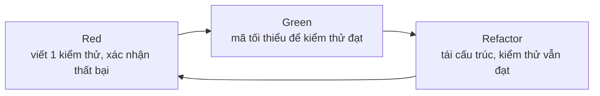

# Phát triển hướng kiểm thử (TDD) trong vòng đời phát triển hướng AI (AI-DLC): tổng quan bằng chứng và đề xuất thực hành

> Nguồn: https://tiennhm.io.vn/blog/tdd-test-driven-development
> Bài viết tổng quan bằng chứng thực nghiệm về Phát triển hướng kiểm thử (Test-Driven Development, TDD) và xem xét vai trò của nó trong vòng đời phát triển hướng AI (AI-DLC). TDD cho thấy lợi ích về chất lượng với chi phí thời gian ban đầu; trong AI-DLC, kiểm thử đóng vai trò đặc tả thực thi được để định hướng và kiểm chứng mã do AI sinh ra. Phần thực hành minh hoạ bằng một bài toán C# với xUnit.

> **Tóm tắt.** Phát triển hướng kiểm thử (Test-Driven Development, TDD) là kỹ thuật lặp ba bước: viết một kiểm thử thất bại (Red), viết lượng mã tối thiểu để kiểm thử đó đạt (Green), rồi tái cấu trúc mã trong khi giữ toàn bộ kiểm thử đạt (Refactor). Các nghiên cứu thực nghiệm trước kỷ nguyên AI cho kết quả không đồng nhất: nghiên cứu tình huống trên bốn đội công nghiệp ghi nhận mật độ lỗi giảm 40–90% với chi phí thời gian ban đầu tăng 15–35%, trong khi phân tích tổng hợp 27 nghiên cứu chỉ thấy cải thiện nhỏ về chất lượng. Trong vòng đời phát triển hướng AI (AI-Driven Development Life Cycle, AI-DLC), nơi mã nguồn ngày càng do mô hình ngôn ngữ lớn (LLM) sinh ra, kiểm thử có thêm một chức năng: đóng vai trò đặc tả thực thi được, qua đó làm rõ ý định và kiểm chứng đầu ra của AI. Các nghiên cứu về sinh mã dẫn dắt bởi kiểm thử từ 2023 đến 2026 cho thấy việc cung cấp kiểm thử cho LLM cải thiện kết quả trên các bộ chuẩn, và hướng mới nhất cho phép mô hình tự sinh rồi tinh chỉnh đồng thời cả kiểm thử lẫn mã. Tuy vậy, bằng chứng chủ yếu đến từ bài toán chuẩn quy mô nhỏ, và chất lượng của chính bộ kiểm thử đặt giới hạn cho mọi kết luận về tính đúng đắn. Chưa có đánh giá nào ở cấp toàn bộ vòng đời AI-DLC.

**Từ khoá:** TDD, AI-DLC, kiểm thử đơn vị, mô hình ngôn ngữ lớn, đặc tả thực thi được, tái cấu trúc.

## 1. Đặt vấn đề
Việc lập trình viên giao một phần ngày càng lớn công việc viết mã cho trợ lý AI (xem [loạt bài AI-Driven Development](https://tiennhm.io.vn/blog/phat-trien-phan-mem-ai-driven-development)) làm thay đổi câu hỏi trung tâm của kiểm thử. Trước đây, câu hỏi là "mã do con người viết có đúng không". Hiện nay, câu hỏi là "ai chịu trách nhiệm xác định thế nào là đúng, khi mã được sinh ra với tốc độ vượt khả năng đọc lại từng dòng".

TDD là ứng viên tự nhiên cho câu hỏi này, vì nó đặt định nghĩa của sự đúng đắn (kiểm thử) trước phần cài đặt. Tuy nhiên, các bằng chứng kinh điển về TDD được thu thập khi con người viết cả kiểm thử lẫn mã. Bài viết này nhằm trả lời ba câu hỏi:

1. Bằng chứng thực nghiệm hiện có nói gì về hiệu quả của TDD?
2. TDD có thể được đặt ở đâu trong AI-DLC, và các nghiên cứu về sinh mã bằng LLM hỗ trợ điều đó đến mức nào?
3. Một quy trình thực hành khả thi trông như thế nào, và những rủi ro nào cần kiểm soát?

Phạm vi tài liệu gồm các công bố đã được đối chiếu với phần tóm tắt trên nguồn gốc; cách xử lý chi tiết ở mục 7.

## 2. Cơ sở lý thuyết
### 2.1. Vòng lặp TDD
Beck (2002), trong [*Test-Driven Development: By Example*](https://dl.acm.org/doi/10.5555/579193), mô tả TDD qua hai quy tắc: chỉ viết mã mới khi có một kiểm thử tự động đang thất bại, và loại bỏ sự trùng lặp. Hai quy tắc này tạo thành vòng lặp ba pha:



| Pha | Hoạt động | Điều kiện kết thúc |
| --- | --- | --- |
| Red | Viết **một** kiểm thử mô tả hành vi mong muốn | Kiểm thử chạy và thất bại **đúng nguyên nhân dự kiến** |
| Green | Viết mã tối thiểu, có thể gán cứng kết quả | Toàn bộ kiểm thử đạt |
| Refactor | Cải thiện cấu trúc mã và kiểm thử, không đổi hành vi | Toàn bộ kiểm thử vẫn đạt |

Cần phân biệt TDD với ba khái niệm lân cận. *Test-first* chỉ quy định thứ tự viết kiểm thử trước; TDD bổ sung tái cấu trúc có kỷ luật và nhịp làm việc theo bước nhỏ. *Kiểm thử đơn vị* là sản phẩm, còn TDD là quy trình tạo ra sản phẩm đó và đồng thời định hình thiết kế. *ATDD/BDD* đặt kiểm thử ở mức hành vi nghiệp vụ, thường là vòng ngoài bao quanh vòng TDD ở mức đơn vị.

Một điều kiện dễ bị bỏ qua là pha Red phải thất bại đúng nguyên nhân. Kiểm thử đỏ do lỗi ngoại lệ trong chính mã kiểm thử không chứng minh được điều gì về hành vi cần xây dựng.

### 2.2. AI-DLC
AI-DLC do [Raja SP (AWS) đề xuất](https://aws.amazon.com/blogs/devops/ai-driven-development-life-cycle), công bố ngày 31/07/2025. Phương pháp này chủ trương AI đóng vai trò chủ thể thực thi, còn con người giữ thẩm quyền ra quyết định ở các điểm cần ngữ cảnh nghiệp vụ và phán đoán, theo nguyên lý "AI Powered Execution with Human Oversight". Vòng đời gồm ba pha:

- **Inception:** AI chuyển ý định nghiệp vụ thành yêu cầu, câu chuyện người dùng và các đơn vị công việc thông qua hoạt động *Mob Elaboration*, trong đó nhóm liên chức năng thẩm định các đề xuất và câu hỏi của AI.
- **Construction:** AI đề xuất kiến trúc logic, mô hình miền, mã nguồn và bộ kiểm thử thông qua *Mob Construction*; nhóm làm rõ các quyết định kỹ thuật theo thời gian thực.
- **Operations:** AI quản lý hạ tầng dưới dạng mã và triển khai, dựa trên ngữ cảnh tích luỹ từ các pha trước.

Về thuật ngữ, *Bolt* thay cho sprint (chu kỳ tính bằng giờ hoặc ngày), và *Unit of Work* thay cho epic. Trong mô tả này, kiểm thử xuất hiện như một sản phẩm do AI sinh ra liên tục trong Construction. Tài liệu giới thiệu nói đến việc AI áp dụng chuẩn mã hoá, mẫu thiết kế và yêu cầu bảo mật của tổ chức khi sinh bộ kiểm thử. Vì vậy, việc gắn TDD vào AI-DLC trong bài này là **đề xuất của tác giả bài viết**, không phải nội dung được quy định trong tài liệu gốc.

## 3. Bằng chứng thực nghiệm về TDD
Các nghiên cứu dưới đây khác nhau về đối tượng (sinh viên hay chuyên gia), thiết kế (thí nghiệm hay nghiên cứu tình huống) và thang đo, nên cần đọc như những lát cắt bổ sung cho nhau thay vì một con số duy nhất.

| Nghiên cứu | Loại hình | Kết quả chính |
| --- | --- | --- |
| [Nagappan, Maximilien, Bhat, Williams (2008)](https://www.microsoft.com/en-us/research/wp-content/uploads/2009/10/Realizing-Quality-Improvement-Through-Test-Driven-Development-Results-and-Experiences-of-Four-Industrial-Teams-nagappan_tdd.pdf) | Nghiên cứu tình huống, 4 đội (3 Microsoft, 1 IBM) | Mật độ lỗi trước phát hành giảm 40–90% so với dự án tương đương; thời gian phát triển ban đầu tăng 15–35% |
| [Rafique & Mišić (2013)](https://ieeexplore.ieee.org/document/6197200) | Phân tích tổng hợp, 27 nghiên cứu | Cải thiện nhỏ về chất lượng ngoài, gần như không ảnh hưởng năng suất; nghiên cứu công nghiệp cho mức cải thiện chất lượng và mức sụt giảm năng suất đều lớn hơn nghiên cứu học thuật |
| [Fucci và cộng sự (2017)](https://arxiv.org/abs/1611.05994) | Thí nghiệm, 39 lập trình viên chuyên nghiệp | Thứ tự viết kiểm thử và mã không có ảnh hưởng quan trọng; chất lượng và năng suất gắn với độ mịn và tính đều đặn của các bước |
| [Causevic, Sundmark, Punnekkat (2011)](https://dl.acm.org/doi/10.1109/ICST.2011.19) | Tổng quan hệ thống | Bảy yếu tố cản trở áp dụng, gồm tăng thời gian phát triển, thiếu kinh nghiệm TDD, thiếu thiết kế trước, vấn đề riêng của miền và công cụ, mã kế thừa |
| [George & Williams (2004)](https://www.sciencedirect.com/science/article/pii/S0950584903002040) | Thí nghiệm, 24 lập trình viên chuyên nghiệp làm việc theo cặp | Nhóm TDD vượt thêm 18% số kiểm thử hộp đen chức năng nhưng mất nhiều hơn 16% thời gian; nhóm đối chứng thường không viết đủ kiểm thử tự động sau khi viết mã |
| [Romano và cộng sự (2017)](https://doi.org/10.1016/j.infsof.2017.03.010) | Nghiên cứu đa phương pháp (định tính), lập trình viên mới vào nghề và chuyên nghiệp | Khảo sát các giá trị, niềm tin và giả định của người áp dụng TDD, tức cách con người thực sự vận hành TDD thay vì chỉ đo kết quả |

Ba nhận xét rút ra từ bảng trên:

1. **Lợi ích về chất lượng đi kèm chi phí.** Mức giảm lỗi 40–90% không tách rời khỏi mức tăng 15–35% thời gian ban đầu. Thí nghiệm sớm hơn của George & Williams (2004) cho cùng một cấu trúc đánh đổi: chất lượng chức năng cao hơn 18%, thời gian nhiều hơn 16%. Giá trị ròng phụ thuộc vào chi phí của lỗi trong môi trường cụ thể.
2. **Bối cảnh khuếch đại cả lợi ích lẫn chi phí.** Phân tích của Rafique & Mišić cho thấy nghiên cứu công nghiệp có cả mức cải thiện chất lượng lẫn mức sụt giảm năng suất lớn hơn nghiên cứu học thuật. Mức sụt giảm năng suất cũng lớn hơn khi nhóm áp dụng TDD đầu tư công sức kiểm thử nhiều hơn đáng kể so với nhóm đối chứng.
3. **Cơ chế quan trọng hơn thứ tự.** Fucci và cộng sự không tìm thấy ảnh hưởng quan trọng của việc viết kiểm thử trước hay sau; kết quả tốt gắn với bước nhỏ và đều. Các tác giả đề xuất lợi ích đến từ "những bước nhỏ, đều đặn giúp tập trung và giữ nhịp". Đây là điểm có ý nghĩa đặc biệt cho mục 4.

[Karac & Turhan (2018)](https://doi.org/10.1109/MS.2018.2801554) cũng xem xét TDD đã đáp ứng được bao nhiêu kỳ vọng đặt ra, nhấn mạnh rằng TDD không chỉ là viết kiểm thử trước. Bài viết này không trích dẫn kết luận định lượng của công bố đó. Một thí nghiệm có kiểm soát đăng trên *Information and Software Technology* năm 2011 so sánh TDD với kiểm thử viết sau theo từng bước nhỏ cũng thường được viện dẫn trong tranh luận về năng suất; do không đối chiếu được nội dung kết quả, bài này không đưa nó vào bảng trên (xem mục 7).

## 4. TDD trong bối cảnh AI-DLC
### 4.1. Kiểm thử như đặc tả thực thi được
Khi mã do LLM sinh ra, một yêu cầu bằng ngôn ngữ tự nhiên thường chứa nhiều điểm mơ hồ mà mô hình sẽ giải quyết theo cách riêng của nó. Kiểm thử loại bỏ sự mơ hồ này bằng một phát biểu có thể chạy được. Một số nghiên cứu gần đây khảo sát hướng tiếp cận này:

| Nghiên cứu | Thiết kế | Kết quả chính |
| --- | --- | --- |
| [Fakhoury và cộng sự (2024)](https://arxiv.org/abs/2404.10100), TiCoder, *IEEE TSE* | Quy trình tương tác dùng kiểm thử để làm rõ ý định; nghiên cứu người dùng với 15 lập trình viên; 4 LLM, 2 tập dữ liệu Python | Độ chính xác pass@1 tăng trung bình tuyệt đối 45,97% trong vòng 5 lần tương tác; tải nhận thức của người tham gia giảm có ý nghĩa |
| [Liang và cộng sự (2026)](https://arxiv.org/abs/2602.03557), ClassEval-TDD | Khung lặp theo TDD cho sinh mã mức lớp, 8 LLM | Độ đúng đắn tăng 12–26 điểm phần trăm so với sinh trực tiếp; tối đa 71% lớp đúng hoàn toàn |
| [Piya & Sullivan (2023)](https://arxiv.org/abs/2312.04687), LLM4TDD | ChatGPT trên bài toán LeetCode, đưa kiểm thử vào dần dần | Khảo sát ảnh hưởng của thuộc tính kiểm thử, câu lệnh gợi ý và bài toán; không trích số liệu cụ thể trong bài này |
| [Mathews & Nagappan (2024)](https://arxiv.org/abs/2402.13521) | Cung cấp kiểm thử cùng đề bài cho GPT-4 và Llama 3; bộ chuẩn MBPP và HumanEval | Việc đưa thêm kiểm thử vào đề bài giúp mô hình giải bài thành công nhiều hơn; các tác giả xem TDD là hướng giúp mã do LLM sinh ra bám yêu cầu |
| [Cui (2025)](https://arxiv.org/abs/2505.09027), Tests as Prompt | Bộ chuẩn WebApp1K, 1.000 thử thách thuộc 20 lĩnh vực, 19 LLM tiên tiến; kiểm thử vừa là câu lệnh gợi ý vừa là phép kiểm chứng | Khả năng tuân thủ chỉ dẫn và học trong ngữ cảnh quan trọng hơn năng lực lập trình thuần tuý; phát hiện hiện tượng mất chỉ dẫn khi câu lệnh dài |
| [Yu và cộng sự (2026)](https://arxiv.org/abs/2608.16742), TDD-Agent (bản thảo arXiv) | Mô hình sinh kiểm thử trước, rồi tinh chỉnh song song cả mã lẫn kiểm thử theo phản hồi thực thi; đánh giá trên LiveCodeBench và RepoEval | Cải thiện so với các cơ sở so sánh dựa trên suy luận, truy xuất và tác tử; bộ kiểm thử sau tinh chỉnh có tỷ lệ đạt, độ phủ và điểm đột biến cao hơn |
| [Cassieri và cộng sự](https://doi.org/10.1145/3828553), *ACM TOSEM* | Nghiên cứu phòng thí nghiệm, thí nghiệm có kiểm soát với sinh viên sau đại học, ba nghiên cứu định tính trong công nghiệp về AI sinh mã cho TDD | Chưa đối chiếu được kết quả cụ thể; được ghi nhận như bằng chứng rằng chủ đề đang được nghiên cứu đa phương pháp |

Các kết quả cùng hướng: cung cấp kiểm thử cho mô hình, và cho phép mô hình lặp lại theo phản hồi, cải thiện đáng kể độ chính xác so với sinh trực tiếp từ mô tả. Cần lưu ý ba giới hạn. Thứ nhất, các thực nghiệm dùng bài toán chuẩn (hàm, lớp đơn lẻ), chưa phản ánh hệ thống nhiều thành phần. Thứ hai, "độ chính xác" ở đây được đo bằng chính các bộ kiểm thử, nên phụ thuộc chất lượng của chúng (xem 4.2). Thứ ba, mẫu người dùng của TiCoder nhỏ (15 người). Ngoài ra, TDD-Agent mới ở dạng bản thảo trên arXiv, chưa qua phản biện. Kết quả của Cui (2025) có một hàm ý thực hành đáng lưu ý, ở mức suy luận: nếu mô hình mất chỉ dẫn khi câu lệnh dài, thì việc đưa kiểm thử vào theo từng bước nhỏ phù hợp hơn việc đưa một bộ kiểm thử lớn một lần, điều này cũng trùng với khuyến nghị về bước nhỏ ở mục 3.

### 4.2. Chất lượng kiểm thử là giới hạn của tính đúng đắn
[Liu và cộng sự (2023)](https://arxiv.org/abs/2305.01210) với EvalPlus mở rộng bộ kiểm thử của HumanEval lên 80 lần và đánh giá lại 26 LLM. Tỷ lệ đạt giảm tới 19,3–28,9%, và thứ hạng giữa các mô hình thay đổi: hai mô hình mã nguồn mở vượt ChatGPT trên bộ kiểm thử mở rộng nhưng không vượt trên bộ gốc. Các tác giả kết luận sự thiếu hụt của kiểm thử có thể dẫn tới xếp hạng sai.

Kết quả này không thuộc về TDD thuần tuý, nhưng có hệ quả trực tiếp khi AI-DLC cho AI sinh cả mã lẫn kiểm thử. Nếu một mô hình viết kiểm thử dựa trên chính cách hiểu của nó về yêu cầu, rồi viết mã để đạt các kiểm thử đó, thì việc "tất cả kiểm thử đạt" chỉ chứng minh sự nhất quán nội bộ của mô hình, không chứng minh sự phù hợp với ý định nghiệp vụ. Đây là lập luận suy diễn của tác giả bài viết, chưa có nghiên cứu nào được tìm thấy đo trực tiếp hiện tượng này trong AI-DLC.

Cần cân bằng lập luận trên với TDD-Agent (Yu và cộng sự, 2026): hệ thống này để chính mô hình sinh kiểm thử rồi tinh chỉnh cả kiểm thử lẫn mã theo phản hồi thực thi, và báo cáo bộ kiểm thử cải thiện về tỷ lệ đạt, độ phủ và điểm đột biến. Điều đó cho thấy kiểm thử do AI sinh ra không vô giá trị, và việc để AI tinh chỉnh kiểm thử là hướng đáng nghiên cứu. Tuy vậy, các đánh giá này dựa trên bộ chuẩn, không đo mức độ phù hợp với ý định nghiệp vụ của một tổ chức cụ thể và chưa đánh giá vai trò của con người thẩm định. Vì vậy bài này giữ lập trường thận trọng ở mục 4.3: để AI hỗ trợ soạn thảo kiểm thử, nhưng con người xác nhận chúng. Các rủi ro rộng hơn của việc giao mã cho AI được phân tích ở [phần 3 của loạt bài AI-Driven Development](https://tiennhm.io.vn/blog/phat-trien-phan-mem-ai-driven-development-phan-3); cách đưa tri thức kỹ thuật của dự án vào tác tử AI được bàn ở [bài về agent skills](https://tiennhm.io.vn/blog/agent-skills-co-che-va-tri-thuc-bi-bo-qua).

### 4.3. Đề xuất phân vai
Từ hai nhận xét trên, bài viết đề xuất một nguyên tắc phân vai, đối chiếu với các pha AI-DLC:

| Pha AI-DLC | Hoạt động TDD tương ứng | Vai trò đề xuất |
| --- | --- | --- |
| Inception (Mob Elaboration) | Chuyển tiêu chí chấp nhận thành ví dụ cụ thể và kiểm thử ở mức hành vi | AI soạn thảo, **con người thẩm định** vì đây là nơi ý định nghiệp vụ được cố định |
| Construction (Mob Construction), pha Red | Viết kiểm thử đơn vị mô tả hành vi tiếp theo | **Con người viết hoặc phê duyệt từng kiểm thử** trước khi AI viết mã |
| Construction, pha Green | Cài đặt tối thiểu để kiểm thử đạt | **AI thực hiện**; kết quả được kiểm chứng bằng kiểm thử, không bằng việc đọc lướt |
| Construction, pha Refactor | Tái cấu trúc khi toàn bộ kiểm thử đạt | AI đề xuất, con người xét duyệt; kiểm thử là lưới an toàn |


File gốc: [nền sáng](pathname:///files/diagrams/2026-10-08-tdd-test-driven-development/vi/tdd-ai-dlc-roles.html) · [nền tối](pathname:///files/diagrams/2026-10-08-tdd-test-driven-development/vi/tdd-ai-dlc-roles-dark.html)

Cơ sở của việc đặt thẩm quyền ở pha Red: đó là nơi định nghĩa sự đúng đắn, tương ứng với nguyên lý thẩm quyền quyết định thuộc về con người của AI-DLC. Cơ sở của việc giao pha Green cho AI: đây là phần có phản hồi tự động rõ ràng nhất, đúng loại tác vụ mà các nghiên cứu ở 4.1 cho thấy mô hình xử lý tốt hơn khi có kiểm thử dẫn dắt.

Nhịp làm việc cũng tương thích. Fucci và cộng sự gắn kết quả tốt với bước nhỏ và đều, còn AI-DLC dùng Bolt (giờ hoặc ngày) thay cho sprint. Mỗi vòng Red-Green-Refactor có thể xem là đơn vị mịn hơn nằm trong một Bolt.

### 4.4. Khoảng trống nghiên cứu
Hiện có hai nhánh tài liệu riêng rẽ. Nhánh thứ nhất là TDD cho sinh mã bằng LLM (mục 4.1). Nhánh thứ hai nhìn AI trên toàn bộ vòng đời phát triển phần mềm: [Guimaraes & Nascimento (2025)](https://doi.org/10.1145/3696630.3730538), trong *FSE Companion*, xem xét tác động của AI qua các pha của vòng đời và nêu một chương trình nghiên cứu; [Bhati (2026)](https://arxiv.org/abs/2604.26275) mô tả sự chuyển từ hoàn thành mã sang các hệ thống tác tử làm việc ở mức kho mã, tính năng hoặc thuật toán, đề xuất kiến trúc tham chiếu sáu lớp và nêu năm vấn đề mở (đánh giá, quản trị, nợ kỹ thuật, tái phân bổ kỹ năng, kinh tế của sự chú ý). Bhati cũng tổng hợp mức tiết kiệm thời gian 13,6–55,8% trong các nghiên cứu có kiểm soát về AI hỗ trợ lập trình; đây là con số về AI nói chung, không riêng TDD.

Trong phạm vi tìm kiếm của tác giả, chưa thấy nghiên cứu nào đánh giá một vòng đời phát triển hướng AI được thiết kế xoay quanh TDD ở quy mô dự án công nghiệp. Việc ghép hai nhánh để kết luận về quy trình kết hợp là suy luận, cần được kiểm chứng.

**Đề xuất thiết kế nghiên cứu (của tác giả bài viết, chưa thực hiện).** Một thí nghiệm có kiểm soát có thể so sánh hai nhóm: nhóm A dùng AI theo cách thông thường (yêu cầu, AI viết mã, rồi kiểm thử), nhóm B dùng AI kết hợp TDD (yêu cầu, kiểm thử, AI viết mã, kiểm thử, tái cấu trúc). Cách thiết kế này không đòi hỏi giả định rằng AI giỏi hơn lập trình viên. Các chỉ số có thể đo:

| Khía cạnh | Chỉ số |
| --- | --- |
| Tính đúng đắn | Tỷ lệ kiểm thử đạt |
| Độ bền vững của kiểm thử | Điểm đột biến (mutation score) |
| Chất lượng | Mật độ lỗi |
| Khả năng bảo trì | Độ phức tạp, độ ghép nối |
| Năng suất | Thời gian cho mỗi tác vụ |
| Hiệu quả của AI | Số token cho mỗi tác vụ, tỷ lệ tác vụ thành công của tác tử |
| Công sức của con người | Số lần can thiệp |
| Độ tin cậy | Tỷ lệ hồi quy |

Về mặt khung quy trình, có thể hình dung một biến thể của AI-DLC đặt kiểm thử ở trung tâm: yêu cầu của con người, phân tích yêu cầu và tiêu chí chấp nhận do AI soạn, kiểm thử (Red), cài đặt (Green), tái cấu trúc, rà soát mã, kiểm thử đột biến, tích hợp và đầu cuối, phê duyệt của con người, vận hành, rồi phản hồi từ môi trường thật quay lại thành kiểm thử mới. Đây là một hình dung thiết kế, không phải khung đã được kiểm chứng.

## 5. Minh hoạ thực hành
Bài toán giả định, đủ nhỏ để theo dõi: đơn hàng từ 1.000.000 trở lên được giảm 10%; khách VIP được giảm thêm 5% cộng dồn; tổng tiền hàng âm là dữ liệu không hợp lệ. Theo phân vai ở 4.3, người phát triển viết kiểm thử, trợ lý AI đề xuất cài đặt.

### 5.1. Vòng 1: Red, rồi Green bằng cách giả lập
Kiểm thử đầu tiên chọn tình huống đơn giản nhất:

```csharp
public class OrderPricingTests
{
    [Fact]
    public void Total_UnderThreshold_NoDiscount()
    {
        var pricing = new OrderPricing();

        Assert.Equal(500_000m, pricing.Total(500_000m, isVip: false));
    }
}
```

Lớp `OrderPricing` chưa tồn tại nên đoạn mã chưa biên dịch được, đây cũng là một dạng Red. Cần tạo lớp rỗng với phương thức ném `NotImplementedException` để kiểm thử chạy và thất bại đúng nguyên nhân, sau đó viết lượng mã đủ để đạt:

```csharp
public class OrderPricing
{
    public decimal Total(decimal subtotal, bool isVip) => subtotal;
}
```

Đây là kỹ thuật *Fake It* của Beck: trả về đúng giá trị kiểm thử cần, chưa tổng quát hoá. Với trợ lý AI, pha này đặc biệt quan trọng: người phát triển cần quan sát kiểm thử **thật sự đỏ** trước khi yêu cầu AI viết mã.

### 5.2. Vòng 2: tam giác hoá
Bổ sung kiểm thử buộc mã phải tính toán thật (*triangulation*):

```csharp
[Fact]
public void Total_AtThreshold_Gets10PercentOff()
{
    var pricing = new OrderPricing();

    Assert.Equal(900_000m, pricing.Total(1_000_000m, isVip: false));
}
```

```csharp
public decimal Total(decimal subtotal, bool isVip)
    => subtotal >= 1_000_000m ? subtotal * 0.90m : subtotal;
```

Giá trị biên (đúng bằng ngưỡng) là nơi lỗi `>` so với `>=` thường xuất hiện. Một trợ lý AI có thể chọn sai biên nếu yêu cầu chỉ được mô tả bằng lời; kiểm thử biên loại bỏ khả năng này.

### 5.3. Vòng 3: VIP, dữ liệu không hợp lệ và tái cấu trúc
```csharp
[Fact]
public void Total_VipUnderThreshold_Gets5PercentOff()
{
    var pricing = new OrderPricing();

    Assert.Equal(475_000m, pricing.Total(500_000m, isVip: true));
}

[Fact]
public void Total_VipAtThreshold_StacksTo15Percent()
{
    var pricing = new OrderPricing();

    Assert.Equal(850_000m, pricing.Total(1_000_000m, isVip: true));
}

[Fact]
public void Total_NegativeSubtotal_Throws()
{
    var pricing = new OrderPricing();

    Assert.Throws<ArgumentOutOfRangeException>(
        () => pricing.Total(-1m, isVip: false));
}
```

Khi toàn bộ kiểm thử đạt, pha Refactor loại bỏ điều kiện lồng nhau và đặt tên cho các hằng số nghiệp vụ:

```csharp
public class OrderPricing
{
    const decimal BulkThreshold = 1_000_000m;
    const decimal BulkRate = 0.10m;
    const decimal VipRate = 0.05m;

    public decimal Total(decimal subtotal, bool isVip)
    {
        if (subtotal < 0)
            throw new ArgumentOutOfRangeException(nameof(subtotal));

        var rate = 0m;
        if (subtotal >= BulkThreshold) rate += BulkRate;
        if (isVip) rate += VipRate;

        return subtotal * (1 - rate);
    }
}
```

Quy tắc cộng dồn nay nằm ở một vị trí. Nếu về sau mô hình hoặc con người đổi sang giảm giá nhân dồn, kiểm thử `StacksTo15Percent` sẽ thất bại ngay. Đây là chức năng "lưới an toàn" của bộ kiểm thử, và càng quan trọng khi mã được thay đổi hàng loạt bởi AI.

> **Ghi chú kiểm chứng.** Các giá trị kỳ vọng (475.000; 850.000; 900.000) được tính tay theo quy tắc. Mã C# trong bài chưa được biên dịch và chạy khi biên soạn. Cần chạy `dotnet test` trước khi sử dụng.

### 5.4. Các sai lệch thường gặp
- **Viết nhiều kiểm thử cùng lúc rồi mới yêu cầu mã.** Mất vòng phản hồi ngắn, vốn là yếu tố được gắn với kết quả tốt (Fucci và cộng sự, 2017). Với AI, rủi ro tăng vì mô hình dễ sinh ra một khối lớn mã khó thẩm định.
- **Bỏ qua Refactor.** Chỉ thực hiện Red-Green tạo ra mã chạy được nhưng thiếu cấu trúc, và kiểm thử dần trở thành gánh nặng bảo trì.
- **Kiểm thử bám vào cài đặt thay vì hành vi quan sát được.** Thay đổi cài đặt làm vỡ kiểm thử dù hành vi không đổi.
- **Để AI viết cả kiểm thử lẫn mã mà không thẩm định kiểm thử** (xem 4.2).

## 6. Hạn chế và phạm vi áp dụng
**Trường phái.** Khi mã có phụ thuộc, TDD tách thành hai cách tiếp cận. Trường phái Chicago (cổ điển) kiểm tra *trạng thái* kết quả, dùng đối tượng thật hoặc đối tượng giả đơn giản, và đi từ trong ra ngoài. Trường phái London (mockist) kiểm tra *tương tác* giữa các đối tượng bằng mock, và đi từ ngoài vào trong ([Fowler, 2007](https://martinfowler.com/articles/mocksArentStubs.html); Freeman & Pryce, 2009). Với logic nghiệp vụ thuần như ví dụ ở mục 5, cách tiếp cận cổ điển thường ít gắn chặt vào cấu trúc nội bộ hơn. Việc có thể thay phụ thuộc bằng đối tượng giả hay không phụ thuộc vào thiết kế theo nguyên lý đảo ngược phụ thuộc, trình bày ở [bài Clean Architecture](https://tiennhm.io.vn/docs/dotnet-backend-zero-to-senior/stage-05-senior-engineering/module-16-clean-architecture/16.3-uncle-bob); riêng với repository, [bài Unit of Work và Repository](https://tiennhm.io.vn/docs/dotnet-backend-zero-to-senior/stage-04-database-production/module-13-entity-framework-core/13.9-unit-of-work-and-repository-pattern) phân tích vì sao kiểm thử tích hợp thường thay thế được nhu cầu giả lập.

**Tình huống kém phù hợp.**

- *Mã khám phá (spike).* Khi chưa biết cần xây dựng gì, viết kiểm thử trước chỉ cố định một giả định có thể sai. Nên khám phá, rút ra hiểu biết, loại bỏ mã rồi viết lại bằng TDD.
- *Giao diện và hiệu ứng thị giác.* Kết quả cần đánh giá bằng mắt người; kiểm thử dạng ảnh chụp mang lại lợi ích thấp so với chi phí bảo trì.
- *Tích hợp hạ tầng* (cơ sở dữ liệu, hàng đợi, mạng). Giả lập hạ tầng dễ tạo cảm giác an toàn sai; kiểm thử tích hợp có chủ đích đáng tin cậy hơn (xem [bài API Testing](https://tiennhm.io.vn/docs/dotnet-backend-zero-to-senior/stage-03-aspnet-core-backend/module-09-web-api-professional/9.8-api-testing) về WebApplicationFactory và Testcontainers).
- *Mã kế thừa không có điểm tách (seam).* Cần tách phụ thuộc trước, theo hướng dẫn của Feathers (2004), rồi mới áp dụng TDD.

**Mối đe doạ tính hợp lệ của tổng quan này.** Số liệu ở mục 3 chủ yếu thuộc giai đoạn trước trợ lý AI; số liệu ở 4.1 và 4.2 đến từ bài toán và bộ chuẩn quy mô nhỏ. Phần 4.3 là đề xuất chưa được kiểm chứng thực nghiệm.

## 7. Phương pháp xử lý tài liệu
Số liệu của Nagappan và cộng sự, Rafique & Mišić, Fucci và cộng sự, Causevic và cộng sự, George & Williams, Fakhoury và cộng sự, Liang và cộng sự, Liu và cộng sự, Mathews & Nagappan, Cui, Yu và cộng sự, Bhati được đối chiếu với phần tóm tắt công bố tại nguồn gốc (nhà xuất bản, arXiv) hoặc qua kết quả tìm kiếm trích tóm tắt. Một số trang nhà xuất bản chặn truy cập tự động, nên với George & Williams và Romano và cộng sự chỉ đối chiếu được qua nguồn thứ cấp. Piya & Sullivan chỉ đối chiếu được phần tóm tắt, không có số liệu định lượng; Karac & Turhan, Guimaraes & Nascimento và Cassieri và cộng sự chỉ đối chiếu được thông tin xuất bản và mô tả thiết kế, không có kết quả chi tiết. Thí nghiệm năm 2011 đăng trên *Information and Software Technology* (Pančur & Ciglarič, 53(6), 557–573) chưa được đưa vào vì các bản tóm tắt thứ cấp tìm được mô tả kết quả không nhất quán với nhau. TDD-Agent là bản thảo arXiv, chưa qua phản biện. Khi trích dẫn cho mục đích học thuật, cần mở bài gốc để kiểm tra cỡ mẫu, thang đo, khoảng tin cậy và các điều kiện thực nghiệm. Các phát biểu về AI-DLC dựa trên bài giới thiệu của tác giả phương pháp, không dựa trên đánh giá độc lập.

## Danh sách kiểm tra áp dụng
**Trước khi xác nhận quy trình TDD có AI tham gia**

- [ ] Mỗi kiểm thử mới được chạy và quan sát thất bại đúng nguyên nhân trước khi AI viết mã
- [ ] Con người viết hoặc phê duyệt từng kiểm thử; kiểm thử do AI soạn đều được thẩm định đối chiếu yêu cầu
- [ ] Mỗi vòng Red-Green-Refactor đủ nhỏ để thẩm định được đầu ra của AI
- [ ] Pha Refactor thực sự diễn ra, không bị bỏ qua khi gấp
- [ ] Kiểm thử mô tả hành vi quan sát được, không mô tả chi tiết cài đặt
- [ ] Giá trị biên (ngưỡng, rỗng, âm, null) được viết thành kiểm thử từ sớm
- [x] Phạm vi áp dụng phù hợp: logic nghiệp vụ thuần, không ép cho giao diện hay mã khám phá

## Câu hỏi thường gặp
## Câu hỏi thường gặp về TDD và AI-DLC

### TDD có thực sự giảm lỗi không?

Có dấu hiệu giảm, nhưng mức độ phụ thuộc bối cảnh. Nghiên cứu tình huống trên bốn đội công nghiệp của Nagappan và cộng sự (2008) ghi nhận mật độ lỗi giảm 40–90% so với dự án tương đương không dùng TDD. Phân tích tổng hợp 27 nghiên cứu của Rafique và Mišić (2013) chỉ thấy cải thiện nhỏ về chất lượng ngoài, dù mức cải thiện ở nghiên cứu công nghiệp lớn hơn ở nghiên cứu học thuật.

### TDD làm chậm phát triển bao nhiêu?

Nagappan và cộng sự báo cáo thời gian phát triển ban đầu tăng khoảng 15–35%. Chi phí này được kỳ vọng thu hồi ở giai đoạn sửa lỗi và bảo trì, nên thường hợp lý với sản phẩm vòng đời dài và kém hợp lý với thử nghiệm ngắn hạn.

### AI-DLC là gì và có yêu cầu TDD không?

AI-DLC là phương pháp phát triển phần mềm do Raja SP (AWS) đề xuất năm 2025, gồm ba pha Inception, Construction và Operations, trong đó AI thực thi còn con người giữ thẩm quyền quyết định. Bài giới thiệu phương pháp mô tả kiểm thử là sản phẩm do AI sinh ra trong Construction và không quy định TDD. Việc kết hợp TDD với AI-DLC trong bài này là đề xuất của tác giả bài viết.

### Tại sao không để AI viết cả kiểm thử lẫn mã?

Nếu cùng một mô hình hiểu sai yêu cầu, kiểm thử và mã sẽ sai nhất quán và vẫn đạt. Nghiên cứu EvalPlus (Liu và cộng sự, 2023) cho thấy bộ kiểm thử thiếu hụt có thể làm tỷ lệ đạt bị thổi phồng tới 19,3–28,9% và làm sai thứ hạng giữa các mô hình. Các hệ thống như TDD-Agent (Yu và cộng sự, 2026, bản thảo) cho thấy để AI tự sinh và tinh chỉnh kiểm thử có thể cải thiện kết quả trên bộ chuẩn, nhưng chưa đo mức độ phù hợp với ý định nghiệp vụ. Vì vậy nên cho AI hỗ trợ soạn kiểm thử, còn con người thẩm định, vì đây là nơi sự đúng đắn được định nghĩa.

### Cung cấp kiểm thử cho LLM có thật sự giúp sinh mã tốt hơn không?

Các nghiên cứu trên bộ chuẩn cho kết quả cùng chiều. Mathews và Nagappan (2024) thấy việc đưa kiểm thử vào đề bài giúp GPT-4 và Llama 3 giải bài thành công nhiều hơn trên MBPP và HumanEval. Fakhoury và cộng sự (2024) ghi nhận pass@1 tăng trung bình tuyệt đối 45,97% với quy trình tương tác dựa trên kiểm thử. Giới hạn là các thực nghiệm dùng bài toán chuẩn quy mô nhỏ và đo bằng chính các bộ kiểm thử, nên chưa suy ra được cho hệ thống công nghiệp.

### Viết kiểm thử sau khi có mã có kém hơn TDD không?

Không nhất thiết. Thí nghiệm của Fucci và cộng sự (2017) với 39 lập trình viên chuyên nghiệp kết luận thứ tự viết kiểm thử và mã không có ảnh hưởng quan trọng; chất lượng và năng suất gắn với việc làm theo các bước nhỏ và đều đặn. Tuy nhiên, kiểm thử viết sau dễ chỉ phản chiếu mã hiện có và bỏ qua các tình huống khó.

## Kết luận
TDD không phải giải pháp phổ quát, và bằng chứng thực nghiệm chưa đủ mạnh để coi nó là nguyên tắc bắt buộc. Điều các nghiên cứu ủng hộ rộng hơn nhãn "TDD": làm việc theo bước nhỏ, có phản hồi tự động sau mỗi bước, và tái cấu trúc thường xuyên.

Trong bối cảnh AI-DLC, giá trị của TDD dịch chuyển từ việc giúp lập trình viên viết mã đúng sang việc cho phép con người **định nghĩa sự đúng đắn bằng đặc tả thực thi được** và giao phần cài đặt cho AI. Ba kết luận chính:

1. **Chi phí và lợi ích đều có thật.** Giảm lỗi đổi lấy thời gian ban đầu; cần cân theo vòng đời sản phẩm.
2. **Bước nhỏ là yếu tố có bằng chứng ủng hộ nhất.** Với AI sinh mã, bước nhỏ còn giúp giữ khối lượng cần thẩm định ở mức con người kiểm soát được.
3. **Kiểm thử là điểm giữ thẩm quyền của con người.** Chất lượng bộ kiểm thử đặt giới hạn cho mọi kết luận về tính đúng đắn của mã do AI sinh ra; do đó pha Red nên được con người sở hữu.

Hướng nghiên cứu tiếp theo là đo lường quy trình kết hợp này ở quy mô dự án công nghiệp, nơi hiện chưa có bằng chứng trực tiếp.

## Tài liệu tham khảo
- Beck, K. (2002). *Test-Driven Development: By Example*. Addison-Wesley. https://dl.acm.org/doi/10.5555/579193
- Raja SP (2025, 31/07). AI-Driven Development Life Cycle: Reimagining Software Engineering. *AWS DevOps & Developer Productivity Blog*. https://aws.amazon.com/blogs/devops/ai-driven-development-life-cycle
- Nagappan, N., Maximilien, E. M., Bhat, T., Williams, L. (2008). Realizing quality improvement through test driven development: results and experiences of four industrial teams. *Empirical Software Engineering*, 13(3), 289–302. https://www.microsoft.com/en-us/research/wp-content/uploads/2009/10/Realizing-Quality-Improvement-Through-Test-Driven-Development-Results-and-Experiences-of-Four-Industrial-Teams-nagappan_tdd.pdf
- Rafique, Y., Mišić, V. B. (2013). The effects of test-driven development on external quality and productivity: a meta-analysis. *IEEE Transactions on Software Engineering*, 39(6), 835–856. https://ieeexplore.ieee.org/document/6197200
- Fucci, D., Erdogmus, H., Turhan, B., Oivo, M., Juristo, N. (2017). A dissection of the test-driven development process: does it really matter to test-first or to test-last? *IEEE Transactions on Software Engineering*, 43(7), 597–614. https://doi.org/10.1109/TSE.2016.2616877
- Karac, I., Turhan, B. (2018). What do we (really) know about test-driven development? *IEEE Software*, 35(4), 81–85. https://doi.org/10.1109/MS.2018.2801554
- Causevic, A., Sundmark, D., Punnekkat, S. (2011). Factors limiting industrial adoption of test driven development: a systematic review. *ICST 2011*, 337–346. https://doi.org/10.1109/ICST.2011.19
- George, B., Williams, L. (2004). A structured experiment of test-driven development. *Information and Software Technology*, 46(5), 337–342. https://www.sciencedirect.com/science/article/pii/S0950584903002040
- Romano, S., Fucci, D., Scanniello, G., Turhan, B., Juristo, N. (2017). Findings from a multi-method study on test-driven development. *Information and Software Technology*, 89, 64–77. https://doi.org/10.1016/j.infsof.2017.03.010
- Mathews, N. S., Nagappan, M. (2024). Test-driven development for code generation. arXiv:2402.13521. https://arxiv.org/abs/2402.13521
- Cui, Y. (2025). Tests as prompt: a test-driven-development benchmark for LLM code generation. arXiv:2505.09027. https://arxiv.org/abs/2505.09027
- Yu, H., Li, K., Li, J., Chai, H., Yuan, Y., He, R., Wei, J. (2026). TDD-Agent: test-driven reasoning for code generation. arXiv:2608.16742 (bản thảo, chưa qua phản biện). https://arxiv.org/abs/2608.16742
- Cassieri, P., Romano, S., Lenarduzzi, V., Taibi, D., Scanniello, G. A multi-study evaluation into generative artificial intelligence for test-driven development. *ACM Transactions on Software Engineering and Methodology*. https://doi.org/10.1145/3828553
- Guimaraes, E., Nascimento, N. (2025). AI in the software development lifecycle: insights and open research questions. *FSE Companion 2025*, 1353–1357. https://doi.org/10.1145/3696630.3730538
- Bhati, H. (2026). Agentic AI in the software development lifecycle: architecture, empirical evidence, and the reshaping of software engineering. arXiv:2604.26275. https://arxiv.org/abs/2604.26275
- Fakhoury, S., Naik, A., Sakkas, G., Chakraborty, S., Lahiri, S. K. (2024). LLM-based test-driven interactive code generation: user study and empirical evaluation. *IEEE Transactions on Software Engineering*, 50(9), 2254–2268. https://arxiv.org/abs/2404.10100
- Liang, Y., Ying, R., Ni, S., Cui, Z. (2026). Scaling test-driven code generation from functions to classes: an empirical study. arXiv:2602.03557. https://arxiv.org/abs/2602.03557
- Piya, S., Sullivan, A. (2023). LLM4TDD: best practices for test driven development using large language models. arXiv:2312.04687. https://arxiv.org/abs/2312.04687
- Liu, J., Xia, C. S., Wang, Y., Zhang, L. (2023). Is your code generated by ChatGPT really correct? Rigorous evaluation of large language models for code generation. arXiv:2305.01210. https://arxiv.org/abs/2305.01210
- Fowler, M. (2007). *Mocks Aren't Stubs*. martinfowler.com. https://martinfowler.com/articles/mocksArentStubs.html
- Freeman, S., Pryce, N. (2009). *Growing Object-Oriented Software, Guided by Tests*. Addison-Wesley.
- Feathers, M. (2004). *Working Effectively with Legacy Code*. Prentice Hall.

---

**Cập nhật lần cuối**: Tháng 10, 2026

## Bài liên quan

- [AI-DD: Phát triển phần mềm AI-Driven, series toàn diện](https://tiennhm.io.vn/blog/phat-trien-phan-mem-ai-driven-development): bối cảnh chung về phát triển phần mềm có AI tham gia.
- [AI-DD - Phần 3: Số liệu, kinh nghiệm thực tế và rủi ro](https://tiennhm.io.vn/blog/phat-trien-phan-mem-ai-driven-development-phan-3): các rủi ro khi giao mã cho AI.
- [Cài skill rồi code tiếp: cơ chế đằng sau và phần tri thức bị bỏ lại](https://tiennhm.io.vn/blog/agent-skills-co-che-va-tri-thuc-bi-bo-qua): cách nạp tri thức dự án cho tác tử AI.
- [9.8 - API Testing](https://tiennhm.io.vn/docs/dotnet-backend-zero-to-senior/stage-03-aspnet-core-backend/module-09-web-api-professional/9.8-api-testing): kiểm thử tích hợp với WebApplicationFactory và Testcontainers.
- [13.9 - Unit of Work và Repository Pattern](https://tiennhm.io.vn/docs/dotnet-backend-zero-to-senior/stage-04-database-production/module-13-entity-framework-core/13.9-unit-of-work-and-repository-pattern): khi nào nên giả lập repository, khi nào không.
- [16.3 - Clean Architecture](https://tiennhm.io.vn/docs/dotnet-backend-zero-to-senior/stage-05-senior-engineering/module-16-clean-architecture/16.3-uncle-bob): đảo ngược phụ thuộc và khả năng kiểm thử.
- [Các loại kiểm thử API: 9 loại, khác nhau ở đâu và chạy lúc nào](https://tiennhm.io.vn/blog/api-testing-types): bản đồ các mức kiểm thử bên ngoài phạm vi đơn vị.
- [Tất cả bài viết về kiểm thử](https://tiennhm.io.vn/blog/tags/kiem-thu)
