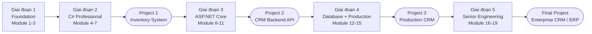
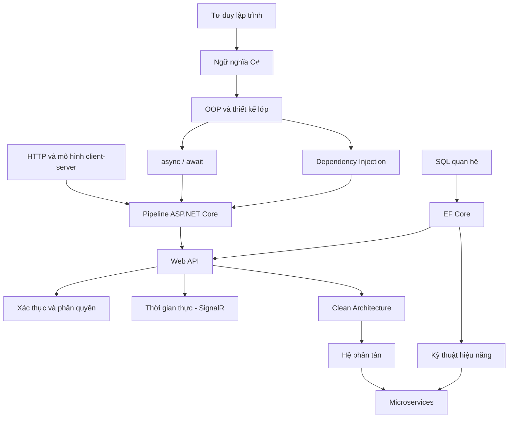
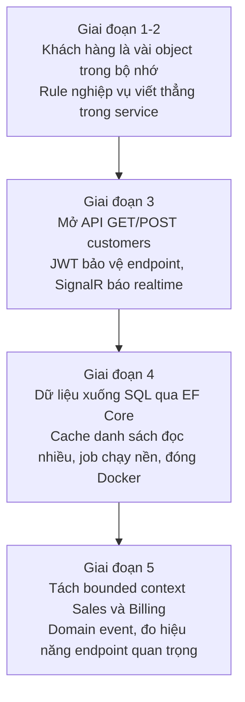
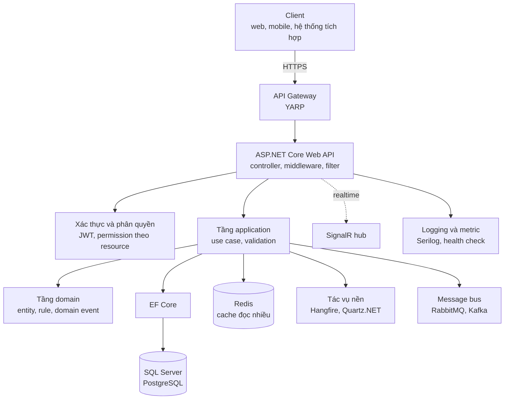

# Lộ trình .NET Backend: From Zero → Senior (Backend-first)

> Nguồn: https://tiennhm.io.vn/docs/dotnet-backend-zero-to-senior/dotnet-backend-zero-to-senior-roadmap
> Lộ trình học .NET backend từ con số không tới senior: C#, ASP.NET Core, SQL, EF Core, Docker, hệ phân tán và microservices — 19 module cộng 4 dự án, xoay quanh một bài toán CRM duy nhất lớn dần qua từng giai đoạn. Kèm sơ đồ phụ thuộc kiến thức và kiến trúc đích.

Lộ trình **backend-first** trên .NET: 19 module chia thành 5 giai đoạn, cộng 4 dự án. Điểm khác biệt so với một danh sách chủ đề là **trục dự án xuyên suốt** — cùng một bài toán CRM quản lý khách hàng, lớn dần từ `List` trong bộ nhớ ở giai đoạn 1 cho tới hệ phân tán nhiều bounded context ở giai đoạn 5. Mỗi kiến thức mới xuất hiện đúng lúc bài toán cần tới nó, thay vì học rời rạc từng công cụ.

Không bao gồm Blazor, .NET MAUI hay UI client nặng — đó là lựa chọn có chủ đích, không phải thiếu sót.

## Toàn cảnh lộ trình

Bốn hình tròn là nơi bạn **dừng đọc và bắt tay làm**. Chúng không phải bài tập minh hoạ mà là bốn phiên bản của cùng một sản phẩm.

## Dành cho ai, và không dành cho ai

**Dành cho** kỹ sư phần mềm theo hướng backend trên .NET: làm sản phẩm doanh nghiệp, gia công, SaaS B2B, hoặc đội ngũ API-first.

**Không đặt trọng tâm vào** Blazor, .NET MAUI và UI client nặng. Những hướng đó không sai, chỉ là lộ trình này chọn đi sâu một trục thay vì phủ rộng. Nếu bạn cần một ma trận kỹ năng rộng hơn để đối chiếu, [ASP.NET Core Developer trên roadmap.sh](https://roadmap.sh/aspnet-core) là checklist cộng đồng tốt — nhưng nó là danh sách chủ đề, không có trục dự án.

**Giả định đầu vào**: biết dùng máy tính và chịu được việc đọc tài liệu tiếng Anh. Không cần biết lập trình trước.

## Kiến thức nào phải có trước kiến thức nào

Lộ trình đi tuyến tính, nhưng kiến thức thì không. Sơ đồ dưới cho thấy phụ thuộc thật sự — hữu ích khi bạn đã biết một phần và muốn nhảy cóc:

Hai nhánh **C#** và **SQL** chạy song song và chỉ gặp nhau ở EF Core. Nếu bạn đã vững SQL, giai đoạn 4 sẽ nhẹ hơn nhiều so với người học tuần tự.

Ngược lại, đừng nhảy thẳng vào Microservices. Nó nằm cuối sơ đồ không phải vì khó, mà vì **mọi quyết định trong đó đều là đánh đổi** — và bạn chỉ đánh giá được đánh đổi khi đã trả giá cho cả hai phía.

## Trục dự án: một bài toán lớn dần

Giữ nguyên một bài toán duy nhất xuyên suốt: **CRM quản lý khách hàng và cơ hội bán hàng**.

Cách học này trả lời được câu hỏi mà danh sách chủ đề không trả lời được: **vì sao cần thứ này?** Bạn gặp cache sau khi đã thấy danh sách khách hàng chậm, gặp message bus sau khi đã thấy hai service gọi thẳng nhau gây lỗi dây chuyền.

Ở mỗi module, hãy tự trả lời ba câu:

1. Nó giải quyết vấn đề gì?
2. Nếu không có nó thì hệ thống hỏng ở đâu?
3. Trong CRM thì nó nằm ở màn hình hay chức năng nào?

## Kiến trúc đích

Đây là thứ bạn sẽ dựng được sau Final Project. Không cần hiểu hết ngay — quay lại xem sau mỗi giai đoạn sẽ thấy thêm một mảnh đã sáng ra:

Mũi tên đứt nét từ API sang SignalR là chủ ý: kênh thời gian thực **không** nằm trên đường đi của request HTTP thông thường.

## Cách học: vòng lặp nhỏ, không đọc một mạch

Đừng cố "đọc cho hết". Học theo vòng lặp: **đọc khái niệm → chạy ví dụ → tự sửa ví dụ cho hỏng → ghi lại điều đã hiểu**. Bước thứ ba là bước nhiều người bỏ qua, và nó là bước dạy nhiều nhất.

| Mốc | Giai đoạn | Việc nên ưu tiên |
|---|---|---|
| Tuần 1-2 | Foundation | Hiểu tư duy lập trình, HTTP cơ bản, Git workflow. Chưa cần tối ưu code. |
| Tuần 3-6 | C# Professional | Viết code chạy đúng trước. Clean code và tái cấu trúc tính sau. |
| Tuần 7-10 | ASP.NET Core | Dựng API thật cho CRM mini. Học tới đâu áp dụng tới đó. |
| Tuần 11-14 | Database + Production | Dữ liệu được lưu, truy vấn, cache và chạy trong container ra sao. |
| Tuần 15+ | Senior Engineering | Đọc kiến trúc ở mức đánh đổi, không học vẹt pattern. |

Mốc thời gian là tham chiếu, không phải chỉ tiêu. Người đã đi làm backend ngôn ngữ khác thường đi hết giai đoạn 1-2 trong vài ngày; người mới hoàn toàn có thể cần gấp đôi bảng trên.

## Giai đoạn 1 - Foundation

**Ra khỏi giai đoạn này bạn sẽ**: hình thành mô hình tính toán cơ bản, đọc hiểu mô hình client–server, và làm việc được trong quy trình phiên bản hoá hiện đại.

- [Module 1 — Programming Logic](stage-01-foundation/module-01-programming-logic)
- [Module 2 — Computer Science Basics](stage-01-foundation/module-02-computer-science-basics)
- [Module 3 — Git + Developer Workflow](stage-01-foundation/module-03-git-developer-workflow)

## Giai đoạn 2 - C# Professional

**Ra khỏi giai đoạn này bạn sẽ**: viết được mã C# có cấu trúc, áp dụng OOP, async và DI đúng bối cảnh tầng service.

- [Module 4 — C# Core](stage-02-csharp-professional/module-04-csharp-core)
- [Module 5 — Advanced C#](stage-02-csharp-professional/module-05-advanced-csharp)
- [Module 6 — Async Programming](stage-02-csharp-professional/module-06-async-programming)
- [Module 7 — Dependency Injection](stage-02-csharp-professional/module-07-dependency-injection)
- [Project 1 — Inventory System (Console + API)](stage-02-csharp-professional/project-01-inventory-console-api.mdx)

## Giai đoạn 3 - ASP.NET Core Backend

**Ra khỏi giai đoạn này bạn sẽ**: thiết kế và triển khai được Web API có hợp đồng HTTP ổn định, có lớp bảo mật, và kênh thời gian thực khi cần.

- [Module 8 — ASP.NET Core Fundamentals](stage-03-aspnet-core-backend/module-08-aspnet-core-fundamentals)
- [Module 9 — Web API Professional](stage-03-aspnet-core-backend/module-09-web-api-professional)
- [Module 10 — Authentication + Authorization](stage-03-aspnet-core-backend/module-10-authentication-authorization)
- [Module 11 — SignalR](stage-03-aspnet-core-backend/module-11-signalr)
- [Project 2 — CRM Backend API](stage-03-aspnet-core-backend/project-02-crm-backend-api.mdx)

## Giai đoạn 4 - Database + Production

**Ra khỏi giai đoạn này bạn sẽ**: hiểu tầng dữ liệu quan hệ và ORM, tối ưu được đường đọc/ghi, vận hành tác vụ nền và đóng gói triển khai gần với production.

- [Module 12 — SQL Deep Dive](stage-04-database-production/module-12-sql-deep-dive) — có thể học song song với [Learn SQL in 30 days](<../06-database/learn-sql-in-30-days/00. 30-Day SQL Learning Roadmap.md>)
- [Module 13 — Entity Framework Core](stage-04-database-production/module-13-entity-framework-core)
- [Module 14 — Caching + Background Jobs](stage-04-database-production/module-14-caching-background-jobs)
- [Module 15 — Docker + Deployment](stage-04-database-production/module-15-docker-deployment)
- [Project 3 — Production CRM Platform](stage-04-database-production/project-03-production-crm-platform.mdx)

## Giai đoạn 5 - Senior Engineering

**Ra khỏi giai đoạn này bạn sẽ**: đọc và bảo vệ được một kiến trúc phân tán, đo được hiệu năng bằng số, và hoàn thiện capstone cấp doanh nghiệp.

- [Module 16 — Clean Architecture](stage-05-senior-engineering/module-16-clean-architecture)
- [Module 17 — Distributed Systems](stage-05-senior-engineering/module-17-distributed-systems)
- [Module 18 — Microservices](stage-05-senior-engineering/module-18-microservices)
- [Module 19 — Performance Engineering](stage-05-senior-engineering/module-19-performance-engineering)
- [Final Project — Enterprise CRM / ERP](stage-05-senior-engineering/final-project-enterprise-crm-erp.mdx)

## Vì sao chọn CRM làm trục capstone

Miền CRM gói gần như trọn bộ năng lực tối thiểu của một hệ backend doanh nghiệp: CRUD, xác thực và phân quyền chi tiết, quy trình phê duyệt, thông báo, kênh thời gian thực, tác vụ nền, triển khai và mở rộng. Ít miền nào vừa quen thuộc vừa đủ sâu như vậy.

Mỗi module lõi có mục **Liên hệ CRM** để neo lý thuyết vào một màn hình cụ thể. Cuối mỗi module và mỗi dự án có phần **Kiểm tra & Thực hành (100 điểm)**: câu hỏi trắc nghiệm, lab kèm rubric, ngưỡng điểm, và mục **Reflect** để tự chấm hoặc nhờ mentor rà.

## Đối chiếu với roadmap cộng đồng

[ASP.NET Core Developer trên roadmap.sh](https://roadmap.sh/aspnet-core) đóng vai trò checklist kỹ năng: CLI, kiểm thử, gateway, message broker và nhiều mục khác. Trong từng chương, mục **Bổ sung (đối chiếu roadmap.sh)** ghi lại phần cần phủ thêm khi bạn đào sâu.

Ràng buộc vẫn là backend-first và trục CRM — checklist để tham chiếu, không để thay thế.

## Tài liệu nguồn

Ưu tiên tài liệu gốc khi cần tra cứu chính xác:

- [.NET documentation — Microsoft Learn](https://learn.microsoft.com/dotnet/)
- [ASP.NET Core documentation](https://learn.microsoft.com/aspnet/core/)
- [C# language reference](https://learn.microsoft.com/dotnet/csharp/)

## Sách đọc song song

| Mức | Sách |
|---|---|
| Nền tảng | *Head First C#* · *C# Yellow Book* |
| Trung cấp | *C# in Depth* · *ASP.NET Core in Action* |
| Cao cấp | *CLR via C#* · *Clean Architecture* (Robert C. Martin) · *Designing Data-Intensive Applications* (Martin Kleppmann) |

---

**Bắt đầu từ đâu**: mở [Module 1 — Programming Logic](stage-01-foundation/module-01-programming-logic), hoặc chọn thẳng giai đoạn phù hợp trong sidebar nếu bạn đã có nền.

## Bài liên quan

- [Dựng một nền tảng CRM multi-tenant từ con số không: chuyện nghề 20 tháng](https://tiennhm.io.vn/blog/founding-engineer-nen-tang-crm-abp-dotnet-angular) — Sản phẩm đầu tiên mình được giao init và dựng từ đầu: một nền tảng CRM multi-tenant, đi demo cho nhiều ngành gần một năm rồi chuyển sang delivery…
- [Vì sao EF Core bắn 201 query cho 1 màn hình danh sách? Cách sửa N+1](https://tiennhm.io.vn/blog/ef-core-n-plus-1-query) — Một màn hình 200 dòng mà log SQL ghi 201 câu lệnh là dấu hiệu của N+1 query.
- [HTTP header có chứa được tiếng Việt không? ASCII, obs-text và chỗ .NET vạch ranh giới](https://tiennhm.io.vn/blog/http-header-unicode-ascii-dotnet) — Câu trả lời ngắn là không, và lý do thú vị hơn vẻ ngoài của nó.
