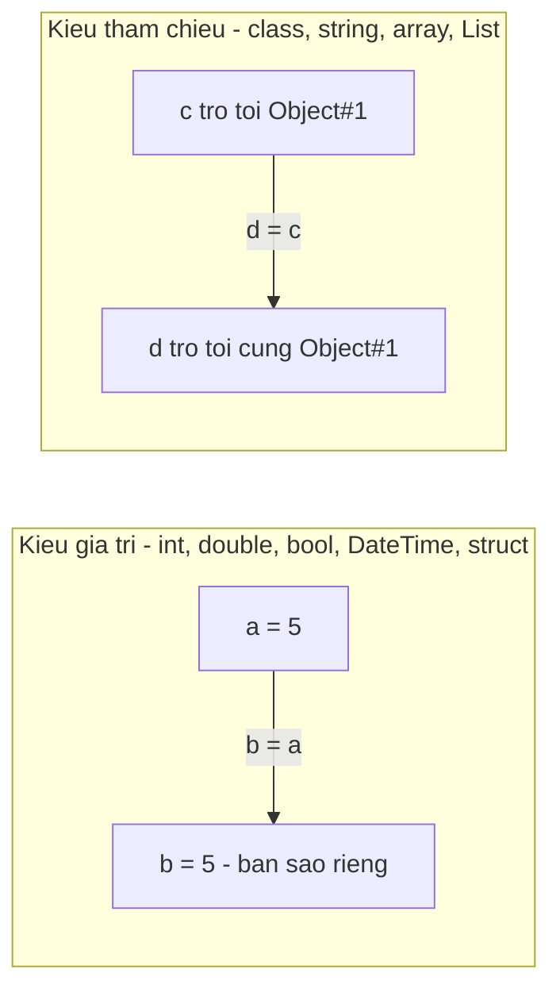

# 1.2 — 1. Biến và Kiểu Dữ Liệu

> Nguồn: https://tiennhm.io.vn/docs/dotnet-backend-zero-to-senior/stage-01-foundation/module-01-programming-logic/1.2-variables-and-data-types
> Biến, kiểu giá trị và kiểu tham chiếu, vì sao tiền phải dùng decimal chứ không phải double, DateTime hay DateTimeOffset, và nullable reference types — bốn quyết định kiểu dữ liệu đi theo bạn suốt dự án backend.

> Biến là một cái tên gắn với một ô nhớ. Nhưng thứ quyết định chương trình của bạn đúng hay sai không nằm ở cú pháp khai báo, mà ở **chọn kiểu nào**. Bốn lựa chọn đi theo bạn suốt dự án: `decimal` thay vì `double` cho tiền (vì `0.1 + 0.2` trong `double` **không** bằng `0.3`), `DateTimeOffset` thay vì `DateTime` cho mốc thời gian, bật nullable reference types để trình biên dịch chỉ ra chỗ có thể `null` trước khi người dùng chỉ ra, và hiểu khác biệt giữa kiểu giá trị và kiểu tham chiếu để không ngạc nhiên khi gán một object rồi sửa nó.

## Mục tiêu bài học

Sau bài này bạn có thể:

- Khai báo biến với kiểu tường minh và với `var`, và giải thích vì sao `var` **không** làm C# mất kiểu tĩnh.
- Chỉ ra bằng code vì sao `double` không dùng được cho tiền, và `decimal` khác nó ở chỗ nào.
- Phân biệt kiểu giá trị với kiểu tham chiếu, và dự đoán đúng kết quả khi gán rồi sửa.
- Chọn giữa `DateTime` và `DateTimeOffset`, và nêu lý do lưu UTC trong cơ sở dữ liệu.
- Đọc hiểu cảnh báo của nullable reference types thay vì tắt nó đi.

## Nội dung bài học

### 1.2.1 — Biến là một cái tên gắn với ô nhớ

Cách hình dung quen thuộc: biến là **cái hộp có nhãn**. Bạn đặt tên cho hộp, bỏ đồ vào, thay đồ khác lúc nào cũng được.

```csharp
int    loyaltyPoints = 250;
string customerName  = "Nguyễn Văn A";
bool   isVip         = false;
double spendRatio    = 0.75;
```

Một điểm về **quy ước đặt tên** cần nói ngay từ bài đầu: .NET đặt tên bằng tiếng Anh, `camelCase` cho biến cục bộ và tham số, `PascalCase` cho kiểu, thuộc tính và phương thức. Đặt tên tiếng Việt không sai cú pháp, nhưng khi bạn làm việc với thư viện, tài liệu và đồng nghiệp — tất cả đều tiếng Anh — thì code lẫn hai ngôn ngữ đọc rất mệt. Quy ước đầy đủ nằm ở [C# coding conventions](https://learn.microsoft.com/en-us/dotnet/csharp/fundamentals/coding-style/coding-conventions).

### 1.2.2 — `var` không phải là "không có kiểu"

```csharp
var email     = "a@company.com";   // C# suy ra: string
var orderCount = 12;               // C# suy ra: int
```

`var` chỉ nói với trình biên dịch *"kiểu là gì thì anh tự nhìn vế phải mà suy ra"*. Sau khi biên dịch, `var email` và `string email` cho ra **cùng một mã máy**. Kiểu vẫn được chốt lúc biên dịch và không đổi được:

```csharp
var email = "a@company.com";
email = 42;        // Lỗi biên dịch: không gán int cho string được
```

Đây là điểm khác biệt hoàn toàn với `var` của JavaScript hay biến của Python. Nếu bạn thật sự cần kiểu động, C# có `dynamic` — và bạn gần như không bao giờ cần nó trong code backend.

### 1.2.3 — Kiểu giá trị và kiểu tham chiếu

Đây là khái niệm gây bất ngờ nhiều nhất cho người mới.



```csharp
// Kiểu giá trị: gán là SAO CHÉP
int a = 5;
int b = a;
b = 10;
Console.WriteLine(a);   // 5  — a không đổi

// Kiểu tham chiếu: gán là chép CÁI ĐỊA CHỈ
var customer1 = new Customer { Name = "A" };
var customer2 = customer1;
customer2.Name = "B";
Console.WriteLine(customer1.Name);   // "B"  — cùng một object!
```

Quy tắc nhớ nhanh: `class` là kiểu tham chiếu, `struct` và các kiểu số dựng sẵn là kiểu giá trị. `string` là kiểu tham chiếu, nhưng vì nó **bất biến** (mọi phép "sửa" đều tạo chuỗi mới) nên dùng lên cảm giác như kiểu giá trị.

### 1.2.4 — Tiền: vì sao `double` sai và `decimal` đúng

Chạy thử đoạn này trước khi đọc tiếp:

```csharp
double x = 0.1 + 0.2;
Console.WriteLine(x == 0.3);          // False
Console.WriteLine(x.ToString("R"));   // 0.30000000000000004

decimal y = 0.1m + 0.2m;
Console.WriteLine(y == 0.3m);         // True
```

`double` lưu số theo **cơ số 2**. Mà `0.1` trong cơ số 2 là một số thập phân vô hạn tuần hoàn, y như `1/3` trong cơ số 10 — không lưu chính xác được, chỉ lưu gần đúng. Cộng vài lần thì sai số lộ ra.

`decimal` lưu theo **cơ số 10** với 28–29 chữ số có nghĩa, nên mọi số thập phân bạn gõ vào đều được giữ chính xác. Đổi lại nó chậm hơn và chiếm 16 byte thay vì 8.

| | `double` | `decimal` |
|---|---|---|
| Cơ số | 2 | 10 |
| Kích thước | 8 byte | 16 byte |
| Chính xác cho số thập phân | Không | Có |
| Dùng cho | Đo lường, khoa học, đồ hoạ | **Tiền, tỉ lệ kế toán** |
| Hậu tố | `1.5` hoặc `1.5d` | `1.5m` |

> Một hoá đơn lệch `0.00000000000004` nghe như chuyện nhỏ — cho tới khi nó được cộng dồn qua 3 triệu dòng giao dịch rồi đem đối soát với ngân hàng.

Chi tiết kỹ thuật: [Floating-point numeric types](https://learn.microsoft.com/en-us/dotnet/csharp/language-reference/builtin-types/floating-point-numeric-types).

### 1.2.5 — Thời gian: `DateTime` hay `DateTimeOffset`?

```csharp
DateTime       now1 = DateTime.Now;        // giờ máy chủ, KHÔNG biết lệch múi bao nhiêu
DateTime       now2 = DateTime.UtcNow;     // giờ UTC
DateTimeOffset now3 = DateTimeOffset.Now;  // giờ + độ lệch múi, ví dụ +07:00
```

`DateTime` mang theo một enum `Kind` với ba giá trị `Local`, `Utc`, `Unspecified` — và khi đi qua cơ sở dữ liệu hay JSON, `Kind` **thường bị mất**. Kết quả là một mốc thời gian không còn biết nó thuộc múi giờ nào.

`DateTimeOffset` lưu kèm độ lệch, nên mốc thời gian luôn không mơ hồ.

Quy tắc dùng được ngay cho backend:

- Lưu trong database: **UTC**, kiểu `DateTimeOffset` hoặc `timestamptz`.
- Chuyển sang giờ địa phương **chỉ ở tầng hiển thị**, theo múi giờ của người dùng.
- Không bao giờ dùng `DateTime.Now` trong logic nghiệp vụ trên server — máy chủ có thể ở múi giờ khác với người dùng, và khác với chính nó sau một lần chuyển vùng.

Hướng dẫn chính thức: [Choosing between DateTime, DateTimeOffset, TimeSpan, and TimeZoneInfo](https://learn.microsoft.com/en-us/dotnet/standard/datetime/choosing-between-datetime).

### 1.2.6 — Nullable reference types: để trình biên dịch tìm `null` giùm bạn

Từ C# 8, bật `enable` trong file `.csproj` thì kiểu tham chiếu chia làm hai:

```csharp
string  name  = null;   // Cảnh báo: không gán null cho kiểu không cho phép null
string? email = null;   // Hợp lệ: dấu ? nói rõ "chỗ này có thể null"

Console.WriteLine(email.Length);    // Cảnh báo: có thể NullReferenceException
Console.WriteLine(email?.Length);   // An toàn: null thì trả về null
Console.WriteLine(email ?? "chưa có email");   // Có giá trị mặc định
```

Đây không phải tính năng trang trí. `NullReferenceException` là ngoại lệ phổ biến nhất trong lịch sử .NET, và nullable reference types chuyển phần lớn số đó **từ lỗi lúc chạy thành cảnh báo lúc biên dịch**. Khi gặp cảnh báo, đừng tắt nó — hãy trả lời câu hỏi nó đang hỏi: *giá trị này có thể null không, và nếu có thì xử lý ra sao?*

Tài liệu: [Nullable reference types](https://learn.microsoft.com/en-us/dotnet/csharp/nullable-references).

### 1.2.7 — Bảng chọn kiểu nhanh

| Dữ liệu | Kiểu nên dùng | Lý do |
|---|---|---|
| Tiền, giá, số dư | `decimal` | Chính xác theo cơ số 10 |
| Số lượng, tuổi, số lần | `int` | Đủ tới ~2,1 tỉ |
| Khoá chính tự tăng lớn | `long` | Tránh tràn khi bảng lớn |
| Đo lường, tỉ lệ khoa học | `double` | Nhanh, sai số chấp nhận được |
| Đúng/sai | `bool` | — |
| Mốc thời gian | `DateTimeOffset` | Không mơ hồ múi giờ |
| Chỉ ngày, không giờ | `DateOnly` | .NET 6+, tránh phần giờ vô nghĩa |
| Văn bản | `string` | Bất biến |
| Định danh phân tán | `Guid` | Xem bài [UUID](https://tiennhm.io.vn/blog/gioi-thieu-uuid-universally-unique-identifier) |

Chọn kiểu ở C# và chọn kiểu ở cột database là hai mặt của cùng một quyết định — phần bên phía SQL nằm ở bài [cấu trúc bảng và kiểu dữ liệu](https://tiennhm.io.vn/docs/database/learn-sql-in-30-days/02-table-structure-and-data-types).

### 1.2.8 — Tràn số: im lặng theo mặc định

```csharp
int max = int.MaxValue;      // 2_147_483_647
int next = max + 1;
Console.WriteLine(next);     // -2147483648  — quay vòng, KHÔNG có lỗi

checked
{
    int boom = max + 1;      // OverflowException
}
```

Mặc định C# **không** kiểm tra tràn số nguyên, vì kiểm tra thì chậm. Với phép tính liên quan tới tiền hoặc số lượng do người dùng nhập, hãy bọc trong `checked` hoặc bật `` cho cả dự án. Xem [checked and unchecked](https://learn.microsoft.com/en-us/dotnet/csharp/language-reference/statements/checked-and-unchecked).

### 1.2.9 — Rà lại code của bạn

**Danh sách rà soát kiểu dữ liệu**

- [ ] Mọi trường tiền tệ dùng decimal, không dùng double hay float.
- [ ] Mọi mốc thời gian lưu ở UTC; DateTime.Now không xuất hiện trong logic nghiệp vụ.
- [ ] File .csproj đã bật enable.
- [ ] Không có cảnh báo nullable nào bị tắt bằng dấu ! mà không có lý do ghi kèm.
- [ ] Tên biến và tên kiểu theo quy ước .NET: camelCase và PascalCase, tiếng Anh.
- [ ] Phép tính trên số do người dùng nhập có xét khả năng tràn.

## Bài tập áp dụng

Ba bài dưới đây làm theo thứ tự. Bài 1 và 2 chạy được trong một project console rỗng; bài 3 cần một dự án có sẵn, hoặc dùng chính project bạn đang xây trong module này.

### Bài 1 — Tự chứng minh sai số của `double`

Viết vòng lặp cộng `0.1` vào một biến `double` đúng 1000 lần, in kết quả bằng `ToString("R")`. Làm lại y hệt với `decimal`. Ghi lại con số lệch chính xác.

**Tiêu chí hoàn thành:** bạn nói được vì sao `d == 100.0` trả về `false` trong khi mắt nhìn thấy số in ra là 100.

Gợi ý và lời giải — Bài 1

**Gợi ý.** Định dạng `"R"` (round-trip) in ra đủ chữ số để tái tạo đúng giá trị nhị phân bên trong, nên nó lộ ra phần sai số mà `ToString()` thường làm tròn đi. Nếu bạn in bằng `Console.WriteLine(d)` mà thấy đúng 100 thì hãy đổi sang `"R"`.

**Lời giải.**

```csharp
double d = 0;
for (int i = 0; i < 1000; i++) d += 0.1;

decimal m = 0;
for (int i = 0; i < 1000; i++) m += 0.1m;

Console.WriteLine($"double : {d.ToString("R")}");
Console.WriteLine($"decimal: {m}");
Console.WriteLine($"lệch   : {(100.0 - d).ToString("R")}");
Console.WriteLine($"d == 100: {d == 100.0}");
```

**Kết quả thật trên .NET 9:**

```text
double : 99.9999999999986
decimal: 100.0
lệch   : 1.4068746168049984E-12
d == 100: False
```

**Vì sao.** `double` lưu số theo chuẩn IEEE 754 dưới dạng nhị phân. Trong hệ nhị phân, `0.1` là một phân số tuần hoàn vô hạn — giống như `1/3` trong hệ thập phân — nên máy chỉ lưu được giá trị gần đúng. Mỗi lần cộng làm sai số nhích thêm một chút, và sau 1000 lần thì lệch khoảng `1.4 × 10⁻¹²`.

`decimal` lưu theo cơ số 10 nên biểu diễn `0.1` chính xác tuyệt đối, và kết quả là đúng `100.0`.

**Hệ quả thực tế.** Sai số `10⁻¹²` nghe nhỏ, nhưng nó phá vỡ **phép so sánh bằng**. Một hệ thống đối soát công nợ cộng dồn hàng triệu giao dịch bằng `double` sẽ báo lệch số dư dù từng giao dịch đều đúng, và không ai tìm ra nguyên nhân vì mọi con số in ra đều trông chính xác. Quy tắc: **tiền tệ luôn dùng `decimal`**; `double` dành cho đại lượng đo lường vốn đã có sai số như nhiệt độ, toạ độ, trọng lượng.

### Bài 2 — Bẫy kiểu tham chiếu

Tạo một `class Customer` và một `struct Point`, mỗi kiểu có một thuộc tính. Với **mỗi** kiểu: gán sang biến thứ hai, sửa biến thứ hai, rồi in giá trị của biến thứ nhất.

**Tiêu chí hoàn thành:** bạn dự đoán đúng kết quả **trước khi** chạy, và giải thích được bằng lời của mình.

Gợi ý và lời giải — Bài 2

**Gợi ý.** Câu hỏi then chốt: khi gán `b = a`, thứ được sao chép là **bản thân dữ liệu** hay **địa chỉ trỏ tới dữ liệu**? Câu trả lời khác nhau giữa `class` và `struct`, và đó là toàn bộ nội dung bài này.

**Lời giải.**

```csharp
class Customer { public string Name { get; set; } = ""; }
struct Point   { public int X { get; set; } }

var c1 = new Customer { Name = "An" };
var c2 = c1;              // sao chép THAM CHIẾU
c2.Name = "Bình";
Console.WriteLine(c1.Name);   // Bình  <- c1 cũng đổi

var p1 = new Point { X = 1 };
var p2 = p1;              // sao chép GIÁ TRỊ
p2.X = 99;
Console.WriteLine(p1.X);      // 1     <- p1 không đổi
```

**Vì sao.** `Customer` là kiểu tham chiếu: biến `c1` giữ một **địa chỉ**, và `c2 = c1` sao chép địa chỉ đó. Hai biến cùng trỏ tới **một** đối tượng, nên sửa qua biến nào cũng thấy ở biến kia. `Point` là kiểu giá trị: `p2 = p1` sao chép toàn bộ nội dung, tạo ra hai đối tượng độc lập.

**Hệ quả thực tế.** Đây là nguồn của một lỗi rất khó tìm: bạn truyền một đối tượng vào hàm, hàm đó sửa nó, và bên gọi bất ngờ thấy dữ liệu của mình thay đổi. Nó cũng là lý do trả về `List` nội bộ từ một thuộc tính là nguy hiểm — người nhận sửa được danh sách bên trong đối tượng của bạn. Cách phòng là trả về bản sao hoặc `IReadOnlyList`, một ý mà [bài 4.3 về đóng gói](../../stage-02-csharp-professional/module-04-csharp-core/4.3-encapsulation.mdx) sẽ bàn kỹ.

**Thử thêm.** Đổi `struct Point` thành `record struct Point(int X)` rồi chạy lại. Kết quả không đổi, nhưng bạn được thêm phép so sánh theo giá trị — chuẩn bị cho [bài 4.8](../../stage-02-csharp-professional/module-04-csharp-core/4.8-records-and-value-objects.mdx).

### Bài 3 — Rà soát `DateTime.Now`

Tìm trong một dự án bất kỳ mọi chỗ dùng `DateTime.Now`. Với từng chỗ, trả lời: *nếu máy chủ chuyển sang múi giờ UTC vào ngày mai, kết quả có đổi không?*

**Tiêu chí hoàn thành:** bạn phân loại được từng chỗ vào một trong ba nhóm — phải đổi sang `UtcNow`, phải đổi sang `DateTimeOffset`, hoặc giữ nguyên là đúng.

Gợi ý và lời giải — Bài 3

**Gợi ý.** Tìm nhanh bằng lệnh:

```bash
grep -rn "DateTime\.Now\|DateTime\.Today" --include=*.cs .
```

Với mỗi kết quả, hỏi: giá trị này sẽ được **lưu lại**, **so sánh** với giá trị khác, hay chỉ **hiển thị ngay** cho người đang nhìn màn hình?

**Lời giải — ba nhóm và cách xử lý:**

| Nhóm | Dấu hiệu | Cách xử lý |
|---|---|---|
| Lưu vào database, ghi log, so sánh thời điểm | `CreatedAt`, `UpdatedAt`, `ExpiresAt` | Đổi sang `DateTime.UtcNow` |
| Cần biết cả thời điểm lẫn múi giờ của người dùng | Lịch hẹn, nhắc việc theo giờ địa phương | Đổi sang `DateTimeOffset.UtcNow` rồi quy đổi khi hiển thị |
| Chỉ hiển thị tức thời, không lưu, không so sánh | Đồng hồ trên giao diện | Giữ `DateTime.Now` là hợp lý |

**Vì sao quan trọng.** `DateTime.Now` lấy giờ **theo múi giờ của máy đang chạy**. Ba hậu quả có thật:

1. **Máy chủ đổi múi giờ hoặc chuyển vùng** làm mọi bản ghi mới lệch vài giờ so với bản ghi cũ, và không có gì trong dữ liệu cho biết bản ghi nào thuộc múi giờ nào.
2. **Giờ mùa hè** khiến một giờ trong năm bị lặp lại và một giờ khác không tồn tại. Bản ghi tạo trong khoảng lặp không phân biệt được thứ tự.
3. **Nhiều máy chủ ở nhiều vùng** sinh ra dữ liệu không so sánh được với nhau, và lỗi chỉ lộ ra khi hệ thống mở rộng ra vùng thứ hai.

**Quy tắc thực dụng.** Lưu trữ và tính toán luôn dùng UTC; quy đổi sang giờ địa phương **chỉ ở lớp hiển thị**, ngay trước khi đưa cho người dùng. Đây là quy ước mà [Module 12](../../stage-04-database-production/module-12-sql-deep-dive/) giả định khi thiết kế cột thời gian, và [Module 13](../../stage-04-database-production/module-13-entity-framework-core/) giả định khi ánh xạ chúng.

## Tự kiểm tra

### Dùng var có làm C# mất kiểu tĩnh không?

Không. var chỉ yêu cầu trình biên dịch tự suy kiểu từ vế phải. Kiểu vẫn được chốt lúc biên dịch, vẫn kiểm tra chặt, và mã máy sinh ra giống hệt như khi viết kiểu tường minh. Gán một giá trị khác kiểu vào biến var sẽ lỗi biên dịch.

### Vì sao 0.1 + 0.2 trong double lại không bằng 0.3?

Vì double lưu số theo cơ số 2, mà 0.1 trong cơ số 2 là số vô hạn tuần hoàn nên chỉ lưu được gần đúng. Sai số nhỏ đó cộng dồn lại và lộ ra khi so sánh. decimal lưu theo cơ số 10 với 28-29 chữ số có nghĩa nên giữ chính xác mọi số thập phân bạn gõ vào — đó là lý do tiền bạc phải dùng decimal.

### Gán một object cho biến khác rồi sửa, vì sao biến ban đầu cũng đổi theo?

Vì class là kiểu tham chiếu: phép gán chỉ chép địa chỉ, không chép nội dung. Hai biến cùng trỏ vào một object trong bộ nhớ. Muốn có bản sao độc lập thì phải tự tạo object mới, hoặc dùng record với biểu thức with.

### Khi nào dùng DateTime, khi nào dùng DateTimeOffset?

Mặc định chọn DateTimeOffset cho mọi mốc thời gian, vì nó lưu kèm độ lệch múi giờ nên không bao giờ mơ hồ. DateTime chỉ mang theo một enum Kind, mà Kind thường bị mất khi đi qua database hoặc JSON. Chỉ dùng DateOnly khi thật sự không cần phần giờ.

### Gặp cảnh báo nullable thì nên làm gì?

Trả lời câu hỏi mà nó đang hỏi: giá trị này có thể null không? Nếu có, xử lý bằng ?., ?? hoặc kiểm tra tường minh. Nếu chắc chắn không, hãy sửa kiểu cho đúng thay vì dán toán tử ! lên. Toán tử ! là lời hứa với trình biên dịch — hứa sai thì vẫn NullReferenceException như cũ, chỉ mất thêm cảnh báo.

### int cộng quá giới hạn thì chương trình có báo lỗi không?

Không, mặc định nó quay vòng về số âm mà không báo gì. Muốn có OverflowException thì bọc phép tính trong khối checked, hoặc bật CheckForOverflowUnderflow cho cả dự án.

## Kết luận

Ba điều đáng nhớ nhất:

1. **Kiểu không phải chuyện cú pháp, là chuyện đúng sai.** `double` cho tiền là một bug đang chờ đủ số giao dịch để lộ ra.
2. **Gán kiểu tham chiếu là chép địa chỉ, không phải chép dữ liệu.** Không nắm điều này thì sẽ có ngày sửa một object mà ba chỗ khác đổi theo.
3. **Nullable reference types là đồng minh.** Nó biến `NullReferenceException` lúc chạy thành cảnh báo lúc biên dịch — đổi lỗi lúc nửa đêm lấy cảnh báo lúc gõ code.

## Tham khảo

- [C# coding conventions](https://learn.microsoft.com/en-us/dotnet/csharp/fundamentals/coding-style/coding-conventions) — quy ước đặt tên và định dạng
- [Value types](https://learn.microsoft.com/en-us/dotnet/csharp/language-reference/builtin-types/value-types) — danh sách kiểu giá trị dựng sẵn
- [Floating-point numeric types](https://learn.microsoft.com/en-us/dotnet/csharp/language-reference/builtin-types/floating-point-numeric-types) — `float`, `double`, `decimal`
- [Nullable reference types](https://learn.microsoft.com/en-us/dotnet/csharp/nullable-references) — bật và đọc hiểu cảnh báo
- [Choosing between DateTime and DateTimeOffset](https://learn.microsoft.com/en-us/dotnet/standard/datetime/choosing-between-datetime) — hướng dẫn chính thức
- [checked and unchecked](https://learn.microsoft.com/en-us/dotnet/csharp/language-reference/statements/checked-and-unchecked) — kiểm soát tràn số

## Điều hướng

- **Bài trước:** Không có (bài mở đầu module).
- **Bài tiếp theo:** [1.3 — 2. Điều Kiện (Conditions)](1.3-conditions.mdx)
- **Về module:** [Trang mục lục](./)

## Bài liên quan

- [Giới thiệu UUID (Universally Unique Identifier) - Định danh duy nhất toàn cầu](https://tiennhm.io.vn/blog/gioi-thieu-uuid-universally-unique-identifier)
