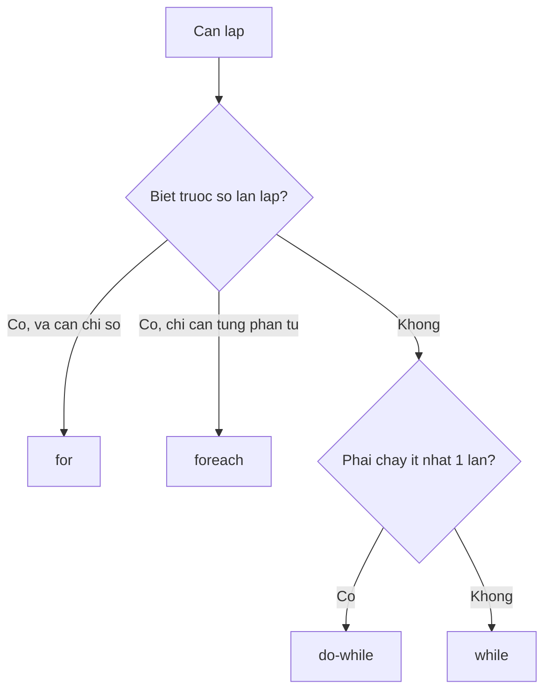

# 1.4 — 3. Vòng Lặp (Loops)

> Nguồn: https://tiennhm.io.vn/docs/dotnet-backend-zero-to-senior/stage-01-foundation/module-01-programming-logic/1.4-loops
> for, while, foreach và yield return. Kèm ba lỗi kinh điển: sửa collection khi đang duyệt, lệch một đơn vị, và gọi database bên trong vòng lặp — cái cuối là nguồn gốc của vấn đề N+1.

> Bốn dạng vòng lặp của C# — `for`, `while`, `do-while`, `foreach` — khác nhau ở chỗ **bạn biết trước bao nhiêu về số lần lặp**. Nhưng phần quan trọng của bài này không phải cú pháp, mà là ba lỗi gần như ai cũng gặp ít nhất một lần: sửa collection ngay khi đang `foreach` qua nó (ném `InvalidOperationException`), lệch một đơn vị ở điều kiện dừng, và **gọi database bên trong vòng lặp** — cái cuối biến một màn hình danh sách thành 201 câu truy vấn.

## Mục tiêu bài học

Sau bài này bạn có thể:

- Chọn đúng dạng vòng lặp theo việc bạn biết trước gì về số lần lặp.
- Giải thích `foreach` thực chất gọi những gì, và vì sao không sửa được collection khi đang duyệt.
- Dùng `break`, `continue` và biết khi nào chúng làm code khó đọc hơn.
- Nhận ra ngay một vòng lặp đang gọi I/O bên trong, và biết cách sửa.
- Viết một hàm trả dữ liệu dần bằng `yield return`.

## Nội dung bài học

### 1.4.1 — Chọn dạng nào?



```csharp
// for — biết số lần, cần chỉ số
for (int i = 0; i < orders.Count; i++)
    Console.WriteLine($"{i + 1}. {orders[i].Code}");

// foreach — duyệt từng phần tử, không quan tâm chỉ số
foreach (var order in orders)
    Console.WriteLine(order.Code);

// while — lặp tới khi điều kiện sai, có thể không chạy lần nào
while (queue.TryDequeue(out var job))
    Process(job);

// do-while — chạy ít nhất một lần rồi mới kiểm tra
do
{
    attempt++;
    success = TryCall();
} while (!success && attempt < 3);
```

Quy tắc thực dụng: **mặc định dùng `foreach`**. Chỉ chuyển sang `for` khi thật sự cần chỉ số, hoặc cần sửa phần tử theo vị trí.

### 1.4.2 — `foreach` thực chất làm gì

`foreach` không phải phép màu. Trình biên dịch dịch nó thành:

```csharp
// foreach (var x in items) { ... }  tương đương với:
var enumerator = items.GetEnumerator();
try
{
    while (enumerator.MoveNext())
    {
        var x = enumerator.Current;
        // ...
    }
}
finally
{
    (enumerator as IDisposable)?.Dispose();
}
```

Hiểu điều này giải thích luôn hai chuyện:

1. Vì sao bất cứ thứ gì có phương thức `GetEnumerator()` đều `foreach` được, kể cả khi không cài đặt `IEnumerable`.
2. Vì sao **sửa collection khi đang duyệt** lại nổ — enumerator giữ một số phiên bản nội bộ, mọi thao tác thêm/xoá làm số đó đổi, và `MoveNext()` phát hiện ra.

### 1.4.3 — Lỗi 1: sửa collection khi đang duyệt

```csharp
// SAI — InvalidOperationException: Collection was modified
foreach (var customer in customers)
{
    if (customer.IsInactive)
        customers.Remove(customer);
}
```

Ba cách sửa, theo thứ tự nên dùng:

```csharp
// 1. Tạo danh sách mới (rõ ràng nhất)
var active = customers.Where(c => !c.IsInactive).ToList();

// 2. RemoveAll — một lời gọi, không cần vòng lặp
customers.RemoveAll(c => c.IsInactive);

// 3. Duyệt ngược bằng for — khi buộc phải xoá tại chỗ
for (int i = customers.Count - 1; i >= 0; i--)
{
    if (customers[i].IsInactive)
        customers.RemoveAt(i);
}
```

Cách 3 duyệt ngược vì xoá phần tử thứ `i` làm mọi phần tử sau nó dịch lên một chỗ — đi xuôi sẽ **bỏ sót** phần tử ngay sau phần tử vừa xoá.

### 1.4.4 — Lỗi 2: lệch một đơn vị (off-by-one)

```csharp
// SAI — IndexOutOfRangeException ở vòng cuối
for (int i = 0; i <= items.Length; i++) { }

// ĐÚNG
for (int i = 0; i < items.Length; i++) { }
```

Mảng trong C# đánh chỉ số từ `0`, nên phần tử cuối có chỉ số `Length - 1`. Dùng `<` chứ không phải `<=`.

Cách tránh triệt để: dùng `foreach`, hoặc dùng chỉ số từ cuối và range của C# 8:

```csharp
var last      = items[^1];      // phần tử cuối
var lastThree = items[^3..];    // ba phần tử cuối
var middle    = items[1..^1];   // bỏ đầu và cuối
```

### 1.4.5 — Lỗi 3: gọi I/O bên trong vòng lặp

Đây là lỗi tốn kém nhất trong cả bài, và nó không ném exception nào — chỉ làm mọi thứ chậm đi.

```csharp
// SAI — mỗi đơn hàng là một lần đi tới database
foreach (var order in orders)          // 200 đơn hàng
{
    var customer = await _db.Customers
        .FirstAsync(c => c.Id == order.CustomerId);   // 200 câu query
    Console.WriteLine(customer.Name);
}
```

Một query để lấy danh sách, cộng thêm N query trong vòng lặp — đó là lý do nó có tên **N+1**. Với 200 đơn hàng, một màn hình danh sách bắn 201 câu truy vấn.

```csharp
// ĐÚNG — lấy một lần, tra cứu trong bộ nhớ
var customerIds = orders.Select(o => o.CustomerId).Distinct().ToList();
var customers = await _db.Customers
    .Where(c => customerIds.Contains(c.Id))
    .ToDictionaryAsync(c => c.Id);       // 1 câu query

foreach (var order in orders)
    Console.WriteLine(customers[order.CustomerId].Name);
```

Nguyên tắc: **vòng lặp để xử lý dữ liệu đã có trong bộ nhớ, không phải để đi lấy dữ liệu.** Lấy hết một lần trước, rồi mới lặp.

Bài [Vì sao EF Core bắn 201 query cho 1 màn hình danh sách?](https://tiennhm.io.vn/blog/ef-core-n-plus-1-query) đo cụ thể chi phí của lỗi này và chỉ cách phát hiện bằng log. Phần lý thuyết bên phía SQL nằm ở bài [hiệu năng truy vấn](https://tiennhm.io.vn/docs/database/learn-sql-in-30-days/20-query-performance).

### 1.4.6 — `break` và `continue`

```csharp
foreach (var order in orders)
{
    if (order.IsCancelled) continue;   // bỏ qua, sang phần tử tiếp theo
    if (order.Total > limit) break;    // dừng hẳn vòng lặp

    Process(order);
}
```

Dùng vừa phải thì chúng làm code phẳng hơn. Dùng quá tay — ba, bốn `break` rải rác trong một vòng lặp dài — thì không ai lần được luồng chạy nữa. Khi thấy nhiều `break`, hãy thử tách phần thân vòng lặp thành một hàm riêng.

Với vòng lặp lồng nhau, `break` chỉ thoát **vòng trong cùng**. Cần thoát cả hai thì tách thành hàm rồi `return`, đừng dùng `goto`.

### 1.4.7 — `yield return`: trả dữ liệu dần

```csharp
public IEnumerable<Order> GetLargeOrders(IEnumerable<Order> orders, decimal min)
{
    foreach (var order in orders)
    {
        if (order.Total >= min)
            yield return order;      // trả từng cái một, không dựng cả danh sách
    }
}
```

Điểm mấu chốt: hàm này **không chạy gì cả** cho tới khi ai đó bắt đầu duyệt kết quả. Và nó không bao giờ giữ toàn bộ dữ liệu trong bộ nhớ — mỗi lần chỉ một phần tử.

Điều đó đúng cả với file mười triệu dòng:

```csharp
public static IEnumerable<string> ReadLines(string path)
{
    using var reader = new StreamReader(path);
    string? line;
    while ((line = reader.ReadLine()) is not null)
        yield return line;
}

// Chỉ đọc tới dòng thứ 10 rồi dừng — không nạp cả file
foreach (var line in ReadLines("huge.csv").Take(10))
    Console.WriteLine(line);
```

Mặt trái: vì chạy trễ, mọi ngoại lệ cũng xảy ra **lúc duyệt** chứ không phải lúc gọi hàm. Phần kiểm tra tham số đầu vào nên đặt trong một hàm bọc ngoài không có `yield`.

### 1.4.8 — Vòng lặp hay LINQ?

```csharp
// Vòng lặp
decimal total = 0;
foreach (var o in orders)
    if (o.IsPaid) total += o.Total;

// LINQ
decimal total = orders.Where(o => o.IsPaid).Sum(o => o.Total);
```

Với phép lọc, chiếu, tổng hợp — LINQ nói rõ **ý định** hơn. Với logic nhiều bước phụ thuộc lẫn nhau, vòng lặp thường dễ đọc hơn. Đừng ép mọi thứ thành một biểu thức LINQ dài.

Một cái bẫy hiệu năng cần biết: `IEnumerable` được đánh giá **lười**, nên duyệt hai lần là chạy lại từ đầu hai lần.

```csharp
var expensive = orders.Where(o => SlowCheck(o));   // chưa chạy gì
var count = expensive.Count();                     // chạy lần 1
var first = expensive.First();                     // chạy LẠI lần 2

var materialized = expensive.ToList();             // chạy đúng 1 lần
```

### 1.4.9 — Rà lại code của bạn

**Danh sách rà soát vòng lặp**

- [ ] Không có lời gọi database, HTTP hay đọc file nào nằm bên trong thân vòng lặp.
- [ ] Không sửa collection trong lúc foreach qua chính nó.
- [ ] Điều kiện dừng của for dùng < chứ không phải <=.
- [ ] Vòng lặp chỉ để duyệt và lọc thì đã cân nhắc chuyển sang LINQ.
- [ ] Không duyệt cùng một IEnumerable nhiều lần mà chưa ToList().
- [ ] Hàm dùng yield return có phần kiểm tra tham số tách ra hàm bọc ngoài.

## Bài tập áp dụng

1. **Tự gây ra lỗi.** Tạo một `List` mười phần tử, `foreach` qua nó và `Remove` phần tử chẵn. Chạy và ghi lại thông báo lỗi đầy đủ. Sau đó sửa bằng cả ba cách ở mục 1.4.3 và so sánh.

2. **Đếm query.** Dựng một `DbContext` với logging ở mức `Information`, viết vòng lặp N+1 ở mục 1.4.5 với 50 bản ghi, đếm số dòng log `Executed DbCommand`. Sửa lại theo cách đúng và đếm lần nữa.

3. **Đo bộ nhớ của `yield`.** Viết hai hàm đọc một file lớn: một trả `List`, một dùng `yield return`. Chạy mỗi hàm và in `GC.GetTotalMemory(true)` trước và sau. Giải thích khác biệt.

## Tự kiểm tra

### Vì sao sửa collection khi đang foreach lại ném InvalidOperationException?

foreach làm việc qua một enumerator, và enumerator giữ một số phiên bản nội bộ của collection. Mọi thao tác thêm hay xoá làm số đó thay đổi, và lần gọi MoveNext() kế tiếp phát hiện ra rồi ném lỗi. Cách sửa: dùng RemoveAll, tạo danh sách mới bằng Where().ToList(), hoặc duyệt ngược bằng for.

### Vì sao khi xoá phần tử tại chỗ phải duyệt ngược?

Vì xoá phần tử thứ i làm mọi phần tử phía sau dịch lên một vị trí. Nếu đi xuôi, phần tử vừa dịch vào vị trí i sẽ bị bỏ qua ở vòng lặp tiếp theo. Duyệt ngược từ cuối về đầu thì việc dịch không ảnh hưởng tới các chỉ số chưa xét.

### Vấn đề N+1 là gì?

Là khi bạn chạy một query để lấy danh sách N bản ghi, rồi chạy thêm một query cho mỗi bản ghi trong vòng lặp — tổng cộng N+1 query. Với 200 đơn hàng, một màn hình danh sách bắn 201 câu truy vấn. Cách sửa là lấy toàn bộ dữ liệu phụ thuộc trong một query rồi tra cứu trong bộ nhớ, hoặc dùng Include của EF Core.

### yield return khác gì với trả về một List?

Hàm có yield return không chạy gì cho tới khi ai đó bắt đầu duyệt kết quả, và mỗi lần chỉ giữ một phần tử trong bộ nhớ thay vì cả tập dữ liệu. Nhờ đó đọc được file rất lớn, hoặc dừng sớm mà không phí công. Đổi lại, ngoại lệ xảy ra lúc duyệt chứ không phải lúc gọi hàm.

### Duyệt một IEnumerable hai lần có vấn đề gì?

LINQ trên IEnumerable được đánh giá lười, nên mỗi lần duyệt là một lần chạy lại toàn bộ chuỗi phép biến đổi từ đầu. Gọi Count() rồi First() trên cùng một biến là chạy hai lần. Nếu cần dùng nhiều lần, gọi ToList() để vật chất hoá kết quả một lần duy nhất.

### Khi nào nên dùng for thay vì foreach?

Khi thật sự cần chỉ số — ví dụ để đánh số hiển thị, hoặc để sửa và xoá phần tử theo vị trí. Mọi trường hợp còn lại nên mặc định dùng foreach vì nó không có chỗ cho lỗi lệch một đơn vị.

## Kết luận

Ba điều đáng nhớ nhất:

1. **Vòng lặp để xử lý dữ liệu đã có, không phải để đi lấy dữ liệu.** Một lời gọi database nằm trong thân vòng lặp là sự cố hiệu năng đang chờ đủ dữ liệu để lộ ra.
2. **Không sửa collection khi đang duyệt nó.** Đã có `RemoveAll` và `Where().ToList()` cho việc đó.
3. **`yield return` đổi bộ nhớ lấy độ trễ.** Với dữ liệu lớn hoặc khi có thể dừng sớm, đó là cuộc đổi rất có lãi.

## Tham khảo

- [Iteration statements — for, foreach, do, while](https://learn.microsoft.com/en-us/dotnet/csharp/language-reference/statements/iteration-statements) — cú pháp đầy đủ
- [yield statement](https://learn.microsoft.com/en-us/dotnet/csharp/language-reference/statements/yield) — iterator và đánh giá lười
- [Jump statements — break, continue, return](https://learn.microsoft.com/en-us/dotnet/csharp/language-reference/statements/jump-statements)
- [LINQ overview](https://learn.microsoft.com/en-us/dotnet/csharp/linq/) — khi nào thay vòng lặp bằng truy vấn

## Điều hướng

- **Bài trước:** [1.3 — 2. Điều Kiện (Conditions)](1.3-conditions.mdx)
- **Bài tiếp theo:** [1.5 — 4. Hàm (Functions / Methods)](1.5-functions-methods.mdx)
- **Về module:** [Trang mục lục](./)

## Bài liên quan

- [Vì sao EF Core bắn 201 query cho 1 màn hình danh sách? Cách sửa N+1](https://tiennhm.io.vn/blog/ef-core-n-plus-1-query) — Một màn hình 200 dòng mà log SQL ghi 201 câu lệnh là dấu hiệu của N+1 query.
