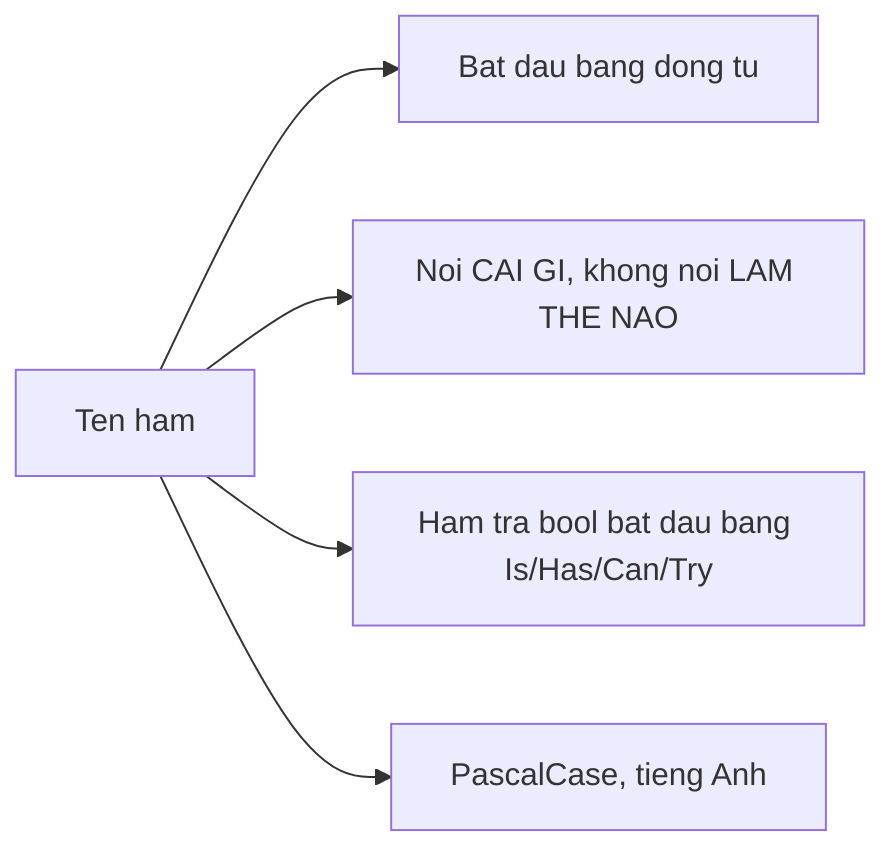

# 1.5 — 4. Hàm (Functions / Methods)

> Nguồn: https://tiennhm.io.vn/docs/dotnet-backend-zero-to-senior/stage-01-foundation/module-01-programming-logic/1.5-functions-methods
> Hàm, tham số, ref/out và local function. Kèm ba tiêu chí phân biệt hàm tốt với hàm xấu: một mức trừu tượng, tên nói đúng việc, và tách hàm thuần khỏi hàm có tác dụng phụ.

> Hàm không phải công cụ để **tiết kiệm dòng code** — nó là công cụ để **đặt tên cho một ý tưởng**. Một hàm tốt có thể gọi tên bằng một động từ, làm đúng một việc ở đúng một mức trừu tượng, và người đọc tin được cái tên mà không cần mở thân hàm ra xem. Bài này đi qua cú pháp, tham số mặc định và tham số đặt tên, `ref`/`out`/`in` (và vì sao code hiện đại gần như không cần hai cái đầu), local function, extension method, cùng mẫu `TryXxx` — cách trả về thất bại mà không ném ngoại lệ.

## Mục tiêu bài học

Sau bài này bạn có thể:

- Viết hàm với tham số mặc định, tham số đặt tên và `params`, và biết khi nào mỗi cái gây hại.
- Giải thích `ref`, `out`, `in` khác nhau ở đâu và vì sao nên thay chúng bằng tuple hoặc `record`.
- Nhận ra một hàm đang trộn nhiều mức trừu tượng và tách nó ra.
- Phân biệt hàm thuần với hàm có tác dụng phụ, và biết vì sao ranh giới đó đáng giữ.
- Chọn giữa ném ngoại lệ và trả về `bool` theo mẫu `TryXxx`.

## Nội dung bài học

### 1.5.1 — Hàm là cái tên đặt cho một ý tưởng

Lý do thật sự để tách hàm không phải là "dùng lại được ở ba chỗ". Nhiều hàm giá trị nhất trong một codebase chỉ được gọi **đúng một lần**.

```csharp
// TRƯỚC — người đọc phải tự giải mã
if (order.Total >= 500_000m
    && order.Customer.RegisteredAt <= DateTimeOffset.UtcNow.AddYears(-1)
    && !order.Customer.HasOverduePayment)
{
    ApplyDiscount(order, 0.15m);
}

// SAU — cái tên đã nói hết
if (IsEligibleForLoyaltyDiscount(order))
{
    ApplyDiscount(order, 0.15m);
}
```

Hàm `IsEligibleForLoyaltyDiscount` có thể chỉ được gọi một lần. Nó vẫn đáng tồn tại, vì nó biến ba dòng điều kiện thành một khái niệm nghiệp vụ có tên.

### 1.5.2 — Cú pháp và dạng biểu thức

```csharp
// Đầy đủ
public decimal CalculateDiscount(decimal total, decimal rate)
{
    return total * rate;
}

// Dạng biểu thức — dùng khi thân hàm chỉ có một biểu thức
public decimal CalculateDiscount(decimal total, decimal rate) => total * rate;

// Không trả về gì
public void LogOrder(Order order) => _logger.LogInformation("Đơn {Code}", order.Code);
```

### 1.5.3 — Tham số mặc định và tham số đặt tên

```csharp
public decimal CalculateShipping(
    decimal orderTotal,
    bool isExpress = false,
    decimal freeThreshold = 500_000m)
{
    if (orderTotal >= freeThreshold) return 0m;
    return isExpress ? 60_000m : 30_000m;
}

// Gọi với tham số đặt tên — người đọc hiểu ngay true nghĩa là gì
var fee = CalculateShipping(420_000m, isExpress: true);
```

Hai cảnh báo thực tế:

1. **`true`/`false` trần trụi ở chỗ gọi là bẫy đọc hiểu.** `CalculateShipping(420_000m, true)` — `true` là gì? Dùng tham số đặt tên, hoặc dùng `enum` thay cho `bool`.
2. **Giá trị mặc định được nhúng vào chỗ gọi lúc biên dịch.** Nếu hàm nằm trong một thư viện riêng và bạn đổi giá trị mặc định, những assembly đã biên dịch trước đó vẫn dùng giá trị cũ cho tới khi được build lại. Trong một solution thì không sao; giữa các thư viện thì đây là một cái bẫy có thật.

### 1.5.4 — `ref`, `out`, `in`

```csharp
// out — hàm buộc phải gán giá trị trước khi trả về
public bool TryParseCustomerId(string input, out int id) => int.TryParse(input, out id);

// ref — truyền vào và có thể bị hàm sửa
public void Increment(ref int counter) => counter++;

// in — truyền theo tham chiếu nhưng CẤM sửa; dùng cho struct lớn để tránh sao chép
public decimal Distance(in LargeStruct a, in LargeStruct b) => /* ... */ 0m;
```

Trong code backend hiện đại, `ref` và `out` phần lớn đã có cách thay tốt hơn:

```csharp
// THAY VÌ out nhiều giá trị
public void GetStats(List<Order> orders, out decimal total, out int count) { }

// DÙNG tuple — có tên, đọc được, không cần khai báo biến trước
public (decimal Total, int Count) GetStats(List<Order> orders) =>
    (orders.Sum(o => o.Total), orders.Count);

var stats = GetStats(orders);
Console.WriteLine(stats.Total);
```

`out` vẫn còn đúng một chỗ dùng chuẩn mực: **mẫu `TryXxx`** ở mục 1.5.8.

### 1.5.5 — Một hàm, một mức trừu tượng

Đây là tiêu chí phân biệt hàm tốt với hàm dài, cụ thể hơn nhiều so với "hàm không nên quá 20 dòng".

```csharp
// XẤU — trộn ba mức: nghiệp vụ, truy cập dữ liệu, và định dạng chuỗi
public async Task ProcessOrder(int orderId)
{
    var conn = new SqlConnection(_connectionString);
    await conn.OpenAsync();
    var cmd = new SqlCommand("SELECT * FROM Orders WHERE Id = @id", conn);
    // ... 20 dòng đọc dữ liệu ...

    if (order.Total >= 500_000m) order.Discount = 0.15m;   // nghiệp vụ

    var html = $"<p>Đơn {order.Code} đã xử lý</p>";        // trình bày
    await _mailer.SendAsync(order.Customer.Email, html);
}

// TỐT — mỗi dòng ở cùng một mức trừu tượng, chi tiết đẩy xuống dưới
public async Task ProcessOrder(int orderId)
{
    var order = await _orders.GetByIdAsync(orderId);
    ApplyLoyaltyDiscount(order);
    await _notifier.NotifyProcessedAsync(order);
}
```

Phép thử nhanh: đọc to thân hàm lên. Nếu các câu nhảy cóc giữa "gửi email cho khách" và "mở kết nối SQL", hàm đang trộn hai mức.

### 1.5.6 — Hàm thuần và tác dụng phụ

**Hàm thuần**: cùng đầu vào luôn cho cùng đầu ra, và không đụng gì bên ngoài.

```csharp
// Thuần — test được mà không cần mock, chạy song song vô tư
public decimal CalculateVat(decimal amount, decimal rate) => amount * rate;

// Không thuần — đọc đồng hồ và ghi database
public async Task<decimal> CalculateVatAndLog(decimal amount)
{
    var rate = DateTimeOffset.UtcNow.Year >= 2026 ? 0.08m : 0.10m;
    await _db.Logs.AddAsync(new Log { Amount = amount });
    return amount * rate;
}
```

Không phải mọi hàm đều thuần được — chương trình phải ghi database và gửi email thì mới có ích. Mục tiêu là **gom tác dụng phụ về một chỗ** và giữ phần tính toán ở dạng thuần, vì phần thuần là phần dễ kiểm thử nhất.

Mẹo áp dụng ngay: nhận `DateTimeOffset now` làm **tham số** thay vì gọi `DateTimeOffset.UtcNow` bên trong. Hàm lập tức trở nên kiểm thử được cho mọi mốc thời gian.

### 1.5.7 — Local function và extension method

```csharp
// Local function — hàm phụ chỉ có nghĩa bên trong hàm cha
public List<Report> BuildReports(List<Order> orders)
{
    return orders.Select(ToReport).ToList();

    static Report ToReport(Order o) => new(o.Code, o.Total);
}
```

Thêm `static` cho local function khi nó không cần biến của hàm cha — trình biên dịch sẽ chặn việc vô tình bắt biến (closure), thứ gây cấp phát bộ nhớ ngoài ý muốn.

```csharp
// Extension method — thêm phương thức cho kiểu mà bạn không sở hữu
public static class StringExtensions
{
    public static bool IsValidEmail(this string? value) =>
        !string.IsNullOrWhiteSpace(value) && value.Contains('@');
}

if (input.IsValidEmail()) { }
```

Extension method rất tiện và cũng rất dễ bị lạm dụng. Quy tắc giữ mình: chỉ viết extension cho kiểu bạn **không sở hữu** (`string`, `DateTime`, `IEnumerable`). Kiểu của chính bạn thì thêm phương thức vào thẳng lớp đó.

### 1.5.8 — Ném ngoại lệ hay trả về `false`?

```csharp
// Ném — khi thất bại là BẤT THƯỜNG
public Customer GetById(int id) =>
    _db.Customers.Find(id) ?? throw new NotFoundException($"Không có khách hàng {id}");

// TryXxx — khi thất bại là BÌNH THƯỜNG và hay xảy ra
public bool TryGetById(int id, out Customer? customer)
{
    customer = _db.Customers.Find(id);
    return customer is not null;
}
```

Tiêu chí chọn: **thất bại này có bình thường không?** Người dùng gõ sai định dạng ngày là chuyện bình thường — dùng `TryParse`. Database biến mất giữa chừng là bất thường — ném ngoại lệ.

Lý do kỹ thuật kèm theo: ném ngoại lệ tốn kém hơn trả về `bool` rất nhiều lần vì phải dựng stack trace. Trong một vòng lặp chạy hàng nghìn lần, dùng ngoại lệ cho luồng thông thường là một lỗi hiệu năng thật sự. Xem [Best practices for exceptions](https://learn.microsoft.com/en-us/dotnet/standard/exceptions/best-practices-for-exceptions).

### 1.5.9 — Đặt tên



| Tên xấu | Tên tốt | Vì sao |
|---|---|---|
| `Process()` | `ApplyLoyaltyDiscount()` | Xử lý *cái gì*? |
| `GetData()` | `GetOverdueInvoices()` | Dữ liệu *nào*? |
| `Check(order)` | `IsEligibleForRefund(order)` | Trả `bool` thì tên phải đọc như một câu hỏi |
| `DoItFast()` | `CalculateTotal()` | Tên nói cách làm, không nói việc làm |

Quy ước đầy đủ: [Names of type members](https://learn.microsoft.com/en-us/dotnet/standard/design-guidelines/names-of-type-members).

### 1.5.10 — Rà lại code của bạn

**Danh sách rà soát hàm**

- [ ] Mọi hàm gọi tên được bằng một động từ, và tên nói đúng việc nó làm.
- [ ] Không có hàm nào trộn nhiều mức trừu tượng trong cùng một thân.
- [ ] Tham số bool ở chỗ gọi đều có tham số đặt tên, hoặc đã đổi sang enum.
- [ ] Không dùng out cho nhiều giá trị trả về; đã thay bằng tuple có tên hoặc record.
- [ ] Hàm phụ thuộc thời gian nhận DateTimeOffset làm tham số, không gọi UtcNow bên trong.
- [ ] Ngoại lệ chỉ dùng cho tình huống bất thường, không dùng cho luồng chạy thông thường.
- [ ] Local function không dùng biến của hàm cha đều được khai static.

## Bài tập áp dụng

#### Bài 1 — Đặt tên cho một ý tưởng

Tìm trong dự án của bạn một khối `if` có từ ba điều kiện trở lên. Tách điều kiện đó thành một hàm `bool` mang **tên nghiệp vụ**. Đưa cho một đồng nghiệp đọc: chỉ nhìn tên hàm, họ có đoán đúng nó kiểm tra gì không?

**Tiêu chí hoàn thành:** người đọc đoán đúng ý nghĩa mà không cần mở thân hàm.

Gợi ý và lời giải — Bài 1

**Gợi ý.** Tên hàm nên mô tả **điều kiện đó có nghĩa gì trong nghiệp vụ**, chứ không mô tả các phép so sánh bên trong. `CheckCustomerStatusAndDateAndAmount` là mô tả cơ chế; `ĐủĐiềuKiệnGiảmGiá` là mô tả ý nghĩa. Nếu bạn phải dùng chữ "và" trong tên, gần như chắc chắn hàm đang gộp hai ý và nên tách đôi.

**Lời giải — trước:**

```csharp
if (customer.Status == CustomerStatus.Active
    && customer.RegisteredAt <= DateTime.UtcNow.AddYears(-1)
    && customer.TotalRevenue >= 50_000_000m
    && !customer.HasOverduePayment)
{
    ApDungGiamGia(order);
}
```

**Sau:**

```csharp
private static bool ĐủĐiềuKiệnKháchThânThiết(Customer c) =>
    c.Status == CustomerStatus.Active
    && c.RegisteredAt <= DateTime.UtcNow.AddYears(-1)
    && c.TotalRevenue >= 50_000_000m
    && !c.HasOverduePayment;

// chỗ gọi
if (ĐủĐiềuKiệnKháchThânThiết(customer))
    ApDungGiamGia(order);
```

**Ba lợi ích, xếp theo mức quan trọng:**

1. **Chỗ gọi đọc được như một câu tiếng Việt.** Người đọc luồng chính không cần biết "thân thiết" được định nghĩa thế nào; họ chỉ cần biết luồng làm gì. Khi cần chi tiết thì mở hàm ra xem.
2. **Quy tắc nằm ở đúng một chỗ.** Điều kiện này gần như chắc chắn còn xuất hiện ở chỗ khác — màn hình báo cáo, tác vụ gửi email, bộ lọc danh sách. Khi phòng kinh doanh đổi ngưỡng từ 50 triệu xuống 30 triệu, bạn sửa một dòng thay vì đi tìm khắp dự án.
3. **Kiểm thử được riêng.** Viết bài kiểm thử cho bốn trường hợp biên của điều kiện này là việc vài phút. Kiểm thử cùng điều kiện khi nó nằm lẫn trong một hàm 80 dòng thì khó hơn nhiều.

**Điểm dễ bỏ sót.** Hàm này nên là hàm thuần — chỉ đọc tham số, không đọc `DateTime.Now` ở dạng ngầm, không chạm database. Ở đây `DateTime.UtcNow` vẫn nằm bên trong, nên bài kiểm thử không kiểm soát được thời gian. Bài 3 dưới đây xử lý đúng vấn đề này.

#### Bài 2 — Bỏ `out`, dùng tuple và `record`

Viết một hàm trả về ba giá trị bằng `out`, rồi viết lại bằng tuple có tên và bằng `record`. So sánh **chỗ gọi** của ba phiên bản.

**Tiêu chí hoàn thành:** bạn nêu được tiêu chí chọn giữa ba cách, không phải kết luận cách nào "tốt nhất".

Gợi ý và lời giải — Bài 2

**Gợi ý.** Đừng so ở chỗ **khai báo** hàm — cả ba đều tương đương. Hãy so ở chỗ **gọi**: phiên bản nào đọc lên hiểu ngay, phiên bản nào bắt người đọc phải nhớ thứ tự tham số?

**Lời giải.**

```csharp
// Phiên bản 1 — out
public void PhanTich(IEnumerable<Order> orders,
                     out int soLuong, out decimal tong, out decimal trungBinh)
{
    soLuong = orders.Count();
    tong = orders.Sum(o => o.Total);
    trungBinh = soLuong == 0 ? 0 : tong / soLuong;
}

// Phiên bản 2 — tuple có tên
public (int SoLuong, decimal Tong, decimal TrungBinh) PhanTich(IEnumerable<Order> orders)
{
    var soLuong = orders.Count();
    var tong = orders.Sum(o => o.Total);
    return (soLuong, tong, soLuong == 0 ? 0 : tong / soLuong);
}

// Phiên bản 3 — record
public record ThongKeDonHang(int SoLuong, decimal Tong, decimal TrungBinh);

public ThongKeDonHang PhanTich(IEnumerable<Order> orders) { /* ... */ }
```

**So sánh chỗ gọi:**

```csharp
// 1 — phải khai báo biến trước, dễ hoán đổi nhầm hai tham số cùng kiểu decimal
PhanTich(orders, out int sl, out decimal tong, out decimal tb);

// 2 — một dòng, tên đi kèm
var (soLuong, tong, trungBinh) = PhanTich(orders);
var thongKe = PhanTich(orders);
Console.WriteLine(thongKe.TrungBinh);

// 3 — truyền tiếp được, so sánh được, in ra đọc được
var thongKe = PhanTich(orders);
LuuBaoCao(thongKe);
```

**Tiêu chí chọn:**

| Dùng | Khi |
|---|---|
| `out` | Gần như không bao giờ, trừ mẫu `TryXxx` đã thành quy ước của .NET như `TryGetValue`, `TryParse` |
| Tuple có tên | Kết quả chỉ dùng ngay tại chỗ gọi và không đi xa hơn |
| `record` | Kết quả được truyền qua nhiều tầng, lưu lại, so sánh, hoặc trả ra API |

**Vì sao `out` là lựa chọn kém nhất ở đây.** Ba lý do cụ thể: chỗ gọi buộc phải khai báo biến trước nên không viết được dưới dạng biểu thức; hai tham số cùng kiểu `decimal` đứng cạnh nhau nên hoán đổi nhầm mà trình biên dịch không phát hiện; và hàm có `out` không dùng được với `async`, một hạn chế sẽ trở nên rất phiền từ [Module 6](../../stage-02-csharp-professional/module-06-async-programming/) trở đi.

**Ngoại lệ chính đáng.** Mẫu `TryGetValue(key, out var value)` vẫn đúng và nên dùng, vì nó trả về hai thứ có bản chất khác nhau — một cờ thành công và một giá trị — và đã là quy ước ai cũng nhận ra trong .NET.

#### Bài 3 — Làm cho hàm thuần

Tìm một hàm gọi `DateTime.Now` bên trong. Đổi thành tham số. Viết một bài kiểm thử kiểm tra hành vi vào ngày 29/2 — điều mà phiên bản cũ không kiểm thử được.

**Tiêu chí hoàn thành:** bài kiểm thử chạy được vào bất kỳ ngày nào trong năm và luôn cho cùng kết quả.

Gợi ý và lời giải — Bài 3

**Gợi ý.** Một hàm gọi `DateTime.Now` bên trong có một **đầu vào ẩn** mà người gọi không kiểm soát được. Hệ quả: hàm cho kết quả khác nhau ở hai thời điểm khác nhau, nên không kiểm thử được một cách tất định. Cách sửa là biến đầu vào ẩn đó thành đầu vào tường minh.

**Lời giải — trước:**

```csharp
public bool HetHan(Subscription sub)
    => sub.ExpiresAt < DateTime.Now;      // đầu vào ẩn
```

**Sau:**

```csharp
public bool HetHan(Subscription sub, DateTime thoiDiem)
    => sub.ExpiresAt < thoiDiem;          // mọi đầu vào đều tường minh
```

**Bài kiểm thử giờ viết được:**

```csharp
[Fact]
public void GoiHetHanDungNgay29Thang2()
{
    var sub = new Subscription { ExpiresAt = new DateTime(2024, 2, 29, 12, 0, 0) };

    Assert.False(HetHan(sub, new DateTime(2024, 2, 29, 11, 59, 59)));
    Assert.True (HetHan(sub, new DateTime(2024, 2, 29, 12, 0,  1)));
}
```

**Vì sao bản cũ không kiểm thử được điều này.** Muốn kiểm tra hành vi vào 29/2/2024, bạn phải đợi tới ngày đó, hoặc đổi đồng hồ hệ thống của máy chạy kiểm thử — cả hai đều không chấp nhận được trong một pipeline tự động.

**Định nghĩa hàm thuần.** Một hàm là thuần khi nó thoả hai điều: cùng đầu vào luôn cho cùng đầu ra, và nó không gây tác dụng phụ nào ra bên ngoài. Bốn nguồn phá vỡ tính thuần hay gặp nhất trong code backend là thời gian hiện tại, số ngẫu nhiên, truy cập database hoặc mạng, và biến tĩnh dùng chung.

**Mở rộng cho dự án thật.** Truyền `DateTime` làm tham số hợp lý cho hàm nhỏ, nhưng không tiện khi chuỗi gọi sâu. .NET 8 giới thiệu lớp trừu tượng `TimeProvider` cho đúng việc này: tiêm `TimeProvider` qua DI, dùng `TimeProvider.System` khi chạy thật và `FakeTimeProvider` khi kiểm thử. [Module 7](../../stage-02-csharp-professional/module-07-dependency-injection/) trình bày cơ chế tiêm phụ thuộc làm nền cho cách làm này.

**Điểm tự chấm.** Nếu bạn nhận ra rằng cùng lập luận đó cũng áp dụng cho `Guid.NewGuid()` và `Random`, bạn đã nắm đúng nguyên tắc chứ không chỉ nhớ một thủ thuật về thời gian.

## Tự kiểm tra

### Chỉ gọi một lần thì có nên tách thành hàm riêng không?

Có, nếu việc tách đặt được tên cho một ý tưởng. Lý do tách hàm không phải là dùng lại, mà là đặt tên. Một điều kiện ba dòng khó hiểu, khi trở thành IsEligibleForLoyaltyDiscount(order), biến thành một khái niệm nghiệp vụ mà người đọc không cần giải mã.

### Vì sao nên tránh out cho nhiều giá trị trả về?

Vì chỗ gọi phải khai báo biến trước, đọc rối, và không ghép chuỗi được với LINQ. Tuple có tên hoặc record cho cùng kết quả mà đọc rõ hơn. out chỉ còn một chỗ dùng chuẩn mực là mẫu TryXxx, nơi giá trị trả về bool mới là thông tin chính.

### Một hàm ở một mức trừu tượng nghĩa là gì?

Nghĩa là mọi câu lệnh trong thân hàm nói chuyện ở cùng một tầng. Nếu một dòng nói 'gửi email cho khách' còn dòng kế bên nói 'mở kết nối SQL', hàm đang trộn hai mức. Cách sửa là đẩy chi tiết cấp thấp xuống các hàm con, giữ hàm cha như một bản tóm tắt đọc được.

### Hàm thuần là gì và vì sao đáng theo đuổi?

Là hàm mà cùng đầu vào luôn cho cùng đầu ra và không đụng tới trạng thái bên ngoài. Nó test được mà không cần mock, chạy song song không lo tranh chấp, và đọc hiểu được mà không cần nhìn chỗ khác. Không phải hàm nào cũng thuần được, nhưng nên gom tác dụng phụ về một chỗ và giữ phần tính toán ở dạng thuần.

### Khi nào ném ngoại lệ, khi nào trả về bool theo mẫu TryXxx?

Hỏi xem thất bại đó có bình thường không. Người dùng gõ sai định dạng ngày là bình thường nên dùng TryParse. Database biến mất giữa chừng là bất thường nên ném ngoại lệ. Thêm một lý do kỹ thuật: ném ngoại lệ tốn kém vì phải dựng stack trace, nên dùng nó cho luồng thông thường trong vòng lặp là lỗi hiệu năng thật sự.

### Vì sao nên khai static cho local function?

Vì static ngăn nó bắt biến của hàm cha. Khi local function bắt biến, trình biên dịch phải tạo một closure và cấp phát bộ nhớ trên heap. Thêm static là để trình biên dịch báo lỗi nếu bạn vô tình dùng biến bên ngoài, tức là biến việc cấp phát ngoài ý muốn thành lỗi biên dịch.

## Kết luận

Ba điều đáng nhớ nhất:

1. **Tách hàm để đặt tên, không phải để tiết kiệm dòng.** Hàm chỉ gọi một lần vẫn có thể là hàm giá trị nhất trong file.
2. **Một hàm, một mức trừu tượng.** Đây là tiêu chí dùng được ngay, cụ thể hơn nhiều so với đếm số dòng.
3. **Nhận thời gian làm tham số.** Một thay đổi nhỏ biến hàm không test được thành hàm test được cho mọi mốc thời gian.

## Tham khảo

- [Methods — C# programming guide](https://learn.microsoft.com/en-us/dotnet/csharp/programming-guide/classes-and-structs/methods)
- [Method parameters — ref, out, in, params](https://learn.microsoft.com/en-us/dotnet/csharp/language-reference/keywords/method-parameters)
- [Local functions](https://learn.microsoft.com/en-us/dotnet/csharp/programming-guide/classes-and-structs/local-functions)
- [Extension methods](https://learn.microsoft.com/en-us/dotnet/csharp/programming-guide/classes-and-structs/extension-methods)
- [Names of type members](https://learn.microsoft.com/en-us/dotnet/standard/design-guidelines/names-of-type-members) — quy ước đặt tên chính thức
- [Best practices for exceptions](https://learn.microsoft.com/en-us/dotnet/standard/exceptions/best-practices-for-exceptions)

## Điều hướng

- **Bài trước:** [1.4 — 3. Vòng Lặp (Loops)](1.4-loops.mdx)
- **Bài tiếp theo:** [1.6 — 5. Mảng và Danh Sách (Arrays & Lists)](1.6-arrays-and-lists.mdx)
- **Về module:** [Trang mục lục](./)
