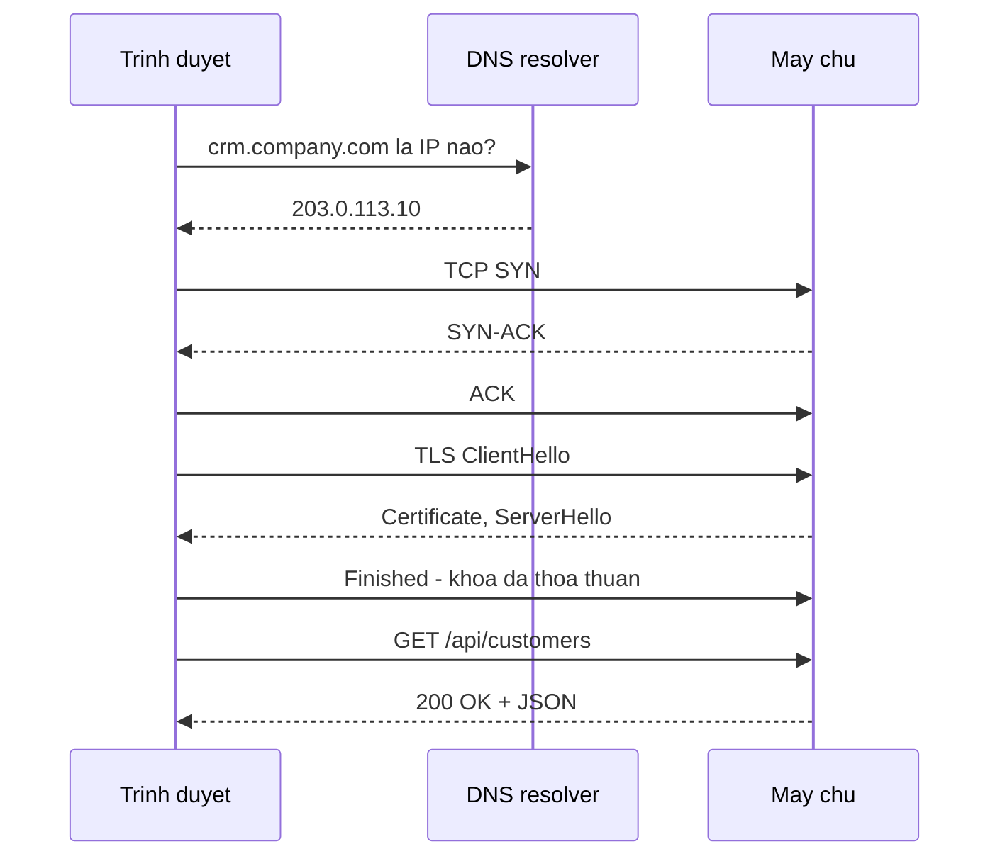

# 2.2 — 1. Internet hoạt động như thế nào

> Nguồn: https://tiennhm.io.vn/docs/dotnet-backend-zero-to-senior/stage-01-foundation/module-02-computer-science-basics/2.2-how-the-internet-works
> Theo chân một request từ lúc gõ URL tới lúc pixel hiện lên: DNS, TCP, TLS, HTTP. Kèm ngân sách thời gian của từng chặng và lý do vì sao backend phải quan tâm tới chuyện này.

> Gõ `crm.company.com` rồi bấm Enter, và trước khi byte dữ liệu đầu tiên của bạn rời máy, trình duyệt đã làm xong **ba lần bắt tay riêng biệt**: hỏi DNS để đổi tên miền thành địa chỉ IP, bắt tay TCP ba bước để mở kết nối, rồi bắt tay TLS để thoả thuận khoá mã hoá. Ba việc đó tốn vài trăm mili giây **trước khi** máy chủ của bạn nhận được gì. Hiểu chuỗi này là điều kiện để trả lời những câu hỏi rất thực tế: vì sao đổi DNS phải đợi, vì sao một API gọi 5 lần chậm hơn hẳn một API gọi 1 lần, và vì sao mở kết nối mới tốn kém tới mức phải có connection pool.

## Mục tiêu bài học

Sau bài này bạn có thể:

- Kể lại các chặng một request đi qua, theo đúng thứ tự.
- Giải thích DNS TTL là gì và vì sao đổi bản ghi DNS không có hiệu lực ngay.
- Nêu TCP bắt tay mấy bước, TLS thêm bao nhiêu vòng, và tổng chi phí mở một kết nối.
- Giải thích vì sao connection pool và keep-alive lại quan trọng với backend.
- Phân biệt độ trễ do mạng với độ trễ do máy chủ xử lý.

## Nội dung bài học

### 2.3.1 — Toàn cảnh một request



Chú ý: **bốn lượt đi về trước khi gửi được request đầu tiên**. Trên đường truyền quốc tế với độ trễ một chiều 80ms, riêng phần chuẩn bị đã tốn khoảng 480ms.

### 2.3.2 — DNS: đổi tên thành số

Máy tính không hiểu `crm.company.com`; nó cần `203.0.113.10`. DNS là hệ thống tra cứu phân tán làm việc đổi đó.

Chuỗi tra cứu, dừng ngay khi có cache:

1. Cache của trình duyệt
2. Cache của hệ điều hành
3. DNS resolver của nhà mạng
4. Root server → TLD server (`.com`) → name server của domain

**TTL (Time To Live)** là điểm hay bị hiểu nhầm nhất. Mỗi bản ghi DNS kèm một TTL tính bằng giây, và mọi cache trên đường được phép giữ kết quả đến hết khoảng đó.

```
crm.company.com.   300   IN   A   203.0.113.10
                    ↑
                 TTL 300 giây
```

Hệ quả thực tế: đổi bản ghi DNS trỏ sang máy chủ mới **không có hiệu lực ngay**. Trong tối đa một TTL nữa, một phần người dùng vẫn đi tới máy chủ cũ. Vì thế trước mỗi lần chuyển máy chủ, việc đầu tiên là **hạ TTL xuống** vài phút và đợi hết TTL cũ, rồi mới đổi bản ghi.

### 2.3.3 — TCP: bắt tay ba bước

```
Client  ──── SYN ────▶  Server
Client  ◀── SYN-ACK ──  Server
Client  ──── ACK ────▶  Server
        (kết nối sẵn sàng)
```

Một vòng đi về hoàn chỉnh trước khi gửi được dữ liệu. TCP bảo đảm **đúng thứ tự** và **không mất gói** — gói nào không tới nơi sẽ được gửi lại.

### 2.3.4 — TLS: chữ "S" trong HTTPS

Sau TCP, TLS thoả thuận cách mã hoá. TLS 1.3 cần thêm **một vòng** nữa (TLS 1.2 cần hai).

TLS làm ba việc, và hay bị rút gọn thành mỗi việc đầu:

1. **Mã hoá** — người ở giữa không đọc được nội dung.
2. **Xác thực** — chứng chỉ chứng minh máy chủ đúng là chủ của tên miền đó.
3. **Toàn vẹn** — nội dung bị sửa trên đường thì phát hiện được.

Việc thứ hai là lý do chứng chỉ phải do một CA đáng tin cấp, và phải **gia hạn trước khi hết hạn**. Bài [Traefik + Cloudflare: vì sao cert hết hạn đồng loạt sau 60 ngày](https://tiennhm.io.vn/blog/traefik-cloudflare-https-tu-dong-vps) là một sự cố thật của việc gia hạn tự động không chạy.

### 2.3.5 — Vì sao backend phải quan tâm

Ba con số làm mọi thứ sáng ra:

| Thao tác | Thời gian điển hình |
|---|---|
| Đọc từ RAM | ~100 nano giây |
| Đọc từ SSD | ~100 micro giây (nghìn lần chậm hơn RAM) |
| Gọi trong cùng trung tâm dữ liệu | ~0,5 mili giây |
| Gọi qua Internet (cùng quốc gia) | ~20 mili giây |
| Gọi qua Internet (xuyên lục địa) | ~150 mili giây |

Từ bảng này suy ra ba nguyên tắc thiết kế:

1. **Mở kết nối là tốn kém.** Nên `HttpClient` phải được dùng lại qua `IHttpClientFactory`, và database phải có connection pool. Mỗi kết nối mới là TCP cộng TLS cộng toàn bộ độ trễ ở trên.
2. **Gọi 5 lần chậm hơn hẳn gọi 1 lần**, kể cả khi mỗi lần đều nhanh — vì độ trễ mạng cộng dồn tuyến tính. Đây chính là lý do vấn đề [N+1 query](https://tiennhm.io.vn/blog/ef-core-n-plus-1-query) tàn phá đến thế: hằng số của mỗi lần đi mạng lớn gấp hàng nghìn lần một phép so sánh trong bộ nhớ.
3. **Gần người dùng thì nhanh hơn.** Đó là toàn bộ lý do tồn tại của CDN và edge cache.

### 2.3.6 — Phân biệt chậm do mạng hay chậm do server

Khi có người báo "hệ thống chậm", câu hỏi đầu tiên là chậm ở đâu.

```bash
# Tổng thời gian và từng chặng
curl -w "dns:%{time_namelookup}s connect:%{time_connect}s tls:%{time_appconnect}s \
ttfb:%{time_starttransfer}s total:%{time_total}s\n" -o /dev/null -s https://api.company.com/health
```

Đọc kết quả:

- `dns` cao → vấn đề ở phân giải tên miền.
- `connect` trừ `dns` cao → độ trễ mạng hoặc máy chủ quá tải ở tầng TCP.
- `tls` trừ `connect` cao → bắt tay TLS chậm, thường do chuỗi chứng chỉ dài hoặc OCSP.
- `ttfb` trừ `tls` cao → **máy chủ của bạn xử lý chậm**. Đây mới là lúc đi tìm câu query chậm.
- `total` trừ `ttfb` cao → phần thân phản hồi quá lớn, hoặc băng thông hẹp.

Không có bước này thì rất dễ bỏ cả ngày tối ưu câu SQL trong khi vấn đề nằm ở DNS.

### 2.3.7 — Rà lại hệ thống của bạn

**Danh sách rà soát tầng mạng**

- [ ] HttpClient được tạo qua IHttpClientFactory, không new trong mỗi request.
- [ ] Connection pool của database đã bật và kích thước phù hợp với tải.
- [ ] Chứng chỉ TLS có cơ chế gia hạn tự động, và có cảnh báo khi sắp hết hạn.
- [ ] TTL của DNS đã hạ xuống trước mỗi lần chuyển máy chủ.
- [ ] Đã đo được TTFB tách khỏi thời gian DNS, TCP và TLS.
- [ ] Tài nguyên tĩnh phục vụ qua CDN thay vì đi thẳng về máy chủ gốc.

## Bài tập áp dụng

#### Bài 1 — Bóc tách độ trễ thành năm chặng

Chạy `curl -w` với ba mục tiêu: một API nội bộ, một website trong nước, một website nước ngoài. Lập bảng năm chặng và chỉ ra chặng nào khác biệt nhất.

**Tiêu chí hoàn thành:** bạn nói được chặng nào do **mạng** quyết định và chặng nào do **server** quyết định.

Gợi ý và lời giải — Bài 1

**Gợi ý.** `curl` cho phép in các mốc thời gian tích luỹ. Hiệu của hai mốc liền nhau chính là thời gian của một chặng. Chặng cuối — từ lúc kết nối xong tới lúc nhận byte đầu tiên — là chặng duy nhất phản ánh công sức xử lý của server.

**Lời giải.**

```bash
FMT='%{time_namelookup} %{time_connect} %{time_appconnect} %{time_starttransfer} %{time_total}\n'
curl -s -o /dev/null -w "$FMT" https://tiennhm.io.vn/
```

**Kết quả đo thật (giây, mốc tích luỹ từ lúc bắt đầu):**

```text
mục tiêu            dns       tcp       tls       ttfb      tổng
tiennhm.io.vn       0.080947  0.125172  0.232079  0.535858  0.565653
vnexpress.net       0.019848  0.021087  0.084963  0.099342  0.104570
www.bbc.com         0.048177  0.107146  0.227329  0.298442  0.538572
```

**Bóc thành từng chặng** (lấy hiệu của hai cột liền nhau), đơn vị mili-giây:

| Chặng | tiennhm.io.vn | vnexpress.net | www.bbc.com | Do ai quyết định |
|---|---|---|---|---|
| Phân giải tên miền | 81 | 20 | 48 | Máy chủ DNS + bộ nhớ đệm |
| Bắt tay TCP | 44 | 1 | 59 | **Khoảng cách địa lý** |
| Bắt tay TLS | 107 | 64 | 120 | Khoảng cách + cấu hình mã hoá |
| Chờ server xử lý | 304 | 14 | 71 | **Ứng dụng của bạn** |
| Tải nội dung | 30 | 5 | 240 | Kích thước nội dung + băng thông |

**Đọc bảng này thế nào.** `vnexpress.net` có TCP chỉ **1 ms** vì máy đo nằm cùng khu vực — gần như không có khoảng cách vật lý. `www.bbc.com` mất 59 ms cho cùng thao tác vì gói tin phải đi nửa vòng trái đất. Không dòng code nào sửa được chênh lệch này; chỉ có đặt máy chủ gần người dùng hơn, hoặc dùng CDN.

Ngược lại, cột "chờ server xử lý" của `tiennhm.io.vn` là 304 ms — cao nhất bảng và **là chặng duy nhất bạn kiểm soát được**. Đây chính là nơi tối ưu truy vấn, thêm bộ nhớ đệm và sửa lỗi N+1 có tác dụng.

**Vì sao phép bóc tách này quan trọng.** Khi ai đó báo "API chậm", câu hỏi đầu tiên phải là *chậm ở chặng nào*. Ba nguyên nhân thường bị nhầm lẫn:

- **DNS chậm** — thường do TTL quá ngắn hoặc máy chủ DNS ở xa. Sửa bằng cấu hình, không phải bằng code.
- **TLS chậm** — bắt tay TLS tốn một tới hai vòng khứ hồi. Sửa bằng cách bật dùng lại kết nối và HTTP/2, không phải bằng code nghiệp vụ.
- **Chờ server chậm** — đây mới là phần thuộc về ứng dụng.

Tối ưu truy vấn database khi vấn đề thật nằm ở TLS là việc rất hay xảy ra, và nó tốn nhiều ngày công mà không cải thiện gì. [Module 19](../../stage-05-senior-engineering/module-19-performance-engineering/) bắt đầu bằng đúng nguyên tắc này: đo trước, sửa sau.

#### Bài 2 — Quan sát DNS TTL

Dùng `dig` hoặc `nslookup` trên một tên miền bất kỳ, ghi lại TTL. Chạy lại sau 30 giây và xem TTL giảm. Giải thích con số đó nói gì về thời gian chờ khi đổi bản ghi.

**Tiêu chí hoàn thành:** bạn tính được thời gian tối đa mà một phần người dùng vẫn bị dẫn tới máy chủ cũ sau khi bạn đổi DNS.

Gợi ý và lời giải — Bài 2

**Gợi ý.** TTL là viết tắt của *time to live* — số **giây** mà một máy chủ DNS trung gian được phép giữ câu trả lời trong bộ nhớ đệm trước khi phải hỏi lại. Nếu nó giảm dần mỗi lần bạn hỏi lại, nghĩa là bạn đang nhận câu trả lời từ bộ đệm chứ không phải từ nguồn.

**Lời giải.**

```bash
dig +noall +answer tiennhm.io.vn
```

**Kết quả thật:**

```text
tiennhm.io.vn.		300	IN	A	185.199.108.153
tiennhm.io.vn.		300	IN	A	185.199.111.153
tiennhm.io.vn.		300	IN	A	185.199.110.153
```

Số `300` là TTL, tính bằng giây — tức 5 phút. Chạy lại sau 30 giây, nếu câu trả lời đến từ bộ đệm thì con số sẽ còn khoảng `270`.

Ba bản ghi `A` cho cùng một tên là cơ chế cân bằng tải đơn giản nhất: client chọn một trong ba địa chỉ, và nếu một máy chủ hỏng thì vẫn còn hai.

**Trả lời câu hỏi của đề.** Sau khi bạn đổi bản ghi DNS, người dùng vẫn có thể bị dẫn tới máy chủ cũ trong **tối đa bằng TTL**, ở đây là 5 phút. Nhưng con số thực tế thường lớn hơn, vì ba lý do:

1. Có **nhiều tầng đệm** nối tiếp: máy chủ DNS của nhà mạng, bộ đệm của hệ điều hành, và bộ đệm của chính trình duyệt — mỗi tầng có đồng hồ đếm riêng.
2. Một số máy chủ DNS **không tôn trọng** TTL ngắn và tự áp một mức tối thiểu của riêng họ.
3. Ứng dụng .NET mặc định giữ kết quả phân giải trong một khoảng thời gian riêng, nên tiến trình đang chạy có thể tiếp tục dùng địa chỉ cũ kể cả khi DNS đã đổi.

**Hệ quả khi vận hành.** Quy trình chuyển máy chủ an toàn gồm ba bước:

```text
1. Vài giờ TRƯỚC khi chuyển: hạ TTL xuống 60 giây, đợi TTL cũ hết hạn
2. Đổi bản ghi sang máy chủ mới
3. Giữ máy chủ cũ chạy thêm ít nhất 2 lần TTL, rồi mới tắt
```

Bỏ bước 1 là nguyên nhân phổ biến của tình trạng "một số người dùng vẫn vào trang cũ" kéo dài nhiều giờ sau khi chuyển. Bỏ bước 3 khiến một phần người dùng nhận lỗi kết nối.

**Liên hệ với .NET.** Trong ứng dụng dùng `HttpClient` lâu dài, hành vi giữ địa chỉ cũ có thể gây lỗi sau khi dịch vụ đích đổi IP. Cách xử lý là đặt `PooledConnectionLifetime` để kết nối được làm mới định kỳ — chi tiết ở [Module 9](../../stage-03-aspnet-core-backend/module-09-web-api-professional/) khi bàn về gọi dịch vụ ngoài.

#### Bài 3 — Đo cái giá của kết nối mới

Viết một chương trình gọi cùng một API 20 lần: lần một tạo `HttpClient` mới mỗi lượt, lần hai dùng lại một thể hiện. So sánh tổng thời gian.

**Tiêu chí hoàn thành:** bạn giải thích được khoản thời gian tiết kiệm được **đến từ chặng nào** trong năm chặng ở Bài 1.

Gợi ý và lời giải — Bài 3

**Gợi ý.** Nhìn lại bảng năm chặng ở Bài 1 và hỏi: chặng nào phải làm lại từ đầu khi mở một kết nối mới, và chặng nào thì không?

**Lời giải.**

```csharp
const string url = "https://tiennhm.io.vn/";
const int N = 20;

var sw = Stopwatch.StartNew();
for (int i = 0; i < N; i++)
{
    using var c = new HttpClient();        // kết nối mới mỗi lượt
    await c.GetAsync(url);
}
sw.Stop();
Console.WriteLine($"HttpClient mới : {sw.Elapsed.TotalMilliseconds:F0} ms");

using var shared = new HttpClient();
sw.Restart();
for (int i = 0; i < N; i++) await shared.GetAsync(url);   // dùng lại kết nối
sw.Stop();
Console.WriteLine($"Dùng lại       : {sw.Elapsed.TotalMilliseconds:F0} ms");
```

**Kết quả đo thật trên .NET 9:**

```text
HttpClient mới mỗi lần :     5085 ms  (254 ms/lần)
Dùng lại một thể hiện  :     1281 ms  ( 64 ms/lần)
nhanh gấp              :      4.0 lần
```

**Khoản tiết kiệm đến từ đâu.** Mỗi lần mở kết nối mới phải làm lại **ba chặng đầu** trong bảng ở Bài 1: phân giải tên miền, bắt tay TCP, bắt tay TLS. Cộng lại khoảng 190 ms cho máy chủ này — khớp với chênh lệch 190 ms mỗi lần đo được. Chặng "chờ server xử lý" thì không đổi, vì server vẫn phải làm đúng chừng đó việc.

Khi dùng lại một `HttpClient`, kết nối TCP và phiên TLS được giữ trong nhóm kết nối và tái sử dụng, nên lần gọi thứ hai trở đi chỉ còn chặng thứ tư và thứ năm.

**Vấn đề nghiêm trọng hơn cả tốc độ.** Tạo `HttpClient` mới liên tục gây cạn kiệt cổng mạng. Mỗi kết nối đã đóng vẫn ở trạng thái chờ khoảng 4 phút theo quy định của TCP, trong lúc đó cổng chưa được giải phóng. Một dịch vụ gọi API vài trăm lần mỗi giây sẽ dùng hết dải cổng khả dụng và bắt đầu ném `SocketException`, thường sau vài giờ chạy — đủ lâu để không ai liên hệ nó với đoạn code mới triển khai.

**Cách làm đúng trong ASP.NET Core.** Đừng tự quản lý `HttpClient`, dùng `IHttpClientFactory`:

```csharp
builder.Services.AddHttpClient<ICrmApiClient, CrmApiClient>(c =>
{
    c.BaseAddress = new Uri("https://api.company.com/");
    c.Timeout = TimeSpan.FromSeconds(10);
});
```

Factory quản lý nhóm kết nối, làm mới chúng định kỳ để nhận được thay đổi DNS như Bài 2 đã nêu, và cho phép gắn thêm chính sách thử lại. [Module 7](../../stage-02-csharp-professional/module-07-dependency-injection/) trình bày cách đăng ký, còn [Module 17](../../stage-05-senior-engineering/module-17-distributed-systems/) bổ sung cầu dao ngắt mạch cho các lời gọi ra ngoài.

**Lưu ý khi đo lại.** Con số của bạn sẽ khác vì phụ thuộc vào khoảng cách tới máy chủ. Điều cần giống nhau là **tỉ lệ**: nếu bạn không thấy chênh lệch rõ, nhiều khả năng máy chủ đích ở rất gần hoặc bạn đang đo với HTTP chứ không phải HTTPS, nên không có chặng bắt tay TLS để tiết kiệm.

## Tự kiểm tra

### Một request đi qua những chặng nào trước khi tới máy chủ?

Bốn chặng: phân giải DNS để đổi tên miền thành IP, bắt tay TCP ba bước để mở kết nối, bắt tay TLS để thoả thuận khoá mã hoá, rồi mới gửi request HTTP. Ba chặng đầu tốn vài vòng đi về, nên trên đường truyền quốc tế chúng có thể chiếm vài trăm mili giây trước khi máy chủ nhận được gì.

### DNS TTL là gì và vì sao đổi DNS không có hiệu lực ngay?

TTL là số giây mà mọi cache trên đường được phép giữ lại kết quả tra cứu. Sau khi đổi bản ghi, các cache vẫn trả kết quả cũ cho tới khi hết TTL, nên một phần người dùng vẫn đi tới máy chủ cũ. Cách xử lý là hạ TTL xuống vài phút trước, đợi hết TTL cũ, rồi mới đổi bản ghi.

### TLS làm những việc gì ngoài mã hoá?

Ba việc. Mã hoá để người ở giữa không đọc được. Xác thực để chứng minh máy chủ đúng là chủ của tên miền, thông qua chứng chỉ do CA đáng tin cấp. Và toàn vẹn để phát hiện nội dung bị sửa trên đường. Việc thứ hai là lý do chứng chỉ phải được gia hạn trước hạn.

### Vì sao phải dùng lại HttpClient thay vì tạo mới mỗi lần?

Vì mỗi kết nối mới phải trả lại toàn bộ chi phí bắt tay TCP và TLS, tức vài vòng đi về. Dùng lại instance qua IHttpClientFactory cho phép tận dụng kết nối đang mở. Tạo mới HttpClient liên tục còn gây cạn kiệt socket do các kết nối ở trạng thái TIME_WAIT.

### Vì sao gọi API 5 lần lại chậm hơn nhiều so với gọi 1 lần?

Vì độ trễ mạng cộng dồn tuyến tính theo số lần gọi, và độ trễ đó lớn hơn hàng nghìn lần thời gian xử lý trong bộ nhớ. Đây chính là cơ chế khiến vấn đề N+1 query gây hại lớn: không phải mỗi query chậm, mà là số lần đi mạng quá nhiều.

### Làm sao biết chậm do mạng hay do máy chủ?

Dùng curl với tuỳ chọn -w để tách thời gian thành năm chặng: namelookup, connect, appconnect, starttransfer và total. Nếu khoảng cách giữa appconnect và starttransfer lớn thì đó là thời gian máy chủ xử lý. Còn nếu các chặng trước đó lớn thì vấn đề nằm ở DNS, mạng hoặc TLS.

## Kết luận

Ba điều đáng nhớ nhất:

1. **Bốn lượt đi về xảy ra trước request đầu tiên.** Đó là lý do kết nối phải được dùng lại chứ không tạo mới.
2. **DNS TTL quyết định thời gian chờ khi chuyển máy chủ.** Hạ TTL trước, đổi bản ghi sau.
3. **Tách TTFB ra khỏi phần còn lại trước khi tối ưu.** Nếu không, rất dễ sửa nhầm chỗ.

## Tham khảo

- [DNS — MDN Glossary](https://developer.mozilla.org/en-US/docs/Glossary/DNS)
- [HTTP — MDN](https://developer.mozilla.org/en-US/docs/Web/HTTP) — tổng quan giao thức
- [RFC 9110 — HTTP Semantics](https://www.rfc-editor.org/rfc/rfc9110.html) — đặc tả gốc
- [Host and deploy ASP.NET Core](https://learn.microsoft.com/en-us/aspnet/core/host-and-deploy/) — phía máy chủ

## Điều hướng

- **Bài trước:** [2.1 — Concept learning path](2.1-concept-learning-path.mdx)
- **Bài tiếp theo:** [2.3 — 2. Client - Server Model](2.3-client.mdx)
- **Về module:** [Trang mục lục](./)

## Bài liên quan

- [Traefik + Cloudflare: vì sao cert hết hạn đồng loạt sau 60 ngày?](https://tiennhm.io.vn/blog/traefik-cloudflare-https-tu-dong-vps) — Một VPS, 14 container, 13 hostname, tất cả nằm sau Cloudflare và đều cần HTTPS tự động.
- [Vì sao EF Core bắn 201 query cho 1 màn hình danh sách? Cách sửa N+1](https://tiennhm.io.vn/blog/ef-core-n-plus-1-query) — Một màn hình 200 dòng mà log SQL ghi 201 câu lệnh là dấu hiệu của N+1 query.
