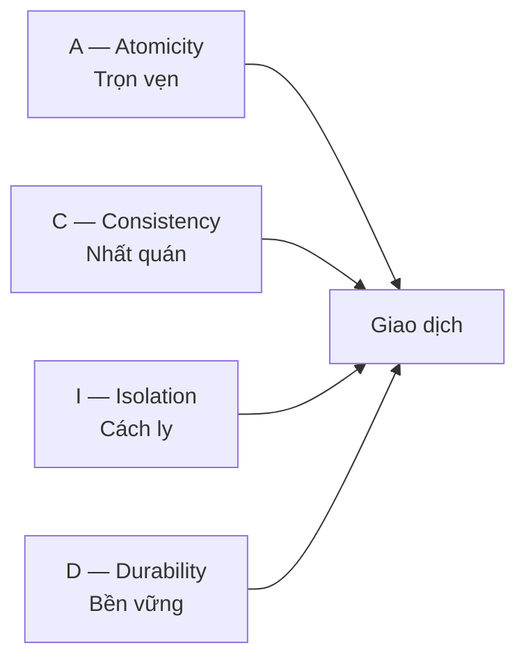

# 2.6 — 5. Cơ sở dữ liệu là gì

> Nguồn: https://tiennhm.io.vn/docs/dotnet-backend-zero-to-senior/stage-01-foundation/module-02-computer-science-basics/2.6-what-is-a-database
> Vì sao không lưu dữ liệu vào file: bốn thứ một DBMS làm mà file không làm được. Kèm ACID, ràng buộc nên đặt ở đâu, chọn giữa quan hệ và NoSQL, và vì sao connection là tài nguyên khan hiếm.

> Câu hỏi đúng không phải "database là gì" mà là **"vì sao không lưu vào file cho xong"**. Bốn thứ một hệ quản trị cơ sở dữ liệu làm mà file không làm được: cho **nhiều người ghi cùng lúc** mà không đè lên nhau, bảo đảm dữ liệu **còn nguyên sau khi mất điện**, trả lời câu hỏi phức tạp mà **không phải đọc toàn bộ**, và **từ chối dữ liệu sai** ngay tại nguồn. Bài này đi qua bốn thứ đó, mô hình ACID, tranh luận đặt ràng buộc ở tầng nào, và một tài nguyên mà người mới hay quên là khan hiếm: **connection**.

## Mục tiêu bài học

Sau bài này bạn có thể:

- Nêu bốn việc DBMS làm mà một file không làm được.
- Giải thích từng chữ trong ACID bằng một tình huống thật.
- Quyết định đặt ràng buộc ở database hay ở tầng ứng dụng.
- Chọn giữa cơ sở dữ liệu quan hệ và NoSQL theo hình dạng dữ liệu.
- Giải thích vì sao connection pool tồn tại và điều gì xảy ra khi nó cạn.

## Nội dung bài học

### 2.7.1 — Vì sao không dùng file

Giả sử bạn lưu khách hàng vào `customers.json`. Bốn vấn đề xuất hiện ngay:

**1. Hai người ghi cùng lúc.** A và B cùng đọc file, mỗi người sửa một khách hàng khác nhau, rồi cùng ghi đè. Thay đổi của người ghi trước **biến mất không dấu vết**.

**2. Mất điện giữa lúc ghi.** File còn lại một nửa, JSON hỏng, mất toàn bộ dữ liệu.

**3. Câu hỏi phức tạp.** "Khách hàng ở Hà Nội có đơn trên 5 triệu trong tháng này, sắp theo tổng chi tiêu" — với file thì phải đọc hết rồi tự lọc bằng code. Với 3 triệu bản ghi thì không khả thi.

**4. Dữ liệu rác lọt vào.** Một đoạn code quên kiểm tra và ghi vào khách hàng có `email = null`, `age = -5`. Không gì chặn lại.

DBMS tồn tại để giải quyết đúng bốn thứ này.

### 2.7.2 — ACID, bằng ví dụ



**Atomicity — trọn vẹn hoặc không gì cả.** Chuyển 1 triệu từ tài khoản A sang B gồm hai bước: trừ A, cộng B. Nếu hỏng giữa chừng, không được phép để tiền bốc hơi. Giao dịch hoặc xong cả hai, hoặc quay về như chưa làm gì.

```sql
BEGIN;
  UPDATE accounts SET balance = balance - 1000000 WHERE id = 1;
  UPDATE accounts SET balance = balance + 1000000 WHERE id = 2;
COMMIT;   -- mất điện trước dòng này -> tự động quay lui cả hai
```

**Consistency — mọi ràng buộc vẫn đúng sau giao dịch.** Nếu có quy tắc "số dư không âm", database từ chối commit một giao dịch phá vỡ nó.

**Isolation — các giao dịch chạy song song không thấy trạng thái dở dang của nhau.** Đây là chữ tinh vi nhất và có nhiều mức độ khác nhau, mỗi mức đánh đổi giữa đúng đắn và tốc độ. Bài [Hai giao dịch cùng cộng 100, số dư chỉ tăng 100](https://tiennhm.io.vn/blog/sql-isolation-level-lost-update-phantom-read) dựng thí nghiệm thật cho từng mức.

**Durability — đã commit là còn mãi.** Sau khi database trả về "thành công", dữ liệu phải sống sót qua mất điện ngay lập tức. Điều này thực hiện được nhờ ghi nhật ký xuống đĩa **trước** khi báo thành công.

Chi tiết từng mức: [Transactions và ACID](https://tiennhm.io.vn/docs/database/learn-sql-in-30-days/16-transactions-acid).

### 2.7.3 — Quan hệ hay NoSQL

| | Quan hệ (PostgreSQL, SQL Server) | Tài liệu (MongoDB) | Khoá-giá trị (Redis) |
|---|---|---|---|
| Hình dạng dữ liệu | Bảng có lược đồ cố định | Tài liệu JSON linh hoạt | Cặp khoá và giá trị |
| Quan hệ nhiều-nhiều | Mạnh, `JOIN` sẵn có | Phải tự xử lý | Không có |
| Giao dịch | ACID đầy đủ | Có, hạn chế hơn | Rất hạn chế |
| Đổi lược đồ | Cần migration | Linh hoạt | Không có lược đồ |
| Dùng cho | Nghiệp vụ, tài chính, CRM/ERP | Catalog, log, nội dung | Cache, session, hàng đợi |

Lời khuyên thực dụng: **mặc định chọn quan hệ**. Phần lớn dữ liệu nghiệp vụ *là* dữ liệu quan hệ — khách hàng có đơn hàng, đơn hàng có sản phẩm. Chọn NoSQL khi có lý do cụ thể, không phải vì nó mới hơn.

Và hai loại này không loại trừ nhau. Kiến trúc rất phổ biến: PostgreSQL làm nguồn sự thật, Redis làm cache phía trước.

### 2.7.4 — Ràng buộc: đặt ở database hay ở code?

Câu trả lời thường gây tranh cãi, nhưng có một lập luận khó bác:

> Ứng dụng đến rồi đi. Dữ liệu ở lại.

Trong vòng đời một hệ thống, dữ liệu sẽ bị ghi bởi: ứng dụng chính, một script di trú, một job nền, một truy vấn sửa tay lúc 2 giờ sáng, một công cụ nhập liệu, và ứng dụng viết lại bằng ngôn ngữ khác sau năm năm. **Chỉ database là chốt chặn mà tất cả đều phải đi qua.**

```sql
CREATE TABLE customers (
    id          BIGSERIAL PRIMARY KEY,
    email       VARCHAR(255) NOT NULL UNIQUE,     -- không trùng, không rỗng
    age         INT CHECK (age >= 0 AND age < 150),
    created_at  TIMESTAMPTZ NOT NULL DEFAULT NOW()
);
```

Nghĩa là **cả hai**: kiểm tra ở ứng dụng để báo lỗi thân thiện và tiết kiệm một vòng đi database; ràng buộc ở database để bảo đảm không đường nào lách được. Khi hai chỗ mâu thuẫn, database là nơi nói lời cuối.

Thiết kế lược đồ đi sâu ở bài [database design best practices](https://tiennhm.io.vn/docs/database/learn-sql-in-30-days/27-database-design-best-practices).

### 2.7.5 — Index: đánh đổi giống hệt Big-O

Không có index, tìm một dòng trong 10 triệu dòng là quét toàn bảng — `O(n)`. Có index, database tra theo cây B-tree — `O(log n)`, khoảng 24 bước.

Cái giá: index tốn dung lượng, và **làm chậm mọi lệnh ghi** vì mỗi `INSERT`, `UPDATE`, `DELETE` phải cập nhật thêm cấu trúc đó. Bài [Thêm 4 index làm INSERT chậm 6 lần](https://tiennhm.io.vn/blog/chi-phi-ghi-cua-index) đo con số cụ thể trên PostgreSQL 16.

Và có index chưa chắc đã được dùng: bọc một hàm quanh cột trong `WHERE` là index bị vô hiệu — xem [Sargability](https://tiennhm.io.vn/blog/sql-index-khong-duoc-dung-sargable).

Đây cùng là một ý tưởng với [Big-O ở bài 1.8](https://tiennhm.io.vn/docs/dotnet-backend-zero-to-senior/stage-01-foundation/module-01-programming-logic/1.7-data-structures-and-big-o), chỉ khác là áp dụng lên ổ đĩa.

### 2.7.6 — Connection là tài nguyên khan hiếm

Đây là điều người mới hay bỏ qua nhất.

Mỗi kết nối tới database tốn bộ nhớ ở phía máy chủ, và số lượng bị giới hạn — PostgreSQL mặc định `max_connections = 100`. Mở kết nối cũng không rẻ: TCP, xác thực, thiết lập phiên.

Vì thế mọi thư viện truy cập dữ liệu đều có **connection pool**: giữ sẵn một số kết nối mở và cho mượn luân phiên.

Chuyện xảy ra khi pool cạn: request mới **xếp hàng đợi**, rồi hết giờ chờ. Triệu chứng là toàn hệ thống chậm dần chứ không có lỗi rõ ràng — rất khó chẩn đoán. Hai nguyên nhân phổ biến nhất:

1. **Quên giải phóng.** Một `DbContext` không được dispose giữ kết nối mãi. Dùng dependency injection với vòng đời `Scoped` là đúng; giữ `DbContext` ở `Singleton` thì hỏng — chủ đề của [bài về captive dependency](https://tiennhm.io.vn/blog/singleton-scoped-transient-captive-dependency).
2. **Giữ kết nối quá lâu.** Mở giao dịch rồi gọi một API bên ngoài mất 3 giây ở giữa. Nguyên tắc: **không bao giờ gọi I/O bên ngoài khi đang giữ giao dịch database**.

### 2.7.7 — Rà lại hệ thống của bạn

**Danh sách rà soát cơ sở dữ liệu**

- [ ] Ràng buộc quan trọng (NOT NULL, UNIQUE, FOREIGN KEY, CHECK) có ở cả database, không chỉ ở code.
- [ ] Mọi thao tác nhiều bước liên quan tiền bạc đều nằm trong một giao dịch.
- [ ] Không có lời gọi HTTP hay đọc file nào nằm bên trong một giao dịch đang mở.
- [ ] DbContext đăng ký ở vòng đời Scoped, không phải Singleton.
- [ ] Cột dùng để lọc và JOIN đã có index, và số lượng index đã được cân nhắc với chi phí ghi.
- [ ] Mốc thời gian lưu ở UTC với kiểu timestamptz.
- [ ] Đã biết max_connections của database và kích thước pool của ứng dụng.

## Bài tập áp dụng

#### Bài 1 — Tự gây mất dữ liệu do cập nhật đồng thời

Mở hai phiên `psql` tới cùng một bảng. Trong cả hai, đọc cùng một dòng, sửa cùng một cột, rồi `COMMIT` lần lượt. Quan sát thay đổi của phiên đầu biến mất. Làm lại với `SELECT ... FOR UPDATE`.

**Tiêu chí hoàn thành:** bạn tái hiện được hiện tượng, và giải thích vì sao database **không** coi đây là lỗi.

Gợi ý và lời giải — Bài 1

**Gợi ý.** Chạy từng lệnh xen kẽ giữa hai cửa sổ theo đúng thứ tự, đừng chạy hết phiên này rồi mới sang phiên kia — hiện tượng chỉ xuất hiện khi hai giao dịch chồng lấn nhau về thời gian.

**Lời giải — tái hiện:**

```sql
-- Chuẩn bị
CREATE TABLE accounts (id INT PRIMARY KEY, balance NUMERIC(18,2));
INSERT INTO accounts VALUES (1, 1000);
```

| Bước | Phiên A | Phiên B |
|---|---|---|
| 1 | `BEGIN;` | |
| 2 | `SELECT balance FROM accounts WHERE id=1;` → 1000 | |
| 3 | | `BEGIN;` |
| 4 | | `SELECT balance FROM accounts WHERE id=1;` → 1000 |
| 5 | `UPDATE accounts SET balance = 1000 + 500 WHERE id=1;` | |
| 6 | `COMMIT;` → còn 1500 | |
| 7 | | `UPDATE accounts SET balance = 1000 + 300 WHERE id=1;` |
| 8 | | `COMMIT;` → còn **1300** |

Số dư cuối là **1300**, không phải 1800. Khoản cộng 500 của phiên A **biến mất hoàn toàn**, không để lại dấu vết nào.

**Vì sao database không báo lỗi.** Hiện tượng này gọi là *lost update*. Ở mức cô lập mặc định — `READ COMMITTED` trong cả PostgreSQL lẫn SQL Server — cả hai giao dịch đều hợp lệ theo đúng định nghĩa ACID: mỗi giao dịch đọc dữ liệu đã commit, ghi trọn vẹn, và không vi phạm ràng buộc nào. Database không có cách nào biết rằng phiên B **định** cộng thêm vào giá trị mà phiên A vừa ghi.

Nói cách khác: ACID bảo đảm mỗi giao dịch **đúng với chính nó**, chứ không bảo đảm kết quả khớp với ý định nghiệp vụ khi hai giao dịch giao thoa.

**Ba cách phòng:**

```sql
-- Cách 1: khoá bi quan — khoá dòng ngay khi đọc
BEGIN;
SELECT balance FROM accounts WHERE id=1 FOR UPDATE;   -- phiên B phải đợi
UPDATE accounts SET balance = balance + 300 WHERE id=1;
COMMIT;

-- Cách 2: cập nhật nguyên tử — không đọc rồi ghi, mà tính ngay trong câu lệnh
UPDATE accounts SET balance = balance + 300 WHERE id=1;

-- Cách 3: khoá lạc quan — kèm điều kiện phiên bản
UPDATE accounts SET balance = 1300, version = version + 1
WHERE id = 1 AND version = 7;    -- trả về 0 dòng nếu ai đó đã sửa trước
```

**Chọn cách nào:**

| Cách | Hợp khi | Chi phí |
|---|---|---|
| `FOR UPDATE` | Tranh chấp cao, giao dịch ngắn | Phiên khác phải chờ, có nguy cơ deadlock |
| Cập nhật nguyên tử | Phép toán biểu diễn được bằng SQL | Gần như không có — **nên ưu tiên** |
| Phiên bản (lạc quan) | Tranh chấp thấp, thao tác qua nhiều bước như form web | Phải xử lý trường hợp cập nhật hỏng |

**Liên hệ về sau.** Cách 3 chính là cơ chế mà EF Core gọi là concurrency token, cài bằng `IsRowVersion()`. [Bài 13.9](../../stage-04-database-production/module-13-entity-framework-core/13.8-concurrency-control.mdx) trình bày đầy đủ, còn [bài 12.7](../../stage-04-database-production/module-12-sql-deep-dive/12.6-transactions-and-locking.mdx) đi sâu vào các mức cô lập và deadlock.

**Điểm đáng nhớ nhất.** Lỗi này **không bao giờ xuất hiện** khi bạn thử một mình trên máy phát triển. Nó chỉ xuất hiện khi có hai người dùng thật thao tác cùng lúc, và biểu hiện là "dữ liệu tự nhiên sai" mà không ai tái hiện được.

#### Bài 2 — Kiểm chứng tính trọn vẹn của giao dịch

Viết một giao dịch gồm hai câu `UPDATE`, cố ý cho câu thứ hai vi phạm ràng buộc `CHECK`. Xác nhận câu thứ nhất **cũng** bị quay lui.

**Tiêu chí hoàn thành:** bạn kiểm chứng được bằng một câu `SELECT` sau khi giao dịch thất bại, và nêu được điều gì xảy ra nếu **thiếu** `BEGIN`.

Gợi ý và lời giải — Bài 2

**Gợi ý.** Chữ A trong ACID là *atomicity* — nguyên tử. Nghĩa là toàn bộ giao dịch hoặc thành công trọn vẹn, hoặc không để lại dấu vết nào. Hãy chứng minh điều đó bằng dữ liệu chứ không bằng lý thuyết.

**Lời giải.**

```sql
CREATE TABLE accounts (
    id INT PRIMARY KEY,
    balance NUMERIC(18,2) CHECK (balance >= 0)
);
INSERT INTO accounts VALUES (1, 1000), (2, 500);

BEGIN;
UPDATE accounts SET balance = balance - 800 WHERE id = 1;   -- OK, còn 200
UPDATE accounts SET balance = balance - 800 WHERE id = 2;   -- VI PHẠM: -300
COMMIT;
```

Câu thứ hai thất bại:

```text
ERROR:  new row for relation "tai_khoan" violates check constraint "accounts_balance_check"
```

Kiểm chứng:

```sql
SELECT * FROM accounts;
-- id | balance
--  1 | 1000.00     <- đã quay lui, KHÔNG phải 200
--  2 |  500.00
```

Câu `UPDATE` thứ nhất đã chạy thành công, nhưng vì giao dịch thất bại nên nó bị quay lui hoàn toàn.

**Nếu thiếu `BEGIN`.** Đây là phần quan trọng nhất của bài. Không có `BEGIN`, mỗi câu lệnh là một giao dịch riêng và tự commit ngay:

```sql
UPDATE accounts SET balance = balance - 800 WHERE id = 1;   -- commit ngay, còn 200
UPDATE accounts SET balance = balance - 800 WHERE id = 2;   -- lỗi, không ảnh hưởng câu trên
SELECT * FROM accounts;
-- id | balance
--  1 |  200.00     <- TIỀN ĐÃ BAY
--  2 |  500.00
```

800 đã bị trừ khỏi tài khoản 1 mà không được cộng vào đâu cả. Đây chính là kịch bản chuyển khoản mất tiền mà mọi tài liệu về giao dịch đều lấy làm ví dụ mở đầu — và nó có thật.

**Trong .NET.** EF Core tự bọc mỗi lần `SaveChangesAsync` trong một giao dịch, nên nhiều thay đổi lưu cùng một lượt là nguyên tử. Nhưng **hai lần gọi** `SaveChangesAsync` là **hai** giao dịch:

```csharp
// SAI — hai giao dịch, có thể thành công một nửa
await db.SaveChangesAsync();   // trừ tiền tài khoản 1
await GoiApiBenNgoai();
await db.SaveChangesAsync();   // cộng tiền tài khoản 2

// ĐÚNG — một giao dịch tường minh
await using var tx = await db.Database.BeginTransactionAsync(ct);
try
{
    // mọi thay đổi
    await db.SaveChangesAsync(ct);
    await tx.CommitAsync(ct);
}
catch { await tx.RollbackAsync(ct); throw; }
```

**Giới hạn cần biết.** Giao dịch chỉ bảo vệ những gì nằm **trong cùng một database**. Nếu giữa hai lần ghi bạn gọi một API bên ngoài hoặc gửi một tin nhắn, thì phần đó không quay lui được. Đây chính là bài toán mà mẫu hộp thư đi ở [Module 17](../../stage-05-senior-engineering/module-17-distributed-systems/) giải quyết.

#### Bài 3 — Làm cạn nhóm kết nối

Đặt kích thước nhóm kết nối xuống 5. Viết một endpoint giữ `DbContext` trong 10 giây rồi gọi song song 20 request. Quan sát thời điểm bắt đầu hết giờ và thông báo lỗi.

**Tiêu chí hoàn thành:** bạn dự đoán được **request thứ mấy** bắt đầu lỗi trước khi chạy, và giải thích được vì sao lỗi này hay bị chẩn đoán nhầm.

Gợi ý và lời giải — Bài 3

**Gợi ý.** Với nhóm 5 kết nối và mỗi request giữ kết nối 10 giây: 5 request đầu chạy ngay. Request thứ 6 trở đi phải đợi. Thời gian chờ mặc định của nhóm kết nối là bao lâu? Tra trong chuỗi kết nối — tham số `Timeout` hoặc `Connect Timeout`, mặc định thường là 15 giây.

**Lời giải — chuẩn bị:**

```text
Host=localhost;Database=crm;Username=postgres;Password=...;Maximum Pool Size=5;Timeout=15
```

```csharp
app.MapGet("/cham", async (CrmDbContext db, CancellationToken ct) =>
{
    await db.Database.ExecuteSqlRawAsync("SELECT pg_sleep(10)", ct);
    return Results.Ok();
});
```

Gọi song song:

```bash
for i in $(seq 1 20); do curl -s -o /dev/null -w "$i:%{http_code} %{time_total}s\n" \
  http://localhost:5000/cham & done; wait
```

**Dự đoán và kết quả:**

| Request | Diễn biến |
|---|---|
| 1–5 | Lấy được kết nối ngay, xong sau ~10 giây |
| 6–10 | Đợi ~10 giây rồi lấy kết nối vừa trả, xong sau ~20 giây |
| 11–15 | Đợi ~20 giây — **vượt quá 15 giây chờ, bắt đầu lỗi** |
| 16–20 | Lỗi |

Thông báo lỗi trong PostgreSQL:

```text
Npgsql.NpgsqlException: The connection pool has been exhausted, either raise
MaxPoolSize (currently 5) or Timeout (currently 15 seconds)
```

Trong SQL Server:

```text
InvalidOperationException: Timeout expired. The timeout period elapsed prior to
obtaining a connection from the pool. This may have occurred because all pooled
connections were in use and max pool size was reached.
```

**Vì sao lỗi này hay bị chẩn đoán nhầm.** Thông báo nhắc tới `MaxPoolSize`, nên phản xạ đầu tiên của nhiều người là **tăng số kết nối lên**. Điều đó gần như luôn sai, vì:

- Nguyên nhân thật hiếm khi là nhóm quá nhỏ, mà là **kết nối bị giữ quá lâu**.
- Tăng nhóm chỉ đẩy giới hạn sang phía database, nơi mỗi kết nối tốn bộ nhớ riêng và số kết nối tối đa cũng có hạn.
- Khi database chạm giới hạn, sự cố lan sang **mọi** dịch vụ dùng chung database đó chứ không còn giới hạn ở một chỗ.

**Bốn nguyên nhân thật, theo tần suất:**

1. **Truy vấn chậm** — thiếu chỉ mục, hoặc lỗi N+1 như [bài 1.4](../module-01-programming-logic/1.3-loops.mdx) đã nêu.
2. **Gọi API bên ngoài khi đang mở giao dịch** — kết nối bị giữ suốt thời gian chờ mạng.
3. **Quên giải phóng `DbContext`** — thường do đăng ký sai vòng đời trong DI, chủ đề của [bài 7.5](../../stage-02-csharp-professional/module-07-dependency-injection/7.4-service-lifetimes.mdx).
4. **Chặn luồng bằng `.Result`** — [Module 6](../../stage-02-csharp-professional/module-06-async-programming/) phân tích kỹ.

**Quy tắc thực dụng.** Mở kết nối **muộn nhất có thể**, đóng **sớm nhất có thể**, và **không bao giờ** gọi ra mạng ngoài trong khi đang giữ một giao dịch. Con số nhóm kết nối chỉ nên chỉnh sau khi đã loại trừ bốn nguyên nhân trên.

## Tự kiểm tra

### Bốn việc DBMS làm mà file không làm được là gì?

Cho nhiều người ghi cùng lúc mà không đè mất thay đổi của nhau; bảo đảm dữ liệu còn nguyên vẹn sau khi mất điện giữa lúc ghi; trả lời câu hỏi phức tạp mà không phải đọc toàn bộ dữ liệu; và từ chối dữ liệu sai ngay tại nguồn bằng ràng buộc.

### Atomicity nghĩa là gì trong thực tế?

Nghĩa là một giao dịch hoặc hoàn tất trọn vẹn, hoặc không để lại dấu vết nào. Chuyển tiền gồm trừ tài khoản A và cộng tài khoản B; nếu hỏng giữa chừng mà không có atomicity thì tiền bốc hơi. Database bảo đảm mất điện trước COMMIT thì cả hai câu lệnh đều bị quay lui.

### Nên đặt ràng buộc ở database hay ở tầng ứng dụng?

Cả hai, nhưng database là nơi nói lời cuối. Lý do: ứng dụng đến rồi đi, còn dữ liệu ở lại. Trong vòng đời hệ thống, dữ liệu sẽ bị ghi bởi ứng dụng chính, script di trú, job nền, truy vấn sửa tay lúc nửa đêm và cả ứng dụng viết lại sau nhiều năm. Chỉ database là chốt chặn mà tất cả đều phải đi qua.

### Khi nào chọn NoSQL thay vì cơ sở dữ liệu quan hệ?

Khi có lý do cụ thể về hình dạng dữ liệu, không phải vì nó mới hơn. Mặc định nên chọn quan hệ, vì phần lớn dữ liệu nghiệp vụ vốn là dữ liệu quan hệ. NoSQL hợp với catalog, log, nội dung linh hoạt, hoặc làm cache. Và hai loại không loại trừ nhau — kiến trúc phổ biến là PostgreSQL làm nguồn sự thật, Redis làm cache phía trước.

### Điều gì xảy ra khi connection pool cạn?

Request mới phải xếp hàng đợi một kết nối được trả lại, rồi hết giờ chờ. Triệu chứng là toàn hệ thống chậm dần mà không có lỗi rõ ràng, nên rất khó chẩn đoán. Hai nguyên nhân phổ biến là quên giải phóng DbContext, và giữ kết nối quá lâu vì gọi API bên ngoài trong lúc đang mở giao dịch.

### Vì sao không nên gọi API bên ngoài trong một giao dịch đang mở?

Vì giao dịch giữ kết nối database và thường giữ cả khoá trên các dòng liên quan. Một lời gọi HTTP mất vài giây sẽ giữ tài nguyên đó suốt thời gian ấy, làm cạn pool và chặn các giao dịch khác. Cách đúng là lấy dữ liệu bên ngoài trước, rồi mới mở giao dịch để ghi.

## Kết luận

Ba điều đáng nhớ nhất:

1. **Database tồn tại vì bốn vấn đề của file**, không phải vì nó là chỗ chứa dữ liệu sang hơn.
2. **Ràng buộc thuộc về database.** Ứng dụng đến rồi đi, dữ liệu ở lại.
3. **Connection là tài nguyên khan hiếm.** Giữ giao dịch mở trong lúc gọi mạng là cách nhanh nhất để làm chậm toàn hệ thống.

## Tham khảo

- [Học SQL trong 30 ngày](https://tiennhm.io.vn/docs/database/learn-sql-in-30-days) — series đi từ `SELECT` tới tối ưu
- [Entity Framework Core](https://learn.microsoft.com/en-us/ef/core/) — ORM chính thức của .NET
- [Transactions và ACID](https://tiennhm.io.vn/docs/database/learn-sql-in-30-days/16-transactions-acid)
- [Database design best practices](https://tiennhm.io.vn/docs/database/learn-sql-in-30-days/27-database-design-best-practices)

## Điều hướng

- **Bài trước:** [2.5 — 4. API và JSON](2.5-api-and-json.mdx)
- **Bài tiếp theo:** [2.7 — 6. Authentication và Authorization](2.7-authentication-and-authorization.mdx)
- **Về module:** [Trang mục lục](./)

## Bài liên quan

- [Thêm 4 index làm INSERT chậm 6 lần: cái giá không ai nhắc khi bảo bạn đánh index](https://tiennhm.io.vn/blog/chi-phi-ghi-cua-index) — Mọi hướng dẫn tối ưu đều bảo thêm index, rất ít bài nói về hoá đơn.
- [Hai giao dịch cùng cộng 100, số dư chỉ tăng 100: isolation level qua thí nghiệm thật](https://tiennhm.io.vn/blog/sql-isolation-level-lost-update-phantom-read) — Hai phiên cùng đọc số dư 1000 rồi cùng ghi 1100.
- [Singleton, Scoped hay Transient? Chọn sai là DbContext sống mãi](https://tiennhm.io.vn/blog/singleton-scoped-transient-captive-dependency) — Ba lifetime trong DI container của ASP.NET Core khác nhau ở thời điểm tạo và thời điểm dispose instance.
