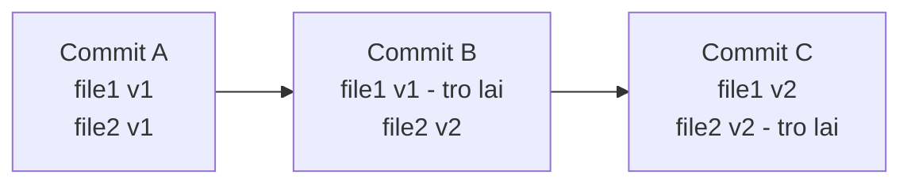
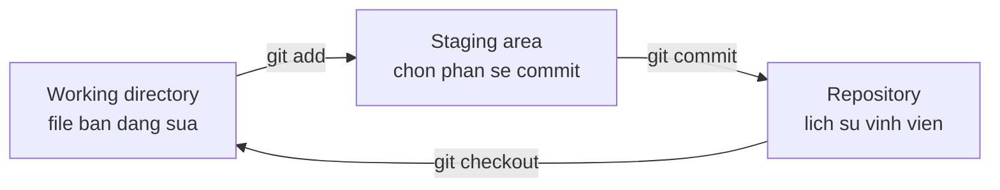

# 3.2 — 1. Git là gì và tại sao cần

> Nguồn: https://tiennhm.io.vn/docs/dotnet-backend-zero-to-senior/stage-01-foundation/module-03-git-developer-workflow/3.2-git-intro-and-motivation
> Git lưu ảnh chụp chứ không lưu bản vá, và mọi commit đều bất biến. Hiểu ba vùng làm việc cùng đồ thị commit là hiểu vì sao hầu hết thao tác Git đều hoàn tác được.

> Git không phải "thư mục có nút undo". Nó là một **đồ thị các ảnh chụp bất biến**: mỗi commit chụp lại toàn bộ cây thư mục tại một thời điểm, được định danh bằng mã băm SHA-1 của chính nội dung đó, và **không bao giờ thay đổi**. Hai điều quan trọng suy ra từ đây. Thứ nhất, những lệnh trông như "sửa lịch sử" — `commit --amend`, `rebase` — thực ra **tạo commit mới** chứ không sửa cái cũ. Thứ hai, vì commit cũ vẫn còn nằm đó, gần như **mọi sai lầm trong Git đều hoàn tác được** bằng `git reflog`, kể cả khi bạn nghĩ đã mất sạch.

## Mục tiêu bài học

Sau bài này bạn có thể:

- Giải thích vì sao Git lưu ảnh chụp chứ không lưu bản vá, và điều đó thay đổi gì.
- Kể tên ba vùng làm việc và cho biết một thay đổi đang ở vùng nào.
- Mô tả commit là gì về mặt dữ liệu, và vì sao nó bất biến.
- Dùng `git reflog` để lấy lại công việc tưởng đã mất.
- Phân biệt Git với GitHub.

## Nội dung bài học

### 3.2.1 — Vấn đề Git giải quyết

Trước khi có hệ thống quản lý phiên bản, người ta làm thế này:

```
bao-cao.docx
bao-cao-v2.docx
bao-cao-v2-final.docx
bao-cao-v2-final-THAT-SU-CUOI.docx
bao-cao-v2-final-sua-theo-sep.docx
```

Bốn vấn đề không giải quyết được bằng cách đặt tên file:

1. **Không biết cái gì đã đổi** giữa hai phiên bản, và **vì sao**.
2. **Hai người sửa cùng lúc** thì một người mất việc.
3. **Không quay lại được** một trạng thái cụ thể trong quá khứ.
4. **Không thử nghiệm an toàn** — muốn thử một hướng mới phải chép cả thư mục.

Git giải quyết cả bốn, và làm điều đó bằng một mô hình dữ liệu đơn giản đến bất ngờ.

### 3.2.2 — Git lưu ảnh chụp, không lưu bản vá

Nhiều hệ thống cũ (SVN, CVS) lưu **những gì đã thay đổi** giữa các phiên bản. Git làm khác:

> Mỗi commit là một **ảnh chụp toàn bộ cây thư mục** tại thời điểm đó.

Nghe có vẻ tốn chỗ, nhưng không: file nào không đổi thì commit mới chỉ **trỏ tới đúng đối tượng cũ**, không nhân bản.



Hệ quả thực tế: **chuyển sang một commit bất kỳ đều nhanh như nhau**, vì Git chỉ việc lấy ảnh chụp đó ra, không phải dựng lại từ chuỗi bản vá.

### 3.2.3 — Một commit chứa gì

Một commit là một đối tượng nhỏ gồm năm phần:

```
tree      → ảnh chụp cây thư mục
parent    → commit (hoặc các commit) ngay trước nó
author    → ai viết, lúc nào
committer → ai đưa vào lịch sử, lúc nào
message   → mô tả
```

Toàn bộ khối đó được băm bằng SHA-1 ra một mã 40 ký tự — chính là "mã commit" bạn hay thấy.

Điểm then chốt: **mã băm được tính từ nội dung**. Đổi một dấu phẩy trong message, hay đổi commit cha, là ra một mã hoàn toàn khác. Nói cách khác:

> Commit là **bất biến**. Không ai sửa được một commit. Chỉ tạo được commit mới.

Đây là lý do `git commit --amend` và `git rebase` **không** sửa lịch sử — chúng tạo commit mới rồi trỏ nhánh sang đó. Commit cũ vẫn nằm trong kho, chỉ là không còn ai trỏ tới.

Và đó cũng là lý do bài sau nói rằng gần như mọi sai lầm đều cứu được.

### 3.2.4 — Ba vùng làm việc



| Vùng | Là gì | Lệnh đưa vào |
|---|---|---|
| Working directory | Thư mục thật trên đĩa | — |
| Staging area (index) | Bản nháp của commit tiếp theo | `git add` |
| Repository | Lịch sử đã ghi | `git commit` |

**Staging area là thứ khiến Git khác các công cụ khác.** Nó cho phép bạn commit *một phần* những gì đã sửa:

```bash
# Sửa 5 file, nhưng chỉ commit 2 file liên quan tới một việc
git add src/OrderService.cs src/OrderValidator.cs
git commit -m "fix: chặn đơn hàng có tổng tiền âm"

# 3 file còn lại vẫn nằm trong working directory
```

Nhờ vậy mỗi commit kể đúng **một** câu chuyện, thay vì gộp ba việc không liên quan.

Xem trạng thái từng vùng:

```bash
git status              # tổng quan cả ba vùng
git diff                # working directory so với staging
git diff --staged       # staging so với commit cuối
```

### 3.2.5 — Phân tán: mỗi máy có toàn bộ lịch sử

Git là hệ thống **phân tán**. Khi bạn `clone`, bạn không lấy về bản sao làm việc — bạn lấy về **toàn bộ kho**, đủ mọi commit từ đầu.

Ba hệ quả:

1. **Phần lớn thao tác chạy ngoại tuyến.** `log`, `diff`, `commit`, `branch`, chuyển nhánh — không cần mạng.
2. **Chúng cũng nhanh**, vì không có vòng đi mạng nào.
3. **Mỗi bản clone là một bản sao lưu.** Máy chủ trung tâm cháy thì lịch sử vẫn còn trên mọi máy lập trình viên.

### 3.2.6 — Git không phải GitHub

| Git | GitHub |
|---|---|
| Công cụ chạy trên máy bạn | Dịch vụ lưu kho trên mạng |
| Nguồn mở, miễn phí | Sản phẩm thương mại của Microsoft |
| Chạy được mà không cần Internet | Cần Internet |
| Không có pull request | Pull request, issue, Actions |

**Pull request không phải khái niệm của Git.** Nó là tính năng do GitHub tạo ra, sau đó GitLab, Bitbucket làm theo với tên khác (merge request). Git chỉ biết `merge` và `push`.

Biết ranh giới này giúp bạn không bối rối khi chuyển sang GitLab hay Azure DevOps: phần Git giữ nguyên, chỉ lớp bên ngoài đổi.

### 3.2.7 — Rà lại hiểu biết của bạn

**Danh sách kiểm tra khái niệm Git**

- [ ] Nói được một thay đổi đang nằm ở vùng nào trong ba vùng.
- [ ] Giải thích được vì sao commit không sửa được, chỉ tạo mới.
- [ ] Biết git status, git diff và git diff --staged xem gì khác nhau.
- [ ] Hiểu vì sao clone là lấy về toàn bộ lịch sử, không phải một phiên bản.
- [ ] Phân biệt được tính năng nào thuộc Git, tính năng nào thuộc GitHub.

## Bài tập áp dụng

1. **Nhìn vào bên trong một commit.** Chạy `git cat-file -p HEAD` trong một kho bất kỳ. Đọc năm phần của commit. Sau đó `git cat-file -p <mã tree>` để xem cây thư mục.

2. **Chứng minh commit bất biến.** Ghi lại `git rev-parse HEAD`. Chạy `git commit --amend -m "message khác"`. Ghi lại mã mới. So sánh hai mã và giải thích vì sao chúng khác nhau. Sau đó dùng `git reflog` tìm lại commit cũ.

3. **Dùng staging area cho đúng.** Sửa ba file thuộc hai việc khác nhau. Dùng `git add` để tạo hai commit riêng, mỗi commit chỉ chứa phần thuộc về một việc. Kiểm tra bằng `git show --stat`.

## Tự kiểm tra

### Git lưu ảnh chụp hay lưu bản vá?

Lưu ảnh chụp toàn bộ cây thư mục ở mỗi commit. Nghe tốn chỗ nhưng không, vì file nào không đổi thì commit mới chỉ trỏ tới đúng đối tượng cũ chứ không nhân bản. Nhờ đó chuyển sang một commit bất kỳ đều nhanh như nhau, không phải dựng lại từ chuỗi bản vá như các hệ thống cũ.

### Vì sao nói commit là bất biến?

Vì mã định danh của commit là mã băm SHA-1 tính từ chính nội dung của nó: cây thư mục, commit cha, tác giả, thời gian và message. Đổi bất cứ thứ gì trong đó là ra một mã hoàn toàn khác, tức là một commit khác. Nên không ai sửa được commit, chỉ tạo được commit mới.

### Vậy git commit --amend và git rebase làm gì?

Chúng tạo commit mới rồi trỏ nhánh sang đó, chứ không sửa commit cũ. Commit cũ vẫn nằm trong kho, chỉ là không còn nhánh nào trỏ tới nữa. Đó là lý do gần như mọi sai lầm trong Git đều lấy lại được bằng git reflog.

### Staging area dùng để làm gì?

Để chọn chính xác phần nào trong những gì đã sửa sẽ đi vào commit tiếp theo. Nhờ đó bạn sửa năm file rồi vẫn tạo được một commit chỉ gồm hai file liên quan tới một việc. Mỗi commit kể đúng một câu chuyện thay vì gộp nhiều việc không liên quan.

### Phân tán nghĩa là gì và lợi ích ra sao?

Nghĩa là khi clone, bạn lấy về toàn bộ kho với đủ mọi commit từ đầu, chứ không phải một phiên bản làm việc. Ba lợi ích: phần lớn thao tác chạy được khi không có mạng, chúng nhanh vì không có vòng đi mạng, và mỗi bản clone là một bản sao lưu đầy đủ.

### Git và GitHub khác nhau ở đâu?

Git là công cụ nguồn mở chạy trên máy bạn, quản lý phiên bản, không cần Internet. GitHub là dịch vụ thương mại lưu kho Git trên mạng và thêm các tính năng cộng tác. Pull request không phải khái niệm của Git mà là tính năng GitHub tạo ra; bản thân Git chỉ biết merge và push.

## Kết luận

Ba điều đáng nhớ nhất:

1. **Commit là ảnh chụp bất biến, không phải bản vá.** Hiểu điều này là hiểu vì sao Git hành xử như nó hành xử.
2. **Không lệnh nào sửa được commit cũ.** Chúng chỉ tạo commit mới — nên hầu hết sai lầm đều cứu được.
3. **Staging area là nơi bạn biên tập câu chuyện.** Dùng nó để mỗi commit chỉ nói một việc.

## Tham khảo

- [Pro Git book](https://git-scm.com/book/en/v2) — sách chính thức, miễn phí, đọc chương 1–3 trước
- [git-config](https://git-scm.com/docs/git-config) — mọi tuỳ chọn cấu hình
- [git-reflog](https://git-scm.com/docs/git-reflog) — nhật ký mọi lần `HEAD` di chuyển
- [GitHub Pull requests](https://docs.github.com/en/pull-requests) — phần thuộc về GitHub

## Điều hướng

- **Bài trước:** [3.1 — Module Orientation](3.1-module-orientation.mdx)
- **Bài tiếp theo:** [3.3 — 2. Cài đặt và cấu hình Git](3.3-git-install-config.mdx)
- **Về module:** [Trang mục lục](./)
