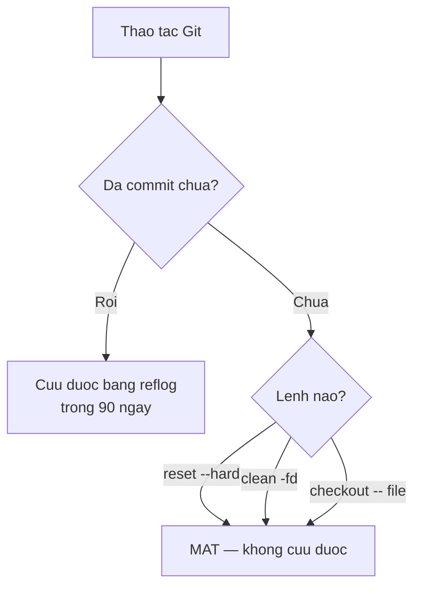

# 3.4 — Checklist an toàn khi làm Git

> Nguồn: https://tiennhm.io.vn/docs/dotnet-backend-zero-to-senior/stage-01-foundation/module-03-git-developer-workflow/3.4-git-safety-checklist
> Gần như mọi sai lầm trong Git đều cứu được bằng reflog. Bài này liệt kê chính xác ba thứ KHÔNG cứu được, và công thức khôi phục cho từng tình huống hay gặp.

> Vì commit là bất biến, **gần như mọi sai lầm trong Git đều hoàn tác được** — `git reflog` ghi lại mọi lần `HEAD` di chuyển và giữ trong 90 ngày, kể cả những commit không còn nhánh nào trỏ tới. Điều đáng học không phải là "cẩn thận", mà là biết **chính xác ba thứ không cứu được**: thay đổi chưa commit bị `reset --hard` xoá, file chưa theo dõi bị `clean -fd` xoá, và lịch sử chung bị `push --force` ghi đè trên máy người khác. Mọi thứ khác đều có công thức khôi phục, và bài này liệt kê chúng.

## Mục tiêu bài học

Sau bài này bạn có thể:

- Dùng `git reflog` để tìm lại commit sau một thao tác sai.
- Nêu ba trường hợp thực sự mất dữ liệu và cách phòng.
- Chọn `--force-with-lease` thay cho `--force` và giải thích khác biệt.
- Khôi phục đúng cho bốn tình huống hay gặp nhất.
- Dùng `stash` và `worktree` để chuyển việc mà không mất thao tác dở.

## Nội dung bài học

### 3.4.1 — Lưới an toàn: `git reflog`

```bash
git reflog
# a1b2c3d HEAD@{0}: reset: moving to HEAD~3
# 9f8e7d6 HEAD@{1}: commit: feat: them bao cao doanh thu   ← tưởng đã mất
# 5c4b3a2 HEAD@{2}: commit: fix: sua loi lam tron
```

`reflog` ghi lại **mọi lần `HEAD` di chuyển** trên máy bạn: commit, checkout, reset, rebase, merge. Mặc định giữ **90 ngày**.

Quay về bất kỳ điểm nào trong đó:

```bash
git reset --hard 9f8e7d6        # về đúng trạng thái commit đó
# hoặc an toàn hơn:
git branch cuu-ho 9f8e7d6       # tạo nhánh mới trỏ vào, không đụng nhánh hiện tại
```

Cách thứ hai nên là phản xạ: **tạo nhánh trước, xem xét sau**. Nó không phá gì cả.

Lưu ý quan trọng: `reflog` là **cục bộ**. Nó không được đẩy lên, và không cứu được thứ bạn chưa bao giờ commit.

### 3.4.2 — Ba thứ thật sự không cứu được



**1. Thay đổi chưa commit bị `git reset --hard` xoá.**

```bash
git reset --hard HEAD     # mọi sửa đổi chưa commit biến mất, không hỏi lại
```

Không có bản sao nào. `reflog` không giúp được vì chưa từng có commit nào.

**2. File chưa theo dõi bị `git clean -fd` xoá.**

```bash
git clean -fd             # xoá mọi file và thư mục Git chưa theo dõi
```

Git chưa bao giờ biết những file đó tồn tại. Luôn chạy thử trước:

```bash
git clean -nd             # -n = chỉ LIỆT KÊ, không xoá
```

**3. Lịch sử chung bị `push --force` ghi đè.**

Commit của **bạn** vẫn còn trong `reflog` của bạn. Nhưng nếu đồng nghiệp đã `pull` phiên bản cũ và đang làm việc trên đó, một cú force push đặt họ vào trạng thái phân kỳ rất khó gỡ.

### 3.4.3 — `--force-with-lease` thay cho `--force`

```bash
git push --force              # NGUY HIỂM: đè lên mọi thứ trên remote
git push --force-with-lease   # AN TOÀN: từ chối nếu remote đã có commit mới
```

`--force-with-lease` kiểm tra rằng remote vẫn đang ở đúng chỗ mà bạn nghĩ. Nếu ai đó vừa push thêm gì đó, lệnh **thất bại** thay vì xoá công sức của họ.

Không có lý do nào để dùng `--force` khi đã có `--force-with-lease`. Hãy đặt nó thành thói quen — hoặc thành alias:

```bash
git config --global alias.pushf "push --force-with-lease"
```

### 3.4.4 — Bốn công thức khôi phục

**Lỡ commit vào sai nhánh**

```bash
# Đang ở main, lẽ ra phải ở feature/abc
git branch feature/abc        # tạo nhánh giữ commit lại
git reset --hard HEAD~1       # đưa main về trạng thái trước commit
git checkout feature/abc      # sang nhánh đúng, commit vẫn còn
```

**Lỡ `reset --hard` và mất commit**

```bash
git reflog                    # tìm mã commit trước khi reset
git reset --hard <mã đó>
```

**Lỡ xoá nhánh chưa merge**

```bash
git reflog                    # tìm commit cuối của nhánh đã xoá
git branch <tên-nhánh> <mã>
```

**Rebase hỏng giữa chừng**

```bash
git rebase --abort            # quay về trạng thái trước khi rebase
# hoặc, nếu đã xong mà kết quả sai:
git reflog                    # tìm ORIG_HEAD hoặc commit trước rebase
git reset --hard <mã đó>
```

### 3.4.5 — Cất việc dở: `stash` và `worktree`

Tình huống quen thuộc: đang làm dở một tính năng thì có lỗi khẩn cấp cần sửa ngay.

```bash
# Cách 1 — stash: cất tạm thay đổi
git stash push -m "dang lam bao cao"
git checkout -b hotfix/loi-khan-cap
# ... sửa, commit, push ...
git checkout feature/bao-cao
git stash pop                 # lấy lại thay đổi
```

Ba điều cần biết về `stash`:

- `git stash list` xem những gì đang cất.
- `pop` lấy ra và **xoá** khỏi danh sách; `apply` lấy ra mà **giữ lại**.
- Mặc định `stash` **không** cất file chưa theo dõi. Thêm `-u` để cất cả chúng — đây là chỗ hay làm người ta mất file.

```bash
# Cách 2 — worktree: hai thư mục, hai nhánh, cùng một kho
git worktree add ../hotfix hotfix/loi-khan-cap
cd ../hotfix                  # thư mục riêng, nhánh riêng
# ... sửa xong ...
cd -
git worktree remove ../hotfix
```

`worktree` tốt hơn `stash` khi việc khẩn cấp mất nhiều thời gian: bạn không phải đụng gì tới thư mục đang làm dở, và cả hai vẫn dùng chung một kho nên không tốn thêm dung lượng đáng kể.

### 3.4.6 — Lệnh nguy hiểm, xếp theo mức độ

| Lệnh | Rủi ro | Trước khi chạy |
|---|---|---|
| `git clean -fd` | **Mất vĩnh viễn** file chưa theo dõi | Chạy `git clean -nd` xem trước |
| `git reset --hard` | **Mất vĩnh viễn** thay đổi chưa commit | `git stash` trước |
| `git checkout -- ` | **Mất vĩnh viễn** sửa đổi trong file đó | Xem `git diff` trước |
| `git push --force` | Đè lịch sử người khác | Dùng `--force-with-lease` |
| `git rebase` trên nhánh chung | Mọi người phân kỳ | Chỉ rebase nhánh riêng của bạn |
| `git filter-repo` | Viết lại toàn bộ lịch sử | Sao lưu kho trước |

Quy tắc bao trùm: **ba lệnh đầu là ba lệnh duy nhất phá được dữ liệu chưa commit.** Nhớ ba cái tên đó là đủ để cẩn thận đúng chỗ.

### 3.4.7 — Danh sách an toàn

**Thói quen an toàn với Git**

- [ ] Commit sớm và thường xuyên — commit là thứ duy nhất reflog cứu được.
- [ ] Chạy git status trước mọi lệnh có chữ reset, clean hay checkout.
- [ ] Luôn dùng git clean -nd trước khi dùng git clean -fd.
- [ ] Luôn dùng --force-with-lease thay cho --force.
- [ ] Chỉ rebase nhánh chưa ai khác dùng.
- [ ] Khi hoảng, tạo nhánh cứu hộ trước rồi mới xử lý tiếp.
- [ ] Dùng git stash -u khi cần cất cả file chưa theo dõi.
- [ ] Trước thao tác lớn, tạo một nhánh đánh dấu điểm quay về.

## Bài tập áp dụng

1. **Tự làm mất rồi tự cứu.** Trên một kho thử: tạo ba commit, chạy `git reset --hard HEAD~3`, rồi dùng `reflog` khôi phục đủ cả ba. Ghi lại từng lệnh đã dùng.

2. **Chứng minh giới hạn của reflog.** Sửa một file nhưng **không** commit, chạy `git reset --hard`. Thử tìm lại thay đổi đó bằng `reflog`. Giải thích vì sao không tìm được.

3. **So sánh hai kiểu force.** Trên một kho thử có hai bản clone: từ clone A push một commit, rồi từ clone B thử `push --force` và `push --force-with-lease`. Ghi lại thông báo khác nhau.

## Tự kiểm tra

### git reflog cứu được những gì?

Nó ghi lại mọi lần HEAD di chuyển trên máy bạn — commit, checkout, reset, rebase, merge — và giữ trong 90 ngày. Nhờ đó tìm lại được commit sau khi reset nhầm, khôi phục nhánh đã xoá, hoặc quay về trước một lần rebase hỏng. Nhưng nó là dữ liệu cục bộ, không được đẩy lên, và chỉ cứu được thứ đã từng là commit.

### Ba thứ nào thật sự không cứu được trong Git?

Thay đổi chưa commit bị git reset --hard xoá; file chưa được theo dõi bị git clean -fd xoá; và lịch sử chung bị push --force ghi đè trên máy người khác. Hai cái đầu mất vĩnh viễn vì Git chưa bao giờ lưu chúng. Cái thứ ba thì commit của bạn vẫn còn trong reflog, nhưng đồng nghiệp đã pull bản cũ sẽ rơi vào trạng thái phân kỳ khó gỡ.

### --force-with-lease khác --force ở đâu?

--force đè lên remote bất kể có gì ở đó. --force-with-lease kiểm tra remote vẫn đang ở đúng vị trí bạn nghĩ; nếu ai đó vừa push thêm commit thì lệnh thất bại thay vì xoá công sức của họ. Không có lý do nào để dùng --force khi đã có --force-with-lease.

### Lỡ commit vào sai nhánh thì xử lý thế nào?

Tạo nhánh đúng ngay tại vị trí hiện tại để giữ commit lại, rồi đưa nhánh sai về trạng thái trước commit bằng reset, sau đó chuyển sang nhánh đúng. Ba lệnh: git branch tên-đúng, git reset --hard HEAD~1, git checkout tên-đúng.

### stash và worktree nên dùng cái nào?

Dùng stash khi việc xen ngang ngắn, vài phút là xong. Dùng worktree khi việc khẩn cấp mất nhiều thời gian, vì nó cho bạn một thư mục riêng với nhánh riêng mà không phải đụng gì tới thư mục đang làm dở. Cả hai dùng chung một kho nên worktree không tốn thêm dung lượng đáng kể.

### Vì sao git stash hay làm người ta mất file?

Vì mặc định stash không cất file chưa được Git theo dõi. Người dùng tưởng đã cất hết rồi chuyển nhánh, và những file mới tạo vẫn nằm nguyên ở thư mục làm việc, dễ bị ghi đè hoặc bị clean xoá. Phải thêm tuỳ chọn -u để cất cả file chưa theo dõi.

## Kết luận

Ba điều đáng nhớ nhất:

1. **Commit sớm là hình thức bảo hiểm rẻ nhất.** `reflog` chỉ cứu được thứ đã từng là commit.
2. **Chỉ ba lệnh phá được dữ liệu chưa commit:** `reset --hard`, `clean -fd`, `checkout -- `.
3. **Khi hoảng, tạo nhánh trước.** `git branch cuu-ho <mã>` không phá gì và cho bạn thời gian suy nghĩ.

## Tham khảo

- [git-reflog](https://git-scm.com/docs/git-reflog) — lưới an toàn chính
- [Pro Git — Git Tools, Reset Demystified](https://git-scm.com/book/en/v2) — giải thích `reset` ở ba mức
- [git-rebase](https://git-scm.com/docs/git-rebase) — kèm `--abort` và `--continue`
- [git-merge](https://git-scm.com/docs/git-merge)

## Điều hướng

- **Bài trước:** [3.3 — 2. Cài đặt và cấu hình Git](3.3-git-install-config.mdx)
- **Bài tiếp theo:** [3.5 — 3. Workflow cơ bản](3.5-workflow-co-ban.mdx)
- **Về module:** [Trang mục lục](./)
