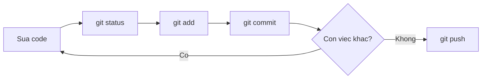

# 3.5 — 3. Workflow cơ bản

> Nguồn: https://tiennhm.io.vn/docs/dotnet-backend-zero-to-senior/stage-01-foundation/module-03-git-developer-workflow/3.5-workflow-co-ban
> Vòng lặp add, commit, push hằng ngày. Kèm cách chia commit sao cho mỗi cái kể một việc, viết message để sáu tháng sau còn hiểu, và ba lệnh xem lịch sử đáng thuộc.

> Vòng lặp hằng ngày chỉ có bốn lệnh: `status`, `add`, `commit`, `push`. Phần khó không nằm ở cú pháp mà ở **chia commit cho đúng**. Một commit tốt là commit **hoàn tác được độc lập** — nghĩa là nếu `git revert` nó, hệ thống vẫn chạy và chỉ mất đúng một tính năng. Từ tiêu chí đó suy ra mọi quy tắc khác: đừng gộp việc không liên quan, đừng để commit nào làm build hỏng, và message phải trả lời câu hỏi **vì sao** chứ không phải *cái gì* — vì *cái gì* thì `git diff` đã nói rồi.

## Mục tiêu bài học

Sau bài này bạn có thể:

- Chạy trôi chảy vòng lặp `status` → `add` → `commit` → `push`.
- Áp dụng tiêu chí "hoàn tác được độc lập" để quyết định chia commit.
- Viết commit message trả lời được câu hỏi *vì sao*.
- Dùng `git add -p` để tách một thay đổi lớn thành nhiều commit.
- Đọc lịch sử bằng `log`, `show` và `blame`.

## Nội dung bài học

### 3.5.1 — Vòng lặp hằng ngày



```bash
git status                       # đang có gì thay đổi?
git diff                         # cụ thể đổi những dòng nào?
git add src/OrderService.cs      # chọn phần sẽ commit
git diff --staged                # kiểm tra lại đúng thứ mình định commit
git commit -m "fix: chan don hang co tong tien am"
git push
```

Dòng `git diff --staged` là thói quen đáng tập nhất trong nhóm này. Nó là lần kiểm tra cuối trước khi thứ gì đó đi vào lịch sử vĩnh viễn — và nó bắt được rất nhiều `Console.WriteLine` bỏ quên.

### 3.5.2 — Chia commit: tiêu chí duy nhất cần nhớ

Câu hỏi "commit bao nhiêu là vừa" có một câu trả lời dùng được:

> Một commit tốt là commit mà bạn **hoàn tác riêng nó được** mà hệ thống vẫn chạy.

Thử tưởng tượng sáu tháng sau có người phát hiện tính năng X gây lỗi. Họ chạy `git revert `. Nếu lệnh đó gỡ đúng tính năng X và không kéo theo gì khác, commit của bạn đã chia đúng.

```bash
# XẤU — ba việc không liên quan trong một commit
git add .
git commit -m "update"
# Muốn gỡ mỗi phần đổi tên biến? Không tách ra được.

# TỐT — ba commit, mỗi cái hoàn tác riêng được
git add src/OrderValidator.cs
git commit -m "fix: chan don hang co tong tien am"

git add src/ReportService.cs
git commit -m "feat: them bao cao doanh thu theo chi nhanh"

git add src/Utils.cs
git commit -m "refactor: doi ten bien cho ro nghia"
```

Hai quy tắc phụ đi kèm:

- **Mỗi commit phải build được.** Lịch sử có commit làm hỏng build thì `git bisect` không dùng được, mà đó lại là công cụ tìm lỗi mạnh nhất.
- **Đừng trộn đổi format với đổi logic.** Một commit chỉ chạy formatter, một commit khác đổi hành vi. Trộn lại thì phần diff logic chìm trong hàng trăm dòng đổi dấu cách.

### 3.5.3 — `git add -p`: tách ngay cả trong một file

Bạn sửa hai việc trong cùng một file. Vẫn tách được:

```bash
git add -p src/OrderService.cs
# Git hiện từng khối thay đổi và hỏi:
#   y = đưa khối này vào staging
#   n = bỏ qua khối này
#   s = chia khối này nhỏ hơn nữa
#   q = thoát
```

Đây là công cụ biến "tôi lỡ sửa lẫn lộn hết rồi" thành một lịch sử sạch. Rất đáng tập.

### 3.5.4 — Commit message: trả lời *vì sao*

Phần *cái gì* đã nằm trong `git diff`. Message nên dùng chỗ của nó cho thứ diff không nói được.

```
❌ "fix bug"
❌ "update code"
❌ "sua theo yeu cau cua sep"

✅ "fix: chan don hang co tong tien am

Khach hang nhap so luong am o form dat hang lam tong tien ra so am,
va he thong van tao don. Them kiem tra o tang domain thay vi o
controller, vi con co luong tao don tu API va tu job nhap lieu."
```

Cấu trúc một message đầy đủ:

```
<loại>: <tóm tắt, dưới 72 ký tự, thể mệnh lệnh>
<dòng trống>
<vì sao cần thay đổi này, bối cảnh, đánh đổi đã cân nhắc>
<dòng trống>
<tham chiếu issue nếu có>
```

Dùng **thể mệnh lệnh** cho dòng tóm tắt — "them", "sua", "xoa", không phải "da them". Lý do: chính Git cũng viết vậy khi tự sinh message (`Merge branch...`, `Revert...`), nên đọc lên nhất quán.

Quy ước đặt tên loại (`feat`, `fix`, `refactor`...) là chủ đề của [bài 3.11 Conventional Commits](3.11-conventional-commits.mdx).

### 3.5.5 — Đọc lịch sử

```bash
# Gọn, mỗi commit một dòng, kèm đồ thị nhánh
git log --oneline --graph --decorate -20

# Lịch sử của một file
git log --follow -p src/OrderService.cs

# Xem một commit cụ thể
git show a1b2c3d

# Ai sửa dòng này, ở commit nào
git blame src/OrderService.cs

# Tìm commit nào từng nhắc tới một chuỗi
git log -S "CalculateDiscount" --oneline
```

`git log -S` ít người biết nhưng rất mạnh: nó tìm những commit làm **thay đổi số lần xuất hiện** của một chuỗi — tức là commit thêm vào hoặc xoá đi. Đây là cách nhanh nhất để trả lời "đoạn code này ra đời từ đâu".

`git blame` không phải để đổ lỗi. Nó để tìm **commit** chứa dòng đó, từ đó đọc message và hiểu bối cảnh. Đây chính là lúc bạn cảm ơn người đã viết message tử tế.

### 3.5.6 — Sửa commit chưa đẩy lên

```bash
# Quên một file, hoặc muốn sửa message của commit VỪA tạo
git add file-quen.cs
git commit --amend --no-edit        # giữ nguyên message
git commit --amend -m "message mới" # đổi message

# Bỏ commit cuối nhưng GIỮ thay đổi trong staging
git reset --soft HEAD~1

# Bỏ commit cuối, giữ thay đổi ở working directory
git reset HEAD~1
```

Quy tắc an toàn: **chỉ amend và reset commit chưa push**. Sau khi đẩy lên, hãy dùng `git revert` — nó tạo một commit mới đảo ngược, không viết lại lịch sử.

```bash
git revert a1b2c3d     # an toàn trên nhánh chung
```

### 3.5.7 — Rà lại thói quen của bạn

**Danh sách rà soát workflow**

- [ ] Luôn chạy git diff --staged trước khi commit.
- [ ] Mỗi commit hoàn tác riêng được mà hệ thống vẫn chạy.
- [ ] Mỗi commit đều build được — không có commit nào làm hỏng build.
- [ ] Không trộn đổi format với đổi logic trong cùng một commit.
- [ ] Message trả lời được vì sao, không chỉ nói cái gì.
- [ ] Dòng tóm tắt dùng thể mệnh lệnh và dưới 72 ký tự.
- [ ] Chỉ amend và reset những commit chưa push; đã push thì dùng revert.
- [ ] Không dùng git add . mà không xem git status trước.

## Bài tập áp dụng

#### Bài 1 — Tách bằng `git add -p`

Sửa **hai việc không liên quan trong cùng một file**. Dùng `git add -p` tách thành hai commit. Kiểm tra bằng `git show --stat` rằng mỗi commit chỉ chứa phần của nó.

**Tiêu chí hoàn thành:** hai commit tách bạch, và sau commit thứ nhất `git diff` vẫn còn hiện phần việc thứ hai.

Gợi ý và lời giải — Bài 1

**Gợi ý.** `git add -p` đi qua **từng đoạn thay đổi** (hunk) và hỏi bạn có đưa nó vào staging không. Nếu hai việc nằm quá gần nhau và Git gộp thành một đoạn, hãy nhấn `s` để chia nhỏ, hoặc `e` để chọn tay từng dòng.

**Lời giải.**

```csharp
// CustomerService.cs — hai việc lẫn trong một file
public class CustomerService
{
    public async Task<Customer?> GetAsync(int id, CancellationToken ct)
    {
        _logger.LogInformation("Đang lấy khách hàng {Id}", id);   // việc A: thêm log
        return await _repo.FindAsync(id, ct);
    }

    public async Task<decimal> TinhDoanhThuAsync(int id, CancellationToken ct)
    {
        var orders = await _repo.GetOrdersAsync(id, ct);
        return orders.Where(o => !o.IsCancelled).Sum(o => o.Total);  // việc B: sửa lỗi bỏ sót đơn huỷ
    }
}
```

```bash
git add -p CustomerService.cs
```

Git hiện đoạn thứ nhất (thêm dòng log):

```text
@@ -8,6 +8,7 @@ public class CustomerService
     public async Task<Customer?> GetAsync(int id, CancellationToken ct)
     {
+        _logger.LogInformation("Đang lấy khách hàng {Id}", id);
         return await _repo.FindAsync(id, ct);
Stage this hunk [y,n,q,a,d,s,e,?]?
```

Nhấn `y`. Đoạn thứ hai hiện ra, nhấn `n`. Rồi:

```bash
git commit -m "chore: them log khi lay khach hang"
git diff                     # vẫn còn hiện việc B
git add CustomerService.cs
git commit -m "fix: bo qua don da huy khi tinh doanh thu"
```

Kiểm tra:

```bash
git show --stat HEAD~1   # 1 file, 1 dòng thêm
git show --stat HEAD     # 1 file, 1 dòng sửa
```

**Bảng phím của `add -p`:**

| Phím | Nghĩa |
|---|---|
| `y` | Đưa đoạn này vào staging |
| `n` | Bỏ qua |
| `s` | **Chia đoạn này thành các đoạn nhỏ hơn** |
| `e` | Sửa tay chính xác dòng nào được đưa vào |
| `d` | Bỏ qua đoạn này và mọi đoạn còn lại trong file |
| `?` | Xem trợ giúp |

Phím `s` là phím dùng nhiều nhất. Git gộp các dòng gần nhau thành một đoạn, nên hai việc cách nhau ba dòng thường nằm chung một đoạn; `s` tách chúng ra.

**Về phím `e`.** Nó mở trình soạn thảo với nội dung đoạn. Quy tắc: xoá dòng bắt đầu bằng `+` để **không** đưa dòng đó vào; đổi dòng bắt đầu bằng `-` thành dấu cách để **giữ lại** dòng đó. Hơi khó nhớ lúc đầu nhưng là cách duy nhất để kiểm soát tới từng dòng.

**Một cách kiểm tra trước khi commit.** `git diff --cached` cho thấy **chính xác** những gì sắp được commit. Tập thói quen chạy nó trước mỗi lần commit, đặc biệt sau khi dùng `add -p`.

#### Bài 2 — Kiểm tra tiêu chí hoàn tác

Lấy năm commit gần nhất trong dự án của bạn. Với mỗi cái, trả lời: nếu `git revert` **riêng** nó, hệ thống còn chạy không? Đếm số commit không đạt.

**Tiêu chí hoàn thành:** bạn có con số cụ thể và chỉ ra được nguyên nhân chung của các commit không đạt.

Gợi ý và lời giải — Bài 2

**Gợi ý.** Đây là tiêu chí thực dụng nhất để đánh giá một commit có được chia đúng hay không. Nó không đòi hỏi bạn phải chạy thử — chỉ cần đọc `git show` và tự trả lời.

**Lời giải — cách kiểm tra:**

```bash
git log --oneline -5
git show --stat <mã băm>
```

**Bảng đánh giá mẫu:**

| Commit | `revert` riêng được? | Vì sao |
|---|---|---|
| `feat: them endpoint GET /customers` | Có | Tự chứa, gỡ đi thì chỉ mất endpoint đó |
| `refactor: doi ten bien` | Có | Không đổi hành vi |
| **`feat: them bang Customer + endpoint + UI`** | **Không** | Gỡ bảng thì endpoint tham chiếu bảng không tồn tại |
| **`fix: sua loi A va cap nhat thu vien B`** | **Không** | Gỡ bản sửa A thì cũng gỡ luôn nâng cấp thư viện |
| `docs: cap nhat README` | Có | Độc lập hoàn toàn |

**Nguyên nhân chung của các commit không đạt:** chúng gộp **nhiều thay đổi có quan hệ phụ thuộc hoặc không liên quan** vào một. Dấu hiệu nhận biết sớm là message có chữ **"và"**, hoặc có dấu phẩy nối hai mệnh đề.

**Vì sao tiêu chí này quan trọng hơn vẻ ngoài của nó.** Nó là phép thử cho **tính nguyên tử** của commit, và tính nguyên tử quyết định ba việc quan trọng:

1. **Xử lý sự cố.** Production hỏng lúc 2 giờ sáng. Cần gỡ đúng thay đổi gây lỗi. Commit nguyên tử thì `git revert <mã>` là xong trong một phút. Commit gộp thì phải ngồi tách tay, lúc đang mệt và đang gấp.
2. **`git bisect`.** Nó chỉ ra commit đầu tiên gây lỗi. Commit làm một việc thì bạn có ngay câu trả lời; commit làm sáu việc thì bạn mới chỉ thu hẹp được phạm vi.
3. **Chọn lọc đưa lên nhánh phát hành.** Muốn đưa riêng một bản sửa lỗi lên nhánh phát hành mà không kéo theo tính năng chưa xong — chỉ làm được nếu chúng nằm ở hai commit khác nhau.

**Trường hợp ngoại lệ chính đáng.** Một số thay đổi **buộc phải** đi cùng nhau để hệ thống còn chạy: thêm cột database cùng với code dùng cột đó. Tách ra thì trạng thái trung gian bị hỏng. Đúng lúc đó, gộp là lựa chọn đúng.

Nhưng có một mẫu tốt hơn cho tình huống này, gọi là **mở rộng rồi thu hẹp**:

```text
Commit 1: Thêm cột mới, cho phép null, chưa ai dùng     -> revert được
Commit 2: Ghi vào cả cột cũ lẫn cột mới                 -> revert được
Commit 3: Chuyển phần đọc sang cột mới                  -> revert được
Commit 4: Ngừng ghi vào cột cũ                          -> revert được
Commit 5: Xoá cột cũ                                    -> revert được
```

Mỗi bước giữ hệ thống ở trạng thái chạy được, nên mỗi bước đều gỡ lại được độc lập. Đây cũng là cách triển khai không gián đoạn mà [bài 12.9](../../stage-04-database-production/module-12-sql-deep-dive/12.9-database-migration-strategy.mdx) trình bày đầy đủ.

#### Bài 3 — Truy nguồn một dòng code

Chọn một dòng khó hiểu trong dự án. Dùng `git blame` tìm commit, đọc message. Message đó có giải thích được vì sao dòng ấy tồn tại không?

**Tiêu chí hoàn thành:** bạn đi tới được commit gốc **và** pull request tương ứng, rồi đánh giá xem chuỗi thông tin đó có đủ để hiểu lý do không.

Gợi ý và lời giải — Bài 3

**Gợi ý.** `git blame` cho biết commit **cuối cùng chạm vào** một dòng — không nhất thiết là commit **tạo ra** nó. Một lần định dạng lại code hay đổi tên biến sẽ ghi đè thông tin đó. Có cờ để bỏ qua các thay đổi chỉ về khoảng trắng.

**Lời giải.**

```bash
# Bỏ qua thay đổi khoảng trắng, theo dõi cả khi code bị di chuyển
git blame -w -C -L 42,45 CustomerService.cs
```

```text
a3f2b1c9 (Nguyen Van A 2025-03-14 10:22:31 +0700 42) if (order.Total > 50_000_000m)
a3f2b1c9 (Nguyen Van A 2025-03-14 10:22:31 +0700 43)     order.RequireManagerApproval = true;
```

Đọc commit và tìm pull request:

```bash
git show a3f2b1c9
git log --merges --ancestry-path a3f2b1c9..main | tail -3   # tìm merge commit chứa nó
```

Message merge thường có dạng `Merge pull request #142 from ...`, từ đó mở pull request để đọc phần thảo luận.

**Ba mức chất lượng của thông tin bạn tìm được:**

| Message tìm được | Đủ hiểu chưa |
|---|---|
| `update` hoặc `fix` | Không — hoàn toàn vô dụng |
| `fix: them nguong duyet don hang` | Một nửa — biết *cái gì*, không biết *vì sao* là 50 triệu |
| `fix: don tren 50 trieu phai co quan ly duyet` kèm mô tả PR dẫn tới quy định nội bộ | Đủ |

**Vì sao mức thứ ba đáng giá.** Sáu tháng sau, ai đó nhìn con số 50.000.000 và tự hỏi có nên sửa không. Với message mức một, họ có ba lựa chọn đều tệ: đoán, đi hỏi khắp nơi, hoặc để nguyên vì sợ. Với message mức ba, họ biết đó là quy định nghiệp vụ chứ không phải con số tuỳ tiện, và biết phải hỏi ai để đổi.

**Ba việc làm cho `blame` hữu ích hơn:**

1. **Định dạng lại code thành một commit riêng.** Rồi ghi mã băm của nó vào file `.git-blame-ignore-revs`:

   ```bash
   echo "a3f2b1c9..." >> .git-blame-ignore-revs
   git config blame.ignoreRevsFile .git-blame-ignore-revs
   ```

   GitHub tự đọc file này, nên giao diện blame cũng bỏ qua các commit đó.

2. **Viết message trả lời "vì sao", không phải "cái gì".** Phần "cái gì" đã nằm trong diff rồi. So sánh: `fix: doi 30 thanh 50` với `fix: nang nguong duyet don len 50 trieu theo quy dinh tai chinh thang 3/2025`.

3. **Dẫn chiếu tới nguồn quyết định.** Mã issue, đường dẫn tài liệu, hay tên cuộc họp. Một dòng `Refs: CRM-142` biến message thành điểm khởi đầu để tra tiếp.

**Dùng `git log -S` khi `blame` không đủ.** Khi dòng code đã bị di chuyển hoặc viết lại nhiều lần, tìm theo nội dung hiệu quả hơn:

```bash
git log -S "RequireManagerApproval" --oneline    # mọi commit thêm hoặc bớt chuỗi này
git log -p -S "50_000_000"                       # kèm luôn diff
```

Lệnh này tìm ra commit **đầu tiên** đưa khái niệm đó vào, thường là commit chứa lời giải thích thật.

## Tự kiểm tra

### Chia commit thế nào là đúng?

Tiêu chí dùng được: một commit tốt là commit mà bạn hoàn tác riêng nó được mà hệ thống vẫn chạy. Thử tưởng tượng sáu tháng sau có người git revert đúng commit đó — nếu nó gỡ đúng một tính năng và không kéo theo gì khác thì bạn đã chia đúng.

### Vì sao mỗi commit phải build được?

Vì nếu lịch sử có commit làm hỏng build thì git bisect không dùng được, mà đó lại là công cụ tìm lỗi mạnh nhất — nó chia đôi lịch sử để khoanh vùng commit gây lỗi. Một commit hỏng build nằm giữa dải tìm kiếm là đủ làm cả quy trình đó vô dụng.

### Commit message nên viết gì?

Trả lời vì sao, vì phần cái gì đã nằm trong git diff rồi. Bối cảnh, lý do chọn cách này, đánh đổi đã cân nhắc — đó là thứ diff không nói được và là thứ người đọc sáu tháng sau cần. Dòng tóm tắt viết ở thể mệnh lệnh, dưới 72 ký tự.

### git add -p dùng để làm gì?

Để chọn từng khối thay đổi trong một file thay vì cả file. Khi bạn lỡ sửa hai việc không liên quan trong cùng một file, add -p cho phép tách chúng thành hai commit riêng. Nó biến một thư mục làm việc lộn xộn thành một lịch sử sạch.

### Khi nào dùng amend, khi nào dùng revert?

Amend cho commit chưa push, vì nó tạo commit mới thay thế commit cũ và làm đổi mã băm. Sau khi đã push lên nhánh chung thì dùng revert, vì nó tạo một commit mới đảo ngược thay đổi mà không viết lại lịch sử, nên không ai bị phân kỳ.

### git log -S dùng khi nào?

Khi muốn biết một đoạn code ra đời từ đâu. Nó tìm những commit làm thay đổi số lần xuất hiện của một chuỗi, tức là commit thêm vào hoặc xoá đi chuỗi đó. Nhanh hơn nhiều so với đọc thủ công toàn bộ lịch sử của file.

## Kết luận

Ba điều đáng nhớ nhất:

1. **"Hoàn tác riêng được" là tiêu chí chia commit.** Mọi quy tắc khác đều suy ra từ đó.
2. **Message dùng để nói *vì sao*.** *Cái gì* thì `git diff` đã kể rồi.
3. **`git diff --staged` trước mỗi commit.** Thói quen rẻ nhất, bắt được nhiều lỗi nhất.

## Tham khảo

- [Pro Git — Git Basics](https://git-scm.com/book/en/v2) — chương 2, vòng lặp cơ bản
- [git-merge](https://git-scm.com/docs/git-merge)
- [Conventional Commits](https://www.conventionalcommits.org/en/v1.0.0/) — quy ước đặt tên loại commit
- [git-reflog](https://git-scm.com/docs/git-reflog) — khi amend hoặc reset nhầm

## Điều hướng

- **Bài trước:** [3.4 — Checklist an toàn khi làm Git](3.4-git-safety-checklist.mdx)
- **Bài tiếp theo:** [3.6 — 4. Branching và Merging](3.6-branching-and-merging.mdx)
- **Về module:** [Trang mục lục](./)
