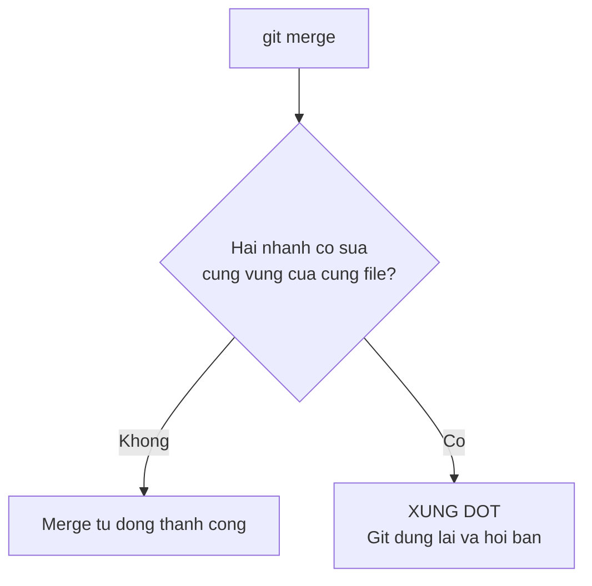

# 3.7 — 6. Git Conflicts

> Nguồn: https://tiennhm.io.vn/docs/dotnet-backend-zero-to-senior/stage-01-foundation/module-03-git-developer-workflow/3.7-git-conflicts
> Xung đột không phải lỗi — đó là Git từ chối đoán thay bạn. Kèm cách đọc dấu xung đột, ba công cụ giải, và loại xung đột nguy hiểm nhất: cái Git không phát hiện ra.

> Xung đột xảy ra khi hai nhánh sửa **cùng một vùng của cùng một file**, và Git **từ chối đoán** bên nào đúng. Đó là hành vi có chủ đích, không phải lỗi. Phần lớn xung đột giải trong vài phút một khi bạn đọc được ba dấu `<<<<<<<`, `=======`, `>>>>>>>`. Nhưng bài này dành phần quan trọng nhất cho loại xung đột **Git không phát hiện được**: hai người sửa hai file khác nhau, merge sạch sẽ không một cảnh báo, và hệ thống hỏng — vì một người đổi tên phương thức còn người kia vừa thêm chỗ gọi nó. Lưới an toàn duy nhất cho loại này là **CI chạy test sau mỗi lần merge**.

## Mục tiêu bài học

Sau bài này bạn có thể:

- Đọc và giải một xung đột văn bản thủ công.
- Chọn giữa `--ours`, `--theirs` và giải thủ công, và biết `ours` nghĩa là gì trong từng ngữ cảnh.
- Huỷ một lần merge hoặc rebase đang dở.
- Nhận ra xung đột ngữ nghĩa mà Git không báo.
- Giảm tần suất xung đột bằng thói quen làm việc.

## Nội dung bài học

### 3.8.1 — Vì sao Git từ chối đoán



Git hợp nhánh theo **từng khối dòng**. Nếu hai nhánh sửa hai vùng cách xa nhau trong cùng một file, nó gộp được. Chỉ khi hai bên đụng vào **cùng một vùng** thì nó mới dừng.

Nó dừng vì việc chọn bên nào là **quyết định nghiệp vụ**, không phải quyết định kỹ thuật. Một công cụ đoán bừa sẽ âm thầm xoá code của ai đó.

### 3.8.2 — Đọc dấu xung đột

```csharp
public decimal CalculateDiscount(Order order)
{
<<<<<<< HEAD
    // Phiên bản trên nhánh HIỆN TẠI (nhánh bạn đang đứng)
    return order.Total * 0.15m;
=======
    // Phiên bản từ nhánh ĐANG ĐƯỢC GỘP VÀO
    return order.Total >= 500_000m ? order.Total * 0.20m : 0m;
>>>>>>> feature/discount-tier
}
```

Ba dấu, ba vai trò:

- `<<<<<<< HEAD` — bắt đầu phiên bản của **nhánh hiện tại**
- `=======` — ranh giới
- `>>>>>>> <tên nhánh>` — kết thúc phiên bản của **nhánh đang gộp vào**

Bạn có bốn lựa chọn, và lựa chọn thứ tư mới là thường gặp nhất:

1. Giữ phiên bản trên
2. Giữ phiên bản dưới
3. Giữ cả hai
4. **Viết một phiên bản thứ ba** kết hợp ý của cả hai

Sau khi sửa, **xoá sạch ba dấu** rồi:

```bash
git add src/OrderService.cs
git commit                 # Git đã soạn sẵn message merge
```

### 3.8.3 — `--ours` và `--theirs`: cẩn thận với nghĩa

```bash
git checkout --ours   src/OrderService.cs    # lấy nguyên bản của nhánh hiện tại
git checkout --theirs src/OrderService.cs    # lấy nguyên bản của nhánh kia
git add src/OrderService.cs
```

Có một chỗ **rất dễ nhầm**: nghĩa của hai từ này **đảo ngược** giữa merge và rebase.

| | `--ours` | `--theirs` |
|---|---|---|
| Trong `merge` | Nhánh bạn đang đứng | Nhánh được gộp vào |
| Trong `rebase` | **Nhánh đích** (nhánh đang rebase lên) | **Nhánh của bạn** |

Lý do: khi rebase, Git lần lượt đặt commit của bạn lên trên nhánh đích, nên "phía hiện tại" lúc đó chính là nhánh đích. Nhiều người đã lấy nhầm bên vì quên điều này.

Mẹo an toàn: khi đang rebase, đừng dùng `--ours`/`--theirs` theo phản xạ. Mở file ra đọc.

### 3.8.4 — Huỷ khi cần

```bash
git merge --abort      # huỷ merge, về nguyên trạng trước khi merge
git rebase --abort     # huỷ rebase, về nguyên trạng trước khi rebase
```

Hai lệnh này là lối thoát an toàn. Khi một lần merge hoá ra phức tạp hơn dự kiến, `--abort` đưa mọi thứ về chính xác như cũ — rồi bạn chuẩn bị kỹ hơn và làm lại.

Với rebase nhiều commit, bạn giải xung đột **từng commit một**:

```bash
# sửa xong xung đột của commit hiện tại
git add <file>
git rebase --continue      # sang commit tiếp theo

git rebase --skip          # bỏ qua commit này (cẩn thận)
```

Đây chính là lý do rebase một nhánh dài có thể phải giải cùng một xung đột nhiều lần — mỗi commit đụng vào vùng đó là một lần.

### 3.8.5 — Xung đột ngữ nghĩa: loại Git không thấy

Đây là phần quan trọng nhất của bài.

```csharp
// Nhánh A — đổi tên phương thức
public decimal ComputeTotal(Order o) { ... }     // trước: CalculateTotal

// Nhánh B — file khác, thêm một chỗ gọi
var total = _service.CalculateTotal(order);      // tên cũ
```

Hai nhánh sửa **hai file khác nhau**. Git merge sạch sẽ, không một cảnh báo. Và code **không biên dịch được**.

Đây là **xung đột ngữ nghĩa**: văn bản không đụng nhau, nhưng ý nghĩa thì có. Git làm việc trên dòng chữ, nên nó không thể phát hiện.

Những dạng thường gặp:

| Nhánh A | Nhánh B | Hậu quả |
|---|---|---|
| Đổi tên phương thức | Thêm chỗ gọi tên cũ | Không biên dịch |
| Đổi kiểu trả về | Dùng kiểu cũ | Không biên dịch |
| Đổi ý nghĩa một trường | Viết code dựa trên ý nghĩa cũ | **Chạy được nhưng sai** |
| Thêm cột `NOT NULL` | Thêm chỗ `INSERT` không có cột đó | Hỏng lúc chạy |

Dòng thứ ba nguy hiểm nhất vì không có lỗi nào được ném ra.

**Lưới an toàn duy nhất: CI chạy build và test sau mỗi lần merge.** Không có cách nào khác — con người không đọc hết được mọi tương tác. Đây cũng là lý do mục "Require status checks to pass" trong [bài 3.7](3.6-github-and-pull-request.mdx) không phải thủ tục hình thức.

### 3.8.6 — Giảm xung đột bằng thói quen

Bốn thói quen, theo thứ tự hiệu quả:

1. **Đồng bộ thường xuyên.** Mỗi ngày kéo `main` vào nhánh của bạn. Xung đột nhỏ hằng ngày dễ hơn nhiều so với một xung đột khổng lồ sau hai tuần.

```bash
git checkout feature/abc
git fetch origin
git rebase origin/main        # nhánh riêng
# hoặc
git merge origin/main         # nhánh có người khác dùng
```

2. **Nhánh sống ngắn.** Nhánh sống hai ngày hiếm khi xung đột nặng. Nhánh sống ba tuần thì gần như chắc chắn.

3. **Chia việc theo ranh giới file.** Nếu hai người phải sửa cùng một file lớn, đó thường là dấu hiệu file đó đang làm quá nhiều việc — tách nó ra giúp cả kiến trúc lẫn quy trình.

4. **Format tự động, thống nhất.** Một file `.editorconfig` trong kho và `dotnet format` trong CI loại bỏ toàn bộ nhóm xung đột do khác thiết lập thụt lề.

### 3.8.7 — Rà lại cách bạn xử lý xung đột

**Danh sách rà soát xung đột**

- [ ] Sau khi giải xung đột, đã xoá sạch mọi dấu <<<<<<<, =======, >>>>>>>.
- [ ] Đã build và chạy test sau khi giải xung đột, trước khi commit.
- [ ] Biết --ours và --theirs đảo nghĩa giữa merge và rebase.
- [ ] Biết dùng merge --abort và rebase --abort khi cần lối thoát.
- [ ] Kéo main vào nhánh làm việc ít nhất mỗi ngày một lần.
- [ ] Nhánh tính năng sống dưới một tuần.
- [ ] Kho có .editorconfig và CI kiểm tra format.
- [ ] CI chạy build và test trên kết quả merge, không chỉ trên nhánh nguồn.

## Bài tập áp dụng

#### Bài 1 — Tự tạo một xung đột

Trên kho thử, tạo hai nhánh cùng sửa một dòng. Merge và giải bằng cả bốn cách, mỗi lần `git merge --abort` rồi làm lại.

**Tiêu chí hoàn thành:** bạn đọc được ba phần của dấu xung đột mà không cần tra tài liệu.

Gợi ý và lời giải — Bài 1

**Gợi ý.** `git merge --abort` luôn an toàn và đưa mọi thứ về trạng thái trước khi merge, nên cứ thử thoải mái.

**Lời giải — dựng kịch bản:**

```bash
git init -q -b main
echo "gốc" > f.txt && git add . && git commit -q -m base

git checkout -q -b nhanh-b
echo "TỪ NHÁNH B" > f.txt && git commit -q -am "sua tu B"

git checkout -q main
echo "TỪ MAIN" > f.txt && git commit -q -am "sua tu main"

git merge nhanh-b
```

**Output thật:**

```text
Auto-merging f.txt
CONFLICT (content): Merge conflict in f.txt
```

**Nội dung `f.txt`:**

```text
<<<<<<< HEAD
TỪ MAIN
=======
TỪ NHÁNH B
>>>>>>> nhanh-b
```

**Đọc ba phần:**

| Phần | Nội dung | Nghĩa |
|---|---|---|
| `<<<<<<< HEAD` tới `=======` | `TỪ MAIN` | Phiên bản của **nhánh bạn đang đứng** |
| `=======` tới `>>>>>>>` | `TỪ NHÁNH B` | Phiên bản của **nhánh bạn đang gộp vào** |
| Sau `>>>>>>>` | `nhanh-b` | Tên nhánh, để bạn biết phần dưới đến từ đâu |

**Bốn cách giải:**

```bash
# Cách 1 — giữ phiên bản của nhánh hiện tại
git checkout --ours f.txt && git add f.txt

# Cách 2 — giữ phiên bản của nhánh được gộp
git checkout --theirs f.txt && git add f.txt

# Cách 3 — sửa tay, giữ cả hai hoặc viết lại hoàn toàn
#   mở f.txt, xoá ba dòng dấu, để lại nội dung đúng
git add f.txt

# Cách 4 — huỷ toàn bộ
git merge --abort
```

Sau cách 1, 2 hoặc 3, hoàn tất bằng `git commit`.

**Cách 3 là cách đúng trong phần lớn trường hợp.** Cách 1 và 2 tiện nhưng nguy hiểm: chúng vứt bỏ **toàn bộ** phần của một bên, kể cả những thay đổi không hề xung đột nằm trong cùng file. Chỉ dùng khi bạn chắc chắn một bên là hoàn toàn sai.

**Một chi tiết hữu ích.** Bật chế độ hiển thị **ba** phần thay vì hai:

```bash
git config --global merge.conflictstyle zdiff3
```

Khi đó dấu xung đột thêm một phần ở giữa, cho thấy **nội dung gốc** trước khi hai bên cùng sửa:

```text
<<<<<<< HEAD
TỪ MAIN
||||||| gốc
gốc
=======
TỪ NHÁNH B
>>>>>>> nhanh-b
```

Biết được điểm xuất phát giúp bạn hiểu **mỗi bên đã thay đổi gì**, thay vì chỉ thấy hai kết quả cuối và phải đoán. Đây là một dòng cấu hình đáng bật ngay.

#### Bài 2 — Chứng minh `--ours` đảo nghĩa

Tạo xung đột và giải bằng `--ours` trong `merge`. Rồi tạo xung đột tương đương và giải bằng `--ours` trong `rebase`. So sánh kết quả và giải thích.

**Tiêu chí hoàn thành:** bạn nêu đúng nghĩa của `--ours` trong **cả hai** ngữ cảnh, và giải thích được vì sao chúng ngược nhau.

Gợi ý và lời giải — Bài 2

**Gợi ý.** `--ours` luôn có nghĩa là *"phiên bản đang nằm trên nhánh mà Git đã checkout"*. Câu hỏi thật là: **trong lúc rebase, Git đang đứng trên nhánh nào?**

**Lời giải — kết quả thật của cùng một kịch bản.**

**Trong `merge`** (đang ở `main`, gộp `nhanh-b` vào):

```bash
git checkout main
git merge nhanh-b            # xung đột
git checkout --ours f.txt
cat f.txt
# TỪ MAIN
```

`--ours` = `main` = **nhánh bạn đang đứng**. Đúng như trực giác.

**Trong `rebase`** (đang ở `nhanh-b`, rebase lên `main`):

```bash
git checkout nhanh-b
git rebase main              # xung đột
git checkout --ours f.txt
cat f.txt
# TỪ MAIN                    <- KHÔNG phải "TỪ NHÁNH B"
```

`--ours` = `main` = **nhánh đích**, không phải nhánh của bạn. Ngược với trực giác.

**Vì sao ngược.** Rebase hoạt động theo ba bước:

```text
1. Git checkout nhánh ĐÍCH (main)
2. Phát lại từng commit của nhánh BẠN lên trên đó, như cherry-pick
3. Khi phát lại gặp xung đột, "ours" là thứ đang có = main
   còn "theirs" là commit đang được phát lại = commit của bạn
```

Nói cách khác: trong rebase, **bạn mới là "theirs"**. Đây là một trong những chỗ gây nhầm lẫn nhiều nhất của Git, và nó dẫn tới hậu quả rất cụ thể — người ta gõ `--ours` với ý "giữ code của tôi" rồi vô tình **vứt bỏ toàn bộ công việc của mình**.

**Bảng tra nhanh:**

| Thao tác | `--ours` là | `--theirs` là |
|---|---|---|
| `git merge nhanh-b` (đang ở `main`) | `main` | `nhanh-b` |
| `git rebase main` (đang ở `nhanh-b`) | **`main`** | **`nhanh-b`** |
| `git cherry-pick X` | Nhánh hiện tại | Commit `X` |

**Cách không bao giờ nhầm.** Đừng dựa vào `--ours` và `--theirs`. Đọc thẳng dấu xung đột trong file — nó nói rõ phần dưới đến từ đâu. Và dấu xung đột cũng khác nhau giữa hai trường hợp:

```text
# Khi merge — phần dưới ghi TÊN NHÁNH
>>>>>>> nhanh-b

# Khi rebase — phần dưới ghi MÃ BĂM và MESSAGE của commit đang phát lại
>>>>>>> f59a6a7 (sua tu B)
```

Nhìn dòng đó là biết mình đang ở tình huống nào.

**Lệnh hữu ích khi rối.** `git status` trong lúc xung đột luôn nói rõ bạn đang ở giữa thao tác gì và gợi ý lệnh tiếp theo. Đọc nó trước khi gõ bất cứ thứ gì.

#### Bài 3 — Dựng một xung đột ngữ nghĩa

Nhánh A đổi tên một phương thức, nhánh B thêm một chỗ gọi tên cũ ở **file khác**. Merge và xác nhận Git không báo gì. Rồi chạy `dotnet build` và xem lỗi.

**Tiêu chí hoàn thành:** bạn nêu được vì sao Git về nguyên tắc **không thể** phát hiện loại xung đột này.

Gợi ý và lời giải — Bài 3

**Gợi ý.** Git so sánh **văn bản theo từng dòng**. Nó không biết C# là gì, không biết phương thức là gì, không biết dòng nào gọi dòng nào. Vậy khi hai nhánh sửa hai file **khác nhau**, Git thấy gì?

**Lời giải — kịch bản:**

```csharp
// Trạng thái ban đầu — CustomerService.cs
public class CustomerService
{
    public decimal TinhDoanhThu(int customerId) { /* ... */ }
}
```

**Nhánh A** — đổi tên cho rõ nghĩa hơn:

```csharp
public decimal TinhDoanhThuNam(int customerId) { /* ... */ }
```

**Nhánh B** — thêm một chỗ gọi, ở file **hoàn toàn khác**:

```csharp
// ReportService.cs — file mới, nhánh A không đụng tới
public class ReportService
{
    public void XuatBaoCao(int id) => _customerService.TinhDoanhThu(id);
}
```

**Merge:**

```bash
git checkout main
git merge nhanh-a     # OK
git merge nhanh-b     # OK, KHÔNG có xung đột
```

Git báo thành công, vì hai nhánh sửa hai file khác nhau và không có một dòng nào chồng lấn.

**Nhưng:**

```bash
dotnet build
# error CS1061: 'CustomerService' does not contain a definition for 'TinhDoanhThu'
```

**Vì sao Git không thể phát hiện.** Git là hệ thống quản lý phiên bản **cho văn bản**, không phải cho ngôn ngữ lập trình. Nó không phân tích cú pháp, không biết khái niệm phương thức hay lời gọi. Để phát hiện được xung đột này, Git sẽ phải hiểu C# — và tương tự với mọi ngôn ngữ khác mà nó quản lý. Đó không phải giới hạn về kỹ thuật mà là giới hạn về **thiết kế có chủ ý**: Git giữ mình ở tầng văn bản để dùng được cho mọi loại nội dung.

**Bốn dạng xung đột ngữ nghĩa hay gặp:**

| Nhánh A | Nhánh B | Git thấy gì | Hậu quả |
|---|---|---|---|
| Đổi tên phương thức | Thêm chỗ gọi tên cũ | Không xung đột | Lỗi biên dịch |
| Đổi kiểu tham số | Thêm lời gọi với kiểu cũ | Không xung đột | Lỗi biên dịch |
| Đổi ý nghĩa một trường | Thêm code dựa trên ý nghĩa cũ | Không xung đột | **Lỗi lúc chạy** — tệ nhất |
| Xoá một cột database | Thêm truy vấn dùng cột đó | Không xung đột | Lỗi lúc chạy |

Hai dạng cuối nguy hiểm hơn hẳn, vì trình biên dịch cũng không bắt được. Ví dụ nhánh A đổi `Discount` từ đơn vị phần trăm sang đơn vị thập phân, nhánh B thêm một phép tính dùng nó như phần trăm — code biên dịch sạch và tính sai gấp một trăm lần.

**Ba lớp phòng vệ, theo thứ tự hiệu quả:**

1. **CI chạy build và test trên kết quả merge.** Đây là lớp quan trọng nhất và gần như bắt được toàn bộ hai dạng đầu. Lưu ý: CI phải chạy trên **kết quả merge**, không phải trên nhánh của bạn — GitHub Actions làm điều này mặc định với `pull_request`.
2. **Nhánh sống ngắn.** Nhánh sống một ngày thì hai người khó mà đổi cùng một khái niệm theo hai hướng. Nhánh sống ba tuần thì gần như chắc chắn.
3. **Trao đổi trước khi đổi thứ dùng chung.** Đổi tên một API nội bộ, đổi ý nghĩa một trường, xoá một cột — báo trước một câu trong kênh chung rẻ hơn nhiều so với gỡ rối sau khi merge.

**Điểm đáng nhớ.** "Merge sạch" chỉ có nghĩa là **không có xung đột văn bản**. Nó không có nghĩa là code còn chạy. Bài này là lý do vì sao merge xong vẫn phải chạy build và test, chứ không chỉ nhìn Git báo thành công.

## Tự kiểm tra

### Vì sao Git không tự chọn bên khi có xung đột?

Vì chọn bên nào là quyết định nghiệp vụ chứ không phải quyết định kỹ thuật. Git hợp nhánh theo từng khối dòng và chỉ dừng lại khi hai bên đụng vào cùng một vùng của cùng một file. Nếu nó đoán bừa thì sẽ âm thầm xoá mất code của một người.

### Ba dấu xung đột có nghĩa gì?

Dấu nhỏ hơn mở đầu phiên bản của nhánh hiện tại, dấu bằng là ranh giới, dấu lớn hơn kết thúc phiên bản của nhánh đang được gộp vào. Bạn có bốn lựa chọn: giữ bên trên, giữ bên dưới, giữ cả hai, hoặc viết một phiên bản thứ ba kết hợp — và lựa chọn cuối mới là thường gặp nhất.

### --ours và --theirs có gì cần cẩn thận?

Nghĩa của chúng đảo ngược giữa merge và rebase. Trong merge, ours là nhánh bạn đang đứng. Trong rebase, ours lại là nhánh đích đang rebase lên, còn theirs mới là nhánh của bạn. Lý do là khi rebase, Git đặt commit của bạn lên trên nhánh đích nên phía hiện tại chính là nhánh đích.

### Xung đột ngữ nghĩa là gì?

Là khi hai nhánh sửa hai file khác nhau nên Git merge sạch không cảnh báo, nhưng ý nghĩa thì xung đột — ví dụ một nhánh đổi tên phương thức còn nhánh kia thêm chỗ gọi tên cũ. Git làm việc trên dòng chữ nên không phát hiện được. Nguy hiểm nhất là trường hợp đổi ý nghĩa một trường: code vẫn chạy nhưng cho kết quả sai.

### Làm sao phát hiện xung đột ngữ nghĩa?

Chỉ có một cách đáng tin: CI chạy build và test trên kết quả merge sau mỗi lần gộp. Con người không đọc hết được mọi tương tác giữa các file. Đó là lý do tuỳ chọn require status checks to pass trong branch protection không phải thủ tục hình thức.

### Làm sao giảm tần suất xung đột?

Bốn thói quen theo thứ tự hiệu quả: kéo nhánh chính vào nhánh làm việc mỗi ngày, giữ nhánh tính năng sống ngắn dưới một tuần, chia việc theo ranh giới file thay vì để nhiều người sửa cùng một file lớn, và dùng .editorconfig cùng format tự động để loại bỏ nhóm xung đột do khác thiết lập thụt lề.

## Kết luận

Ba điều đáng nhớ nhất:

1. **Xung đột là Git đang tôn trọng bạn**, không phải đang gây khó.
2. **`--ours` đảo nghĩa giữa merge và rebase.** Khi rebase, hãy mở file ra đọc.
3. **Loại xung đột nguy hiểm nhất là loại Git không báo.** CI là lưới an toàn duy nhất.

## Tham khảo

- [git-merge](https://git-scm.com/docs/git-merge) — phần "How Conflicts Are Presented"
- [git-rebase](https://git-scm.com/docs/git-rebase) — `--continue`, `--skip`, `--abort`
- [Pro Git — Advanced Merging](https://git-scm.com/book/en/v2) — chiến lược và công cụ giải xung đột
- [GitHub Actions](https://docs.github.com/en/actions) — chạy test trên kết quả merge

## Điều hướng

- **Bài trước:** [3.6 — 5. GitHub và Pull Request](3.6-github-and-pull-request.mdx)
- **Bài tiếp theo:** [3.8 — 7. Developer Workflow thực tế](3.8-real-world-developer-workflow.mdx)
- **Về module:** [Trang mục lục](./)
