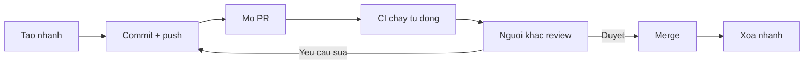

# 3.7 — 5. GitHub và Pull Request

> Nguồn: https://tiennhm.io.vn/docs/dotnet-backend-zero-to-senior/stage-01-foundation/module-03-git-developer-workflow/3.7-github-and-pull-request
> Pull request là nơi kiến thức được truyền đi, không chỉ là cổng gác. Kèm cách viết PR để người khác review nhanh, ba kiểu merge và hệ quả lên lịch sử, và cách nhận xét không làm ai khó chịu.

> Pull request thường bị xem là cổng gác — ai đó phải bấm **Approve** thì code mới vào được. Nhưng giá trị lớn hơn nằm ở chỗ khác: nó là nơi **kiến thức về hệ thống lan ra khỏi đầu một người**. Từ góc nhìn đó suy ra cách làm hiệu quả: PR **nhỏ** (dưới 400 dòng, vì quá ngưỡng đó khả năng phát hiện lỗi của người review tụt hẳn), mô tả trả lời **vì sao** chứ không kể lại diff, và nhận xét nhắm vào **code** chứ không nhắm vào người viết. Bài này cũng làm rõ ba kiểu merge của GitHub và hệ quả rất khác nhau của chúng lên lịch sử.

## Mục tiêu bài học

Sau bài này bạn có thể:

- Mở một pull request mà người khác review được trong 15 phút.
- Chọn đúng giữa merge commit, squash merge và rebase merge.
- Viết nhận xét review cụ thể và không mang tính công kích.
- Thiết lập branch protection cho nhánh chính.
- Dùng draft PR và CI để rút ngắn vòng phản hồi.

## Nội dung bài học

### 3.7.1 — Vòng đời một pull request



```bash
git checkout -b feature/bao-cao-doanh-thu
# ... làm việc, commit ...
git push -u origin feature/bao-cao-doanh-thu
# GitHub in ra một đường dẫn tạo PR ngay trong output của lệnh push
```

### 3.7.2 — PR nhỏ là PR được review tử tế

Đây là yếu tố ảnh hưởng nhiều nhất tới chất lượng review, và nó không liên quan gì tới kỹ năng của người review.

| Kích thước PR | Chuyện thường xảy ra |
|---|---|
| Dưới 100 dòng | Review kỹ, nhận xét cụ thể |
| 100–400 dòng | Vẫn ổn, cần tập trung |
| 400–1000 dòng | Bắt đầu đọc lướt |
| Trên 1000 dòng | **"LGTM 👍"** |

PR càng to, người review càng khó giữ toàn bộ bối cảnh trong đầu, và xác suất họ chỉ duyệt cho xong càng cao. Một PR 2000 dòng thường nhận được ít nhận xét hơn một PR 200 dòng — không phải vì nó tốt hơn.

Cách giữ PR nhỏ:

- Tách tái cấu trúc ra khỏi thay đổi hành vi. Hai PR, review độc lập.
- Gửi PR "dọn đường" trước (đổi tên, di chuyển file), rồi mới gửi PR logic.
- Tính năng lớn thì chia theo lát cắt dọc: mỗi PR là một phần chạy được từ đầu tới cuối.

### 3.7.3 — Mô tả PR

```markdown
## Vì sao

Khách hàng nhập số lượng âm ở form đặt hàng, hệ thống vẫn tạo đơn
với tổng tiền âm. Tuần trước có 3 đơn như vậy lọt vào báo cáo doanh thu.

## Làm gì

- Thêm kiểm tra ở tầng domain (`Order.AddLine`), không đặt ở controller
  vì còn luồng tạo đơn từ API công khai và từ job nhập liệu.
- Thêm test cho số lượng âm, bằng không, và vượt tồn kho.

## Cách kiểm tra

1. Gọi `POST /api/orders` với `quantity: -5`
2. Kỳ vọng `422` kèm `ProblemDetails`
3. Kiểm tra bảng `orders` không có bản ghi mới

## Lưu ý cho người review

Phần `OrderValidator` có thay đổi hành vi với đơn hàng đã tạo trước đây —
xem `Migrations/20260924_FixNegativeTotals.cs`.
```

Mục cuối là mục ít người viết nhất và có giá trị cao nhất. Nó **chỉ thẳng vào chỗ cần soi kỹ**, thay vì để người review tự mò trong 300 dòng diff.

### 3.7.4 — Ba kiểu merge của GitHub

| Kiểu | Lịch sử `main` | Dùng khi |
|---|---|---|
| **Create a merge commit** | Giữ mọi commit của nhánh, thêm một merge commit | Muốn giữ chi tiết quá trình |
| **Squash and merge** | **Gộp tất cả thành một commit** | Nhánh có nhiều commit "wip", "fix" |
| **Rebase and merge** | Đặt từng commit lên đầu `main`, lịch sử thẳng | Các commit đã sạch sẵn |

**Squash** là mặc định hợp lý cho hầu hết đội: `main` có lịch sử sạch, mỗi dòng là một tính năng hoàn chỉnh, và `git bisect` chạy rất hiệu quả trên đó.

Đánh đổi của squash: mất chi tiết quá trình. Với PR lớn, sáu tháng sau bạn chỉ thấy một commit 800 dòng, không còn biết thứ tự người viết đã làm. Đây là **một lý do nữa để giữ PR nhỏ** — với PR nhỏ, đánh đổi này gần như bằng không.

Lưu ý kỹ thuật: cả squash và rebase đều **tạo mã commit mới**, nên nhánh cũ trên máy bạn trở nên lỗi thời. Sau khi merge, hãy xoá nhánh cục bộ và `git fetch --prune`.

### 3.7.5 — Review: nhắm vào code, không nhắm vào người

```markdown
❌ "Code này viết tệ quá."
❌ "Sao lại làm thế này?"
❌ "Bạn không hiểu async à?"

✅ "Chỗ này `await` trong vòng lặp sẽ gọi database N lần.
    Gợi ý: lấy toàn bộ trong một query rồi tra bằng Dictionary.
    Tham khảo: /blog/ef-core-n-plus-1-query"

✅ "Mình chưa rõ vì sao cần cache ở đây — dữ liệu này đổi mỗi phút mà?
    Có bối cảnh nào mình đang thiếu không?"
```

Bốn nguyên tắc dùng được ngay:

1. **Nói về code, không nói về người.** "Hàm này" chứ không phải "bạn".
2. **Kèm lý do và gợi ý.** Nhận xét không có đường đi tiếp chỉ làm người ta bế tắc.
3. **Phân loại mức độ.** Đánh dấu rõ cái nào phải sửa, cái nào chỉ là đề xuất:

```markdown
**Phải sửa:** SQL injection ở dòng 42
**Nên sửa:** hàm này 80 dòng, tách được thành ba
**Tuỳ bạn:** mình hay đặt tên biến này là `orderTotal`
```

4. **Khen chỗ đáng khen.** Nếu ai đó xử lý một ca biên khéo, nói ra. Review chỉ toàn chê là review mà người ta sợ.

Và một quy tắc cho người **nhận** review: nếu một nhận xét khiến bạn phải giải thích dài dòng, rất có thể **code cần một comment** — vì người đọc tiếp theo cũng sẽ hỏi đúng câu đó.

### 3.7.6 — Branch protection

Thiết lập tối thiểu cho nhánh `main` của một dự án thật:

- ☑ Require a pull request before merging
- ☑ Require approvals (ít nhất 1)
- ☑ Require status checks to pass — build và test phải xanh
- ☑ Require branches to be up to date before merging
- ☑ Do not allow bypassing the above settings

Mục thứ tư đáng chú ý: nó chặn tình huống PR của bạn xanh khi tách ra, nhưng `main` đã đổi ở giữa và hai thay đổi xung đột về mặt logic dù không xung đột về mặt văn bản.

Kèm theo đó, một quy trình CI tối thiểu cho .NET:

```yaml
# .github/workflows/ci.yml
name: CI
on: [pull_request]
jobs:
  build:
    runs-on: ubuntu-latest
    steps:
      - uses: actions/checkout@v4
      - uses: actions/setup-dotnet@v4
        with:
          dotnet-version: '9.0.x'
      - run: dotnet restore
      - run: dotnet build --no-restore
      - run: dotnet test --no-build --verbosity normal
```

Chi tiết: [GitHub Actions](https://docs.github.com/en/actions).

### 3.7.7 — Rà lại quy trình của bạn

**Danh sách rà soát pull request**

- [ ] PR dưới 400 dòng thay đổi; lớn hơn thì đã tách nhỏ.
- [ ] Mô tả PR trả lời vì sao, không kể lại diff.
- [ ] Có mục hướng dẫn kiểm tra để người review chạy thử được.
- [ ] Có chỉ rõ chỗ cần soi kỹ nhất.
- [ ] Tái cấu trúc và thay đổi hành vi nằm ở hai PR khác nhau.
- [ ] Nhận xét review phân loại rõ phải sửa / nên sửa / tuỳ bạn.
- [ ] Nhánh main đã bật branch protection và yêu cầu CI xanh.
- [ ] Nhánh được xoá sau khi merge, và đã fetch --prune ở máy cục bộ.

## Bài tập áp dụng

1. **Đo kích thước PR.** Lấy mười PR gần nhất của đội bạn, ghi số dòng thay đổi và số nhận xét review của mỗi cái. Vẽ tương quan giữa hai con số. Kết quả có khớp với bảng ở mục 3.7.2 không?

2. **Viết lại một mô tả PR.** Chọn một PR cũ có mô tả sơ sài. Viết lại theo cấu trúc ở mục 3.7.3, kèm mục "lưu ý cho người review". Hỏi đồng nghiệp: bản nào dễ review hơn?

3. **Dựng CI tối thiểu.** Thêm file workflow ở mục 3.7.6 vào một dự án .NET, mở một PR cố ý làm hỏng test, và xác nhận GitHub chặn không cho merge.

## Tự kiểm tra

### Vì sao PR nhỏ lại được review tốt hơn?

Vì người review phải giữ toàn bộ bối cảnh trong đầu, và khả năng đó giảm nhanh theo kích thước. Trên khoảng 400 dòng thì người ta bắt đầu đọc lướt, trên 1000 dòng thì thường chỉ duyệt cho xong. Một PR 2000 dòng thường nhận ít nhận xét hơn một PR 200 dòng, không phải vì nó tốt hơn.

### Ba kiểu merge của GitHub khác nhau ra sao?

Merge commit giữ mọi commit của nhánh và thêm một commit hợp nhất. Squash and merge gộp tất cả thành một commit duy nhất trên main. Rebase and merge đặt từng commit lên đầu main cho lịch sử thẳng. Squash là mặc định hợp lý cho hầu hết đội vì main có lịch sử sạch và git bisect chạy rất hiệu quả.

### Đánh đổi của squash merge là gì?

Mất chi tiết quá trình. Với PR lớn, sáu tháng sau bạn chỉ thấy một commit 800 dòng và không còn biết thứ tự người viết đã làm. Đây là thêm một lý do để giữ PR nhỏ — với PR nhỏ thì đánh đổi này gần như bằng không.

### Mục nào trong mô tả PR có giá trị cao nhất?

Mục lưu ý cho người review, chỉ thẳng vào chỗ cần soi kỹ nhất. Đó là mục ít người viết nhất nhưng tiết kiệm nhiều thời gian nhất, vì nó thay việc người review tự mò trong hàng trăm dòng diff bằng một chỉ dẫn cụ thể.

### Nhận xét review nên viết thế nào?

Nói về code chứ không nói về người, kèm lý do và một hướng đi tiếp cụ thể, và phân loại rõ mức độ: phải sửa, nên sửa, hay chỉ là đề xuất tuỳ chọn. Cũng nên khen chỗ đáng khen, vì review chỉ toàn chê là review mà người ta sợ.

### Require branches to be up to date before merging chặn được gì?

Chặn tình huống PR của bạn xanh khi tách ra, nhưng nhánh main đã thay đổi ở giữa, và hai thay đổi xung đột về mặt logic dù không xung đột về mặt văn bản. Tuỳ chọn này buộc nhánh phải cập nhật theo main rồi chạy lại CI trước khi được merge.

## Kết luận

Ba điều đáng nhớ nhất:

1. **PR là nơi kiến thức lan ra**, không chỉ là cổng gác.
2. **400 dòng là ngưỡng thực tế.** Vượt qua nó, review biến thành nghi lễ.
3. **Nhận xét cần kèm đường đi tiếp.** Chỉ ra vấn đề mà không gợi ý giải pháp chỉ làm người ta bế tắc.

## Tham khảo

- [GitHub Pull requests](https://docs.github.com/en/pull-requests) — vòng đời và tuỳ chọn merge
- [GitHub Actions](https://docs.github.com/en/actions) — dựng CI cho PR
- [git-merge](https://git-scm.com/docs/git-merge) — phần Git bên dưới
- [Conventional Commits](https://www.conventionalcommits.org/en/v1.0.0/) — hữu ích khi dùng squash merge

## Điều hướng

- **Bài trước:** [3.6 — 4. Branching và Merging](3.6-branching-and-merging.mdx)
- **Bài tiếp theo:** [3.8 — 6. Git Conflicts](3.8-git-conflicts.mdx)
- **Về module:** [Trang mục lục](./)
