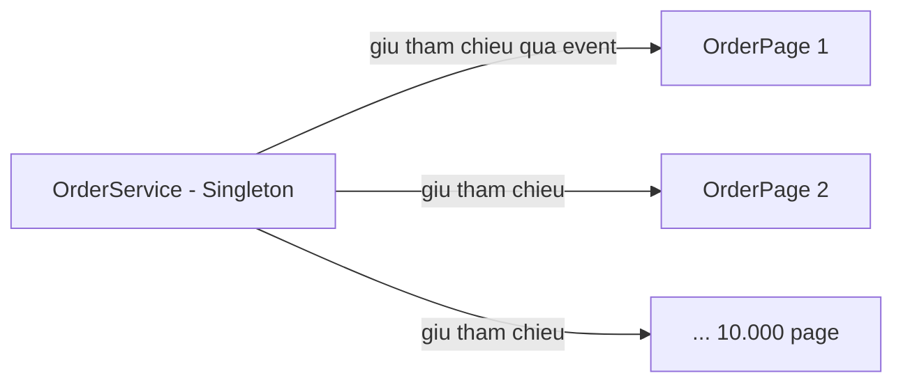

# 5.5 — 4. Delegates và Events

> Nguồn: https://tiennhm.io.vn/docs/dotnet-backend-zero-to-senior/stage-02-csharp-professional/module-05-advanced-csharp/5.5-delegates-and-events
> Delegate là con trỏ hàm có kiểu; event là delegate bị giới hạn quyền. Kèm rò rỉ bộ nhớ do quên gỡ đăng ký, và vì sao event không hợp với xử lý bất đồng bộ.

> Delegate là **con trỏ hàm có kiểu**: một biến giữ được một phương thức và gọi nó sau. `Func`, `Action`, `Predicate` đều chỉ là delegate dựng sẵn, và mọi biểu thức lambda bạn truyền cho LINQ đều trở thành một delegate. `event` không phải khái niệm khác — nó là một delegate bị **giới hạn quyền**: bên ngoài chỉ được `+=` và `-=`, không được gán đè hay tự kích hoạt. Bài này dành phần quan trọng nhất cho **rò rỉ bộ nhớ do quên `-=`**: một đối tượng sống lâu giữ tham chiếu tới đối tượng ngắn hạn qua event handler, và GC không bao giờ thu hồi được nó.

## Mục tiêu bài học

Sau bài này bạn có thể:

- Khai báo và dùng delegate, `Func`, `Action`, `Predicate` đúng chỗ.
- Giải thích `event` khác delegate công khai ở điểm nào.
- Chỉ ra cơ chế rò rỉ bộ nhớ do quên gỡ đăng ký, và cách tránh.
- Gọi event an toàn khi có nhiều luồng.
- Biết vì sao event không hợp với xử lý bất đồng bộ, và dùng gì thay thế.

## Nội dung bài học

### 5.5.1 — Delegate là con trỏ hàm có kiểu

```csharp
// Khai báo một kiểu delegate
public delegate decimal DiscountRule(Order order);

// Gán một phương thức vào biến
DiscountRule rule = order => order.Total >= 500_000m ? 0.15m : 0m;

decimal rate = rule(order);          // gọi như gọi hàm
```

Trong .NET hiện đại bạn hiếm khi tự khai báo `delegate`, vì đã có sẵn ba họ:

```csharp
Func<Order, decimal>   calc   = o => o.Total * 0.1m;    // có trả về
Action<Order>          log    = o => Console.WriteLine(o.Code);  // không trả về
Predicate<Order>       isPaid = o => o.IsPaid;          // trả về bool
```

`Func` nhận tới 16 tham số, tham số **cuối cùng** là kiểu trả về: `Func<int, string, bool>` nghĩa là nhận `int` và `string`, trả `bool`.

Mọi lambda truyền cho LINQ đều là delegate. `orders.Where(o => o.IsPaid)` chính là truyền một `Func<Order, bool>`.

### 5.5.2 — Multicast: một delegate giữ nhiều phương thức

```csharp
Action<Order> handlers = o => Console.WriteLine("Ghi log");
handlers += o => Console.WriteLine("Gửi email");
handlers += o => Console.WriteLine("Cập nhật kho");

handlers(order);        // gọi cả ba, theo đúng thứ tự đăng ký
```

Hai điều cần biết, và cả hai đều gây bất ngờ:

1. **Một handler ném ngoại lệ thì các handler sau đó không chạy.** Không có cơ chế thử tiếp.
2. **Với `Func`, chỉ giá trị trả về của handler CUỐI CÙNG được giữ lại.** Kết quả của những cái trước bị vứt đi.

```csharp
Func<int> f = () => 1;
f += () => 2;
Console.WriteLine(f());   // 2 — giá trị 1 biến mất
```

Vì hai điều này, multicast hợp với thông báo (`Action`) và **không** hợp với tính toán (`Func`).

### 5.5.3 — `event`: delegate bị giới hạn quyền

```csharp
public class OrderService
{
    // Delegate CÔNG KHAI — bên ngoài làm gì cũng được
    public Action<Order>? OrderCreated;

    // EVENT — bên ngoài chỉ được += và -=
    public event Action<Order>? OrderConfirmed;
}
```

Với delegate công khai, người dùng lớp bạn làm được hai việc nguy hiểm:

```csharp
service.OrderCreated = null;           // xoá sạch handler của người khác
service.OrderCreated!(someOrder);      // tự kích hoạt sự kiện giả
```

`event` chặn cả hai. Bên ngoài chỉ đăng ký và gỡ đăng ký; chỉ **chính class đó** mới kích hoạt được.

Quy ước .NET cho event:

```csharp
public class OrderService
{
    public event EventHandler<OrderEventArgs>? OrderConfirmed;

    private void OnOrderConfirmed(Order order)
        => OrderConfirmed?.Invoke(this, new OrderEventArgs(order));
}

public class OrderEventArgs(Order order) : EventArgs
{
    public Order Order { get; } = order;
}
```

Dùng `EventHandler` thay vì `Action` để theo quy ước: tham số đầu là nguồn phát, tham số sau là dữ liệu. Nhờ vậy handler biết ai đã phát sự kiện.

### 5.5.4 — Gọi event an toàn

```csharp
// KHÔNG an toàn — handler có thể bị gỡ giữa hai dòng
if (OrderConfirmed != null)
    OrderConfirmed(this, args);        // NullReferenceException nếu gỡ ở giữa

// AN TOÀN
OrderConfirmed?.Invoke(this, args);
```

Toán tử `?.` đọc giá trị delegate **một lần** vào biến tạm rồi mới kiểm tra và gọi, nên không có khe hở giữa kiểm tra và gọi. Đây là cách viết chuẩn kể từ C# 6.

### 5.5.5 — Rò rỉ bộ nhớ do quên gỡ đăng ký

Đây là phần quan trọng nhất của bài.

```csharp
public class OrderService          // sống suốt vòng đời ứng dụng (Singleton)
{
    public event EventHandler<OrderEventArgs>? OrderConfirmed;
}

public class OrderPage             // ngắn hạn, tạo theo từng request
{
    public OrderPage(OrderService service)
    {
        service.OrderConfirmed += OnConfirmed;    // ĐĂNG KÝ
    }

    private void OnConfirmed(object? s, OrderEventArgs e) { }
    // KHÔNG có chỗ nào gỡ đăng ký
}
```

Chuyện xảy ra:



Khi bạn viết `service.OrderConfirmed += OnConfirmed`, delegate được tạo ra giữ tham chiếu tới **`this`** — tức tới `OrderPage`. Và `OrderService` giữ delegate đó.

Nên `OrderService` (sống mãi) giữ tham chiếu tới mọi `OrderPage` từng được tạo. **GC không thu hồi được cái nào.** Bộ nhớ tăng đều, và triệu chứng chỉ xuất hiện sau vài giờ chạy.

Ba cách xử lý:

```csharp
// 1. Cài IDisposable và gỡ đăng ký
public class OrderPage : IDisposable
{
    private readonly OrderService _service;
    public OrderPage(OrderService service)
    {
        _service = service;
        _service.OrderConfirmed += OnConfirmed;
    }
    public void Dispose() => _service.OrderConfirmed -= OnConfirmed;
}
```

```csharp
// 2. Dùng lambda thì PHẢI giữ lại tham chiếu mới gỡ được
_handler = (s, e) => { /* ... */ };
service.OrderConfirmed += _handler;
// ...
service.OrderConfirmed -= _handler;    // gỡ bằng CHÍNH biến đó
```

Lưu ý quan trọng ở cách 2: `service.OrderConfirmed -= (s, e) => { };` **không gỡ được gì cả**, vì đó là một lambda mới, khác với cái đã đăng ký. Đây là lỗi rất hay gặp.

```csharp
// 3. Trong ASP.NET Core, thường tốt hơn là đừng dùng event
// Dùng MediatR notification, hoặc một IEventBus có vòng đời rõ ràng
```

### 5.5.6 — Event và bất đồng bộ không hợp nhau

```csharp
// TRÔNG như đúng, nhưng không đợi được
public event EventHandler<OrderEventArgs>? OrderConfirmed;

OrderConfirmed += async (s, e) => await SendEmailAsync(e.Order);   // async void!
```

Handler `async` gắn vào event trở thành **`async void`**, và `async void` có ba vấn đề: không `await` được, ngoại lệ bên trong không bắt được ở chỗ gọi mà làm sập tiến trình, và bạn không biết nó đã xong hay chưa.

Trong backend hiện đại, thay event bằng một cơ chế có hỗ trợ bất đồng bộ:

```csharp
public interface IDomainEventHandler<in TEvent>
{
    Task HandleAsync(TEvent e, CancellationToken ct);
}

// Bên phát gọi tuần tự và await được từng handler
foreach (var handler in _handlers)
    await handler.HandleAsync(evt, ct);
```

Đây là hướng mà MediatR và các thư viện tương tự đi, và là lý do event kiểu .NET cổ điển hiếm gặp trong code ASP.NET Core mới.

### 5.5.7 — Rà lại code của bạn

**Danh sách rà soát delegate và event**

- [ ] Không có delegate công khai nào đáng lẽ phải là event.
- [ ] Mọi lời gọi event đều dùng ?.Invoke thay vì kiểm tra null rồi gọi.
- [ ] Mỗi += đều có một -= tương ứng ở đâu đó.
- [ ] Lambda dùng làm handler được giữ trong một biến để còn gỡ được.
- [ ] Không có handler async nào gắn vào event (tránh async void).
- [ ] Đối tượng ngắn hạn đăng ký vào đối tượng sống lâu đều cài IDisposable.
- [ ] Trong ASP.NET Core, cân nhắc domain event bất đồng bộ thay cho event .NET cổ điển.

## Bài tập áp dụng

1. **Tái hiện rò rỉ.** Tạo một service `Singleton` có event, và một class ngắn hạn đăng ký vào nó trong vòng lặp 100.000 lần mà không gỡ. In `GC.GetTotalMemory(true)` trước và sau. Thêm `Dispose` gỡ đăng ký rồi đo lại.

2. **Chứng minh lambda không gỡ được.** Đăng ký một lambda vào event, rồi thử gỡ bằng một lambda viết lại y hệt. Kiểm tra số handler còn lại bằng `GetInvocationList().Length`.

3. **Nuốt giá trị trả về.** Tạo `Func` multicast với ba handler trả về 1, 2, 3. Gọi và ghi lại kết quả. Giải thích vì sao hai giá trị biến mất.

## Tự kiểm tra

### Delegate là gì và liên quan gì tới lambda?

Delegate là con trỏ hàm có kiểu: một biến giữ được một phương thức và gọi nó sau. Func, Action, Predicate đều là delegate dựng sẵn. Mọi biểu thức lambda bạn truyền cho LINQ đều được biên dịch thành một delegate, ví dụ orders.Where với điều kiện chính là truyền một Func nhận Order trả bool.

### event khác gì với một delegate công khai?

event giới hạn quyền của bên ngoài: chỉ được cộng bằng và trừ bằng để đăng ký hoặc gỡ, không gán đè được và không tự kích hoạt được. Với delegate công khai, người dùng lớp bạn có thể gán null xoá sạch handler của người khác, hoặc tự phát một sự kiện giả.

### Vì sao quên gỡ đăng ký event lại gây rò rỉ bộ nhớ?

Vì khi đăng ký một phương thức instance làm handler, delegate tạo ra giữ tham chiếu tới this. Nếu đối tượng phát sự kiện sống lâu — ví dụ một singleton — thì nó giữ tham chiếu tới mọi đối tượng ngắn hạn đã đăng ký, và GC không thu hồi được cái nào. Bộ nhớ tăng đều và chỉ lộ ra sau vài giờ chạy.

### Vì sao gỡ đăng ký bằng một lambda viết lại y hệt không có tác dụng?

Vì mỗi biểu thức lambda tạo ra một đối tượng delegate mới, khác với cái đã đăng ký dù nội dung giống hệt. Muốn gỡ được thì phải giữ lambda đó trong một biến lúc đăng ký và dùng chính biến đó khi gỡ.

### Multicast delegate có gì cần lưu ý?

Hai điều. Một handler ném ngoại lệ thì các handler sau không chạy và không có cơ chế thử tiếp. Và với Func, chỉ giá trị trả về của handler cuối cùng được giữ lại, kết quả của những cái trước bị vứt đi. Vì vậy multicast hợp với thông báo chứ không hợp với tính toán.

### Vì sao event không hợp với bất đồng bộ?

Vì handler async gắn vào event trở thành async void: không await được nên bên phát không biết nó xong chưa, và ngoại lệ bên trong không bắt được ở chỗ gọi mà làm sập tiến trình. Trong backend hiện đại nên thay bằng cơ chế domain event trả Task, như cách MediatR làm.

## Kết luận

Ba điều đáng nhớ nhất:

1. **`event` là delegate bị giới hạn quyền.** Dùng nó thay cho delegate công khai, luôn luôn.
2. **Mỗi `+=` cần một `-=`.** Đây là nguồn rò rỉ bộ nhớ phổ biến nhất trong .NET không liên quan tới unmanaged resource.
3. **Đừng gắn handler `async` vào event.** `async void` là thứ bạn không muốn trong backend.

## Tham khảo

- [Delegates — C# programming guide](https://learn.microsoft.com/en-us/dotnet/csharp/programming-guide/delegates/)
- [Events overview](https://learn.microsoft.com/en-us/dotnet/csharp/events-overview) — quy ước `EventHandler`
- [LINQ overview](https://learn.microsoft.com/en-us/dotnet/csharp/linq/) — nơi delegate xuất hiện nhiều nhất
- [Fundamentals of garbage collection](https://learn.microsoft.com/en-us/dotnet/standard/garbage-collection/fundamentals) — vì sao tham chiếu ngăn thu hồi

## Điều hướng

- **Bài trước:** [5.4 — 3. LINQ](5.4-linq.mdx)
- **Bài tiếp theo:** [5.6 — 5. Extension Methods](5.6-extension-methods.mdx)
- **Về module:** [Trang mục lục](./)
