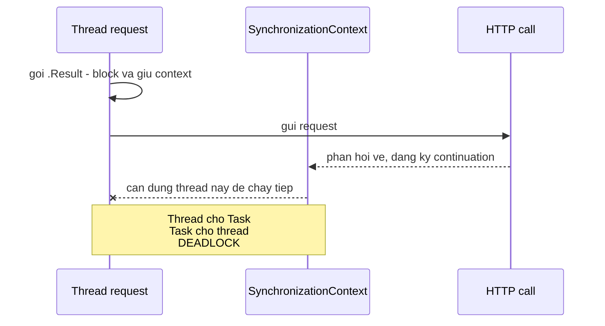

# 6.4 — 2. ConfigureAwait

> Nguồn: https://tiennhm.io.vn/docs/dotnet-backend-zero-to-senior/stage-02-csharp-professional/module-06-async-programming/6.4-configureawait
> ConfigureAwait(false) nói với CLR rằng continuation không cần quay về SynchronizationContext gốc. Vì sao nó cứu deadlock trên ASP.NET Framework và vì sao ASP.NET Core không cần.

> `ConfigureAwait(false)` nói một điều duy nhất: **"phần code sau `await` không cần chạy lại trên context gốc"**. Nó tồn tại vì `SynchronizationContext` — cơ chế trong ASP.NET Framework và WinForms/WPF bắt continuation phải quay về đúng một thread. Khi thread đó đang bị `.Result` hoặc `.Wait()` block, bạn có một **deadlock hoàn hảo**: thread chờ Task, Task chờ thread. **ASP.NET Core không có `SynchronizationContext`**, nên trong code ứng dụng web ngày nay bạn không cần `ConfigureAwait(false)` — nhưng trong **thư viện** thì vẫn cần, vì thư viện không biết ai sẽ gọi mình.

## Mục tiêu bài học

Sau bài này bạn có thể:

- Giải thích `SynchronizationContext` là gì và nó làm gì với continuation.
- Vẽ lại chính xác chuỗi sự kiện dẫn tới deadlock `.Result`.
- Quyết định đúng nơi cần và không cần `ConfigureAwait(false)`.
- Biết vì sao `ConfigureAwait(false)` chỉ chữa triệu chứng, không chữa nguyên nhân.

## Nội dung bài học

### 6.4.1 — `SynchronizationContext` là gì

Khi bạn `await`, runtime hỏi một câu: *"phần còn lại của phương thức này nên chạy ở đâu?"*

Câu trả lời mặc định là: **ở nơi tôi vừa rời đi** — tức `SynchronizationContext.Current` tại thời điểm `await`. Runtime chụp lại context đó và đăng ký continuation vào nó.

| Môi trường | `SynchronizationContext.Current` | Continuation chạy ở đâu |
|---|---|---|
| ASP.NET Framework (System.Web) | `AspNetSynchronizationContext` | Đúng thread request, một lúc một cái |
| WinForms | `WindowsFormsSynchronizationContext` | Đúng UI thread |
| WPF | `DispatcherSynchronizationContext` | Đúng UI thread |
| **ASP.NET Core** | **`null`** | **Thread pool bất kỳ** |
| Console | `null` | Thread pool bất kỳ |

Dòng in đậm là lý do cả bài này nhẹ đi rất nhiều với .NET hiện đại: ASP.NET Core đã **bỏ hẳn** `SynchronizationContext`.

### 6.4.2 — Deadlock xảy ra chính xác như thế nào

```csharp
// ASP.NET Framework (KHÔNG phải Core)
public ActionResult GetData()
{
    var data = GetDataAsync().Result;   // (1) block thread request
    return View(data);
}

private async Task<string> GetDataAsync()
{
    return await _http.GetStringAsync("https://api.example.com");  // (2)
}
```

Chuỗi sự kiện:



1. `.Result` **block** thread request. Thread này đang giữ `AspNetSynchronizationContext`.
2. HTTP trả về. Continuation của `GetDataAsync` được đăng ký vào context đó.
3. Context chỉ cho phép **một** thao tác tại một thời điểm, và slot đó đang bị `.Result` chiếm.
4. Continuation không bao giờ chạy → `Task` không bao giờ hoàn thành → `.Result` không bao giờ trả về.

Hai bên chờ nhau vĩnh viễn. Không có exception, không có log — request chỉ đơn giản treo cho tới khi timeout.

> **Tip: Đọc thêm**
>
> Bài [Gọi `.Result` khi nào thì deadlock, khi nào thì không?](https://tiennhm.io.vn/blog/deadlock-result-wait-csharp) đi sâu vào việc vì sao cùng một dòng code treo trong WPF/ASP.NET Framework nhưng chạy bình thường trong Console/ASP.NET Core.
### 6.4.3 — `ConfigureAwait(false)` phá vòng lặp ra sao

```csharp
private async Task<string> GetDataAsync()
{
    return await _http.GetStringAsync("https://api.example.com")
                      .ConfigureAwait(false);   // khong quay ve context
}
```

Với `ConfigureAwait(false)`, continuation chạy trên **thread pool bất kỳ**. Nó không cần cái slot đang bị `.Result` chiếm, nên nó chạy được, `Task` hoàn thành, `.Result` trả về.

Nhưng hãy nhìn cho đúng bản chất:

> `ConfigureAwait(false)` **không chữa nguyên nhân**. Nguyên nhân là `.Result`. `ConfigureAwait(false)` chỉ làm cho một lỗi thiết kế tạm thời không phát nổ.

Cách chữa thật sự là **async all the way**: `public async Task GetData() => View(await GetDataAsync());`

### 6.4.4 — Nó lan truyền theo từng `await`, không theo phương thức

Đây là điểm rất hay bị hiểu sai:

```csharp
public async Task ProcessAsync()
{
    await StepOneAsync().ConfigureAwait(false);   // continuation: thread pool
    await StepTwoAsync();                         // continuation: context da mat roi
}
```

`ConfigureAwait` áp dụng cho **đúng một `await`**, không phải cả phương thức. Nhưng sau `await` đầu tiên với `false`, bạn **đã ra khỏi context** — nên `await` thứ hai dù không ghi gì cũng chẳng có context nào để quay về.

Hệ quả: trong thư viện, nếu đã dùng thì phải dùng **nhất quán ở mọi `await`**. Dùng nửa vời gây ra hành vi phụ thuộc vào việc thao tác nào hoàn thành đồng bộ — nghĩa là bug chỉ xuất hiện khi có cache hit, hoặc chỉ trên máy production.

### 6.4.5 — Dùng ở đâu

| Loại code | `ConfigureAwait(false)`? | Lý do |
|---|---|---|
| **Thư viện NuGet, code hạ tầng dùng lại** | **Có, ở mọi `await`** | Không biết ai gọi mình; có thể là WPF hoặc ASP.NET Framework |
| **ASP.NET Core controller / service / repository** | Không cần | Không có `SynchronizationContext` để quay về |
| **Worker Service, Console, hosted service** | Không cần | Context là `null` |
| **WinForms / WPF, code chạm vào control** | **Không** | Bắt buộc phải quay về UI thread |
| **WinForms / WPF, code không chạm UI** | Có | Tránh dồn việc vô ích lên UI thread |

Với WPF/WinForms, bỏ `ConfigureAwait(false)` sai chỗ cho bạn `InvalidOperationException: The calling thread cannot access this object because a different thread owns it.`

### 6.4.6 — `ConfigureAwait(ConfigureAwaitOptions)` từ .NET 8

.NET 8 thêm một overload rõ nghĩa hơn cho `Task` (không phải `Task`):

```csharp
await task.ConfigureAwait(ConfigureAwaitOptions.None);                 // = ConfigureAwait(false)
await task.ConfigureAwait(ConfigureAwaitOptions.ContinueOnCapturedContext); // = ConfigureAwait(true)
await task.ConfigureAwait(ConfigureAwaitOptions.SuppressThrowing);     // khong nem lai exception
await task.ConfigureAwait(ConfigureAwaitOptions.ForceYielding);        // luon yield, khong bao gio dong bo
```

`SuppressThrowing` hữu ích khi bạn chỉ muốn **chờ xong** mà không quan tâm kết quả, thay cho `try { await t; } catch { }`.

### 6.4.7 — Rà lại code của bạn

**Danh sách rà soát ConfigureAwait**

- [ ] Không có .Result hay .Wait() nào trong đường chạy request.
- [ ] Trong thư viện dùng lại: ConfigureAwait(false) ở MỌI await, không nửa vời.
- [ ] Trong ASP.NET Core: không rải ConfigureAwait(false) vô ích khắp nơi.
- [ ] Trong WPF/WinForms: không ConfigureAwait(false) trước code chạm vào control.
- [ ] Hiểu rằng ConfigureAwait(false) chỉ giấu triệu chứng của .Result, không chữa nó.
- [ ] Đã cân nhắc ConfigureAwaitOptions.SuppressThrowing thay cho try/catch rỗng.

## Bài tập áp dụng

#### Bài 1 — Tái hiện deadlock

Tạo một project WPF (nhanh nhất) hoặc ASP.NET Framework, gọi `.Result` trên một `Task` có I/O thật, xác nhận nó treo. Thêm `ConfigureAwait(false)` vào phương thức async và xác nhận nó hết treo.

**Tiêu chí hoàn thành:** bạn mô tả được vòng chờ **theo đúng thứ tự**, và giải thích vì sao ASP.NET Core **không** bị deadlock.

Gợi ý và lời giải — Bài 1

**Gợi ý.** Deadlock cần hai điều kiện đồng thời: một `SynchronizationContext` chỉ có **một** luồng, và một lời gọi **chặn** luồng đó. Thiếu một trong hai là không treo.

**Lời giải — dựng nhanh bằng WPF:**

```csharp
// MainWindow.xaml.cs
private async Task<string> LayDuLieuAsync()
{
    using var http = new HttpClient();
    return await http.GetStringAsync("https://example.com");
}

private void Button_Click(object sender, RoutedEventArgs e)
{
    var kq = LayDuLieuAsync().Result;      // TREO VĨNH VIỄN
    MessageBox.Show(kq);
}
```

Giao diện đóng băng và không bao giờ phục hồi.

**Vòng chờ, theo đúng thứ tự:**

```text
1. Luồng UI chạy Button_Click
2. Gọi LayDuLieuAsync(), chạy tới await GetStringAsync
3. await ghi nhớ SynchronizationContext hiện tại = context của luồng UI
4. LayDuLieuAsync trả về một Task chưa hoàn tất
5. .Result CHẶN luồng UI, chờ Task đó
6. HTTP hoàn tất -> phần còn lại của LayDuLieuAsync cần chạy tiếp
7. Nó được xếp lịch chạy TRÊN LUỒNG UI (vì bước 3)
8. Luồng UI đang bị chặn ở bước 5 -> không bao giờ nhận được việc ở bước 7
9. Task không bao giờ hoàn tất -> .Result chờ mãi
```

Hai bên chờ nhau: luồng UI chờ `Task`, `Task` chờ luồng UI.

**Sửa bằng `ConfigureAwait(false)`:**

```csharp
private async Task<string> LayDuLieuAsync()
{
    using var http = new HttpClient();
    return await http.GetStringAsync("https://example.com").ConfigureAwait(false);
}
```

`ConfigureAwait(false)` nói: *"sau khi chờ xong, không cần quay lại context ban đầu"*. Phần còn lại chạy trên một luồng thread pool bất kỳ, `Task` hoàn tất, và `.Result` được giải phóng. Vòng chờ bị phá ở bước 7.

**Vì sao ASP.NET Core không bị deadlock.** Nó **không có `SynchronizationContext`**. Bước 3 không ghi nhớ gì, nên bước 7 chạy trên luồng thread pool bất kỳ. Không có vòng chờ.

**Nhưng đừng kết luận sai.** Không deadlock **không có nghĩa là an toàn**:

| | ASP.NET Framework / WPF | ASP.NET Core |
|---|---|---|
| Gọi `.Result` | **Deadlock** — treo ngay | Không deadlock |
| Hậu quả | Rõ ràng, phát hiện ngay | **Giam một luồng thread pool** |
| Khi có tải | — | Thread pool starvation, như [bài 6.2](6.2-why-async-matters.mdx) |

Nghịch lý: hành vi của ASP.NET Framework **dễ chịu hơn** về mặt phát hiện lỗi, vì nó hỏng ngay và hỏng rõ ràng. ASP.NET Core thì chạy tốt trên máy phát triển và chỉ sụp khi có tải thật.

**Kết luận thực dụng.** `ConfigureAwait(false)` chữa **triệu chứng**; bệnh là việc chặn luồng. Cách đúng là **đừng chặn**:

```csharp
private async void Button_Click(object sender, RoutedEventArgs e)
{
    try { MessageBox.Show(await LayDuLieuAsync()); }
    catch (Exception ex) { MessageBox.Show(ex.Message); }
}
```

Đây là một trong những trường hợp hiếm hoi `async void` được chấp nhận, như [bài 6.3](6.3-task-and-async-await.mdx) đã nêu — và vẫn phải bọc `try/catch`.

#### Bài 2 — Chứng minh context mất sau `ConfigureAwait(false)`

Trong WPF, in `SynchronizationContext.Current` trước `await`, sau một `await` có `ConfigureAwait(false)`, và sau một `await` tiếp theo không ghi gì. Ghi lại ba giá trị.

**Tiêu chí hoàn thành:** bạn nêu được vì sao giá trị thứ ba vẫn là `null`, dù `await` đó không có `ConfigureAwait(false)`.

Gợi ý và lời giải — Bài 2

**Gợi ý.** `ConfigureAwait` áp dụng cho **một lệnh `await` cụ thể**, không cho cả phương thức. Nhưng hãy nghĩ kỹ: lệnh `await` thứ hai đọc context từ đâu?

**Lời giải.**

```csharp
private async Task ThuNghiemAsync()
{
    Console.WriteLine($"1. trước await      : {SynchronizationContext.Current?.GetType().Name ?? "null"}");

    await Task.Delay(10).ConfigureAwait(false);
    Console.WriteLine($"2. sau ConfigureAwait(false): {SynchronizationContext.Current?.GetType().Name ?? "null"}");

    await Task.Delay(10);                    // KHÔNG có ConfigureAwait
    Console.WriteLine($"3. sau await thường : {SynchronizationContext.Current?.GetType().Name ?? "null"}");
}
```

**Kết quả trong WPF:**

```text
1. trước await               : DispatcherSynchronizationContext
2. sau ConfigureAwait(false) : null
3. sau await thường          : null
```

**Vì sao giá trị thứ ba vẫn `null`.** Đây là phần tinh tế nhất của bài. Lệnh `await` thứ hai **cũng cố quay lại context** — nhưng nó đọc `SynchronizationContext.Current` **tại thời điểm nó chạy**. Sau lệnh `await` thứ nhất với `ConfigureAwait(false)`, code đang chạy trên luồng thread pool, nơi `Current` đã là `null`. Không có context nào để quay về.

**Hệ quả: `ConfigureAwait(false)` có tính lan truyền một chiều.** Một khi đã rời khỏi context, mọi `await` sau đó trong cùng luồng thực thi đều không quay lại được, dù không ai viết `ConfigureAwait(false)` cho chúng.

**Điều này gây ra một lỗi thật trong ứng dụng có giao diện:**

```csharp
private async Task LuuAsync()
{
    await _repo.LuuAsync().ConfigureAwait(false);    // rời context
    await Task.Delay(100);                            // vẫn ở thread pool
    txtTrangThai.Text = "Đã lưu";                     // NÉM — không phải luồng UI
}
```

```text
System.InvalidOperationException: The calling thread cannot access this object
because a different thread owns it.
```

**Quy tắc dùng, theo loại dự án:**

| Loại dự án | Khuyến nghị |
|---|---|
| **Thư viện dùng chung** | `ConfigureAwait(false)` ở **mọi** `await` — thư viện không biết nó chạy ở đâu |
| **ASP.NET Core** | **Không cần** — không có context, thêm vào chỉ làm rối code |
| **WPF, WinForms, MAUI** | Dùng ở tầng logic; **không** dùng ở chỗ sau đó chạm vào giao diện |

**Vì sao thư viện phải dùng 100%.** Một thư viện có thể được gọi từ ASP.NET Core (không context), từ WPF (có context), hay từ một ứng dụng cũ. Nếu nó cố quay lại context mà không cần, bạn trả chi phí điều phối vô ích ở trường hợp tốt, và gây deadlock ở trường hợp xấu.

**Kiểm tra tính nhất quán:**

```bash
awk 'BEGIN{a=0;c=0} /await /{a++} /ConfigureAwait\(false\)/{c++} END{printf "await: %d, ConfigureAwait(false): %d (%.0f%%)\n", a, c, c*100/a}' \
  $(find src/Crm.Shared -name '*.cs')
```

Tỉ lệ nên là **0% hoặc 100%**. Con số ở giữa nghĩa là có chỗ dùng chỗ không — và những chỗ thiếu chính là bug tiềm ẩn.

**Cách ép bằng công cụ.** Quy tắc `CA2007` cảnh báo mọi `await` thiếu `ConfigureAwait`. Bật nó cho **dự án thư viện** và tắt cho **dự án ứng dụng ASP.NET Core**:

```xml
<!-- Chỉ trong Crm.Shared.csproj -->
<WarningsAsErrors>$(WarningsAsErrors);CA2007</WarningsAsErrors>
```

#### Bài 3 — Rà tính nhất quán trong thư viện của bạn

Chọn một project library trong repo, đếm số lệnh `await` và số chỗ có `ConfigureAwait(false)`. Nếu tỉ lệ không phải 0% hoặc 100%, bạn đang có bug tiềm ẩn.

**Tiêu chí hoàn thành:** bạn có tỉ lệ cụ thể và một quyết định rõ ràng cho dự án đó.

Gợi ý và lời giải — Bài 3

**Gợi ý.** Đếm bằng lệnh, rồi phân loại dự án trước khi quyết định — câu trả lời khác nhau cho thư viện và cho ứng dụng.

**Lời giải.**

```bash
for p in $(find src -name '*.csproj'); do
  d=$(dirname "$p")
  a=$(grep -rho 'await ' --include=*.cs "$d" | wc -l)
  c=$(grep -rho 'ConfigureAwait(false)' --include=*.cs "$d" | wc -l)
  [ "$a" -gt 0 ] && printf "%-32s await=%-5d cfg=%-5d %3d%%\n" "$(basename $d)" "$a" "$c" "$((c*100/a))"
done
```

**Kết quả điển hình:**

```text
Crm.Domain                       await=12    cfg=0       0%
Crm.Application                  await=148   cfg=0       0%
Crm.Infrastructure               await=203   cfg=47     23%     <- VẤN ĐỀ
Crm.Api                          await=89    cfg=0       0%
Crm.Shared                       await=34    cfg=34    100%
```

**Đọc bảng này:**

- `Crm.Shared` ở **100%** — đúng, đây là thư viện dùng chung.
- `Crm.Api` và `Crm.Application` ở **0%** — đúng, chúng chỉ chạy trong ASP.NET Core.
- `Crm.Infrastructure` ở **23%** — đây là vấn đề. Con số ở giữa nghĩa là ai đó thêm `ConfigureAwait(false)` ở một số chỗ, có lẽ sau khi đọc một bài viết, rồi dừng giữa chừng. Tình trạng này tệ hơn cả hai thái cực, vì:

  1. Người đọc code không biết quy ước của dự án là gì.
  2. Người viết code mới sẽ sao chép theo file họ tình cờ mở, làm tỉ lệ càng lệch.
  3. Nếu thư viện này sau được dùng ở nơi có `SynchronizationContext`, 77% số `await` thiếu sẽ gây vấn đề.

**Quyết định cho từng loại dự án:**

| Dự án | Quyết định | Cách thực hiện |
|---|---|---|
| `Crm.Domain`, `Crm.Application`, `Crm.Api` | Giữ 0% | Tắt `CA2007` |
| `Crm.Shared` | Giữ 100% | Bật `CA2007` thành lỗi |
| `Crm.Infrastructure` | **Chọn một** | Xem dưới |

**Với `Crm.Infrastructure`**, câu hỏi là: *dự án này có bao giờ được dùng ngoài ASP.NET Core không?*

- **Không** — ví dụ nó chỉ phục vụ API này. Xoá hết `ConfigureAwait(false)` cho nhất quán và code gọn hơn.
- **Có** — ví dụ nó được dùng lại trong một công cụ dòng lệnh hoặc một ứng dụng desktop. Bổ sung cho đủ 100% và bật `CA2007`.

**Cách áp dụng hàng loạt:**

```xml
<!-- Directory.Build.props ở thư mục gốc — mặc định cho mọi dự án -->
<Project>
  <PropertyGroup>
    <NoWarn>$(NoWarn);CA2007</NoWarn>
  </PropertyGroup>
</Project>
```

```xml
<!-- Crm.Shared.csproj — ghi đè cho riêng thư viện -->
<PropertyGroup>
  <NoWarn>$(NoWarn.Replace('CA2007',''))</NoWarn>
  <WarningsAsErrors>$(WarningsAsErrors);CA2007</WarningsAsErrors>
</PropertyGroup>
```

**Điều quan trọng nhất của bài này.** Vấn đề không phải "dùng hay không dùng `ConfigureAwait(false)`" — cả hai lựa chọn đều đúng trong ngữ cảnh của nó. Vấn đề là **không có quyết định nào được ghi lại**, nên mỗi người làm một kiểu. Hãy chọn một, ghi vào tài liệu của dự án, và **để công cụ ép buộc** thay vì trông chờ vào code review — đúng nguyên tắc ở [bài 4.7](../module-04-csharp-core/4.7-access-modifiers.mdx): biến quy ước thành ràng buộc kỹ thuật.

## Tự kiểm tra

### SynchronizationContext là gì?

Là cơ chế trả lời câu hỏi phần code sau await nên chạy ở đâu. Mặc định runtime chụp lại SynchronizationContext.Current tại thời điểm await và đăng ký continuation vào đó, nên continuation quay về đúng thread cũ. ASP.NET Framework, WinForms và WPF đều có context; ASP.NET Core và Console thì context là null.

### Deadlock khi gọi .Result xảy ra như thế nào?

Thread request bị .Result block và đang giữ context. Khi I/O trả về, continuation được đăng ký vào chính context đó, nhưng context chỉ cho một thao tác tại một thời điểm và slot đang bị .Result chiếm. Continuation không chạy nên Task không hoàn thành, mà .Result thì chờ Task. Hai bên chờ nhau vĩnh viễn, không có exception và không có log.

### ASP.NET Core có cần ConfigureAwait(false) không?

Không, vì ASP.NET Core đã bỏ hẳn SynchronizationContext nên không có context nào để quay về. Rải ConfigureAwait(false) khắp controller và service chỉ làm code khó đọc mà không được gì. Thư viện dùng lại thì vẫn cần, vì thư viện không biết ai sẽ gọi mình.

### ConfigureAwait áp dụng cho cả phương thức hay chỉ một await?

Chỉ đúng một await. Nhưng sau await đầu tiên có ConfigureAwait(false) thì bạn đã ra khỏi context rồi, nên những await sau dù không ghi gì cũng không còn context để quay về. Vì vậy trong thư viện phải dùng nhất quán ở mọi await, nếu không sẽ có bug chỉ xuất hiện khi thao tác hoàn thành đồng bộ.

### ConfigureAwait(false) có phải cách chữa deadlock đúng không?

Không, nó chỉ giấu triệu chứng. Nguyên nhân thật là .Result hoặc .Wait() chặn thread. Cách chữa đúng là async all the way, tức để phương thức gọi cũng là async Task và dùng await thay vì .Result.

### ConfigureAwaitOptions trong .NET 8 có gì mới?

Nó là overload rõ nghĩa hơn cho Task, với None tương đương ConfigureAwait(false), ContinueOnCapturedContext tương đương true, SuppressThrowing để chờ xong mà không ném lại exception, và ForceYielding để luôn yield chứ không bao giờ chạy đồng bộ.

## Kết luận

Ba điều đáng nhớ nhất:

1. **`ConfigureAwait(false)` nói: đừng quay về context gốc.** Nó chỉ có ý nghĩa ở nơi có `SynchronizationContext`.
2. **ASP.NET Core không có context**, nên code ứng dụng không cần nó — thư viện thì cần, và phải dùng ở **mọi** `await`.
3. **Nó không chữa deadlock, chỉ hoãn deadlock.** Thứ cần sửa là `.Result`.

## Tham khảo

- [ConfigureAwait FAQ (.NET Blog)](https://devblogs.microsoft.com/dotnet/configureawait-faq/)
- [Task.ConfigureAwait method](https://learn.microsoft.com/en-us/dotnet/api/system.threading.tasks.task.configureawait)
- [Task asynchronous programming model](https://learn.microsoft.com/en-us/dotnet/csharp/asynchronous-programming/task-asynchronous-programming-model)
- [ASP.NET Core best practices](https://learn.microsoft.com/en-us/aspnet/core/fundamentals/best-practices)

## Điều hướng

- **Bài trước:** [6.3 — 1. Task và async/await](6.3-task-and-async-await.mdx)
- **Bài tiếp theo:** [6.5 — 3. CancellationToken](6.5-cancellationtoken.mdx)
- **Về module:** [Trang mục lục](./)

## Bài liên quan

- [Gọi .Result khi nào thì deadlock, khi nào thì không?](https://tiennhm.io.vn/blog/deadlock-result-wait-csharp) — Gọi .Result hay .Wait() trên một Task treo cứng ứng dụng WPF và ASP.NET Framework, nhưng chạy bình thường trong console và ASP.NET Core.
