# 6.6 — 4. Task Parallel Library

> Nguồn: https://tiennhm.io.vn/docs/dotnet-backend-zero-to-senior/stage-02-csharp-professional/module-06-async-programming/6.6-task-parallel-library
> Task.WhenAll, Task.WhenAny và Parallel.ForEachAsync: chạy song song đúng cách, chặn số lượng đồng thời, và không nuốt mất exception.

> Ba công cụ, ba bài toán khác nhau. **`Task.WhenAll`** cho các việc độc lập cần xong hết — tổng thời gian bằng việc chậm nhất chứ không phải tổng các việc. **`Task.WhenAny`** cho việc nào xong trước thì lấy, nền tảng của timeout. **`Parallel.ForEachAsync`** (.NET 6+) cho danh sách lớn cần chặn số lượng chạy đồng thời. Hai cái bẫy lớn nhất trong bài: `await Task.WhenAll` chỉ **ném lại một exception** dù nhiều task cùng lỗi, và **`DbContext` không thread-safe** nên `WhenAll` trên cùng một `DbContext` sẽ nổ.

## Mục tiêu bài học

Sau bài này bạn có thể:

- Dùng `Task.WhenAll` để biến chuỗi I/O tuần tự thành song song.
- Lấy đúng **tất cả** exception khi nhiều task cùng lỗi.
- Viết timeout bằng `WaitAsync` thay vì `WhenAny` thủ công.
- Chọn giữa `WhenAll`, `SemaphoreSlim` và `Parallel.ForEachAsync`.
- Tránh bẫy `DbContext` không thread-safe.

## Nội dung bài học

### 6.6.1 — `Task.WhenAll`: tổng thời gian là việc chậm nhất

```csharp
// TUAN TU: 200ms + 150ms + 300ms = 650ms
var customer = await _customerService.GetAsync(id, ct);
var orders   = await _orderService.GetByCustomerAsync(id, ct);
var credit   = await _creditService.GetScoreAsync(id, ct);

// SONG SONG: max(200, 150, 300) = 300ms
var customerTask = _customerService.GetAsync(id, ct);
var ordersTask   = _orderService.GetByCustomerAsync(id, ct);
var creditTask   = _creditService.GetScoreAsync(id, ct);

await Task.WhenAll(customerTask, ordersTask, creditTask);

return (await customerTask, await ordersTask, await creditTask);
```



```mermaid
gantt
    title Tuan tu vs song song
    dateFormat X
    axisFormat %L
    section Tuan tu - 650ms
    customer  :0, 200
    orders    :200, 350
    credit    :350, 650
    section Song song - 300ms
    customer  :0, 200
    orders    :0, 150
    credit    :0, 300
```

Điều kiện để làm được: **ba lời gọi phải độc lập**. Nếu `orders` cần `customer.Id` lấy từ bước trước thì không song song được.

Chú ý dòng cuối: dùng `await customerTask` chứ **không** dùng `customerTask.Result`. Ở đây task đã xong nên `.Result` không deadlock, nhưng `.Result` gói exception vào `AggregateException` còn `await` thì ném ra exception gốc — đọc log dễ hơn nhiều.

### 6.6.2 — `WhenAll` chỉ ném lại một exception

Đây là chỗ rất nhiều người mất dữ liệu chẩn đoán:

```csharp
try
{
    await Task.WhenAll(task1, task2, task3);   // ca 3 cung loi
}
catch (Exception ex)
{
    // ex la exception cua task DAU TIEN loi. Hai cai kia bien mat.
}
```

Muốn lấy đủ, phải đọc từ chính `Task` mà `WhenAll` trả về:

```csharp
var all = Task.WhenAll(task1, task2, task3);

try
{
    await all;
}
catch
{
    // all.Exception la AggregateException chua DAY DU
    foreach (var inner in all.Exception!.InnerExceptions)
        _logger.LogError(inner, "Task that bai");

    throw;
}
```

Quy tắc: **gán `WhenAll` vào một biến** nếu bạn cần log lỗi. Còn nếu chỉ cần "hỏng là hỏng" thì viết thẳng cũng được.

### 6.6.3 — `DbContext` không thread-safe

Cái bẫy phổ biến nhất khi mới dùng `WhenAll`:

```csharp
// SAI — cung mot DbContext, no se nem InvalidOperationException
var t1 = _db.Customers.ToListAsync(ct);
var t2 = _db.Orders.ToListAsync(ct);
await Task.WhenAll(t1, t2);
// "A second operation was started on this context instance
//  before a previous operation completed."
```

`DbContext` chỉ cho **một** thao tác tại một thời điểm. Muốn song song thì phải có **mỗi task một context**:

```csharp
// DUNG — moi task mot DbContext tu factory
var t1 = LoadAsync(db => db.Customers.ToListAsync(ct));
var t2 = LoadAsync(db => db.Orders.ToListAsync(ct));
await Task.WhenAll(t1, t2);

async Task<T> LoadAsync<T>(Func<AppDbContext, Task<T>> query)
{
    await using var db = await _factory.CreateDbContextAsync(ct);
    return await query(db);
}
```

`AddDbContextFactory()` trong `Program.cs` là thứ cho bạn `_factory`. Xem thêm ở [Module 13 — Entity Framework Core](../../stage-04-database-production/module-13-entity-framework-core/).

Với hai truy vấn nhỏ thì thường **không đáng**: mỗi context là một connection riêng, và chạy tuần tự trên một connection thường nhanh hơn mở thêm connection.

### 6.6.4 — `Task.WhenAny` và cách viết timeout đúng

Cách cũ, viết thủ công:

```csharp
var fetchTask   = _api.FetchAsync(id, ct);
var timeoutTask = Task.Delay(TimeSpan.FromSeconds(3), ct);

var completed = await Task.WhenAny(fetchTask, timeoutTask);
if (completed == timeoutTask) return null;
return await fetchTask;
```

Cách này có **hai vấn đề**:

1. Nếu `fetchTask` xong trước, `timeoutTask` vẫn treo đó với một timer chạy đủ 3 giây. Trong vòng lặp nóng, đó là rò rỉ timer.
2. `fetchTask` **vẫn chạy tiếp** sau khi bạn trả `null` — kết nối vẫn mở, tài nguyên vẫn tốn.

Từ .NET 6, viết thế này:

```csharp
try
{
    return await _api.FetchAsync(id, ct).WaitAsync(TimeSpan.FromSeconds(3), ct);
}
catch (TimeoutException)
{
    return null;
}
```

Vẫn còn vấn đề 2 — công việc gốc không bị huỷ. Muốn huỷ thật thì phải truyền token có timeout vào tận nơi:

```csharp
using var cts = CancellationTokenSource.CreateLinkedTokenSource(ct);
cts.CancelAfter(TimeSpan.FromSeconds(3));

try { return await _api.FetchAsync(id, cts.Token); }
catch (OperationCanceledException) when (!ct.IsCancellationRequested) { return null; }
```

Đây mới là timeout thật sự — chi tiết về `CancellationToken` ở [bài 6.5](6.5-cancellationtoken.mdx).

`WhenAny` vẫn hữu ích cho bài toán **đua**: gọi ba nhà cung cấp, lấy ai trả lời trước.

### 6.6.5 — Ba cách chạy một danh sách, và khi nào dùng cái nào

```csharp
// 1. TUAN TU — 1000 muc x 100ms = 100 giay. Cham nhung an toan.
foreach (var c in customers)
    await ProcessAsync(c, ct);

// 2. WhenAll KHONG GIOI HAN — 1000 ket noi cung luc. De sap DB.
await Task.WhenAll(customers.Select(c => ProcessAsync(c, ct)));

// 3. Parallel.ForEachAsync (.NET 6+) — toi da 10 cung luc. Dung nhat.
await Parallel.ForEachAsync(
    customers,
    new ParallelOptions { MaxDegreeOfParallelism = 10, CancellationToken = ct },
    async (c, token) => await ProcessAsync(c, token));
```

Cách 2 là lỗi hay gặp nhất trong code production: nó hoạt động tốt với 20 phần tử trong môi trường dev, rồi làm cạn connection pool (mặc định 100) khi gặp danh sách thật.

Trước .NET 6, cách 3 phải tự làm bằng `SemaphoreSlim`:

```csharp
using var gate = new SemaphoreSlim(10);

var tasks = customers.Select(async c =>
{
    await gate.WaitAsync(ct);
    try { await ProcessAsync(c, ct); }
    finally { gate.Release(); }     // finally la bat buoc
});

await Task.WhenAll(tasks);
```

Thiếu `finally` là treo vĩnh viễn ngay lần đầu có exception — semaphore không bao giờ được trả lại.

### 6.6.6 — `Parallel.For`/`Parallel.ForEach` là chuyện khác hẳn

```csharp
// SAI — lambda async void, Parallel khong cho gi ca
Parallel.ForEach(customers, async c => await ProcessAsync(c));
```

`Parallel.ForEach` nhận `Action`, nên lambda `async` ở đây trở thành **`async void`** (xem [bài 6.3](6.3-task-and-async-await.mdx)): vòng lặp "xong" ngay lập tức trong khi công việc còn đang chạy, và mọi exception làm sập tiến trình.

Phân vai rõ ràng:

| Công cụ | Dành cho | Cơ chế |
|---|---|---|
| `Parallel.For` / `Parallel.ForEach` | **CPU-bound** | Chia việc cho nhiều thread |
| `Parallel.ForEachAsync` | **I/O-bound** | Chạy async đồng thời, không chiếm thread |
| `Task.WhenAll` | I/O-bound, số lượng nhỏ và biết trước | Không giới hạn |

Trong backend web, **hầu như luôn là cột giữa**. `Parallel.ForEach` chỉ đúng khi bạn thật sự đang tính toán — nén ảnh, xử lý ma trận.

### 6.6.7 — Rà lại code của bạn

**Danh sách rà soát Task Parallel Library**

- [ ] Các lời gọi I/O độc lập trong cùng một request đã được gom vào Task.WhenAll.
- [ ] Không có Task.WhenAll nào trên cùng một DbContext instance.
- [ ] Không có Task.WhenAll không giới hạn trên danh sách có kích thước tuỳ ý.
- [ ] Danh sách lớn dùng Parallel.ForEachAsync với MaxDegreeOfParallelism.
- [ ] Mọi SemaphoreSlim.WaitAsync đều có Release trong khối finally.
- [ ] Không có lambda async nào truyền vào Parallel.ForEach.
- [ ] Timeout dùng WaitAsync hoặc CancelAfter, không dùng WhenAny với Task.Delay.
- [ ] Nơi cần log đủ lỗi đã gán WhenAll vào biến để đọc AggregateException.

## Bài tập áp dụng

1. **Đo mức cải thiện.** Lấy một endpoint đang gọi ba service tuần tự, dùng `Stopwatch` ghi lại thời gian, chuyển sang `Task.WhenAll`, đo lại. So sánh với `max` của ba thời gian riêng lẻ.

2. **Làm cạn connection pool.** Viết một job dùng `Task.WhenAll` không giới hạn trên 500 bản ghi đi vào database. Ghi lại exception nhận được. Sau đó sửa bằng `Parallel.ForEachAsync` với `MaxDegreeOfParallelism = 10` và so sánh tổng thời gian.

3. **Mất exception.** Tạo ba task cùng ném exception khác nhau, `await Task.WhenAll` trong `try/catch`, xác nhận chỉ bắt được một. Sửa lại để log đủ ba.

## Tự kiểm tra

### Task.WhenAll giúp tiết kiệm bao nhiêu thời gian?

Tổng thời gian giảm từ tổng các việc xuống còn việc chậm nhất. Ba lời gọi 200ms, 150ms và 300ms chạy tuần tự mất 650ms nhưng chạy song song chỉ mất 300ms. Điều kiện là ba lời gọi phải độc lập, không cái nào cần kết quả của cái trước.

### Vì sao await Task.WhenAll làm mất exception?

Vì await chỉ ném lại exception của task đầu tiên bị lỗi, dù nhiều task cùng lỗi. Muốn lấy đủ thì phải gán WhenAll vào một biến rồi đọc thuộc tính Exception của nó, đó là một AggregateException chứa đầy đủ InnerExceptions.

### Vì sao không được Task.WhenAll trên cùng một DbContext?

Vì DbContext không thread-safe và chỉ cho phép một thao tác tại một thời điểm. Chạy song song sẽ nhận InvalidOperationException báo rằng một thao tác thứ hai bắt đầu trước khi thao tác trước hoàn thành. Muốn song song thì mỗi task phải có một DbContext riêng lấy từ IDbContextFactory.

### Viết timeout bằng WhenAny với Task.Delay có vấn đề gì?

Hai vấn đề. Nếu việc chính xong trước thì timer của Task.Delay vẫn chạy đủ thời gian, gây rò rỉ trong vòng lặp nóng. Và việc chính vẫn tiếp tục chạy sau khi bạn đã bỏ qua nó, nên tài nguyên vẫn bị chiếm. Cách đúng là dùng WaitAsync từ .NET 6, hoặc tốt hơn là CancellationTokenSource với CancelAfter để huỷ thật sự.

### Khi nào dùng Parallel.ForEachAsync thay cho Task.WhenAll?

Khi danh sách có kích thước tuỳ ý hoặc lớn. Task.WhenAll không giới hạn số lượng chạy đồng thời nên với 1000 phần tử nó mở 1000 kết nối cùng lúc và làm cạn connection pool. Parallel.ForEachAsync cho phép đặt MaxDegreeOfParallelism để chặn con số đó.

### Vì sao không truyền lambda async vào Parallel.ForEach?

Vì Parallel.ForEach nhận Action nên lambda async trở thành async void. Vòng lặp kết thúc ngay lập tức trong khi công việc còn đang chạy, và mọi exception bên trong làm sập tiến trình. Parallel.ForEach dành cho CPU-bound; cho I/O thì dùng Parallel.ForEachAsync.

## Kết luận

Ba điều đáng nhớ nhất:

1. **`WhenAll` biến tổng thành max** — nhưng chỉ khi các việc thật sự độc lập, và không bao giờ trên cùng một `DbContext`.
2. **Song song không giới hạn là bug đang chờ dữ liệu thật.** Dùng `Parallel.ForEachAsync` với `MaxDegreeOfParallelism`.
3. **`Parallel.ForEach` là CPU-bound.** Đưa lambda async vào đó là tạo `async void`.

## Tham khảo

- [Task Parallel Library (TPL)](https://learn.microsoft.com/en-us/dotnet/standard/parallel-programming/task-parallel-library-tpl)
- [Parallel.ForEachAsync method](https://learn.microsoft.com/en-us/dotnet/api/system.threading.tasks.parallel.foreachasync)
- [SemaphoreSlim class](https://learn.microsoft.com/en-us/dotnet/api/system.threading.semaphoreslim)
- [ASP.NET Core best practices](https://learn.microsoft.com/en-us/aspnet/core/fundamentals/best-practices)

## Điều hướng

- **Bài trước:** [6.5 — 3. CancellationToken](6.5-cancellationtoken.mdx)
- **Bài tiếp theo:** [6.7 — 5. Async Patterns](6.7-async-patterns.mdx)
- **Về module:** [Trang mục lục](./)

## Bài liên quan

- [Gọi .Result khi nào thì deadlock, khi nào thì không?](https://tiennhm.io.vn/blog/deadlock-result-wait-csharp) — Gọi .Result hay .Wait() trên một Task treo cứng ứng dụng WPF và ASP.NET Framework, nhưng chạy bình thường trong console và ASP.NET Core.
