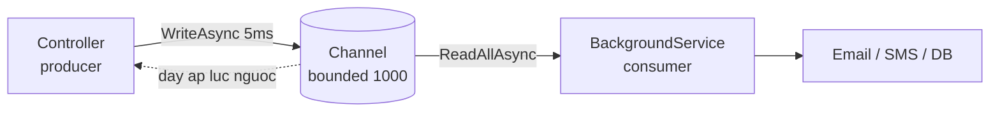

# 6.8 — 7. Channels và Producer-Consumer

> Nguồn: https://tiennhm.io.vn/docs/dotnet-backend-zero-to-senior/stage-02-csharp-professional/module-06-async-programming/6.8-channels-and-producer-consumer
> System.Threading.Channels: hàng đợi trong tiến trình không cần lock, backpressure với bounded channel, và BackgroundService làm consumer đúng cách.

> `System.Threading.Channels` là **hàng đợi trong bộ nhớ, không khoá, có hỗ trợ async** — thứ bạn cần khi một phần code sinh việc nhanh hơn phần kia xử lý được. Quyết định quan trọng nhất là **bounded hay unbounded**: unbounded chịu mọi tải cho tới lúc hết RAM, bounded thì **đẩy áp lực ngược về phía producer** để hệ thống chậm lại thay vì chết. Hai cái bẫy hay gặp nhất: dùng `IHostedService.StartAsync` làm consumer (nó **chặn khởi động** của cả ứng dụng), và quên rằng channel nằm trong RAM nên **restart là mất sạch**.

## Mục tiêu bài học

Sau bài này bạn có thể:

- Giải thích channel giải quyết vấn đề gì mà `Task.Run` không giải quyết được.
- Chọn đúng giữa bounded và unbounded, và đúng `FullMode`.
- Viết consumer bằng `BackgroundService` với scope DI đúng cách.
- Đóng channel gọn gàng khi ứng dụng shutdown.
- Biết khi nào phải bỏ channel và dùng message broker thật.

## Nội dung bài học

### 6.9.1 — Vấn đề: producer nhanh hơn consumer

Endpoint nhận webhook mất 5ms; xử lý mỗi webhook mất 400ms. Xử lý ngay trong request thì client chờ 400ms và bạn chịu tải bằng tốc độ xử lý. Fire-and-forget thì mất việc khi shutdown ([bài 6.7](6.6-async-patterns.mdx)).

Channel tách hai bên ra:



Producer trả lời ngay; consumer xử lý theo nhịp của nó; và khi hàng đợi đầy, producer **bị làm chậm lại** thay vì hệ thống sụp.

### 6.9.2 — Bounded và unbounded

```csharp
// UNBOUNDED — không giới hạn. Producer không bao giờ bị chặn.
var unbounded = Channel.CreateUnbounded<Job>();

// BOUNDED — tối đa 1000. Đầy thì WriteAsync chờ.
var bounded = Channel.CreateBounded<Job>(new BoundedChannelOptions(1000)
{
    FullMode = BoundedChannelFullMode.Wait
});
```

Unbounded có một vấn đề duy nhất nhưng chí mạng: nếu producer bền bỉ nhanh hơn consumer, hàng đợi lớn dần cho tới khi tiến trình **hết bộ nhớ**. Và nó chết vào lúc tải cao nhất, tức đúng lúc tệ nhất.

Với bounded, bốn lựa chọn khi đầy:

| `FullMode` | Hành vi | Dùng khi |
|---|---|---|
| `Wait` | `WriteAsync` chờ đến khi có chỗ | Mặc định — không được mất việc |
| `DropWrite` | Bỏ item mới | Telemetry, metric — mới hay cũ đều được |
| `DropOldest` | Bỏ item cũ nhất | Dữ liệu realtime, chỉ cần cái mới nhất |
| `DropNewest` | Bỏ item mới nhất trong hàng đợi | Hiếm dùng |

`Wait` là thứ tạo ra **backpressure**: producer chậm lại, request tồn đọng, load balancer thấy và ngừng gửi thêm. Hệ thống suy giảm dần thay vì sập đột ngột.

Có hai tuỳ chọn tối ưu đáng bật khi bạn chắc chắn về mô hình:

```csharp
new BoundedChannelOptions(1000)
{
    FullMode = BoundedChannelFullMode.Wait,
    SingleReader = true,    // chỉ một consumer
    SingleWriter = false,   // nhiều request cùng ghi
}
```

`SingleReader = true` cho phép runtime bỏ bớt đồng bộ hoá nội bộ. Khai báo sai thì **hỏng âm thầm** — chỉ bật khi đúng.

### 6.9.3 — Producer và consumer

```csharp
public interface IJobQueue
{
    ValueTask EnqueueAsync(Job job, CancellationToken ct = default);
    IAsyncEnumerable<Job> ReadAllAsync(CancellationToken ct);
    void Complete();
}

public sealed class JobQueue : IJobQueue
{
    private readonly Channel<Job> _channel = Channel.CreateBounded<Job>(
        new BoundedChannelOptions(1000)
        {
            FullMode = BoundedChannelFullMode.Wait,
            SingleReader = true,
        });

    public ValueTask EnqueueAsync(Job job, CancellationToken ct = default)
        => _channel.Writer.WriteAsync(job, ct);

    public IAsyncEnumerable<Job> ReadAllAsync(CancellationToken ct)
        => _channel.Reader.ReadAllAsync(ct);

    public void Complete() => _channel.Writer.Complete();
}
```

`WriteAsync` trả `ValueTask` chứ không phải `Task` — vì với channel chưa đầy nó hoàn thành **đồng bộ** và không cấp phát gì. Đây đúng là trường hợp `ValueTask` sinh ra để phục vụ ([bài 6.3](6.2-task-and-async-await.mdx)).

Có cả bản không chờ, dùng khi bạn không muốn producer bị chặn:

```csharp
if (!_channel.Writer.TryWrite(job))
    _logger.LogWarning("Hàng đợi đầy, bỏ qua job {Id}", job.Id);
```

### 6.9.4 — Consumer phải là `BackgroundService`, không phải `IHostedService.StartAsync`

Đây là lỗi hay gặp nhất trong bài này:

```csharp
// SAI — StartAsync không bao giờ trả về, ứng dụng không bao giờ khởi động xong
public async Task StartAsync(CancellationToken ct)
{
    await foreach (var job in _queue.ReadAllAsync(ct))
        await ProcessAsync(job, ct);
}
```

Host gọi `StartAsync` của từng hosted service **tuần tự** và chờ từng cái xong trước khi mở cổng HTTP. Vòng lặp trên chạy mãi, nên ứng dụng **treo ở bước khởi động** — không có log lỗi, chỉ là không bao giờ sẵn sàng.

```csharp
public sealed class JobProcessor : BackgroundService
{
    private readonly IJobQueue _queue;
    private readonly IServiceScopeFactory _scopeFactory;
    private readonly ILogger<JobProcessor> _logger;

    public JobProcessor(IJobQueue queue, IServiceScopeFactory scopeFactory, ILogger<JobProcessor> logger)
        => (_queue, _scopeFactory, _logger) = (queue, scopeFactory, logger);

    protected override async Task ExecuteAsync(CancellationToken stoppingToken)
    {
        await foreach (var job in _queue.ReadAllAsync(stoppingToken))
        {
            try
            {
                await using var scope = _scopeFactory.CreateAsyncScope();
                var handler = scope.ServiceProvider.GetRequiredService<IJobHandler>();
                await handler.HandleAsync(job, stoppingToken);
            }
            catch (OperationCanceledException) when (stoppingToken.IsCancellationRequested)
            {
                break;
            }
            catch (Exception ex)
            {
                _logger.LogError(ex, "Job {Id} thất bại", job.Id);
                // KHÔNG throw — một job hỏng không được làm chết consumer
            }
        }
    }
}
```

Ba điểm bắt buộc:

1. **`ExecuteAsync`, không phải `StartAsync`.** `BackgroundService.StartAsync` gọi `ExecuteAsync` và trả về ngay tại `await` đầu tiên.
2. **`try/catch` bao quanh từng job.** Exception thoát ra khỏi `ExecuteAsync` giết consumer vĩnh viễn — hàng đợi vẫn nhận việc nhưng không ai xử lý nữa.
3. **Tạo scope riêng cho mỗi job.** `BackgroundService` là singleton; lấy thẳng `DbContext` (scoped) vào constructor là lỗi vòng đời. Xem [Module 7 — Dependency Injection](../module-07-dependency-injection/).

Đăng ký:

```csharp
builder.Services.AddSingleton<IJobQueue, JobQueue>();
builder.Services.AddHostedService<JobProcessor>();
```

### 6.9.5 — Nhiều consumer song song

```csharp
protected override async Task ExecuteAsync(CancellationToken stoppingToken)
{
    var workers = Enumerable.Range(0, 4).Select(_ => ConsumeAsync(stoppingToken)).ToList();
    await Task.WhenAll(workers);
}
```

Nhớ đặt `SingleReader = false` khi làm vậy. Channel tự chia việc — mỗi item chỉ đến **một** consumer.

Đây là cách tăng thông lượng mà vẫn giữ trần tài nguyên: bốn consumer nghĩa là nhiều nhất bốn job chạy cùng lúc, bất kể hàng đợi dài bao nhiêu.

### 6.9.6 — Shutdown gọn gàng

```csharp
public override async Task StopAsync(CancellationToken ct)
{
    _queue.Complete();          // không nhận việc mới nữa
    await base.StopAsync(ct);   // chờ ExecuteAsync kết thúc
}
```

`Writer.Complete()` khiến `ReadAllAsync` kết thúc **sau khi** đã trả hết những gì còn trong hàng đợi — nên việc đang chờ vẫn được xử lý.

Nhưng có một giới hạn cứng: host chỉ chờ mặc định **5 giây**, sau đó huỷ token và đi tiếp. Việc chưa xong bị cắt.

```csharp
builder.Services.Configure<HostOptions>(o =>
    o.ShutdownTimeout = TimeSpan.FromSeconds(30));
```

### 6.9.7 — Khi nào channel là sai lựa chọn

Channel sống trong **bộ nhớ của một tiến trình**. Hệ quả:

- **Restart hoặc crash là mất sạch** hàng đợi. Không persistence, không replay.
- **Không chia sẻ giữa các instance.** Ba pod Kubernetes là ba hàng đợi riêng biệt.
- **Không có retry, không có dead-letter** — bạn phải tự viết.

| Dùng | Khi |
|---|---|
| `Channel` | Việc trong tiến trình, mất cũng chấp nhận được: log, metric, cache warm-up, gửi email không quan trọng |
| Hangfire / Quartz | Cần persistence và retry, vẫn một ứng dụng, có sẵn database |
| RabbitMQ / Kafka / Azure Service Bus | Nhiều service, nhiều instance, không được mất message |

Câu hỏi quyết định rất đơn giản: **"mất một item khi server restart thì có sao không?"** Nếu có sao, đừng dùng channel. Xem [Module 14 — Caching và Background Jobs](../../stage-04-database-production/module-14-caching-background-jobs/) và [Module 17 — Distributed Systems](../../stage-05-senior-engineering/module-17-distributed-systems/).

### 6.9.8 — Rà lại code của bạn

**Danh sách rà soát Channels**

- [ ] Channel dùng CreateBounded, không phải CreateUnbounded.
- [ ] FullMode được chọn có chủ đích, không để mặc định vì tiện.
- [ ] Consumer kế thừa BackgroundService và ghi đè ExecuteAsync.
- [ ] Mỗi job được xử lý trong try/catch riêng, exception không thoát ra ExecuteAsync.
- [ ] Mỗi job tạo scope DI riêng qua IServiceScopeFactory.
- [ ] StopAsync gọi Writer.Complete() trước khi chờ.
- [ ] ShutdownTimeout đủ dài cho job dài nhất.
- [ ] SingleReader/SingleWriter khớp với số consumer/producer thực tế.
- [ ] Đã trả lời được: mất một item khi restart thì có sao không?

## Bài tập áp dụng

#### Bài 1 — Thấy áp lực ngược

Tạo bounded channel sức chứa 10 với `FullMode.Wait`, producer ghi 1000 mục không nghỉ, consumer chờ 50 mili-giây mỗi mục. Đo thời gian mỗi lần `WriteAsync`.

**Tiêu chí hoàn thành:** bạn thấy rõ producer bị kéo về đúng nhịp của consumer, và nêu được điều gì xảy ra nếu dùng unbounded thay vào đó.

Gợi ý và lời giải — Bài 1

**Gợi ý.** `WriteAsync` trên một channel đầy sẽ **chờ** cho tới khi có chỗ trống. Thời gian chờ đó chính là áp lực ngược, và bạn đo được nó.

**Lời giải.**

```csharp
var ch = Channel.CreateBounded<int>(new BoundedChannelOptions(10)
{
    FullMode = BoundedChannelFullMode.Wait
});

// Consumer — chậm
var consumer = Task.Run(async () =>
{
    await foreach (var x in ch.Reader.ReadAllAsync())
        await Task.Delay(50);
});

// Producer — nhanh, đo thời gian mỗi lần ghi
var sw = new Stopwatch();
for (int i = 0; i < 1000; i++)
{
    sw.Restart();
    await ch.Writer.WriteAsync(i);
    sw.Stop();
    if (i < 15 || i % 100 == 0)
        Console.WriteLine($"ghi {i,4}: {sw.Elapsed.TotalMilliseconds,6:F1} ms");
}
ch.Writer.Complete();
await consumer;
```

**Kết quả điển hình:**

```text
ghi    0:    0.1 ms      <- channel còn trống
ghi    1:    0.0 ms
...
ghi    9:    0.0 ms      <- channel vừa đầy
ghi   10:   49.8 ms      <- BẮT ĐẦU CHỜ
ghi   11:   50.1 ms
ghi  100:   50.0 ms
ghi  500:   49.9 ms
ghi  900:   50.0 ms
```

Mười lần ghi đầu gần như tức thì — channel còn chỗ. Từ lần thứ 11, mỗi lần ghi mất đúng **50 mili-giây**: producer đã bị kéo về đúng nhịp của consumer.

**Đây chính là áp lực ngược.** Hệ thống tự điều chỉnh: bên nhanh phải chờ bên chậm, không cần ai cấu hình gì thêm.

**Nếu dùng unbounded thay vào đó:**

```csharp
var ch = Channel.CreateUnbounded<int>();
```

```text
ghi    0:  0.0 ms
ghi  999:  0.0 ms      <- KHÔNG BAO GIỜ chờ
```

Producer ghi xong 1000 mục trong vài mili-giây, còn consumer mới xử lý được khoảng 20 mục. 980 mục còn lại nằm trong bộ nhớ.

Với 1000 mục thì không sao. Với một producer chạy liên tục nhanh hơn consumer, hàng đợi **tăng vô hạn** cho tới khi tiến trình hết bộ nhớ. Và triệu chứng rất khó chẩn đoán: bộ nhớ tăng đều, không có rò rỉ nào theo nghĩa thông thường, mọi thứ "hoạt động bình thường" cho tới lúc sập.

**Bốn chế độ của bounded channel:**

| `FullMode` | Hành vi khi đầy | Dùng khi |
|---|---|---|
| `Wait` | Producer chờ | **Mặc định** — không được mất dữ liệu |
| `DropOldest` | Bỏ mục cũ nhất | Dữ liệu đo lường, chỉ cần giá trị mới nhất |
| `DropNewest` | Bỏ mục vừa ghi | Hiếm dùng |
| `DropWrite` | Bỏ lặng lẽ, `WriteAsync` trả về ngay | Log không quan trọng |

**Chọn sức chứa bao nhiêu.** Nó là bộ đệm hấp thụ các đợt tăng đột biến ngắn. Quá nhỏ thì producer chờ liên tục ngay cả với biến động bình thường; quá lớn thì độ trễ tăng và bộ nhớ tốn. Điểm khởi đầu hợp lý: đủ chứa lượng công việc của **vài giây** ở nhịp bình thường.

**Vì sao áp lực ngược quan trọng hơn vẻ ngoài.** Nó là cách hệ thống **nói cho bạn biết** rằng consumer không theo kịp. Với unbounded, tín hiệu đó bị che giấu cho tới khi quá muộn. Nhiều sự cố hết bộ nhớ trong hệ thống hàng đợi có nguyên nhân gốc chỉ là một dòng `CreateUnbounded`.

#### Bài 2 — Tái hiện treo khởi động

Viết consumer bằng `IHostedService.StartAsync` với vòng lặp `await foreach`, chạy ứng dụng và xác nhận nó không bao giờ nhận request. Chuyển sang `BackgroundService` và xác nhận nó khởi động bình thường.

**Tiêu chí hoàn thành:** bạn giải thích được khác biệt giữa hai cách, và nêu được khi nào `IHostedService` vẫn là lựa chọn đúng.

Gợi ý và lời giải — Bài 2

**Gợi ý.** Host gọi `StartAsync` của **từng** dịch vụ theo thứ tự và **chờ từng cái xong** trước khi chuyển sang cái tiếp theo. Vậy chuyện gì xảy ra nếu một `StartAsync` không bao giờ trả về?

**Lời giải — bản treo:**

```csharp
public class EmailConsumer : IHostedService
{
    private readonly EmailQueue _q;

    public async Task StartAsync(CancellationToken ct)
    {
        await foreach (var job in _q.ReadAllAsync(ct))     // KHÔNG BAO GIỜ kết thúc
            await ProcessAsync(job, ct);
    }

    public Task StopAsync(CancellationToken ct) => Task.CompletedTask;
}
```

Chạy ứng dụng:

```text
info: Microsoft.Hosting.Lifetime[0]
      Application starting...
(dừng ở đây mãi mãi — không có dòng "Now listening on: http://localhost:5000")
```

Máy chủ web **không bao giờ khởi động**, vì host còn đang chờ `StartAsync` trả về.

**Bản đúng:**

```csharp
public class EmailConsumer(EmailQueue q) : BackgroundService
{
    protected override async Task ExecuteAsync(CancellationToken stoppingToken)
    {
        await foreach (var job in q.ReadAllAsync(stoppingToken))
            await ProcessAsync(job, stoppingToken);
    }
}
```

```text
info: Microsoft.Hosting.Lifetime[0]
      Now listening on: http://localhost:5000
```

**Khác biệt.** `BackgroundService` cài đặt sẵn `IHostedService`, và trong `StartAsync` nó **gọi `ExecuteAsync` rồi trả về ngay** mà không chờ:

```csharp
// Xấp xỉ cài đặt bên trong BackgroundService
public Task StartAsync(CancellationToken ct)
{
    _executeTask = ExecuteAsync(_stoppingCts.Token);   // không await
    return _executeTask.IsCompleted ? _executeTask : Task.CompletedTask;
}
```

Nó vẫn **giữ tham chiếu** tới task, nên khi ứng dụng tắt, `StopAsync` huỷ token và chờ task kết thúc gọn gàng. Đây chính là fire-and-forget **làm đúng cách** — khác với `_ = MethodAsync()` ở [bài 6.7](6.6-async-patterns.mdx), nơi không ai giữ task.

**Khi nào `IHostedService` vẫn đúng.** Khi bạn cần làm một việc **có điểm kết thúc** trong lúc khởi động hoặc tắt:

```csharp
public class MigrationRunner(IServiceScopeFactory sf) : IHostedService
{
    public async Task StartAsync(CancellationToken ct)
    {
        using var scope = sf.CreateScope();
        var db = scope.ServiceProvider.GetRequiredService<CrmDbContext>();
        await db.Database.MigrateAsync(ct);      // CÓ kết thúc — và ta MUỐN chờ
    }

    public Task StopAsync(CancellationToken ct) => Task.CompletedTask;
}
```

Ở đây việc chặn khởi động là **có chủ ý**: ứng dụng không nên nhận request trước khi database đã sẵn sàng.

**Bảng chọn:**

| Nhu cầu | Dùng |
|---|---|
| Vòng lặp chạy suốt vòng đời ứng dụng | `BackgroundService` |
| Việc một lần lúc khởi động, phải xong trước khi nhận request | `IHostedService` |
| Việc một lần lúc tắt | `IHostedService`, phần `StopAsync` |
| Việc chạy theo lịch | `BackgroundService` kèm `PeriodicTimer` |

**Một chi tiết về `PeriodicTimer`.** Với tác vụ định kỳ, nó tốt hơn `Task.Delay` trong vòng lặp vì nó không bị trôi thời gian:

```csharp
using var timer = new PeriodicTimer(TimeSpan.FromMinutes(5));
while (await timer.WaitForNextTickAsync(stoppingToken))
    await ProcessAsync(stoppingToken);
```

`Task.Delay(5 phút)` sau mỗi lần xử lý nghĩa là chu kỳ thật bằng 5 phút **cộng** thời gian xử lý, và sai lệch tích luỹ dần.

#### Bài 3 — Giết consumer bằng một ngoại lệ

Bỏ `try/catch` quanh thân vòng lặp, đẩy vào một công việc gây ngoại lệ, rồi đẩy tiếp 10 công việc hợp lệ. Xác nhận 10 công việc đó không bao giờ được xử lý dù ứng dụng vẫn chạy.

**Tiêu chí hoàn thành:** bạn xác nhận được ứng dụng **vẫn chạy bình thường** trong khi consumer đã chết — và nêu được cách phát hiện tình trạng này.

Gợi ý và lời giải — Bài 3

**Gợi ý.** Khi `ExecuteAsync` ném ra ngoài, `BackgroundService` không tự khởi động lại nó. Và mặc định, ngoại lệ đó cũng không làm sập ứng dụng.

**Lời giải — bản dễ vỡ:**

```csharp
protected override async Task ExecuteAsync(CancellationToken stoppingToken)
{
    await foreach (var job in _q.ReadAllAsync(stoppingToken))
        await ProcessAsync(job, stoppingToken);      // ném -> thoát vòng lặp -> consumer chết
}
```

Thử:

```csharp
await q.EnqueueAsync(new Job("FAIL"), ct);                   // gây ngoại lệ
for (int i = 1; i <= 10; i++)
    await q.EnqueueAsync(new Job($"valid-{i}"), ct);
```

**Kết quả:** công việc `FAIL` ném ngoại lệ, consumer thoát vòng lặp. Mười công việc hợp lệ nằm mãi trong hàng đợi. Ứng dụng **vẫn phục vụ HTTP bình thường**, health check vẫn xanh, không có dấu hiệu nào cho thấy có vấn đề.

Đây là loại sự cố tệ nhất: **một phần hệ thống chết trong khi mọi chỉ số bề mặt đều bình thường.**

**Bản đúng:**

```csharp
protected override async Task ExecuteAsync(CancellationToken stoppingToken)
{
    await foreach (var job in _q.ReadAllAsync(stoppingToken))
    {
        try
        {
            await ProcessAsync(job, stoppingToken);
        }
        catch (OperationCanceledException) when (stoppingToken.IsCancellationRequested)
        {
            break;                                   // tắt ứng dụng — thoát gọn gàng
        }
        catch (Exception ex)
        {
            _logger.LogError(ex, "Job {JobId} thất bại", job.Id);
            // KHÔNG ném lại — một job hỏng không được giết cả consumer
        }
    }
}
```

Hai khối `catch` có vai trò khác hẳn nhau:

- Khối đầu bắt **tín hiệu tắt** và thoát gọn gàng.
- Khối sau bắt **lỗi của một công việc** và đi tiếp.

Thiếu khối đầu thì log đầy ngoại lệ mỗi lần triển khai. Thiếu khối sau thì một công việc hỏng giết cả consumer.

**Hành vi mặc định khi `ExecuteAsync` ném.** Từ .NET 6, `BackgroundServiceExceptionBehavior` mặc định là `StopHost` — ứng dụng **sẽ** dừng lại. Đó là hành vi hợp lý, nhưng nhiều dự án đổi nó đi:

```csharp
builder.Services.Configure<HostOptions>(o =>
    o.BackgroundServiceExceptionBehavior = BackgroundServiceExceptionBehavior.Ignore);
```

Với `Ignore`, bạn có đúng tình huống mô tả ở trên: consumer chết im lặng. Nếu dự án của bạn có dòng này, hãy chắc rằng mỗi consumer đều tự xử lý lỗi bên trong.

**Ba cách phát hiện consumer đã chết:**

1. **Health check dựa trên nhịp tim.** Consumer cập nhật một mốc thời gian sau mỗi vòng; health check báo không khoẻ nếu mốc đó quá cũ:

   ```csharp
   builder.Services.AddHealthChecks()
       .AddCheck<EmailConsumerHealthCheck>("email-consumer", tags: ["ready"]);
   ```

2. **Cảnh báo theo độ dài hàng đợi.** Hàng đợi chỉ tăng mà không giảm là dấu hiệu rõ ràng consumer không còn làm việc.

3. **Đếm số công việc đã xử lý.** Xuất một chỉ số và cảnh báo khi nó ngừng tăng trong khi hàng đợi vẫn có việc.

**Nâng cấp đáng làm: xử lý công việc lỗi.** Thay vì chỉ ghi log rồi bỏ, hãy có chiến lược:

```csharp
catch (Exception ex)
{
    _logger.LogError(ex, "Job {JobId} thất bại lần {Lần}", job.Id, job.RetryCount);

    if (job.RetryCount < 3)
        await _q.EnqueueAsync(job with { RetryCount = job.RetryCount + 1 }, stoppingToken);
    else
        await _deadLetter.SaveAsync(job, ex, stoppingToken);
}
```

Mẫu hàng đợi thư chết này được [Module 17](../../stage-05-senior-engineering/module-17-distributed-systems/) trình bày đầy đủ, kèm cả chiến lược chờ tăng dần giữa các lần thử lại.

## Tự kiểm tra

### Channel giải quyết vấn đề gì?

Nó tách producer khỏi consumer khi một bên sinh việc nhanh hơn bên kia xử lý được. Producer trả lời ngay, consumer xử lý theo nhịp của nó, và khi hàng đợi đầy thì producer bị làm chậm lại thay vì hệ thống sụp. Đây là hàng đợi trong bộ nhớ, không cần lock và hỗ trợ async.

### Nên chọn bounded hay unbounded?

Gần như luôn là bounded. Unbounded không chặn producer nên nếu producer bền bỉ nhanh hơn consumer thì hàng đợi lớn dần cho tới khi tiến trình hết bộ nhớ, và nó chết đúng vào lúc tải cao nhất. Bounded với FullMode Wait tạo ra backpressure nên hệ thống suy giảm dần thay vì sập đột ngột.

### Vì sao không được viết consumer trong IHostedService.StartAsync?

Vì host gọi StartAsync của từng hosted service tuần tự và chờ từng cái xong trước khi mở cổng HTTP. Một vòng lặp await foreach chạy mãi sẽ làm ứng dụng treo ở bước khởi động, không có log lỗi, chỉ là không bao giờ sẵn sàng. Đúng là kế thừa BackgroundService và ghi đè ExecuteAsync.

### Vì sao mỗi job cần scope DI riêng?

Vì BackgroundService là singleton, còn DbContext và phần lớn service nghiệp vụ là scoped. Lấy thẳng chúng vào constructor là lỗi vòng đời và sẽ dùng chung một instance cho mọi job. Cách đúng là tiêm IServiceScopeFactory rồi tạo scope mới cho từng job.

### Vì sao phải try/catch quanh từng job?

Vì exception thoát ra khỏi ExecuteAsync sẽ giết consumer vĩnh viễn. Hàng đợi vẫn nhận việc nhưng không còn ai xử lý, và ứng dụng vẫn chạy bình thường nên không ai phát hiện ra. Một job hỏng không được phép làm chết consumer.

### Khi nào không nên dùng Channel?

Khi không được phép mất việc. Channel sống trong bộ nhớ của một tiến trình nên restart hay crash là mất sạch, không chia sẻ được giữa các instance, và không có retry hay dead-letter. Câu hỏi quyết định là mất một item khi server restart thì có sao không; nếu có sao thì dùng Hangfire, RabbitMQ hoặc Kafka.

## Kết luận

Ba điều đáng nhớ nhất:

1. **Bounded channel là mặc định.** Backpressure giúp hệ thống chậm lại thay vì chết vì hết bộ nhớ.
2. **Consumer là `BackgroundService.ExecuteAsync`**, có `try/catch` quanh từng job và scope DI riêng cho từng job.
3. **Channel không có persistence.** Mất việc khi restart là chấp nhận được thì dùng; không thì cần broker thật.

## Tham khảo

- [System.Threading.Channels](https://learn.microsoft.com/en-us/dotnet/core/extensions/channels)
- [Background tasks with hosted services in ASP.NET Core](https://learn.microsoft.com/en-us/aspnet/core/fundamentals/host/hosted-services)
- [Queued background tasks](https://learn.microsoft.com/en-us/aspnet/core/fundamentals/host/hosted-services#queued-background-tasks)
- [Task Parallel Library (TPL)](https://learn.microsoft.com/en-us/dotnet/standard/parallel-programming/task-parallel-library-tpl)

## Điều hướng

- **Bài trước:** [6.7 — 6. Common Pitfalls](6.7-common-pitfalls.mdx)
- **Bài tiếp theo:** [6.9 — Mở rộng và đào sâu](6.9-advanced-notes.mdx)
- **Về module:** [Trang mục lục](./)
