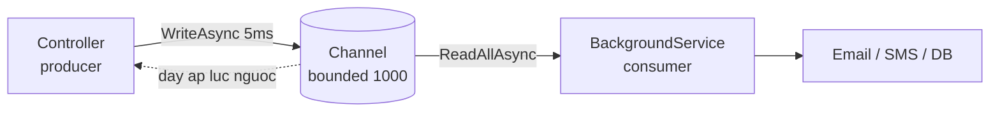

# 6.9 — 7. Channels và Producer-Consumer

> Nguồn: https://tiennhm.io.vn/docs/dotnet-backend-zero-to-senior/stage-02-csharp-professional/module-06-async-programming/6.9-channels-and-producer-consumer
> System.Threading.Channels: hàng đợi trong tiến trình không cần lock, backpressure với bounded channel, và BackgroundService làm consumer đúng cách.

> `System.Threading.Channels` là **hàng đợi trong bộ nhớ, không khoá, có hỗ trợ async** — thứ bạn cần khi một phần code sinh việc nhanh hơn phần kia xử lý được. Quyết định quan trọng nhất là **bounded hay unbounded**: unbounded chịu mọi tải cho tới lúc hết RAM, bounded thì **đẩy áp lực ngược về phía producer** để hệ thống chậm lại thay vì chết. Hai cái bẫy hay gặp nhất: dùng `IHostedService.StartAsync` làm consumer (nó **chặn khởi động** của cả ứng dụng), và quên rằng channel nằm trong RAM nên **restart là mất sạch**.

## Mục tiêu bài học

Sau bài này bạn có thể:

- Giải thích channel giải quyết vấn đề gì mà `Task.Run` không giải quyết được.
- Chọn đúng giữa bounded và unbounded, và đúng `FullMode`.
- Viết consumer bằng `BackgroundService` với scope DI đúng cách.
- Đóng channel gọn gàng khi ứng dụng shutdown.
- Biết khi nào phải bỏ channel và dùng message broker thật.

## Nội dung bài học

### 6.9.1 — Vấn đề: producer nhanh hơn consumer

Endpoint nhận webhook mất 5ms; xử lý mỗi webhook mất 400ms. Xử lý ngay trong request thì client chờ 400ms và bạn chịu tải bằng tốc độ xử lý. Fire-and-forget thì mất việc khi shutdown ([bài 6.7](6.7-async-patterns.mdx)).

Channel tách hai bên ra:



Producer trả lời ngay; consumer xử lý theo nhịp của nó; và khi hàng đợi đầy, producer **bị làm chậm lại** thay vì hệ thống sụp.

### 6.9.2 — Bounded và unbounded

```csharp
// UNBOUNDED — khong gioi han. Producer khong bao gio bi chan.
var unbounded = Channel.CreateUnbounded<Job>();

// BOUNDED — toi da 1000. Day thi WriteAsync cho.
var bounded = Channel.CreateBounded<Job>(new BoundedChannelOptions(1000)
{
    FullMode = BoundedChannelFullMode.Wait
});
```

Unbounded có một vấn đề duy nhất nhưng chí mạng: nếu producer bền bỉ nhanh hơn consumer, hàng đợi lớn dần cho tới khi tiến trình **hết bộ nhớ**. Và nó chết vào lúc tải cao nhất, tức đúng lúc tệ nhất.

Với bounded, bốn lựa chọn khi đầy:

| `FullMode` | Hành vi | Dùng khi |
|---|---|---|
| `Wait` | `WriteAsync` chờ đến khi có chỗ | Mặc định — không được mất việc |
| `DropWrite` | Bỏ item mới | Telemetry, metric — mới hay cũ đều được |
| `DropOldest` | Bỏ item cũ nhất | Dữ liệu realtime, chỉ cần cái mới nhất |
| `DropNewest` | Bỏ item mới nhất trong hàng đợi | Hiếm dùng |

`Wait` là thứ tạo ra **backpressure**: producer chậm lại, request tồn đọng, load balancer thấy và ngừng gửi thêm. Hệ thống suy giảm dần thay vì sập đột ngột.

Có hai tuỳ chọn tối ưu đáng bật khi bạn chắc chắn về mô hình:

```csharp
new BoundedChannelOptions(1000)
{
    FullMode = BoundedChannelFullMode.Wait,
    SingleReader = true,    // chi mot consumer
    SingleWriter = false,   // nhieu request cung ghi
}
```

`SingleReader = true` cho phép runtime bỏ bớt đồng bộ hoá nội bộ. Khai báo sai thì **hỏng âm thầm** — chỉ bật khi đúng.

### 6.9.3 — Producer và consumer

```csharp
public interface IJobQueue
{
    ValueTask EnqueueAsync(Job job, CancellationToken ct = default);
    IAsyncEnumerable<Job> ReadAllAsync(CancellationToken ct);
    void Complete();
}

public sealed class JobQueue : IJobQueue
{
    private readonly Channel<Job> _channel = Channel.CreateBounded<Job>(
        new BoundedChannelOptions(1000)
        {
            FullMode = BoundedChannelFullMode.Wait,
            SingleReader = true,
        });

    public ValueTask EnqueueAsync(Job job, CancellationToken ct = default)
        => _channel.Writer.WriteAsync(job, ct);

    public IAsyncEnumerable<Job> ReadAllAsync(CancellationToken ct)
        => _channel.Reader.ReadAllAsync(ct);

    public void Complete() => _channel.Writer.Complete();
}
```

`WriteAsync` trả `ValueTask` chứ không phải `Task` — vì với channel chưa đầy nó hoàn thành **đồng bộ** và không cấp phát gì. Đây đúng là trường hợp `ValueTask` sinh ra để phục vụ ([bài 6.3](6.3-task-and-async-await.mdx)).

Có cả bản không chờ, dùng khi bạn không muốn producer bị chặn:

```csharp
if (!_channel.Writer.TryWrite(job))
    _logger.LogWarning("Hang doi day, bo qua job {Id}", job.Id);
```

### 6.9.4 — Consumer phải là `BackgroundService`, không phải `IHostedService.StartAsync`

Đây là lỗi hay gặp nhất trong bài này:

```csharp
// SAI — StartAsync khong bao gio tra ve, ung dung khong bao gio khoi dong xong
public async Task StartAsync(CancellationToken ct)
{
    await foreach (var job in _queue.ReadAllAsync(ct))
        await ProcessAsync(job, ct);
}
```

Host gọi `StartAsync` của từng hosted service **tuần tự** và chờ từng cái xong trước khi mở cổng HTTP. Vòng lặp trên chạy mãi, nên ứng dụng **treo ở bước khởi động** — không có log lỗi, chỉ là không bao giờ sẵn sàng.

```csharp
public sealed class JobProcessor : BackgroundService
{
    private readonly IJobQueue _queue;
    private readonly IServiceScopeFactory _scopeFactory;
    private readonly ILogger<JobProcessor> _logger;

    public JobProcessor(IJobQueue queue, IServiceScopeFactory scopeFactory, ILogger<JobProcessor> logger)
        => (_queue, _scopeFactory, _logger) = (queue, scopeFactory, logger);

    protected override async Task ExecuteAsync(CancellationToken stoppingToken)
    {
        await foreach (var job in _queue.ReadAllAsync(stoppingToken))
        {
            try
            {
                await using var scope = _scopeFactory.CreateAsyncScope();
                var handler = scope.ServiceProvider.GetRequiredService<IJobHandler>();
                await handler.HandleAsync(job, stoppingToken);
            }
            catch (OperationCanceledException) when (stoppingToken.IsCancellationRequested)
            {
                break;
            }
            catch (Exception ex)
            {
                _logger.LogError(ex, "Job {Id} that bai", job.Id);
                // KHONG throw — mot job hong khong duoc lam chet consumer
            }
        }
    }
}
```

Ba điểm bắt buộc:

1. **`ExecuteAsync`, không phải `StartAsync`.** `BackgroundService.StartAsync` gọi `ExecuteAsync` và trả về ngay tại `await` đầu tiên.
2. **`try/catch` bao quanh từng job.** Exception thoát ra khỏi `ExecuteAsync` giết consumer vĩnh viễn — hàng đợi vẫn nhận việc nhưng không ai xử lý nữa.
3. **Tạo scope riêng cho mỗi job.** `BackgroundService` là singleton; lấy thẳng `DbContext` (scoped) vào constructor là lỗi vòng đời. Xem [Module 7 — Dependency Injection](../module-07-dependency-injection/).

Đăng ký:

```csharp
builder.Services.AddSingleton<IJobQueue, JobQueue>();
builder.Services.AddHostedService<JobProcessor>();
```

### 6.9.5 — Nhiều consumer song song

```csharp
protected override async Task ExecuteAsync(CancellationToken stoppingToken)
{
    var workers = Enumerable.Range(0, 4).Select(_ => ConsumeAsync(stoppingToken)).ToList();
    await Task.WhenAll(workers);
}
```

Nhớ đặt `SingleReader = false` khi làm vậy. Channel tự chia việc — mỗi item chỉ đến **một** consumer.

Đây là cách tăng thông lượng mà vẫn giữ trần tài nguyên: bốn consumer nghĩa là nhiều nhất bốn job chạy cùng lúc, bất kể hàng đợi dài bao nhiêu.

### 6.9.6 — Shutdown gọn gàng

```csharp
public override async Task StopAsync(CancellationToken ct)
{
    _queue.Complete();          // khong nhan viec moi nua
    await base.StopAsync(ct);   // cho ExecuteAsync ket thuc
}
```

`Writer.Complete()` khiến `ReadAllAsync` kết thúc **sau khi** đã trả hết những gì còn trong hàng đợi — nên việc đang chờ vẫn được xử lý.

Nhưng có một giới hạn cứng: host chỉ chờ mặc định **5 giây**, sau đó huỷ token và đi tiếp. Việc chưa xong bị cắt.

```csharp
builder.Services.Configure<HostOptions>(o =>
    o.ShutdownTimeout = TimeSpan.FromSeconds(30));
```

### 6.9.7 — Khi nào channel là sai lựa chọn

Channel sống trong **bộ nhớ của một tiến trình**. Hệ quả:

- **Restart hoặc crash là mất sạch** hàng đợi. Không persistence, không replay.
- **Không chia sẻ giữa các instance.** Ba pod Kubernetes là ba hàng đợi riêng biệt.
- **Không có retry, không có dead-letter** — bạn phải tự viết.

| Dùng | Khi |
|---|---|
| `Channel` | Việc trong tiến trình, mất cũng chấp nhận được: log, metric, cache warm-up, gửi email không quan trọng |
| Hangfire / Quartz | Cần persistence và retry, vẫn một ứng dụng, có sẵn database |
| RabbitMQ / Kafka / Azure Service Bus | Nhiều service, nhiều instance, không được mất message |

Câu hỏi quyết định rất đơn giản: **"mất một item khi server restart thì có sao không?"** Nếu có sao, đừng dùng channel. Xem [Module 14 — Caching và Background Jobs](../../stage-04-database-production/module-14-caching-background-jobs/) và [Module 17 — Distributed Systems](../../stage-05-senior-engineering/module-17-distributed-systems/).

### 6.9.8 — Rà lại code của bạn

**Danh sách rà soát Channels**

- [ ] Channel dùng CreateBounded, không phải CreateUnbounded.
- [ ] FullMode được chọn có chủ đích, không để mặc định vì tiện.
- [ ] Consumer kế thừa BackgroundService và ghi đè ExecuteAsync.
- [ ] Mỗi job được xử lý trong try/catch riêng, exception không thoát ra ExecuteAsync.
- [ ] Mỗi job tạo scope DI riêng qua IServiceScopeFactory.
- [ ] StopAsync gọi Writer.Complete() trước khi chờ.
- [ ] ShutdownTimeout đủ dài cho job dài nhất.
- [ ] SingleReader/SingleWriter khớp với số consumer/producer thực tế.
- [ ] Đã trả lời được: mất một item khi restart thì có sao không?

## Bài tập áp dụng

1. **Thấy backpressure.** Tạo bounded channel sức chứa 10 với `FullMode.Wait`, producer ghi 1000 item không nghỉ, consumer `Task.Delay(50)` mỗi item. Đo thời gian mỗi lần `WriteAsync` và vẽ biểu đồ — bạn sẽ thấy producer bị kéo về đúng nhịp consumer.

2. **Tái hiện treo khởi động.** Viết consumer bằng `IHostedService.StartAsync` với vòng lặp `await foreach`, chạy ứng dụng và xác nhận nó không bao giờ nhận request. Chuyển sang `BackgroundService` và xác nhận nó khởi động bình thường.

3. **Giết consumer.** Bỏ `try/catch` quanh thân vòng lặp, đẩy vào một job gây exception, rồi đẩy tiếp 10 job hợp lệ. Xác nhận 10 job đó không bao giờ được xử lý dù ứng dụng vẫn chạy.

## Tự kiểm tra

### Channel giải quyết vấn đề gì?

Nó tách producer khỏi consumer khi một bên sinh việc nhanh hơn bên kia xử lý được. Producer trả lời ngay, consumer xử lý theo nhịp của nó, và khi hàng đợi đầy thì producer bị làm chậm lại thay vì hệ thống sụp. Đây là hàng đợi trong bộ nhớ, không cần lock và hỗ trợ async.

### Nên chọn bounded hay unbounded?

Gần như luôn là bounded. Unbounded không chặn producer nên nếu producer bền bỉ nhanh hơn consumer thì hàng đợi lớn dần cho tới khi tiến trình hết bộ nhớ, và nó chết đúng vào lúc tải cao nhất. Bounded với FullMode Wait tạo ra backpressure nên hệ thống suy giảm dần thay vì sập đột ngột.

### Vì sao không được viết consumer trong IHostedService.StartAsync?

Vì host gọi StartAsync của từng hosted service tuần tự và chờ từng cái xong trước khi mở cổng HTTP. Một vòng lặp await foreach chạy mãi sẽ làm ứng dụng treo ở bước khởi động, không có log lỗi, chỉ là không bao giờ sẵn sàng. Đúng là kế thừa BackgroundService và ghi đè ExecuteAsync.

### Vì sao mỗi job cần scope DI riêng?

Vì BackgroundService là singleton, còn DbContext và phần lớn service nghiệp vụ là scoped. Lấy thẳng chúng vào constructor là lỗi vòng đời và sẽ dùng chung một instance cho mọi job. Cách đúng là tiêm IServiceScopeFactory rồi tạo scope mới cho từng job.

### Vì sao phải try/catch quanh từng job?

Vì exception thoát ra khỏi ExecuteAsync sẽ giết consumer vĩnh viễn. Hàng đợi vẫn nhận việc nhưng không còn ai xử lý, và ứng dụng vẫn chạy bình thường nên không ai phát hiện ra. Một job hỏng không được phép làm chết consumer.

### Khi nào không nên dùng Channel?

Khi không được phép mất việc. Channel sống trong bộ nhớ của một tiến trình nên restart hay crash là mất sạch, không chia sẻ được giữa các instance, và không có retry hay dead-letter. Câu hỏi quyết định là mất một item khi server restart thì có sao không; nếu có sao thì dùng Hangfire, RabbitMQ hoặc Kafka.

## Kết luận

Ba điều đáng nhớ nhất:

1. **Bounded channel là mặc định.** Backpressure giúp hệ thống chậm lại thay vì chết vì hết bộ nhớ.
2. **Consumer là `BackgroundService.ExecuteAsync`**, có `try/catch` quanh từng job và scope DI riêng cho từng job.
3. **Channel không có persistence.** Mất việc khi restart là chấp nhận được thì dùng; không thì cần broker thật.

## Tham khảo

- [System.Threading.Channels](https://learn.microsoft.com/en-us/dotnet/core/extensions/channels)
- [Background tasks with hosted services in ASP.NET Core](https://learn.microsoft.com/en-us/aspnet/core/fundamentals/host/hosted-services)
- [Queued background tasks](https://learn.microsoft.com/en-us/aspnet/core/fundamentals/host/hosted-services#queued-background-tasks)
- [Task Parallel Library (TPL)](https://learn.microsoft.com/en-us/dotnet/standard/parallel-programming/task-parallel-library-tpl)

## Điều hướng

- **Bài trước:** [6.8 — 6. Common Pitfalls](6.8-common-pitfalls.mdx)
- **Bài tiếp theo:** [6.10 — Mở rộng và đào sâu](6.10-advanced-notes.mdx)
- **Về module:** [Trang mục lục](./)
